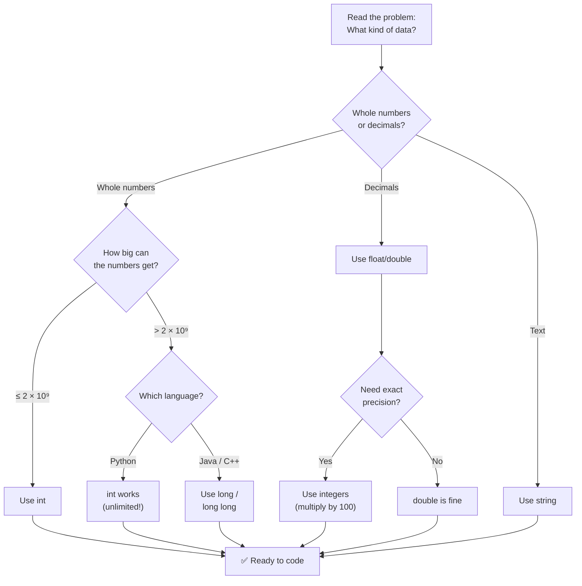
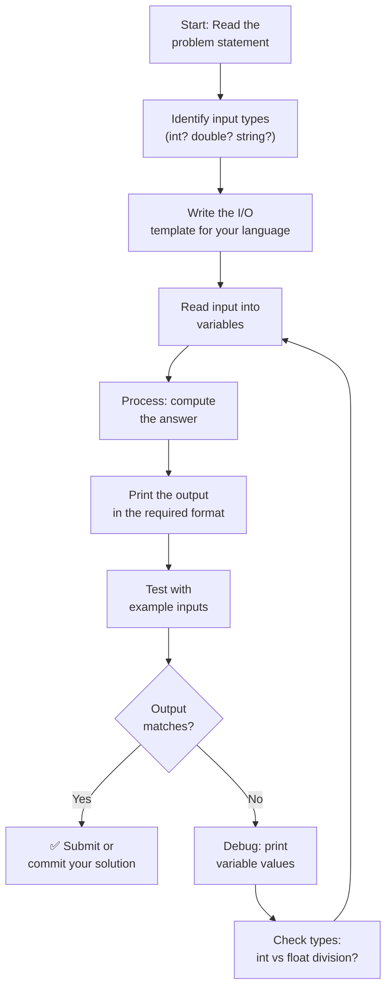

# Chapter 2: Your First Programs — Speaking Three Languages

## Chapter Goals

- [ ] **Declare variables** and understand the difference between dynamic typing (Python) and static typing (Java/C++)
- [ ] **Use the five fundamental data types**: integers, floating-point numbers, strings, booleans, and characters
- [ ] **Read input and write output** in Python, Java, and C++ using competitive programming patterns
- [ ] **Apply arithmetic, comparison, and assignment operators** to solve problems
- [ ] **Convert between types** (type casting) and understand when it happens automatically vs. when you need to do it explicitly

---

## The Story: "The Rosetta Stone"

In 1799, soldiers in Egypt found a stone slab with the same message carved in three different scripts: ancient Greek, Demotic, and hieroglyphics. For centuries, nobody could read hieroglyphics — it was a dead language. But because the stone had the same text in Greek (which scholars already knew), they were finally able to decode the other two.

That stone — the **Rosetta Stone** — unlocked an entire civilization's worth of knowledge.

You already know some Python and Java. They're your "ancient Greek." In this chapter, you'll use that knowledge to decode a third language: **C++**. We'll write the same programs in all three languages side by side, and you'll start to see that programming languages are more alike than they are different. The ideas are the same — only the spelling changes.

By the end of this chapter, you'll be able to "read the stone" in all three scripts.

---

## Johari Window: Before

Before diving in, take a moment to honestly assess where you are. Fill out the "Before" section of your [Johari Window worksheet](johari.md).


**Be honest!** The Johari Window only helps if you're truthful about what you know and don't know. There's no shame in "I have no idea" — that's where the best learning happens.


---

## Discovery

Before we explain anything, try these two problems. Use whatever language you're most comfortable with. Don't worry if you get stuck — that's the point!


**Try these BEFORE reading the explanation below.** Struggling with a problem teaches you more than reading the answer.


**Discovery Problem 1: The Temperature Converter**

> You're building an app for your science class. The user types a temperature in Celsius, and your program should print it in Fahrenheit. The formula is: `F = C × 9/5 + 32`. If the user types `100`, your program should print `212.0`.

Try writing this in Python first. Then try Java or C++. What went wrong? What was easy?

**Discovery Problem 2: The Swap**

> Read two integers from the user. Print them in reverse order. If the input is `3 7`, print `7 3`.

This sounds trivial — but here's the twist: can you swap the values stored in two variables *without* using a third variable? (Hint: think about addition and subtraction.)

---

## 2.1 Variables — Naming Your Data

A **variable** is a name that points to a piece of data. Think of it like a labeled box: the label is the variable name, and the contents is the value.



```python
# Python: just pick a name and assign a value
name = "Maya"
age = 14
height = 5.4
is_student = True
```

Python figures out the type automatically. You don't have to say "this is a string" — Python sees the quotes and knows.



```java
// Java: you MUST declare the type before the name
String name = "Maya";
int age = 14;
double height = 5.4;
boolean isStudent = true;
```

Java requires you to say what type each variable is. This is called **static typing** — the type is fixed when you write the code.



```cpp
// C++: same as Java — declare the type first
#include <string>
using namespace std;

string name = "Maya";
int age = 14;
double height = 5.4;
bool isStudent = true;
```

C++ also uses static typing. Notice `string` needs `#include <string>`, and we use `bool` (not `boolean` like Java).



> **Language Spotlight: Variable Declaration**
>
> | | Python | Java | C++ |
> |---|--------|------|-----|
> | **Must declare type?** | No (dynamic typing) | Yes (static typing) | Yes (static typing) |
> | **String type** | `str` (lowercase) | `String` (capital S!) | `string` (lowercase, needs `#include <string>`) |
> | **Boolean type** | `bool` (`True`/`False`, capitalized) | `boolean` (`true`/`false`, lowercase) | `bool` (`true`/`false`, lowercase) |
> | **Semicolons?** | No | Yes `;` | Yes `;` |
> | **Naming style** | `snake_case` | `camelCase` | `camelCase` or `snake_case` |

### Variable Naming Rules

All three languages share these rules:
- Names can contain letters, digits, and underscores
- Names **cannot** start with a digit (`2cool` is invalid, `cool2` is fine)
- Names are **case-sensitive** (`age` and `Age` are different variables)


**Good variable names describe what they hold.** Use `student_count` instead of `x`. Use `total_price` instead of `tp`. Your future self will thank you when reading your code six months later.


---

## 2.2 Data Types — The Building Blocks

Every value in your program has a **type**. The type determines what you can do with it — you can add two numbers, but you can't add a number and a name (well, not without converting first).

Here are the five types you'll use constantly:

### Integers (Whole Numbers)



```python
count = 42
negative = -17
big = 999999999999999999   # Python handles huge numbers automatically!
```



```java
int count = 42;             // -2 billion to +2 billion
long big = 999999999999L;   // Need 'long' for huge numbers (note the L!)
```



```cpp
int count = 42;                     // -2 billion to +2 billion
long long big = 999999999999LL;     // Need 'long long' for huge numbers
```



> **Language Spotlight: Integer Limits**
>
> | | Python | Java | C++ |
> |---|--------|------|-----|
> | **Default int range** | Unlimited! | -2,147,483,648 to 2,147,483,647 | Same as Java |
> | **Big numbers** | Automatic | Use `long` (add `L` suffix) | Use `long long` (add `LL` suffix) |
> | **Overflow risk?** | Never | Yes! Goes negative if too big | Yes! Same as Java |
>
> **Why this matters:** In competitive programming, constraints often say `n ≤ 10^9`. A regular `int` handles that (max ~2.1 × 10^9). But if you multiply two such numbers, the result can be ~10^18 — that needs `long` / `long long`. Python doesn't have this problem because its integers grow automatically.

### Floating-Point Numbers (Decimals)



```python
pi = 3.14159
temperature = -40.0
tiny = 0.001
```



```java
double pi = 3.14159;
double temperature = -40.0;
double tiny = 0.001;
```



```cpp
double pi = 3.14159;
double temperature = -40.0;
double tiny = 0.001;
```




**Floating-point numbers are not exact.** Try printing `0.1 + 0.2` in any language — you'll get `0.30000000000000004`, not `0.3`. This is because computers store decimals in binary, and some fractions can't be represented exactly (just like 1/3 = 0.333... never ends in decimal). For competitive programming, use integers whenever possible.


### Strings (Text)



```python
greeting = "Hello"
name = 'Maya'          # Single or double quotes both work
message = greeting + ", " + name + "!"   # "Hello, Maya!"
length = len(greeting)                    # 5
```



```java
String greeting = "Hello";
// Java: ONLY double quotes for strings, single quotes for single characters
String message = greeting + ", " + "Maya" + "!";   // "Hello, Maya!"
int length = greeting.length();                      // 5
```



```cpp
#include <string>
using namespace std;

string greeting = "Hello";
string message = greeting + ", " + "Maya" + "!";   // "Hello, Maya!"
int length = greeting.length();                      // 5
```



### Booleans (True/False) and Characters



```python
is_ready = True       # Note: capital T and F
found = False
first_letter = "M"    # Python has no separate 'char' type — it's just a 1-char string
```



```java
boolean isReady = true;    // lowercase t and f
boolean found = false;
char firstLetter = 'M';   // Single quotes for char, double quotes for String
```



```cpp
bool isReady = true;       // lowercase t and f
bool found = false;
char firstLetter = 'M';   // Single quotes for char, double quotes for string
```



---

## 2.3 Input and Output — Talking to the World

Every competitive programming problem follows the same pattern: **read input → compute → print output**. Getting the I/O right is the first step to solving any problem.

### Reading and Printing — The Basics



```python
# Read a string
name = input()

# Read one integer
n = int(input())

# Read two integers on one line
a, b = map(int, input().split())

# Read a float
x = float(input())

# Print output
print("Hello,", name)       # prints: Hello, Maya
print(a + b)                 # prints the sum
print(f"Sum = {a + b}")      # f-string: embed expressions in text
```



```java
import java.util.Scanner;

public class Example {
    public static void main(String[] args) {
        Scanner sc = new Scanner(System.in);

        // Read a string (whole line)
        String name = sc.nextLine();

        // Read one integer
        int n = sc.nextInt();

        // Read two integers on one line
        int a = sc.nextInt();
        int b = sc.nextInt();

        // Read a float
        double x = sc.nextDouble();

        // Print output
        System.out.println("Hello, " + name);    // with newline
        System.out.println(a + b);                // prints the sum
        System.out.printf("Sum = %d%n", a + b);   // formatted output

        sc.close();
    }
}
```



```cpp
#include <iostream>
#include <string>
using namespace std;

int main() {
    // Read a string (one word)
    string name;
    cin >> name;

    // Read a whole line (including spaces)
    string fullName;
    getline(cin, fullName);

    // Read one integer
    int n;
    cin >> n;

    // Read two integers on one line
    int a, b;
    cin >> a >> b;

    // Read a float
    double x;
    cin >> x;

    // Print output
    cout << "Hello, " << name << endl;     // with newline
    cout << a + b << endl;                  // prints the sum
    cout << "Sum = " << a + b << endl;      // with label

    return 0;
}
```



> **Language Spotlight: I/O Patterns**
>
> | Task | Python | Java | C++ |
> |------|--------|------|-----|
> | Read a string | `input()` | `sc.nextLine()` | `getline(cin, s)` |
> | Read one int | `int(input())` | `sc.nextInt()` | `cin >> n` |
> | Read two ints | `a, b = map(int, input().split())` | `a = sc.nextInt(); b = sc.nextInt();` | `cin >> a >> b;` |
> | Print with newline | `print(x)` | `System.out.println(x)` | `cout << x << endl;` |
> | Print without newline | `print(x, end="")` | `System.out.print(x)` | `cout << x;` |


**Memorize the I/O patterns for your preferred language.** You'll type them in every single problem. Most competitive programmers have these memorized within a week of practice.


### The Competitive Programming Template

Every CP problem starts the same way. Here's a minimal template for each language that you can reuse:



```python
# ─── CP Template ───
import sys
input = sys.stdin.readline   # faster input for large data

def solve():
    # Read input
    n = int(input())
    # ... solve the problem ...
    # Print output
    print(answer)

solve()
```



```java
import java.util.Scanner;

public class Solution {
    public static void main(String[] args) {
        Scanner sc = new Scanner(System.in);
        // Read input
        int n = sc.nextInt();
        // ... solve the problem ...
        // Print output
        System.out.println(answer);
        sc.close();
    }
}
```



```cpp
#include <iostream>
using namespace std;

int main() {
    ios::sync_with_stdio(false);   // faster I/O
    cin.tie(nullptr);              // untie cin from cout

    // Read input
    int n;
    cin >> n;
    // ... solve the problem ...
    // Print output
    cout << answer << endl;

    return 0;
}
```




**What do those C++ lines do?** `ios::sync_with_stdio(false)` and `cin.tie(nullptr)` make C++ input/output much faster by turning off synchronization with C-style I/O. For competitive programming, always include them. Don't worry about understanding the details yet — just include them in your template.


---

## 2.4 Operators — Doing Math and More

### Arithmetic Operators



```python
a, b = 17, 5

print(a + b)     # 22  (addition)
print(a - b)     # 12  (subtraction)
print(a * b)     # 85  (multiplication)
print(a / b)     # 3.4 (true division — always returns float!)
print(a // b)    # 3   (integer division — rounds DOWN)
print(a % b)     # 2   (modulo — remainder after division)
print(a ** b)    # 1419857  (exponentiation — 17^5)
```



```java
int a = 17, b = 5;

System.out.println(a + b);     // 22
System.out.println(a - b);     // 12
System.out.println(a * b);     // 85
System.out.println(a / b);     // 3  (integer division — truncates!)
System.out.println(a % b);     // 2  (modulo)
System.out.println(Math.pow(a, b));  // 1419857.0 (returns double)
```



```cpp
int a = 17, b = 5;

cout << a + b << endl;     // 22
cout << a - b << endl;     // 12
cout << a * b << endl;     // 85
cout << a / b << endl;     // 3  (integer division — truncates!)
cout << a % b << endl;     // 2  (modulo)
// C++ has no built-in ** operator. Use pow() from <cmath>:
#include <cmath>
cout << pow(a, b) << endl; // 1419857 (returns double)
```



> **Language Spotlight: Division**
>
> | | Python `17 / 5` | Python `17 // 5` | Java `17 / 5` | C++ `17 / 5` |
> |---|---|---|---|---|
> | **Result** | `3.4` | `3` | `3` | `3` |
> | **Type** | `float` | `int` | `int` | `int` |
> | **Rule** | Always float | Floor division | Truncates toward zero | Truncates toward zero |
>
> **This is the #1 source of bugs for beginners.** In Python, `/` gives you a float. In Java and C++, `/` between two integers gives you an integer (it chops off the decimal). If you want a decimal result in Java/C++, make at least one operand a double: `(double) a / b`.

### Comparison and Logical Operators



```python
x = 10

# Comparison (return True or False)
x == 10    # True  (equal to)
x != 5     # True  (not equal to)
x > 7      # True  (greater than)
x <= 10    # True  (less than or equal to)

# Logical (combine conditions)
x > 5 and x < 15    # True  (both must be true)
x < 5 or x > 8      # True  (at least one must be true)
not (x == 10)        # False (flip the result)
```



```java
int x = 10;

// Comparison
x == 10;    // true
x != 5;     // true
x > 7;      // true
x <= 10;    // true

// Logical
x > 5 && x < 15;    // true  (AND)
x < 5 || x > 8;     // true  (OR)
!(x == 10);          // false (NOT)
```



```cpp
int x = 10;

// Comparison (identical to Java)
x == 10;    // true
x != 5;     // true
x > 7;      // true
x <= 10;    // true

// Logical (identical to Java)
x > 5 && x < 15;    // true  (AND)
x < 5 || x > 8;     // true  (OR)
!(x == 10);          // false (NOT)
```



> **Language Spotlight: Logical Operators**
>
> | | Python | Java / C++ |
> |---|--------|------------|
> | AND | `and` | `&&` |
> | OR | `or` | `\|\|` |
> | NOT | `not` | `!` |

---

## 2.5 Type Casting — Converting Between Types

Sometimes you have a value of one type but need it as another type. This is called **type casting** (or type conversion).

### Implicit Casting (Automatic)

When you mix types in an expression, the language automatically promotes the "smaller" type:



```python
result = 5 + 2.0    # int + float → float (7.0)
# Python is very flexible — it promotes automatically
```



```java
double result = 5 + 2.0;    // int + double → double (7.0)
int x = 5;
double y = x;               // int → double (automatic, safe)
// int z = 3.14;            // ERROR! double → int is not automatic
```



```cpp
double result = 5 + 2.0;    // int + double → double (7.0)
int x = 5;
double y = x;               // int → double (automatic, safe)
// int z = 3.14;            // WARNING! Loses the .14 part
```



### Explicit Casting (You Do It)

When you want to force a conversion, you do it explicitly:



```python
# String to number
age = int("14")           # 14
price = float("9.99")     # 9.99

# Number to string
s = str(42)               # "42"

# Float to int (truncates toward zero)
n = int(3.7)              # 3 (not rounded — chopped!)
n = int(-3.7)             # -3
```



```java
// String to number
int age = Integer.parseInt("14");
double price = Double.parseDouble("9.99");

// Number to string
String s = String.valueOf(42);    // "42"
String s2 = "" + 42;             // also works (concatenation trick)

// Float to int (truncates toward zero)
int n = (int) 3.7;               // 3 (cast operator)
int m = (int) -3.7;              // -3
```



```cpp
#include <string>
using namespace std;

// String to number
int age = stoi("14");            // string to int
double price = stod("9.99");     // string to double

// Number to string
string s = to_string(42);        // "42"

// Float to int (truncates toward zero)
int n = static_cast<int>(3.7);   // 3 (preferred C++ style)
int m = (int) -3.7;              // -3 (C-style cast, also works)
```



> **Language Spotlight: Type Casting**
>
> | Task | Python | Java | C++ |
> |------|--------|------|-----|
> | String → int | `int("14")` | `Integer.parseInt("14")` | `stoi("14")` |
> | String → double | `float("9.99")` | `Double.parseDouble("9.99")` | `stod("9.99")` |
> | Number → string | `str(42)` | `String.valueOf(42)` | `to_string(42)` |
> | Double → int | `int(3.7)` | `(int) 3.7` | `static_cast<int>(3.7)` |

---

## Think Like a Pro


**How the pros think about types and I/O:**

When **Errichto** (one of the world's top competitive programmers) starts a problem, the very first thing he does after reading it is check the constraints: "If `n ≤ 10^9`, I use `int`. If I'll multiply two of those, the product can reach 10^18 — that's `long long` territory. Getting this wrong means a bug that's really hard to find."

**Tourist** (Gennady Korotkevich, the greatest competitive programmer ever) has his I/O template memorized in all languages. He can type the boilerplate in under 10 seconds — because in a 3-problem, 3-hour contest, those seconds matter. He says: "I don't think about how to read input anymore. It's like typing your own name."

**Your takeaway for this chapter:**
1. **Check constraints first** — they tell you which data type to use (`int` vs `long long`, `int` vs `double`).
2. **Memorize your I/O template** — the Competitive Programming Template from Section 2.3 should become muscle memory.
3. **When in doubt, use `long long` in C++** (or `long` in Java) — it's slightly slower but prevents overflow bugs that are painful to debug.


---

## Flowcharts

### Thinking Flowchart: What Type Do I Need?

When you read a problem, the constraints and input format tell you what data types to use. Here's how to decide:



### Implementation Flowchart: Writing a Basic Program

Every competitive programming solution follows the same structure:



---

## AOPS Showcase: "Sum of Two Numbers" — Three Approaches

One of the most powerful ways to learn is to see the **same problem solved multiple ways**. Each approach teaches you something different.

> **Problem:** Read two integers from input and print their sum.
>
> Input: `17 5`
> Output: `22`

### Approach 1: The Beginner Way (String Manipulation)

Read the entire line as a string, split it yourself, convert each piece to a number.



```python
line = input()              # Read whole line as string: "17 5"
parts = line.split()        # Split into list: ["17", "5"]
a = int(parts[0])           # Convert first piece: 17
b = int(parts[1])           # Convert second piece: 5
print(a + b)                # 22
```



```java
import java.util.Scanner;

Scanner sc = new Scanner(System.in);
String line = sc.nextLine();             // "17 5"
String[] parts = line.split(" ");        // ["17", "5"]
int a = Integer.parseInt(parts[0]);      // 17
int b = Integer.parseInt(parts[1]);      // 5
System.out.println(a + b);              // 22
```



```cpp
#include <iostream>
#include <sstream>
#include <string>
using namespace std;

string line;
getline(cin, line);              // "17 5"
istringstream iss(line);
int a, b;
iss >> a >> b;                   // Parse: 17 and 5
cout << a + b << endl;          // 22
```



**Why learn this?** Sometimes the input format is tricky — mixed types on one line, or you need to process the raw string first. Knowing how to split manually gives you full control.

### Approach 2: The Standard Way (Built-in Parsing)

Use each language's built-in tools to read integers directly.



```python
a, b = map(int, input().split())
print(a + b)
```



```java
Scanner sc = new Scanner(System.in);
int a = sc.nextInt();
int b = sc.nextInt();
System.out.println(a + b);
```



```cpp
int a, b;
cin >> a >> b;
cout << a + b << endl;
```



**This is the approach you'll use 90% of the time.** Clean, short, and readable.

### Approach 3: The Competitive Programming Way (Fast I/O)

When input is millions of lines, standard I/O can be too slow. Here's how the pros handle it:



```python
import sys
input = sys.stdin.readline    # 3-5x faster than built-in input()

a, b = map(int, input().split())
print(a + b)
```



```java
import java.io.*;

public class Solution {
    public static void main(String[] args) throws IOException {
        BufferedReader br = new BufferedReader(new InputStreamReader(System.in));
        String[] parts = br.readLine().split(" ");
        int a = Integer.parseInt(parts[0]);
        int b = Integer.parseInt(parts[1]);
        System.out.println(a + b);
    }
}
```



```cpp
#include <iostream>
using namespace std;

int main() {
    ios::sync_with_stdio(false);    // Disable sync with C stdio
    cin.tie(nullptr);               // Untie cin from cout

    int a, b;
    cin >> a >> b;
    cout << a + b << '\n';          // '\n' is faster than endl
    return 0;
}
```



**When to use fast I/O:** When the problem has large input (n ≥ 10^5 lines). For now, Approach 2 is fine — but remember this exists for when you need speed later.

> **The AOPS Lesson:** There's never just one way to solve a problem. The "best" solution depends on the situation. Approach 2 is best for readability. Approach 3 is best for speed. Approach 1 is best for flexibility. A good programmer knows all three and picks the right one.

---

## Legend's Corner


**Benjamin Qi (Benq)** became the youngest USACO Finalist at age 13 — just about your age. His tip for beginners:

*"Start with a template. Every problem needs I/O. Have your template ready so you can focus on the actual problem, not on remembering how to read input. I've used the same C++ template for years — it saves me 2-3 minutes per problem in contests."*

That's why we taught you I/O templates in this chapter. Copy the Competitive Programming Template from Section 2.3, save it somewhere handy, and use it every time you start a new problem. Those patterns become muscle memory fast.


---

## Gotchas


**Gotcha #1: Integer Division Surprise**

In Python, `7 / 2` gives `3.5` (a float). In Java and C++, `7 / 2` gives `3` (an integer — the decimal is chopped off!). This catches everyone at least once.

```python
# Python
print(7 / 2)     # 3.5 ✅ (true division)
print(7 // 2)    # 3   (floor division)
```

```java
// Java
System.out.println(7 / 2);        // 3  😱 (integer division!)
System.out.println(7.0 / 2);      // 3.5 ✅ (one operand is double)
System.out.println((double) 7 / 2); // 3.5 ✅ (explicit cast)
```

**Fix:** If you need a decimal result in Java/C++, cast one operand to `double` first.



**Gotcha #2: Java's `nextLine()` Trap**

After using `nextInt()`, calling `nextLine()` reads an empty string (the leftover newline). This is the most common Java I/O bug.

```java
Scanner sc = new Scanner(System.in);
int n = sc.nextInt();          // reads the number
String name = sc.nextLine();   // reads "" (empty!), NOT the next line!

// Fix: add an extra nextLine() to consume the newline
int n2 = sc.nextInt();
sc.nextLine();                 // consume the leftover newline
String name2 = sc.nextLine();  // NOW this reads the actual next line
```



**Gotcha #3: C++ Missing `#include`**

If you use `string` without `#include <string>`, or `sqrt()` without `#include <cmath>`, C++ will give you a cryptic error message.

```cpp
// ❌ Error: 'string' was not declared
string name = "Maya";

// ✅ Works: include the header first
#include <string>
using namespace std;
string name = "Maya";
```

**Rule of thumb:** When using `string`, include `<string>`. When using math functions, include `<cmath>`. When using `cin`/`cout`, include `<iostream>`.



**Gotcha #4: Python's `input()` Returns a String**

Everything from `input()` is a string. If you forget to convert, you'll get string concatenation instead of addition:

```python
a = input()    # User types "3"
b = input()    # User types "5"
print(a + b)   # Prints "35" (string concatenation!), not 8

# Fix: convert to int
a = int(input())
b = int(input())
print(a + b)   # Prints 8 ✅
```


---

## Practice Problems

Head to the `code/` directory and solve these problems. Run the tests to check your work!

| # | Problem | Difficulty | Topic | File |
|---|---------|-----------|-------|------|
| 1 | **Greeting** — Read a name, print "Hello, \<name\>!" | Warm-up | String I/O | `warmup_01_greeting` |
| 2 | **Rectangle Area** — Read length and width, print the area | Warm-up | Int arithmetic | `warmup_02_rectangle_area` |
| 3 | **Celsius to Fahrenheit** — Convert temperature using `F = C × 9/5 + 32` | Warm-up | Float arithmetic | `warmup_03_celsius_to_fahrenheit` |
| 4 | **Swap** — Read two integers, print them in reverse order | Warm-up | Variables | `warmup_04_swap` |
| 5 | **Last Digit** — Read an integer, print its last digit | Warm-up | Modulo operator | `warmup_05_last_digit` |
| 6 | **Circle Properties** — Read radius, print area and circumference | Practice | Float ops, constants | `practice_01_circle` |
| 7 | **Time Conversion** — Read seconds, print as `H:M:S` | Practice | Int division, modulo | `practice_02_time_conversion` |
| 8 | **Distance Between Points** — Read (x1,y1) and (x2,y2), print Euclidean distance | Practice | Math, sqrt, casting | `practice_03_distance` |
| 9 | **Extract Digits** — Read a 3-digit number, print hundreds, tens, ones separately | Challenge | Integer division, modulo | `challenge_01_extract_digits` |
| 10 | **Quadratic Discriminant** — Read a, b, c; compute and classify the discriminant | Challenge | Float, sqrt, casting | `challenge_02_quadratic` |

```bash
# Check your solutions
./scripts/run_tests.sh ch02 python
./scripts/run_tests.sh ch02 java
./scripts/run_tests.sh ch02 cpp
```



**Try in Google Colab!** Solve these problems in your browser — no setup needed.

[C1: Extract Digits](https://colab.research.google.com/github/xikimai/dsa-a2z/blob/main/code/notebooks/ch02/challenge_01_extract_digits.ipynb) | 
[C2: Quadratic](https://colab.research.google.com/github/xikimai/dsa-a2z/blob/main/code/notebooks/ch02/challenge_02_quadratic.ipynb) | 
[P1: Circle](https://colab.research.google.com/github/xikimai/dsa-a2z/blob/main/code/notebooks/ch02/practice_01_circle.ipynb) | 
[P2: Time Conversion](https://colab.research.google.com/github/xikimai/dsa-a2z/blob/main/code/notebooks/ch02/practice_02_time_conversion.ipynb) | 
[P3: Distance](https://colab.research.google.com/github/xikimai/dsa-a2z/blob/main/code/notebooks/ch02/practice_03_distance.ipynb) | 
[W1: Greeting](https://colab.research.google.com/github/xikimai/dsa-a2z/blob/main/code/notebooks/ch02/warmup_01_greeting.ipynb) | 
[W2: Rectangle Area](https://colab.research.google.com/github/xikimai/dsa-a2z/blob/main/code/notebooks/ch02/warmup_02_rectangle_area.ipynb) | 
[W3: Celsius To Fahrenheit](https://colab.research.google.com/github/xikimai/dsa-a2z/blob/main/code/notebooks/ch02/warmup_03_celsius_to_fahrenheit.ipynb) | 
[W4: Swap](https://colab.research.google.com/github/xikimai/dsa-a2z/blob/main/code/notebooks/ch02/warmup_04_swap.ipynb) | 
[W5: Last Digit](https://colab.research.google.com/github/xikimai/dsa-a2z/blob/main/code/notebooks/ch02/warmup_05_last_digit.ipynb)



---

## Language Idioms

Each language has its own elegant shortcuts. Here are some you'll appreciate as you write more code:



```python
# Multiple assignment (swap without temp variable!)
a, b = b, a

# f-strings for formatted output
name, age = "Maya", 14
print(f"{name} is {age} years old")

# Reading a list of N integers
nums = list(map(int, input().split()))

# Quick math: divmod gives quotient AND remainder at once
quotient, remainder = divmod(17, 5)  # (3, 2)
```



```java
// printf for formatted output
String name = "Maya";
int age = 14;
System.out.printf("%s is %d years old%n", name, age);

// Ternary operator (compact if/else — preview for Ch 3!)
int max = (a > b) ? a : b;

// Integer.MAX_VALUE and Integer.MIN_VALUE
System.out.println(Integer.MAX_VALUE);  // 2147483647
```



```cpp
// auto keyword (let the compiler figure out the type)
auto x = 42;        // int
auto pi = 3.14;     // double
auto name = "Maya"s; // string (note the 's' suffix)

// Multiple variables of the same type
int a = 1, b = 2, c = 3;

// Fixed-precision output
#include <iomanip>
cout << fixed << setprecision(2) << 3.14159 << endl;  // 3.14
```



---

## Breadcrumbs


**Looking Back (Callbacks):**
- Remember Hello World from Ch 0? Now you understand every piece of that program: the `#include`, the `main()` function, `cout`, and `endl`. What seemed like magic is now just vocabulary.
- In Ch 1, we read two numbers and printed their sum. That was I/O + arithmetic — exactly what this chapter formalized.

**Looking Forward (Foreshadowing):**
- The data types you learned here become crucial in **Ch 6** when we learn Big-O and analyze memory usage — `int` uses 4 bytes, `long long` uses 8, and knowing which to pick matters.
- Type casting will save you from bugs in **Ch 7** (Number Wizardry) when computing GCD and working with large numbers under modular arithmetic.
- The fast I/O techniques from Approach 3 will become essential in **Ch 9** (Finding Needles) and beyond, where problems have 10^5+ lines of input.


---

## Johari Window: After

Now fill out the "After" section of your [Johari Window worksheet](johari.md). Compare it with your "Before" — what changed? What surprised you?

---

## Open Questions Beyond

These aren't homework — they're mysteries. Think about them, and you'll start seeing deeper patterns.


**1. Why doesn't Python need type declarations?**
Python figures out types at runtime (dynamic typing), while Java and C++ figure them out at compile time (static typing). What are the tradeoffs? Dynamic typing is faster to write, but static typing catches bugs earlier. Which matters more when your program processes 10 million inputs? (We'll explore this in Ch 6.)

**2. Why do computers struggle with `0.1 + 0.2`?**
We said floating-point isn't exact. But WHY? It has to do with how computers represent decimals in binary — the same way 1/3 can't be written exactly in decimal. Is there a type that stores decimals exactly? (Hint: Python's `decimal` module and Java's `BigDecimal`.)

**3. What's the biggest number a computer can store?**
We said `int` holds up to ~2 billion and `long long` holds up to ~9.2 × 10^18. But Python's `int` is unlimited. How does Python do that? Is there a cost? (Hint: speed vs. size tradeoff.)


---

## What's Next

You can now write programs in three languages, read input, compute answers, and print output. That's the foundation of everything.

In **Chapter 3: Decisions and Loops — Teaching Your Code to Think**, your programs will learn to make choices (`if`/`else`) and repeat actions (`for`/`while` loops). This is where programming transforms from a calculator into a *thinker*. You'll print patterns, process lists of numbers, and solve problems that require your code to adapt to different inputs.

The Rosetta Stone is in your hands. Time to start writing.
