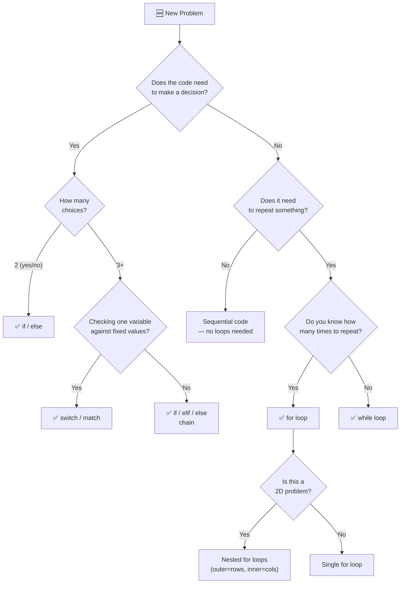
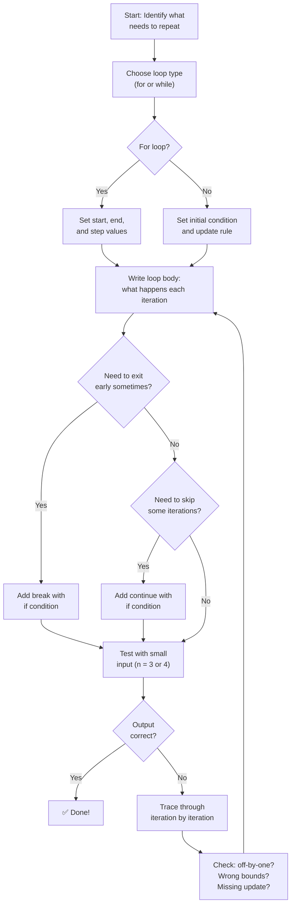

# Chapter 3: Decisions and Loops — Teaching Your Code to Think

## Chapter Goals

- [ ] **Write conditional statements** (if/else/elif) to make your programs respond differently to different inputs
- [ ] **Use comparison and logical operators** to express complex conditions like "is x between 1 and 100?"
- [ ] **Choose between for-loops and while-loops** depending on whether you know how many times to repeat
- [ ] **Nest loops inside loops** to solve 2D problems like printing patterns
- [ ] **Use break and continue** to control loop execution when special situations arise
- [ ] **Apply pattern printing** as a way to build confidence with nested loops and mathematical thinking

---

## The Story: "The Maze Runner"

Imagine you're trapped in a maze. At every intersection, you have to make a choice: go left, go right, or go straight. The wrong choice leads to a dead end. The right choice leads you closer to the exit.

But here's the thing — you don't just walk through the maze once. You try a path, hit a wall, backtrack, and try again. You *repeat* your exploration until you find the exit.

Your programs so far have been like walking a straight corridor — one step after another, no decisions, no repetition. That changes today.

**Conditionals** teach your code to make decisions: *"If the user typed a positive number, do this. Otherwise, do that."* They're the forks in the maze.

**Loops** teach your code to repeat: *"Keep going until you find the exit."* They're the persistence that gets you through.

Together, conditionals and loops transform your programs from simple calculators into actual problem-solvers. With just these two tools — decision and repetition — you can write programs that play games, search for answers, draw patterns, and analyze data. This is where coding gets interesting.

---

## Johari Window: Before

Before diving in, take a moment to honestly assess where you are. Fill out the "Before" section of your [Johari Window worksheet](johari.md).


**Be honest!** The Johari Window only helps if you're truthful about what you know and don't know. There's no shame in "I have no idea" — that's where the best learning happens.


---

## Discovery

Before we explain anything, try these two problems. Use whatever language you're most comfortable with. Don't worry if you get stuck — that's the point!


**Try these BEFORE reading the explanation below.** Struggling with a problem teaches you more than reading the answer.


**Discovery Problem 1: FizzBuzz**

> Print the numbers from 1 to 20. But — for multiples of 3, print "Fizz" instead of the number. For multiples of 5, print "Buzz". For multiples of both 3 AND 5, print "FizzBuzz".
>
> Expected output starts: `1, 2, Fizz, 4, Buzz, Fizz, 7, 8, Fizz, Buzz, 11, Fizz, 13, 14, FizzBuzz, 16, ...`

How many `if` statements did you need? Did you get the order of checks right? (Hint: the order matters a LOT. Why?)

**Discovery Problem 2: The Staircase**

> Print a right-aligned staircase of `#` symbols with 4 steps:
> ```
>    #
>   ##
>  ###
> ####
> ```

What pattern do you see in the spaces and `#` symbols? Can you express it with a formula? Try it in Python first — what do you need? Two things: a way to *repeat* (loop) and a way to *vary* what you print each time.

---

## 3.1 If/Else — Making Decisions

The `if` statement is the simplest way to make your code branch. Think of it as a fork in the road: if the condition is true, go one way; otherwise, go the other.



```python
age = 14

if age >= 18:
    print("You can vote!")
elif age >= 13:
    print("You're a teenager!")
else:
    print("You're still a kid!")
```

Python uses **indentation** (spaces) to define code blocks. Everything indented under `if` runs only when the condition is true. No curly braces needed — the indentation IS the structure.



```java
int age = 14;

if (age >= 18) {
    System.out.println("You can vote!");
} else if (age >= 13) {
    System.out.println("You're a teenager!");
} else {
    System.out.println("You're still a kid!");
}
```

Java uses **curly braces** `{}` to define code blocks. Parentheses around the condition are **required**.



```cpp
int age = 14;

if (age >= 18) {
    cout << "You can vote!" << endl;
} else if (age >= 13) {
    cout << "You're a teenager!" << endl;
} else {
    cout << "You're still a kid!" << endl;
}
```

C++ is nearly identical to Java here. The only difference is the output syntax (`cout` vs. `System.out.println`).



> **Language Spotlight: If/Else Syntax**
>
> | | Python | Java | C++ |
> |---|--------|------|-----|
> | **Keyword for "else if"** | `elif` | `else if` | `else if` |
> | **Condition needs parentheses?** | No (optional) | Yes (required) | Yes (required) |
> | **Code block defined by** | Indentation (spaces/tabs) | Curly braces `{}` | Curly braces `{}` |
> | **Colon after condition?** | Yes `:` | No | No |

### The Ternary Operator — One-Line If/Else

When you just need to pick between two values, there's a compact shortcut:



```python
result = "even" if n % 2 == 0 else "odd"
```



```java
String result = (n % 2 == 0) ? "even" : "odd";
```



```cpp
string result = (n % 2 == 0) ? "even" : "odd";
```




**When to use the ternary operator:** Only when the expression is simple enough to read on one line. If your condition or values are complex, use a full if/else — readability beats cleverness every time.


---

## 3.2 Comparison and Logical Operators

To write conditions, you need two kinds of operators: ones that **compare** values, and ones that **combine** comparisons.

### Comparison Operators

These compare two values and return `true` or `false`:

| Operator | Meaning | Example | Result |
|----------|---------|---------|--------|
| `==` | Equal to | `5 == 5` | `true` |
| `!=` | Not equal to | `5 != 3` | `true` |
| `<` | Less than | `3 < 5` | `true` |
| `>` | Greater than | `5 > 3` | `true` |
| `<=` | Less than or equal | `5 <= 5` | `true` |
| `>=` | Greater than or equal | `3 >= 5` | `false` |

These work the same in all three languages — one of the few things that's truly identical!

### Logical Operators

These combine multiple conditions into a single expression:



```python
# AND: both must be true
if age >= 13 and age <= 19:
    print("Teenager")

# OR: at least one must be true
if day == "Saturday" or day == "Sunday":
    print("Weekend!")

# NOT: flips true ↔ false
if not is_raining:
    print("Go outside!")

# Chained comparison (Python-only shortcut!)
if 13 <= age <= 19:      # Same as: age >= 13 and age <= 19
    print("Teenager")
```



```java
// AND: both must be true
if (age >= 13 && age <= 19) {
    System.out.println("Teenager");
}

// OR: at least one must be true
if (day.equals("Saturday") || day.equals("Sunday")) {
    System.out.println("Weekend!");
}

// NOT: flips true ↔ false
if (!isRaining) {
    System.out.println("Go outside!");
}
```



```cpp
// AND: both must be true
if (age >= 13 && age <= 19) {
    cout << "Teenager" << endl;
}

// OR: at least one must be true
if (day == "Saturday" || day == "Sunday") {
    cout << "Weekend!" << endl;
}

// NOT: flips true ↔ false
if (!isRaining) {
    cout << "Go outside!" << endl;
}
```



> **Language Spotlight: Logical Operators**
>
> | | Python | Java | C++ |
> |---|--------|------|-----|
> | **AND** | `and` | `&&` | `&&` |
> | **OR** | `or` | `\|\|` | `\|\|` |
> | **NOT** | `not` | `!` | `!` |
> | **Chained comparison** | `1 < x < 10` (works!) | Not supported | Not supported |
> | **String equality** | `==` | `.equals()` (NOT `==`!) | `==` |
>
> **Critical Gotcha:** In Java, `==` compares object *references* (memory addresses), not values. For strings, always use `.equals()`. Writing `if (name == "Maya")` in Java compiles without error but may give wrong results. This is one of the most infamous Java bugs.

---

## 3.3 Switch/Match — The Multi-Way Fork

When you're checking one variable against many fixed values, a switch statement is cleaner than a long chain of if/else:



```python
# Python 3.10+ has "match" (structural pattern matching)
match day_number:
    case 1:
        day = "Monday"
    case 2:
        day = "Tuesday"
    case 3:
        day = "Wednesday"
    case 4:
        day = "Thursday"
    case 5:
        day = "Friday"
    case 6 | 7:
        day = "Weekend"
    case _:
        day = "Invalid"

# For Python < 3.10, use if/elif chain instead
```



```java
String day;
switch (dayNumber) {
    case 1: day = "Monday"; break;
    case 2: day = "Tuesday"; break;
    case 3: day = "Wednesday"; break;
    case 4: day = "Thursday"; break;
    case 5: day = "Friday"; break;
    case 6:
    case 7: day = "Weekend"; break;
    default: day = "Invalid";
}
```



```cpp
string day;
switch (dayNumber) {
    case 1: day = "Monday"; break;
    case 2: day = "Tuesday"; break;
    case 3: day = "Wednesday"; break;
    case 4: day = "Thursday"; break;
    case 5: day = "Friday"; break;
    case 6:
    case 7: day = "Weekend"; break;
    default: day = "Invalid";
}
```



> **Language Spotlight: Switch/Match**
>
> | | Python | Java | C++ |
> |---|--------|------|-----|
> | **Keyword** | `match`/`case` (3.10+) | `switch`/`case` | `switch`/`case` |
> | **Fall-through?** | No (each case is independent) | Yes! (need `break`) | Yes! (need `break`) |
> | **Default case** | `case _:` | `default:` | `default:` |
> | **Can match strings?** | Yes | Yes (Java 7+) | No (ints/chars only) |
>
> **When to use switch vs. if/else:** Use switch when you're comparing ONE variable against many fixed values (like a menu or day of the week). Use if/else when your conditions are complex, involve ranges, or compare different variables.

---

## 3.4 For Loops — Counting Steps

A `for` loop repeats code a specific number of times. Use it when you **know how many times** you need to repeat.



```python
# Print numbers 1 through 5
for i in range(1, 6):      # range(start, stop) — stop is EXCLUDED
    print(i)

# Print numbers 0 through 4
for i in range(5):          # range(n) starts at 0
    print(i)

# Count by 2s: 0, 2, 4, 6, 8
for i in range(0, 10, 2):   # range(start, stop, step)
    print(i)

# Count backwards: 5, 4, 3, 2, 1
for i in range(5, 0, -1):
    print(i)
```



```java
// Print numbers 1 through 5
for (int i = 1; i <= 5; i++) {
    System.out.println(i);
}

// Print numbers 0 through 4
for (int i = 0; i < 5; i++) {
    System.out.println(i);
}

// Count by 2s: 0, 2, 4, 6, 8
for (int i = 0; i < 10; i += 2) {
    System.out.println(i);
}

// Count backwards: 5, 4, 3, 2, 1
for (int i = 5; i >= 1; i--) {
    System.out.println(i);
}
```



```cpp
// Print numbers 1 through 5
for (int i = 1; i <= 5; i++) {
    cout << i << endl;
}

// Print numbers 0 through 4
for (int i = 0; i < 5; i++) {
    cout << i << endl;
}

// Count by 2s: 0, 2, 4, 6, 8
for (int i = 0; i < 10; i += 2) {
    cout << i << endl;
}

// Count backwards: 5, 4, 3, 2, 1
for (int i = 5; i >= 1; i--) {
    cout << i << endl;
}
```



> **Language Spotlight: For Loops**
>
> | | Python | Java | C++ |
> |---|--------|------|-----|
> | **Syntax** | `for i in range(n):` | `for (int i = 0; i < n; i++)` | `for (int i = 0; i < n; i++)` |
> | **"1 to 5" range** | `range(1, 6)` — end excluded | `i = 1; i <= 5` — end included | Same as Java |
> | **Off-by-one risk** | Low (range excludes end by design) | Medium (`<` vs `<=`) | Medium (same as Java) |
> | **Loop variable after loop?** | Still accessible | Not accessible (scoped) | Not accessible (scoped) |
>
> **Critical Insight:** Python's `range(1, 6)` gives `1, 2, 3, 4, 5` — the end is **excluded**. Java's `for (int i = 1; i <= 5; i++)` uses `<=` to **include** 5. Both produce the same five numbers, but the logic is different. Mixing them up causes off-by-one bugs — the #1 most common programming error.

---

## 3.5 While Loops — Until It's Done

A `while` loop repeats as long as a condition is true. Use it when you **don't know in advance** how many times you need to repeat.



```python
# Count down from 5
n = 5
while n > 0:
    print(n)
    n -= 1          # Don't forget to update n!

# Find how many times you can halve a number
num = 100
count = 0
while num > 1:
    num //= 2
    count += 1
print(f"Halved {count} times")   # 6
```



```java
// Count down from 5
int n = 5;
while (n > 0) {
    System.out.println(n);
    n--;             // Don't forget to update n!
}

// Find how many times you can halve a number
int num = 100;
int count = 0;
while (num > 1) {
    num /= 2;
    count++;
}
System.out.println("Halved " + count + " times");   // 6
```



```cpp
// Count down from 5
int n = 5;
while (n > 0) {
    cout << n << endl;
    n--;             // Don't forget to update n!
}

// Find how many times you can halve a number
int num = 100;
int count = 0;
while (num > 1) {
    num /= 2;
    count++;
}
cout << "Halved " << count << " times" << endl;   // 6
```




**The #1 While Loop Bug: Infinite Loops**

If your condition never becomes false, the loop runs forever. Always ask yourself: *"What changes each iteration to eventually make my condition false?"*

```python
# ❌ INFINITE LOOP — n never changes!
n = 5
while n > 0:
    print(n)
    # Forgot n -= 1 → this loop runs FOREVER!

# ✅ Fixed — n decreases each iteration
n = 5
while n > 0:
    print(n)
    n -= 1
```

If you accidentally create an infinite loop, press **Ctrl+C** to stop your program.


### For vs. While — When to Use Each

| Use **for** when... | Use **while** when... |
|---|---|
| You know how many iterations upfront | You don't know how many iterations |
| Looping through a range of numbers | Waiting for a condition to change |
| Processing each item in a collection | The stop point depends on computation |
| Example: "Print numbers 1 to 100" | Example: "Keep dividing until you reach 1" |

---

## 3.6 Nested Loops — Loops Inside Loops

When you put a loop inside another loop, the inner loop runs **completely** for each iteration of the outer loop. This is how you work with 2D structures like grids, tables, and patterns.



```python
# Multiplication table (3 × 3)
for row in range(1, 4):
    for col in range(1, 4):
        print(f"{row} × {col} = {row * col:2d}", end="   ")
    print()   # New line after each row
```

Output:
```
1 × 1 =  1   1 × 2 =  2   1 × 3 =  3
2 × 1 =  2   2 × 2 =  4   2 × 3 =  6
3 × 1 =  3   3 × 2 =  6   3 × 3 =  9
```



```java
// Multiplication table (3 × 3)
for (int row = 1; row <= 3; row++) {
    for (int col = 1; col <= 3; col++) {
        System.out.printf("%d × %d = %2d   ", row, col, row * col);
    }
    System.out.println();
}
```



```cpp
#include <iomanip>

// Multiplication table (3 × 3)
for (int row = 1; row <= 3; row++) {
    for (int col = 1; col <= 3; col++) {
        cout << row << " × " << col << " = "
             << setw(2) << row * col << "   ";
    }
    cout << endl;
}
```




**How to think about nested loops:** The outer loop controls the *rows*. The inner loop controls the *columns*. If the outer loop runs `n` times and the inner loop runs `m` times, the code inside runs `n × m` times total. For a 100 × 100 grid, that's 10,000 iterations — still fast. But for 100,000 × 100,000, that's 10 billion — way too slow! We'll learn to measure this in **Ch 6: How Fast Is Your Code?**


### Pattern Printing — The Art of Nested Loops

Pattern printing is the best way to build confidence with nested loops. Here's a right triangle:



```python
# Right-aligned triangle, n = 4
n = 4
for i in range(1, n + 1):
    spaces = " " * (n - i)
    stars = "*" * i
    print(spaces + stars)
```

Output:
```
   *
  **
 ***
****
```



```java
int n = 4;
for (int i = 1; i <= n; i++) {
    // Print spaces
    for (int s = 0; s < n - i; s++) System.out.print(" ");
    // Print stars
    for (int s = 0; s < i; s++) System.out.print("*");
    System.out.println();
}
```



```cpp
int n = 4;
for (int i = 1; i <= n; i++) {
    cout << string(n - i, ' ') << string(i, '*') << endl;
}
```



The secret to pattern printing: for each row `i`, figure out **how many spaces** and **how many stars** as a formula of `i` and `n`. Write it on paper first!

| Row (`i`) | Spaces (`n - i`) | Stars (`i`) | Output |
|-----------|-----------------|-------------|--------|
| 1 | 3 | 1 | `   *` |
| 2 | 2 | 2 | `  **` |
| 3 | 1 | 3 | ` ***` |
| 4 | 0 | 4 | `****` |

---

## 3.7 Break and Continue — Emergency Exits

Sometimes you need to **exit a loop early** or **skip certain iterations**:



```python
# break: stop the loop entirely
for i in range(1, 100):
    if i * i > 50:
        print(f"First square > 50: {i * i} (i = {i})")
        break     # Exit the loop NOW

# continue: skip this iteration, go to the next
for i in range(1, 11):
    if i % 3 == 0:
        continue  # Skip multiples of 3
    print(i, end=" ")   # Prints: 1 2 4 5 7 8 10
```



```java
// break: stop the loop entirely
for (int i = 1; i < 100; i++) {
    if (i * i > 50) {
        System.out.println("First square > 50: " + (i * i) + " (i = " + i + ")");
        break;
    }
}

// continue: skip this iteration, go to the next
for (int i = 1; i <= 10; i++) {
    if (i % 3 == 0) continue;
    System.out.print(i + " ");   // Prints: 1 2 4 5 7 8 10
}
```



```cpp
// break: stop the loop entirely
for (int i = 1; i < 100; i++) {
    if (i * i > 50) {
        cout << "First square > 50: " << i * i << " (i = " << i << ")" << endl;
        break;
    }
}

// continue: skip this iteration, go to the next
for (int i = 1; i <= 10; i++) {
    if (i % 3 == 0) continue;
    cout << i << " ";   // Prints: 1 2 4 5 7 8 10
}
```



> **Language Spotlight: Break, Continue, and Python's For/Else**
>
> | | Python | Java | C++ |
> |---|--------|------|-----|
> | **break** | Same in all three | Same | Same |
> | **continue** | Same in all three | Same | Same |
> | **For/else** | `else:` block runs if no `break` | No equivalent | No equivalent |
> | **Labeled break** | Not supported | `break label;` | Not supported (use flag) |
>
> Python's for/else is unique and elegantly solves the "did we find it?" pattern:
> ```python
> for i in range(2, n):
>     if n % i == 0:
>         print("Not prime")
>         break
> else:
>     print("Prime!")   # Only runs if loop completed without break
> ```
> In Java/C++, you'd need a boolean flag to achieve the same result.

---

## Think Like a Pro


**Errichto** (one of the top competitive programmers in the world) on testing edge cases:

*"When I write an if/else, I immediately think of three test cases: the boundary where the condition flips, the smallest valid input, and the largest. For example, if my condition is `n > 0`, I test with n = 1 (just barely true), n = 0 (boundary — false), and n = -1 (clearly false). Most bugs hide at boundaries."*

**Why this matters for conditionals:** Your if/else chains are only as good as your boundary tests. In the FizzBuzz problem, `n % 15 == 0` must come before `n % 3 == 0` — if you don't test with n = 15 (a boundary where both 3 and 5 divide evenly), you'll miss the bug. Errichto catches these instantly because he *always* tests boundaries first.

**Tourist** (Gennady Korotkevich, widely considered the greatest competitive programmer ever) on loop correctness:

*"Before I code a loop, I answer three questions: Where does it start? Where does it end? Does it always terminate? If I can't answer all three, I'm not ready to code. I sketch the first few iterations on paper first."*

**Why this matters for loops:** Nested loops multiply the complexity — a 2-level loop over `n` has `n²` combinations of states. That's 16 states for n = 4, but 10,000 for n = 100. Writing out the first few iterations on paper forces you to see the pattern before it overwhelms you. Tourist doesn't memorize algorithms — he traces through them until the pattern clicks.

**Three takeaways for your conditions and loops:**
1. **Test the boundaries** — if your condition is `x >= 5`, test with x = 4, 5, and 6. For FizzBuzz, test with 3, 5, 15, and 1
2. **Trace the first 2-3 iterations by hand** — write down variable values on paper before running your code. Especially for nested loops!
3. **Ask "does my loop terminate?"** — identify what changes each iteration to eventually make the condition false. The Collatz conjecture (Challenge 3) is famous precisely because nobody has proven every starting number reaches 1


---

## Thinking Flowchart: Choosing the Right Control Structure



---

## Implementation Flowchart: Writing a Loop



---

## AOPS Showcase: "Print a Diamond Pattern" — Three Approaches

One of the most powerful ways to learn is to see the **same problem solved multiple ways**. Each approach teaches you something different.

> **Problem:** Given an integer `n`, print a diamond pattern of stars with `n` rows in the top half (including the middle row). The total height is `2n - 1`.
>
> For `n = 4`:
> ```
>    *
>   ***
>  *****
> *******
>  *****
>   ***
>    *
> ```

### Approach 1: The Brute Force Way (Top Half + Bottom Half)

Handle the top half and bottom half as two separate loops with their own logic.



```python
def diamond_brute(n):
    # Top half (including middle row)
    for i in range(n):
        spaces = " " * (n - 1 - i)
        stars = "*" * (2 * i + 1)
        print(spaces + stars)

    # Bottom half (mirror of top, excluding middle)
    for i in range(n - 2, -1, -1):
        spaces = " " * (n - 1 - i)
        stars = "*" * (2 * i + 1)
        print(spaces + stars)
```



```java
static void diamondBrute(int n) {
    // Top half (including middle row)
    for (int i = 0; i < n; i++) {
        for (int s = 0; s < n - 1 - i; s++) System.out.print(" ");
        for (int s = 0; s < 2 * i + 1; s++) System.out.print("*");
        System.out.println();
    }
    // Bottom half (mirror of top, excluding middle)
    for (int i = n - 2; i >= 0; i--) {
        for (int s = 0; s < n - 1 - i; s++) System.out.print(" ");
        for (int s = 0; s < 2 * i + 1; s++) System.out.print("*");
        System.out.println();
    }
}
```



```cpp
void diamondBrute(int n) {
    // Top half (including middle row)
    for (int i = 0; i < n; i++) {
        cout << string(n - 1 - i, ' ') << string(2 * i + 1, '*') << endl;
    }
    // Bottom half (mirror of top, excluding middle)
    for (int i = n - 2; i >= 0; i--) {
        cout << string(n - 1 - i, ' ') << string(2 * i + 1, '*') << endl;
    }
}
```



**Why learn this?** Splitting a problem into two halves is a natural first instinct. It works, but notice we repeated the spaces-and-stars logic in both halves. Can we eliminate that duplication?

### Approach 2: The Formula Way (Single Loop + Distance from Center)

One loop handles all rows. The key insight: every row's pattern depends on its **distance from the center row**.



```python
def diamond_formula(n):
    total_rows = 2 * n - 1
    for row in range(total_rows):
        distance = abs(row - (n - 1))     # Distance from center
        spaces = " " * distance
        stars = "*" * (2 * (n - 1 - distance) + 1)
        print(spaces + stars)
```



```java
static void diamondFormula(int n) {
    int totalRows = 2 * n - 1;
    for (int row = 0; row < totalRows; row++) {
        int distance = Math.abs(row - (n - 1));
        int numSpaces = distance;
        int numStars = 2 * (n - 1 - distance) + 1;
        System.out.println(" ".repeat(numSpaces) + "*".repeat(numStars));
    }
}
```



```cpp
void diamondFormula(int n) {
    int totalRows = 2 * n - 1;
    for (int row = 0; row < totalRows; row++) {
        int distance = abs(row - (n - 1));
        int numSpaces = distance;
        int numStars = 2 * (n - 1 - distance) + 1;
        cout << string(numSpaces, ' ') << string(numStars, '*') << endl;
    }
}
```



**The key insight:** `distance = abs(row - center)` produces `3, 2, 1, 0, 1, 2, 3` for `n = 4`. The further from the center, the more spaces and fewer stars. This single formula handles both halves elegantly!

| Row | Distance from center | Spaces | Stars | Output |
|-----|---------------------|--------|-------|--------|
| 0 | 3 | 3 | 1 | `   *` |
| 1 | 2 | 2 | 3 | `  ***` |
| 2 | 1 | 1 | 5 | ` *****` |
| 3 | 0 | 0 | 7 | `*******` |
| 4 | 1 | 1 | 5 | ` *****` |
| 5 | 2 | 2 | 3 | `  ***` |
| 6 | 3 | 3 | 1 | `   *` |

### Approach 3: The Symmetry Way (Build Half + Mirror)

Build the top half as a list, then mirror it for the bottom. No duplicate formulas, no re-computation.



```python
def diamond_symmetry(n):
    # Build top half (including middle)
    top = []
    for i in range(n):
        line = " " * (n - 1 - i) + "*" * (2 * i + 1)
        top.append(line)

    # Full diamond = top + reversed top (minus middle)
    full = top + top[-2::-1]

    for line in full:
        print(line)
```



```java
import java.util.*;

static void diamondSymmetry(int n) {
    // Build top half
    List<String> top = new ArrayList<>();
    for (int i = 0; i < n; i++) {
        top.add(" ".repeat(n - 1 - i) + "*".repeat(2 * i + 1));
    }
    // Print top half
    for (String line : top) System.out.println(line);
    // Print bottom half (top reversed, minus middle)
    for (int i = top.size() - 2; i >= 0; i--) {
        System.out.println(top.get(i));
    }
}
```



```cpp
#include <vector>
#include <string>

void diamondSymmetry(int n) {
    // Build top half
    vector<string> top;
    for (int i = 0; i < n; i++) {
        top.push_back(string(n - 1 - i, ' ') + string(2 * i + 1, '*'));
    }
    // Print top half
    for (const string& line : top) cout << line << endl;
    // Print bottom half (top reversed, minus middle)
    for (int i = top.size() - 2; i >= 0; i--) {
        cout << top[i] << endl;
    }
}
```



**Why is this elegant?** It reuses the work from the top half instead of recomputing it. This is a preview of a powerful idea you'll see again and again: **when something has symmetry, only compute half of it.** The same principle appears in sorting (Ch 8), binary search (Ch 9), and dynamic programming (Ch 23).

> **The AOPS Lesson:** Three approaches, one problem. Approach 1 is simplest to think of but duplicates logic. Approach 2 finds a mathematical formula that unifies both halves. Approach 3 uses symmetry to avoid redundant work. In competitive programming, you'll often start with Approach 1 (it works!), then realize there's a cleaner way. Both instincts — the practical and the elegant — are valuable.

---

## Legend's Corner


**Neal Wu** started competing in USACO in 8th grade — exactly your age. He went on to become a 2-time International Olympiad in Informatics (IOI) gold medalist and now works at Google.

*"The biggest mistake I made as a beginner was coding too fast. I'd write a loop, run it, get the wrong answer, then stare at the screen trying to figure out why. Once I started tracing through my code by hand — literally writing down the value of every variable after each line on paper — my debugging speed tripled. It feels slow, but it's the fastest way to find bugs."*

Try it: grab a piece of paper and trace through the Collatz problem (Challenge 3) for n = 6. Write down `n` after each step. You'll be amazed how quickly you spot the pattern.


---

## Gotchas


**Gotcha #1: Off-By-One Errors (The Most Common Bug in All of Programming)**

Want to print numbers 1 through 5? Each language has its own trap:

```python
# Python: range(1, 5) gives 1, 2, 3, 4 — NOT 5!
for i in range(1, 5):     # ❌ Missing 5
    print(i)
for i in range(1, 6):     # ✅ Include 6 to get 1-5
    print(i)
```

```java
// Java: < vs <= makes ALL the difference
for (int i = 1; i < 5; i++)    // ❌ Prints 1, 2, 3, 4
for (int i = 1; i <= 5; i++)   // ✅ Prints 1, 2, 3, 4, 5
```

**Fix:** Before running, trace the first and last iterations by hand. Does the loop start where you expect? Does it include the last value you want?



**Gotcha #2: Infinite While Loops**

Forgetting to update the loop variable is the classic while-loop bug:

```python
n = 10
while n > 0:
    print(n)
    # ❌ Forgot n -= 1 → this loop runs FOREVER!
```

**Fix:** Every while loop must change something that makes the condition eventually false. If you're unsure, add a safety counter: `if count > 1000000: break`



**Gotcha #3: == vs = (Comparison vs. Assignment)**

In Python, accidentally using `=` in a condition is a syntax error (Python protects you!). In Java and C++, it can compile but do something completely wrong:

```java
int x = 5;
// ❌ This COMPILES but assigns 10 to x, then checks truthiness!
if (x = 10) {
    System.out.println("oops");
}
// ✅ Correct: use == for comparison
if (x == 10) {
    System.out.println("correct");
}
```

**Fix:** Some programmers write `10 == x` instead of `x == 10` ("Yoda conditions") — if you accidentally type `10 = x`, the compiler catches it because you can't assign to a literal.



**Gotcha #4: Java/C++ Switch Fall-Through**

Forgetting `break` in a switch statement causes execution to "fall through" to the next case:

```java
int day = 1;
switch (day) {
    case 1: System.out.println("Monday");    // ❌ No break!
    case 2: System.out.println("Tuesday");   // Also prints!
    case 3: System.out.println("Wednesday"); // Also prints!
}
// Output: Monday Tuesday Wednesday — oops!
```

**Fix:** Always add `break` after each case unless you intentionally want fall-through (rare). Python's `match`/`case` doesn't have this problem.



**Gotcha #5: Python Indentation Errors**

Python uses indentation to define code blocks. Inconsistent indentation causes cryptic errors or subtle bugs:

```python
# ❌ IndentationError: unexpected indent
if True:
    print("hello")
      print("world")     # Wrong indent level!

# ❌ Subtle bug: this line is OUTSIDE the if block
if x > 0:
    print("positive")
print("done")            # Always prints — even if x <= 0!

# ✅ Consistent 4-space indentation
if x > 0:
    print("positive")
    print("done")        # Now this is inside the if block
```

**Fix:** Configure your editor to insert 4 spaces when you press Tab. In VS Code: Settings → "Editor: Tab Size" → 4, and "Editor: Insert Spaces" → checked.


---

## Practice Problems

Head to the `code/` directory and solve these problems. Run the tests to check your work!

| # | Problem | Difficulty | Topic | File |
|---|---------|-----------|-------|------|
| 1 | **Even or Odd** — Return "Even" or "Odd" for a given integer | Warm-up | If/Else | `warmup_01_even_odd` |
| 2 | **Absolute Value** — Return the absolute value without using `abs()` | Warm-up | If/Else | `warmup_02_absolute_value` |
| 3 | **Largest of Three** — Return the largest of three integers | Warm-up | If/Else chain | `warmup_03_largest_of_three` |
| 4 | **Count Down** — Return a list counting from n down to 1 | Warm-up | For loop | `warmup_04_count_down` |
| 5 | **Sum 1 to N** — Return the sum of 1 + 2 + ... + n | Warm-up | For loop | `warmup_05_sum_1_to_n` |
| 6 | **Multiplication Table** — Return n's multiplication table (1×n through 10×n) | Warm-up | For loop, formatting | `warmup_06_multiplication_table` |
| 7 | **FizzBuzz** — Return the FizzBuzz sequence from 1 to n | Practice | If/Else + loop | `practice_01_fizzbuzz` |
| 8 | **Digit Count** — Count the number of digits in an integer | Practice | While loop | `practice_02_digit_count` |
| 9 | **Reverse Number** — Reverse the digits of an integer (e.g., 1234 → 4321) | Practice | While loop, modulo | `practice_03_reverse_number` |
| 10 | **Right Triangle** — Return a right-aligned triangle of stars with n rows | Practice | Nested loops | `practice_04_right_triangle` |
| 11 | **Diamond Pattern** — Return a diamond of stars with n rows in the top half | Challenge | Nested loops, formula | `challenge_01_diamond` |
| 12 | **Prime Check** — Determine if a number is prime | Challenge | Loop + break | `challenge_02_prime_check` |
| 13 | **Collatz Sequence** — Return the Collatz sequence from n to 1 | Challenge | While + if | `challenge_03_collatz` |

```bash
# Check your solutions
./scripts/run_tests.sh ch03 python
./scripts/run_tests.sh ch03 java
./scripts/run_tests.sh ch03 cpp
```

---

## Language Idioms

Each language has elegant shortcuts for common loop and conditional patterns:



```python
# List comprehension — build a list in one line
squares = [i * i for i in range(1, 11)]           # [1, 4, 9, ..., 100]
evens = [i for i in range(1, 21) if i % 2 == 0]   # [2, 4, 6, ..., 20]

# String multiplication for patterns
print("*" * 10)          # **********
print("=-" * 5)          # =-=-=-=-=-

# Enumerate — get index AND value together
fruits = ["apple", "banana", "cherry"]
for i, fruit in enumerate(fruits):
    print(f"{i}: {fruit}")

# For/else — the else runs ONLY if no break occurred
for i in range(2, n):
    if n % i == 0:
        print("Not prime")
        break
else:
    print("Prime!")
```



```java
// Enhanced for-each loop (for arrays and collections)
int[] nums = {1, 2, 3, 4, 5};
for (int num : nums) {
    System.out.println(num);
}

// StringBuilder for building strings in loops (much faster than +)
StringBuilder sb = new StringBuilder();
for (int i = 0; i < 5; i++) {
    sb.append("*");
}
System.out.println(sb.toString());   // *****

// do-while: always runs at least once
int input;
do {
    System.out.print("Enter a positive number: ");
    input = sc.nextInt();
} while (input <= 0);

// Labeled break — break out of NESTED loops
outer:
for (int i = 0; i < 10; i++) {
    for (int j = 0; j < 10; j++) {
        if (i + j > 5) break outer;   // Breaks BOTH loops
    }
}
```



```cpp
// Range-based for loop (C++11)
vector<int> nums = {1, 2, 3, 4, 5};
for (int num : nums) {
    cout << num << " ";
}

// String constructor for repeating characters
string stars(10, '*');      // "**********"
string spaces(5, ' ');      // "     "

// do-while: always runs at least once
int input;
do {
    cout << "Enter a positive number: ";
    cin >> input;
} while (input <= 0);

// Short-circuit evaluation (avoids crash on out-of-bounds)
if (i >= 0 && i < n && arr[i] == target) {
    // Safe — won't access arr[i] if i is out of bounds
    // because && stops evaluating once a condition is false
}
```



---

## Breadcrumbs


**Looking Back (Callbacks):**
- In **Ch 2**, we learned I/O and data types. Now we combine them: read a number, use if/else to classify it, and use loops to process it. Every program from now on uses Ch 2 + Ch 3 as building blocks.
- The temperature converter from Ch 2's Discovery was a straight-line program (read → compute → print). FizzBuzz from *this* chapter needs a loop AND conditions — see how the problems got richer?

**Looking Forward (Foreshadowing):**
- In **Ch 4** (Functions), you'll wrap your loops into reusable functions. That diamond-printing code? You'll turn it into a `print_diamond(n)` function you can call anywhere.
- In **Ch 6** (How Fast Is Your Code?), you'll learn to COUNT how many times your nested loops run. A loop inside a loop that each run `n` times = `n²` operations. This is the birth of **Big-O analysis**.
- In **Ch 8** (The Art of Sorting), you'll implement Bubble Sort, Selection Sort, and Insertion Sort — all clever variations of nested loops from this chapter.
- In **Ch 10** (The Magic of Recursion), you'll discover an alternative to loops: a function that calls *itself*. The Collatz problem (Challenge 3) can be solved recursively — a preview of that chapter!
- **Thread: "Brute force is a strategy"** — Nested loops ARE brute force. And brute force is perfectly fine when `n` is small enough. In **Ch 13** (Bronze Battle Plan), you'll use nested loops to try every possible combination when `n ≤ 20`. Don't feel bad about brute force — embrace it as your first step on every problem.
- **Thread: "Two pointers everywhere"** — The `for` loop is the engine behind two-pointer techniques. In **Ch 15** (Two Pointers & Sliding Window), you'll use two index variables moving through an array — powered by the loop mechanics you practiced here.


---

## Johari Window: After

Now fill out the "After" section of your [Johari Window worksheet](johari.md). Compare it with your "Before" — what changed? What surprised you?

---

## Open Questions Beyond

These aren't homework — they're mysteries. Think about them, and you'll start seeing deeper patterns.


**1. Can any while loop be rewritten as a for loop, and vice versa?**
Technically yes — they're equivalent in power. Every for loop can be rewritten with while, and vice versa. But some problems naturally fit one more than the other. The real question is: when is each one more *readable*? (We'll revisit this when we meet for-each loops in Ch 5 and recursion in Ch 10.)

**2. How many operations can your computer do per second?**
A modern computer does roughly 10⁸ to 10⁹ simple operations per second. If your nested loop runs `n²` times and `n = 10⁵`, that's 10¹⁰ operations — about 10-100 seconds. Too slow! How do you know *before you code it* whether your approach is fast enough? (This is exactly what **Ch 6** teaches.)

**3. What if you need a loop that never ends — on purpose?**
Video games run an infinite loop: read input → update state → render frame → repeat. Web servers do the same: wait for request → process → respond → repeat. These are called **event loops**, and they use `while True:` with a `break` when it's time to shut down. Is there ever a good reason for a loop that runs forever?


---

## What's Next

Your programs can now make decisions and repeat actions. That's incredibly powerful — with just if/else and loops, you can already solve a huge number of problems.

But look at your diamond code. What if you wanted to print a diamond in 10 different places in your program? Would you copy-paste all that code 10 times? What if you found a bug — would you fix it in 10 places?

In **Chapter 4: Functions — Thinking in Pieces**, you'll learn to wrap code into reusable, named blocks. Write the logic once, call it from anywhere. Functions are what separate beginners from intermediate programmers — and they're the key to writing programs that are organized, testable, and actually fun to work on.

The maze runner doesn't just run — they learn to build maps. Functions are your maps.
