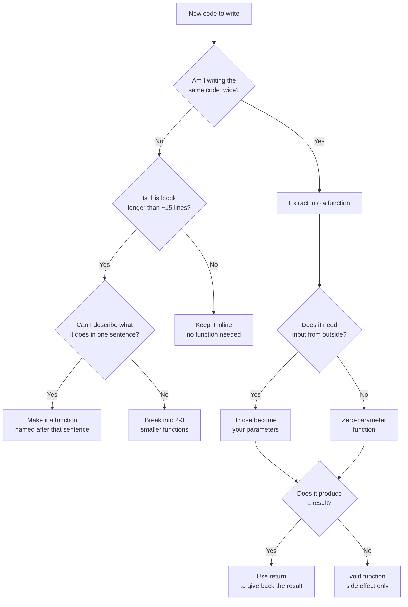
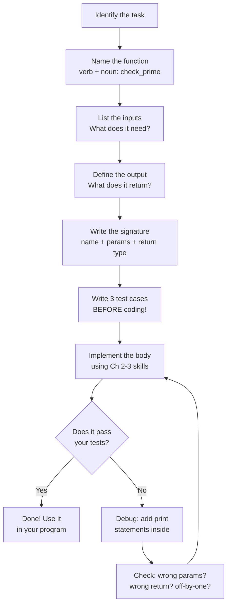

# Chapter 4: Functions — Thinking in Pieces

## Chapter Goals

- [ ] **Define and call functions** in Python, Java, and C++ with proper parameters and return values
- [ ] **Understand pass-by-value vs. pass-by-reference** and how each language handles it differently
- [ ] **Use scope rules** to avoid bugs caused by variable shadowing and lifetime issues
- [ ] **Write helper functions** that call each other to break complex problems into small, testable pieces
- [ ] **Apply function overloading** (Java/C++) and **default parameters** (Python/C++) to create flexible APIs
- [ ] **Use lambda functions** for short, throwaway logic like custom sort comparators
- [ ] **Follow the DRY principle** — Don't Repeat Yourself — by extracting reusable functions

---

## The Story: "The Master Chef's Recipe Book"

Imagine a chef who runs a restaurant. Every night, dozens of dishes go out to customers — pasta, steak, salads, desserts. Early on, the chef tried to remember every recipe in his head, cooking everything from scratch each time. One night, he accidentally put sugar in the pasta sauce (he was thinking about the dessert). Another night, he changed the marinade for the steak but forgot to update it for the steak sandwich, which uses the same marinade.

So the chef did something smart. He wrote a **Recipe Book**. Each recipe is a separate page with:
- **Ingredients** (the inputs — what you need)
- **Steps** (the process — what you do)
- **The finished dish** (the output — what you get back)

Now, the master recipe for "Steak Dinner" just says: *"Make the marinade (page 12). Grill the steak (page 15). Prepare the sides (page 18). Plate it (page 22)."* Each sub-recipe is written once, tested once, and reused everywhere.

That's exactly what **functions** are. Each function is a recipe: it takes **parameters** (ingredients), follows **steps** (the function body), and **returns** a result (the finished dish). Your program becomes a master recipe that calls sub-recipes, mixing and matching them to solve any problem.

The best part? When you fix a bug in one function, it's fixed everywhere that function is used. Just like updating a recipe once fixes every dish that uses it.

---

## Johari Window: Before

Before diving in, take a moment to honestly assess where you are. Fill out the "Before" section of your [Johari Window worksheet](johari.md).


**Be honest!** The Johari Window only helps if you're truthful about what you know and don't know. There's no shame in "I have no idea" — that's where the best learning happens.


---

## Discovery

Before we explain anything, try these two problems. Don't worry if you get stuck — that's the point!


**Try these BEFORE reading the explanation below.** Struggling with a problem teaches you more than reading the answer.


**Discovery Problem 1: "The Repetitive Chef"**

> You need to print a greeting for 5 different people. Write a program that prints:
> ```
> Hello, Alice! Welcome to the contest.
> Hello, Bob! Welcome to the contest.
> Hello, Charlie! Welcome to the contest.
> Hello, Diana! Welcome to the contest.
> Hello, Eve! Welcome to the contest.
> ```
>
> Now imagine your boss says: change "Welcome to the contest" to "Welcome to the party."
>
> **How many lines of code do you need to change?** Is there a way to write the greeting logic ONCE and reuse it for each name?

Think about it. If you wrote 5 separate `print` statements, you'd need to change all 5. But what if there was a way to write the logic once...

**Discovery Problem 2: "The Black Box"**

> Look at this Python code. **Don't run it** — predict what it prints:
>
> ```python
> def mystery(a, b):
>     a = a + 10
>     b.append(99)
>
> x = 5
> y = [1, 2, 3]
> mystery(x, y)
> print(x)    # What does this print?
> print(y)    # What does this print?
> ```
>
> Did `x` change? Did `y` change? **Why are they different?**

If you predicted `x = 5` (unchanged) and `y = [1, 2, 3, 99]` (changed!), you just discovered one of the most important concepts in programming. If you got it wrong — even better. You're about to learn why.

---

## 4.1 Defining Functions — Your First Recipe

A **function** is a named block of code that:
1. Takes **inputs** (called parameters)
2. Does something useful (the body)
3. Optionally **returns** an output

Here's the simplest possible function in all three languages:



```python
def square(n):
    """Return n squared."""
    return n * n

# Calling the function
result = square(5)
print(result)    # 25
```


```java
static int square(int n) {
    // Return n squared
    return n * n;
}

// Calling the function
public static void main(String[] args) {
    int result = square(5);
    System.out.println(result);    // 25
}
```


```cpp
int square(int n) {
    // Return n squared
    return n * n;
}

int main() {
    int result = square(5);
    cout << result << endl;    // 25
    return 0;
}
```



> **Language Spotlight: Defining a Function**
>
> | | Python | Java | C++ |
> |---|--------|------|-----|
> | **Keyword** | `def` | (return type + name) | (return type + name) |
> | **Return type declared?** | No (optional type hints) | Yes (required) | Yes (required) |
> | **No return value** | Returns `None` implicitly | Use `void` | Use `void` |
> | **Naming convention** | `snake_case` | `camelCase` | `snake_case` or `camelCase` |
> | **Where can you define?** | Anywhere (top-level or nested) | Inside a class (always) | Top-level or inside class |

### Functions That Don't Return Anything

Sometimes a function does work but doesn't produce a value. These use `void` (Java/C++) or simply don't include `return` (Python):



```python
def greet(name):
    """Print a greeting. Returns None (no return statement)."""
    print(f"Hello, {name}!")

greet("Alice")    # Hello, Alice!
result = greet("Bob")
print(result)      # None
```


```java
static void greet(String name) {
    System.out.println("Hello, " + name + "!");
}

greet("Alice");    // Hello, Alice!
// greet() has no return value — can't assign it
```


```cpp
void greet(string name) {
    cout << "Hello, " << name << "!" << endl;
}

greet("Alice");    // Hello, Alice!
// greet() has no return value — can't assign it
```



---

## 4.2 Parameters and Arguments — Ingredients for Your Recipe

**Parameters** are the variables listed in the function definition. **Arguments** are the actual values you pass when calling the function.

```python
def add(a, b):    # a and b are PARAMETERS (placeholders)
    return a + b

add(3, 7)         # 3 and 7 are ARGUMENTS (actual values)
```

### Multiple Parameters

Functions can take any number of parameters:



```python
def format_name(first, last, middle=""):
    """Format a full name. Middle name is optional."""
    if middle:
        return f"{first} {middle} {last}"
    return f"{first} {last}"

print(format_name("Ada", "Lovelace"))                # Ada Lovelace
print(format_name("Grace", "Hopper", "Brewster"))     # Grace Brewster Hopper
```


```java
// Java doesn't have default parameters — use overloading instead!
static String formatName(String first, String last) {
    return first + " " + last;
}

static String formatName(String first, String last, String middle) {
    return first + " " + middle + " " + last;
}

System.out.println(formatName("Ada", "Lovelace"));
System.out.println(formatName("Grace", "Hopper", "Brewster"));
```


```cpp
// C++ supports default parameters (like Python)
string format_name(string first, string last, string middle = "") {
    if (!middle.empty()) {
        return first + " " + middle + " " + last;
    }
    return first + " " + last;
}

cout << format_name("Ada", "Lovelace") << endl;
cout << format_name("Grace", "Hopper", "Brewster") << endl;
```



> **Language Spotlight: Parameters**
>
> | | Python | Java | C++ |
> |---|--------|------|-----|
> | **Default parameters?** | Yes: `def f(x=10)` | No (use overloading) | Yes: `int f(int x=10)` |
> | **Keyword arguments?** | Yes: `f(name="Jo")` | No | No |
> | **Variable number of args** | `*args`, `**kwargs` | `int... nums` (varargs) | Not built-in (use vectors) |
> | **Argument order** | Positional first, keyword after | Positional only | Positional only (defaults at end) |
>
> **Key insight**: Java uses **overloading** (multiple versions of the same function) where Python and C++ use **default parameters**. Same goal, different mechanism.

---

## 4.3 Pass by Value vs. Reference — The Photocopy Problem

This is the **single most important concept** in this chapter. Read it carefully.

When you pass a variable to a function, what happens to it? There are two possibilities:

1. **Pass by value**: The function gets a **copy**. Changes inside the function don't affect the original.
2. **Pass by reference**: The function gets the **original**. Changes inside the function affect the original.

### The Photocopy Analogy

Imagine you have a document. When you give it to someone:
- **Pass by value** = You make a photocopy and give them the copy. They can scribble all over it — your original is safe.
- **Pass by reference** = You hand them your actual document. Whatever they write on it, your original is changed too.

### Let's See It in Action



```python
def try_to_change(number, my_list):
    number = number + 10      # Tries to change the number
    my_list.append(99)         # Tries to change the list

x = 5
y = [1, 2, 3]
try_to_change(x, y)
print(x)    # 5   — x did NOT change! (integers are immutable)
print(y)    # [1, 2, 3, 99] — y DID change! (lists are mutable)
```

**Python's rule**: Integers, floats, strings, and tuples are **immutable** — you can't change them, so changes inside a function create a new local variable. Lists, dictionaries, and sets are **mutable** — the function can modify them because both the function and the caller share the same object.


```java
static void tryToChange(int number, int[] myArray) {
    number = number + 10;      // Tries to change the number
    myArray[0] = 99;           // Tries to change the array
}

int x = 5;
int[] y = {1, 2, 3};
tryToChange(x, y);
System.out.println(x);           // 5 — x did NOT change!
System.out.println(y[0]);        // 99 — y[0] DID change!
```

**Java's rule**: Primitives (`int`, `double`, `boolean`, etc.) are always **pass by value** (copied). Objects and arrays pass a **copy of the reference** — meaning you can modify the object's contents, but you can't make the original variable point to a different object.


```cpp
void try_to_change_value(int number, vector<int> my_vec) {
    number = number + 10;
    my_vec.push_back(99);
}

void try_to_change_ref(int& number, vector<int>& my_vec) {
    number = number + 10;
    my_vec.push_back(99);
}

int x = 5;
vector<int> y = {1, 2, 3};

try_to_change_value(x, y);
// x is still 5, y is still {1, 2, 3} — BOTH copied!

try_to_change_ref(x, y);
// x is now 15, y is now {1, 2, 3, 99} — BOTH changed!
```

**C++ rule**: By default, EVERYTHING is **pass by value** (copied). To pass by reference, you must add `&` to the parameter type. This is the most explicit system — you always know exactly what's happening.



> **Language Spotlight: Pass by Value vs. Reference**
>
> | | Python | Java | C++ |
> |---|--------|------|-----|
> | **Integers/primitives** | Immutable (can't change original) | Pass by value (copy) | Pass by value (copy, unless `&`) |
> | **Lists/arrays** | Mutable (original changes!) | Reference shared (original changes!) | Pass by value (copy, unless `&`) |
> | **Explicit reference?** | N/A (automatic for mutables) | N/A (always value-of-reference) | `void f(int& x)` — the `&` |
> | **Mental model** | "Name tags on objects" | "Remote controls to objects" | "Addresses vs. copies" |
>
> **Golden rule**: If you're not sure whether a change inside a function will affect the outside, **test it!** Write a small program, call the function, and print the variable after.

### When to Use Which?

- **Pass by value** (the default in most cases): Safe. The function can't accidentally break your data. Use this when the function only needs to *read* the data.
- **Pass by reference**: Efficient for large data (no copy needed) and necessary when the function needs to *modify* the data. In C++, use `const&` when you want efficiency without allowing modification:

```cpp
// Efficient AND safe: const reference
void print_all(const vector<int>& nums) {
    for (int n : nums) {
        cout << n << " ";
    }
}
```

---

## 4.4 Scope and Lifetime — Where Variables Live and Die

Every variable has a **scope** — the region of code where it exists. When you create a variable inside a function, it only lives inside that function. This is called **local scope**.



```python
x = 10            # Global variable — lives everywhere

def my_function():
    x = 5         # Local variable — DIFFERENT from global x!
    y = 20        # Local variable — only exists inside this function
    print(x)      # 5 (the local x)

my_function()
print(x)          # 10 (the global x — unchanged!)
# print(y)        # ERROR! y doesn't exist outside the function
```


```java
static int x = 10;    // Class-level (like global)

static void myFunction() {
    int x = 5;        // Local variable — shadows the class x
    int y = 20;       // Local — only exists in this method
    System.out.println(x);    // 5 (local x)
}

myFunction();
System.out.println(x);        // 10 (class-level x — unchanged!)
// System.out.println(y);     // ERROR! y doesn't exist here
```


```cpp
int x = 10;            // Global variable

void my_function() {
    int x = 5;         // Local variable — shadows the global x
    int y = 20;        // Local — only exists in this function
    cout << x << endl; // 5 (local x)
}

my_function();
cout << x << endl;     // 10 (global x — unchanged!)
// cout << y << endl;  // ERROR! y doesn't exist here
```



> **Language Spotlight: Scope**
>
> | | Python | Java | C++ |
> |---|--------|------|-----|
> | **Reading global inside function** | Allowed | Allowed (if static field) | Allowed |
> | **Modifying global inside function** | Needs `global` keyword | Direct (if static field) | Direct |
> | **Variable in loop body** | Accessible after loop! | NOT accessible after loop | NOT accessible after loop |
> | **Shadowing allowed?** | Yes (creates new local) | Yes (compiler warning) | Yes (compiler warning) |
>
> **Python gotcha**: In Python, a variable declared inside a `for` loop is still accessible after the loop ends. In Java and C++, it's not!

### The `global` Keyword (Python)

In Python, if you want to **modify** a global variable from inside a function, you need the `global` keyword:

```python
count = 0

def increment():
    global count       # Without this line, Python creates a local 'count'
    count = count + 1

increment()
increment()
print(count)    # 2
```


**Avoid global variables when possible.** They make your code harder to understand and debug because any function could change them. Prefer passing values as parameters and returning results.


---

## 4.5 Function Overloading — Same Name, Different Recipes

**Function overloading** means having multiple functions with the **same name** but **different parameters**. Java and C++ support this natively. Python does not.



```python
# Python does NOT support overloading.
# The last definition wins:
def area(radius):
    return 3.14159 * radius * radius

def area(width, height):    # This REPLACES the previous area()!
    return width * height

# area(5)        # ERROR! Python only knows the 2-param version
area(4, 6)       # 24

# Python alternative: use default parameters or *args
def area(a, b=None):
    if b is None:
        return 3.14159 * a * a     # Circle: area(radius)
    return a * b                    # Rectangle: area(width, height)

area(5)       # 78.54 (circle)
area(4, 6)    # 24 (rectangle)
```


```java
// Java supports overloading — same name, different parameter lists
static double area(double radius) {
    return Math.PI * radius * radius;
}

static double area(double width, double height) {
    return width * height;
}

static double area(double base, double height, boolean isTriangle) {
    return 0.5 * base * height;
}

System.out.println(area(5));              // 78.54 (circle)
System.out.println(area(4, 6));           // 24.0 (rectangle)
System.out.println(area(4, 6, true));     // 12.0 (triangle)
```


```cpp
// C++ supports overloading — same name, different parameter lists
double area(double radius) {
    return M_PI * radius * radius;
}

double area(double width, double height) {
    return width * height;
}

double area(double base, double height, bool is_triangle) {
    return 0.5 * base * height;
}

cout << area(5.0) << endl;                   // 78.54 (circle)
cout << area(4.0, 6.0) << endl;              // 24.0 (rectangle)
cout << area(4.0, 6.0, true) << endl;        // 12.0 (triangle)
```



> **Language Spotlight: Overloading**
>
> | | Python | Java | C++ |
> |---|--------|------|-----|
> | **Overloading supported?** | No (last definition wins) | Yes | Yes |
> | **How Python works around it** | Default args, `*args`, type checking | N/A | N/A |
> | **Overload by return type?** | N/A | No (must differ in parameters) | No (must differ in parameters) |

---

## 4.6 Lambda Functions — One-Line Recipes

Sometimes you need a tiny function for one specific purpose — like telling `sort` how to compare items. Writing a full function definition feels like overkill. That's where **lambda functions** (anonymous functions) come in.



```python
# Full function
def double(x):
    return x * 2

# Lambda equivalent
double = lambda x: x * 2

# Most common use: as a sort key
names = ["Charlie", "Alice", "Bob", "Diana"]
names.sort(key=lambda name: len(name))
print(names)    # ['Bob', 'Alice', 'Diana', 'Charlie']

# Sort numbers by their last digit
nums = [23, 45, 12, 67, 34]
nums.sort(key=lambda n: n % 10)
print(nums)     # [12, 23, 34, 45, 67]
```


```java
// Java lambdas use the -> syntax
// Most common use: as a Comparator
List<String> names = new ArrayList<>(List.of("Charlie", "Alice", "Bob", "Diana"));
names.sort((a, b) -> a.length() - b.length());
System.out.println(names);    // [Bob, Alice, Diana, Charlie]

// Sort numbers by last digit
List<Integer> nums = new ArrayList<>(List.of(23, 45, 12, 67, 34));
nums.sort((a, b) -> (a % 10) - (b % 10));
System.out.println(nums);     // [12, 23, 34, 45, 67]
```


```cpp
// C++ lambdas use [capture](params){ body } syntax
auto double_it = [](int x) { return x * 2; };
cout << double_it(5) << endl;    // 10

// Most common use: as a sort comparator
vector<string> names = {"Charlie", "Alice", "Bob", "Diana"};
sort(names.begin(), names.end(),
     [](const string& a, const string& b) {
         return a.length() < b.length();
     });
// names: {"Bob", "Alice", "Diana", "Charlie"}

// Sort numbers by last digit
vector<int> nums = {23, 45, 12, 67, 34};
sort(nums.begin(), nums.end(),
     [](int a, int b) { return a % 10 < b % 10; });
// nums: {12, 23, 34, 45, 67}
```



> **Language Spotlight: Lambdas**
>
> | | Python | Java | C++ |
> |---|--------|------|-----|
> | **Syntax** | `lambda x: x * 2` | `(x) -> x * 2` | `[](int x){ return x * 2; }` |
> | **Multi-line?** | No (expression only) | Yes (with `{}`) | Yes (with `{}`) |
> | **Common use** | `sorted(key=...)`, `map`, `filter` | Comparators, streams | `sort()` comparators |
> | **Captures variables?** | Yes (closure) | Yes (effectively final) | Yes (specify `[&]` or `[=]`) |
>
> **When to use lambdas**: When the function is so simple (1-2 lines) that giving it a name would be more effort than it's worth. For anything longer, use a regular function.

---

## 4.7 Functions as Building Blocks — The DRY Principle

**DRY** stands for **Don't Repeat Yourself**. It's one of the most important principles in programming:

> *If you write the same code twice, make it a function.*

Remember the diamond pattern from Ch 3? Here's what happens when you wrap it in a function:



```python
def print_diamond(n):
    """Print a diamond of height 2n-1."""
    for i in range(n):
        spaces = " " * (n - 1 - i)
        stars = "*" * (2 * i + 1)
        print(spaces + stars)
    for i in range(n - 2, -1, -1):
        spaces = " " * (n - 1 - i)
        stars = "*" * (2 * i + 1)
        print(spaces + stars)

# Now you can make diamonds anywhere, any size!
print_diamond(3)
print()
print_diamond(5)
```


```java
static void printDiamond(int n) {
    for (int i = 0; i < n; i++) {
        System.out.println(" ".repeat(n - 1 - i) + "*".repeat(2 * i + 1));
    }
    for (int i = n - 2; i >= 0; i--) {
        System.out.println(" ".repeat(n - 1 - i) + "*".repeat(2 * i + 1));
    }
}

printDiamond(3);
System.out.println();
printDiamond(5);
```


```cpp
void print_diamond(int n) {
    for (int i = 0; i < n; i++) {
        cout << string(n - 1 - i, ' ') << string(2 * i + 1, '*') << endl;
    }
    for (int i = n - 2; i >= 0; i--) {
        cout << string(n - 1 - i, ' ') << string(2 * i + 1, '*') << endl;
    }
}

print_diamond(3);
cout << endl;
print_diamond(5);
```



### Function Calling Function: Composition

The real power of functions comes when they call each other. Build small, simple functions. Then combine them into bigger ones:

```python
def min_of_two(a, b):
    return a if a < b else b

def min_of_three(a, b, c):
    return min_of_two(min_of_two(a, b), c)

def min_of_four(a, b, c, d):
    return min_of_two(min_of_three(a, b, c), d)
```

Each function is simple on its own. But together, they solve progressively harder problems. This is the heart of **function composition** — building big solutions from small, trusted pieces.

> **Language Spotlight: Functions as Values**
>
> | | Python | Java | C++ |
> |---|--------|------|-----|
> | **Function as a value** | Yes: `f = square; f(5)` | Limited (method references `Math::sqrt`) | Yes (function pointers, `std::function`) |
> | **Nesting functions** | Yes: `def inner(): ...` | No (but inner classes) | Yes (lambdas inside functions) |
> | **Importing functions** | `from module import func` | `import static` | `#include` the header |

---

## Think Like a Pro


**Benq (Benjamin Qi)** — youngest USACO Platinum qualifier, IOI gold medalist — on helper functions:

*"I write tiny helper functions for everything — even if I only use them once. `bool isPrime(int n)`, `int gcd(int a, int b)`, `void solve()`. Each function does ONE thing. When something goes wrong, I know exactly which function to debug. My template file has 50+ helper functions ready to go."*

**Why this matters for you:** When your program is 100 lines of code inside `main()`, finding a bug is like finding a typo in a whole book. When it's 10 functions of 10 lines each, you can test each one independently. Call `is_prime(7)` — does it return `True`? Good. Call `is_prime(4)` — does it return `False`? Good. Now you *know* that function works, and you never have to question it again. That's why Benq barely ever has bugs in helper functions — he's already tested them hundreds of times in previous contests.



**Tourist (Gennady Korotkevich)** — the highest-rated competitive programmer in history — on function design:

*"Before I code a function, I ask: What does it take in? What does it give back? I write the signature first, then the tests, then the code. If I can't describe the function in one sentence, it's doing too much."*

**Why this matters for you:** This is called "programming by contract." Tourist doesn't start by writing code — he starts by defining what the function **promises** to do. Input: a number n >= 2. Output: `true` if prime, `false` otherwise. That clarity prevents 90% of bugs before they happen. If you can't describe your function in one sentence, it's probably doing two things and should be split in two.


**Three takeaways:**
1. **One function = one job.** If you can't name it in 3 words ("check if prime", "find maximum", "format name"), split it.
2. **Write the signature first.** Parameters and return type before any logic. "What goes in, what comes out?"
3. **Test functions independently.** Call each helper with known inputs before combining them. `is_prime(2)` should return `True`. `is_prime(4)` should return `False`. Test before you trust.

---

## Thinking Flowchart: When Should I Create a Function?







## Implementation Flowchart: Designing a Function Step-by-Step







---

## AOPS Showcase: "Is It Prime?" — Three Approaches

Let's solve one problem three ways, showing how functions make it easy to swap approaches.

**Problem:** Given an integer `n`, determine if it's prime (only divisible by 1 and itself).

### Approach 1: Trial Division (Brute Force) — O(n)

Check every number from 2 to n-1. If any divides n evenly, it's not prime.



```python
def is_prime_v1(n):
    """Trial division: check ALL numbers from 2 to n-1."""
    if n < 2:
        return False
    for i in range(2, n):
        if n % i == 0:
            return False
    return True
```


```java
static boolean isPrimeV1(int n) {
    if (n < 2) return false;
    for (int i = 2; i < n; i++) {
        if (n % i == 0) return false;
    }
    return true;
}
```


```cpp
bool is_prime_v1(int n) {
    if (n < 2) return false;
    for (int i = 2; i < n; i++) {
        if (n % i == 0) return false;
    }
    return true;
}
```



**Analysis:** For `n = 1,000,000,007` (a prime), this checks about **1 billion** divisors. Way too slow.

### Approach 2: Square Root Optimization — O(sqrt(n))

**Key insight:** If `n = a * b`, then at least one of `a` or `b` must be `<= sqrt(n)`. So we only need to check up to `sqrt(n)`.



```python
def is_prime_v2(n):
    """Square root optimization: only check up to sqrt(n)."""
    if n < 2:
        return False
    i = 2
    while i * i <= n:
        if n % i == 0:
            return False
        i += 1
    return True
```


```java
static boolean isPrimeV2(int n) {
    if (n < 2) return false;
    for (int i = 2; (long)i * i <= n; i++) {
        if (n % i == 0) return false;
    }
    return true;
}
```


```cpp
bool is_prime_v2(int n) {
    if (n < 2) return false;
    for (long long i = 2; i * i <= n; i++) {
        if (n % i == 0) return false;
    }
    return true;
}
```



**Analysis:** For `n = 1,000,000,007`, this checks only **~31,623** divisors. That's 30,000x faster! Same answer.

### Approach 3: The 6k +/- 1 Trick — O(sqrt(n)) but ~3x Fewer Checks

**Key insight:** Every prime greater than 3 is of the form `6k - 1` or `6k + 1`. Why? Because all other numbers are divisible by 2 or 3:
- `6k` → divisible by 6
- `6k + 2` → divisible by 2
- `6k + 3` → divisible by 3
- `6k + 4` → divisible by 2

So after checking 2 and 3, we only need to check numbers of the form `6k ± 1`.



```python
def is_prime_v3(n):
    """6k +/- 1 optimization: skip multiples of 2 and 3."""
    if n < 2:
        return False
    if n < 4:
        return True      # 2 and 3 are prime
    if n % 2 == 0 or n % 3 == 0:
        return False
    i = 5
    while i * i <= n:
        if n % i == 0 or n % (i + 2) == 0:
            return False
        i += 6
    return True
```


```java
static boolean isPrimeV3(int n) {
    if (n < 2) return false;
    if (n < 4) return true;
    if (n % 2 == 0 || n % 3 == 0) return false;
    for (long i = 5; i * i <= n; i += 6) {
        if (n % i == 0 || n % (i + 2) == 0) return false;
    }
    return true;
}
```


```cpp
bool is_prime_v3(int n) {
    if (n < 2) return false;
    if (n < 4) return true;
    if (n % 2 == 0 || n % 3 == 0) return false;
    for (long long i = 5; i * i <= n; i += 6) {
        if (n % i == 0 || n % (i + 2) == 0) return false;
    }
    return true;
}
```



**Analysis:** For `n = 1,000,000,007`, this checks only **~10,541** divisors. Same Big-O as v2, but 3x fewer actual checks.

### Comparison

| | Approach 1 | Approach 2 | Approach 3 |
|---|---|---|---|
| **Checks for n=97** | 95 | 9 | 4 |
| **Checks for n=10^9+7** | ~10^9 | ~31,623 | ~10,541 |
| **Time complexity** | O(n) | O(sqrt(n)) | O(sqrt(n)/3) |
| **Key idea** | Try everything | If a*b=n, one <= sqrt(n) | Primes > 3 are 6k +/- 1 |
| **When to use** | Never (too slow) | General purpose | Contests and interviews |


**AOPS insight:** All three functions have the same *interface* — they take an integer and return a boolean. The caller doesn't need to know which version is running. You can swap `is_prime_v1` for `is_prime_v3` without changing any other code. That's the power of functions: **the interface stays the same even when the implementation improves.**


---

## Legend's Corner


**Neal Wu** — USACO legend who started competing in 8th grade (your age!) — on his "functions-first" breakthrough:

*"The turning point in my USACO journey was when I stopped writing everything in main(). I had a Bronze problem that needed to check if numbers were prime in three different places. I kept copy-pasting the same loop. When I got a wrong answer, I had to fix the same bug in three places — and missed one. After that contest, I made a rule: if I write the same logic twice, it becomes a function. That single habit probably saved me 50 debugging hours over the next year."*

**Try it:** Look at your Ch 3 solutions. Is there any code you copy-pasted? Could you turn it into a function?


---

## Gotchas


**Gotcha #1: Forgetting to `return` (the invisible bug)**

```python
def add(a, b):
    result = a + b
    # Forgot to return!

x = add(3, 4)
print(x)    # None — not 7!
```

Python silently returns `None` if you forget `return`. In Java and C++, the compiler catches this error (non-void function must return a value). Always double-check your `return` statements in Python!



**Gotcha #2: Modifying a list when you meant to copy it**

```python
def remove_negatives(nums):
    for i in range(len(nums) - 1, -1, -1):
        if nums[i] < 0:
            nums.pop(i)
    return nums

original = [1, -2, 3, -4]
result = remove_negatives(original)
print(original)    # [1, 3] — original is changed too!
```

**Fix:** Work on a copy: `nums = nums[:]` or `nums = list(nums)`. In C++, just don't use `&` in the parameter.



**Gotcha #3: Variable shadowing (scope confusion)**

```python
x = 10

def my_function():
    x = 5              # Creates a NEW local x
    print(x)           # 5

my_function()
print(x)               # 10 — global x is untouched!
```

The local `x` inside the function **shadows** (hides) the global `x`. They're completely separate variables. This causes subtle bugs when you think you're modifying the global but you're creating a local instead.



**Gotcha #4: C++ forgetting the `&` for reference parameters**

```cpp
void double_it(int n) {    // No & — n is a COPY!
    n = n * 2;
}

int x = 5;
double_it(x);
cout << x;    // Still 5! The function modified a copy.
```

**Fix:** Add `&`: `void double_it(int& n)`. In C++, forgetting the `&` means the function works on a copy and the original is untouched. This bug compiles without errors, making it hard to catch.



**Gotcha #5: Java overloading ambiguity**

```java
static void show(int x)    { System.out.println("int: " + x); }
static void show(double x) { System.out.println("double: " + x); }

show(5);       // OK: calls int version
show(5.0);     // OK: calls double version
// show(5L);   // AMBIGUOUS: long can be widened to int or double
```

When overloading, be explicit about types. If the compiler complains about ambiguity, cast the argument: `show((int) 5L)`.


---

## Practice Problems

Solve these problems in all three languages. Start with warm-ups, then progress to practice and challenge problems.

| # | Problem | Difficulty | Key Concept | File |
|---|---------|-----------|-------------|------|
| W1 | **Greeting Generator** — Return `"Hello, {name}!"` | Warm-up | One param, one return | `warmup_01_greeting` |
| W2 | **Power Calculator** — Compute `base^exponent` with a loop (no built-in power) | Warm-up | Two params, loop in function | `warmup_02_power` |
| W3 | **Min of Three** — Find minimum of 3 numbers using a `min_of_two` helper | Warm-up | Function composition | `warmup_03_min_of_two` |
| W4 | **Repeat String** — Return string repeated n times, separated by spaces (default n=3) | Warm-up | Default parameters | `warmup_04_repeat_string` |
| W5 | **Double List** — Double every element in a list *in place* | Warm-up | Pass by reference | `warmup_05_double_list` |
| P1 | **Mini Calculator** — `add`, `subtract`, `multiply`, `divide` helpers + `calculate(a, op, b)` dispatch | Practice | Multiple helpers | `practice_01_calculator` |
| P2 | **Password Strength** — Check weak/medium/strong using `has_digit` and `has_upper` helpers | Practice | Decomposition + conditionals | `practice_02_password_strength` |
| P3 | **Temperature Converter** — `c_to_f`, `f_to_c`, and `convert(value, from, to)` | Practice | Multiple conversions | `practice_03_temperature` |
| P4 | **List Statistics** — Return `[min, max, average]` using `find_min`, `find_max`, `find_average` helpers (no built-in min/max/sum) | Practice | Return multiple values | `practice_04_stats` |
| C1 | **Is It Prime? Three Ways** — Implement `is_prime_v1`, `is_prime_v2`, `is_prime_v3` | Challenge | AOPS showcase | `challenge_01_prime_check` |
| C2 | **The Function Machine** — Apply a list of operations (`"double"`, `"negate"`, `"sort"`, `"reverse"`) to a list | Challenge | Dispatch + helpers | `challenge_02_apply_operations` |


**How to work through problems:**
1. Read the skeleton file — it has the full problem statement and examples
2. Write your solution in the `solve()` function
3. Run the tests: `python -m pytest code/python/ch04/tests/test_warmup_01.py -v`
4. If stuck for 20 minutes, check the solution file for hints (but try first!)




**Try in Google Colab!** Solve these problems in your browser — no setup needed.

[C1: Prime Check](https://colab.research.google.com/github/xikimai/dsa-a2z/blob/main/code/notebooks/ch04/challenge_01_prime_check.ipynb) | 
[C2: Apply Operations](https://colab.research.google.com/github/xikimai/dsa-a2z/blob/main/code/notebooks/ch04/challenge_02_apply_operations.ipynb) | 
[P1: Calculator](https://colab.research.google.com/github/xikimai/dsa-a2z/blob/main/code/notebooks/ch04/practice_01_calculator.ipynb) | 
[P2: Password Strength](https://colab.research.google.com/github/xikimai/dsa-a2z/blob/main/code/notebooks/ch04/practice_02_password_strength.ipynb) | 
[P3: Temperature](https://colab.research.google.com/github/xikimai/dsa-a2z/blob/main/code/notebooks/ch04/practice_03_temperature.ipynb) | 
[P4: Stats](https://colab.research.google.com/github/xikimai/dsa-a2z/blob/main/code/notebooks/ch04/practice_04_stats.ipynb) | 
[W1: Greeting](https://colab.research.google.com/github/xikimai/dsa-a2z/blob/main/code/notebooks/ch04/warmup_01_greeting.ipynb) | 
[W2: Power](https://colab.research.google.com/github/xikimai/dsa-a2z/blob/main/code/notebooks/ch04/warmup_02_power.ipynb) | 
[W3: Min Of Two](https://colab.research.google.com/github/xikimai/dsa-a2z/blob/main/code/notebooks/ch04/warmup_03_min_of_two.ipynb) | 
[W4: Repeat String](https://colab.research.google.com/github/xikimai/dsa-a2z/blob/main/code/notebooks/ch04/warmup_04_repeat_string.ipynb) | 
[W5: Double List](https://colab.research.google.com/github/xikimai/dsa-a2z/blob/main/code/notebooks/ch04/warmup_05_double_list.ipynb)



---

## Language Idioms

Each language has its own idiomatic way of working with functions. Here are patterns you'll see in real code:

### Python Idioms

```python
# Type hints (optional but recommended)
def add(a: int, b: int) -> int:
    return a + b

# Docstrings (triple-quote documentation)
def solve(n: int) -> bool:
    """Return True if n is prime, False otherwise."""
    ...

# Multiple return values using tuples
def divide_with_remainder(a, b):
    return a // b, a % b

quotient, remainder = divide_with_remainder(17, 5)    # 3, 2

# List comprehension as a one-liner function
squares = [x ** 2 for x in range(10)]
```

### Java Idioms

```java
// Static methods (no object needed — what we use in this book)
static int add(int a, int b) { return a + b; }

// Javadoc comments (/** ... */)
/**
 * Check if n is prime.
 * @param n the number to check (must be >= 0)
 * @return true if n is prime, false otherwise
 */
static boolean isPrime(int n) { ... }

// Method overloading for flexibility
static int max(int a, int b) { return a > b ? a : b; }
static int max(int a, int b, int c) { return max(max(a, b), c); }
```

### C++ Idioms

```cpp
// const reference for read-only access to large objects
void print_all(const vector<int>& nums) { ... }

// Default parameters (always at the end)
string repeat(string s, int n = 3) { ... }

// Auto return type (C++14)
auto square(int n) { return n * n; }

// Function overloading
int area(int side) { return side * side; }
double area(double radius) { return M_PI * radius * radius; }
```

---

## Breadcrumbs

### Looking Back (Callbacks)

- **Ch 2 — Temperature converter**: Remember the temperature converter from Ch 2? It was a straight-line program — read, compute, print. Now you can write `c_to_f(celsius)` as a reusable function. Same logic, infinitely more useful. You'll do exactly this in Practice Problem 3.

- **Ch 3 — Diamond pattern**: The diamond pattern from Ch 3 took ~10 lines of nested loops. What if you needed diamonds in 5 different parts of your program? Now you wrap it in `print_diamond(n)` and call it wherever you want. Functions turn code into reusable tools.

- **Ch 3 — Prime check**: In Ch 3 Challenge 2, you wrote a prime checker as a loop inside main. Now you've seen it as a proper `is_prime(n)` function — reusable, testable, and optimizable from O(n) to O(sqrt(n)).

### Looking Forward (Foreshadowing)

- **Ch 5 (Collections)**: You'll pass entire lists and maps into functions. Understanding pass-by-reference (section 4.3) will be critical — modifying a list inside a function changes the original!

- **Ch 6 (Big-O)**: You'll analyze HOW FAST your functions are. The three prime checkers from the AOPS showcase? One is O(n), one is O(sqrt(n)), one is even faster. Functions make it easy to swap one approach for another and compare speeds.

- **Ch 7 (Number Wizardry)**: Functions like `gcd(a, b)`, `is_prime(n)`, and `sieve(n)` become your math toolkit. Every number theory problem starts by calling helper functions you've already written and tested.

- **Ch 8 (Sorting)**: Sorting algorithms are naturally expressed as functions: `bubble_sort(arr)`, `merge_sort(arr)`. The lambda comparators from section 4.6 will let you sort by any custom rule.

- **Ch 10 (Recursion)**: Recursion is a function calling *itself*. Everything you learned about parameters, return values, and scope in this chapter is essential for understanding how recursive calls work. Section 4.4 (scope) is especially critical.

### Thread Connections

- **"Brute force is a strategy"**: Your `is_prime_v1` (trial division) IS brute force — and it works perfectly for small `n`. In Ch 13 (Bronze Battle Plan), you'll use brute-force helper functions as building blocks for complete search. Never be ashamed of brute force when `n` is small.

- **"Trade space for time"**: Functions that compute values can be **memoized** — storing results to avoid recomputing. `is_prime(7)` always returns `True`, so why compute it twice? This idea starts here and becomes the foundation of Dynamic Programming in Ch 23.

---

## Johari Window: After

Now that you've completed the chapter, fill out the "After" section of your [Johari Window worksheet](johari.md). Compare your answers with the "Before" section. What surprised you?

---

## Open Questions Beyond

These are questions with no single right answer. Think about them, discuss them, or just let them simmer in the back of your mind.


**Mystery 1: Can a function call itself?**

We said a function can call other functions. But what if a function calls *itself*? For example:
```python
def factorial(n):
    if n <= 1:
        return 1
    return n * factorial(n - 1)    # Calling itself!
```
Does that work, or does it loop forever? Under what conditions would it stop? (This is called **recursion**, and it's the entire topic of Ch 10. When you get there, remember this moment.)



**Mystery 2: Can functions be passed as arguments to other functions?**

We used lambdas as sort keys. But what if you could pass a *named function* as an argument? Like `apply(square, 5)` returning `25`? In Python, functions are "first-class citizens" — you can pass them around like variables. What kinds of problems would this help solve? (This leads to **higher-order functions**, `map`/`filter`/`reduce`, and eventually functional programming ideas.)



**Mystery 3: How do real contest programmers organize their functions?**

Benq has a template with 50+ helper functions ready to go. Tourist writes everything fresh each contest. Which approach is better? What are the trade-offs of having a pre-built library vs. writing from scratch each time? (We'll explore this in the contest strategy appendix.)


---

## What's Next

In **Chapter 5: Collections — Your Data Toolbox**, you'll learn about arrays, lists, strings, sets, and maps — the containers that hold your data. Functions + collections is where programming gets really powerful: you'll write functions that search through lists, filter data, and transform entire datasets.

The `solve()` functions you've been writing take simple inputs like integers and strings. In Ch 5, they'll take entire *collections* of data. And understanding pass-by-reference from this chapter will be crucial — because when you pass a list to a function, the function can change it!
