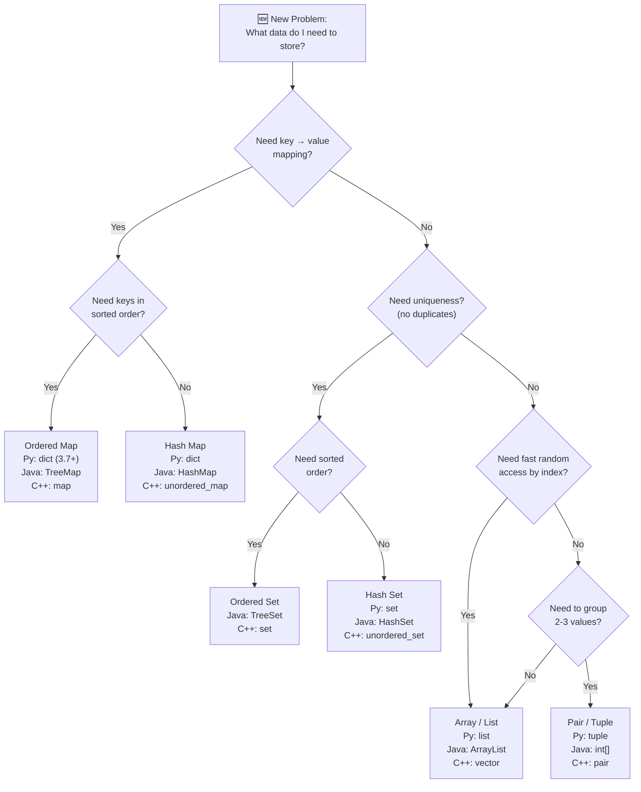

# Collections — Your Data Toolbox

## Chapter Goals

By the end of this chapter, you will be able to:

- [ ] **Create and manipulate arrays/lists** — add, remove, access, slice, and iterate in Python, Java, and C++
- [ ] **Work with strings as collections** — understand immutability, iterate characters, use common string methods
- [ ] **Use sets for uniqueness** — add, remove, check membership in O(1), perform union/intersection/difference
- [ ] **Use maps/dictionaries for key-value lookup** — store, retrieve, and iterate key-value pairs; implement frequency counting
- [ ] **Group data with pairs and tuples** — bundle related values together across all three languages
- [ ] **Sort collections with custom rules** — use built-in sort, write custom comparators, understand stable sorting
- [ ] **Choose the right collection for the job** — given a problem, pick the best data structure before writing a single line of code

---

## The Story: The Librarian's Challenge

Imagine you just inherited a library — but it's a complete disaster. Thousands of books are dumped in random piles on the floor. No organization, no catalog, no order whatsoever.

Your first instinct? **Line them up on shelves**. That's an *array* — a numbered sequence where you can grab "the 47th book" instantly. But arrays have limits. Finding whether you have a duplicate copy? You'd have to check every single book, one by one.

Then you get clever. You create a **box of unique titles** — every time a new book arrives, you check the box. If the title's already there, it's a duplicate. That's a *set* — lightning-fast membership checks, but no duplicates allowed.

Next, you need a **card catalog** that maps each title to its shelf location. "The Hobbit" → Shelf 7, Slot 3. That's a *map* (or *dictionary*) — instant lookup by key.

Finally, the library board asks you to **alphabetize everything**. You need *sorting* — and not just alphabetical, but sometimes by author, sometimes by publication year. That's custom sorting with *comparators*.

By the end of this chapter, you'll have all four tools in your toolbox. And just like our librarian, the key isn't memorizing every tool — it's knowing **which one to grab** for each problem.

---

## Johari Window: Before

Before diving in, take 5 minutes to fill out the **"Before"** section of your [Johari Window worksheet](johari.md).


Be honest with yourself! Knowing what you *don't* know is the first step to learning it. There are no wrong answers — only honest ones.


---

## Discovery


**Stop! Try these BEFORE reading the chapter.** Struggling with a problem before learning the solution is how your brain builds the strongest connections. Spend at least 10 minutes on each one.


### Discovery 1: The Unsorted Mess

> You have a list of test scores: `[85, 92, 78, 95, 88, 76, 91, 83, 97, 80]`. Find the **top 3 scores** without using any sorting function. Just loops and comparisons.
>
> **Think about**: How many passes through the list do you need? What variables do you track? What happens if two scores are the same?

If this feels tedious, that's the point. Collections give us powerful tools so we don't have to reinvent the wheel every time.

### Discovery 2: The Duplicate Detector

> You have a paragraph of text: `"the cat sat on the mat and the cat saw the dog"`. Count how many times **each word** appears.
>
> **Think about**: Can you do this with just a list? What structure would make this easy? How would you store word-count pairs?

If you found yourself wanting something like "a box where I put a word and get back its count," congratulations — you just invented the dictionary/map!

---

## 5.1 Arrays and Lists — Your First Collection

An **array** (or **list**) is the most fundamental collection: an ordered sequence of elements, each accessible by its position (index).



```python
# Creating lists
scores = [85, 92, 78, 95, 88]
names = ["Alice", "Bob", "Charlie"]
empty = []

# Accessing elements (0-indexed)
first = scores[0]       # 85
last = scores[-1]       # 88 (Python trick: negative indexing!)

# Modifying
scores[2] = 80          # Change 78 → 80
scores.append(91)       # Add to end: [85, 92, 80, 95, 88, 91]
scores.insert(1, 99)    # Insert at index 1: [85, 99, 92, 80, 95, 88, 91]
scores.pop()            # Remove last: [85, 99, 92, 80, 95, 88]
scores.remove(99)       # Remove first occurrence of 99

# Length
print(len(scores))      # 5

# Slicing (Python superpower!)
first_three = scores[0:3]    # [85, 92, 80]
last_two = scores[-2:]       # [95, 88]
reversed_copy = scores[::-1] # Reversed copy
```


```java
import java.util.*;

// Fixed-size array
int[] scoresArr = {85, 92, 78, 95, 88};
String[] namesArr = {"Alice", "Bob", "Charlie"};

// Dynamic ArrayList (use this most of the time!)
ArrayList<Integer> scores = new ArrayList<>(List.of(85, 92, 78, 95, 88));

// Accessing elements (0-indexed)
int first = scores.get(0);         // 85
int last = scores.get(scores.size() - 1);  // 88

// Modifying
scores.set(2, 80);                 // Change 78 → 80
scores.add(91);                    // Add to end
scores.add(1, 99);                 // Insert at index 1
scores.remove(scores.size() - 1);  // Remove last
scores.remove(Integer.valueOf(99)); // Remove first occurrence of 99

// Length
System.out.println(scores.size()); // 5

// Sublist (like Python slice, but it's a VIEW, not a copy!)
List<Integer> firstThree = scores.subList(0, 3);
```


```cpp
#include <vector>
#include <string>
#include <iostream>
using namespace std;

// Fixed-size array
int scoresArr[] = {85, 92, 78, 95, 88};

// Dynamic vector (use this most of the time!)
vector<int> scores = {85, 92, 78, 95, 88};
vector<string> names = {"Alice", "Bob", "Charlie"};

// Accessing elements (0-indexed)
int first = scores[0];                   // 85
int last = scores[scores.size() - 1];    // 88
int safe = scores.at(0);                 // 85 (bounds-checked!)

// Modifying
scores[2] = 80;                          // Change 78 → 80
scores.push_back(91);                    // Add to end
scores.insert(scores.begin() + 1, 99);  // Insert at index 1
scores.pop_back();                       // Remove last
// Remove first occurrence of 99:
scores.erase(find(scores.begin(), scores.end(), 99));

// Length
cout << scores.size() << endl;           // 5

// No built-in slicing — use iterators or copy ranges
vector<int> firstThree(scores.begin(), scores.begin() + 3);
```



> **Language Spotlight: Dynamic Arrays**
>
> | Aspect | Python | Java | C++ |
> |--------|--------|------|-----|
> | Type | `list` | `ArrayList<Integer>` | `vector<int>` |
> | Append | `.append(x)` | `.add(x)` | `.push_back(x)` |
> | Access | `lst[i]` | `lst.get(i)` | `vec[i]` or `vec.at(i)` |
> | Length | `len(lst)` | `lst.size()` | `vec.size()` |
> | Remove last | `.pop()` | `.remove(size()-1)` | `.pop_back()` |
> | Slicing | `lst[a:b]` | `.subList(a, b)` (view!) | Iterators |
>
> **Gotcha**: Java's `ArrayList` needs wrapper types (`Integer`, not `int`). Python and C++ handle this automatically.

### Iterating Over Collections

The most common operation — visiting every element:



```python
scores = [85, 92, 78, 95, 88]

# For-each (most common)
for score in scores:
    print(score)

# With index
for i, score in enumerate(scores):
    print(f"Index {i}: {score}")

# Index-based (when you need the index)
for i in range(len(scores)):
    print(scores[i])
```


```java
ArrayList<Integer> scores = new ArrayList<>(List.of(85, 92, 78, 95, 88));

// Enhanced for-each (most common)
for (int score : scores) {
    System.out.println(score);
}

// Index-based
for (int i = 0; i < scores.size(); i++) {
    System.out.println("Index " + i + ": " + scores.get(i));
}
```


```cpp
vector<int> scores = {85, 92, 78, 95, 88};

// Range-based for (most common)
for (int score : scores) {
    cout << score << endl;
}

// With reference (avoids copying, important for large objects)
for (const auto& score : scores) {
    cout << score << endl;
}

// Index-based
for (int i = 0; i < (int)scores.size(); i++) {
    cout << "Index " << i << ": " << scores[i] << endl;
}
```



---

## 5.2 Strings — Collections of Characters

A string is a sequence of characters. The big surprise: **strings are immutable in Python and Java**, but **mutable in C++**.



```python
s = "Hello, World!"

# Accessing characters
first = s[0]       # 'H'
last = s[-1]       # '!'

# Length
print(len(s))      # 13

# Slicing
greeting = s[0:5]  # "Hello"
world = s[7:]      # "World!"

# IMMUTABLE — this CRASHES:
# s[0] = 'h'  # TypeError!

# Instead, build a new string:
s_lower = s[0].lower() + s[1:]  # "hello, World!"

# Common methods
s.lower()           # "hello, world!"
s.upper()           # "HELLO, WORLD!"
s.find("World")     # 7
s.replace("World", "Python")  # "Hello, Python!"
s.split(", ")       # ["Hello", "World!"]
", ".join(["a", "b", "c"])    # "a, b, c"

# Iterating characters
for ch in s:
    print(ch)
```


```java
String s = "Hello, World!";

// Accessing characters
char first = s.charAt(0);     // 'H'
char last = s.charAt(s.length() - 1);  // '!'

// Length
System.out.println(s.length());  // 13

// Substring
String greeting = s.substring(0, 5);   // "Hello"
String world = s.substring(7);         // "World!"

// IMMUTABLE — no direct modification!
// Instead, build a new string:
String sLower = Character.toLowerCase(s.charAt(0)) + s.substring(1);

// Common methods
s.toLowerCase();                // "hello, world!"
s.toUpperCase();                // "HELLO, WORLD!"
s.indexOf("World");             // 7
s.replace("World", "Java");     // "Hello, Java!"
s.split(", ");                  // ["Hello", "World!"]
String.join(", ", "a", "b", "c");  // "a, b, c"

// Iterating characters
for (char ch : s.toCharArray()) {
    System.out.println(ch);
}

// StringBuilder for efficient concatenation
StringBuilder sb = new StringBuilder();
for (int i = 0; i < 5; i++) {
    sb.append("x");
}
String result = sb.toString();  // "xxxxx"
```


```cpp
#include <string>
using namespace std;

string s = "Hello, World!";

// Accessing characters
char first = s[0];                // 'H'
char last = s[s.size() - 1];     // '!'

// Length
cout << s.size() << endl;        // 13  (or s.length())

// Substring
string greeting = s.substr(0, 5);  // "Hello"
string world = s.substr(7);        // "World!"

// MUTABLE in C++!
s[0] = 'h';  // Now "hello, World!" — this WORKS in C++!

// Common methods
// No built-in toLower for whole string — use a loop:
for (char& ch : s) ch = tolower(ch);  // "hello, world!"
s.find("world");               // 7
s.replace(7, 5, "C++");        // "hello, C++!"
// No built-in split — use stringstream or manual parsing

// Iterating characters
for (char ch : s) {
    cout << ch << endl;
}

// String concatenation
string result = "";
for (int i = 0; i < 5; i++) {
    result += "x";
}
// result = "xxxxx"
```



> **Language Spotlight: Strings**
>
> | Aspect | Python | Java | C++ |
> |--------|--------|------|-----|
> | Mutable? | No | No | **Yes!** |
> | Length | `len(s)` | `s.length()` | `s.size()` |
> | Char access | `s[i]` | `s.charAt(i)` | `s[i]` |
> | Substring | `s[a:b]` | `s.substring(a, b)` | `s.substr(a, len)` |
> | Concatenation | `+` (creates new) | `+` or `StringBuilder` | `+` or `+=` (mutable!) |
> | To lowercase | `s.lower()` | `s.toLowerCase()` | Loop with `tolower()` |
>
> **Key insight**: In Python and Java, every string operation creates a *new* string. Building a string character by character in a loop is slow — use `"".join()` (Python) or `StringBuilder` (Java). In C++, strings are mutable, so `+=` is fine.

---

## 5.3 Sets — The Duplicate Eliminator

A **set** is an unordered collection of **unique** elements. The superpower: checking if something is in a set takes O(1) on average — basically instant.



```python
# Creating sets
fruits = {"apple", "banana", "cherry"}
empty_set = set()  # NOT {} — that's an empty dict!

# Add and remove
fruits.add("date")
fruits.discard("banana")  # Safe remove (no error if missing)
fruits.remove("cherry")   # Throws KeyError if missing

# Membership check — THE reason sets exist
print("apple" in fruits)  # True  — O(1)!

# From list (removes duplicates)
nums = [1, 2, 2, 3, 3, 3]
unique = set(nums)  # {1, 2, 3}

# Set operations
a = {1, 2, 3, 4}
b = {3, 4, 5, 6}
print(a | b)   # Union:        {1, 2, 3, 4, 5, 6}
print(a & b)   # Intersection: {3, 4}
print(a - b)   # Difference:   {1, 2}
print(a ^ b)   # Symmetric difference: {1, 2, 5, 6}
```


```java
import java.util.*;

// HashSet (unordered, O(1) operations)
HashSet<String> fruits = new HashSet<>(List.of("apple", "banana", "cherry"));

// Add and remove
fruits.add("date");
fruits.remove("banana");

// Membership check
System.out.println(fruits.contains("apple"));  // true — O(1)!

// From list (removes duplicates)
List<Integer> nums = List.of(1, 2, 2, 3, 3, 3);
HashSet<Integer> unique = new HashSet<>(nums);  // {1, 2, 3}

// Set operations (manual in Java)
HashSet<Integer> a = new HashSet<>(List.of(1, 2, 3, 4));
HashSet<Integer> b = new HashSet<>(List.of(3, 4, 5, 6));

HashSet<Integer> union = new HashSet<>(a);
union.addAll(b);                // {1, 2, 3, 4, 5, 6}

HashSet<Integer> intersection = new HashSet<>(a);
intersection.retainAll(b);     // {3, 4}

HashSet<Integer> difference = new HashSet<>(a);
difference.removeAll(b);       // {1, 2}

// TreeSet (sorted, O(log n) operations)
TreeSet<Integer> sorted = new TreeSet<>(List.of(5, 1, 3));
// sorted = {1, 3, 5} — always in order!
```


```cpp
#include <unordered_set>
#include <set>
#include <vector>
using namespace std;

// unordered_set (hash-based, O(1) average)
unordered_set<string> fruits = {"apple", "banana", "cherry"};

// Add and remove
fruits.insert("date");
fruits.erase("banana");

// Membership check
if (fruits.count("apple") > 0) {  // O(1) average
    cout << "Found!" << endl;
}
// C++20: fruits.contains("apple")

// From vector (removes duplicates)
vector<int> nums = {1, 2, 2, 3, 3, 3};
unordered_set<int> unique(nums.begin(), nums.end());

// set (tree-based, O(log n), SORTED)
set<int> sorted_set = {5, 1, 3};
// Iterating gives: 1, 3, 5 — always sorted!

// Set operations (manual in C++)
unordered_set<int> a = {1, 2, 3, 4};
unordered_set<int> b = {3, 4, 5, 6};

// Union
unordered_set<int> unionSet = a;
for (int x : b) unionSet.insert(x);

// Intersection
unordered_set<int> inter;
for (int x : a) {
    if (b.count(x)) inter.insert(x);
}
```



> **Language Spotlight: Sets**
>
> | Aspect | Python | Java | C++ |
> |--------|--------|------|-----|
> | Hash set | `set()` | `HashSet<T>` | `unordered_set<T>` |
> | Ordered set | N/A | `TreeSet<T>` | `set<T>` |
> | Add | `.add(x)` | `.add(x)` | `.insert(x)` |
> | Remove (safe) | `.discard(x)` | `.remove(x)` | `.erase(x)` |
> | Contains | `x in s` | `s.contains(x)` | `s.count(x) > 0` |
> | Union | `a \| b` | `.addAll()` | Manual loop |
> | From list | `set(list)` | `new HashSet<>(list)` | Constructor with iterators |
>
> **When to use a set**: Whenever you need to check "have I seen this before?" or "does this element exist?" in O(1) time. Classic uses: finding duplicates, checking membership, removing duplicates from a list.

---

## 5.4 Maps/Dictionaries — Key-Value Pairs

A **map** (Python: `dict`, Java: `HashMap`, C++: `unordered_map`) stores key-value pairs. You look up values by their key in O(1) average time.



```python
# Creating dictionaries
grades = {"Alice": 95, "Bob": 87, "Charlie": 92}
empty = {}

# Accessing
print(grades["Alice"])        # 95
print(grades.get("Dave", 0))  # 0 (default if missing)

# Adding / updating
grades["Dave"] = 88           # Add new key
grades["Bob"] = 90            # Update existing

# Removing
del grades["Charlie"]
grades.pop("Dave", None)      # Safe remove (no error if missing)

# Check if key exists
if "Alice" in grades:
    print("Found Alice!")

# Iterating
for key in grades:
    print(key, grades[key])

for key, value in grades.items():
    print(f"{key}: {value}")

# ★ THE CANONICAL PATTERN: Frequency Counting
text = "hello world"
freq = {}
for ch in text:
    freq[ch] = freq.get(ch, 0) + 1
# freq = {'h': 1, 'e': 1, 'l': 3, 'o': 2, ' ': 1, 'w': 1, 'r': 1, 'd': 1}
```


```java
import java.util.*;

// Creating HashMaps
HashMap<String, Integer> grades = new HashMap<>();
grades.put("Alice", 95);
grades.put("Bob", 87);
grades.put("Charlie", 92);

// Accessing
System.out.println(grades.get("Alice"));            // 95
System.out.println(grades.getOrDefault("Dave", 0)); // 0

// Adding / updating
grades.put("Dave", 88);
grades.put("Bob", 90);  // Updates existing

// Removing
grades.remove("Charlie");

// Check if key exists
if (grades.containsKey("Alice")) {
    System.out.println("Found Alice!");
}

// Iterating
for (String key : grades.keySet()) {
    System.out.println(key + ": " + grades.get(key));
}

for (Map.Entry<String, Integer> entry : grades.entrySet()) {
    System.out.println(entry.getKey() + ": " + entry.getValue());
}

// ★ THE CANONICAL PATTERN: Frequency Counting
String text = "hello world";
HashMap<Character, Integer> freq = new HashMap<>();
for (char ch : text.toCharArray()) {
    freq.put(ch, freq.getOrDefault(ch, 0) + 1);
}
```


```cpp
#include <unordered_map>
#include <map>
#include <string>
using namespace std;

// Creating unordered_maps (hash-based)
unordered_map<string, int> grades;
grades["Alice"] = 95;
grades["Bob"] = 87;
grades["Charlie"] = 92;

// Accessing
cout << grades["Alice"] << endl;          // 95
// WARNING: grades["Dave"] creates key with value 0!

// Safe access
if (grades.count("Dave") > 0) {
    cout << grades["Dave"] << endl;
}

// Adding / updating
grades["Dave"] = 88;
grades["Bob"] = 90;

// Removing
grades.erase("Charlie");

// Iterating
for (auto& [key, value] : grades) {  // C++17 structured binding
    cout << key << ": " << value << endl;
}

// ★ THE CANONICAL PATTERN: Frequency Counting
string text = "hello world";
unordered_map<char, int> freq;
for (char ch : text) {
    freq[ch]++;  // Auto-creates with 0, then increments
}

// map (tree-based, SORTED by key)
map<string, int> sortedGrades(grades.begin(), grades.end());
// Keys are now in alphabetical order
```



> **Language Spotlight: Maps**
>
> | Aspect | Python | Java | C++ |
> |--------|--------|------|-----|
> | Hash map | `dict` | `HashMap<K,V>` | `unordered_map<K,V>` |
> | Ordered map | Insertion order (3.7+) | `TreeMap<K,V>` | `map<K,V>` |
> | Set value | `d[k] = v` | `.put(k, v)` | `m[k] = v` |
> | Get value | `d.get(k, default)` | `.getOrDefault(k, def)` | `m[k]` (creates default!) |
> | Contains key | `k in d` | `.containsKey(k)` | `.count(k) > 0` |
> | Iterate | `for k, v in d.items()` | `for (Entry e : m.entrySet())` | `for (auto& [k,v] : m)` |
> | Frequency pattern | `d[k] = d.get(k, 0) + 1` | `.put(k, .getOrDefault(k, 0) + 1)` | `m[k]++` |
>
> **C++ surprise**: `unordered_map[key]` auto-creates the key with a default value (0 for int) if it doesn't exist. This makes frequency counting a one-liner (`freq[ch]++`) but can accidentally create unwanted keys if you're just checking existence. Use `.count()` to check without creating.

---

## 5.5 Pairs and Tuples — Grouping Data

Sometimes you need to bundle two or more values together. Think coordinates (x, y), a student and their grade, or an index and a value.



```python
# Tuples — immutable groups
point = (3, 7)
student = ("Alice", 95)

# Accessing
x, y = point          # Unpacking!
name, grade = student

# Tuples are immutable
# point[0] = 5  # TypeError!

# Tuples as dictionary keys (lists can't be keys!)
grid = {}
grid[(0, 0)] = "start"
grid[(3, 7)] = "treasure"

# List of tuples (very common pattern)
students = [("Alice", 95), ("Bob", 87), ("Charlie", 92)]
for name, grade in students:
    print(f"{name}: {grade}")
```


```java
// Java has NO built-in Pair class!
// Option 1: Use int[] of size 2
int[] point = {3, 7};
int x = point[0], y = point[1];

// Option 2: Use Map.Entry (for key-value pairs)
Map.Entry<String, Integer> student =
    Map.entry("Alice", 95);

// Option 3: Define a simple record (Java 16+)
// record Student(String name, int grade) {}
// Student s = new Student("Alice", 95);

// For contests, int[] is the most common quick solution.
// List of pairs:
List<int[]> points = List.of(
    new int[]{3, 7},
    new int[]{1, 2},
    new int[]{5, 0}
);
for (int[] p : points) {
    System.out.println(p[0] + ", " + p[1]);
}
```


```cpp
#include <utility>  // for pair
#include <vector>
using namespace std;

// pair — the built-in way to group two values
pair<int, int> point = {3, 7};
pair<string, int> student = {"Alice", 95};

// Accessing
int x = point.first;    // 3
int y = point.second;   // 7

// C++17 structured bindings (much cleaner!)
auto [name, grade] = student;  // name = "Alice", grade = 95

// List of pairs
vector<pair<string, int>> students = {
    {"Alice", 95}, {"Bob", 87}, {"Charlie", 92}
};
for (auto& [n, g] : students) {
    cout << n << ": " << g << endl;
}

// Pairs are comparable (sorts by first, then second)
// This makes them great for sorting!
```



> **Language Spotlight: Pairs/Tuples**
>
> | Aspect | Python | Java | C++ |
> |--------|--------|------|-----|
> | Pair type | `tuple` | `int[]` or `Map.Entry` | `pair<T1, T2>` |
> | Create | `(3, 7)` | `new int[]{3, 7}` | `{3, 7}` or `make_pair(3, 7)` |
> | Access | `p[0]` or unpack | `p[0]` | `.first`, `.second` |
> | Unpack | `x, y = p` | Manual | `auto [x, y] = p` (C++17) |
> | Immutable? | Yes (tuples) | No (arrays) | No |
> | As map key? | Yes! | Not easily | Yes (with `map`, not `unordered_map`) |

---

## 5.6 Sorting and Comparators — Putting Things in Order

Every language has a built-in sort. The real skill is sorting with **custom rules**.



```python
# Basic sorting
nums = [5, 2, 8, 1, 9]
nums.sort()              # In-place: [1, 2, 5, 8, 9]
sorted_copy = sorted(nums)  # Returns new list, original unchanged

# Reverse sort
nums.sort(reverse=True)  # [9, 8, 5, 2, 1]

# Custom sort with key function
words = ["banana", "apple", "cherry", "date"]
words.sort(key=len)      # Sort by length: ["date", "apple", "banana", "cherry"]

# Sort by second element of tuple
students = [("Alice", 95), ("Bob", 87), ("Charlie", 92)]
students.sort(key=lambda s: s[1])           # By grade ascending
students.sort(key=lambda s: -s[1])          # By grade descending
students.sort(key=lambda s: (-s[1], s[0]))  # By grade desc, then name asc

# Python's sort is STABLE — equal elements keep their original order
```


```java
import java.util.*;

// Basic sorting
ArrayList<Integer> nums = new ArrayList<>(List.of(5, 2, 8, 1, 9));
Collections.sort(nums);    // [1, 2, 5, 8, 9]

// Reverse sort
Collections.sort(nums, Collections.reverseOrder());

// Arrays.sort for primitive arrays
int[] arr = {5, 2, 8, 1, 9};
Arrays.sort(arr);          // [1, 2, 5, 8, 9]

// Custom sort with Comparator
ArrayList<String> words = new ArrayList<>(
    List.of("banana", "apple", "cherry", "date")
);
words.sort(Comparator.comparingInt(String::length));

// Sort array of int[] pairs by second element
List<int[]> students = new ArrayList<>();
students.add(new int[]{95, 0});  // grade, original index
students.add(new int[]{87, 1});
students.add(new int[]{92, 2});
students.sort((a, b) -> b[0] - a[0]);  // By grade descending

// Java's Collections.sort is STABLE
```


```cpp
#include <algorithm>
#include <vector>
#include <string>
using namespace std;

// Basic sorting
vector<int> nums = {5, 2, 8, 1, 9};
sort(nums.begin(), nums.end());     // [1, 2, 5, 8, 9]

// Reverse sort
sort(nums.begin(), nums.end(), greater<int>());  // [9, 8, 5, 2, 1]

// Custom sort with lambda
vector<string> words = {"banana", "apple", "cherry", "date"};
sort(words.begin(), words.end(), [](const string& a, const string& b) {
    return a.size() < b.size();  // Sort by length
});

// Sort pairs by second element descending
vector<pair<string, int>> students = {
    {"Alice", 95}, {"Bob", 87}, {"Charlie", 92}
};
sort(students.begin(), students.end(), [](auto& a, auto& b) {
    return a.second > b.second;  // Descending by grade
});

// stable_sort preserves order of equal elements
stable_sort(nums.begin(), nums.end());
```



> **Language Spotlight: Sorting**
>
> | Aspect | Python | Java | C++ |
> |--------|--------|------|-----|
> | Sort in place | `lst.sort()` | `Collections.sort(lst)` | `sort(v.begin(), v.end())` |
> | Sort copy | `sorted(lst)` | Manual copy first | Manual copy first |
> | Custom key | `key=lambda x: ...` | `Comparator.comparingInt(...)` | Lambda: `[](auto& a, auto& b) {...}` |
> | Reverse | `reverse=True` | `Collections.reverseOrder()` | `greater<T>()` |
> | Stable? | `sort()` and `sorted()` are stable | `Collections.sort()` is stable | Use `stable_sort()` |
> | Algorithm | TimSort O(n log n) | TimSort O(n log n) | IntroSort O(n log n) |
>
> **Pro tip**: In competitive programming, sorting is often the **first step** of a solution. If you see a problem and think "this would be easier if the data were sorted," you're developing the "Sort first, think later" instinct (a thread we'll revisit in Ch 8, 9, 13, 15, and 18).

---

## Think Like a Pro


**Tourist (Gennady Korotkevich)** — the greatest competitive programmer of all time:

*"Choosing the right data structure is half the battle. Before writing any code, I ask: what operations do I need? Lookup? Ordered traversal? Uniqueness? The answer picks the structure."*

**Why this matters**: Most beginners jump straight to arrays for everything. Tourist forces himself to pause and think about *operations* first. This saves time and avoids rewriting code when you realize your approach is too slow.

**Errichto** — one of the fastest problem solvers in competitive programming:

*"I always estimate whether I need O(1) lookup (hash map), O(log n) lookup (sorted set/map), or O(n) is fine (array). This takes 5 seconds and saves 5 minutes of debugging."*

**Your takeaway**:
1. Before coding, list the operations you need (add, remove, lookup, sort, iterate)
2. Match operations to collection: O(1) lookup → set/map, ordered data → sorted container, sequence → array
3. Only then write code


---

## Thinking Flowchart: Which Collection Do I Use?



Use this flowchart whenever you're unsure which collection to pick. The first question — "Do I need key-value mapping?" — eliminates half the options immediately.

---

## AOPS Showcase: "Find Duplicates" — Three Approaches


**The AOPS Method**: Solve the same problem multiple ways, then compare. You learn more from three solutions to one problem than one solution to three problems.


**Problem**: Given an array of integers, return all elements that appear more than once, sorted in ascending order.

**Example**: `[4, 3, 2, 7, 8, 2, 3, 1]` → `[2, 3]`

### Approach 1: Brute Force — Check Every Pair (O(n²))

The simplest idea: for each element, check if it appears again later in the array.



```python
def find_duplicates_brute(nums):
    result = []
    for i in range(len(nums)):
        for j in range(i + 1, len(nums)):
            if nums[i] == nums[j] and nums[i] not in result:
                result.append(nums[i])
                break
    return sorted(result)
```


```java
static List<Integer> findDuplicatesBrute(int[] nums) {
    List<Integer> result = new ArrayList<>();
    for (int i = 0; i < nums.length; i++) {
        for (int j = i + 1; j < nums.length; j++) {
            if (nums[i] == nums[j] && !result.contains(nums[i])) {
                result.add(nums[i]);
                break;
            }
        }
    }
    Collections.sort(result);
    return result;
}
```


```cpp
vector<int> findDuplicatesBrute(vector<int>& nums) {
    vector<int> result;
    for (int i = 0; i < (int)nums.size(); i++) {
        for (int j = i + 1; j < (int)nums.size(); j++) {
            if (nums[i] == nums[j]) {
                if (find(result.begin(), result.end(), nums[i]) == result.end()) {
                    result.push_back(nums[i]);
                }
                break;
            }
        }
    }
    sort(result.begin(), result.end());
    return result;
}
```



**Time**: O(n²) — nested loops. For 10,000 elements, that's 100 million comparisons.
**Space**: O(1) extra (not counting the result).

### Approach 2: Sort First, Then Scan (O(n log n))


**Thread: "Sort first, think later"** — If duplicates exist, they'll be *adjacent* after sorting. This is the first time we see sorting as a *preprocessing step* — a pattern that will appear again in Ch 8, 9, 13, 15, and 18.




```python
def find_duplicates_sort(nums):
    if len(nums) < 2:
        return []
    sorted_nums = sorted(nums)
    result = []
    for i in range(1, len(sorted_nums)):
        if sorted_nums[i] == sorted_nums[i - 1] and (not result or result[-1] != sorted_nums[i]):
            result.append(sorted_nums[i])
    return result
```


```java
static List<Integer> findDuplicatesSort(int[] nums) {
    int[] sorted = nums.clone();
    Arrays.sort(sorted);
    List<Integer> result = new ArrayList<>();
    for (int i = 1; i < sorted.length; i++) {
        if (sorted[i] == sorted[i - 1] &&
            (result.isEmpty() || result.get(result.size() - 1) != sorted[i])) {
            result.add(sorted[i]);
        }
    }
    return result;
}
```


```cpp
vector<int> findDuplicatesSort(vector<int> nums) {
    sort(nums.begin(), nums.end());
    vector<int> result;
    for (int i = 1; i < (int)nums.size(); i++) {
        if (nums[i] == nums[i - 1] &&
            (result.empty() || result.back() != nums[i])) {
            result.push_back(nums[i]);
        }
    }
    return result;
}
```



**Time**: O(n log n) — dominated by the sort. The scan is just O(n).
**Space**: O(n) for the sorted copy (or O(1) if we sort in-place).

### Approach 3: Use a Set — One Pass (O(n))


**Thread: "Trade space for time"** — By using extra memory (a set), we reduce the time from O(n²) to O(n). This tradeoff appears throughout DSA — in Ch 6 (Big-O analysis), Ch 11 (hash maps), Ch 14 (prefix sums), and Ch 23 (DP memoization).




```python
def find_duplicates_set(nums):
    seen = set()
    duplicates = set()
    for num in nums:
        if num in seen:
            duplicates.add(num)
        seen.add(num)
    return sorted(duplicates)
```


```java
static List<Integer> findDuplicatesSet(int[] nums) {
    HashSet<Integer> seen = new HashSet<>();
    HashSet<Integer> duplicates = new HashSet<>();
    for (int num : nums) {
        if (seen.contains(num)) {
            duplicates.add(num);
        }
        seen.add(num);
    }
    List<Integer> result = new ArrayList<>(duplicates);
    Collections.sort(result);
    return result;
}
```


```cpp
vector<int> findDuplicatesSet(vector<int>& nums) {
    unordered_set<int> seen;
    set<int> duplicates;  // sorted set for ordered result
    for (int num : nums) {
        if (seen.count(num)) {
            duplicates.insert(num);
        }
        seen.insert(num);
    }
    return vector<int>(duplicates.begin(), duplicates.end());
}
```



**Time**: O(n) — one pass through the array, O(1) set operations.
**Space**: O(n) — we store up to n elements in the sets.

### Comparison

| Approach | Time | Space | Modifies Input? | Best When... |
|----------|------|-------|-----------------|-------------|
| Brute Force | O(n²) | O(1) | No | n is very small (< 100) |
| Sort First | O(n log n) | O(n) | Optional | You need sorted output anyway |
| Use a Set | O(n) | O(n) | No | n is large and speed matters |

The set approach is the clear winner for large inputs. But notice: **every approach teaches you something**. The brute force teaches the fundamental idea. The sort approach teaches preprocessing. The set approach teaches the space-time tradeoff. This is the AOPS method — multiple solutions, each deepening your understanding.

---

## Legend's Corner


**Benjamin Qi (Benq)** became one of the youngest USACO Platinum qualifiers and went on to become one of the top competitive programmers in the world. His advice about collections:

*"I keep a mental cheat sheet: need uniqueness? → set. Need counting? → map. Need order? → sorted container. Need fast random access? → array. After enough practice, you don't even think about it — your brain just picks the right tool automatically. But when I was starting out, I literally wrote these rules on a sticky note next to my monitor."*

Try it yourself! Write down the "cheat sheet" and keep it visible while solving the practice problems.


---

## Gotchas


**Gotcha 1: Python `append` vs `+` for lists**

```python
a = [1, 2, 3]
b = a + [4]     # b = [1, 2, 3, 4], a is UNCHANGED
a.append(4)     # a = [1, 2, 3, 4] — modifies a IN PLACE

# The trap: using + in a loop creates a new list EVERY iteration → slow!
# BAD:
result = []
for i in range(10000):
    result = result + [i]  # Creates 10,000 new lists!
# GOOD:
result = []
for i in range(10000):
    result.append(i)       # Modifies in place — fast!
```

Remember from Ch 4: `append` modifies the list (pass by reference), while `+` creates a new list.



**Gotcha 2: Strings are immutable in Python and Java**

```python
s = "Hello"
# s[0] = 'h'  # TypeError: 'str' object does not support item assignment

# Fix: build a new string
s = 'h' + s[1:]  # "hello"
```

```java
String s = "Hello";
// s.charAt(0) = 'h';  // Compile error!

// Fix: use StringBuilder
StringBuilder sb = new StringBuilder(s);
sb.setCharAt(0, 'h');
s = sb.toString();  // "hello"
```

C++ strings ARE mutable: `s[0] = 'h';` works fine!



**Gotcha 3: Java generics don't work with primitives**

```java
// WRONG — won't compile!
ArrayList<int> nums = new ArrayList<>();

// RIGHT — use the wrapper class
ArrayList<Integer> nums = new ArrayList<>();
nums.add(42);  // Autoboxing: int → Integer
int x = nums.get(0);  // Unboxing: Integer → int
```

Java "autoboxes" between `int` and `Integer` automatically, but it has a small performance cost. For competitive programming with large inputs, consider using `int[]` instead of `ArrayList<Integer>`.



**Gotcha 4: C++ `unordered_map` vs `map`**

```cpp
unordered_map<string, int> fast;  // O(1) average, O(n) worst case
map<string, int> ordered;          // O(log n) always, but keys are sorted

// unordered_map is usually faster, but:
// 1. Keys must be hashable (strings and numbers are fine)
// 2. Worst case is O(n) (rare but possible with adversarial input)
// 3. No guaranteed order when iterating

// For contests: use unordered_map by default, switch to map if you
// need sorted keys or if you hit TLE from hash collisions.
```



**Gotcha 5: Modifying a collection while iterating**

```java
// CRASHES with ConcurrentModificationException!
ArrayList<Integer> nums = new ArrayList<>(List.of(1, 2, 3, 4, 5));
for (int num : nums) {
    if (num % 2 == 0) {
        nums.remove(Integer.valueOf(num));  // Modifying during iteration!
    }
}

// Fix: collect items to remove, then remove after
ArrayList<Integer> toRemove = new ArrayList<>();
for (int num : nums) {
    if (num % 2 == 0) toRemove.add(num);
}
nums.removeAll(toRemove);
```

This trap exists in Python too (you might skip elements) and causes undefined behavior in C++. Rule: **never add or remove elements while iterating with a for-each loop**.



**Gotcha 6: Dictionary/map keys must be hashable**

```python
# WRONG — lists aren't hashable!
d = {}
d[[1, 2]] = "pair"  # TypeError: unhashable type: 'list'

# Fix: use a tuple (tuples ARE hashable)
d[(1, 2)] = "pair"  # Works!
```

Why? Hash-based containers (dict, set, HashMap, unordered_map) need to compute a hash of the key. Mutable objects (like lists) can't have a stable hash because their contents can change. Use immutable keys: tuples (Python), Strings/Integers (Java), or define a hash function (C++).


---

## Practice Problems

Solve these in order! Warmups build fundamentals, Practice combines concepts, and Challenges push your limits.

| # | Problem | Difficulty | Topic | File |
|---|---------|-----------|-------|------|
| W1 | Second Largest | ⭐ | Array traversal | `warmup_01_second_largest` |
| W2 | Reverse a List | ⭐ | List manipulation | `warmup_02_reverse_list` |
| W3 | Count Vowels | ⭐ | String iteration | `warmup_03_count_vowels` |
| W4 | Remove Duplicates (Sorted) | ⭐ | Two-pointer technique | `warmup_04_remove_duplicates` |
| W5 | Character Frequency | ⭐ | Map/dict usage | `warmup_05_char_frequency` |
| W6 | Move Zeros to End | ⭐ | In-place array ops | `warmup_06_move_zeros` |
| P1 | Union of Two Arrays | ⭐⭐ | Set operations | `practice_01_union_arrays` |
| P2 | Anagram Check | ⭐⭐ | Frequency counting | `practice_02_anagram_check` |
| P3 | Two Sum | ⭐⭐ | Map lookup | `practice_03_two_sum` |
| P4 | Sort by Frequency | ⭐⭐ | Map + custom sort | `practice_04_sort_by_frequency` |
| P5 | Longest Common Prefix | ⭐⭐ | String comparison | `practice_05_longest_common_prefix` |
| C1 | Find Duplicates (3 Ways!) | ⭐⭐⭐ | AOPS multi-approach | `challenge_01_find_duplicates` |
| C2 | Group Anagrams | ⭐⭐⭐ | Map + sorted key | `challenge_02_group_anagrams` |
| C3 | Rotate Array by K | ⭐⭐⭐ | Array manipulation | `challenge_03_rotate_array` |

```bash
# Run tests for a specific problem
python -m pytest code/python/ch05/tests/test_warmup_01.py -v

# Run all Chapter 5 tests
python -m pytest code/python/ch05/tests/ -v
```



**Try in Google Colab!** Solve these problems in your browser — no setup needed.

[C1: Find Duplicates](https://colab.research.google.com/github/xikimai/dsa-a2z/blob/main/code/notebooks/ch05/challenge_01_find_duplicates.ipynb) | 
[C2: Group Anagrams](https://colab.research.google.com/github/xikimai/dsa-a2z/blob/main/code/notebooks/ch05/challenge_02_group_anagrams.ipynb) | 
[C3: Rotate Array](https://colab.research.google.com/github/xikimai/dsa-a2z/blob/main/code/notebooks/ch05/challenge_03_rotate_array.ipynb) | 
[P1: Union Arrays](https://colab.research.google.com/github/xikimai/dsa-a2z/blob/main/code/notebooks/ch05/practice_01_union_arrays.ipynb) | 
[P2: Anagram Check](https://colab.research.google.com/github/xikimai/dsa-a2z/blob/main/code/notebooks/ch05/practice_02_anagram_check.ipynb) | 
[P3: Two Sum](https://colab.research.google.com/github/xikimai/dsa-a2z/blob/main/code/notebooks/ch05/practice_03_two_sum.ipynb) | 
[P4: Sort By Frequency](https://colab.research.google.com/github/xikimai/dsa-a2z/blob/main/code/notebooks/ch05/practice_04_sort_by_frequency.ipynb) | 
[P5: Longest Common Prefix](https://colab.research.google.com/github/xikimai/dsa-a2z/blob/main/code/notebooks/ch05/practice_05_longest_common_prefix.ipynb) | 
[W1: Second Largest](https://colab.research.google.com/github/xikimai/dsa-a2z/blob/main/code/notebooks/ch05/warmup_01_second_largest.ipynb) | 
[W2: Reverse List](https://colab.research.google.com/github/xikimai/dsa-a2z/blob/main/code/notebooks/ch05/warmup_02_reverse_list.ipynb) | 
[W3: Count Vowels](https://colab.research.google.com/github/xikimai/dsa-a2z/blob/main/code/notebooks/ch05/warmup_03_count_vowels.ipynb) | 
[W4: Remove Duplicates](https://colab.research.google.com/github/xikimai/dsa-a2z/blob/main/code/notebooks/ch05/warmup_04_remove_duplicates.ipynb) | 
[W5: Char Frequency](https://colab.research.google.com/github/xikimai/dsa-a2z/blob/main/code/notebooks/ch05/warmup_05_char_frequency.ipynb) | 
[W6: Move Zeros](https://colab.research.google.com/github/xikimai/dsa-a2z/blob/main/code/notebooks/ch05/warmup_06_move_zeros.ipynb)



---

## Language Idioms



```python
# List comprehension — the Pythonic loop-in-one-line
squares = [x**2 for x in range(10)]
evens = [x for x in nums if x % 2 == 0]

# Dictionary comprehension
word_lengths = {w: len(w) for w in words}

# enumerate — index + value together
for i, name in enumerate(names):
    print(f"#{i}: {name}")

# zip — iterate two lists in parallel
for name, grade in zip(names, grades):
    print(f"{name}: {grade}")

# any/all — check conditions across a collection
has_negative = any(x < 0 for x in nums)
all_positive = all(x > 0 for x in nums)

# sorted with multiple keys
students.sort(key=lambda s: (-s[1], s[0]))  # Grade desc, name asc

# collections.Counter (the pro shortcut for frequency counting)
from collections import Counter
freq = Counter("hello world")
# Counter({'l': 3, 'o': 2, 'h': 1, 'e': 1, ...})
```


```java
// Enhanced for-each (use this instead of index-based when possible)
for (String name : names) {
    System.out.println(name);
}

// Arrays.asList for quick list creation
List<String> names = Arrays.asList("Alice", "Bob", "Charlie");

// List.of for immutable lists (Java 9+)
List<Integer> nums = List.of(1, 2, 3);

// Map.of for quick map creation (Java 9+)
Map<String, Integer> grades = Map.of("Alice", 95, "Bob", 87);

// Collections utility methods
int max = Collections.max(nums);
int min = Collections.min(nums);
int freq = Collections.frequency(nums, 42);

// String.join
String csv = String.join(", ", names);  // "Alice, Bob, Charlie"

// Comparator chaining
students.sort(
    Comparator.comparingInt((int[] s) -> -s[1])  // Grade desc
              .thenComparingInt(s -> s[0])         // Then ID asc
);
```


```cpp
// Range-based for with auto (C++11)
for (const auto& name : names) {
    cout << name << endl;
}

// Structured bindings (C++17)
for (auto& [key, value] : myMap) {
    cout << key << ": " << value << endl;
}

// emplace_back (avoids copy, slightly faster than push_back)
vector<pair<string, int>> students;
students.emplace_back("Alice", 95);

// STL algorithms
auto it = find(v.begin(), v.end(), target);
int cnt = count(v.begin(), v.end(), target);
int mx = *max_element(v.begin(), v.end());
int mn = *min_element(v.begin(), v.end());
bool found = binary_search(v.begin(), v.end(), target);  // requires sorted!

// Lambda with capture for sorting
int pivot = 5;
sort(v.begin(), v.end(), [pivot](int a, int b) {
    return abs(a - pivot) < abs(b - pivot);  // Sort by distance to pivot
});

// Accumulate (sum)
#include <numeric>
int total = accumulate(v.begin(), v.end(), 0);
```



---

## Breadcrumbs


### Looking Back (Callbacks)

- **Ch 2 (First Programs)**: You learned about data types — `int`, `string`, `bool`. Now you're storing *collections* of those types. Same building blocks, bigger structures.
- **Ch 3 (Decisions and Loops)**: You wrote loops that counted, accumulated, and searched. Now those loops iterate over real collections — lists, sets, maps. The patterns are the same; the data structures are more powerful.
- **Ch 4 (Functions)**: You learned pass-by-value vs. pass-by-reference. That's crucial here: when you pass a list to a function, **modifications inside the function affect the original** (in all three languages). This is why the warmup problems ask you to work "in place."

### Looking Forward (Foreshadowing)

- **Ch 6 (Big-O)**: Now that you know `list`, `set`, and `map`, you'll learn to *analyze* how fast each operation is. Why is `x in set` fast but `x in list` slow? Big-O explains exactly why.
- **Ch 8 (Sorting)**: You used `sort()` as a black box. In Ch 8, you'll build sorting algorithms from scratch — and understand *why* they're O(n log n).
- **Ch 9 (Binary Search)**: Sorting unlocks binary search. Once your data is sorted, you can find any element in O(log n) — way faster than scanning the whole collection.
- **Ch 11 (Hashing)**: Sets and maps use hashing internally. In Ch 11, you'll build your own hash function and understand why O(1) lookup is possible.
- **Ch 14 (Prefix Sums)**: Arrays become even more powerful with prefix sums — answering "what's the sum between index i and j?" in O(1).

### Cross-Chapter Threads

- **"Sort first, think later"**: First appearance in the AOPS Showcase (Approach 2). This thread continues in Ch 8, 9, 13, 15, and 18.
- **"Trade space for time"**: First appearance in the AOPS Showcase (Approach 3). This thread continues in Ch 6, 11, 14, 23-25, and 30.


---

## Johari Window: After

Now go back to your [Johari Window worksheet](johari.md) and fill out the **"After"** section. Compare your "Before" and "After" answers — what surprised you?

---

## Open Questions Beyond


These are mysteries, not homework. Let them simmer in the back of your mind.

1. **The Speed Mystery**: We said sets check membership in O(1). But *how*? If you have a million elements, how can a set instantly know whether `42` is inside? (Hint: the answer involves a clever math trick called "hashing." You'll learn exactly how in Ch 11.)

2. **The Sorting Secret**: Python uses an algorithm called TimSort. Java uses TimSort for objects and Dual-Pivot Quicksort for primitives. C++ typically uses IntroSort. They all run in O(n log n) — but is that the fastest possible? Can we PROVE that no comparison-based sort can do better? (Spoiler: yes! You'll see why in Ch 8.)

3. **The Two-Way Map**: Maps let you look up value from key (O(1)). But what if you need the reverse — find the key from a value? Is there a data structure that does both directions in O(1)? (Think about this — it's a real problem that comes up in practice, and there are creative solutions.)


---

## What's Next

You now have a complete toolkit of data structures: arrays, strings, sets, maps, tuples, and sorting. You can store data, organize it, check for duplicates, count frequencies, and sort with custom rules.

But here's the question you should be asking: **how fast are these operations?** We said sets give O(1) lookup and sorting is O(n log n) — but what do those numbers actually mean? How do you read a problem's constraints and know whether your solution is fast enough?

In **Chapter 6: How Fast Is Your Code? — The Art of Counting Steps**, you'll learn to analyze the speed of any code you write. You'll finally understand why some solutions pass and others get "Time Limit Exceeded." It's the chapter that turns you from "someone who can code" into "someone who can code *efficiently*."

*The librarian organized her books. Now she wants to know: exactly how long did each strategy take?*
