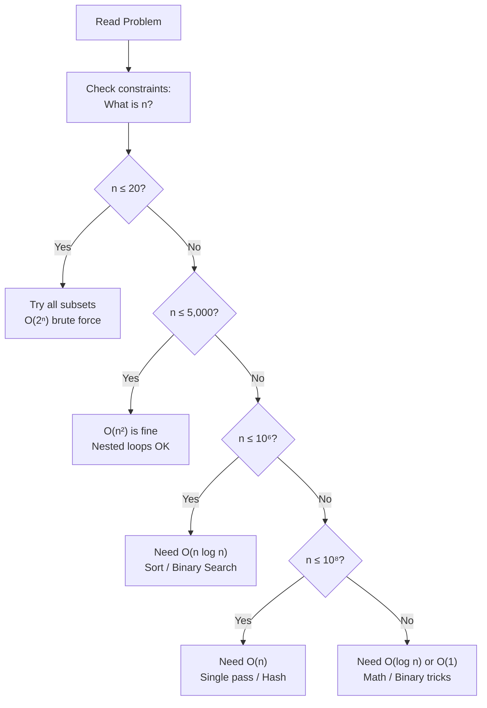
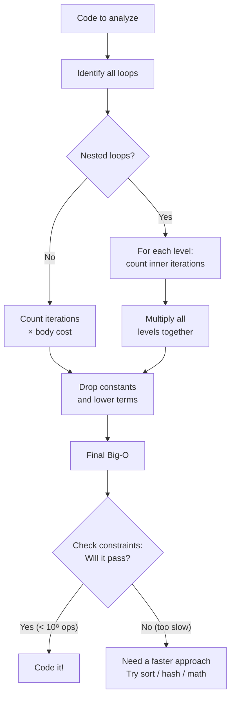

# How Fast Is Your Code? — The Art of Counting Steps

## Chapter Goals

By the end of this chapter, you will be able to:

- [ ] **Count the steps of any loop** — given a for/while loop, determine how many times the body executes in terms of n
- [ ] **Classify code into Big-O families** — recognize O(1), O(log n), O(n), O(n log n), O(n²), O(n³), O(2ⁿ) by looking at loop structure
- [ ] **Analyze nested loops** — compute time complexity of double and triple loops, including loops with dependent bounds
- [ ] **Understand space complexity** — count the extra memory your code uses beyond the input
- [ ] **Read constraints to choose algorithms** — given n ≤ X, determine which Big-O families will pass within time limits
- [ ] **Explain why one approach beats another** — use Big-O to compare brute force vs. optimized solutions (as in the Two Sum showcase)
- [ ] **Write a direct proof** — prove "if this loop runs n times doing O(1) work each time, then total work is O(n)"

---

## The Story: The Race

Two friends, Alex and Blake, sign up for a coding competition. The challenge: given a massive list of numbers, find whether a specific target value exists in the list.

Alex's approach is simple — check every element, one by one, from start to finish. "If the target's in there, I'll find it eventually." For a list of 10 numbers, Alex finishes in a blink. For 1,000 numbers, still fast. No big deal.

Blake takes a different approach. "Let me sort the list first, then I'll use a trick — start in the middle, and cut the search space in half each time." It takes a moment to sort, but after that, each search is lightning-fast.

Now the real test: a list of **one billion** numbers.

Alex starts checking. One... two... three... After an hour, Alex is barely 1% through. At this rate, it'll take **days**.

Blake sorts the list (a few minutes for a billion numbers), then searches. **Thirty comparisons** — and Blake has the answer. Not thirty thousand. Not thirty million. Just thirty.

How is this possible? Blake's trick (binary search — you'll learn it in Ch 9!) cuts the problem in half every step. To search a billion items, you only need log₂(1,000,000,000) ≈ 30 steps.

The lesson? **Code speed isn't about typing faster or having a better computer. It's about choosing the right strategy.** This chapter teaches you how to predict who wins the race — without actually running it.

---

## Johari Window: Before

Before diving in, take 5 minutes to fill out the **"Before"** section of your [Johari Window worksheet](johari.md).


Be honest with yourself! Knowing what you *don't* know is the first step to learning it. There are no wrong answers — only honest ones.


---

## Discovery


**Stop! Try these BEFORE reading the chapter.** Struggling with a problem before learning the solution is how your brain builds the strongest connections. Spend at least 10 minutes on each one.


### Discovery 1: The Mystery Timer

Here are four Python functions that all compute something based on n. **Without running them**, rank them from fastest to slowest when n = 1,000,000. Then predict: which ones would finish in under 1 second? Which might take minutes? Hours?

```python
def func_a(n):
    """Function A"""
    total = 0
    for i in range(n):
        total += i
    return total

def func_b(n):
    """Function B"""
    total = 0
    for i in range(n):
        for j in range(n):
            total += 1
    return total

def func_c(n):
    """Function C"""
    return n * (n - 1) // 2

def func_d(n):
    """Function D"""
    total = 0
    i = 1
    while i < n:
        total += 1
        i *= 2
    return total
```

Write down your predictions before moving on. We'll come back to check them.

### Discovery 2: The Constraint Clue

A USACO problem says: **"1 ≤ n ≤ 10⁶, time limit: 2 seconds."**

Your friend writes a solution with two nested loops over the array — essentially checking every pair of elements. Should they submit it?

Now imagine the same problem but with **n ≤ 1,000**. Would the same solution work now?

What about **n ≤ 10**?

Why do the constraints change the answer? What are the constraints *telling* you?

---

## 6.1 What Is Big-O? — Counting Steps, Not Seconds

Here's the key insight of this entire chapter:


**We don't measure code speed in seconds.** Seconds depend on your computer, your programming language, what else is running, and a hundred other things. Instead, we count **operations** — how many "steps" the code takes as a function of the input size n.


A modern computer can perform roughly **10⁸ to 10⁹ simple operations per second** (additions, comparisons, array accesses). This gives us a universal rule of thumb:

- **10⁸ operations ≈ 1 second** (conservative estimate, works for any language)

So if your code does 10¹⁰ operations on a given input, it'll take about 100 seconds — way too slow for a 2-second time limit.

### Why We Drop Constants

Suppose two functions both loop through an array of n elements:
- Function A does `2n` operations (reads each element, then adds it)
- Function B does `5n` operations (reads, validates, converts, adds, logs)

For large n, both grow at the same rate — linearly. If n doubles, both take roughly twice as long. The difference between 2n and 5n is just a constant multiplier. We say both are **O(n)** — "order n" — because the *shape* of the growth is what matters, not the exact multiplier.

### Why We Drop Lower-Order Terms

What about `n² + 100n`? When n = 10, the terms are 100 + 1000 — the `100n` term matters. But when n = 10,000, the terms are 100,000,000 + 1,000,000. The n² term is **100 times larger** than the 100n term. For large n, the n² dominates, so we write **O(n²)**.

### The Big-O Families

Here's your cheat sheet — the "cast of characters" you'll encounter throughout this book:

| Big-O | Nickname | n = 10 | n = 1,000 | n = 10⁶ | Passes 2s limit? |
|-------|----------|--------|-----------|---------|------------------|
| O(1) | Constant | 1 | 1 | 1 | Always |
| O(log n) | Logarithmic | 3 | 10 | 20 | Always |
| O(n) | Linear | 10 | 1,000 | 10⁶ | Always |
| O(n log n) | Log-linear | 33 | 10,000 | 2 × 10⁷ | Usually |
| O(n²) | Quadratic | 100 | 10⁶ | 10¹² | Only if n ≤ ~10⁴ |
| O(n³) | Cubic | 1,000 | 10⁹ | — | Only if n ≤ ~1,000 |
| O(2ⁿ) | Exponential | 1,024 | — | — | Only if n ≤ ~25 |

Notice the dramatic differences. O(n) at n = 10⁶ is 10⁶ operations — a fraction of a second. O(n²) at n = 10⁶ is 10¹² operations — that's about **10,000 seconds**, or nearly 3 hours!


**Growth matters more than speed.** A slow O(n) solution will eventually beat a fast O(n²) solution — you just need n to be large enough. That's the whole point of Big-O: predicting which approach wins in the long run.


### Back to Discovery 1

Now you can answer: func_c is O(1) — a single formula, instant. func_d is O(log n) — about 20 steps for n = 10⁶. func_a is O(n) — 10⁶ steps, under a second. func_b is O(n²) — 10¹² steps, would take hours!

---

## 6.2 Analyzing Loops — Your Step-Counting Toolkit

This is the most practical section of the chapter. You'll learn to look at any loop and instantly classify its complexity.

### Pattern 1: Simple Loop — O(n)



```python
# O(n) — the body runs exactly n times
total = 0
for i in range(n):
    total += i        # O(1) work per iteration
# Total: n × O(1) = O(n)
```


```java
// O(n) — the body runs exactly n times
int total = 0;
for (int i = 0; i < n; i++) {
    total += i;       // O(1) work per iteration
}
// Total: n × O(1) = O(n)
```


```cpp
// O(n) — the body runs exactly n times
int total = 0;
for (int i = 0; i < n; i++) {
    total += i;       // O(1) work per iteration
}
// Total: n × O(1) = O(n)
```



> **Language Spotlight: Loop syntax**
> | | Python | Java | C++ |
> |---|--------|------|-----|
> | Range loop | `for i in range(n)` | `for (int i = 0; i < n; i++)` | `for (int i = 0; i < n; i++)` |
> | Same Big-O? | Yes — O(n) | Yes — O(n) | Yes — O(n) |
>
> The syntax differs, but the step count is identical: n iterations, O(1) per iteration.

### Pattern 2: Loop with Step > 1 — Still O(n)



```python
# O(n/2) = O(n) — step of 2, but we drop the constant
for i in range(0, n, 2):
    total += i        # Runs n/2 times
# Total: O(n/2) = O(n) — dropping the 1/2 constant
```


```java
// O(n/2) = O(n) — step of 2, but we drop the constant
for (int i = 0; i < n; i += 2) {
    total += i;       // Runs n/2 times
}
```


```cpp
// O(n/2) = O(n) — step of 2, but we drop the constant
for (int i = 0; i < n; i += 2) {
    total += i;       // Runs n/2 times
}
```



### Pattern 3: Logarithmic Loop — O(log n)



```python
# O(log n) — i doubles each time
i = 1
while i < n:
    total += i
    i *= 2            # 1, 2, 4, 8, 16, ... until >= n
# How many doublings to reach n? That's log₂(n)
```


```java
// O(log n) — i doubles each time
int i = 1;
while (i < n) {
    total += i;
    i *= 2;           // 1, 2, 4, 8, 16, ... until >= n
}
// Iterations: log₂(n)
```


```cpp
// O(log n) — i doubles each time
int i = 1;
while (i < n) {
    total += i;
    i *= 2;           // 1, 2, 4, 8, 16, ... until >= n
}
// Iterations: log₂(n)
```




**Why is doubling logarithmic?** If i starts at 1 and doubles each step, after k steps i = 2ᵏ. We stop when 2ᵏ ≥ n, so k = log₂(n). For n = 1,000,000, that's only about 20 steps. For n = 1,000,000,000, just 30 steps. Logarithms grow *incredibly slowly*.


Similarly, a loop that *halves* n each time (like binary search) is also O(log n):

```python
# Also O(log n) — n halves each time
while n > 1:
    n //= 2           # n, n/2, n/4, ..., 1
```

### Pattern 4: Nested Loops — O(n²)



```python
# O(n²) — outer runs n times, inner runs n times EACH time
for i in range(n):
    for j in range(n):
        total += 1    # This line runs n × n = n² times
# Total: O(n²)
```


```java
// O(n²) — outer runs n times, inner runs n times EACH time
for (int i = 0; i < n; i++) {
    for (int j = 0; j < n; j++) {
        total++;      // This line runs n × n = n² times
    }
}
```


```cpp
// O(n²) — outer runs n times, inner runs n times EACH time
for (int i = 0; i < n; i++) {
    for (int j = 0; j < n; j++) {
        total++;      // This line runs n × n = n² times
    }
}
```



### Pattern 5: Dependent Nested Loops — Still O(n²)

This is the tricky case that catches many beginners:



```python
# The inner loop depends on the outer loop's variable
for i in range(n):
    for j in range(i, n):   # j starts at i, not 0!
        total += 1

# When i=0: inner runs n times
# When i=1: inner runs n-1 times
# When i=2: inner runs n-2 times
# ...
# When i=n-1: inner runs 1 time
# Total: n + (n-1) + (n-2) + ... + 1 = n(n+1)/2 = O(n²)
```


```java
// The inner loop depends on the outer loop's variable
for (int i = 0; i < n; i++) {
    for (int j = i; j < n; j++) {   // j starts at i!
        total++;
    }
}
// Total: n + (n-1) + ... + 1 = n(n+1)/2 = O(n²)
```


```cpp
// The inner loop depends on the outer loop's variable
for (int i = 0; i < n; i++) {
    for (int j = i; j < n; j++) {   // j starts at i!
        total++;
    }
}
// Total: n + (n-1) + ... + 1 = n(n+1)/2 = O(n²)
```




**The triangular sum**: n + (n-1) + (n-2) + ... + 1 = n(n+1)/2. This is approximately n²/2, and since we drop constants, it's O(n²). You'll see this sum pattern *everywhere* in algorithm analysis.


### Pattern 6: Loop with Early Exit — O(n) Worst Case



```python
# Best case: O(1) — target is the first element
# Worst case: O(n) — target is the last element (or missing)
for i in range(n):
    if arr[i] == target:
        return i       # Early exit!
return -1

# We say this is O(n) — Big-O describes the WORST case
```


```java
// Best: O(1), Worst: O(n) — we report O(n)
for (int i = 0; i < n; i++) {
    if (arr[i] == target) return i;
}
return -1;
```


```cpp
// Best: O(1), Worst: O(n) — we report O(n)
for (int i = 0; i < n; i++) {
    if (arr[i] == target) return i;
}
return -1;
```



### Quick Reference: Loop → Big-O

| Loop Pattern | Example | Big-O |
|-------------|---------|-------|
| Single loop, 0 to n | `for i in range(n)` | O(n) |
| Single loop, step 2 | `for i in range(0, n, 2)` | O(n) |
| Doubling loop | `while i < n: i *= 2` | O(log n) |
| Halving loop | `while n > 1: n //= 2` | O(log n) |
| Two nested loops | `for i: for j` (both to n) | O(n²) |
| Dependent nested | `for i: for j in range(i, n)` | O(n²) |
| Three nested loops | `for i: for j: for k` | O(n³) |
| Loop + log inner | `for i: while j < n: j *= 2` | O(n log n) |
| Two sequential loops | `for i` then `for j` (both to n) | O(n) |


**Sequential loops add; nested loops multiply.** Two separate O(n) loops = O(n) + O(n) = O(n). An O(n) loop containing an O(n) loop = O(n) × O(n) = O(n²).


---

## 6.3 Space Complexity — Memory Matters Too

So far we've counted **time** (operations). But algorithms also use **space** (memory). Space complexity counts the **extra** memory your code uses beyond the input.

### O(1) Extra Space — In-Place

```python
# Swap two elements — only uses a temp variable
def swap(arr, i, j):
    temp = arr[i]     # One extra variable
    arr[i] = arr[j]
    arr[j] = temp
# Extra space: O(1) — just one variable regardless of array size
```

### O(n) Extra Space — Creating a Copy

```python
# Reverse an array by creating a new one
def reverse_copy(arr):
    result = []        # New array of size n
    for i in range(len(arr) - 1, -1, -1):
        result.append(arr[i])
    return result
# Extra space: O(n) — the new array is as big as the input
```

### The Space-Time Tradeoff


**Thread: "Trade space for time"** — This is one of the most important ideas in all of computer science. Almost every major optimization in this book follows this pattern: **use more memory to achieve faster code**.

- Checking if an element exists in a list: O(n) time, O(1) space
- Checking if an element exists in a **set**: O(1) time, O(n) space for the set

The set uses more memory, but it's dramatically faster. You're *trading* space for time. We saw this pattern in Ch 5 with the Find Duplicates showcase (set approach), and we'll see it again and again: hash maps (Ch 11), prefix sums (Ch 14), memoization/DP (Ch 23), segment trees (Ch 30).


---

## 6.4 Reading Constraints — The Cheat Code

Every competitive programming problem tells you the input constraints. This is **not** just for edge cases — it's a massive hint about which algorithm to use!

Here's the mapping every competitive programmer memorizes:

| Constraint | Max Operations | Acceptable Big-O |
|-----------|---------------|-----------------|
| n ≤ 10 | ~100 | O(n!), O(2ⁿ) — try everything |
| n ≤ 20 | ~10⁶ | O(2ⁿ) — subsets, bitmasks |
| n ≤ 500 | ~10⁸ | O(n³) — triple nested loops |
| n ≤ 5,000 | ~10⁷ | O(n²) — double nested loops |
| n ≤ 10⁵ | ~10⁷ | O(n log n) — sort, then scan |
| n ≤ 10⁶ | ~10⁸ | O(n) or O(n log n) |
| n ≤ 10⁸ | ~10⁸ | O(n) — just barely |
| n ≤ 10¹⁸ | ~60 | O(log n) or O(1) — math/binary |


**Back to Discovery 2**: The problem said n ≤ 10⁶. Your friend's nested-loop solution is O(n²) = 10¹² operations. That's 10,000 seconds — a TLE. But with n ≤ 1,000, O(n²) = 10⁶ operations — well under 1 second. And with n ≤ 10, even O(n!) works. The constraints told you the answer all along!


---

## 6.5 Proof Technique: Direct Proof


**Your first proof technique!** A *direct proof* works like this: start from what you know, then reason step by step to what you want to show. No tricks, no contradictions — just straight logic.


Let's prove that a simple loop is O(n):

**Claim**: The following code runs in O(n) time:
```python
total = 0
for i in range(n):
    total += i
```

**Proof**:
1. The loop body (`total += i`) is a single addition — it takes O(1) time.
2. The loop runs exactly n times (i goes from 0 to n-1).
3. Total time = (number of iterations) × (time per iteration) = n × O(1) = **O(n)**.

That's it! A direct proof for the complexity of a loop.

Let's do a slightly harder one:

**Claim**: Two sequential O(n) loops have total complexity O(n).

**Proof**:
1. Loop 1 runs n times, doing O(1) work each time → O(n) total.
2. Loop 2 runs n times, doing O(1) work each time → O(n) total.
3. Total = O(n) + O(n) = O(2n) = **O(n)** (dropping the constant).

And one more — the nested loop:

**Claim**: Nested loops `for i in range(n): for j in range(n)` run in O(n²).

**Proof**:
1. The inner loop runs n times, doing O(1) work → O(n) per outer iteration.
2. The outer loop runs n times, each triggering O(n) inner work.
3. Total = n × O(n) = **O(n²)**.


Direct proofs feel almost too simple — and that's the point. They formalize what your intuition already tells you. As we encounter more complex algorithms later, these proofs will become essential tools for convincing yourself (and others) that your code actually works.


---

## Think Like a Pro


**Tourist (Gennady Korotkevich)** — the greatest competitive programmer of all time:

*"Before I write a single line of code, I check the constraints and calculate whether my approach will pass. If n is 10⁵, I know I need O(n log n) or better. This takes 10 seconds and prevents 30 minutes of debugging a Time Limit Exceeded verdict."*

**Why this matters**: Most beginners write code first, then discover it's too slow. Tourist does the math first — it's faster to think for 10 seconds than to debug for 30 minutes.

**Errichto** — one of the fastest problem solvers in competitive programming:

*"The constraints are a gift from the problem setter. They're telling you exactly what complexity you need. n ≤ 2000 is practically screaming 'O(n²) will work!' Learn to read this language."*

**Your takeaway**:
1. Read the constraints FIRST — before even thinking about an approach
2. Calculate: n² at n = 5000 = 25,000,000 → passes. n² at n = 100,000 = 10,000,000,000 → TLE.
3. Let the constraints guide your algorithm choice


---

## Thinking Flowchart: From Constraints to Approach



Print this flowchart and keep it next to your monitor. After a few dozen problems, it'll become second nature.

---

## Implementation Flowchart: How to Analyze Any Code



---

## AOPS Showcase: "Two Sum" — Three Approaches


**The AOPS Method**: Solve the same problem multiple ways, then compare. You learn more from three solutions to one problem than one solution to three problems.


You solved Two Sum in Chapter 5. Now let's put on our Big-O glasses and see *why* each approach is fast or slow.

**Problem**: Given an array of n integers and a target value, find two numbers that add up to the target. Return their indices.

**Example**: `[2, 7, 11, 15]`, target = 9 → `[0, 1]` (because 2 + 7 = 9)

### Approach 1: Brute Force — Check Every Pair (O(n²))

For each element, check every other element to see if they sum to the target.



```python
def two_sum_brute(nums, target):
    n = len(nums)
    for i in range(n):                    # n iterations
        for j in range(i + 1, n):         # up to n iterations each
            if nums[i] + nums[j] == target:
                return [i, j]
    return [-1, -1]
# Time: O(n²)  |  Space: O(1)
```


```java
static int[] twoSumBrute(int[] nums, int target) {
    int n = nums.length;
    for (int i = 0; i < n; i++) {
        for (int j = i + 1; j < n; j++) {
            if (nums[i] + nums[j] == target) {
                return new int[]{i, j};
            }
        }
    }
    return new int[]{-1, -1};
}
// Time: O(n²)  |  Space: O(1)
```


```cpp
vector<int> twoSumBrute(vector<int>& nums, int target) {
    int n = nums.size();
    for (int i = 0; i < n; i++) {
        for (int j = i + 1; j < n; j++) {
            if (nums[i] + nums[j] == target) {
                return {i, j};
            }
        }
    }
    return {-1, -1};
}
// Time: O(n²)  |  Space: O(1)
```



**Analysis**: Two nested loops, each up to n → O(n²). No extra data structures → O(1) space.

### Approach 2: Sort + Two Pointers (O(n log n))

Sort the array (keeping track of original indices), then use two pointers from both ends.



```python
def two_sum_sort(nums, target):
    indexed = sorted(enumerate(nums), key=lambda x: x[1])
    lo, hi = 0, len(indexed) - 1
    while lo < hi:
        current = indexed[lo][1] + indexed[hi][1]
        if current == target:
            a, b = indexed[lo][0], indexed[hi][0]
            return [min(a, b), max(a, b)]
        elif current < target:
            lo += 1
        else:
            hi -= 1
    return [-1, -1]
# Time: O(n log n)  |  Space: O(n) for the indexed copy
```


```java
static int[] twoSumSort(int[] nums, int target) {
    int n = nums.length;
    int[][] indexed = new int[n][2];
    for (int i = 0; i < n; i++) {
        indexed[i] = new int[]{nums[i], i};
    }
    Arrays.sort(indexed, (a, b) -> a[0] - b[0]);
    int lo = 0, hi = n - 1;
    while (lo < hi) {
        int sum = indexed[lo][0] + indexed[hi][0];
        if (sum == target) {
            int a = indexed[lo][1], b = indexed[hi][1];
            return new int[]{Math.min(a, b), Math.max(a, b)};
        } else if (sum < target) lo++;
        else hi--;
    }
    return new int[]{-1, -1};
}
// Time: O(n log n)  |  Space: O(n)
```


```cpp
vector<int> twoSumSort(vector<int>& nums, int target) {
    int n = nums.size();
    vector<pair<int,int>> indexed(n);
    for (int i = 0; i < n; i++) indexed[i] = {nums[i], i};
    sort(indexed.begin(), indexed.end());
    int lo = 0, hi = n - 1;
    while (lo < hi) {
        int sum = indexed[lo].first + indexed[hi].first;
        if (sum == target) {
            int a = indexed[lo].second, b = indexed[hi].second;
            return {min(a, b), max(a, b)};
        } else if (sum < target) lo++;
        else hi--;
    }
    return {-1, -1};
}
// Time: O(n log n)  |  Space: O(n)
```



**Analysis**: Sorting is O(n log n). The two-pointer scan is O(n). Total: O(n log n) + O(n) = **O(n log n)**. We need O(n) extra space for the indexed copy.

### Approach 3: Hash Map — One Pass (O(n))

For each element, check if its *complement* (target - element) is already in the hash map.



```python
def two_sum_hash(nums, target):
    seen = {}                             # complement -> index
    for i, num in enumerate(nums):        # n iterations
        complement = target - num
        if complement in seen:            # O(1) lookup
            return [seen[complement], i]
        seen[num] = i                     # O(1) insert
    return [-1, -1]
# Time: O(n)  |  Space: O(n) for the hash map
```


```java
static int[] twoSumHash(int[] nums, int target) {
    Map<Integer, Integer> seen = new HashMap<>();
    for (int i = 0; i < nums.length; i++) {
        int complement = target - nums[i];
        if (seen.containsKey(complement)) {
            return new int[]{seen.get(complement), i};
        }
        seen.put(nums[i], i);
    }
    return new int[]{-1, -1};
}
// Time: O(n)  |  Space: O(n)
```


```cpp
vector<int> twoSumHash(vector<int>& nums, int target) {
    unordered_map<int, int> seen;
    for (int i = 0; i < (int)nums.size(); i++) {
        int complement = target - nums[i];
        if (seen.count(complement)) {
            return {seen[complement], i};
        }
        seen[nums[i]] = i;
    }
    return {-1, -1};
}
// Time: O(n)  |  Space: O(n)
```



**Analysis**: One loop, O(1) hash operations inside → O(n) total. Uses O(n) space for the hash map.

### Comparison Table

| | Brute Force | Sort + Two Ptr | Hash Map |
|---|---|---|---|
| **Time** | O(n²) | O(n log n) | O(n) |
| **Space** | O(1) | O(n) | O(n) |
| **n = 100** | 10,000 ops | ~700 ops | ~100 ops |
| **n = 10⁵** | 10¹⁰ (TLE!) | ~1.7 × 10⁶ | ~10⁵ |
| **n = 10⁶** | Impossible | ~2 × 10⁷ | ~10⁶ |
| **Key Idea** | Try everything | Sort enables two pointers | Trade space for time |


**Three threads in one showcase!**
- **"Sort first, think later"** (Approach 2): Sorting the data first made two pointers possible. This thread continues in Ch 8, 9, 13, 15, and 18.
- **"Trade space for time"** (Approach 3): The hash map uses O(n) extra memory to achieve O(n) time. This thread continues in Ch 11, 14, 23-25, and 30.
- **"The right question"**: Approach 3 reframes the problem. Instead of "find two numbers summing to target," it asks "for each number, have I already seen its complement?" Asking the *right question* turns O(n²) into O(n). This thread continues in Ch 9 (binary search on answers) and Ch 23 (DP formulation).


---

## Legend's Corner


**Neal Wu** started competitive programming in 8th grade — your age! He went on to become a USACO legend and a top competitive programmer worldwide. His advice about time complexity:

*"The first thing I do when I see a USACO problem is look at n. Not the problem statement — the constraints. If n ≤ 5000, I know O(n²) works. If n ≤ 200,000, I need O(n log n). This 5-second habit saved me from countless Time Limit Exceeded verdicts. I learned this the hard way — my first three Bronze contests, I kept getting TLE because I didn't understand that a 'correct' solution isn't enough. It has to be correct AND fast enough."*

Try it yourself! The next time you open a problem, read the constraints before you read anything else.


---

## Gotchas


**Gotcha 1: O(2n) is NOT O(2ⁿ)**

These look similar but are *wildly* different:
- O(2n) = O(n) — just a constant multiplier. For n = 10⁶, that's 2 × 10⁶ operations. Fast.
- O(2ⁿ) = exponential. For n = 60, that's 2⁶⁰ ≈ 10¹⁸ operations. Would take *centuries*.

The first drops the constant (2n → n). The second has n in the *exponent* — you can never drop it. When you see 2ⁿ, be afraid.



**Gotcha 2: "Fastest" doesn't always mean "best"**

An O(n) solution using a complex hash map might actually be *slower in practice* than an O(n log n) sort-based solution for small n. Big-O hides constant factors — a hash map with collision handling might do 50 operations per element, while sorting does 15.

Big-O tells you who wins the *marathon* (large n), not the *sprint* (small n). For competitive programming with n ≥ 10⁴, Big-O is almost always the right guide.



**Gotcha 3: Average case vs. worst case**

- Hash map lookup: O(1) *average*, but O(n) worst case (all keys collide)
- Quicksort: O(n log n) average, but O(n²) worst case (already sorted input)

In competitive programming, we usually care about **worst case** — the judge might use adversarial test cases designed to break average-case algorithms. Mergesort is O(n log n) always; quicksort is O(n log n) usually. That "usually" can cost you.



**Gotcha 4: Space counts too!**

Creating a copy of an array takes O(n) space. Building a hash map of n elements takes O(n) space. If the problem says "Memory limit: 256 MB" and n = 10⁸, an array of 10⁸ integers takes 400 MB (each `int` = 4 bytes) — you'll get Memory Limit Exceeded!

Always think about both time AND space complexity.



**Gotcha 5: n² isn't always bad**

If n ≤ 1000, then n² = 10⁶ operations. That's well under the 10⁸ limit — it'll run in milliseconds. Don't waste time writing a complex O(n log n) solution when O(n²) is fast enough.

Remember Errichto's advice: let the constraints tell you what complexity you need. Over-optimizing is just as much a time waste as under-optimizing.



**Gotcha 6: Log base doesn't matter in Big-O**

You might wonder: is it O(log₂ n) or O(log₁₀ n)?

Answer: it doesn't matter! log₂ n = log₁₀ n / log₁₀ 2, and 1/log₁₀ 2 is just a constant (~3.32). Since we drop constants in Big-O, O(log₂ n) = O(log₁₀ n) = O(ln n). We just write O(log n).


---

## Practice Problems

Solve these in order! Warmups build fundamentals, Practice combines concepts, and Challenges push your limits.

| # | Problem | Difficulty | Topic | File |
|---|---------|-----------|-------|------|
| W1 | Count the Steps | ⭐ | Loop analysis | `warmup_01_count_steps` |
| W2 | Is It Fast Enough? | ⭐ | Constraint reading | `warmup_02_fast_enough` |
| W3 | Mystery Complexity | ⭐ | Classification | `warmup_03_mystery_complexity` |
| W4 | Sum of 1 to N | ⭐ | Multiple approaches | `warmup_04_sum_to_n` |
| P1 | Contains Duplicate | ⭐⭐ | Space-time tradeoff | `practice_01_contains_duplicate` |
| P2 | Max Subarray Sum (Brute) | ⭐⭐ | Nested loop analysis | `practice_02_max_subarray_brute` |
| P3 | Sorted Squares | ⭐⭐ | Two-pointer O(n) | `practice_03_sorted_squares` |
| P4 | Majority Element | ⭐⭐ | O(1) space algorithm | `practice_04_majority_element` |
| C1 | Two Sum Three Ways | ⭐⭐⭐ | AOPS multi-approach | `challenge_01_two_sum_three_ways` |
| C2 | Performance Showdown | ⭐⭐⭐ | Comparative analysis | `challenge_02_performance_showdown` |


**Something different about this chapter's problems**: W1, W2, W3, and C2 don't ask you to solve an algorithmic problem — they ask you to **analyze** code. You're learning a *meta-skill*: the ability to reason about code speed without running it. This is what separates a coder from an algorithm designer.




**Try in Google Colab!** Solve these problems in your browser — no setup needed.

[C1: Two Sum Three Ways](https://colab.research.google.com/github/xikimai/dsa-a2z/blob/main/code/notebooks/ch06/challenge_01_two_sum_three_ways.ipynb) | 
[C2: Performance Showdown](https://colab.research.google.com/github/xikimai/dsa-a2z/blob/main/code/notebooks/ch06/challenge_02_performance_showdown.ipynb) | 
[P1: Contains Duplicate](https://colab.research.google.com/github/xikimai/dsa-a2z/blob/main/code/notebooks/ch06/practice_01_contains_duplicate.ipynb) | 
[P2: Max Subarray Brute](https://colab.research.google.com/github/xikimai/dsa-a2z/blob/main/code/notebooks/ch06/practice_02_max_subarray_brute.ipynb) | 
[P3: Sorted Squares](https://colab.research.google.com/github/xikimai/dsa-a2z/blob/main/code/notebooks/ch06/practice_03_sorted_squares.ipynb) | 
[P4: Majority Element](https://colab.research.google.com/github/xikimai/dsa-a2z/blob/main/code/notebooks/ch06/practice_04_majority_element.ipynb) | 
[W1: Count Steps](https://colab.research.google.com/github/xikimai/dsa-a2z/blob/main/code/notebooks/ch06/warmup_01_count_steps.ipynb) | 
[W2: Fast Enough](https://colab.research.google.com/github/xikimai/dsa-a2z/blob/main/code/notebooks/ch06/warmup_02_fast_enough.ipynb) | 
[W3: Mystery Complexity](https://colab.research.google.com/github/xikimai/dsa-a2z/blob/main/code/notebooks/ch06/warmup_03_mystery_complexity.ipynb) | 
[W4: Sum To N](https://colab.research.google.com/github/xikimai/dsa-a2z/blob/main/code/notebooks/ch06/warmup_04_sum_to_n.ipynb)



---

## Language Idioms

How do you actually *measure* code speed in each language?



```python
import time

# Simple timing
start = time.time()
# ... your code ...
elapsed = time.time() - start
print(f"Took {elapsed:.4f} seconds")

# Python-specific performance notes:
# - len() is O(1) — Python stores the length
# - 'x in set' is O(1), 'x in list' is O(n)
# - sorted() returns a new list: O(n log n) time, O(n) space
# - list.sort() sorts in place: O(n log n) time, O(1) extra space
# - dict/set operations are O(1) average

# Python's big weakness: it's ~10-50x slower than C++ per operation
# So for Python, aim for 10^7 operations (not 10^8) to stay within limits
```


```java
// Simple timing
long start = System.nanoTime();
// ... your code ...
long elapsed = System.nanoTime() - start;
System.out.printf("Took %.4f seconds%n", elapsed / 1e9);

// Java-specific performance notes:
// - ArrayList.get(i) is O(1), .contains() is O(n)
// - HashSet.contains() is O(1) average
// - Arrays.sort() for primitives: dual-pivot quicksort O(n log n)
// - Arrays.sort() for objects: TimSort O(n log n), stable
// - HashMap operations are O(1) average

// Java is ~2-5x slower than C++ per operation
// Aim for ~5 × 10^7 operations to stay within 2-second limits
```


```cpp
#include <chrono>

// Simple timing
auto start = chrono::high_resolution_clock::now();
// ... your code ...
auto elapsed = chrono::duration_cast<chrono::milliseconds>(
    chrono::high_resolution_clock::now() - start).count();
cout << "Took " << elapsed << " ms" << endl;

// C++ performance notes:
// - vector::operator[] is O(1)
// - unordered_set::count() is O(1) average
// - sort() uses IntroSort: O(n log n), very fast in practice
// - unordered_map operations are O(1) average
// - C++ is the fastest of the three languages

// C++ can handle ~10^8-10^9 operations per second
// This is the gold standard for competitive programming
```



> **Language Spotlight: Speed Differences**
> | | Python | Java | C++ |
> |---|--------|------|-----|
> | Ops per second | ~10⁷ | ~5 × 10⁷ | ~10⁸-10⁹ |
> | Safe budget (2s) | ~2 × 10⁷ | ~10⁸ | ~2 × 10⁸ |
> | Sorting algorithm | TimSort | TimSort / DPQuicksort | IntroSort |
> | Hash map | `dict` | `HashMap` | `unordered_map` |
>
> **Why this matters for USACO**: Python works well for Bronze (small n). For Silver and beyond, Java or C++ is strongly recommended because of the speed difference. At Gold/Platinum, most top competitors use C++.

---

## Breadcrumbs


### Looking Back (Callbacks)

- **Ch 2 (First Programs)**: Your "Hello World" was O(1) — one line, one operation, done. A loop printing 1 to n was O(n). You were already writing code with different complexities — now you can name them.
- **Ch 3 (Decisions and Loops)**: The diamond pattern? That nested loop was O(n²). The simple prime checker that tested every number from 2 to n was O(n). You knew nested loops were "slower" — now you know *exactly* how much slower.
- **Ch 4 (Functions)**: The three `is_prime` approaches — trial division O(n), square root O(√n), 6k±1 trick O(√n/3) — were your first optimization showcase. Now you can put precise labels on each one and explain *why* O(√n) is better than O(n).
- **Ch 5 (Collections)**: `x in list` is O(n). `x in set` is O(1). *That's* why sets exist — the Big-O difference. The "Find Duplicates" AOPS showcase showed O(n²) → O(n log n) → O(n). Now you understand exactly why each approach was faster.

### Looking Forward (Foreshadowing)

- **Ch 7 (Number Wizardry)**: GCD by repeated subtraction is O(max(a,b)). The Euclidean algorithm is O(log(min(a,b))). The Sieve of Eratosthenes finds all primes up to n in O(n log log n). Big-O helps you choose the right math technique.
- **Ch 8 (Sorting)**: You'll build O(n²) sorts (bubble, selection, insertion) and O(n log n) sorts (merge sort). Big-O explains *why* merge sort is fundamentally faster — and you'll prove it.
- **Ch 9 (Binary Search)**: Binary search is O(log n). For a billion elements, that's just 30 steps. Now you understand *why* it's that fast — it halves the search space each step.
- **Ch 23 (Dynamic Programming)**: Memoization is "trade space for time" at industrial scale. Instead of O(2ⁿ) recursive calls, you store results in O(n) memory and achieve O(n) time.

### Cross-Chapter Threads

- **"Trade space for time"**: Formally introduced in the AOPS Showcase (hash map Two Sum). This is the most important optimization pattern in all of computer science. Continues in Ch 11, 14, 23-25, and 30.
- **"The right question"**: The hash map Two Sum works because it reframes the problem. Instead of "find a pair," ask "have I seen the complement?" This thread continues in Ch 9 (binary search on answers), Ch 16, and Ch 23 (DP state formulation).


---

## Johari Window: After

Now go back to your [Johari Window worksheet](johari.md) and fill out the **"After"** section. Compare your "Before" and "After" answers — what surprised you?

---

## Open Questions Beyond


These are mysteries, not homework. Let them simmer in the back of your mind.

1. **The Sorting Speed Limit**: We said sorting is O(n log n). But is that the *fastest possible*? Can we prove that no comparison-based sort can do better? And if there IS a speed limit... are there sorts that cheat by not comparing elements? (Hint: counting sort and radix sort break the O(n log n) barrier under specific conditions. You'll explore this in Ch 8.)

2. **O(n) vs. O(n) — Are They Really the Same?** Two algorithms are both O(n). One does n operations. The other does 100n operations. Big-O says they're "the same." But in practice, the second is 100x slower. When do these constant factors actually matter? (This leads to real-world performance tuning, cache effects, and why C++ is faster than Python for the same Big-O.)

3. **The Amortized Mystery**: When you `append` to a Python list, it's usually O(1). But occasionally, Python has to resize the underlying array — which copies ALL elements, taking O(n). So is `append` O(1) or O(n)? (The answer is "amortized O(1)" — a clever argument that averages the expensive operations over many cheap ones. You'll encounter this idea formally in Part III.)


---

## What's Next

Congratulations — you've completed **Part I: Learning to Speak Code**!

Think about how far you've come. In Chapter 2, you wrote your first "Hello World." Now you can write functions in three languages, manipulate collections of data, and **analyze the speed of any code you write**. You've gone from "someone who can type code" to "someone who can think about code."

You now have five fundamental skills:
1. **Variables and I/O** (Ch 2) — talk to the computer
2. **Control flow** (Ch 3) — make decisions and repeat
3. **Functions** (Ch 4) — organize and reuse
4. **Collections** (Ch 5) — store and organize data
5. **Complexity analysis** (Ch 6) — predict how fast your code is

In **Part II: The Bronze Forge**, you'll use all five skills to tackle real algorithmic problems. Chapter 7: Number Wizardry dives into the beautiful world of mathematical algorithms — GCD, primes, modular arithmetic — and you'll analyze every algorithm using the Big-O toolkit from this chapter.

The race has just begun. And now you know how to predict who wins.
