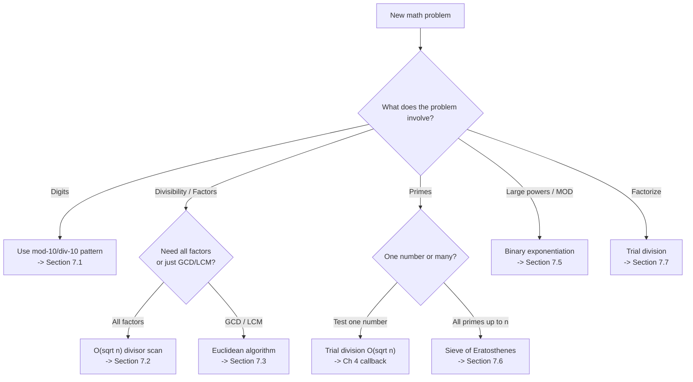
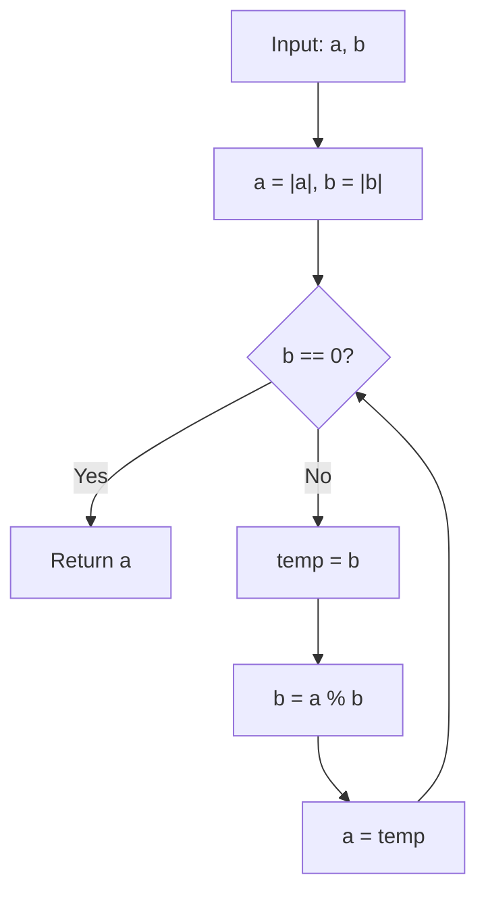

# Number Wizardry — Math for Programmers

## Chapter Goals

By the end of this chapter, you will be able to:

- [ ] **Extract digits from any number** — use the mod-10/div-10 pattern to count, sum, or reverse digits
- [ ] **Find all divisors in O(sqrt(n))** — iterate only to the square root, collecting divisor pairs
- [ ] **Compute GCD using the Euclidean algorithm** — and explain why it's O(log(min(a,b)))
- [ ] **Compute LCM safely** — using `a / gcd * b` to avoid integer overflow
- [ ] **Apply modular arithmetic** — understand why MOD 10^9+7 appears everywhere, and use binary exponentiation
- [ ] **Build a Sieve of Eratosthenes** — find all primes up to n in O(n log log n)
- [ ] **Prove correctness by contradiction** — prove that the sqrt optimization works: "if d > sqrt(n) divides n, then n/d < sqrt(n)"

---

## The Story: The Code Breaker

Agent Priya works for a secret intelligence agency. Every night, enemy spies transmit coded messages — but the codes aren't words. They're *numbers*.

To crack the first message, she must **extract individual digits** from a long number and rearrange them. The second message uses a **common factor** shared between two codes — only someone who can find it quickly can decode the message in time. The third layer of encryption uses **modular arithmetic**: the real message is hidden in the remainder when dividing by a secret prime number.

But the hardest code of all is a **prime-based cipher**. The enemy multiplied two large primes together to create an unbreakable lock. To find the primes, Priya needs a way to identify primes *fast* — not one at a time, but thousands at once. She builds a **sieve** — a tool that finds every prime up to a million in the blink of an eye.

Each section of this chapter teaches you one of Agent Priya's tools. By the end, you'll have the complete decryption toolkit — and you'll understand the math that powers real-world encryption.

---

## Johari Window: Before

Before diving in, take 5 minutes to fill out the **"Before"** section of your [Johari Window worksheet](johari.md).


Be honest with yourself! Knowing what you *don't* know is the first step to learning it. There are no wrong answers — only honest ones.


---

## Discovery


**Stop! Try these BEFORE reading the chapter.** Struggling with a problem before learning the solution is how your brain builds the strongest connections. Spend at least 10 minutes on each one.


### Discovery 1: The Spy's Code

Agent Priya intercepts the number **54321**. The decryption rules are:

1. **Reverse** the number
2. **Sum** all the digits of the reversed number
3. Check if the digit sum is **prime**

Can you do this by hand? What's the reversed number? What's the digit sum? Is it prime?

Now try it with **1000200030004**. How would you write code to do this automatically?


**Think about**: What operation gives you the last digit of a number? What operation removes the last digit? These two operations are the building blocks for everything in section 7.1!


### Discovery 2: The Common Factor Mystery

Two treasure chests require keys of length exactly "the greatest common factor of 48 and 18."

1. Can you figure out the key length? What approach did you use?
2. Now try: what's the GCD of **1,000,000,000** and **999,999,999**? Can you still do it by hand?
3. What if I told you there's a method that finds GCD(1000000000, 999999999) in about 30 steps? How might it work?


**Hint for part 3**: What if you replaced one number with the remainder when dividing the larger by the smaller?


---

## 7.1 Digit Manipulation — The Mod-10/Div-10 Pattern

The most fundamental pattern in number theory is extracting digits from an integer. Two operations do all the work:

- **`n % 10`** — gives you the **last digit**
- **`n / 10`** (integer division) — **removes** the last digit

Let's trace through the number 1234:

| Step | n | n % 10 (last digit) | n / 10 (remaining) |
|------|---|---------------------|---------------------|
| 1 | 1234 | 4 | 123 |
| 2 | 123 | 3 | 12 |
| 3 | 12 | 2 | 1 |
| 4 | 1 | 1 | 0 |
| Done | 0 | — | — |

This pattern lets you **count digits** (count iterations), **sum digits** (accumulate last digits), and **reverse a number** (build a new number from extracted digits).



```python
# Count digits of a number
def count_digits(n):
    n = abs(n)          # Handle negatives
    if n == 0:
        return 1        # Special case: 0 has 1 digit
    count = 0
    while n > 0:
        n //= 10
        count += 1
    return count

# Reverse a number (preserving sign)
def reverse_number(n):
    sign = -1 if n < 0 else 1
    n = abs(n)
    reversed_n = 0
    while n > 0:
        reversed_n = reversed_n * 10 + n % 10
        n //= 10
    return sign * reversed_n
```


```java
// Count digits of a number
static int countDigits(long n) {
    n = Math.abs(n);
    if (n == 0) return 1;
    int count = 0;
    while (n > 0) {
        n /= 10;
        count++;
    }
    return count;
}

// Reverse a number (preserving sign)
static long reverseNumber(long n) {
    int sign = n < 0 ? -1 : 1;
    n = Math.abs(n);
    long reversed = 0;
    while (n > 0) {
        reversed = reversed * 10 + n % 10;
        n /= 10;
    }
    return sign * reversed;
}
```


```cpp
// Count digits of a number
int countDigits(long long n) {
    n = abs(n);
    if (n == 0) return 1;
    int count = 0;
    while (n > 0) {
        n /= 10;
        count++;
    }
    return count;
}

// Reverse a number (preserving sign)
long long reverseNumber(long long n) {
    int sign = n < 0 ? -1 : 1;
    n = abs(n);
    long long reversed = 0;
    while (n > 0) {
        reversed = reversed * 10 + n % 10;
        n /= 10;
    }
    return sign * reversed;
}
```



> **Language Spotlight: Integer Division**
> | | Python | Java | C++ |
> |---|--------|------|-----|
> | Division operator | `//` (floor division) | `/` (truncates toward zero) | `/` (truncates toward zero) |
> | `-7 // 10` | `-1` | `0` | `0` |
> | `-7 % 10` | `3` | `-7` | `-7` |
>
> **Gotcha**: This is why we use `abs(n)` before extracting digits — negative numbers and the `%` operator behave differently across languages!

### Time Complexity

Each digit extraction is O(1), and a number n has O(log n) digits. So counting, summing, or reversing digits is **O(log n)** — also written as O(d) where d is the number of digits.

---

## 7.2 Divisibility, Factors, and Prime Checking

A **divisor** (or factor) of n is any integer d where `n % d == 0`.

The key insight for finding ALL divisors efficiently: **divisors come in pairs**. If d divides n, then n/d also divides n. And crucially, one of these must be ≤ sqrt(n).


**Proof by Contradiction** (our second proof technique, after direct proofs in Ch 6!):

**Claim**: If d divides n and d > sqrt(n), then n/d < sqrt(n).

**Proof**: Suppose both d > sqrt(n) AND n/d > sqrt(n). Then d * (n/d) > sqrt(n) * sqrt(n) = n. But d * (n/d) = n. Contradiction! So at least one of d or n/d must be ≤ sqrt(n).


This means we only need to check divisors from 1 to sqrt(n), and for each divisor d we find, we automatically get its partner n/d:



```python
def all_divisors(n):
    """Find all divisors of n, sorted."""
    divisors = []
    i = 1
    while i * i <= n:
        if n % i == 0:
            divisors.append(i)
            if i != n // i:        # Avoid duplicate for perfect squares
                divisors.append(n // i)
        i += 1
    return sorted(divisors)

# Example: all_divisors(36) -> [1, 2, 3, 4, 6, 9, 12, 18, 36]
```


```java
static int[] allDivisors(int n) {
    List<Integer> divs = new ArrayList<>();
    for (int i = 1; (long)i * i <= n; i++) {
        if (n % i == 0) {
            divs.add(i);
            if (i != n / i) divs.add(n / i);
        }
    }
    Collections.sort(divs);
    return divs.stream().mapToInt(x -> x).toArray();
}
```


```cpp
vector<int> allDivisors(int n) {
    vector<int> divs;
    for (int i = 1; (long long)i * i <= n; i++) {
        if (n % i == 0) {
            divs.push_back(i);
            if (i != n / i) divs.push_back(n / i);
        }
    }
    sort(divs.begin(), divs.end());
    return divs;
}
```



**Time Complexity**: O(sqrt(n)) — a massive improvement over the naive O(n) approach of checking every number from 1 to n.

### Callback to Ch 4: Prime Checking

Remember the three `is_prime` approaches from Chapter 4?
- **v1**: Check all divisors from 2 to n-1 → O(n)
- **v2**: Check up to sqrt(n) → O(sqrt(n))
- **v3**: The 6k±1 trick → O(sqrt(n)) with ~3x fewer iterations

The sqrt optimization uses the exact same proof by contradiction we just learned! In Chapter 4 you used it; now you can *prove* why it works.

---

## 7.3 GCD/HCF and LCM — The Euclidean Algorithm

The **Greatest Common Divisor** (GCD) of two numbers a and b is the largest number that divides both. The **Least Common Multiple** (LCM) is the smallest number that's divisible by both.

### The Euclidean Algorithm

The brilliant insight: **GCD(a, b) = GCD(b, a % b)**. Keep replacing the larger number with the remainder until one becomes 0.

Let's trace GCD(48, 18):

| Step | a | b | a % b |
|------|---|---|-------|
| 1 | 48 | 18 | 12 |
| 2 | 18 | 12 | 6 |
| 3 | 12 | 6 | 0 |
| Done | 6 | 0 | — |

GCD(48, 18) = **6**. Just 3 steps!

Compare with the subtraction approach: subtract smaller from larger repeatedly. GCD(48, 18) → (30, 18) → (12, 18) → (18, 12) → (6, 12) → (12, 6) → (6, 6) → (6, 0). That's 7 steps. And for GCD(1000000000, 1), subtraction takes a billion steps!



```python
def gcd(a, b):
    """Euclidean algorithm for GCD."""
    a, b = abs(a), abs(b)
    while b != 0:
        a, b = b, a % b
    return a

def lcm(a, b):
    """LCM using GCD. Division FIRST to avoid overflow."""
    if a == 0 or b == 0:
        return 0
    return abs(a) // gcd(a, b) * abs(b)
```


```java
static long gcd(long a, long b) {
    a = Math.abs(a);
    b = Math.abs(b);
    while (b != 0) {
        long temp = b;
        b = a % b;
        a = temp;
    }
    return a;
}

static long lcm(long a, long b) {
    if (a == 0 || b == 0) return 0;
    return Math.abs(a) / gcd(a, b) * Math.abs(b);  // Division FIRST!
}
```


```cpp
long long gcd(long long a, long long b) {
    a = abs(a);
    b = abs(b);
    while (b != 0) {
        long long temp = b;
        b = a % b;
        a = temp;
    }
    return a;
}

long long lcm(long long a, long long b) {
    if (a == 0 || b == 0) return 0;
    return abs(a) / gcd(a, b) * abs(b);  // Division FIRST!
}
```




**Critical: LCM Overflow Protection!**

**Wrong**: `a * b / gcd(a, b)` — the multiplication `a * b` can overflow even if the LCM fits!

**Right**: `a / gcd(a, b) * b` — divide first, then multiply. Since `gcd(a,b)` divides `a`, the division is exact.

Example: LCM(2000000000, 3). The product 6,000,000,000 overflows a 32-bit int, but 2000000000/1*3 = 6000000000 fits in a 64-bit long.


**Time Complexity**: O(log(min(a, b))). The Euclidean algorithm is incredibly efficient — it can find the GCD of two billion-scale numbers in about 60 steps.

### The Relationship Between GCD and LCM

For any two positive integers a and b:

**a * b = GCD(a, b) * LCM(a, b)**

This is why LCM(a, b) = a / GCD(a, b) * b.

---

## 7.4 Palindrome Numbers

A **palindrome number** reads the same forwards and backwards: 121, 1331, 12321.

The simplest approach: reverse the number and compare. If reversed == original, it's a palindrome.



```python
def is_palindrome(n):
    """Check if n is a palindrome number."""
    if n < 0:
        return False        # Negative numbers are NOT palindromes
    original = n
    reversed_n = 0
    while n > 0:
        reversed_n = reversed_n * 10 + n % 10
        n //= 10
    return reversed_n == original
```


```java
static boolean isPalindrome(long n) {
    if (n < 0) return false;
    long original = n;
    long reversed = 0;
    while (n > 0) {
        reversed = reversed * 10 + n % 10;
        n /= 10;
    }
    return reversed == original;
}
```


```cpp
bool isPalindrome(long long n) {
    if (n < 0) return false;
    long long original = n;
    long long reversed = 0;
    while (n > 0) {
        reversed = reversed * 10 + n % 10;
        n /= 10;
    }
    return reversed == original;
}
```



**Time Complexity**: O(log n) — same as reversing a number (we process each digit once).


**Half-Reversal Trick**: You can also reverse only HALF the number — when the reversed half equals or exceeds the remaining half, stop. This avoids potential overflow for very large numbers. You'll see this optimization in interviews!


---

## 7.5 Modular Arithmetic — The Clock Math of Programming

### Why MOD 10^9+7?

In competitive programming, you'll see this instruction constantly: **"Output the answer modulo 10^9+7."**

Why? Because many counting problems have astronomically large answers. For example, the number of ways to tile a 2×100 grid is over 10^20 — way beyond what any integer type can hold. By working modulo a prime number, we keep all values manageable.

Why specifically 10^9+7 (= 1,000,000,007)?
- It's **prime** (essential for modular inverses)
- It fits in a **32-bit signed integer** (max ~2.1 × 10^9)
- Two values less than 10^9+7 can be multiplied without overflowing a **64-bit integer**

### Modular Arithmetic Properties

The magic of modular arithmetic: you can take mod at **every step**, not just at the end.

```
(a + b) mod m  =  ((a mod m) + (b mod m)) mod m
(a - b) mod m  =  ((a mod m) - (b mod m) + m) mod m
(a * b) mod m  =  ((a mod m) * (b mod m)) mod m
```


**Gotcha: Negative Remainders!**

In Python, `-7 % 3` gives `2` (always non-negative).

In Java/C++, `-7 % 3` gives `-1`. To fix this: `((a % m) + m) % m`.

This is one of the most common bugs in competitive programming!


### Binary Exponentiation (Fast Power)

Computing `base^exp mod m` naively (multiply `base` by itself `exp` times) is O(exp) — way too slow when exp is 10^9.

**Binary exponentiation** computes it in O(log exp) by using the binary representation of the exponent:

- If exp is even: base^exp = (base^(exp/2))^2
- If exp is odd: base^exp = base * base^(exp-1)



```python
def power_mod(base, exp, mod):
    """Compute base^exp % mod in O(log exp) time."""
    result = 1
    base %= mod
    while exp > 0:
        if exp % 2 == 1:        # exp is odd
            result = result * base % mod
        exp //= 2
        base = base * base % mod
    return result

# Example: power_mod(2, 100, 10**9 + 7) -> 976371285
```


```java
static long powerMod(long base, long exp, long mod) {
    long result = 1;
    base %= mod;
    while (exp > 0) {
        if (exp % 2 == 1) {
            result = result * base % mod;
        }
        exp /= 2;
        base = base * base % mod;
    }
    return result;
}
```


```cpp
long long powerMod(long long base, long long exp, long long mod) {
    long long result = 1;
    base %= mod;
    while (exp > 0) {
        if (exp % 2 == 1) {
            result = result * base % mod;
        }
        exp /= 2;
        base = base * base % mod;
    }
    return result;
}
```



> **Language Spotlight: Built-in Shortcuts**
> | | Python | Java | C++ |
> |---|--------|------|-----|
> | Built-in mod power | `pow(base, exp, mod)` | None | None |
> | Arbitrary precision | Yes (unlimited ints) | `BigInteger` | None |
>
> Python's built-in `pow(base, exp, mod)` does binary exponentiation internally. But you should **implement it yourself** first to understand how it works!

---

## 7.6 Sieve of Eratosthenes — Finding All Primes at Once

Testing whether a single number is prime takes O(sqrt(n)). But what if you need ALL primes up to n? Testing each number individually would take O(n * sqrt(n)). The **Sieve of Eratosthenes** does it in just O(n log log n).

### How It Works

1. Create a boolean array `is_prime[0..n]`, initially all `true`
2. Mark 0 and 1 as `false` (they're not prime)
3. For each number p starting from 2:
   - If `is_prime[p]` is `true`, p is prime
   - Mark all multiples of p (starting from p*p) as `false`
4. Collect all indices that remain `true`

### Visual Walkthrough: Sieve up to 30

```
Start:  2  3  4  5  6  7  8  9  10 11 12 13 14 15 16 17 18 19 20 21 22 23 24 25 26 27 28 29 30
p=2:    2  3  .  5  .  7  .  9  .  11 .  13 .  15 .  17 .  19 .  21 .  23 .  25 .  27 .  29 .
p=3:    2  3  .  5  .  7  .  .  .  11 .  13 .  .  .  17 .  19 .  .  .  23 .  25 .  .  .  29 .
p=5:    2  3  .  5  .  7  .  .  .  11 .  13 .  .  .  17 .  19 .  .  .  23 .  .  .  .  .  29 .

Primes: 2, 3, 5, 7, 11, 13, 17, 19, 23, 29
```



```python
def sieve(n):
    """Return all primes up to n using the Sieve of Eratosthenes."""
    if n < 2:
        return []
    is_prime = bytearray([1]) * (n + 1)  # Memory-efficient
    is_prime[0] = is_prime[1] = 0
    p = 2
    while p * p <= n:
        if is_prime[p]:
            for i in range(p * p, n + 1, p):
                is_prime[i] = 0
        p += 1
    return [i for i in range(2, n + 1) if is_prime[i]]
```


```java
static int[] sieve(int n) {
    if (n < 2) return new int[0];
    boolean[] isComposite = new boolean[n + 1];  // false = prime
    for (int p = 2; (long)p * p <= n; p++) {
        if (!isComposite[p]) {
            for (int i = p * p; i <= n; i += p) {
                isComposite[i] = true;
            }
        }
    }
    List<Integer> primes = new ArrayList<>();
    for (int i = 2; i <= n; i++) {
        if (!isComposite[i]) primes.add(i);
    }
    return primes.stream().mapToInt(x -> x).toArray();
}
```


```cpp
vector<int> sieve(int n) {
    if (n < 2) return {};
    vector<bool> is_prime(n + 1, true);
    is_prime[0] = is_prime[1] = false;
    for (int p = 2; (long long)p * p <= n; p++) {
        if (is_prime[p]) {
            for (int i = p * p; i <= n; i += p) {
                is_prime[i] = false;
            }
        }
    }
    vector<int> primes;
    for (int i = 2; i <= n; i++) {
        if (is_prime[i]) primes.push_back(i);
    }
    return primes;
}
```




**Why start marking from p*p, not 2*p?** Because all smaller multiples of p have already been marked by smaller primes. For example, when p=5, the numbers 10 (=2×5), 15 (=3×5), and 20 (=4×5) were already marked when we processed p=2 and p=3. The first unmarked multiple is always p*p.


**Time Complexity**: O(n log log n) — nearly linear! This is dramatically faster than testing each number individually.

**Space Complexity**: O(n) — we need a boolean array of size n+1. This is a classic **"trade space for time"** example (a thread from Ch 6!).

---

## 7.7 Prime Factorization

Every integer greater than 1 can be uniquely written as a product of primes. This is the **Fundamental Theorem of Arithmetic**.

For example: 360 = 2^3 × 3^2 × 5^1

To find the prime factorization, we use trial division: divide by the smallest prime factor repeatedly, starting from 2.



```python
def prime_factors(n):
    """Return prime factorization as [[prime, count], ...]."""
    factors = []
    d = 2
    while d * d <= n:
        if n % d == 0:
            count = 0
            while n % d == 0:
                n //= d
                count += 1
            factors.append([d, count])
        d += 1
    if n > 1:
        factors.append([n, 1])  # n itself is prime
    return factors

# prime_factors(360) -> [[2, 3], [3, 2], [5, 1]]
```


```java
static int[][] primeFactors(int n) {
    List<int[]> factors = new ArrayList<>();
    for (int d = 2; (long)d * d <= n; d++) {
        if (n % d == 0) {
            int count = 0;
            while (n % d == 0) {
                n /= d;
                count++;
            }
            factors.add(new int[]{d, count});
        }
    }
    if (n > 1) factors.add(new int[]{n, 1});
    return factors.toArray(new int[0][]);
}
```


```cpp
vector<vector<int>> primeFactors(int n) {
    vector<vector<int>> factors;
    for (int d = 2; (long long)d * d <= n; d++) {
        if (n % d == 0) {
            int count = 0;
            while (n % d == 0) {
                n /= d;
                count++;
            }
            factors.push_back({d, count});
        }
    }
    if (n > 1) factors.push_back({n, 1});
    return factors;
}
```



**Time Complexity**: O(sqrt(n)) — we only check divisors up to sqrt(n). If n has a large prime factor, we catch it with the `if n > 1` check at the end.


**Connection to the Sieve**: If you need to factorize MANY numbers up to N, you can precompute the **Smallest Prime Factor (SPF)** for each number using a modified sieve. Then factorizing any number takes just O(log n) divisions. This "precompute once, query fast" pattern is another example of **trading space for time**.


---

## Think Like a Pro


**Errichto on Modular Arithmetic:**

*"In competitive programming, the answer is almost always 'output the result modulo 10^9+7.' If you don't understand modular arithmetic, you can't solve half the problems in Silver and above. The key insight: you can take mod at EVERY step, not just at the end. `(a + b) % m = ((a % m) + (b % m)) % m`. This prevents overflow and is the #1 trick you need."*



**Benq (Benjamin Qi) on Precomputing Primes:**

*"I have a sieve in my template. Every contest, before I even read the problems, I precompute all primes up to 10^6. It takes milliseconds and saves me from ever having to think about primality testing during the contest. Precomputation is an investment: a little time upfront saves a LOT of time later."*


---

## Thinking Flowchart

When you encounter a math/number theory problem, ask yourself:



---

## Implementation Flowchart: Euclidean GCD



---

## AOPS Showcase: GCD — Three Approaches

The same problem, three solutions, each better than the last. This is the AOPS method: see how different strategies lead to dramatically different performance.

**Problem**: Find the greatest common divisor of two positive integers a and b.

### Approach 1: Repeated Subtraction — O(max(a, b))

The oldest known GCD algorithm (from ancient Greece!): repeatedly subtract the smaller from the larger until both are equal.



```python
def gcd_subtract(a, b):
    """GCD by repeated subtraction. O(max(a,b)) - SLOW!"""
    a, b = abs(a), abs(b)
    if a == 0: return b
    if b == 0: return a
    while a != b:
        if a > b:
            a -= b
        else:
            b -= a
    return a
```


```java
static long gcdSubtract(long a, long b) {
    a = Math.abs(a);
    b = Math.abs(b);
    if (a == 0) return b;
    if (b == 0) return a;
    while (a != b) {
        if (a > b) a -= b;
        else b -= a;
    }
    return a;
}
```


```cpp
long long gcdSubtract(long long a, long long b) {
    a = abs(a);
    b = abs(b);
    if (a == 0) return b;
    if (b == 0) return a;
    while (a != b) {
        if (a > b) a -= b;
        else b -= a;
    }
    return a;
}
```



**Analysis**: For GCD(1000000000, 1), this makes **999,999,999** subtractions. Terrible!

### Approach 2: Euclidean Algorithm — O(log(min(a, b)))

Replace subtraction with **modulo**. Instead of subtracting one-by-one, the remainder operation jumps straight to the result of all those subtractions.



```python
def gcd_euclidean(a, b):
    """Euclidean GCD. O(log(min(a,b))) - FAST!"""
    a, b = abs(a), abs(b)
    while b != 0:
        a, b = b, a % b
    return a
```


```java
static long gcdEuclidean(long a, long b) {
    a = Math.abs(a);
    b = Math.abs(b);
    while (b != 0) {
        long temp = b;
        b = a % b;
        a = temp;
    }
    return a;
}
```


```cpp
long long gcdEuclidean(long long a, long long b) {
    a = abs(a);
    b = abs(b);
    while (b != 0) {
        long long temp = b;
        b = a % b;
        a = temp;
    }
    return a;
}
```



**Analysis**: For GCD(1000000000, 1), this takes just **1 step** (1000000000 % 1 = 0). Even for GCD(10^18, 10^18-1), it takes at most ~60 steps. The Fibonacci numbers produce the worst case.

### Approach 3: Extended Euclidean — Same Speed, More Power

The **extended** version not only finds GCD(a, b), but also finds integers x and y such that:

**a * x + b * y = GCD(a, b)**

This is called **Bezout's identity**. It's essential for computing **modular inverses** (used in Division under mod, which you'll need in Gold-level DP problems).



```python
def gcd_extended(a, b):
    """Extended Euclidean: returns [gcd, x, y] where a*x + b*y = gcd."""
    if b == 0:
        return [a, 1, 0]
    gcd_val, x1, y1 = gcd_extended(b, a % b)
    x = y1
    y = x1 - (a // b) * y1
    return [gcd_val, x, y]

# gcd_extended(35, 15) -> [5, 1, -2]   because 35*1 + 15*(-2) = 5
```


```java
static long[] gcdExtended(long a, long b) {
    if (b == 0) return new long[]{a, 1, 0};
    long[] result = gcdExtended(b, a % b);
    long gcdVal = result[0], x1 = result[1], y1 = result[2];
    long x = y1;
    long y = x1 - (a / b) * y1;
    return new long[]{gcdVal, x, y};
}
```


```cpp
vector<long long> gcdExtended(long long a, long long b) {
    if (b == 0) return {a, 1, 0};
    auto result = gcdExtended(b, a % b);
    long long gcdVal = result[0], x1 = result[1], y1 = result[2];
    long long x = y1;
    long long y = x1 - (a / b) * y1;
    return {gcdVal, x, y};
}
```



### Performance Comparison

| Approach | Time | GCD(10^9, 1) Steps | GCD(fib(46), fib(45)) Steps |
|----------|------|--------------------|-----------------------------|
| 1. Subtraction | O(max(a,b)) | 999,999,999 | ~1.8 billion |
| 2. Euclidean | O(log min) | 1 | 44 |
| 3. Extended | O(log min) | 1 | 44 |

The Euclidean algorithm is one of the oldest algorithms still in everyday use — over 2,300 years old! And it's still the fastest way to compute GCD.


**Cross-Chapter Thread: "Brute Force, Then Optimize"**

Subtraction → Euclidean is the same pattern you saw in Ch 4 (trial division → sqrt) and Ch 6 (Two Sum brute force → hash map). Start simple, then find the mathematical shortcut.


---

## Legend's Corner


**Tourist (Gennady Korotkevich)** — The highest-rated competitive programmer in history:

*"Number theory problems look scary at first — all those mathematical symbols! But here's the secret: you only need about 5 tools to solve 90% of them. GCD, modular exponentiation, sieve of Eratosthenes, prime factorization, and modular inverse. Master these five, and number theory problems become your favorite. I started by just memorizing the Euclidean algorithm. Understanding WHY it works came later — and that's okay."*


---

## Gotchas


**Gotcha 1: Integer Overflow in LCM**

`a * b / gcd` can overflow even if the LCM fits in a long!

```java
// WRONG - overflow!
long lcm = a * b / gcd(a, b);

// RIGHT - divide first
long lcm = a / gcd(a, b) * b;
```

Example: LCM(2000000000, 3). Product = 6,000,000,000 — overflows int! But 2000000000/1*3 fits in long.



**Gotcha 2: Negative Modular Arithmetic**

`-7 % 3` = `2` in Python, but `-1` in Java/C++.

```java
// Java/C++ fix for negative mod
int safeMod = ((a % m) + m) % m;
```

This is one of the most common bugs in competitive programming. Python programmers: be careful when porting code to Java/C++!



**Gotcha 3: Sieve Array Size Off-by-One**

If you want primes up to n, your array needs size **n+1** (indices 0 through n).

```python
# WRONG - sieve of size n can't check index n
is_prime = [True] * n

# RIGHT - size n+1
is_prime = [True] * (n + 1)
```

Also don't forget: `is_prime[0] = False` and `is_prime[1] = False`!



**Gotcha 4: GCD(0, 0) — The Edge Case**

GCD(0, n) = n, and GCD(n, 0) = n. But GCD(0, 0) is mathematically undefined. Most implementations return 0 by convention. Be aware of this when your code might receive zero inputs.



**Gotcha 5: Counting Digits of Zero**

`floor(log10(0))` is undefined. The number 0 has exactly 1 digit. If you use the logarithmic approach (`floor(log10(n)) + 1`), you MUST handle n=0 as a special case. The iterative approach (loop with div-10) handles it naturally with a do-while pattern.



**Gotcha 6: Perfect Square Double-Counting**

When finding divisors by iterating to sqrt(n), if `i * i == n`, don't add i twice!

```python
# WRONG - adds 6 twice for n=36
if n % i == 0:
    divisors.append(i)
    divisors.append(n // i)

# RIGHT - check if i and n//i are the same
if n % i == 0:
    divisors.append(i)
    if i != n // i:
        divisors.append(n // i)
```


---

## Practice Problems

| # | Name | Difficulty | Key Concept | File |
|---|------|-----------|-------------|------|
| W1 | Count Digits | ⭐ | mod-10/div-10 loop | `warmup_01_count_digits` |
| W2 | Reverse a Number | ⭐ | Build reversed number | `warmup_02_reverse_number` |
| W3 | Sum of Digits | ⭐ | Digit extraction + accumulation | `warmup_03_sum_of_digits` |
| W4 | Palindrome Number | ⭐ | Reverse and compare | `warmup_04_palindrome_number` |
| W5 | Armstrong Number | ⭐ | Digit extraction + power | `warmup_05_armstrong_number` |
| P1 | All Divisors (Sorted) | ⭐⭐ | O(sqrt(n)) divisor scan | `practice_01_all_divisors` |
| P2 | GCD and LCM | ⭐⭐ | Euclidean algorithm | `practice_02_gcd_and_lcm` |
| P3 | Modular Exponentiation | ⭐⭐ | Binary exponentiation | `practice_03_mod_exponentiation` |
| P4 | Prime Factorization | ⭐⭐ | Trial division to sqrt(n) | `practice_04_prime_factorization` |
| P5 | Trailing Zeros in Factorial | ⭐⭐ | Count factors of 5 | `practice_05_trailing_zeros` |
| C1 | GCD Three Ways | ⭐⭐⭐ | AOPS showcase: 3 GCD algorithms | `challenge_01_gcd_three_ways` |
| C2 | Sieve of Eratosthenes | ⭐⭐⭐ | Classic sieve O(n log log n) | `challenge_02_sieve` |
| C3 | Sum of GCD Pairs | ⭐⭐⭐ | GCD applied to array problem | `challenge_03_gcd_pair_sum` |


**USACO Connection**: Many USACO Bronze problems use divisibility, GCD, and modular arithmetic. Try these after completing the practice problems:
- **USACO 2015 December Bronze: "Fence Painting"** — uses range/interval arithmetic
- **USACO 2020 February Bronze: "Triangles"** — uses area formulas and modular counting


---

## Language Idioms



```python
# Python has arbitrary-precision integers — no overflow!
big = 10**100  # This works perfectly

# Built-in GCD (available, but implement your own first!)
import math
math.gcd(12, 18)    # 6
math.gcd(0, 5)      # 5

# Built-in modular exponentiation
pow(2, 100, 10**9 + 7)  # 976371285

# Sieve-friendly: bytearray is more memory-efficient than list
is_prime = bytearray([1]) * (n + 1)  # vs [True] * (n + 1)

# Python's % always returns non-negative for positive modulus
-7 % 3  # 2 (not -1 like Java/C++)

# Useful for digit problems
digits = [int(d) for d in str(n)]  # Quick digit extraction
```


```java
// Use long for anything that might overflow int
long lcm = a / gcd(a, b) * b;  // Must use long!

// Negative mod fix
int safeMod = ((a % m) + m) % m;

// No built-in GCD in primitive types (BigInteger has one)
// java.math.BigInteger.valueOf(12).gcd(BigInteger.valueOf(18))

// Sieve: boolean[] is memory-efficient (1 byte per element)
boolean[] isComposite = new boolean[n + 1];

// Casting to long before multiplication prevents overflow
long result = (long)a * b % mod;  // Cast BEFORE multiply!

// Count digits
int digits = String.valueOf(Math.abs(n)).length();  // Quick way
```


```cpp
// Use long long for anything that might overflow
long long lcm = a / gcd(a, b) * b;

// Negative mod fix
int safeMod = ((a % m) + m) % m;

// Built-in GCD (C++17)
#include <numeric>
__gcd(12, 18);           // <algorithm>, C++14
std::gcd(12, 18);        // <numeric>, C++17

// Sieve: vector<bool> is bit-packed (1 bit per element!)
vector<bool> is_prime(n + 1, true);  // Very memory efficient

// Important includes for this chapter
#include <climits>   // LLONG_MAX, INT_MAX
#include <cmath>     // sqrt, abs

// Cast to long long before multiplication
long long result = (long long)a * b % mod;
```



---

## Breadcrumbs

### Looking Back

- **Ch 3 (Decisions and Loops)**: You wrote your first prime checker testing every number from 2 to n-1 — that was O(n). Now you know the **sieve** finds ALL primes up to n in O(n log log n), and you can *prove* why the sqrt optimization works.

- **Ch 4 (Functions)**: Your three `is_prime` approaches (trial division → sqrt → 6k±1) were the AOPS showcase. Now GCD gets the same treatment: subtraction → Euclidean → extended. Same pattern, different problem!

- **Ch 6 (Big-O)**: You learned to count steps. Now you're analyzing real algorithms: the Euclidean algorithm is O(log(min(a,b))), binary exponentiation is O(log exp), and the sieve is O(n log log n). These are your first "non-trivial" complexity analyses.

### Looking Forward

- **Ch 8 (The Art of Sorting)**: Merge sort divides the problem in half each time, just like the Euclidean algorithm replaces a with a%b. The "divide and conquer" idea appears in many disguises.

- **Ch 10 (Recursion)**: GCD is naturally recursive — `gcd(a, b) = gcd(b, a % b)` with base case `gcd(a, 0) = a`. In Ch 10, you'll implement recursive GCD and see how elegant it becomes.

- **Ch 12 (Bit Manipulation)**: Binary exponentiation uses the binary representation of the exponent — checking each bit to decide whether to multiply. In Ch 12, you'll understand exactly *why* this works.

- **Ch 23 (Dynamic Programming)**: Modular arithmetic appears in almost every DP problem ("output the answer modulo 10^9+7"). The mod skills you learn here become essential.

### Cross-Chapter Threads

- **"Brute force, then optimize"**: Subtraction → Euclidean. Trial division → Sieve. Linear exponentiation → Binary exponentiation. The pattern repeats throughout the entire book.

- **"Trade space for time"**: The sieve uses O(n) memory to precompute all primes, making future prime checks O(1). This same pattern appears in Ch 11 (hash maps), Ch 14 (prefix sums), and Ch 23 (DP memoization).

- **"Reduce to a known problem"**: LCM reduces to GCD. Prime factorization reduces to repeated division. In later chapters, you'll reduce graph problems to known algorithms, and DP problems to smaller subproblems.

---

## Johari Window: After

Now go back and fill out the **"After"** section of your [Johari Window worksheet](johari.md). Compare with what you wrote before!

---

## Open Questions Beyond


These questions have no single right answer — they're meant to spark your curiosity!


### 1. Testing Huge Primes

The sieve finds all primes up to N. But what if N is 10^18? You can't build an array that big. Is there a way to test whether a SINGLE huge number is prime without checking all divisors up to sqrt(N)?

*Hint: There are "probabilistic" primality tests (like Miller-Rabin) that can test a 100-digit number in milliseconds with extremely high confidence. They're used in real cryptography!*

### 2. The RSA Connection

Agent Priya's story used prime numbers for encryption. Real internet encryption (RSA) works the same way: multiply two large primes p and q to get N = p*q. The public key is N (everyone can see it), but recovering p and q from N requires factoring — which is incredibly hard for 300-digit numbers. How does the extended Euclidean algorithm (from the AOPS showcase) connect to RSA decryption?

### 3. Fibonacci Meets GCD

There's a beautiful identity: GCD(F(m), F(n)) = F(GCD(m, n)), where F(k) is the k-th Fibonacci number.

For example: GCD(F(6), F(9)) = GCD(8, 34) = 2 = F(3) = F(GCD(6, 9)) = F(3).

Can you verify this for a few more cases? Why might this be true? (This connects two seemingly unrelated mathematical concepts — GCD and Fibonacci — in a deep way.)

---

## What's Next

Congratulations! You've completed your first real DSA chapter. You now have a toolkit of number theory algorithms that will serve you throughout your competitive programming journey:

- **Digit extraction** — the mod-10/div-10 pattern
- **Divisor finding** — O(sqrt(n)) with the proof of correctness
- **GCD/LCM** — the Euclidean algorithm (2,300 years old and still the best!)
- **Modular arithmetic** — the language of competitive programming
- **The Sieve** — finding all primes at once
- **Prime factorization** — decomposing numbers into building blocks

In **Chapter 8: The Art of Sorting**, you'll learn how to put things in order — and discover that "sorting first" is one of the most powerful problem-solving strategies in all of computer science. You'll implement five different sorting algorithms (selection, bubble, insertion, merge, and quick sort), analyze their speeds using the Big-O tools from Chapter 6, and see why the "sort first, think later" thread appears over and over again.

The story continues: Agent Priya's next mission requires ranking intercepted messages by priority. Time to learn to sort!
