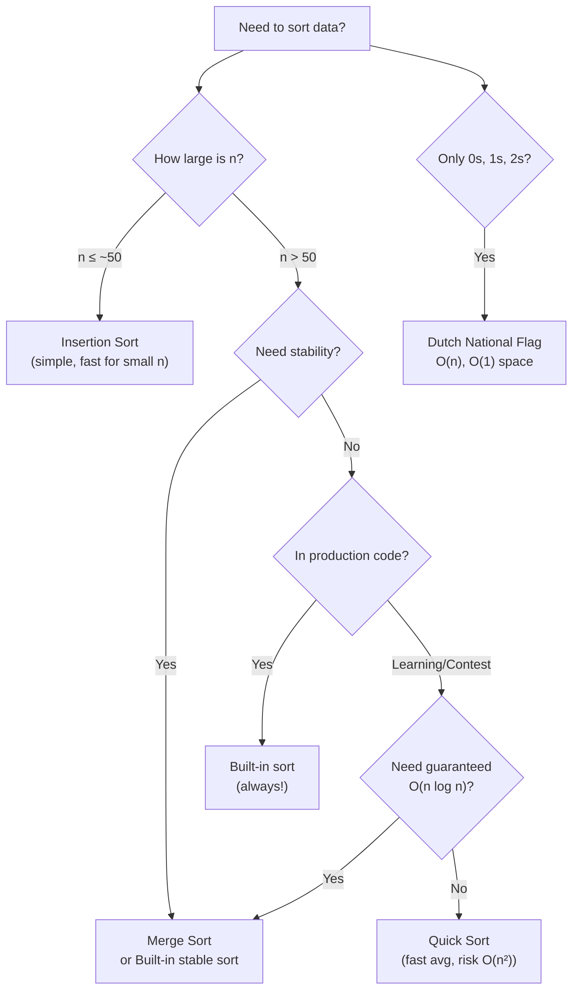
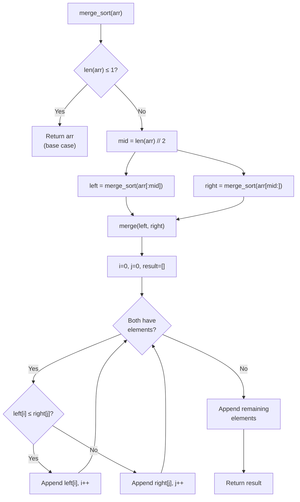

# The Art of Sorting — Putting Things in Order

## Chapter Goals

By the end of this chapter, you will be able to:

- [ ] **Implement selection, bubble, and insertion sort** — understand how each O(n²) algorithm works and when each is best
- [ ] **Implement merge sort** — divide and conquer, O(n log n), stable, with a clear understanding of the merge step
- [ ] **Implement quick sort** — partition around a pivot, O(n log n) average, in-place
- [ ] **Use built-in sorting with custom comparators** — Python `key=`, Java `Comparator`, C++ lambdas
- [ ] **Count inversions** — use a modified merge sort to measure how "unsorted" an array is in O(n log n)
- [ ] **Compare sorting algorithms** — know their time/space trade-offs and when to use each one
- [ ] **Prove correctness by induction** — prove that merge sort correctly sorts any array using base case + inductive step

---

## The Story: The Tournament

The Westbrook School is hosting a coding tournament with 1,000 students. The tournament director, Mr. Patel, has a problem: he needs to rank every student by their score — but his computer can only compare two scores at a time.

His first idea: scan through all 1,000 students, find the one with the highest score, write that name down. Then scan the remaining 999, find the next highest, write it down. Repeat. This works, but with 1,000 students, he needs almost 500,000 comparisons. For 10,000 students, he'd need 50 million. For a national competition with 100,000 students... forget it.

His colleague, Ms. Chen, has a better idea: "What if you split the students into two groups of 500, rank each group separately, and then *merge* the two ranked lists together?" She sketches it on the board — you split, you sort the halves, you merge. Each split costs less work, and merging two sorted lists is easy. The math works out to about 20,000 comparisons instead of 500,000.

Mr. Patel is amazed. Same task, same students, completely different strategy — and it's 25x faster. This is the story of sorting algorithms: different strategies for putting things in order, and the dramatic difference the right strategy makes.

---

## Johari Window: Before

Before diving in, take 5 minutes to fill out the **"Before"** section of your [Johari Window worksheet](johari.md).


Be honest with yourself! Knowing what you *don't* know is the first step to learning it. There are no wrong answers — only honest ones.


---

## Discovery


**Stop! Try these BEFORE reading the chapter.** Struggling with a problem before learning the solution is how your brain builds the strongest connections. Spend at least 10 minutes on each one.


### Discovery 1: Sort These Cards

Grab 5 index cards (or scraps of paper) and write these numbers on them: **8, 3, 5, 1, 7**.

Shuffle them face-up on a table. Now sort them into order (1, 3, 5, 7, 8).

As you sort, **pay attention to your strategy**:
- Did you find the smallest and put it first? (That's selection sort!)
- Did you compare neighbors and swap? (That's bubble sort!)
- Did you pick up one card at a time and slide it into the right spot? (That's insertion sort!)

**Count**: How many comparisons did you make? How many moves? Try sorting them again with a *different* strategy and count again.

### Discovery 2: The Merge Puzzle

You have two *already-sorted* piles of cards:

**Left pile**: 2, 5, 8
**Right pile**: 1, 4, 7

Merge them into one sorted pile. The rules: you can only look at the top card of each pile. Pick the smaller one and add it to your result.

Trace through the steps. How many comparisons did it take? Now imagine you had two piles of 500 each — how many comparisons would you need? (The answer is surprisingly small!)


**This merge operation is the heart of merge sort.** If you can merge two sorted lists efficiently, you can sort ANY list by splitting it, sorting the halves, and merging them back together.


---

## 8.1 Why Sorting Matters — The #1 Preprocessing Step

Sorting might seem like a simple task, but it's the **most useful tool in your entire algorithmic toolkit**. Here's why:

- **Binary search** (Ch 9) requires sorted data — turning O(n) lookup into O(log n)
- **Finding duplicates** becomes trivial — just check adjacent elements
- **Two pointers** (Ch 15) work on sorted arrays
- **Greedy algorithms** (Ch 18) almost always sort first

| Task | Unsorted | After Sorting |
|------|----------|---------------|
| Find an element | O(n) linear scan | O(log n) binary search |
| Find duplicates | O(n²) check all pairs | O(n) check adjacent |
| Find closest pair | O(n²) | O(n) scan neighbors |
| Find median | O(n) selection | Already at index n/2 |


**Cross-Chapter Thread: "Sort First, Think Later"** — This is one of the most powerful strategies in competitive programming. When you're stuck on a problem, ask yourself: "What if I sorted the input first?" You'll be amazed how often this unlocks the solution. We'll revisit this thread in Ch 9, 13, 15, and 18.


### The Sorting Algorithm Zoo

| Algorithm | Time (Best) | Time (Avg) | Time (Worst) | Space | Stable? | Key Idea |
|-----------|-------------|------------|--------------|-------|---------|----------|
| Selection Sort | O(n²) | O(n²) | O(n²) | O(1) | No | Find min, swap |
| Bubble Sort | O(n) | O(n²) | O(n²) | O(1) | Yes | Bubble up largest |
| Insertion Sort | O(n) | O(n²) | O(n²) | O(1) | Yes | Insert into sorted prefix |
| Merge Sort | O(n log n) | O(n log n) | O(n log n) | O(n) | Yes | Divide, sort, merge |
| Quick Sort | O(n log n) | O(n log n) | O(n²) | O(log n) | No | Partition around pivot |

**What does "stable" mean?** A stable sort preserves the original order of equal elements. If two students have the same score, a stable sort keeps them in the same relative order as the input. Merge sort and insertion sort are stable; selection sort and quick sort are not.

---

## 8.2 Selection Sort — Find the Minimum, Swap

**The idea**: Scan the entire array, find the smallest element, swap it to the front. Then find the smallest in the remaining array, swap it to position 2. Repeat.

**Visual walkthrough** on `[64, 25, 12, 22, 11]`:

| Pass | Array | Min Found | Swap |
|------|-------|-----------|------|
| 1 | **[64, 25, 12, 22, 11]** | 11 at index 4 | swap(0, 4) |
| 2 | [11, **25, 12, 22, 64**] | 12 at index 2 | swap(1, 2) |
| 3 | [11, 12, **25, 22, 64**] | 22 at index 3 | swap(2, 3) |
| 4 | [11, 12, 22, **25, 64**] | 25 at index 3 | no swap needed |
| Done | [11, 12, 22, 25, 64] | | |



```python
def selection_sort(arr):
    n = len(arr)
    for i in range(n):
        min_idx = i
        for j in range(i + 1, n):
            if arr[j] < arr[min_idx]:
                min_idx = j
        arr[i], arr[min_idx] = arr[min_idx], arr[i]
    return arr
```


```java
static int[] selectionSort(int[] arr) {
    int n = arr.length;
    for (int i = 0; i < n; i++) {
        int minIdx = i;
        for (int j = i + 1; j < n; j++) {
            if (arr[j] < arr[minIdx]) minIdx = j;
        }
        int temp = arr[i];
        arr[i] = arr[minIdx];
        arr[minIdx] = temp;
    }
    return arr;
}
```


```cpp
vector<int> selectionSort(vector<int>& arr) {
    int n = arr.size();
    for (int i = 0; i < n; i++) {
        int minIdx = i;
        for (int j = i + 1; j < n; j++) {
            if (arr[j] < arr[minIdx]) minIdx = j;
        }
        swap(arr[i], arr[minIdx]);
    }
    return arr;
}
```



> **Language Spotlight: Swapping**
> | | Python | Java | C++ |
> |---|--------|------|-----|
> | Swap syntax | `a, b = b, a` | temp variable | `swap(a, b)` or `std::swap` |
> | Tuple unpacking? | Yes | No | No (but structured bindings exist) |

**Complexity**: O(n²) always — even if the array is already sorted, we still scan for the minimum every time. **Not stable** — swapping can change the relative order of equal elements.

---

## 8.3 Bubble Sort — Bubbling to the Top

**The idea**: Compare adjacent elements and swap if they're in the wrong order. After one pass, the largest element "bubbles" to the end. Repeat until no swaps are needed.

**Visual walkthrough** on `[5, 1, 4, 2, 8]`:

| Pass 1 | Comparison | Action |
|--------|-----------|--------|
| Step 1 | **5** vs **1** | Swap → [1, 5, 4, 2, 8] |
| Step 2 | **5** vs **4** | Swap → [1, 4, 5, 2, 8] |
| Step 3 | **5** vs **2** | Swap → [1, 4, 2, 5, 8] |
| Step 4 | **5** vs **8** | No swap |
| After pass 1: [1, 4, 2, 5, 8] — 8 is in its final position |

**The optimization**: If a full pass makes *zero* swaps, the array is already sorted — stop early! This makes bubble sort O(n) on already-sorted input.



```python
def bubble_sort(arr):
    n = len(arr)
    for i in range(n):
        swapped = False
        for j in range(n - 1 - i):
            if arr[j] > arr[j + 1]:
                arr[j], arr[j + 1] = arr[j + 1], arr[j]
                swapped = True
        if not swapped:
            break  # Already sorted!
    return arr
```


```java
static int[] bubbleSort(int[] arr) {
    int n = arr.length;
    for (int i = 0; i < n; i++) {
        boolean swapped = false;
        for (int j = 0; j < n - 1 - i; j++) {
            if (arr[j] > arr[j + 1]) {
                int temp = arr[j];
                arr[j] = arr[j + 1];
                arr[j + 1] = temp;
                swapped = true;
            }
        }
        if (!swapped) break;
    }
    return arr;
}
```


```cpp
vector<int> bubbleSort(vector<int>& arr) {
    int n = arr.size();
    for (int i = 0; i < n; i++) {
        bool swapped = false;
        for (int j = 0; j < n - 1 - i; j++) {
            if (arr[j] > arr[j + 1]) {
                swap(arr[j], arr[j + 1]);
                swapped = true;
            }
        }
        if (!swapped) break;
    }
    return arr;
}
```



**Complexity**: O(n²) worst/average, **O(n) best** (already sorted, with early termination). **Stable** — only swaps adjacent elements, so equal elements stay in order.


**Recursive bubble sort** is possible too — make one pass, then recursively sort the remaining n-1 elements. We'll explore recursive versions of these sorts in Ch 10 (Recursion).


---

## 8.4 Insertion Sort — The Card Player's Method

**The idea**: Imagine you're holding a hand of cards. You pick up one card at a time and **insert it into its correct position** in the already-sorted hand. The first card is trivially sorted. Each new card slides into place.

**Visual walkthrough** on `[12, 11, 13, 5, 6]`:

| Step | Key | Sorted Portion → | Result |
|------|-----|-------------------|--------|
| 1 | 11 | [**12**] | [11, 12, 13, 5, 6] — 11 slides before 12 |
| 2 | 13 | [11, **12**] | [11, 12, 13, 5, 6] — 13 stays in place |
| 3 | 5 | [11, 12, **13**] | [5, 11, 12, 13, 6] — 5 slides to front |
| 4 | 6 | [5, 11, 12, **13**] | [5, 6, 11, 12, 13] — 6 slides after 5 |



```python
def insertion_sort(arr):
    for i in range(1, len(arr)):
        key = arr[i]
        j = i - 1
        while j >= 0 and arr[j] > key:
            arr[j + 1] = arr[j]  # Shift right
            j -= 1
        arr[j + 1] = key  # Insert
    return arr
```


```java
static int[] insertionSort(int[] arr) {
    for (int i = 1; i < arr.length; i++) {
        int key = arr[i];
        int j = i - 1;
        while (j >= 0 && arr[j] > key) {
            arr[j + 1] = arr[j];
            j--;
        }
        arr[j + 1] = key;
    }
    return arr;
}
```


```cpp
vector<int> insertionSort(vector<int>& arr) {
    for (int i = 1; i < (int)arr.size(); i++) {
        int key = arr[i];
        int j = i - 1;
        while (j >= 0 && arr[j] > key) {
            arr[j + 1] = arr[j];
            j--;
        }
        arr[j + 1] = key;
    }
    return arr;
}
```



**Complexity**: O(n²) worst (reverse sorted), **O(n) best** (already sorted — inner loop never executes). **Stable**. **Best for small arrays and nearly-sorted data** — this is why Python's TimSort and C++'s IntroSort switch to insertion sort for small subarrays.


**Why insertion sort for small arrays?** Merge sort has overhead from recursive calls and memory allocation. For arrays smaller than ~16-32 elements, insertion sort's simplicity makes it faster in practice, even though both are correct.


---

## 8.5 Merge Sort — Divide and Conquer

This is where things get exciting. Merge sort is the first **O(n log n)** algorithm we'll implement — and it's a beautiful example of **divide and conquer**.

**The idea** (three steps):
1. **Divide**: Split the array in half
2. **Conquer**: Recursively sort each half
3. **Combine**: Merge the two sorted halves into one sorted array

**Visual — recursion tree** for `[38, 27, 43, 3, 9, 82, 10]`:

```
                [38, 27, 43, 3, 9, 82, 10]
               /                            \
       [38, 27, 43, 3]              [9, 82, 10]
       /            \                /          \
   [38, 27]     [43, 3]         [9, 82]       [10]
   /    \       /    \          /    \           |
 [38]  [27]  [43]   [3]      [9]   [82]       [10]
   \    /       \    /          \    /           |
   [27, 38]     [3, 43]        [9, 82]        [10]
       \            /                \          /
       [3, 27, 38, 43]              [9, 10, 82]
               \                            /
           [3, 9, 10, 27, 38, 43, 82]
```

**The merge step** is the key. Given two sorted arrays, merge them in O(n):

```
Left:  [3, 27, 38, 43]     Right: [9, 10, 82]
        ^                          ^
Compare 3 < 9 → take 3.   Result: [3]
           ^                       ^
Compare 27 > 9 → take 9.  Result: [3, 9]
           ^                          ^
Compare 27 > 10 → take 10. Result: [3, 9, 10]
           ^                             ^
Compare 27 < 82 → take 27. Result: [3, 9, 10, 27]
              ^                          ^
Compare 38 < 82 → take 38. Result: [3, 9, 10, 27, 38]
                 ^                       ^
Compare 43 < 82 → take 43. Result: [3, 9, 10, 27, 38, 43]
Left exhausted → take 82.  Result: [3, 9, 10, 27, 38, 43, 82]
```



```python
def merge_sort(arr):
    if len(arr) <= 1:
        return arr
    mid = len(arr) // 2
    left = merge_sort(arr[:mid])
    right = merge_sort(arr[mid:])
    return merge(left, right)

def merge(left, right):
    result = []
    i = j = 0
    while i < len(left) and j < len(right):
        if left[i] <= right[j]:
            result.append(left[i])
            i += 1
        else:
            result.append(right[j])
            j += 1
    result.extend(left[i:])
    result.extend(right[j:])
    return result
```


```java
static int[] mergeSort(int[] arr) {
    if (arr.length <= 1) return arr;
    int mid = arr.length / 2;
    int[] left = mergeSort(Arrays.copyOfRange(arr, 0, mid));
    int[] right = mergeSort(Arrays.copyOfRange(arr, mid, arr.length));
    return merge(left, right);
}

static int[] merge(int[] left, int[] right) {
    int[] result = new int[left.length + right.length];
    int i = 0, j = 0, k = 0;
    while (i < left.length && j < right.length) {
        if (left[i] <= right[j]) result[k++] = left[i++];
        else result[k++] = right[j++];
    }
    while (i < left.length) result[k++] = left[i++];
    while (j < right.length) result[k++] = right[j++];
    return result;
}
```


```cpp
vector<int> merge(vector<int>& left, vector<int>& right) {
    vector<int> result;
    int i = 0, j = 0;
    while (i < (int)left.size() && j < (int)right.size()) {
        if (left[i] <= right[j]) result.push_back(left[i++]);
        else result.push_back(right[j++]);
    }
    while (i < (int)left.size()) result.push_back(left[i++]);
    while (j < (int)right.size()) result.push_back(right[j++]);
    return result;
}

vector<int> mergeSort(vector<int> arr) {
    if (arr.size() <= 1) return arr;
    int mid = arr.size() / 2;
    vector<int> left(arr.begin(), arr.begin() + mid);
    vector<int> right(arr.begin() + mid, arr.end());
    left = mergeSort(left);
    right = mergeSort(right);
    return merge(left, right);
}
```



> **Language Spotlight: Array Slicing**
> | | Python | Java | C++ |
> |---|--------|------|-----|
> | Get left half | `arr[:mid]` | `Arrays.copyOfRange(arr, 0, mid)` | `vector<int>(arr.begin(), arr.begin()+mid)` |
> | Extend result | `result.extend(left[i:])` | `while` loop | `while` loop |

**Complexity**: O(n log n) always — log n levels of recursion, O(n) work at each level. **O(n) extra space** (for the merged arrays). **Stable** — we use `<=` in the merge step, so equal elements from the left half come first.

### Why O(n log n)?

Think of the recursion tree. At each level, we split the array in half. How many levels? We keep halving until we reach arrays of size 1: n → n/2 → n/4 → ... → 1. That's **log₂ n levels**. At each level, the total merging work across all subarrays is **O(n)**. So: **O(n) work per level × O(log n) levels = O(n log n)**.

---

## 8.6 Quick Sort — Partition and Conquer

Quick sort is the other famous O(n log n) algorithm. Its key insight: instead of splitting in half and merging, we **partition** the array around a **pivot** element.

**The idea**:
1. Pick a **pivot** element (we'll use the last element — Lomuto partition)
2. **Partition**: rearrange so everything ≤ pivot is on the left, everything > pivot is on the right
3. **Recursively sort** the left and right portions

**Visual walkthrough** — partition `[10, 7, 8, 9, 1, 5]` with pivot = 5:

```
Pivot = 5 (last element)
Pointer i starts before array, j scans left to right:

j=0: arr[0]=10 > 5 → skip
j=1: arr[1]=7  > 5 → skip
j=2: arr[2]=8  > 5 → skip
j=3: arr[3]=9  > 5 → skip
j=4: arr[4]=1  ≤ 5 → i++, swap(arr[1→0+1], arr[4]) → [1, 7, 8, 9, 10, 5]
                                  i=0
Final: swap pivot to i+1 position → [1, 5, 8, 9, 10, 7]
                                         ^pivot in final position

Left of pivot: [1]        Right of pivot: [8, 9, 10, 7]
Recursively sort each side.
```



```python
def quick_sort(arr):
    _quick_sort(arr, 0, len(arr) - 1)
    return arr

def _quick_sort(arr, lo, hi):
    if lo < hi:
        pivot_idx = partition(arr, lo, hi)
        _quick_sort(arr, lo, pivot_idx - 1)
        _quick_sort(arr, pivot_idx + 1, hi)

def partition(arr, lo, hi):
    pivot = arr[hi]
    i = lo - 1
    for j in range(lo, hi):
        if arr[j] <= pivot:
            i += 1
            arr[i], arr[j] = arr[j], arr[i]
    arr[i + 1], arr[hi] = arr[hi], arr[i + 1]
    return i + 1
```


```java
static int[] quickSort(int[] arr) {
    qSort(arr, 0, arr.length - 1);
    return arr;
}

static void qSort(int[] arr, int lo, int hi) {
    if (lo < hi) {
        int p = partition(arr, lo, hi);
        qSort(arr, lo, p - 1);
        qSort(arr, p + 1, hi);
    }
}

static int partition(int[] arr, int lo, int hi) {
    int pivot = arr[hi];
    int i = lo - 1;
    for (int j = lo; j < hi; j++) {
        if (arr[j] <= pivot) {
            i++;
            int temp = arr[i]; arr[i] = arr[j]; arr[j] = temp;
        }
    }
    int temp = arr[i + 1]; arr[i + 1] = arr[hi]; arr[hi] = temp;
    return i + 1;
}
```


```cpp
int partition(vector<int>& arr, int lo, int hi) {
    int pivot = arr[hi];
    int i = lo - 1;
    for (int j = lo; j < hi; j++) {
        if (arr[j] <= pivot) {
            i++;
            swap(arr[i], arr[j]);
        }
    }
    swap(arr[i + 1], arr[hi]);
    return i + 1;
}

void qSort(vector<int>& arr, int lo, int hi) {
    if (lo < hi) {
        int p = partition(arr, lo, hi);
        qSort(arr, lo, p - 1);
        qSort(arr, p + 1, hi);
    }
}

vector<int> quickSort(vector<int> arr) {
    qSort(arr, 0, (int)arr.size() - 1);
    return arr;
}
```



**Complexity**: O(n log n) average, **O(n²) worst case** (when pivot is always the smallest or largest — happens on already-sorted input with last-element pivot!). In-place (O(log n) stack space). **Not stable**.


**Gotcha: Quick sort on sorted input!** If you always pick the last element as pivot and the input is already sorted, every partition puts all elements on one side. You get O(n²). Fix: pick a **random** pivot, or use the **median of three** (first, middle, last). In contests, randomized quicksort virtually never hits worst case.


### Merge Sort vs Quick Sort

| | Merge Sort | Quick Sort |
|---|-----------|------------|
| **Worst case** | O(n log n) — always | O(n²) — sorted input with bad pivot |
| **Average case** | O(n log n) | O(n log n) |
| **Space** | O(n) extra | O(log n) — in-place |
| **Stable?** | Yes | No |
| **In practice** | Slightly slower (memory allocation) | Slightly faster (cache-friendly) |
| **Best for** | Linked lists, stability needed | Arrays, average-case speed |

---

## 8.7 Built-In Sorting — Standing on Giants' Shoulders

In real code and contests, you almost never write your own sort. The built-in sort is fast, correct, and well-tested. But understanding HOW it works is what makes you a better programmer.



```python
# sorted() returns a NEW sorted list
nums = [5, 2, 8, 1]
sorted_nums = sorted(nums)     # [1, 2, 5, 8], nums unchanged

# .sort() sorts IN PLACE
nums.sort()                     # nums is now [1, 2, 5, 8]

# Custom key: sort by absolute value
sorted([-3, 1, -5, 2], key=abs)  # [1, 2, -3, -5]

# Reverse sort
sorted(nums, reverse=True)     # [8, 5, 2, 1]

# Sort by multiple criteria: (length, then alphabetically)
words = ["banana", "kiwi", "apple", "fig"]
sorted(words, key=lambda w: (len(w), w))
# ["fig", "kiwi", "apple", "banana"]
```


```java
// Sort primitive array — uses dual-pivot quicksort (NOT stable)
int[] nums = {5, 2, 8, 1};
Arrays.sort(nums);  // [1, 2, 5, 8]

// Sort object array — uses TimSort (stable)
Integer[] nums2 = {5, 2, 8, 1};
Arrays.sort(nums2);

// Custom comparator
Integer[] arr = {-3, 1, -5, 2};
Arrays.sort(arr, Comparator.comparingInt(Math::abs));

// Sort by multiple criteria
String[] words = {"banana", "kiwi", "apple", "fig"};
Arrays.sort(words, Comparator.comparingInt(String::length)
                              .thenComparing(Comparator.naturalOrder()));
```


```cpp
// std::sort — uses IntroSort (NOT stable)
vector<int> nums = {5, 2, 8, 1};
sort(nums.begin(), nums.end());  // [1, 2, 5, 8]

// Reverse sort
sort(nums.begin(), nums.end(), greater<int>());

// Custom comparator with lambda
vector<int> arr = {-3, 1, -5, 2};
sort(arr.begin(), arr.end(),
     [](int a, int b) { return abs(a) < abs(b); });

// Sort by multiple criteria
vector<string> words = {"banana", "kiwi", "apple", "fig"};
sort(words.begin(), words.end(), [](const string& a, const string& b) {
    if (a.size() != b.size()) return a.size() < b.size();
    return a < b;  // alphabetical tiebreak
});
```



> **Language Spotlight: Built-In Sort Algorithms**
> | | Python | Java (primitives) | Java (objects) | C++ |
> |---|--------|-------------------|----------------|-----|
> | Algorithm | TimSort | Dual-pivot Quicksort | TimSort | IntroSort |
> | Based on | Merge + Insertion | Quicksort variant | Merge + Insertion | Quick + Heap + Insertion |
> | Stable? | Yes | No | Yes | No |
> | `stable_sort`? | Always stable | Use `Integer[]` | Always stable | `std::stable_sort()` |


**Java gotcha**: `Arrays.sort(int[])` uses quicksort (not stable). `Arrays.sort(Integer[])` uses TimSort (stable). If you need stability with primitives, box them to `Integer[]` first. In contests, this rarely matters — but in interviews, knowing this impresses.


---

## 8.8 Counting Inversions — Merge Sort as a Tool

An **inversion** is a pair (i, j) where i < j but arr[i] > arr[j] — they're "out of order." The number of inversions measures how far an array is from being sorted.

- `[1, 2, 3]` → 0 inversions (sorted)
- `[3, 2, 1]` → 3 inversions: (3,2), (3,1), (2,1)
- `[5, 4, 3, 2, 1]` → 10 inversions (maximum for n=5: n*(n-1)/2)

**Brute force**: Check all pairs. O(n²).

**Better**: Modify merge sort! During the merge step, when we pick an element from the **right** half (because right[j] < left[i]), it means right[j] forms inversions with ALL remaining elements in the left half. So we add `len(left) - i` to the count.



```python
def count_inversions(arr):
    if len(arr) <= 1:
        return arr, 0
    mid = len(arr) // 2
    left, left_inv = count_inversions(arr[:mid])
    right, right_inv = count_inversions(arr[mid:])
    merged, split_inv = merge_count(left, right)
    return merged, left_inv + right_inv + split_inv

def merge_count(left, right):
    result = []
    inversions = 0
    i = j = 0
    while i < len(left) and j < len(right):
        if left[i] <= right[j]:
            result.append(left[i])
            i += 1
        else:
            result.append(right[j])
            inversions += len(left) - i  # Key line!
            j += 1
    result.extend(left[i:])
    result.extend(right[j:])
    return result, inversions
```


```java
// Returns inversion count; arr is sorted as a side effect
static long mergeSortCount(int[] arr, int lo, int hi) {
    if (lo >= hi) return 0;
    int mid = lo + (hi - lo) / 2;
    long count = 0;
    count += mergeSortCount(arr, lo, mid);
    count += mergeSortCount(arr, mid + 1, hi);
    count += mergeCount(arr, lo, mid, hi);
    return count;
}

static long mergeCount(int[] arr, int lo, int mid, int hi) {
    int[] temp = new int[hi - lo + 1];
    int i = lo, j = mid + 1, k = 0;
    long inversions = 0;
    while (i <= mid && j <= hi) {
        if (arr[i] <= arr[j]) temp[k++] = arr[i++];
        else {
            temp[k++] = arr[j++];
            inversions += (mid - i + 1);  // Key line!
        }
    }
    while (i <= mid) temp[k++] = arr[i++];
    while (j <= hi) temp[k++] = arr[j++];
    System.arraycopy(temp, 0, arr, lo, temp.length);
    return inversions;
}
```


```cpp
long long mergeCount(vector<int>& arr, int lo, int mid, int hi) {
    vector<int> temp;
    int i = lo, j = mid + 1;
    long long inversions = 0;
    while (i <= mid && j <= hi) {
        if (arr[i] <= arr[j]) temp.push_back(arr[i++]);
        else {
            temp.push_back(arr[j++]);
            inversions += (mid - i + 1);  // Key line!
        }
    }
    while (i <= mid) temp.push_back(arr[i++]);
    while (j <= hi) temp.push_back(arr[j++]);
    for (int k = lo; k <= hi; k++) arr[k] = temp[k - lo];
    return inversions;
}

long long mergeSortCount(vector<int>& arr, int lo, int hi) {
    if (lo >= hi) return 0;
    int mid = lo + (hi - lo) / 2;
    long long count = 0;
    count += mergeSortCount(arr, lo, mid);
    count += mergeSortCount(arr, mid + 1, hi);
    count += mergeCount(arr, lo, mid, hi);
    return count;
}
```



**Complexity**: O(n log n) — same as merge sort, we just count during the merge. This is a powerful demonstration that merge sort isn't just a sorting algorithm — it's a **general-purpose divide-and-conquer tool**.


**Why `long` / `long long` for inversions?** The maximum inversions in an array of n elements is n*(n-1)/2. For n = 100,000, that's about 5 billion — way beyond `int`'s 2 billion limit!


---

## Think Like a Pro


**Tourist (Gennady Korotkevich)** — "When I see a problem, my first instinct is often: *sort the input*. Sorting reveals structure. An unsorted array is chaos — a sorted array has patterns. Two pointers, binary search, greedy — they all work on sorted data."

He doesn't mean "always sort." He means sorting is the first thing to *consider*. If it doesn't help, move on. But surprisingly often, sorting the input first makes the rest of the problem fall into place.



**Errichto** — "I never implement my own sort in contests. The built-in sort is always fast enough. But understanding merge sort is essential — not because you'll sort with it, but because **divide and conquer** is a thinking pattern. Merge sort teaches you to split problems, solve pieces, and combine results. That pattern appears everywhere: in binary search, in segment trees, in FFT."


---

## Thinking Flowchart



---

## Implementation Flowchart — Merge Sort



---

## AOPS Showcase: Sort an Array — Three Approaches

The same problem, three approaches, progressively faster. This is the AOPS way: seeing multiple solutions to the same problem deepens understanding.

**Problem**: Given an array of integers, return the array sorted in non-decreasing order.

### Approach 1: Bubble Sort — O(n²)

The simplest sort. Compare adjacent pairs, swap if needed, repeat.



```python
def sort_bubble(arr):
    arr = arr[:]  # Don't modify original
    n = len(arr)
    for i in range(n):
        swapped = False
        for j in range(n - 1 - i):
            if arr[j] > arr[j + 1]:
                arr[j], arr[j + 1] = arr[j + 1], arr[j]
                swapped = True
        if not swapped:
            break
    return arr
```


```java
static int[] sortBubble(int[] arr) {
    arr = arr.clone();
    int n = arr.length;
    for (int i = 0; i < n; i++) {
        boolean swapped = false;
        for (int j = 0; j < n - 1 - i; j++) {
            if (arr[j] > arr[j + 1]) {
                int t = arr[j]; arr[j] = arr[j + 1]; arr[j + 1] = t;
                swapped = true;
            }
        }
        if (!swapped) break;
    }
    return arr;
}
```


```cpp
vector<int> sortBubble(vector<int> arr) {
    int n = arr.size();
    for (int i = 0; i < n; i++) {
        bool swapped = false;
        for (int j = 0; j < n - 1 - i; j++) {
            if (arr[j] > arr[j + 1]) {
                swap(arr[j], arr[j + 1]);
                swapped = true;
            }
        }
        if (!swapped) break;
    }
    return arr;
}
```



### Approach 2: Merge Sort — O(n log n)

Divide and conquer. Split, sort halves, merge.



```python
def sort_merge(arr):
    if len(arr) <= 1:
        return arr[:]
    mid = len(arr) // 2
    left = sort_merge(arr[:mid])
    right = sort_merge(arr[mid:])
    result = []
    i = j = 0
    while i < len(left) and j < len(right):
        if left[i] <= right[j]:
            result.append(left[i]); i += 1
        else:
            result.append(right[j]); j += 1
    result.extend(left[i:])
    result.extend(right[j:])
    return result
```


```java
static int[] sortMerge(int[] arr) {
    if (arr.length <= 1) return arr.clone();
    int mid = arr.length / 2;
    int[] left = sortMerge(Arrays.copyOfRange(arr, 0, mid));
    int[] right = sortMerge(Arrays.copyOfRange(arr, mid, arr.length));
    int[] result = new int[arr.length];
    int i = 0, j = 0, k = 0;
    while (i < left.length && j < right.length) {
        if (left[i] <= right[j]) result[k++] = left[i++];
        else result[k++] = right[j++];
    }
    while (i < left.length) result[k++] = left[i++];
    while (j < right.length) result[k++] = right[j++];
    return result;
}
```


```cpp
vector<int> sortMerge(vector<int> arr) {
    if (arr.size() <= 1) return arr;
    int mid = arr.size() / 2;
    vector<int> left(arr.begin(), arr.begin() + mid);
    vector<int> right(arr.begin() + mid, arr.end());
    left = sortMerge(left);
    right = sortMerge(right);
    vector<int> result;
    int i = 0, j = 0;
    while (i < (int)left.size() && j < (int)right.size()) {
        if (left[i] <= right[j]) result.push_back(left[i++]);
        else result.push_back(right[j++]);
    }
    while (i < (int)left.size()) result.push_back(left[i++]);
    while (j < (int)right.size()) result.push_back(right[j++]);
    return result;
}
```



### Approach 3: Built-In Sort — Production Ready

The sort that professional programmers actually use.



```python
def sort_builtin(arr):
    return sorted(arr)  # TimSort: O(n log n), stable
```


```java
static int[] sortBuiltin(int[] arr) {
    arr = arr.clone();
    Arrays.sort(arr);  // Dual-pivot quicksort for int[]
    return arr;
}
```


```cpp
vector<int> sortBuiltin(vector<int> arr) {
    sort(arr.begin(), arr.end());  // IntroSort
    return arr;
}
```



### Performance Comparison

| n | Bubble Sort | Merge Sort | Built-In |
|---|-------------|------------|----------|
| 100 | < 1 ms | < 1 ms | < 1 ms |
| 1,000 | ~5 ms | < 1 ms | < 1 ms |
| 10,000 | ~500 ms | ~5 ms | ~2 ms |
| 100,000 | ~50 seconds | ~50 ms | ~20 ms |

The pattern is clear: O(n²) algorithms collapse as n grows, while O(n log n) scales beautifully.

---

## Proof Technique: Proof by Induction

This is our **third proof technique** (after direct proof in Ch 6 and proof by contradiction in Ch 7).

### The Domino Analogy

Imagine a line of dominos. You prove two things:
1. **Base case**: The first domino falls.
2. **Inductive step**: If domino k falls, then domino k+1 falls too.

Conclusion: ALL dominos fall. Base case triggers step 1, which triggers step 2, which triggers step 3... forever.

### Proof: Merge Sort Correctly Sorts Any Array

**Claim**: For any array A of size n ≥ 0, `merge_sort(A)` returns a sorted permutation of A.

**Base case** (n = 0 or n = 1): An array of 0 or 1 elements is already sorted. `merge_sort` returns it unchanged. ✅

**Inductive hypothesis**: Assume `merge_sort` correctly sorts any array of size < n.

**Inductive step**: For an array A of size n ≥ 2:
1. We split A into `left` (size ⌊n/2⌋) and `right` (size ⌈n/2⌉).
2. Since |left| < n and |right| < n, by the inductive hypothesis, `merge_sort(left)` and `merge_sort(right)` produce correctly sorted arrays.
3. The `merge` function takes two sorted arrays and produces one sorted array (at each step, it picks the smaller of the two front elements — this preserves sorted order).
4. The result is a sorted permutation of A. ✅

**Why this matters**: Induction is the natural proof technique for **recursive algorithms**. The structure of the proof mirrors the structure of the code: base case → inductive step maps to base case → recursive call. You'll use this pattern again in Ch 10 (Recursion), Ch 23 (DP), and beyond.


**Don't stress about proofs!** Being able to *read* and *follow* a proof is enough for now. Writing your own proofs comes with practice. If you understood the domino analogy and can see how it applies to merge sort, you're in great shape.


---

## Legend's Corner


**Benjamin Qi (Benq)** — the youngest USACO Platinum qualifier and a legendary competitive programmer — has a simple rule: **"Sort first and see what falls out."**

"In USACO, I always sort the input and see what patterns emerge. If you sort by x-coordinate, y-coordinate, or some custom key, the solution often becomes obvious. Sorting is the #1 preprocessing step. My template even has a `#define all(x) x.begin(), x.end()` so I can write `sort(all(v))` in three words."

This isn't just a USACO trick — it's how professionals think. When you don't know where to start, sort the data. It's never wrong and often reveals the path forward.


---

## Gotchas


**Gotcha #1: Off-by-one in merge/partition bounds.** The merge step's `mid` splitting and quick sort's `lo`/`hi` bounds are easy to get wrong. Off-by-one errors cause infinite recursion or missed elements. Draw the indices on paper before coding!



**Gotcha #2: Quick sort degenerates on sorted input.** If you always pick the last element as pivot and the input is sorted, quick sort becomes O(n²). Fix: use a random pivot. In contests, `random_shuffle` the array first, or pick `arr[(lo + hi) / 2]` as pivot.



**Gotcha #3: Merge sort needs O(n) extra space.** Don't assume merge sort is "in-place." Every merge step creates a new temporary array. For huge arrays, this matters. Quick sort is in-place (only O(log n) stack space).



**Gotcha #4: Stability confusion.** Selection sort and quick sort are **NOT stable** — they can rearrange equal elements. If you need to sort students by score and keep same-score students in original order, use merge sort or a built-in stable sort.



**Gotcha #5: Custom comparator must be transitive.** If your comparator says a < b and b < c, it MUST also say a < c. Breaking this rule causes undefined behavior in C++ (`std::sort` may crash!) and incorrect results everywhere.



**Gotcha #6: Java's two sorting algorithms.** `Arrays.sort(int[])` uses dual-pivot quicksort (fast, not stable). `Arrays.sort(Integer[])` uses TimSort (stable). They're DIFFERENT algorithms! If you need a custom comparator, you must use `Integer[]`, not `int[]`.


---

## Practice Problems

| # | Name | Difficulty | Key Concept | File |
|---|------|-----------|-------------|------|
| W1 | Selection Sort | ⭐ | Find min, swap to front | `warmup_01_selection_sort` |
| W2 | Bubble Sort | ⭐ | Adjacent swaps, early termination | `warmup_02_bubble_sort` |
| W3 | Insertion Sort | ⭐ | Insert into sorted prefix | `warmup_03_insertion_sort` |
| W4 | Check If Sorted | ⭐ | Linear scan verification | `warmup_04_check_if_sorted` |
| W5 | Sort by Absolute Value | ⭐ | Custom comparator intro | `warmup_05_sort_by_absolute` |
| P1 | Merge Sort | ⭐⭐ | Divide, sort, merge | `practice_01_merge_sort` |
| P2 | Quick Sort | ⭐⭐ | Lomuto partition | `practice_02_quick_sort` |
| P3 | Dutch National Flag | ⭐⭐ | Three-way partition O(n) | `practice_03_dutch_national_flag` |
| P4 | Custom Comparator Sort | ⭐⭐ | Sort strings by length, then alpha | `practice_04_custom_comparator` |
| P5 | Merge Two Sorted Arrays | ⭐⭐ | Two-pointer merge step | `practice_05_merge_two_sorted` |
| C1 | Sort Three Ways | ⭐⭐⭐ | AOPS: bubble + merge + built-in | `challenge_01_sort_three_ways` |
| C2 | Count Inversions | ⭐⭐⭐ | Modified merge sort | `challenge_02_count_inversions` |
| C3 | Sort by Frequency | ⭐⭐⭐ | Frequency map + custom comparator | `challenge_03_sort_by_frequency` |


**USACO Practice**: After finishing these problems, try these real USACO Bronze problems that use sorting:
- **USACO 2018 January Bronze: "Out of Place"** — counting swaps related to sorting
- **USACO 2016 December Bronze: "The Cow Signal"** — ordering and arrangement


---

## Language Idioms



```python
# --- Sorting Essentials ---
nums = [5, 2, 8, 1, 9]

# sorted() returns new list, .sort() modifies in-place
new_list = sorted(nums)         # nums unchanged
nums.sort()                     # nums is now sorted

# Custom key (single criterion)
sorted(nums, key=lambda x: -x)        # sort descending
sorted(words, key=len)                 # sort by length
sorted(words, key=str.lower)           # case-insensitive

# Custom key (multiple criteria)
# Sort by length first, then alphabetically
sorted(words, key=lambda w: (len(w), w))

# For complex comparisons: cmp_to_key
from functools import cmp_to_key
def compare(a, b):
    if a < b: return -1
    if a > b: return 1
    return 0
sorted(nums, key=cmp_to_key(compare))
```


```java
// --- Sorting Essentials ---
int[] nums = {5, 2, 8, 1, 9};

// Primitive array sort (NOT stable, no custom comparator)
Arrays.sort(nums);

// Object array sort (stable, supports comparators)
Integer[] boxed = {5, 2, 8, 1, 9};
Arrays.sort(boxed);                             // natural order
Arrays.sort(boxed, Comparator.reverseOrder());  // descending

// Custom comparators
String[] words = {"banana", "kiwi", "apple", "fig"};
// By length, then alphabetical
Arrays.sort(words,
    Comparator.comparingInt(String::length)
              .thenComparing(Comparator.naturalOrder()));

// List sorting
List<Integer> list = new ArrayList<>(Arrays.asList(5, 2, 8, 1));
Collections.sort(list);
list.sort(Comparator.reverseOrder());
```


```cpp
// --- Sorting Essentials ---
vector<int> nums = {5, 2, 8, 1, 9};

// Default sort (ascending, NOT stable)
sort(nums.begin(), nums.end());

// Descending
sort(nums.begin(), nums.end(), greater<int>());

// Custom comparator with lambda
sort(nums.begin(), nums.end(),
     [](int a, int b) { return abs(a) < abs(b); });

// Stable sort (preserves order of equal elements)
stable_sort(nums.begin(), nums.end());

// Sort strings by length, then alphabetical
vector<string> words = {"banana", "kiwi", "apple", "fig"};
sort(words.begin(), words.end(), [](const string& a, const string& b) {
    if (a.size() != b.size()) return a.size() < b.size();
    return a < b;
});

// Useful shorthand (Benq-style)
#define all(x) x.begin(), x.end()
sort(all(nums));
```



---

## Breadcrumbs

### Looking Back
- **Ch 5 (Collections)**: You used `sorted()` and `.sort()` casually. Now you know what's happening under the hood — Python uses TimSort, a hybrid of merge sort and insertion sort!
- **Ch 6 (Big-O)**: You learned that O(n²) vs O(n log n) is the difference between 50 seconds and 50 milliseconds for n=100,000. Now you've seen *why* — merge sort's divide-and-conquer structure gives it log n levels of O(n) work.
- **Ch 7 (Number Wizardry)**: The sieve of Eratosthenes produces a sorted list of primes. And the Euclidean algorithm's "divide and reduce" approach echoes merge sort's "divide and conquer."

### Looking Forward
- **Ch 9 (Finding Needles)**: Binary search *requires* sorted data. Everything you learned here is a prerequisite for the next chapter!
- **Ch 10 (Recursion)**: Merge sort IS recursion. You'll see recursive bubble sort, recursive insertion sort, and the general pattern of "base case + recursive step" that powers everything from factorial to backtracking.
- **Ch 13 (Bronze Battle Plan)**: Complete search with sorted pruning — sorting the candidates eliminates large branches early.
- **Ch 15 (Two Pointers)**: The two-pointer technique works on sorted arrays. Sorting first, then two pointers, solves dozens of problems.
- **Ch 18 (Greedy)**: Greedy algorithms almost always sort first. Activity selection? Sort by end time. Job sequencing? Sort by deadline. The "sort first" thread continues.

### Cross-Chapter Threads
- **"Sort first, think later"** — FORMALLY INTRODUCED in this chapter. Sorting is the #1 preprocessing step. When stuck, sort first.
- **"Brute force then optimize"** — Bubble sort O(n²) → Merge sort O(n log n). Same pattern as Ch 7's subtraction GCD → Euclidean GCD.
- **"Divide and conquer"** — New thread! Split the problem, solve pieces, combine results. Merge sort is the purest example. Returns in Ch 9 (binary search), Ch 10 (recursion), Ch 30 (segment trees).

---

## Johari Window: After

Now go back to your [Johari Window worksheet](johari.md) and fill out the **"After"** section. Compare with your "Before" answers — you'll be surprised how much you've learned!

---

## Open Questions Beyond


These questions don't have simple answers — they're designed to spark curiosity. Don't worry if you can't answer them now. They point to topics we'll explore in later chapters!


**1. Can we sort faster than O(n log n)?**

Every comparison-based sort (where you can only ask "is a < b?") requires at least O(n log n) comparisons — this is provable! But what if the elements are integers in a known range? Then **counting sort** and **radix sort** can sort in O(n). The trick is using extra information beyond comparisons.

**2. We merge two sorted halves in O(n). Can we merge K sorted lists efficiently?**

Imagine K sorted lists with a total of N elements. Merging two at a time takes O(N × K). But with a **priority queue** (heap), we can merge all K at once in O(N log K)! We'll build this tool in Ch 17 (Heaps & Priority Queues).

**3. Quick sort picks a pivot randomly. What if we could always pick THE BEST pivot?**

The ideal pivot splits the array exactly in half. Finding the true median takes O(n) using the **median of medians** algorithm — but the constant factor is so large that random pivots are faster in practice. Sometimes "good enough" beats "perfect."

---

## What's Next

You've mastered sorting — the most fundamental algorithmic skill. You can now put any data in order, understand the trade-offs between algorithms, and use custom comparators to sort by any criteria.

In **Chapter 9: Finding Needles — The Power of Searching**, you'll discover that once data is sorted, you can search it in O(log n) instead of O(n). Binary search is one of the most powerful techniques in all of computer science — and it only works because you can sort first.

The **"Sort first, think later"** thread continues!
