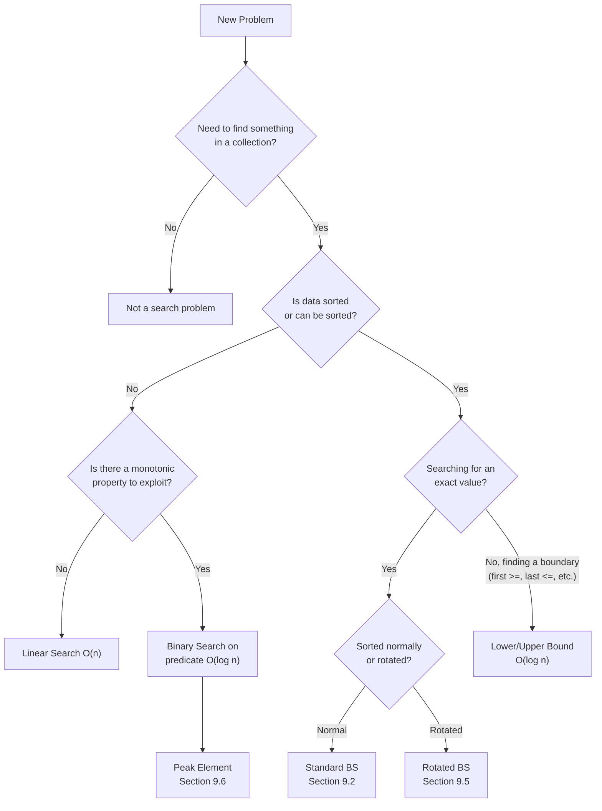
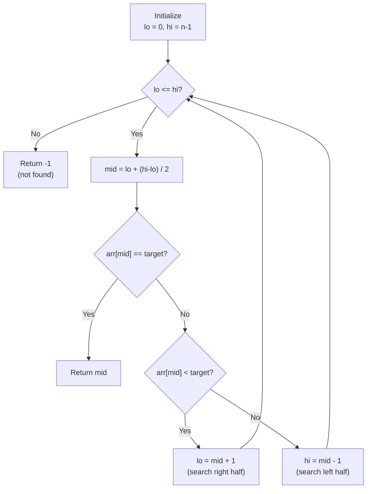

# Finding Needles — The Power of Searching

## Chapter Goals

By the end of this chapter, you will be able to:

- [ ] **Implement linear search** — the simplest search, O(n), and understand when it's your only option
- [ ] **Implement binary search** — halve the search space each step, O(log n), on sorted data
- [ ] **Find the first and last occurrence** of an element — modify binary search to find boundaries
- [ ] **Implement lower bound and upper bound** — the template that powers dozens of binary search variants
- [ ] **Search rotated sorted arrays** — handle "broken" sorted data by identifying the sorted half
- [ ] **Find peak elements** — apply binary search to non-sorted data using monotonic predicates
- [ ] **Prove correctness by contradiction** — show an algorithm works by assuming it doesn't and finding a logical impossibility

---

## The Story: The Detective

Detective Maya has been assigned an impossible case: find one specific person in a city of 10 million residents.

Her first approach: go door-to-door. Check every house, one by one. At 10 houses per minute, it would take her... about 694 days. Working nonstop. Not great.

Then she discovers the city has a trick: all buildings are numbered in order from 1 to 10,000,000. And she knows her suspect lives at building 7,234,891. So she drives to the middle of the city (building 5,000,000), checks the number, and realizes she needs to go right. Then she goes to the middle of the right half (building 7,500,000) — too far. Then the middle of what's left (building 6,250,000) — not far enough. Each time, she eliminates HALF the remaining buildings.

After just 24 checks (not 10 million!), she's standing at building 7,234,891. Case closed.

But then the city's numbering gets weird — building 1 isn't at the start anymore. The numbers go 4,521,001... 4,521,002... up to 10,000,000... then wrap around to 1, 2, 3... The sequence is *rotated*. Can Maya still use her halving trick?

And then comes the strangest case of all: find the *tallest* building in the city's skyline. The buildings aren't sorted by height — but they form a mountain shape (heights go up, then down). Can she still avoid checking every single building?

This chapter answers all three questions.

---

## Johari Window: Before

Before diving in, take 5 minutes to fill out the **"Before"** section of your [Johari Window worksheet](johari.md).


Be honest with yourself! Knowing what you *don't* know is the first step to learning it. There are no wrong answers — only honest ones.


---

## Discovery


**Stop! Try these BEFORE reading the chapter.** Struggling with a problem before learning the solution is how your brain builds the strongest connections. Spend at least 10 minutes on each one.


### Discovery 1: The Phone Book Trick

Imagine a sorted phone book with 1,000 names (A through Z). You need to find "Martinez."

You open to the middle: "Johnson." Martinez comes after Johnson alphabetically, so you can throw away the entire first half. Now you have 500 names.

You open to the middle of the remaining half: "Robinson." Martinez comes before Robinson. Throw away the second half. 250 names left.

**Question**: How many times do you need to open the book before you find "Martinez" (or confirm it's not there)? Count it out.

Now imagine the phone book has 1,000,000 names. How many checks do you need? What about 1,000,000,000?


**The pattern**: each check eliminates half the remaining names. For 1,000 names: about 10 checks. For 1,000,000: about 20. For 1,000,000,000: about 30. This is the power of O(log n).


### Discovery 2: The Broken Number Line

The numbers 1 through 10 used to be in order: [1, 2, 3, 4, 5, 6, 7, 8, 9, 10].

But someone "rotated" the line — they picked a random starting point and wrapped around: **[7, 8, 9, 10, 1, 2, 3, 4, 5, 6]**.

Find the number 3. Can you do it in fewer than 10 checks? Can you still use the halving trick somehow?

**Hint**: Look at the middle element (1 at index 4). What can you conclude about the left half [7, 8, 9, 10] and the right half [2, 3, 4, 5, 6]?


**Key insight**: Even in a rotated array, *one half is always sorted*. You can check if your target falls in the sorted half. If yes, search there. If no, search the other half. The halving trick still works!


---

## 9.1 Linear Search — The Slow Detective

Linear search is the simplest searching algorithm: check each element one by one until you find the target or run out of elements.



```python
def linear_search(arr, target):
    for i in range(len(arr)):
        if arr[i] == target:
            return i      # Found it!
    return -1              # Not found
```


```java
static int linearSearch(int[] arr, int target) {
    for (int i = 0; i < arr.length; i++) {
        if (arr[i] == target) return i;   // Found it!
    }
    return -1;                            // Not found
}
```


```cpp
int linearSearch(vector<int>& arr, int target) {
    for (int i = 0; i < (int)arr.size(); i++) {
        if (arr[i] == target) return i;   // Found it!
    }
    return -1;                            // Not found
}
```



> **Language Spotlight: The `in` Operator**
> | | Python | Java | C++ |
> |---|--------|------|-----|
> | Check membership | `x in list` — O(n) | `list.contains(x)` — O(n) | `find(v.begin(), v.end(), x)` — O(n) |
> | Under the hood | Linear search! | Linear search! | Linear search! |
>
> **Key takeaway**: `x in list` is syntactic sugar for linear search. It's O(n). After this chapter, you'll know how to do O(log n) — but only if the data is sorted.

**Time**: O(n) — must check every element in the worst case.
**Space**: O(1) — no extra memory needed.
**When to use**: When data is unsorted and can't be sorted, or when n is small.

---

## 9.2 Binary Search — The Power of Halving

Binary search is one of the most important algorithms in computer science. The idea is beautifully simple: if the data is sorted, check the middle. If the target is smaller, search the left half. If larger, search the right half. Each step eliminates half the remaining elements.

### The Algorithm

```
Start with the entire array: lo = 0, hi = n - 1
While lo <= hi:
    1. Find the middle: mid = lo + (hi - lo) / 2
    2. If arr[mid] == target: found it! Return mid.
    3. If arr[mid] < target: target is in the right half. Set lo = mid + 1.
    4. If arr[mid] > target: target is in the left half. Set hi = mid - 1.
If the loop ends without finding: return -1.
```

### Visual Walkthrough

Searching for **23** in `[2, 5, 8, 12, 16, 23, 38, 56, 72, 91]`:

```
Step 1: lo=0, hi=9, mid=4 → arr[4]=16 < 23 → go right (lo=5)
Step 2: lo=5, hi=9, mid=7 → arr[7]=56 > 23 → go left  (hi=6)
Step 3: lo=5, hi=6, mid=5 → arr[5]=23 = 23 → FOUND at index 5! ✓
```

Only 3 steps for an array of 10 elements. Linear search might need up to 10.



```python
def binary_search(arr, target):
    lo, hi = 0, len(arr) - 1
    while lo <= hi:
        mid = lo + (hi - lo) // 2     # Safe mid-point
        if arr[mid] == target:
            return mid
        elif arr[mid] < target:
            lo = mid + 1               # Search right half
        else:
            hi = mid - 1               # Search left half
    return -1                          # Not found
```


```java
static int binarySearch(int[] arr, int target) {
    int lo = 0, hi = arr.length - 1;
    while (lo <= hi) {
        int mid = lo + (hi - lo) / 2;   // Avoids overflow!
        if (arr[mid] == target) return mid;
        else if (arr[mid] < target) lo = mid + 1;
        else hi = mid - 1;
    }
    return -1;
}
```


```cpp
int binarySearch(vector<int>& arr, int target) {
    int lo = 0, hi = (int)arr.size() - 1;
    while (lo <= hi) {
        int mid = lo + (hi - lo) / 2;   // Avoids overflow!
        if (arr[mid] == target) return mid;
        else if (arr[mid] < target) lo = mid + 1;
        else hi = mid - 1;
    }
    return -1;
}
```



> **Language Spotlight: Mid-point Calculation**
> | | Python | Java | C++ |
> |---|--------|------|-----|
> | Overflow risk? | No (unlimited integers) | Yes! `(lo + hi)` can overflow `int` | Yes! Same as Java |
> | Safe formula | `(lo + hi) // 2` works fine | `lo + (hi - lo) / 2` | `lo + (hi - lo) / 2` |
> | Integer division | `//` operator | `/` on ints | `/` on ints |
>
> **Gotcha**: In Java and C++, if `lo` and `hi` are both near `Integer.MAX_VALUE`, then `lo + hi` overflows! Always use `lo + (hi - lo) / 2`. Python doesn't have this problem because integers have unlimited precision.

### Why O(log n)?

Each step halves the search space:
- Start: n elements
- After 1 step: n/2
- After 2 steps: n/4
- After k steps: n/2^k

We stop when n/2^k = 1, which means k = log₂(n).

| n | Linear Search (worst) | Binary Search (worst) | Speedup |
|---|---|---|---|
| 10 | 10 | 4 | 2.5x |
| 1,000 | 1,000 | 10 | 100x |
| 1,000,000 | 1,000,000 | 20 | 50,000x |
| 10^9 | 10^9 | 30 | 33,000,000x |

Binary search on a billion elements takes at most 30 steps. That's the power of O(log n).

---

## 9.3 First/Last Occurrence & Counting

Standard binary search finds *some* index of the target. But what if the target appears multiple times? We often need the *first* (leftmost) or *last* (rightmost) occurrence.

### First Occurrence (Leftmost)

The trick: when you find the target, **don't stop** — record the position and keep searching LEFT.



```python
def first_occurrence(arr, target):
    lo, hi = 0, len(arr) - 1
    result = -1
    while lo <= hi:
        mid = lo + (hi - lo) // 2
        if arr[mid] == target:
            result = mid       # Found one! But is there an earlier one?
            hi = mid - 1       # Keep searching LEFT
        elif arr[mid] < target:
            lo = mid + 1
        else:
            hi = mid - 1
    return result
```


```java
static int firstOccurrence(int[] arr, int target) {
    int lo = 0, hi = arr.length - 1, result = -1;
    while (lo <= hi) {
        int mid = lo + (hi - lo) / 2;
        if (arr[mid] == target) {
            result = mid;           // Record and keep searching left
            hi = mid - 1;
        } else if (arr[mid] < target) {
            lo = mid + 1;
        } else {
            hi = mid - 1;
        }
    }
    return result;
}
```


```cpp
int firstOccurrence(vector<int>& arr, int target) {
    int lo = 0, hi = (int)arr.size() - 1, result = -1;
    while (lo <= hi) {
        int mid = lo + (hi - lo) / 2;
        if (arr[mid] == target) {
            result = mid;           // Record and keep searching left
            hi = mid - 1;
        } else if (arr[mid] < target) {
            lo = mid + 1;
        } else {
            hi = mid - 1;
        }
    }
    return result;
}
```



### Last Occurrence (Rightmost)

Same idea, but when you find the target, keep searching **RIGHT**:



```python
def last_occurrence(arr, target):
    lo, hi = 0, len(arr) - 1
    result = -1
    while lo <= hi:
        mid = lo + (hi - lo) // 2
        if arr[mid] == target:
            result = mid       # Found one! But is there a later one?
            lo = mid + 1       # Keep searching RIGHT
        elif arr[mid] < target:
            lo = mid + 1
        else:
            hi = mid - 1
    return result
```


```java
static int lastOccurrence(int[] arr, int target) {
    int lo = 0, hi = arr.length - 1, result = -1;
    while (lo <= hi) {
        int mid = lo + (hi - lo) / 2;
        if (arr[mid] == target) {
            result = mid;           // Record and keep searching right
            lo = mid + 1;
        } else if (arr[mid] < target) {
            lo = mid + 1;
        } else {
            hi = mid - 1;
        }
    }
    return result;
}
```


```cpp
int lastOccurrence(vector<int>& arr, int target) {
    int lo = 0, hi = (int)arr.size() - 1, result = -1;
    while (lo <= hi) {
        int mid = lo + (hi - lo) / 2;
        if (arr[mid] == target) {
            result = mid;           // Record and keep searching right
            lo = mid + 1;
        } else if (arr[mid] < target) {
            lo = mid + 1;
        } else {
            hi = mid - 1;
        }
    }
    return result;
}
```



### Count Occurrences in O(log n)

Once you have first and last occurrence, counting is trivial:

```
count = last - first + 1    (if target exists)
count = 0                    (if first == -1)
```

This is O(log n) — two binary searches. Compare this to O(n) for scanning the entire array!

---

## 9.4 Lower Bound, Upper Bound, Floor & Ceil

These are the **most versatile binary search templates**. Master them, and you can solve almost any binary search variant.

### Lower Bound

**Lower bound** returns the index of the **first element >= target**. If all elements are smaller, it returns `len(arr)` (the insertion point where target would go).



```python
def lower_bound(arr, target):
    lo, hi = 0, len(arr)        # Note: hi = len(arr), not len(arr)-1
    while lo < hi:               # Note: strict <, not <=
        mid = lo + (hi - lo) // 2
        if arr[mid] < target:
            lo = mid + 1
        else:
            hi = mid             # Note: hi = mid, not mid - 1
    return lo
```


```java
static int lowerBound(int[] arr, int target) {
    int lo = 0, hi = arr.length;     // hi = arr.length (past the end)
    while (lo < hi) {
        int mid = lo + (hi - lo) / 2;
        if (arr[mid] < target) lo = mid + 1;
        else hi = mid;
    }
    return lo;
}
```


```cpp
int lowerBound(vector<int>& arr, int target) {
    int lo = 0, hi = (int)arr.size();
    while (lo < hi) {
        int mid = lo + (hi - lo) / 2;
        if (arr[mid] < target) lo = mid + 1;
        else hi = mid;
    }
    return lo;
}
```



### Upper Bound

**Upper bound** returns the index of the **first element > target** (strictly greater).



```python
def upper_bound(arr, target):
    lo, hi = 0, len(arr)
    while lo < hi:
        mid = lo + (hi - lo) // 2
        if arr[mid] <= target:     # Note: <= instead of <
            lo = mid + 1
        else:
            hi = mid
    return lo
```


```java
static int upperBound(int[] arr, int target) {
    int lo = 0, hi = arr.length;
    while (lo < hi) {
        int mid = lo + (hi - lo) / 2;
        if (arr[mid] <= target) lo = mid + 1;
        else hi = mid;
    }
    return lo;
}
```


```cpp
int upperBound(vector<int>& arr, int target) {
    int lo = 0, hi = (int)arr.size();
    while (lo < hi) {
        int mid = lo + (hi - lo) / 2;
        if (arr[mid] <= target) lo = mid + 1;
        else hi = mid;
    }
    return lo;
}
```



> **Language Spotlight: Built-in Bounds**
> | | Python | Java | C++ |
> |---|--------|------|-----|
> | Lower bound | `bisect.bisect_left(arr, x)` | `Arrays.binarySearch()` (complex) | `lower_bound(v.begin(), v.end(), x)` |
> | Upper bound | `bisect.bisect_right(arr, x)` | Manual | `upper_bound(v.begin(), v.end(), x)` |
>
> **For practice**: Implement them yourself! Understanding the template is more important than memorizing a library call.

### Floor and Ceil

- **Floor**: Largest element **<= target** (or -1 if none exists)
- **Ceil**: Smallest element **>= target** (or -1 if none exists)

These build directly on lower bound:
- **Ceil** = arr[lower_bound(arr, target)] if lower_bound < len
- **Floor** = arr[lower_bound(arr, target) - 1] if lower_bound > 0 and arr[lb] != target, or arr[lb] if arr[lb] == target

---

## 9.5 Rotated Sorted Arrays

A **rotated sorted array** is a sorted array that has been "rotated" — the beginning was moved to the middle. For example, `[1, 2, 3, 4, 5, 6, 7]` rotated by 3 positions becomes `[4, 5, 6, 7, 1, 2, 3]`.

The key insight: **one half is always sorted**.

```
Array: [4, 5, 6, 7, 0, 1, 2]
Left half:  [4, 5, 6, 7] — sorted!
Right half: [0, 1, 2]    — also sorted!
```

When you pick the mid, either the left half (lo to mid) or the right half (mid to hi) is sorted. Check if your target falls within the sorted half. If yes, search there. If not, search the other half.

### Find Minimum in Rotated Array

The minimum element is the "pivot point" — where the rotation happened.



```python
def find_min_rotated(arr):
    lo, hi = 0, len(arr) - 1
    while lo < hi:
        mid = lo + (hi - lo) // 2
        if arr[mid] > arr[hi]:
            lo = mid + 1     # Min is in the right half
        else:
            hi = mid          # Min is at mid or to the left
    return arr[lo]
```


```java
static int findMinRotated(int[] arr) {
    int lo = 0, hi = arr.length - 1;
    while (lo < hi) {
        int mid = lo + (hi - lo) / 2;
        if (arr[mid] > arr[hi]) lo = mid + 1;
        else hi = mid;
    }
    return arr[lo];
}
```


```cpp
int findMinRotated(vector<int>& arr) {
    int lo = 0, hi = (int)arr.size() - 1;
    while (lo < hi) {
        int mid = lo + (hi - lo) / 2;
        if (arr[mid] > arr[hi]) lo = mid + 1;
        else hi = mid;
    }
    return arr[lo];
}
```



### Search in Rotated Array



```python
def search_rotated(arr, target):
    lo, hi = 0, len(arr) - 1
    while lo <= hi:
        mid = lo + (hi - lo) // 2
        if arr[mid] == target:
            return mid
        # Is the left half sorted?
        if arr[lo] <= arr[mid]:
            if arr[lo] <= target < arr[mid]:
                hi = mid - 1     # Target is in the sorted left half
            else:
                lo = mid + 1     # Target is in the right half
        # Right half must be sorted
        else:
            if arr[mid] < target <= arr[hi]:
                lo = mid + 1     # Target is in the sorted right half
            else:
                hi = mid - 1     # Target is in the left half
    return -1
```


```java
static int searchRotated(int[] arr, int target) {
    int lo = 0, hi = arr.length - 1;
    while (lo <= hi) {
        int mid = lo + (hi - lo) / 2;
        if (arr[mid] == target) return mid;
        if (arr[lo] <= arr[mid]) {       // Left half is sorted
            if (arr[lo] <= target && target < arr[mid])
                hi = mid - 1;
            else
                lo = mid + 1;
        } else {                          // Right half is sorted
            if (arr[mid] < target && target <= arr[hi])
                lo = mid + 1;
            else
                hi = mid - 1;
        }
    }
    return -1;
}
```


```cpp
int searchRotated(vector<int>& arr, int target) {
    int lo = 0, hi = (int)arr.size() - 1;
    while (lo <= hi) {
        int mid = lo + (hi - lo) / 2;
        if (arr[mid] == target) return mid;
        if (arr[lo] <= arr[mid]) {
            if (arr[lo] <= target && target < arr[mid])
                hi = mid - 1;
            else
                lo = mid + 1;
        } else {
            if (arr[mid] < target && target <= arr[hi])
                lo = mid + 1;
            else
                hi = mid - 1;
        }
    }
    return -1;
}
```



**Bonus**: The **rotation count** (how many times the array was rotated) equals the **index of the minimum element**. So if you can find the minimum, you know the rotation count too!

---

## 9.6 Peak Element & Beyond

A **peak element** is an element that is strictly greater than its neighbors. We define `arr[-1] = arr[n] = -∞` (the boundaries are always smaller than any element).

This is where binary search gets truly mind-blowing: **it works on unsorted data** — as long as there's a *monotonic property* to exploit.

### The Insight

If `arr[mid] < arr[mid + 1]`, then a peak MUST exist somewhere to the right (because values are going up, and they must eventually come down — or arr[n-1] itself is a peak).

If `arr[mid] > arr[mid + 1]`, then a peak MUST exist at mid or to the left (values are going down from mid, so mid could be a peak, or there's a higher peak to the left).



```python
def find_peak(arr):
    lo, hi = 0, len(arr) - 1
    while lo < hi:
        mid = lo + (hi - lo) // 2
        if arr[mid] < arr[mid + 1]:
            lo = mid + 1       # Peak is to the right
        else:
            hi = mid            # Peak is at mid or to the left
    return lo                   # lo == hi == peak index
```


```java
static int findPeak(int[] arr) {
    int lo = 0, hi = arr.length - 1;
    while (lo < hi) {
        int mid = lo + (hi - lo) / 2;
        if (arr[mid] < arr[mid + 1]) lo = mid + 1;
        else hi = mid;
    }
    return lo;
}
```


```cpp
int findPeak(vector<int>& arr) {
    int lo = 0, hi = (int)arr.size() - 1;
    while (lo < hi) {
        int mid = lo + (hi - lo) / 2;
        if (arr[mid] < arr[mid + 1]) lo = mid + 1;
        else hi = mid;
    }
    return lo;
}
```



> **The Big Lesson**: Binary search doesn't require sorted data. It requires a **monotonic predicate** — some condition that splits the search space into two halves. The "predicate" for peak element is: "Is the peak to my right?" This is True for a prefix and False for the rest.
>
> In **Chapter 16**, we'll push this idea even further: binary search on *answers*, where the search space isn't even an array!

---

## Think Like a Pro


**Tourist (Gennady Korotkevich)**: "Binary search is my #1 debugging tool. When my solution gives a wrong answer on a large test case, I binary search on the input size to find the *smallest* failing case. I even binary search on the line number where the bug might be! The halving principle works everywhere."

**Errichto**: "The real insight: you don't need sorted data for binary search. You need a MONOTONIC PREDICATE — a condition that flips from False to True at some point. Once you internalize this, you'll see binary search opportunities everywhere: in answer spaces, in time, in distances, in speeds. It's the most versatile technique in competitive programming."


---

## Thinking Flowchart



---

## Implementation Flowchart — Binary Search



---

## AOPS Showcase: Find Peak Element — Two Approaches

A peak element is strictly greater than its neighbors (boundaries count as -∞). Given a non-empty array, find ANY peak's index.

### Approach 1: Linear Scan — O(n)

Check each element. If it's greater than both neighbors (handling boundaries), it's a peak.



```python
def find_peak_linear(arr):
    n = len(arr)
    for i in range(n):
        left_ok = (i == 0) or (arr[i] > arr[i - 1])
        right_ok = (i == n - 1) or (arr[i] > arr[i + 1])
        if left_ok and right_ok:
            return i
    return -1  # Should never happen if array is non-empty
```


```java
static int findPeakLinear(int[] arr) {
    int n = arr.length;
    for (int i = 0; i < n; i++) {
        boolean leftOk = (i == 0) || (arr[i] > arr[i - 1]);
        boolean rightOk = (i == n - 1) || (arr[i] > arr[i + 1]);
        if (leftOk && rightOk) return i;
    }
    return -1;
}
```


```cpp
int findPeakLinear(vector<int>& arr) {
    int n = (int)arr.size();
    for (int i = 0; i < n; i++) {
        bool leftOk = (i == 0) || (arr[i] > arr[i - 1]);
        bool rightOk = (i == n - 1) || (arr[i] > arr[i + 1]);
        if (leftOk && rightOk) return i;
    }
    return -1;
}
```



**Time**: O(n). Simple, but can we do better?

### Approach 2: Binary Search — O(log n)

The key insight: if `arr[mid] < arr[mid + 1]`, there must be a peak to the right. If `arr[mid] > arr[mid + 1]`, there must be a peak at mid or to the left.



```python
def find_peak_binary(arr):
    lo, hi = 0, len(arr) - 1
    while lo < hi:
        mid = lo + (hi - lo) // 2
        if arr[mid] < arr[mid + 1]:
            lo = mid + 1     # Peak is to the right
        else:
            hi = mid          # Peak is at mid or to the left
    return lo
```


```java
static int findPeakBinary(int[] arr) {
    int lo = 0, hi = arr.length - 1;
    while (lo < hi) {
        int mid = lo + (hi - lo) / 2;
        if (arr[mid] < arr[mid + 1]) lo = mid + 1;
        else hi = mid;
    }
    return lo;
}
```


```cpp
int findPeakBinary(vector<int>& arr) {
    int lo = 0, hi = (int)arr.size() - 1;
    while (lo < hi) {
        int mid = lo + (hi - lo) / 2;
        if (arr[mid] < arr[mid + 1]) lo = mid + 1;
        else hi = mid;
    }
    return lo;
}
```



### Performance Comparison

| Approach | Time | Space | n = 10^6 operations |
|----------|------|-------|---------------------|
| Linear Scan | O(n) | O(1) | 1,000,000 |
| Binary Search | O(log n) | O(1) | 20 |

Same answer, but binary search is **50,000x faster** for large arrays. The key insight: binary search applies whenever there's a monotonic predicate, not just sorted data.

---

## Proof Technique: Proof by Contradiction

This is our second formal proof technique (after Direct Proof in Ch 6 and Induction in Ch 8). The idea:

1. **Assume the opposite** of what you want to prove
2. **Follow the logic** until you reach an impossibility
3. **Conclude** that your assumption was wrong — the original statement must be true

### Proof: Binary Search Always Finds the Target (if it exists)

**Claim**: If `target` is in the sorted array, binary search returns its index.

**Proof by contradiction**:
1. Assume binary search returns -1, but target IS in the array at some position k.
2. At every step, binary search sets `lo = mid + 1` (when `arr[mid] < target`) or `hi = mid - 1` (when `arr[mid] > target`).
3. Since the array is sorted and `target = arr[k]`, binary search only eliminates positions where the target CANNOT be.
4. Specifically, if `arr[mid] < target`, then all positions ≤ mid have values < target (because the array is sorted), so position k must be > mid. Setting `lo = mid + 1` preserves the invariant that k is in [lo, hi].
5. Similarly for the other direction. So position k is NEVER eliminated from [lo, hi].
6. But if k is never eliminated, the loop eventually checks position k and returns it. This contradicts our assumption that -1 was returned.
7. Therefore, binary search always finds the target if it exists. **QED.**

### Proof: A Peak Always Exists

**Claim**: Any non-empty array has at least one peak element.

**Proof by contradiction**:
1. Assume no peak exists. Then for every element `arr[i]`, it has a neighbor that's ≥ it.
2. Start at `arr[0]`. Since it's not a peak, `arr[1] >= arr[0]`.
3. Since `arr[1]` is not a peak, `arr[2] >= arr[1]`.
4. Continuing: `arr[0] <= arr[1] <= arr[2] <= ... <= arr[n-1]`.
5. But `arr[n-1]` has no right neighbor (or equivalently, `arr[n] = -∞`), so `arr[n-1] > arr[n] = -∞`. Combined with `arr[n-1] >= arr[n-2]`, arr[n-1] IS a peak.
6. This contradicts our assumption. **QED.**


**Why proofs matter in competitive programming**: When you write a binary search, getting the loop condition or the update wrong by one character can cause wrong answers or infinite loops. If you can PROVE your solution is correct (even informally in your head), you'll catch these bugs before submitting. Errichto says: "If you can't convince yourself why it's correct, it probably isn't."


---

## Legend's Corner


**Neal Wu** (USACO legend, started competing in 8th grade — your age!) shares: "My first USACO Silver problem required binary search. I spent 45 minutes writing a linear scan that TLE'd, then just 5 minutes rewriting it with binary search for AC. That was my 'aha' moment. Now, whenever I see a sorted array, my brain automatically whispers 'binary search.' It became so instinctive that I stopped thinking about it — like how you don't think about breathing. Build that instinct by solving lots of problems."


---

## Gotchas


**Gotcha 1: lo <= hi vs lo < hi**
- Use `lo <= hi` for standard binary search (searching for exact value)
- Use `lo < hi` for lower bound / peak finding (converging to a position)
- Mixing them up causes either missing the target or infinite loops!



**Gotcha 2: Integer Overflow in Mid**
```
WRONG: int mid = (lo + hi) / 2;      // Overflows if lo + hi > INT_MAX
RIGHT: int mid = lo + (hi - lo) / 2;  // Always safe
```
This only matters in Java/C++ (Python has unlimited integers). But always use the safe formula — make it a habit.



**Gotcha 3: Infinite Loop**
```
WRONG: lo = mid;      // If mid == lo, this never moves!
RIGHT: lo = mid + 1;  // Always makes progress
```
If you use `lo = mid` with `while lo < hi` and the gap is 1, `mid = lo` and nothing changes — infinite loop. Always ensure either `lo` or `hi` moves by at least 1.



**Gotcha 4: Binary Search Requires Sorted Data**
Binary search on an unsorted array gives WRONG results. Always check: is the data sorted? If not, sort it first (O(n log n)) — the total time is still O(n log n) which is often fine.

Exception: peak element and similar problems where a monotonic property exists without full sorting.



**Gotcha 5: Lower Bound vs "Find Exact"**
Lower bound returns the insertion point even if the element is NOT in the array:
```python
lower_bound([1, 3, 5, 7], 4)  # Returns 2 (position of 5)
lower_bound([1, 3, 5, 7], 5)  # Returns 2 (position of 5)
```
Both return 2! To check if the element actually exists, verify: `lb < len(arr) and arr[lb] == target`.



**Gotcha 6: "Not Actually Rotated"**
A rotated sorted array might have rotation = 0 (it's just sorted normally). Your code must handle `[1, 2, 3, 4, 5]` as a valid "rotated" array. Always test with this edge case.


---

## Practice Problems

| # | Name | Difficulty | Key Concept |
|---|------|-----------|-------------|
| W1 | Linear Search | ⭐ | Sequential scan — the O(n) baseline |
| W2 | Binary Search | ⭐ | Classic BS — halve the search space |
| W3 | First Occurrence | ⭐ | Find leftmost position of target |
| W4 | Last Occurrence | ⭐ | Find rightmost position of target |
| W5 | Count Occurrences | ⭐ | Count in O(log n) using first + last |
| P1 | Lower Bound | ⭐⭐ | First index where arr[i] >= target |
| P2 | Upper Bound | ⭐⭐ | First index where arr[i] > target |
| P3 | Floor and Ceil | ⭐⭐ | Largest <= target, smallest >= target |
| P4 | Search in Rotated Array | ⭐⭐ | BS on rotated sorted data |
| P5 | Find Minimum in Rotated Array | ⭐⭐ | Find the pivot point |
| C1 | Find Peak Element (AOPS) | ⭐⭐⭐ | Linear scan + binary search |
| C2 | Single Element in Sorted Array | ⭐⭐⭐ | BS on pair parity |
| C3 | Search in Rotated Array II | ⭐⭐⭐ | Rotated search WITH duplicates |


**Strategy**: Start with W1-W2 to build the basic template. Then W3-W5 to learn modifications. P1-P3 teach the general lower/upper bound framework. P4-P5 apply BS to "broken" sorted data. C1-C3 are the hardest — they require creative BS applications.


---

## Language Idioms



```python
import bisect

arr = [1, 3, 5, 7, 9]

# Lower bound: first index where arr[i] >= target
bisect.bisect_left(arr, 5)     # 2

# Upper bound: first index where arr[i] > target
bisect.bisect_right(arr, 5)    # 3

# Check if element exists using bisect
def bs_contains(arr, x):
    i = bisect.bisect_left(arr, x)
    return i < len(arr) and arr[i] == x

# Python's `in` is O(n) for lists, O(1) for sets
5 in arr        # True — but O(n)!
5 in {1,3,5,7}  # True — O(1) with a set (Ch 11)
```


```java
import java.util.Arrays;

int[] arr = {1, 3, 5, 7, 9};

// Built-in BS: returns index if found, -(insertion point) - 1 if not
int idx = Arrays.binarySearch(arr, 5);   // 2
int idx2 = Arrays.binarySearch(arr, 4);  // -3 (insert at index 2)

// Extract insertion point from negative result:
if (idx2 < 0) {
    int insertionPoint = -(idx2 + 1);    // 2
}

// Gotcha: Arrays.binarySearch doesn't find first/last occurrence!
// For duplicates, you must implement your own.
```


```cpp
#include <algorithm>
#include <vector>
using namespace std;

vector<int> arr = {1, 3, 5, 7, 9};

// Lower bound: iterator to first element >= target
auto lb = lower_bound(arr.begin(), arr.end(), 5);  // points to 5
int idx = lb - arr.begin();                          // 2

// Upper bound: iterator to first element > target
auto ub = upper_bound(arr.begin(), arr.end(), 5);   // points to 7
int idx2 = ub - arr.begin();                         // 3

// binary_search: just returns true/false
bool found = binary_search(arr.begin(), arr.end(), 5);  // true

// Count occurrences using bounds:
int count = upper_bound(arr.begin(), arr.end(), 5) -
            lower_bound(arr.begin(), arr.end(), 5);   // 1
```



> **For practice**: Don't use these built-ins! Implement every binary search variant from scratch. Understanding the template is more valuable than memorizing library calls. In USACO contests, you often need custom predicates that built-in functions can't handle.

---

## Breadcrumbs

### Looking Back
- **Ch 5**: `x in list` is O(n) — linear search under the hood. Now you know how to search in O(log n)!
- **Ch 6**: We learned O(log n) is incredibly fast. Now you see the algorithm that achieves it.
- **Ch 8**: "Sort first, think later" — sorting was the preparation; binary search is the payoff.

### Looking Forward
- **Ch 10**: Binary search is naturally recursive — base case (lo > hi) + recursive step (search left or right half).
- **Ch 13**: Binary search prunes the search space in backtracking problems. "Can I eliminate half the possibilities?"
- **Ch 16**: Binary search on ANSWERS — the biggest generalization. Instead of searching an array, search the space of possible answers. This is one of the most powerful techniques in all of CP.
- **Ch 25**: The O(n log n) algorithm for Longest Increasing Subsequence uses binary search on a patience sorting array.

### Cross-Chapter Threads
- **"Sort first, think later"**: Ch 8 taught sorting. Ch 9 shows WHY — binary search on sorted data is O(log n). This thread continues in Ch 13 (sorted pruning), Ch 15 (two pointers on sorted), Ch 18 (sort for greedy).
- **"Reduce to a known problem"**: INTRODUCTION of this thread. Many problems can be reframed as "find the boundary where a condition changes" — which IS binary search. This thread continues in Ch 13 (reduce to search), Ch 16 (reduce optimization to BS on answers), Ch 19 (reduce to graph search).
- **"The right question"**: In Ch 6, the question was "Is this element present?" Now it evolves: "What's the FIRST position where...?" and "What's the LARGEST value such that...?" In Ch 16, this becomes "What's the minimum X such that f(X) >= target?"

---

## Johari Window: After

Now fill out the **"After"** section of your [Johari Window worksheet](johari.md). Compare with your "Before" answers — how much did your understanding grow?

---

## Open Questions Beyond


**1. Searching in 2D**: We searched sorted 1D arrays. What about a 2D matrix where each row and column is sorted? Can we still search in less than O(n²)?
→ *Yes! In Ch 16, you'll learn to search a sorted matrix in O(n + m) or even O(log(n*m)).*

**2. Binary search on answers**: What if the "answer" isn't an element in an array, but a number like "What's the minimum speed needed to arrive on time?" or "What's the maximum distance between cows?"
→ *This is the biggest generalization of binary search, and it's coming in Ch 16. Instead of searching an array, you search the space of possible answers. Mind-blowing.*

**3. Dynamic data**: We sort, then search. But what if someone keeps adding and removing elements? Sorting every time is expensive...
→ *This leads to balanced binary search trees (Ch 26), where insert, delete, AND search are all O(log n). The "sorted" property is maintained dynamically.*


---

## What's Next

You've now learned to **sort** data (Ch 8) and **search** it (Ch 9) — two of the most fundamental algorithmic skills. Together, they form the "sort first, search fast" pattern that you'll use throughout your competitive programming career.

In **Chapter 10: The Magic of Recursion — Functions That Call Themselves**, you'll discover that both merge sort and binary search have a hidden recursive nature. You'll learn to think recursively — breaking big problems into smaller copies of themselves. Recursion is the gateway to divide-and-conquer, backtracking, dynamic programming, and tree algorithms. It's one of the most powerful thinking tools in all of computer science.

Ready to go deeper? Let's recurse!
