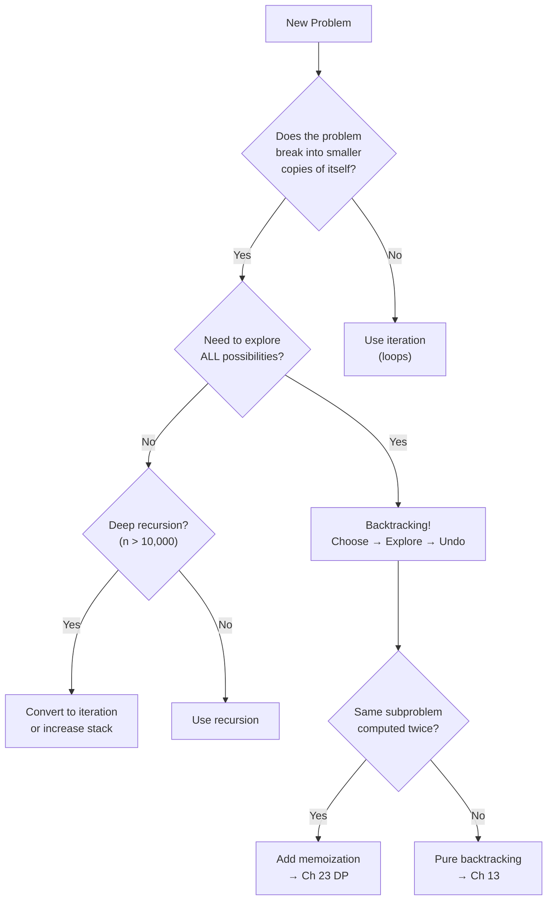
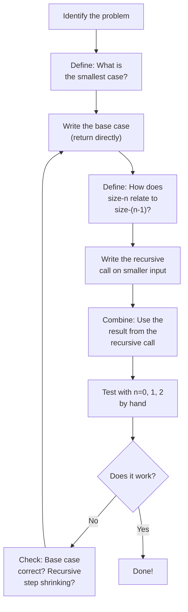

# The Magic of Recursion — Functions That Call Themselves

## Chapter Goals

By the end of this chapter, you will:

- Understand what recursion is and how the call stack tracks each function call
- Write recursive functions with proper base cases and recursive cases
- Convert between recursive and iterative solutions
- Visualize recursion trees to understand time complexity
- Know when recursion is the right tool (and when it isn't)
- Use backtracking to systematically explore all possibilities
- Generate subsets, permutations, and combinations recursively

---

## The Story: "Inception"

Imagine you're a dreamer who discovers a special ability: you can enter a dream *within* a dream. Inside that dream, you can enter yet another dream. And another. Each dream has its own world — its own people, its own buildings, its own version of reality. But there's a rule: every dream must have an **exit condition**. When you reach it, you wake up one level, carrying back what you learned. The result bubbles up through each dream level until you're fully awake.

Your friend tries this without an exit condition. She enters a dream, then another, then another, deeper and deeper... and never wakes up. The dream machine crashes. In programming, we call this a **stack overflow**.

This is recursion. A function that enters a smaller version of itself, solves it, and uses that answer to build the full solution. And the exit condition? That's the **base case** — the simplest version of the problem that you can solve directly, without going deeper.

Think of **Russian nesting dolls** (matryoshka). Open the biggest doll — there's a smaller one inside. Open that one — an even smaller one. Keep going until you reach the tiniest doll that doesn't open. That's your base case. Then you put them all back together, biggest to smallest. That's recursion unwinding.

---

## Johari Window: Before

Before diving in, take 5 minutes to fill out the **"Before"** section of your [Johari Window worksheet](johari.md).


Be honest with yourself! Knowing what you *don't* know is the first step to learning it. There are no wrong answers — only honest ones.


---

## Discovery

Before we explain recursion formally, try these puzzles:

### Puzzle 1: "The Infinite Loop That Isn't"

Look at this function:

```python
def mystery(n):
    if n <= 0:
        return 0
    return n + mystery(n - 1)
```

**Without running it**, predict: what does `mystery(5)` return?

Trace it on paper:
- `mystery(5)` = 5 + `mystery(4)`
- `mystery(4)` = 4 + `mystery(3)`
- `mystery(3)` = 3 + `mystery(2)`
- `mystery(2)` = 2 + `mystery(1)`
- `mystery(1)` = 1 + `mystery(0)`
- `mystery(0)` = 0 ← **base case!**

Now unwind: 0 → 1 → 3 → 6 → 10 → **15**.

It's the sum of 1+2+3+4+5! The function calls itself, but it doesn't loop forever because it always moves toward the base case (`n <= 0`).

### Puzzle 2: "The Mirror Test"

Is "racecar" the same backwards? Here's a method:
1. Check: is the first letter the same as the last? ('r' == 'r' ✓)
2. Now check the *middle* part: is "aceca" a palindrome?
3. First == last? ('a' == 'a' ✓). Check "cec".
4. First == last? ('c' == 'c' ✓). Check "e".
5. One character — it's trivially a palindrome. **Base case!**

You just did recursion without knowing it. You solved a big problem ("is this whole string a palindrome?") by reducing it to a smaller problem ("is the middle part a palindrome?") plus a tiny check ("do the ends match?").

---

## 10.1 What Is Recursion?

**Recursion** is when a function calls itself to solve a smaller version of the same problem.

Every recursive function has two parts:
1. **Base case** — the simplest version that can be solved directly (no more recursion needed)
2. **Recursive case** — break the problem into a smaller piece, call yourself, and combine the results



```python
def countdown(n):
    """Print numbers from n down to 1."""
    if n <= 0:          # Base case: nothing to print
        return
    print(n)            # Do something
    countdown(n - 1)    # Recursive case: smaller problem
```


```java
static void countdown(int n) {
    if (n <= 0) return;   // Base case
    System.out.println(n);
    countdown(n - 1);     // Recursive case
}
```


```cpp
void countdown(int n) {
    if (n <= 0) return;    // Base case
    cout << n << endl;
    countdown(n - 1);      // Recursive case
}
```



### The Call Stack

When a function calls itself, the computer doesn't get confused — it uses a **call stack**. Each call gets its own "frame" with its own local variables:

```
countdown(3) starts → prints 3, calls countdown(2)
  countdown(2) starts → prints 2, calls countdown(1)
    countdown(1) starts → prints 1, calls countdown(0)
      countdown(0) starts → base case → returns
    countdown(1) returns
  countdown(2) returns
countdown(3) returns
```

Each level has its own copy of `n`. When the base case returns, each level "wakes up" (like our dreamer!) and finishes its work.


**The Golden Rule of Recursion**: Every recursive function MUST have a base case that stops the recursion. Without it, you get infinite recursion → stack overflow.


---

## 10.2 First Recursive Functions

Let's build three classic recursive functions.

### Factorial: n!

`n! = n × (n-1) × ... × 2 × 1`, and `0! = 1`.

Recursive insight: `n! = n × (n-1)!`



```python
def factorial(n):
    if n == 0:              # Base case
        return 1
    return n * factorial(n - 1)  # Recursive case
```


```java
static long factorial(int n) {
    if (n == 0) return 1;              // Base case
    return (long) n * factorial(n - 1); // Recursive case
}
```


```cpp
long long factorial(int n) {
    if (n == 0) return 1;              // Base case
    return (long long)n * factorial(n - 1); // Recursive case
}
```



> **Language Spotlight: Overflow**
> | | Python | Java | C++ |
> |---|--------|------|-----|
> | Integer overflow? | No (unlimited) | Yes! `int` overflows at 13! | Yes! `int` overflows at 13! |
> | Safe type | `int` (auto-grows) | `long` | `long long` |

### Sum of First N Numbers

`sum(n) = 1 + 2 + ... + n`

Recursive insight: `sum(n) = n + sum(n-1)`, with `sum(0) = 0`.



```python
def sum_n(n):
    if n == 0:
        return 0
    return n + sum_n(n - 1)
```


```java
static int sumN(int n) {
    if (n == 0) return 0;
    return n + sumN(n - 1);
}
```


```cpp
int sumN(int n) {
    if (n == 0) return 0;
    return n + sumN(n - 1);
}
```



### Fibonacci Numbers

`F(0) = 0, F(1) = 1, F(n) = F(n-1) + F(n-2)`



```python
def fib(n):
    if n <= 1:
        return n
    return fib(n - 1) + fib(n - 2)
```


```java
static int fib(int n) {
    if (n <= 1) return n;
    return fib(n - 1) + fib(n - 2);
}
```


```cpp
int fib(int n) {
    if (n <= 1) return n;
    return fib(n - 1) + fib(n - 2);
}
```




**Warning**: This naive Fibonacci is O(2^n)! `fib(40)` makes over a BILLION calls. We'll fix this in the AOPS Showcase.


---

## 10.3 Recursion vs. Iteration

Every recursive function can be rewritten as a loop, and every loop can be rewritten as recursion. So when should you use which?



```python
# Factorial — iterative version
def factorial_iter(n):
    result = 1
    for i in range(1, n + 1):
        result *= i
    return result

# Factorial — recursive version
def factorial_rec(n):
    if n == 0:
        return 1
    return n * factorial_rec(n - 1)
```


```java
// Factorial — iterative
static long factorialIter(int n) {
    long result = 1;
    for (int i = 1; i <= n; i++) result *= i;
    return result;
}

// Factorial — recursive
static long factorialRec(int n) {
    if (n == 0) return 1;
    return (long) n * factorialRec(n - 1);
}
```


```cpp
// Factorial — iterative
long long factorialIter(int n) {
    long long result = 1;
    for (int i = 1; i <= n; i++) result *= i;
    return result;
}

// Factorial — recursive
long long factorialRec(int n) {
    if (n == 0) return 1;
    return (long long)n * factorialRec(n - 1);
}
```



**When to use recursion:**
- The problem naturally breaks into smaller copies of itself (trees, subsets, permutations)
- Backtracking: you need to explore choices and undo them
- The recursive code is much cleaner than the iterative version

**When to use iteration:**
- Simple counting or accumulation (sum, factorial)
- Deep recursion would cause stack overflow (n > 10,000)
- Performance matters and recursion has overhead


**Pro tip from Errichto**: "I use whichever is cleaner. For trees → recursion. For DP → usually iteration. For backtracking → always recursion."


---

## 10.4 Reverse & Palindrome — The "Shrinking Problem" Pattern

### Reverse a String

Recursive insight: `reverse("hello")` = `reverse("ello") + "h"` = `reverse("llo") + "e" + "h"` = ...



```python
def reverse_str(s):
    if len(s) <= 1:       # Base case: empty or single char
        return s
    return reverse_str(s[1:]) + s[0]
```


```java
static String reverseStr(String s) {
    if (s.length() <= 1) return s;
    return reverseStr(s.substring(1)) + s.charAt(0);
}
```


```cpp
string reverseStr(string s) {
    if (s.size() <= 1) return s;
    return reverseStr(s.substr(1)) + s[0];
}
```



### Check Palindrome

Recursive insight: A string is a palindrome if the first and last characters match AND the middle substring is a palindrome.



```python
def is_palindrome(s):
    if len(s) <= 1:           # Base case
        return True
    if s[0] != s[-1]:         # First and last don't match
        return False
    return is_palindrome(s[1:-1])  # Check the middle
```


```java
static boolean isPalindrome(String s) {
    if (s.length() <= 1) return true;
    if (s.charAt(0) != s.charAt(s.length() - 1)) return false;
    return isPalindrome(s.substring(1, s.length() - 1));
}
```


```cpp
bool isPalindrome(string s) {
    if (s.size() <= 1) return true;
    if (s.front() != s.back()) return false;
    return isPalindrome(s.substr(1, s.size() - 2));
}
```



Both of these follow the **"shrinking problem"** pattern: each recursive call works on a smaller input, moving steadily toward the base case.

---

## 10.5 Recursion Tree Visualization

Drawing the **recursion tree** helps you understand what's happening and spot problems.

### Factorial Tree (Good — Linear)

```
factorial(4)
├── 4 * factorial(3)
│       ├── 3 * factorial(2)
│       │       ├── 2 * factorial(1)
│       │       │       ├── 1 * factorial(0)
│       │       │       │       └── returns 1
│       │       │       └── returns 1
│       │       └── returns 2
│       └── returns 6
└── returns 24
```

This is a **linear chain** — each call makes exactly ONE recursive call. Total calls: n+1. Time: O(n).

### Fibonacci Tree (Bad — Exponential!)

```
fib(5)
├── fib(4)
│   ├── fib(3)
│   │   ├── fib(2)
│   │   │   ├── fib(1) → 1
│   │   │   └── fib(0) → 0
│   │   └── fib(1) → 1
│   └── fib(2)
│       ├── fib(1) → 1
│       └── fib(0) → 0
└── fib(3)
    ├── fib(2)
    │   ├── fib(1) → 1
    │   └── fib(0) → 0
    └── fib(1) → 1
```

See the problem? `fib(3)` is computed **TWICE**. `fib(2)` is computed **THREE TIMES**. For `fib(n)`, the total calls grow like 2^n. This is why naive Fibonacci is so slow — and why memoization (saving past results) changes everything.


**Red flag**: If your recursion tree has the same subproblem appearing multiple times, you have **overlapping subproblems**. The fix: memoization (save results so you never recompute). This idea becomes the foundation of Dynamic Programming in Ch 23.


---

## 10.6 Introduction to Backtracking

**Backtracking** is recursion with a twist: at each step, you **choose**, **explore**, and then **undo** the choice to try something else.

The template:

```
function backtrack(state):
    if state is a complete solution:
        record it
        return
    for each possible choice:
        make the choice
        backtrack(updated state)
        undo the choice     ← THIS is the "backtracking" step
```

### Example: Finding All Paths

Imagine you're at a fork in a road. You can go left or right. Each direction leads to more forks. You want to find ALL paths to the exit.

1. Go left. Hit another fork. Go left again. Dead end. **Backtrack** — go right instead.
2. Found exit! Record this path. **Backtrack** to previous fork.
3. Now try the other direction from the first fork...

This "try everything, undo, try the next" pattern is backtracking.

### N-Queens Preview

Can you place 4 queens on a 4×4 chessboard so no two attack each other?

```
. Q . .      . . Q .
. . . Q      Q . . .
Q . . .      . . . Q
. . Q .      . Q . .
```

Backtracking solves this:
1. Place a queen in row 0, column 0.
2. Try to place one in row 1 — columns 0, 1 are attacked. Try column 2 — safe!
3. Row 2 — all columns attacked. **Backtrack**: remove queen from row 1, try column 3...

We'll implement N-Queens fully in Ch 13 (Bronze Battle Plan). For now, understand the *pattern*.


**Key insight**: Backtracking is just **systematic brute force**. Instead of randomly guessing, you methodically try every option and undo when you hit a dead end. It's the "brute force is a strategy" thread from Ch 6, now with structure.


---

## 10.7 Generating Subsets & Permutations

Two of the most important backtracking patterns: generating all **subsets** and all **permutations**.

### Subsets (Power Set)

For each element, you have two choices: **include it** or **exclude it**. This creates a binary decision tree.

```
                    []
               /          \
           [1]              []
          /    \          /    \
      [1,2]    [1]     [2]     []
      / \     / \     / \     / \
  [1,2,3][1,2][1,3][1] [2,3][2] [3] []
```



```python
def subsets(nums):
    result = []

    def backtrack(index, current):
        if index == len(nums):
            result.append(current[:])   # Save a COPY
            return
        # Choice 1: include nums[index]
        current.append(nums[index])
        backtrack(index + 1, current)
        current.pop()                   # Undo!
        # Choice 2: exclude nums[index]
        backtrack(index + 1, current)

    backtrack(0, [])
    return result
```


```java
static List<List<Integer>> subsets(int[] nums) {
    List<List<Integer>> result = new ArrayList<>();
    backtrack(nums, 0, new ArrayList<>(), result);
    return result;
}

static void backtrack(int[] nums, int index,
                      List<Integer> current,
                      List<List<Integer>> result) {
    if (index == nums.length) {
        result.add(new ArrayList<>(current)); // Copy!
        return;
    }
    current.add(nums[index]);        // Include
    backtrack(nums, index + 1, current, result);
    current.remove(current.size() - 1);  // Undo!
    backtrack(nums, index + 1, current, result); // Exclude
}
```


```cpp
void backtrack(vector<int>& nums, int index,
               vector<int>& current,
               vector<vector<int>>& result) {
    if (index == (int)nums.size()) {
        result.push_back(current);  // Copy happens automatically
        return;
    }
    current.push_back(nums[index]);     // Include
    backtrack(nums, index + 1, current, result);
    current.pop_back();                  // Undo!
    backtrack(nums, index + 1, current, result);  // Exclude
}

vector<vector<int>> subsets(vector<int>& nums) {
    vector<vector<int>> result;
    vector<int> current;
    backtrack(nums, 0, current, result);
    return result;
}
```



### Permutations

For permutations, at each position you try each remaining element. The classic approach: swap each element to the current position, recurse, then swap back.



```python
def permutations(nums):
    result = []

    def backtrack(start):
        if start == len(nums):
            result.append(nums[:])  # Save a copy
            return
        for i in range(start, len(nums)):
            nums[start], nums[i] = nums[i], nums[start]  # Choose
            backtrack(start + 1)                           # Explore
            nums[start], nums[i] = nums[i], nums[start]  # Undo

    backtrack(0)
    return result
```


```java
static List<List<Integer>> permutations(int[] nums) {
    List<List<Integer>> result = new ArrayList<>();
    backtrackPerm(nums, 0, result);
    return result;
}

static void backtrackPerm(int[] nums, int start,
                          List<List<Integer>> result) {
    if (start == nums.length) {
        List<Integer> perm = new ArrayList<>();
        for (int x : nums) perm.add(x);
        result.add(perm);
        return;
    }
    for (int i = start; i < nums.length; i++) {
        int tmp = nums[start]; nums[start] = nums[i]; nums[i] = tmp;
        backtrackPerm(nums, start + 1, result);
        tmp = nums[start]; nums[start] = nums[i]; nums[i] = tmp;
    }
}
```


```cpp
void backtrackPerm(vector<int>& nums, int start,
                   vector<vector<int>>& result) {
    if (start == (int)nums.size()) {
        result.push_back(nums);
        return;
    }
    for (int i = start; i < (int)nums.size(); i++) {
        swap(nums[start], nums[i]);             // Choose
        backtrackPerm(nums, start + 1, result); // Explore
        swap(nums[start], nums[i]);             // Undo
    }
}
```



> **Language Spotlight: Copying**
> | | Python | Java | C++ |
> |---|--------|------|-----|
> | Copy a list | `nums[:]` or `list(nums)` | `new ArrayList<>(list)` | Automatic on `push_back` |
> | Why needed? | Lists are mutable references | Same — ArrayList is mutable | Vector copies by value |
> | Forgetting to copy? | All results point to same empty list! | Same bug | No bug (copies automatically) |

---

## Think Like a Pro


**Tourist** (Gennady Korotkevich): "I think of recursion as 'trust the smaller version'. If I can solve the problem for n-1, I just need to handle the gap between n and n-1. Don't try to trace the whole tree in your head — that's the computer's job. Trust the abstraction."

**Why this works**: When you write `factorial(n) = n * factorial(n-1)`, you don't need to think about how factorial(n-1) works. You already know it returns (n-1)! — that's the **inductive hypothesis**. You just handle the current level.



**Errichto**: "Every recursive solution has an iterative version. I use whichever is cleaner. For trees → recursion. For DP → usually iteration. For backtracking → always recursion. Don't overthink it — if the recursive solution is 5 lines and the iterative is 20, use recursion."

**Why this works**: Readability matters in contests. A clean recursive solution is less likely to have bugs than a complex iterative one.


---

## Thinking Flowchart: Should I Use Recursion?



## Implementation Flowchart: Writing a Recursive Function



---

## AOPS Showcase: Fibonacci — Three Approaches

The Fibonacci sequence is the perfect problem to show how the same problem can be solved in dramatically different ways.

### Approach 1: Naive Recursion — O(2^n)



```python
def fib_naive(n):
    if n <= 1:
        return n
    return fib_naive(n - 1) + fib_naive(n - 2)
```


```java
static int fibNaive(int n) {
    if (n <= 1) return n;
    return fibNaive(n - 1) + fibNaive(n - 2);
}
```


```cpp
int fibNaive(int n) {
    if (n <= 1) return n;
    return fibNaive(n - 1) + fibNaive(n - 2);
}
```



**Problem**: `fib_naive(40)` makes 331 million calls. `fib_naive(50)` would take minutes. The recursion tree has massive redundancy — `fib(3)` is computed BILLIONS of times when computing `fib(50)`.

### Approach 2: Memoization — O(n) time, O(n) space

Save each result the first time you compute it. Never recompute.



```python
def fib_memo(n, memo=None):
    if memo is None:
        memo = {}
    if n <= 1:
        return n
    if n in memo:
        return memo[n]
    memo[n] = fib_memo(n - 1, memo) + fib_memo(n - 2, memo)
    return memo[n]
```


```java
static long fibMemo(int n, Map<Integer, Long> memo) {
    if (n <= 1) return n;
    if (memo.containsKey(n)) return memo.get(n);
    long result = fibMemo(n - 1, memo) + fibMemo(n - 2, memo);
    memo.put(n, result);
    return result;
}
```


```cpp
long long fibMemo(int n, unordered_map<int, long long>& memo) {
    if (n <= 1) return n;
    if (memo.count(n)) return memo[n];
    memo[n] = fibMemo(n - 1, memo) + fibMemo(n - 2, memo);
    return memo[n];
}
```



**Improvement**: Each `fib(k)` is computed exactly once. Total calls: O(n). `fib_memo(50)` returns instantly!

### Approach 3: Iterative — O(n) time, O(1) space

No recursion at all. Just keep the last two values.



```python
def fib_iter(n):
    if n <= 1:
        return n
    a, b = 0, 1
    for _ in range(2, n + 1):
        a, b = b, a + b
    return b
```


```java
static long fibIter(int n) {
    if (n <= 1) return n;
    long a = 0, b = 1;
    for (int i = 2; i <= n; i++) {
        long temp = a + b;
        a = b;
        b = temp;
    }
    return b;
}
```


```cpp
long long fibIter(int n) {
    if (n <= 1) return n;
    long long a = 0, b = 1;
    for (int i = 2; i <= n; i++) {
        long long temp = a + b;
        a = b;
        b = temp;
    }
    return b;
}
```



**Best of all**: No recursion overhead, no extra memory for the memo table. Just two variables.

### Comparison Table

| Approach | Time | Space | fib(30) calls | fib(50) feasible? |
|----------|------|-------|---------------|-------------------|
| Naive recursion | O(2^n) | O(n) stack | 2,692,537 | No (takes minutes) |
| Memoization | O(n) | O(n) | 59 | Yes (instant) |
| Iterative | O(n) | O(1) | 29 iterations | Yes (instant) |


**The journey**: Naive → Memoized → Iterative mirrors the journey from brute force → DP → optimized DP. You'll see this EXACT pattern again in Ch 23 (Dynamic Programming). The memoization step is the key insight that transforms exponential into polynomial.


---

## Proof Technique: Proof by Induction

**Induction** is the mathematical version of recursion. It proves a statement is true for ALL natural numbers by showing:

1. **Base case**: It's true for n = 0 (or n = 1).
2. **Inductive step**: IF it's true for n = k, THEN it's true for n = k + 1.

Think of dominos: if the first one falls (base case), and each falling domino knocks over the next (inductive step), then ALL dominos fall.

### Example: Proving factorial(n) = n!

**Claim**: Our recursive `factorial(n)` correctly computes n! for all n ≥ 0.

**Base case** (n = 0): `factorial(0)` returns 1. And 0! = 1 by definition. ✓

**Inductive hypothesis**: Assume `factorial(k)` correctly returns k! for some k ≥ 0.

**Inductive step** (n = k+1): `factorial(k+1)` returns `(k+1) * factorial(k)`. By our hypothesis, `factorial(k) = k!`. So `factorial(k+1) = (k+1) * k! = (k+1)!`. ✓

**Conclusion**: By induction, `factorial(n) = n!` for all n ≥ 0. ∎


**Tourist's advice**: "You don't need to write formal proofs in contests. But thinking inductively — 'if my function works for smaller inputs, does it work for this input?' — is exactly how you verify recursive code is correct."


### The Connection: Recursion IS Induction

| Induction | Recursion |
|-----------|-----------|
| Base case (n = 0) | Base case (`if n == 0: return ...`) |
| Inductive hypothesis ("assume it works for k") | "Trust the recursive call" |
| Inductive step (prove for k+1 using k) | Recursive case (use result of smaller call) |

When you write a recursive function, you're essentially writing an inductive proof that it works!

---

## Legend's Corner


**Neal Wu** — a USACO legend who started competing in 8th grade (your age!) — says: "The backtracking template is the most powerful tool I have. Generate all permutations, all subsets, all valid states — it's the same pattern every time. Master it once, use it everywhere. I wrote my first backtracking solution in 8th grade, and I still use the exact same template today."

**What you can learn**: The choose-explore-undo template from §10.6 is something you'll use for the next 3 years. It's worth getting comfortable with now.


---

## Gotchas


**Gotcha 1: Missing base case** — A recursive function without a base case runs forever (until stack overflow). Always write the base case FIRST.
```python
# BAD — infinite recursion!
def factorial(n):
    return n * factorial(n - 1)

# GOOD — base case stops it
def factorial(n):
    if n == 0: return 1
    return n * factorial(n - 1)
```



**Gotcha 2: Wrong base case** — Off-by-one errors. Should `fib(0)` return 0 or 1? Trace through small examples to verify.
```python
# WRONG — fib(2) returns 2 instead of 1
def fib(n):
    if n == 0: return 1    # Should be 0!
    if n == 1: return 1
    return fib(n-1) + fib(n-2)
```



**Gotcha 3: Forgetting to return** — In Python, forgetting `return` gives `None`. The recursion runs but the result disappears.
```python
# BAD — returns None for n > 0!
def factorial(n):
    if n == 0: return 1
    factorial(n - 1) * n    # Oops — no 'return'!

# GOOD
def factorial(n):
    if n == 0: return 1
    return factorial(n - 1) * n
```



**Gotcha 4: Stack overflow** — Python's default recursion limit is 1000. Deep recursion crashes. Use `sys.setrecursionlimit()` or convert to iteration.
```python
import sys
sys.setrecursionlimit(10000)  # Increase if needed
```
Java and C++ have larger default stacks (10K-50K deep) but can still overflow.



**Gotcha 5: Redundant recomputation** — Naive Fibonacci computes the same values over and over. If your recursion tree has the same subproblem appearing multiple times, you need memoization.



**Gotcha 6: Forgetting to undo in backtracking** — The "undo" step is what makes backtracking work. If you `append()` a choice, you MUST `pop()` it before trying the next option.
```python
# BAD — never undoes the choice!
current.append(nums[i])
backtrack(i + 1, current)
# Missing: current.pop()

# GOOD — proper backtracking
current.append(nums[i])
backtrack(i + 1, current)
current.pop()    # Undo the choice!
```


---

## Practice Problems

| # | Name | Difficulty | Key Concept | Signature |
|---|------|-----------|-------------|-----------|
| W1 | Factorial | ⭐ | Simplest recursion | `solve(n) → int` |
| W2 | Sum of First N | ⭐ | Accumulation | `solve(n) → int` |
| W3 | Reverse String | ⭐ | Shrinking problem | `solve(s) → str` |
| W4 | Check Palindrome | ⭐ | Two-end shrinking | `solve(s) → bool` |
| W5 | Power Function | ⭐ | Simple power O(n) | `solve(base, exp) → int` |
| P1 | Fibonacci Number | ⭐⭐ | Classic with memo | `solve(n) → int` |
| P2 | Sum of Digits | ⭐⭐ | Ch 7 callback — recursive | `solve(n) → int` |
| P3 | Count Occurrences | ⭐⭐ | Array recursion | `solve(arr, target) → int` |
| P4 | Binary Search Recursive | ⭐⭐ | Ch 9 callback — recursive BS | `solve(arr, target) → int` |
| P5 | Generate All Subsets | ⭐⭐ | Include/exclude backtracking | `solve(nums) → list[list[int]]` |
| C1 | Fibonacci Three Ways | ⭐⭐⭐ | AOPS: naive + memo + iter | `solve_naive/memo/iter(n)` |
| C2 | Generate Permutations | ⭐⭐⭐ | Swap-based backtracking | `solve(nums) → list[list[int]]` |
| C3 | Combination Sum | ⭐⭐⭐ | Backtracking with reuse | `solve(cands, target) → list[list[int]]` |
| C4 | Subset Sum | ⭐⭐⭐ | Existence via recursion | `solve(nums, target) → bool` |

---

## Language Idioms



```python
import sys

# Check/set recursion limit
print(sys.getrecursionlimit())  # Default: 1000
sys.setrecursionlimit(10000)    # Increase for deep recursion

# Memoization — manual dictionary
def fib(n, memo={}):
    if n in memo: return memo[n]
    if n <= 1: return n
    memo[n] = fib(n-1) + fib(n-2)
    return memo[n]

# Memoization — built-in decorator (DON'T use in practice problems)
from functools import lru_cache

@lru_cache(maxsize=None)
def fib_cached(n):
    if n <= 1: return n
    return fib_cached(n-1) + fib_cached(n-2)

# List copy for backtracking
result.append(current[:])   # Shallow copy with slice
result.append(list(current))  # Alternative
```


```java
// No built-in recursion limit — JVM stack (default ~512KB)
// Increase with: java -Xss8m ClassName

// Memoization with HashMap
Map<Integer, Long> memo = new HashMap<>();

// Memoization with array (faster for sequential keys)
long[] dp = new long[n + 1];
Arrays.fill(dp, -1);

// Deep copy for backtracking results
result.add(new ArrayList<>(current));

// Convert int[] to List<Integer>
List<Integer> list = new ArrayList<>();
for (int x : arr) list.add(x);
```


```cpp
// No built-in recursion limit — system stack (default ~1-8MB)
// Increase with: ulimit -s unlimited (Unix)

// Memoization with unordered_map
unordered_map<int, long long> memo;

// Memoization with vector (faster for sequential keys)
vector<long long> dp(n + 1, -1);

// Backtracking: vector copies automatically on push_back
result.push_back(current);  // current is copied

// Swap for permutations
swap(nums[i], nums[j]);  // built-in swap
```



---

## Breadcrumbs

### Looking Back
- **Ch 4 (Functions)**: You learned that functions can call other functions. Now they call *themselves*. Every recursive call creates a new stack frame — same concept, applied to self-reference.
- **Ch 7 (Number Wizardry)**: GCD is naturally recursive! `gcd(48, 18) = gcd(18, 12) = gcd(12, 6) = gcd(6, 0) = 6`. The Euclidean algorithm IS recursion.
- **Ch 8 (Sorting)**: Merge sort IS recursion — split the array, recursively sort each half, merge. Quick sort too. You've been using recursion since Ch 8 without calling it that!
- **Ch 9 (Searching)**: Binary search has a natural recursive form (implemented in P4). Each call searches a smaller portion of the array.

### Looking Forward
- **Ch 12 (Bit Manipulation)**: Bitmasks can represent subsets as integers — a non-recursive way to enumerate all subsets. Same result, different technique!
- **Ch 13 (Bronze Battle Plan)**: Full backtracking power — N-Queens, Sudoku Solver, Word Search. The template from §10.6 becomes your main weapon.
- **Ch 23 (DP)**: Memoization from C1 becomes a whole paradigm. Every memoized recursion is a DP solution. The "save past results" trick transforms exponential into polynomial.
- **Ch 26 (Trees)**: Tree traversals (preorder, inorder, postorder) are naturally recursive. Trees and recursion are inseparable.

### Cross-Chapter Threads
- **"Brute force is a strategy"**: Recursion + backtracking = SYSTEMATIC brute force. Not random guessing — methodical exploration of every possibility. From Ch 6's insight that brute force is valid when n is small enough.
- **"Trade space for time"**: Memoization trades O(n) space for an exponential-to-linear time improvement. The most dramatic space-time trade in the book so far.

---

## Johari Window: After

Now fill out the **"After"** section of your [Johari Window worksheet](johari.md). Compare your "Before" and "After" answers — what surprised you? What do you still want to explore?

---

## Open Questions Beyond

1. **"We memoized Fibonacci to avoid redundant work. What if we applied this idea to EVERY recursive problem?"** Think about it: any recursive function with overlapping subproblems can be memoized. This general idea has a name: **Dynamic Programming**. It's so powerful that it gets THREE chapters (Ch 23-25). Can you think of other problems where the same subproblem appears multiple times?

2. **"Recursion uses the call stack. What if the LAST thing a function does is call itself?"** Look at `sum_n(n)`: the last operation is `n + sum_n(n-1)`. But in `countdown(n)`, the last operation IS the recursive call. Some programming languages can optimize this — they reuse the same stack frame instead of creating a new one. This is called **tail recursion**. Python doesn't optimize it, but some languages do (like Scheme and some C++ compilers).

3. **"We generated all subsets recursively. Can we do it without recursion?"** Hint: if you have n elements, there are 2^n subsets. And 2^n is also the number of n-bit binary numbers (0 to 2^n - 1). Could each binary number represent a subset? Bit 1 = include, bit 0 = exclude? We'll explore this in Ch 12 (Bit Manipulation).

---

## What's Next

You've learned the most powerful thinking tool in computer science: recursion. You can now break any problem into smaller copies of itself, trust the solution for the smaller version, and build up the full answer.

But recursion has a limitation: it's **slow** when you can't quickly look up past results. In Ch 11 (**Hashing — The Secret Decoder Ring**), you'll learn how hash maps provide O(1) lookups — the "secret decoder ring" that makes data retrieval almost instantaneous. Hash maps are also the data structure behind memoization (from this chapter's C1), making them a natural next step.

The recursion skills you built here will keep growing:
- **Ch 12**: Bitmasks as a non-recursive way to enumerate subsets
- **Ch 13**: Full backtracking power (N-Queens, Sudoku, complete search)
- **Ch 23**: Memoization becomes Dynamic Programming — the most important technique in competitive programming
