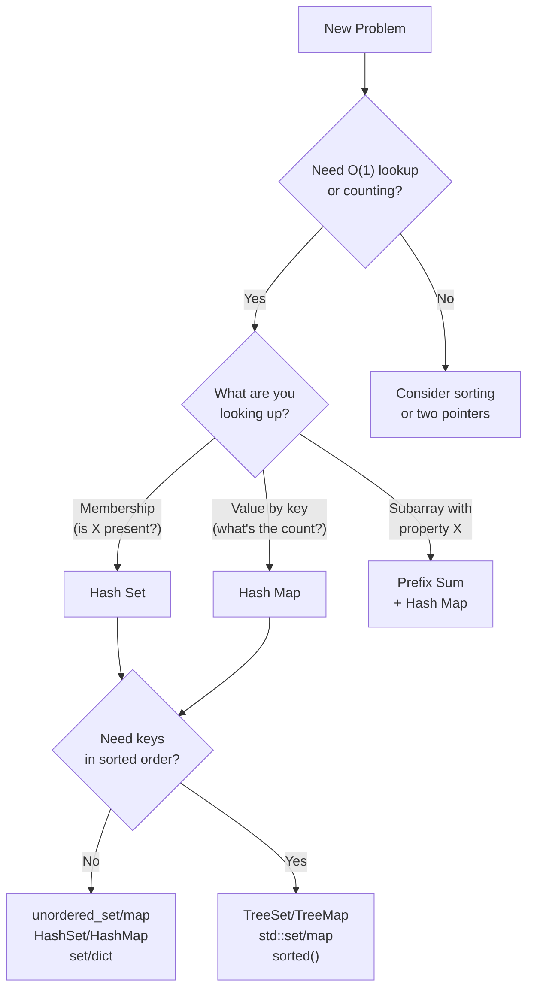
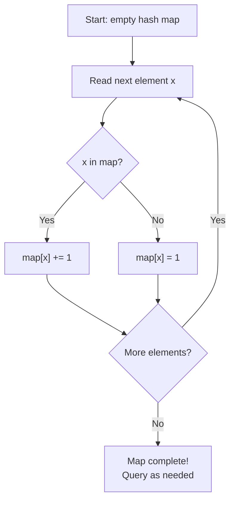

# Hashing — The Secret Decoder Ring

## Chapter Goals

By the end of this chapter, you will:

- Understand how hash tables turn any key into an array index for O(1) access
- Use hash sets for instant membership testing and deduplication
- Use hash maps for frequency counting, lookup tables, and the complement technique
- Solve anagram problems using character frequency maps and sorted-key grouping
- Master the prefix sum + hash map technique for subarray sum problems
- Know when hashing beats sorting, and when it doesn't
- Recognize hash collisions and understand their impact on performance

---

## The Story: "The Spy's Dictionary"

You're a spy who intercepts encoded messages. Each message contains code words that must be decoded using a secret codebook — a massive dictionary with thousands of entries.

At first, you flip through the codebook page by page looking for each code word. With 10,000 entries, this takes up to 10,000 checks per word. That's **linear search** — O(n). Way too slow when you're decoding hundreds of messages under time pressure.

So you organize the codebook alphabetically and use the phone-book trick: flip to the middle, compare, go left or right. Now each lookup takes about 14 checks (log₂ 10,000 ≈ 13.3). That's **binary search** — O(log n). Much better!

But then you have a brilliant idea. What if you build a **decoder ring** — a device that converts any code word into a page number INSTANTLY? Feed in "ALPHA-7" and the ring says "page 42." Feed in "BRAVO-3" and it says "page 187." No searching at all. That's a **hash function** — O(1).

There's one problem: sometimes two different code words map to the same page. "ALPHA-7" and "DELTA-9" both point to page 42. That's a **collision**, and you need a strategy to handle it. But even with occasional collisions, your decoder ring is astronomically faster than flipping through pages.

Today, you build your own decoder ring.

---

## Johari Window: Before

Before diving in, take 5 minutes to fill out the **"Before"** section of your [Johari Window worksheet](johari.md).


Be honest with yourself! Knowing what you *don't* know is the first step to learning it. There are no wrong answers — only honest ones.


---

## Discovery

Before we explain hashing formally, try these puzzles:

### Puzzle 1: "The Library Lookup"

You manage a library with 1,000,000 books. A customer asks: "Do you have *Harry Potter and the Sorcerer's Stone*?"

**Option A**: Search through all books one by one. Worst case: 1,000,000 checks. (O(n))

**Option B**: Keep books sorted by title, use binary search. About 20 checks. (O(log n))

**Option C**: Use a "magic card catalog" where you feed in the title and INSTANTLY get "Yes" or "No." Just 1 check. (O(1))

Option C sounds impossible — how can you check membership in constant time regardless of how many books you have? What data structure gives you this power?


The answer is a **hash set**. It uses a hash function to convert the book title into an array index, then checks that single position. You'll learn exactly how this works in section 11.1.


### Puzzle 2: "The Word Counter"

Count how many times each word appears in: *"the cat sat on the mat the cat"*

You could use nested loops — for each word, scan the whole sentence and count matches. But that's O(n²).

What if you had a magic box: put in a word, instantly get back its current count? You could walk through the sentence once, and for each word, increment its count. One pass — O(n).

What data structure IS this magic box?


The answer is a **hash map** (dictionary). It maps each word (key) to its count (value). `{"the": 3, "cat": 2, "sat": 1, "on": 1, "mat": 1}`. You'll build this in section 11.3.


---

## 11.1 What Is Hashing?

**Hashing** is a technique that converts any key (number, string, object) into an array index using a **hash function**.

The idea: instead of searching for where a key lives, we COMPUTE where it lives. If your array has size `m`, and your hash function is `h(key)`, then the key goes into `array[h(key) % m]`.

### How It Works (Simplified)

Imagine a tiny hash table with 5 buckets (indices 0-4):

```
Hash function: h(key) = key % 5

Insert 7:  h(7)  = 7 % 5  = 2  → bucket[2] = 7
Insert 13: h(13) = 13 % 5 = 3  → bucket[3] = 13
Insert 22: h(22) = 22 % 5 = 2  → bucket[2] = ?? COLLISION with 7!
```

When two keys hash to the same bucket, that's a **collision**. Two common strategies:

1. **Chaining**: Each bucket holds a linked list. Colliding keys share the bucket.
2. **Open addressing**: If the bucket is full, probe the next empty bucket.

### The Big-O Promise

| Operation | Average | Worst (many collisions) |
|-----------|---------|------------------------|
| Insert    | O(1)    | O(n)                   |
| Lookup    | O(1)    | O(n)                   |
| Delete    | O(1)    | O(n)                   |

The "average O(1)" relies on a good hash function that spreads keys evenly. In practice, built-in hash containers (Python `dict`, Java `HashMap`, C++ `unordered_map`) use well-designed hash functions, so O(1) is what you'll experience 99.9% of the time.


**You don't need to implement a hash table from scratch.** Every language provides excellent built-in hash containers. Your job is to know WHEN to use them and HOW to apply the patterns.


---

## 11.2 Hash Sets — The Membership Oracle

A **hash set** stores unique elements and answers "is X in the set?" in O(1).



```python
# Creating a set
seen = set()

# Adding elements
seen.add(5)
seen.add(10)
seen.add(5)       # Duplicate — ignored!
print(seen)       # {10, 5} (order not guaranteed)

# Membership test — O(1)!
print(10 in seen)  # True
print(7 in seen)   # False

# Remove
seen.discard(10)   # Safe remove (no error if missing)
# seen.remove(10)  # Throws KeyError if missing

# Set operations
a = {1, 2, 3, 4}
b = {3, 4, 5, 6}
print(a | b)   # Union: {1, 2, 3, 4, 5, 6}
print(a & b)   # Intersection: {3, 4}
print(a - b)   # Difference: {1, 2}
```


```java
// Creating a set
Set<Integer> seen = new HashSet<>();

// Adding elements
seen.add(5);
seen.add(10);
seen.add(5);       // Duplicate — ignored!
System.out.println(seen);  // [5, 10] (order varies)

// Membership test — O(1)!
System.out.println(seen.contains(10));  // true
System.out.println(seen.contains(7));   // false

// Remove
seen.remove(10);

// Set operations (manual in Java)
Set<Integer> a = new HashSet<>(Arrays.asList(1, 2, 3, 4));
Set<Integer> b = new HashSet<>(Arrays.asList(3, 4, 5, 6));

Set<Integer> union = new HashSet<>(a);
union.addAll(b);              // {1, 2, 3, 4, 5, 6}

Set<Integer> intersection = new HashSet<>(a);
intersection.retainAll(b);    // {3, 4}

Set<Integer> difference = new HashSet<>(a);
difference.removeAll(b);      // {1, 2}
```


```cpp
#include <unordered_set>
#include <iostream>
using namespace std;

// Creating a set
unordered_set<int> seen;

// Adding elements
seen.insert(5);
seen.insert(10);
seen.insert(5);       // Duplicate — ignored!

// Membership test — O(1)!
cout << (seen.count(10) ? "true" : "false") << endl;  // true
cout << (seen.count(7) ? "true" : "false") << endl;   // false

// Remove
seen.erase(10);

// Set operations (manual in C++)
unordered_set<int> a = {1, 2, 3, 4};
unordered_set<int> b = {3, 4, 5, 6};
// Union: insert all of b into a copy
// Intersection: check a.count(x) for each x in b
```



> **Language Spotlight: Hash Sets**
> | | Python | Java | C++ |
> |---|--------|------|-----|
> | Type | `set` | `HashSet<T>` | `unordered_set<T>` |
> | Add | `s.add(x)` | `s.add(x)` | `s.insert(x)` |
> | Contains | `x in s` | `s.contains(x)` | `s.count(x) > 0` |
> | Remove | `s.discard(x)` | `s.remove(x)` | `s.erase(x)` |
> | Size | `len(s)` | `s.size()` | `s.size()` |

### When to Use Hash Sets

- **Deduplication**: Remove duplicates from a collection
- **Membership testing**: "Have I seen this element before?"
- **Set operations**: Union, intersection, difference of two collections

---

## 11.3 Hash Maps — The Key-Value Superpower

A **hash map** (dictionary) stores key-value pairs and supports O(1) lookup by key.



```python
# Creating a map
freq = {}

# Building a frequency map
nums = [1, 2, 2, 3, 3, 3]
for x in nums:
    freq[x] = freq.get(x, 0) + 1
# freq = {1: 1, 2: 2, 3: 3}

# Lookup — O(1)
print(freq[3])          # 3
print(freq.get(99, 0))  # 0 (safe: returns default if missing)

# Iteration
for key, value in freq.items():
    print(f"{key} appears {value} times")

# Check if key exists
if 2 in freq:
    print("2 is in the map")
```


```java
// Creating a map
Map<Integer, Integer> freq = new HashMap<>();

// Building a frequency map
int[] nums = {1, 2, 2, 3, 3, 3};
for (int x : nums) {
    freq.put(x, freq.getOrDefault(x, 0) + 1);
}
// freq = {1=1, 2=2, 3=3}

// Lookup — O(1)
System.out.println(freq.get(3));              // 3
System.out.println(freq.getOrDefault(99, 0)); // 0 (safe)

// Iteration
for (Map.Entry<Integer, Integer> e : freq.entrySet()) {
    System.out.println(e.getKey() + " appears " + e.getValue() + " times");
}

// Check if key exists
if (freq.containsKey(2)) {
    System.out.println("2 is in the map");
}
```


```cpp
#include <unordered_map>
#include <vector>
#include <iostream>
using namespace std;

// Creating a map
unordered_map<int, int> freq;

// Building a frequency map
vector<int> nums = {1, 2, 2, 3, 3, 3};
for (int x : nums) {
    freq[x]++;     // [] auto-creates entry with value 0, then increments
}
// freq = {1: 1, 2: 2, 3: 3}

// Lookup — O(1)
cout << freq[3] << endl;        // 3
// WARNING: freq[99] creates entry with value 0!
// Use .count() or .find() for safe lookup:
cout << (freq.count(99) ? freq[99] : 0) << endl;

// Iteration
for (auto& [key, value] : freq) {
    cout << key << " appears " << value << " times" << endl;
}

// Check if key exists
if (freq.count(2)) {
    cout << "2 is in the map" << endl;
}
```



> **Language Spotlight: Hash Maps**
> | | Python | Java | C++ |
> |---|--------|------|-----|
> | Type | `dict` | `HashMap<K,V>` | `unordered_map<K,V>` |
> | Set | `d[k] = v` | `m.put(k, v)` | `m[k] = v` |
> | Get | `d.get(k, default)` | `m.getOrDefault(k, def)` | `m[k]` (auto-creates!) |
> | Contains | `k in d` | `m.containsKey(k)` | `m.count(k) > 0` |
> | Delete | `del d[k]` | `m.remove(k)` | `m.erase(k)` |
>
> **Gotcha**: C++ `m[key]` silently creates the entry with a default value (0 for int) if the key doesn't exist! Use `m.count(key)` to check first.

---

## 11.4 Common Hashing Patterns

Three patterns appear over and over in hash-based problems:

### Pattern 1: Frequency Counting

Walk through data once, counting occurrences with a hash map.

```
Input:  [3, 1, 2, 1, 3, 1]
Map:    {3: 2, 1: 3, 2: 1}
```

Use cases: Find most/least frequent, check if all elements unique, anagram detection.

### Pattern 2: The Complement Technique

To find two elements that satisfy a condition (like summing to a target), use a hash map to check if the "complement" exists.



```python
def two_sum(nums, target):
    """Find indices of two numbers that sum to target."""
    seen = {}  # value -> index
    for i, x in enumerate(nums):
        complement = target - x
        if complement in seen:
            return [seen[complement], i]
        seen[x] = i
    return [-1, -1]

# [2, 7, 11, 15], target=9
# i=0: complement=7, seen={2:0}
# i=1: complement=2, 2 in seen! → [0, 1]
```


```java
static int[] twoSum(int[] nums, int target) {
    Map<Integer, Integer> seen = new HashMap<>(); // value -> index
    for (int i = 0; i < nums.length; i++) {
        int complement = target - nums[i];
        if (seen.containsKey(complement)) {
            return new int[]{seen.get(complement), i};
        }
        seen.put(nums[i], i);
    }
    return new int[]{-1, -1};
}
```


```cpp
vector<int> twoSum(vector<int>& nums, int target) {
    unordered_map<int, int> seen; // value -> index
    for (int i = 0; i < (int)nums.size(); i++) {
        int complement = target - nums[i];
        if (seen.count(complement)) {
            return {seen[complement], i};
        }
        seen[nums[i]] = i;
    }
    return {-1, -1};
}
```



The complement technique turns O(n²) pair-finding into O(n). For each element, instead of scanning all others, we ask: "Have I already seen my partner?"

### Pattern 3: Two-Pass (Build Map, Then Query)

First pass: build a hash map of useful information.
Second pass: use the map to answer queries.

```
Problem: Find the first non-repeating character in a string.

Pass 1: Build frequency map    "aabbcdd" → {a:2, b:2, c:1, d:2}
Pass 2: Scan string again      'a'→2, 'a'→2, 'b'→2, 'b'→2, 'c'→1 → FOUND!

Answer: 'c'
```

---

## 11.5 Anagrams & String Hashing

Two strings are **anagrams** if they contain the same characters with the same frequencies, just rearranged. "listen" and "silent" are anagrams.

### Checking Anagrams: Frequency Map



```python
def are_anagrams(s1, s2):
    if len(s1) != len(s2):
        return False
    freq = {}
    for c in s1:
        freq[c] = freq.get(c, 0) + 1
    for c in s2:
        freq[c] = freq.get(c, 0) - 1
    return all(v == 0 for v in freq.values())
```


```java
static boolean areAnagrams(String s1, String s2) {
    if (s1.length() != s2.length()) return false;
    Map<Character, Integer> freq = new HashMap<>();
    for (char c : s1.toCharArray())
        freq.put(c, freq.getOrDefault(c, 0) + 1);
    for (char c : s2.toCharArray())
        freq.put(c, freq.getOrDefault(c, 0) - 1);
    return freq.values().stream().allMatch(v -> v == 0);
}
```


```cpp
bool areAnagrams(string s1, string s2) {
    if (s1.size() != s2.size()) return false;
    unordered_map<char, int> freq;
    for (char c : s1) freq[c]++;
    for (char c : s2) freq[c]--;
    for (auto& [k, v] : freq)
        if (v != 0) return false;
    return true;
}
```



### Grouping Anagrams: Sorted-Key Technique

To group words that are anagrams of each other, use a hash map where the KEY is the sorted version of the word:

```
"eat" → sorted → "aet"
"tea" → sorted → "aet"    ← same key!
"tan" → sorted → "ant"
"bat" → sorted → "abt"

Map: {"aet": ["eat","tea","ate"], "ant": ["tan","nat"], "abt": ["bat"]}
```



```python
from collections import defaultdict

def group_anagrams(strs):
    groups = defaultdict(list)
    for s in strs:
        key = tuple(sorted(s))  # tuple because lists aren't hashable!
        groups[key].append(s)
    return list(groups.values())
```


```java
static List<List<String>> groupAnagrams(String[] strs) {
    Map<String, List<String>> groups = new HashMap<>();
    for (String s : strs) {
        char[] chars = s.toCharArray();
        Arrays.sort(chars);
        String key = new String(chars);
        groups.computeIfAbsent(key, k -> new ArrayList<>()).add(s);
    }
    return new ArrayList<>(groups.values());
}
```


```cpp
vector<vector<string>> groupAnagrams(vector<string>& strs) {
    unordered_map<string, vector<string>> groups;
    for (auto& s : strs) {
        string key = s;
        sort(key.begin(), key.end());
        groups[key].push_back(s);
    }
    vector<vector<string>> result;
    for (auto& [k, v] : groups)
        result.push_back(v);
    return result;
}
```




**Why `tuple(sorted(s))` in Python?** Lists are mutable and can't be dictionary keys (they're not "hashable"). Tuples are immutable and CAN be keys. So we sort the characters into a list, then convert to a tuple for the key.


---

## 11.6 Prefix Sum + Hash Map

This powerful technique solves subarray problems in O(n). It combines two ideas:

1. **Prefix sum**: `prefix[i]` = sum of elements from index 0 to i
2. **Key insight**: The sum of subarray `[i+1..j]` = `prefix[j] - prefix[i]`

So if we want a subarray with sum = K, we need: `prefix[j] - prefix[i] = K`, which means `prefix[i] = prefix[j] - K`.

For each position j, we check: "Have I seen a prefix sum equal to `prefix[j] - K`?" That's a hash map lookup!

### Example: Count Subarrays with Sum K



```python
def count_subarrays(nums, k):
    """Count subarrays whose sum equals k."""
    prefix_count = {0: 1}  # prefix_sum -> count of times seen
    current_sum = 0
    count = 0

    for x in nums:
        current_sum += x
        # How many previous prefix sums equal current_sum - k?
        complement = current_sum - k
        count += prefix_count.get(complement, 0)
        # Record this prefix sum
        prefix_count[current_sum] = prefix_count.get(current_sum, 0) + 1

    return count

# nums = [1, 1, 1], k = 2
# Step 0: prefix_count = {0: 1}, sum = 0
# Step 1: sum = 1, complement = -1, count += 0, prefix_count = {0:1, 1:1}
# Step 2: sum = 2, complement = 0, count += 1, prefix_count = {0:1, 1:1, 2:1}
# Step 3: sum = 3, complement = 1, count += 1, prefix_count = {0:1, 1:1, 2:1, 3:1}
# Answer: 2 (subarrays [1,1] at indices 0-1 and 1-2)
```


```java
static int countSubarrays(int[] nums, int k) {
    Map<Integer, Integer> prefixCount = new HashMap<>();
    prefixCount.put(0, 1);  // empty prefix has sum 0
    int currentSum = 0, count = 0;

    for (int x : nums) {
        currentSum += x;
        int complement = currentSum - k;
        count += prefixCount.getOrDefault(complement, 0);
        prefixCount.put(currentSum, prefixCount.getOrDefault(currentSum, 0) + 1);
    }
    return count;
}
```


```cpp
int countSubarrays(vector<int>& nums, int k) {
    unordered_map<int, int> prefixCount;
    prefixCount[0] = 1;  // empty prefix has sum 0
    int currentSum = 0, count = 0;

    for (int x : nums) {
        currentSum += x;
        int complement = currentSum - k;
        if (prefixCount.count(complement))
            count += prefixCount[complement];
        prefixCount[currentSum]++;
    }
    return count;
}
```




**Why initialize with `{0: 1}`?** This handles subarrays that start from index 0. If `prefix[j] == k`, then the complement is `k - k = 0`, and we need to know that the "empty prefix" with sum 0 exists once.


> **Language Spotlight: Prefix Sum + Hash Map**
> | | Python | Java | C++ |
> |---|--------|------|-----|
> | Init map | `{0: 1}` | `map.put(0, 1)` | `map[0] = 1` |
> | Get or default | `.get(key, 0)` | `.getOrDefault(key, 0)` | `map.count(key) ? map[key] : 0` |
> | Increment | `d[k] = d.get(k,0)+1` | `m.put(k, m.getOrDefault(k,0)+1)` | `m[k]++` (auto-creates!) |

---

## 11.7 Collisions & When Hashing Fails

### When O(1) Becomes O(n)

If all keys hash to the same bucket, every lookup degrades to scanning a linked list — O(n). This can happen with:
- A terrible hash function (e.g., `h(key) = 0` for all keys)
- **Adversarial inputs** designed to cause collisions (relevant in competitive programming)

### Ordered Alternatives

When you need guaranteed O(log n) or need keys in sorted order:

| | Hash Container | Ordered Container |
|---|---|---|
| **Python** | `dict`, `set` | N/A (use `sorted()`) |
| **Java** | `HashMap`, `HashSet` | `TreeMap`, `TreeSet` |
| **C++** | `unordered_map`, `unordered_set` | `map`, `set` |
| **Avg lookup** | O(1) | O(log n) |
| **Worst lookup** | O(n) | O(log n) |
| **Keys sorted?** | No | Yes |

### When to Choose What

- **Default choice**: Hash container (O(1) average is hard to beat)
- **Need sorted order**: Ordered container (or hash + sort at the end)
- **Worried about adversarial inputs** (competitive programming): C++ `map` or `unordered_map` with custom hash
- **Need both fast lookup AND sorted iteration**: Use both (hash map for lookup, separate sorted structure for iteration)

---

## Think Like a Pro


**Tourist** (Gennady Korotkevich): "When I see 'find if X exists' or 'count occurrences of X,' my first instinct is hash map. It's O(1) per query after O(n) preprocessing. I don't even consider linear search anymore — it's just an automatic reflex."

*Why this works*: Most "find/count/check" problems are secretly asking "have we seen this before?" — and hash maps answer that in O(1).



**Errichto**: "The prefix sum + hash map combo solves almost every 'count subarrays with property X' problem. Maintain a running sum, check if the complement exists in your map. It's a two-line pattern — learn it cold, and you'll solve an entire category of Silver problems instantly."

*Why this works*: Any subarray sum can be expressed as the difference of two prefix sums, turning a range problem into a point-lookup problem.


---

## Flowcharts

### Thinking Flowchart: "Should I Use Hashing?"



### Implementation Flowchart: "Frequency Counting Pattern"



---

## AOPS Showcase: "Missing Number" — Four Ways

Given an array of `n` distinct numbers from the range `[0, n]`, find the one that's missing.

Example: `[3, 0, 1]` → missing `2` (range is 0-3, but only 0,1,3 present)

### Approach 1: Sort and Scan — O(n log n) time, O(1) space

Sort the array, then scan for the first gap.



```python
def solve_sort(nums):
    nums_sorted = sorted(nums)
    for i in range(len(nums_sorted)):
        if nums_sorted[i] != i:
            return i
    return len(nums_sorted)
```


```java
static int solveSort(int[] nums) {
    int[] sorted = nums.clone();
    Arrays.sort(sorted);
    for (int i = 0; i < sorted.length; i++) {
        if (sorted[i] != i) return i;
    }
    return sorted.length;
}
```


```cpp
int solve_sort(vector<int> nums) {
    sort(nums.begin(), nums.end());
    for (int i = 0; i < (int)nums.size(); i++) {
        if (nums[i] != i) return i;
    }
    return (int)nums.size();
}
```



### Approach 2: XOR — O(n) time, O(1) space

XOR has a magic property: `a ^ a = 0` and `a ^ 0 = a`. XOR all numbers 0..n with all array elements — everything cancels except the missing number!



```python
def solve_xor(nums):
    n = len(nums)
    xor_all = 0
    for i in range(n + 1):
        xor_all ^= i
    for x in nums:
        xor_all ^= x
    return xor_all
```


```java
static int solveXor(int[] nums) {
    int n = nums.length;
    int xorAll = 0;
    for (int i = 0; i <= n; i++) xorAll ^= i;
    for (int x : nums) xorAll ^= x;
    return xorAll;
}
```


```cpp
int solve_xor(vector<int>& nums) {
    int n = nums.size();
    int xorAll = 0;
    for (int i = 0; i <= n; i++) xorAll ^= i;
    for (int x : nums) xorAll ^= x;
    return xorAll;
}
```



### Approach 3: Math (Gauss's Formula) — O(n) time, O(1) space

Sum of 0..n = `n*(n+1)/2`. Subtract actual sum of array.



```python
def solve_math(nums):
    n = len(nums)
    expected = n * (n + 1) // 2
    return expected - sum(nums)
```


```java
static int solveMath(int[] nums) {
    int n = nums.length;
    int expected = n * (n + 1) / 2;
    int actual = 0;
    for (int x : nums) actual += x;
    return expected - actual;
}
```


```cpp
int solve_math(vector<int>& nums) {
    int n = nums.size();
    int expected = n * (n + 1) / 2;
    int actual = 0;
    for (int x : nums) actual += x;
    return expected - actual;
}
```



### Approach 4: Hash Set — O(n) time, O(n) space

Insert all elements into a set, then check 0..n for the missing one.



```python
def solve_hash(nums):
    num_set = set(nums)
    for i in range(len(nums) + 1):
        if i not in num_set:
            return i
```


```java
static int solveHash(int[] nums) {
    Set<Integer> numSet = new HashSet<>();
    for (int x : nums) numSet.add(x);
    for (int i = 0; i <= nums.length; i++) {
        if (!numSet.contains(i)) return i;
    }
    return -1; // unreachable
}
```


```cpp
int solve_hash(vector<int>& nums) {
    unordered_set<int> numSet(nums.begin(), nums.end());
    for (int i = 0; i <= (int)nums.size(); i++) {
        if (!numSet.count(i)) return i;
    }
    return -1; // unreachable
}
```



### Comparison Table

| Approach | Time | Space | Idea |
|----------|------|-------|------|
| Sort + Scan | O(n log n) | O(1)* | Sort first, find the gap |
| XOR | O(n) | O(1) | Pairs cancel, missing remains |
| Math | O(n) | O(1) | Expected sum - actual sum |
| Hash Set | O(n) | O(n) | Check membership 0..n |

*O(1) extra space if sorting in-place.


**Which is "best"?** Math and XOR are both O(n) time, O(1) space — optimal. Math is simpler to understand; XOR is a bit-manipulation classic (more in Ch 12). Hash set is the most intuitive but uses O(n) extra space. Sort is the "brute force" approach that's easy to think of.

In competitive programming, you'd use math or XOR. In an interview, showing multiple approaches demonstrates depth.


---

## Legend's Corner


**Benq** (Benjamin Qi) — youngest USACO Platinum qualifier and multiple-time IOI medalist. "In USACO, I rarely need to implement a hash function myself — I just use `unordered_map`. The real skill isn't knowing HOW hashing works internally, it's recognizing WHEN to use it. Any time I need O(1) lookups or frequency counting, I reach for a hash container automatically. It's become a reflex."

**What you can learn**: Don't get bogged down in hash function internals. Focus on the PATTERNS: frequency counting, complement technique, prefix sum + hash map. These three patterns solve 80% of hashing problems.


---

## Gotchas


**Gotcha 1: Hash maps are UNORDERED!**

Don't rely on iteration order. Python 3.7+ dicts preserve insertion order (language guarantee), but Java `HashMap` and C++ `unordered_map` do NOT. If you need ordered keys, use `TreeMap` (Java) or `map` (C++) — or sort the keys yourself.



**Gotcha 2: Unhashable keys in Python**

Python `list` objects can't be dictionary keys because they're mutable (and thus "unhashable"). Use `tuple` instead:
```python
# WRONG: freq[sorted(word)] — sorted() returns a list!
# RIGHT: freq[tuple(sorted(word))]
```



**Gotcha 3: C++ `[]` auto-creates entries!**

In C++, `map[key]` silently creates a default entry if the key doesn't exist:
```cpp
unordered_map<int, int> m;
cout << m[5];  // Prints 0, BUT also inserts {5: 0} into the map!
// Use m.count(5) to check existence without side effects
```



**Gotcha 4: Java HashMap returns null for missing keys**

```java
Map<String, Integer> m = new HashMap<>();
int val = m.get("missing");  // NullPointerException! (auto-unboxing null)
// Use getOrDefault:
int val = m.getOrDefault("missing", 0);  // Safe: returns 0
```



**Gotcha 5: Hash collisions degrade performance**

In competitive programming, adversarial test cases can cause O(n) per operation with `unordered_map` in C++. Defenses:
- Use `map` (O(log n) guaranteed) for safety
- Use a custom hash function with `unordered_map`
- In Python/Java, built-in hash functions are generally collision-resistant



**Gotcha 6: Prefix sum map initialization**

When using prefix sum + hash map, you MUST initialize the map with `{0: 1}`:
```python
# WRONG: prefix_count = {}
# RIGHT: prefix_count = {0: 1}
```
Without this, you'll miss subarrays that start from index 0!


---

## Practice Problems

| # | Name | Difficulty | Key Concept |
|---|------|-----------|-------------|
| W1 | Frequency Count | ⭐ | Build frequency map |
| W2 | Highest and Lowest Frequency | ⭐ | Find max/min frequency elements |
| W3 | First Non-Repeating Character | ⭐ | Two-pass pattern on strings |
| W4 | Valid Anagram | ⭐ | Frequency comparison |
| W5 | Intersection of Two Arrays | ⭐ | Hash set intersection |
| P1 | Group Anagrams | ⭐⭐ | Sorted-key grouping |
| P2 | Missing Number | ⭐⭐ | Hash set membership |
| P3 | Longest Subarray with Sum K | ⭐⭐ | Prefix sum + hash map |
| P4 | Count Subarrays with Sum K | ⭐⭐ | Prefix sum + frequency map |
| P5 | Sort Characters by Frequency | ⭐⭐ | Frequency map + custom sort |
| C1 | Missing Number Four Ways | ⭐⭐⭐ | AOPS: sort/XOR/math/hash |
| C2 | Longest Consecutive Sequence | ⭐⭐⭐ | O(n) hash set technique |
| C3 | Repeating and Missing Number | ⭐⭐⭐ | Hash set for duplicates |

---

## Language Idioms



```python
# ── Frequency counting shortcuts ──
from collections import Counter
freq = Counter([1, 2, 2, 3, 3, 3])  # Counter({3: 3, 2: 2, 1: 1})
# NOTE: Implement manually in practice problems!

# ── defaultdict avoids KeyError ──
from collections import defaultdict
groups = defaultdict(list)
groups["key"].append("value")  # No KeyError even if "key" is new

# ── Dictionary comprehension ──
squares = {x: x**2 for x in range(10)}

# ── Set comprehension ──
evens = {x for x in range(20) if x % 2 == 0}

# ── Counting with get() ──
freq = {}
for x in data:
    freq[x] = freq.get(x, 0) + 1  # Manual Counter
```


```java
// ── getOrDefault — the safe way ──
Map<Integer, Integer> freq = new HashMap<>();
freq.put(key, freq.getOrDefault(key, 0) + 1);

// ── computeIfAbsent — for nested collections ──
Map<String, List<String>> groups = new HashMap<>();
groups.computeIfAbsent(key, k -> new ArrayList<>()).add(value);

// ── Iterating entries ──
for (var entry : map.entrySet()) {
    System.out.println(entry.getKey() + " -> " + entry.getValue());
}

// ── TreeMap for sorted keys ──
Map<Integer, Integer> sorted = new TreeMap<>(freq);
// Keys are now in natural order

// ── Stream-based frequency counting ──
// Advanced — don't worry about this yet:
// Map<Integer, Long> freq = Arrays.stream(nums)
//     .boxed().collect(Collectors.groupingBy(x -> x, Collectors.counting()));
```


```cpp
// ── [] operator auto-creates (useful but careful!) ──
unordered_map<int, int> freq;
for (int x : nums) freq[x]++;  // Cleanest frequency counting

// ── Structured bindings (C++17) ──
for (auto& [key, value] : freq) {
    cout << key << ": " << value << endl;
}

// ── map for sorted keys ──
map<int, int> sorted_freq(freq.begin(), freq.end());
// Keys now in sorted order

// ── Checking existence WITHOUT creating entry ──
if (freq.count(key)) { /* key exists */ }
// NOT: if (freq[key]) — this creates the entry!

// ── Custom hash for unordered_map with pairs ──
// struct PairHash {
//     size_t operator()(const pair<int,int>& p) const {
//         return hash<int>()(p.first) ^ (hash<int>()(p.second) << 32);
//     }
// };
// unordered_map<pair<int,int>, int, PairHash> m;
```



---

## Breadcrumbs

### Looking Back
- **Ch 5** introduced sets and maps as "magic boxes" — now you know the magic is called **hashing**
- **Ch 6** promised O(1) lookup exists — now you've seen HOW (hash function → array index)
- **Ch 7** solved Two Sum with a hash map (the complement technique) — now you understand WHY it's O(n)
- **Ch 9** compared O(n) linear search with O(log n) binary search — now you have O(1) hashing as the ultimate speedup
- **Ch 10** used dictionaries for memoization — that's a hash map caching function results

### Looking Forward
- **Ch 12** (Bit Manipulation): The XOR trick from the Missing Number showcase gets a deep dive
- **Ch 13** (Bronze Battle Plan): Hash-based pruning makes backtracking faster
- **Ch 14** (Prefix Sums): The prefix sum technique from §11.6 becomes a full chapter
- **Ch 15** (Two Pointers & Sliding Window): Sliding window + hash map for substring problems
- **Ch 22** (Stacks & Queues): LRU Cache = hash map + doubly-linked list
- **Ch 32** (String Algorithms): Rolling hash enables O(1) substring fingerprinting

### Cross-Chapter Threads
- **"Trade space for time"**: Hash containers use O(n) memory to achieve O(1) lookups — the quintessential space-time trade-off. This thread started in Ch 6 (concept), appeared in Ch 10 (memoization), and is now the CORE topic.
- **"Sort first, think later"**: Sorting is ONE approach (Missing Number Approach 1), but hashing often gives the same result in O(n) instead of O(n log n). Sometimes sorting is overkill — hashing is the right tool.
- **"Reduce to known"**: Subarray sum problems REDUCE TO prefix sum complement lookups in a hash map. The "reduce" thread grows.

---

## Johari Window: After

Now fill out the **"After"** section of your [Johari Window worksheet](johari.md). Compare your "Before" and "After" answers — what surprised you? What do you still want to explore?

---

## Open Questions Beyond

1. **"We used Python dicts and Java HashMaps. But HOW does the hash function actually work? How do you convert the string 'hello' into a number?"** Hint: one common method multiplies each character's ASCII value by powers of a prime number. This is called **polynomial hashing** — and it's the foundation of string algorithms in Ch 32.

2. **"Hash maps give O(1) average lookup. But what if we need keys in sorted order AND fast lookup? Is there a data structure that gives O(log n) for insert, delete, AND lookup, while keeping everything sorted?"** That's a **balanced binary search tree** — coming in Ch 26 (Trees). Java's `TreeMap` and C++'s `map` are exactly this.

3. **"We hashed integers and strings. Can we hash an entire subarray to get a 'fingerprint'? If the window slides by one position, can we update the hash in O(1)?"** Yes! That's called a **rolling hash**, and it's the basis of the Rabin-Karp string matching algorithm (Ch 32).

---

## What's Next

You've unlocked the secret decoder ring — the ability to look up, count, and match data in O(1). Hash maps and sets are tools you'll use in nearly every chapter from here on.

But there's another language computers speak natively that most programmers never learn: **binary**. In Ch 12 (**Bit Manipulation — The Language of Computers**), you'll discover how representing data as sequences of 0s and 1s unlocks tricks that seem like magic — like finding a missing number with XOR (you saw a preview in this chapter's AOPS showcase), swapping two numbers without a temporary variable, and representing entire subsets as single integers.

The XOR technique from Challenge 1 is just the beginning. Get ready to think in bits!
