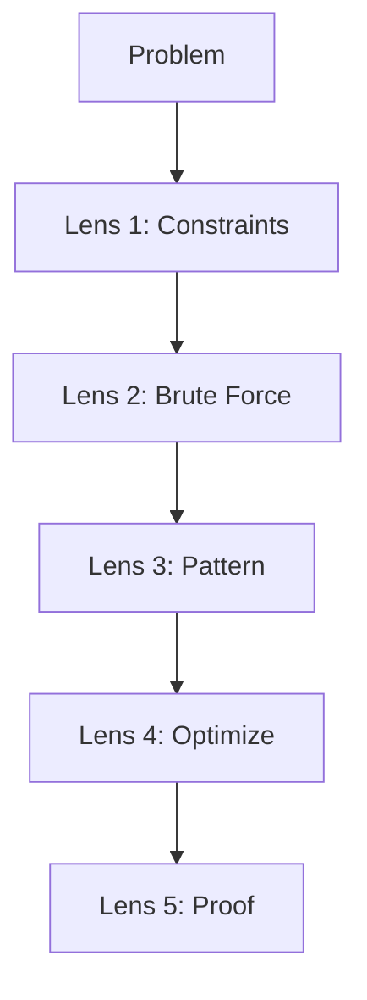
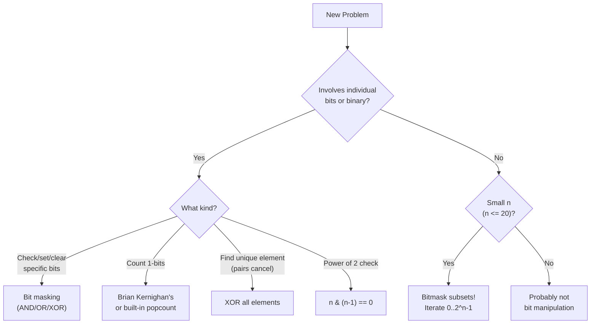
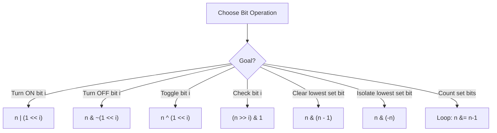

# Bit Manipulation — The Language of Computers

## Chapter Goals

By the end of this chapter, you will:

- Understand how computers represent numbers in binary (base 2)
- Use all six bitwise operators (AND, OR, XOR, NOT, left shift, right shift) fluently
- Check whether the i-th bit of a number is set (1) or unset (0)
- Determine if a number is a power of 2 using a single bit trick
- Count the number of set bits using Brian Kernighan's algorithm
- Apply XOR tricks: swap without a temp variable, find the unique element, find two odd-occurring numbers
- Represent subsets as bitmasks (integers) and enumerate all subsets of a set
- Recognize when bit manipulation leads to elegant O(n) time, O(1) space solutions

---

## The Story: "The Secret Agent's Code"

You're a secret agent. Your mission: communicate with headquarters using only a flashlight. On means 1. Off means 0. That's it — just flashes of light.

At first, it seems impossible. How can you send a message like "MEET AT DAWN" using only on and off? But then your handler teaches you the system: every letter, every number, every instruction can be encoded as a sequence of 1s and 0s. The letter 'A' is `01000001`. The number 42 is `00101010`. Even the command "ABORT MISSION" is just a long sequence of bits.

This isn't fiction. It's literally how every computer on Earth works. Your laptop, your phone, the servers running this website — they all think in binary. Every number you've ever used in a program is secretly stored as a pattern of 1s and 0s. Every operation you've ever performed — addition, comparison, even printing "Hello World" — ultimately happens through bit-level operations.

Most programmers never learn to speak this language directly. They let the computer translate between human numbers (like 42) and binary (like `101010`). But the programmers who DO learn bit manipulation gain superpowers: they can solve certain problems in O(1) space that others need O(n) for, check properties of numbers with a single operation instead of a loop, and represent entire sets as single integers.

Today, you learn to speak the computer's native language.

---

## Johari Window: Before

Before diving in, take 5 minutes to fill out the **"Before"** section of your [Johari Window worksheet](johari.md).


Be honest with yourself! Knowing what you *don't* know is the first step to learning it. There are no wrong answers — only honest ones.


---

## Discovery

Before we dive into the theory, try these puzzles using what you already know:

### Puzzle 1: "The Light Switch"

You have 8 light switches, each either ON (1) or OFF (0). The current state is: `10110100`.

Your friend tells you to "flip switch 3" (counting from the right, starting at 0). What's the new state?

What about "turn ON switch 0" (make sure it's 1, regardless of current state)? And "turn OFF switch 5"?


These three operations — flip, turn on, turn off — correspond to the three most important bit operations: **XOR** (toggle), **OR** (set), and **AND with NOT** (clear). You'll learn the exact syntax in section 12.2.


### Puzzle 2: "The Odd One Out"

You have a bag of marbles. Every marble has a twin (same color) EXCEPT one — the unique marble. You dump them out: `[4, 1, 2, 1, 2]`.

Using a hash map (from Ch 11), you can find the unique one in O(n) time and O(n) space. But can you do it in O(n) time and **O(1) space** — without any extra data structure?


The magic word is **XOR**. When you XOR a number with itself, you get 0. When you XOR with 0, you get the number back. So if you XOR ALL the marbles together: `4 ^ 1 ^ 2 ^ 1 ^ 2 = 4 ^ (1 ^ 1) ^ (2 ^ 2) = 4 ^ 0 ^ 0 = 4`. The pairs cancel out, and only the unique marble survives! You'll master this in section 12.6.


### Puzzle 3: "The Power Question"

Which of these numbers are powers of 2?

`1, 2, 3, 4, 5, 6, 7, 8, 16, 24, 32, 64, 100, 128`

Now write them in binary:

```
1   = 00000001       YES (2^0)
2   = 00000010       YES (2^1)
3   = 00000011       No
4   = 00000100       YES (2^2)
8   = 00001000       YES (2^3)
16  = 00010000       YES (2^4)
32  = 00100000       YES (2^5)
64  = 01000000       YES (2^6)
128 = 10000000       YES (2^7)
```

Do you see the pattern? Every power of 2 has **exactly one bit set**. Can you think of a single operation that checks this instantly?


The trick: `n & (n - 1) == 0`. For `n = 8` (binary `1000`), `n - 1 = 7` (binary `0111`). AND them: `1000 & 0111 = 0000`. Zero! But for `n = 6` (binary `0110`), `n - 1 = 5` (binary `0101`). AND them: `0110 & 0101 = 0100`. Not zero. You'll prove this in section 12.4.


---

## 12.1 The Binary Number System

### How Computers Store Numbers

You count in **base 10** (decimal) because you have 10 fingers. Computers count in **base 2** (binary) because they have two states: electricity ON (1) or OFF (0).

In decimal, each position represents a power of 10:

```
  4   2   5  (decimal)
  |   |   |
  4x10^2 + 2x10^1 + 5x10^0
= 400 + 20 + 5
= 425
```

In binary, each position represents a power of 2:

```
  1   0   1   0   1   0  (binary)
  |   |   |   |   |   |
  1x2^5 + 0x2^4 + 1x2^3 + 0x2^2 + 1x2^1 + 0x2^0
= 32  +  0   +  8   +  0   +  2   +  0
= 42
```

So `101010` in binary = 42 in decimal. Each binary digit is called a **bit** (short for **b**inary dig**it**).

### Powers of 2 — Memorize These!

| Power | Value | Binary |
|-------|-------|--------|
| 2^0 | 1 | 1 |
| 2^1 | 2 | 10 |
| 2^2 | 4 | 100 |
| 2^3 | 8 | 1000 |
| 2^4 | 16 | 10000 |
| 2^5 | 32 | 100000 |
| 2^6 | 64 | 1000000 |
| 2^7 | 128 | 10000000 |
| 2^8 | 256 | 100000000 |
| 2^9 | 512 | 1000000000 |
| 2^10 | 1024 | 10000000000 |
| 2^20 | ~1 million | |
| 2^30 | ~1 billion | |

### Decimal to Binary Conversion

**Method: Repeated division by 2**

To convert 42 to binary, repeatedly divide by 2 and collect remainders:

```
42 / 2 = 21 remainder 0    <-- least significant bit (rightmost)
21 / 2 = 10 remainder 1
10 / 2 = 5  remainder 0
 5 / 2 = 2  remainder 1
 2 / 2 = 1  remainder 0
 1 / 2 = 0  remainder 1    <-- most significant bit (leftmost)

Read remainders bottom-to-top: 101010
```

So 42 in decimal = `101010` in binary.



```python
# Built-in conversion
print(bin(42))      # '0b101010' — the '0b' prefix means binary
print(bin(42)[2:])  # '101010' — strip the prefix

# Manual conversion (what you'll implement in W1!)
def to_binary(n):
    if n == 0:
        return "0"
    bits = []
    while n > 0:
        bits.append(str(n % 2))
        n //= 2
    return "".join(reversed(bits))

print(to_binary(42))  # '101010'
```


```java
// Built-in conversion
System.out.println(Integer.toBinaryString(42));  // "101010"

// Manual conversion
static String toBinary(int n) {
    if (n == 0) return "0";
    StringBuilder bits = new StringBuilder();
    while (n > 0) {
        bits.append(n % 2);
        n /= 2;
    }
    return bits.reverse().toString();
}
```


```cpp
#include <bitset>
#include <string>
#include <algorithm>
using namespace std;

// Built-in: bitset<N> shows exactly N bits
cout << bitset<8>(42) << endl;   // "00101010" (padded to 8 bits)

// Manual conversion
string toBinary(int n) {
    if (n == 0) return "0";
    string bits;
    while (n > 0) {
        bits += char('0' + n % 2);
        n /= 2;
    }
    reverse(bits.begin(), bits.end());
    return bits;
}
```



### Binary to Decimal Conversion

```
101010 (binary)
= 1x32 + 0x16 + 1x8 + 0x4 + 1x2 + 0x1
= 32 + 8 + 2
= 42
```



```python
print(int("101010", 2))  # 42 — parse string as base-2 number
```


```java
System.out.println(Integer.parseInt("101010", 2));  // 42
```


```cpp
cout << stoi("101010", nullptr, 2) << endl;  // 42
```



### How Many Bits?

| Type | Bits | Range |
|------|------|-------|
| Python `int` | **Unlimited!** | Any integer |
| Java `int` | 32 | -2,147,483,648 to 2,147,483,647 |
| Java `long` | 64 | About -9.2 x 10^18 to 9.2 x 10^18 |
| C++ `int` | 32 | Same as Java `int` |
| C++ `long long` | 64 | Same as Java `long` |


**Python is special!** Python integers have unlimited precision — they grow as big as needed. Java and C++ integers have fixed sizes (32 or 64 bits), which means they can overflow. This matters for bit manipulation!


---

## 12.2 Bitwise Operators

Six operators let you manipulate individual bits:

### AND (`&`) — Both bits must be 1

```
  1 0 1 1 0 1 0 0   (180)
& 1 1 0 0 1 1 0 0   (204)
- - - - - - - - - -
  1 0 0 0 0 1 0 0   (132)
```

**Truth table**: 1 & 1 = 1, everything else = 0.

**Use case**: Extract specific bits, clear bits, check if a bit is set.

### OR (`|`) — At least one bit must be 1

```
  1 0 1 1 0 1 0 0   (180)
| 1 1 0 0 1 1 0 0   (204)
- - - - - - - - - -
  1 1 1 1 1 1 0 0   (252)
```

**Truth table**: 0 | 0 = 0, everything else = 1.

**Use case**: Set specific bits (turn them ON).

### XOR (`^`) — Exactly one bit must be 1

```
  1 0 1 1 0 1 0 0   (180)
^ 1 1 0 0 1 1 0 0   (204)
- - - - - - - - - -
  0 1 1 1 1 0 0 0   (120)
```

**Truth table**: Same bits = 0, different bits = 1.

**Key properties** (you'll use these constantly!):
- `a ^ a = 0` (anything XOR itself is 0)
- `a ^ 0 = a` (anything XOR 0 is itself)
- `a ^ b = b ^ a` (commutative)
- `(a ^ b) ^ c = a ^ (b ^ c)` (associative)

**Use case**: Toggle bits, find unique elements, swap values.

### NOT (`~`) — Flip all bits

```
~ 1 0 1 1 0 1 0 0   (180)
- - - - - - - - - -
  0 1 0 0 1 0 1 1   (-181 in signed 32-bit)
```

**Note**: In signed integers, `~n = -(n+1)`. This is because of "two's complement" representation. For now, just know that NOT flips every bit.

### Left Shift (`<<`) — Multiply by 2

```
  0 0 1 0 1 0 1 0   (42)
<< 1
- - - - - - - - - -
  0 1 0 1 0 1 0 0   (84)
```

Each left shift multiplies by 2. `n << k` = n x 2^k.

**Use case**: Fast multiplication by powers of 2, creating bit masks.

### Right Shift (`>>`) — Divide by 2

```
  0 0 1 0 1 0 1 0   (42)
>> 1
- - - - - - - - - -
  0 0 0 1 0 1 0 1   (21)
```

Each right shift divides by 2 (rounding down). `n >> k` = floor(n / 2^k).

**Use case**: Fast division by powers of 2, extracting bits.



```python
a, b = 42, 15

print(f"a     = {a:08b}  ({a})")           # 00101010  (42)
print(f"b     = {b:08b}  ({b})")           # 00001111  (15)
print(f"a & b = {a & b:08b}  ({a & b})")   # 00001010  (10)
print(f"a | b = {a | b:08b}  ({a | b})")   # 00101111  (47)
print(f"a ^ b = {a ^ b:08b}  ({a ^ b})")   # 00100101  (37)
print(f"~a    = {~a}")                       # -43
print(f"a << 2 = {a << 2:08b}  ({a << 2})") # 10101000  (168)
print(f"a >> 2 = {a >> 2:08b}  ({a >> 2})") # 00001010  (10)
```


```java
int a = 42, b = 15;

System.out.printf("a     = %s  (%d)%n", Integer.toBinaryString(a), a);
System.out.printf("a & b = %s  (%d)%n", Integer.toBinaryString(a & b), a & b);
System.out.printf("a | b = %s  (%d)%n", Integer.toBinaryString(a | b), a | b);
System.out.printf("a ^ b = %s  (%d)%n", Integer.toBinaryString(a ^ b), a ^ b);
System.out.printf("~a    = %d%n", ~a);
System.out.printf("a << 2 = %s  (%d)%n", Integer.toBinaryString(a << 2), a << 2);
System.out.printf("a >> 2 = %s  (%d)%n", Integer.toBinaryString(a >> 2), a >> 2);
// Java-only: >>> is unsigned right shift (fills with 0s, not sign bit)
System.out.printf("(-1) >>> 28 = %d%n", (-1) >>> 28);  // 15
```


```cpp
int a = 42, b = 15;

cout << "a     = " << bitset<8>(a) << "  (" << a << ")" << endl;
cout << "a & b = " << bitset<8>(a & b) << "  (" << (a & b) << ")" << endl;
cout << "a | b = " << bitset<8>(a | b) << "  (" << (a | b) << ")" << endl;
cout << "a ^ b = " << bitset<8>(a ^ b) << "  (" << (a ^ b) << ")" << endl;
cout << "~a    = " << ~a << endl;
cout << "a << 2 = " << bitset<8>(a << 2) << "  (" << (a << 2) << ")" << endl;
cout << "a >> 2 = " << bitset<8>(a >> 2) << "  (" << (a >> 2) << ")" << endl;
// C++ also has __builtin_popcount(x) for counting set bits
cout << "popcount(42) = " << __builtin_popcount(42) << endl;  // 3
```



> **Language Spotlight: Bitwise Operators**
> | | Python | Java | C++ |
> |---|--------|------|-----|
> | AND | `a & b` | `a & b` | `a & b` |
> | OR | `a \| b` | `a \| b` | `a \| b` |
> | XOR | `a ^ b` | `a ^ b` | `a ^ b` |
> | NOT | `~a` | `~a` | `~a` |
> | Left shift | `a << k` | `a << k` | `a << k` |
> | Right shift | `a >> k` | `a >> k` (signed) | `a >> k` |
> | Unsigned right shift | N/A | `a >>> k` | N/A (use unsigned type) |
> | Popcount | `bin(n).count('1')` | `Integer.bitCount(n)` | `__builtin_popcount(n)` |

---

## 12.3 Check if the i-th Bit Is Set

**Problem**: Given a number `n` and a position `i` (0-indexed from the right), is the i-th bit 1 or 0?

**Solution**: Shift right by `i`, then AND with 1.

```
n = 42 = 101010 (binary)

Check bit 1:  (42 >> 1) & 1 = 10101 & 1 = 1   SET
Check bit 2:  (42 >> 2) & 1 = 1010 & 1  = 0   NOT SET
Check bit 3:  (42 >> 3) & 1 = 101 & 1   = 1   SET
Check bit 5:  (42 >> 5) & 1 = 1 & 1     = 1   SET
```

**Alternative**: AND with a mask. Create a mask with only the i-th bit set: `1 << i`. Then AND with `n`.

```
Check bit 3 of 42:
mask = 1 << 3 = 001000
n & mask = 101010 & 001000 = 001000 (nonzero = bit is set)

Check bit 2 of 42:
mask = 1 << 2 = 000100
n & mask = 101010 & 000100 = 000000 (zero = bit is NOT set)
```



```python
def is_bit_set(n, i):
    return (n >> i) & 1 == 1

# Alternative using mask:
# return (n & (1 << i)) != 0

print(is_bit_set(42, 1))  # True  (bit 1 of 101010 is 1)
print(is_bit_set(42, 2))  # False (bit 2 of 101010 is 0)
print(is_bit_set(42, 3))  # True  (bit 3 of 101010 is 1)
```


```java
static boolean isBitSet(int n, int i) {
    return ((n >> i) & 1) == 1;
}

System.out.println(isBitSet(42, 1));  // true
System.out.println(isBitSet(42, 2));  // false
System.out.println(isBitSet(42, 3));  // true
```


```cpp
bool isBitSet(int n, int i) {
    return (n >> i) & 1;
}

cout << isBitSet(42, 1) << endl;  // 1 (true)
cout << isBitSet(42, 2) << endl;  // 0 (false)
cout << isBitSet(42, 3) << endl;  // 1 (true)
```



---

## 12.4 Check if a Number Is a Power of 2

**Key insight**: Powers of 2 have exactly one bit set.

```
1  = 00000001    one bit set
2  = 00000010    one bit set
4  = 00000100    one bit set
8  = 00001000    one bit set
```

**The trick**: `n & (n - 1)` turns off the lowest set bit. If the result is 0, there was only one set bit, so `n` is a power of 2.

```
n   = 8 = 1000
n-1 = 7 = 0111
n & (n-1) = 1000 & 0111 = 0000   -->  Power of 2!

n   = 6 = 0110
n-1 = 5 = 0101
n & (n-1) = 0110 & 0101 = 0100   -->  NOT a power of 2
```

**Why does `n & (n-1)` work?**

When you subtract 1 from a binary number, all the bits below the lowest set bit flip:
- The lowest set bit becomes 0
- All the 0s below it become 1s
- All bits above are unchanged

So ANDing `n` with `n-1` clears the lowest set bit and everything below it stays 0. If `n` only had one set bit, the result is 0.



```python
def is_power_of_two(n):
    return n > 0 and (n & (n - 1)) == 0

print(is_power_of_two(8))   # True
print(is_power_of_two(6))   # False
print(is_power_of_two(1))   # True (2^0)
print(is_power_of_two(0))   # False (0 is NOT a power of 2)
```


```java
static boolean isPowerOfTwo(int n) {
    return n > 0 && (n & (n - 1)) == 0;
}
```


```cpp
bool isPowerOfTwo(int n) {
    return n > 0 && (n & (n - 1)) == 0;
}
```




**Don't forget `n > 0`!** Zero has no bits set, so `0 & (0 - 1) = 0`, but 0 is NOT a power of 2. And negative numbers are never powers of 2.


---

## 12.5 Count Set Bits — Brian Kernighan's Algorithm

**Problem**: How many 1-bits does a number have?

**Naive approach**: Check each bit one by one. For a 32-bit integer, that's always 32 iterations.

```
count = 0
while n > 0:
    count += n & 1    # check least significant bit
    n >>= 1           # shift right
```

**Brian Kernighan's trick**: `n & (n - 1)` removes the lowest set bit. So keep doing that until n becomes 0, counting each step.

```
n = 42 = 101010  (3 set bits)

Step 1: n = 101010, n-1 = 101001, n & (n-1) = 101000  count = 1
Step 2: n = 101000, n-1 = 100111, n & (n-1) = 100000  count = 2
Step 3: n = 100000, n-1 = 011111, n & (n-1) = 000000  count = 3
n = 0, done! Answer: 3 set bits
```

This only loops once per set bit — if there are k set bits, it takes exactly k iterations. For sparse numbers (few 1s), this is much faster than checking all 32 bits.



```python
def count_set_bits(n):
    count = 0
    while n > 0:
        n &= (n - 1)   # remove lowest set bit
        count += 1
    return count

print(count_set_bits(42))   # 3  (101010 has three 1s)
print(count_set_bits(255))  # 8  (11111111 has eight 1s)
print(count_set_bits(0))    # 0
```


```java
static int countSetBits(int n) {
    int count = 0;
    while (n != 0) {
        n &= (n - 1);
        count++;
    }
    return count;
}

// Java built-in: Integer.bitCount(42) returns 3
```


```cpp
int countSetBits(int n) {
    int count = 0;
    while (n) {
        n &= (n - 1);
        count++;
    }
    return count;
}

// C++ built-in: __builtin_popcount(42) returns 3
```



---

## 12.6 XOR Tricks

XOR is the Swiss Army knife of bit manipulation. Here are three classic tricks:

### Trick 1: Swap Without a Temporary Variable



```python
a, b = 5, 9

a = a ^ b   # a = 5 ^ 9 = 12 (1100)
b = a ^ b   # b = 12 ^ 9 = 5  (got original a!)
a = a ^ b   # a = 12 ^ 5 = 9  (got original b!)

print(a, b)  # 9, 5 — swapped!

# Note: In Python, just use a, b = b, a. This trick is for understanding XOR!
```


```java
int a = 5, b = 9;

a = a ^ b;   // a = 5 ^ 9 = 12
b = a ^ b;   // b = 12 ^ 9 = 5 (original a)
a = a ^ b;   // a = 12 ^ 5 = 9 (original b)

System.out.println(a + " " + b);  // 9 5
```


```cpp
int a = 5, b = 9;

a ^= b;   // a = 5 ^ 9 = 12
b ^= a;   // b = 12 ^ 9 = 5
a ^= b;   // a = 12 ^ 5 = 9

cout << a << " " << b << endl;  // 9 5
```



**Why it works**: Let's call the original values A and B.
- After `a = a ^ b`: `a = A ^ B`, `b = B`
- After `b = a ^ b`: `b = (A ^ B) ^ B = A ^ (B ^ B) = A ^ 0 = A`
- After `a = a ^ b`: `a = (A ^ B) ^ A = (A ^ A) ^ B = 0 ^ B = B`

### Trick 2: Find the Single Number

Given an array where every element appears twice EXCEPT one, find the unique element.

```
[4, 1, 2, 1, 2]
XOR all: 4 ^ 1 ^ 2 ^ 1 ^ 2
       = 4 ^ (1 ^ 1) ^ (2 ^ 2)
       = 4 ^ 0 ^ 0
       = 4
```

Because XOR is commutative and associative, the order doesn't matter. Pairs cancel to 0, and the single element XORed with 0 gives itself.



```python
def single_number(nums):
    result = 0
    for x in nums:
        result ^= x
    return result

print(single_number([4, 1, 2, 1, 2]))  # 4
print(single_number([2, 2, 1]))         # 1
```


```java
static int singleNumber(int[] nums) {
    int result = 0;
    for (int x : nums) result ^= x;
    return result;
}
```


```cpp
int singleNumber(vector<int>& nums) {
    int result = 0;
    for (int x : nums) result ^= x;
    return result;
}
```



### Trick 3: Find Two Odd-Occurring Numbers

What if TWO numbers appear an odd number of times, and all others appear an even number of times?

**Step 1**: XOR everything. The result is `a ^ b` (the two unique numbers XORed together).

**Step 2**: Find any set bit in `a ^ b`. This bit is different between `a` and `b`.

**Step 3**: Partition all numbers into two groups based on that bit. `a` is in one group, `b` is in the other. XOR each group separately.

```
[2, 4, 7, 9, 2, 4]  unique numbers are 7 and 9

Step 1: XOR all = 2^4^7^9^2^4 = 7^9 = 0111 ^ 1001 = 1110 (14)

Step 2: Lowest set bit of 14 (1110) is bit 1 (value 2)

Step 3: Split by bit 1:
  bit 1 = 1: [2, 7, 2]     XOR = 7
  bit 1 = 0: [4, 9, 4]     XOR = 9

Answer: [7, 9]
```



```python
def two_odd_occurring(nums):
    xor_all = 0
    for x in nums:
        xor_all ^= x
    # xor_all = a ^ b

    # Find lowest set bit
    diff_bit = xor_all & (-xor_all)

    a, b = 0, 0
    for x in nums:
        if x & diff_bit:
            a ^= x
        else:
            b ^= x

    return sorted([a, b])
```


```java
static int[] twoOddOccurring(int[] nums) {
    int xorAll = 0;
    for (int x : nums) xorAll ^= x;

    int diffBit = xorAll & (-xorAll);  // lowest set bit

    int a = 0, b = 0;
    for (int x : nums) {
        if ((x & diffBit) != 0) a ^= x;
        else b ^= x;
    }

    if (a > b) { int t = a; a = b; b = t; }
    return new int[]{a, b};
}
```


```cpp
vector<int> twoOddOccurring(vector<int>& nums) {
    int xorAll = 0;
    for (int x : nums) xorAll ^= x;

    int diffBit = xorAll & (-xorAll);  // lowest set bit

    int a = 0, b = 0;
    for (int x : nums) {
        if (x & diffBit) a ^= x;
        else b ^= x;
    }

    if (a > b) swap(a, b);
    return {a, b};
}
```




**How does `xor_all & (-xor_all)` work?** In two's complement, `-n` is the same as `~n + 1`. This flips all bits and adds 1, which means the lowest set bit is preserved and everything else becomes 0. It's a classic bit trick to isolate the rightmost set bit.


---

## 12.7 Bitmasks as Sets

Here's a mind-bending idea: you can represent a **set of elements** as a single integer.

If you have a set of n elements (say, elements 0 through n-1), each element is either IN the set or NOT. That's a 1 or 0 for each element — which is exactly what a binary number encodes!

### Example: Subsets of {A, B, C}

Let bit 0 = A, bit 1 = B, bit 2 = C.

| Bitmask (binary) | Bitmask (decimal) | Subset |
|---|---|---|
| 000 | 0 | {} (empty) |
| 001 | 1 | {A} |
| 010 | 2 | {B} |
| 011 | 3 | {A, B} |
| 100 | 4 | {C} |
| 101 | 5 | {A, C} |
| 110 | 6 | {B, C} |
| 111 | 7 | {A, B, C} |

There are 2^n = 8 subsets, represented by integers 0 through 7. Each integer IS a subset!

### Bitmask Operations = Set Operations

| Set Operation | Bitmask Code | Example |
|---|---|---|
| Add element i | `mask \| (1 << i)` | Add C: `011 \| 100 = 111` |
| Remove element i | `mask & ~(1 << i)` | Remove B: `111 & 101 = 101` |
| Toggle element i | `mask ^ (1 << i)` | Toggle A: `111 ^ 001 = 110` |
| Check if i is in set | `(mask >> i) & 1` | Check B: `(101 >> 1) & 1 = 0` |
| Union of two sets | `mask1 \| mask2` | `011 \| 110 = 111` |
| Intersection | `mask1 & mask2` | `011 & 110 = 010` |
| Set size (count bits) | `popcount(mask)` | `popcount(101) = 2` |

### Enumerate All Subsets

To generate all subsets of {0, 1, ..., n-1}, simply iterate from 0 to 2^n - 1:



```python
def all_subsets(elements):
    n = len(elements)
    result = []
    for mask in range(1 << n):  # 0 to 2^n - 1
        subset = []
        for i in range(n):
            if (mask >> i) & 1:
                subset.append(elements[i])
        result.append(subset)
    return result

print(all_subsets([1, 2, 3]))
# [[], [1], [2], [1,2], [3], [1,3], [2,3], [1,2,3]]
```


```java
static List<List<Integer>> allSubsets(int[] elements) {
    int n = elements.length;
    List<List<Integer>> result = new ArrayList<>();
    for (int mask = 0; mask < (1 << n); mask++) {
        List<Integer> subset = new ArrayList<>();
        for (int i = 0; i < n; i++) {
            if (((mask >> i) & 1) == 1) {
                subset.add(elements[i]);
            }
        }
        result.add(subset);
    }
    return result;
}
```


```cpp
vector<vector<int>> allSubsets(vector<int>& elements) {
    int n = elements.size();
    vector<vector<int>> result;
    for (int mask = 0; mask < (1 << n); mask++) {
        vector<int> subset;
        for (int i = 0; i < n; i++) {
            if ((mask >> i) & 1) {
                subset.push_back(elements[i]);
            }
        }
        result.push_back(subset);
    }
    return result;
}
```




**Why is this useful?** In competitive programming, when n is small (n <= 20), you can iterate over ALL possible subsets using bitmasks. This is the foundation of **bitmask DP** (Ch 31), one of the most powerful techniques for Gold/Platinum problems.


---

## Think Like a Pro


**Tourist** (Gennady Korotkevich): "Bit manipulation is about seeing numbers as arrays of independent bits rather than single values. When I see a problem involving XOR, or tracking which elements are 'used,' I immediately think in binary. The key insight: an integer with n bits IS a set of n boolean values, packed into a single variable. This lets you do set operations in O(1) instead of O(n)."

*Why this works*: Many problems that seem to require sets or boolean arrays can be solved with a single integer, where each bit represents one decision (include or exclude, visited or not, true or false).



**Errichto**: "Bitmasks are my go-to for small constraint problems (n <= 20). If you need to try all subsets, don't write recursive backtracking — just iterate 0 to 2^n-1. Each number IS a subset. It's simpler to code, harder to get wrong, and just as fast. For USACO Bronze, this covers a huge number of 'try all possibilities' problems."

*Why this works*: Bitmask iteration replaces recursive subset generation with a simple for loop, reducing both code complexity and bug potential.


---

## Five-Lens Framework: Single Number (XOR)

Let us apply the Five-Lens Framework to the Single Number problem: given an array where every element appears exactly twice except one, find the unique element.

### Lens 1: Constraints

The array can have up to n = 100,000 elements. We want to find the one element that appears only once. Ideally we do this in O(n) time. Bonus challenge: can we use O(1) extra space, without a hash map?

### Lens 2: Brute Force

For each element, count how many times it appears by scanning the entire array. Return the element with count 1. That is O(n^2) time. Alternatively, sort the array in O(n log n) and check adjacent pairs -- the element without a matching neighbor is the answer. Better, but not optimal.

### Lens 3: Pattern

The key insight comes from the properties of XOR: a ^ a = 0 (anything XORed with itself cancels out) and a ^ 0 = a (anything XORed with zero is itself). If we XOR all elements together, every pair cancels to zero, and only the unique element survives. This is because XOR is commutative and associative, so the order does not matter.

### Lens 4: Optimization

XOR all elements in a single pass: O(n) time, O(1) space. No sorting, no hash map, no extra memory -- just one variable accumulating XORs. This is provably optimal: you must read every element at least once (O(n) lower bound), and you cannot use less than O(1) space. The XOR solution hits both bounds perfectly.

### Lens 5: Proof

Let the array contain elements a1, a2, ..., an. Every element appears twice except the unique element u. XOR is commutative and associative, so we can rearrange: (x ^ x) ^ (y ^ y) ^ ... ^ u = 0 ^ 0 ^ ... ^ u = u. Each pair XORs to 0, and the accumulated 0s XOR with u gives u. Therefore the result is exactly the unique element.



---

## Flowcharts

### Thinking Flowchart: "When to Use Bit Manipulation?"










---

## AOPS Showcase: "Single Number" — Three Ways

**Problem**: Given an array where every element appears exactly twice except for one element that appears once, find the single element.

**Example**: `[4, 1, 2, 1, 2]` — answer is `4`

This problem appeared in Ch 11's challenges. Now let's see three progressively better solutions:

### Approach 1: Sort and Scan — O(n log n) time, O(1) space

Sort the array. Adjacent pairs should be equal. The element without a matching neighbor is the answer.



```python
def solve_sort(nums):
    nums_sorted = sorted(nums)
    i = 0
    while i < len(nums_sorted) - 1:
        if nums_sorted[i] == nums_sorted[i + 1]:
            i += 2   # skip the pair
        else:
            return nums_sorted[i]   # no pair — this is it!
    return nums_sorted[-1]   # last element is the single one
```


```java
static int solveSort(int[] nums) {
    int[] sorted = nums.clone();
    Arrays.sort(sorted);
    for (int i = 0; i < sorted.length - 1; i += 2) {
        if (sorted[i] != sorted[i + 1]) return sorted[i];
    }
    return sorted[sorted.length - 1];
}
```


```cpp
int solve_sort(vector<int> nums) {
    sort(nums.begin(), nums.end());
    for (int i = 0; i < (int)nums.size() - 1; i += 2) {
        if (nums[i] != nums[i + 1]) return nums[i];
    }
    return nums.back();
}
```



### Approach 2: Hash Map — O(n) time, O(n) space

Count frequencies, then find the element with frequency 1.



```python
def solve_hash(nums):
    freq = {}
    for x in nums:
        freq[x] = freq.get(x, 0) + 1
    for key, count in freq.items():
        if count == 1:
            return key
```


```java
static int solveHash(int[] nums) {
    Map<Integer, Integer> freq = new HashMap<>();
    for (int x : nums) freq.put(x, freq.getOrDefault(x, 0) + 1);
    for (var entry : freq.entrySet()) {
        if (entry.getValue() == 1) return entry.getKey();
    }
    return -1; // unreachable
}
```


```cpp
int solve_hash(vector<int>& nums) {
    unordered_map<int, int> freq;
    for (int x : nums) freq[x]++;
    for (auto& [val, cnt] : freq) {
        if (cnt == 1) return val;
    }
    return -1; // unreachable
}
```



### Approach 3: XOR — O(n) time, O(1) space (Optimal!)

XOR all elements. Pairs cancel, only the single element survives.



```python
def solve_xor(nums):
    result = 0
    for x in nums:
        result ^= x
    return result
```


```java
static int solveXor(int[] nums) {
    int result = 0;
    for (int x : nums) result ^= x;
    return result;
}
```


```cpp
int solve_xor(vector<int>& nums) {
    int result = 0;
    for (int x : nums) result ^= x;
    return result;
}
```



### Comparison Table

| Approach | Time | Space | Idea |
|----------|------|-------|------|
| Sort + Scan | O(n log n) | O(1)* | Sort, check pairs |
| Hash Map | O(n) | O(n) | Count frequencies |
| XOR | O(n) | O(1) | Pairs cancel to 0 |

*O(1) extra space if sorting in-place.


**The XOR solution is beautiful.** It's one pass, constant space, and feels like magic. This is the power of understanding bits — what takes a hash map (O(n) space) or sorting (O(n log n) time) can be solved with a single variable and XOR. In competitive programming, XOR tricks appear often. Whenever you see "find the element that appears an odd number of times," think XOR immediately.


---

## Legend's Corner


**Neal Wu** — USACO Platinum champion and IOI gold medalist: "Bit manipulation might seem like a niche topic, but it shows up everywhere. In USACO, bitmasks are essential for representing states in complete search and DP problems. I remember a Bronze problem where you had to try all subsets of items — some students wrote complicated recursive backtracking, but a simple bitmask loop from 0 to 2^n-1 solved it in fewer lines with fewer bugs. The lesson: learn bit basics once, and you have a tool that works at every level from Bronze to Platinum."

**What you can learn**: Don't skip bit manipulation because it seems 'low-level.' The bitmask-as-sets technique alone will save you hundreds of lines of code over your competitive programming career. And XOR tricks are the kind of thing that separates contestants who solve 3 problems from those who solve 4.


---

## Gotchas


**Gotcha 1: Operator Precedence — `&` vs `==`**

In all three languages, comparison operators (`==`, `!=`) have HIGHER precedence than bitwise operators (`&`, `|`, `^`). This means:

```python
# WRONG: This checks (n) & (1 == 1), not (n & 1) == 1
if n & 1 == 1:  # might work by luck in Python but is misleading!

# RIGHT: Always use parentheses with bitwise operators!
if (n & 1) == 1:  # explicit and correct
```

```java
// WRONG: May cause compilation error or wrong behavior
if (n & 1 == 1)  // means n & (true) in some contexts

// RIGHT:
if ((n & 1) == 1)
```

**Rule**: ALWAYS parenthesize bitwise operations when mixing with comparisons.



**Gotcha 2: Left Shift Overflow**

Left shifting can overflow in Java and C++:

```java
int x = 1 << 31;  // -2147483648 (INT_MIN) — overflows to negative!
int y = 1 << 32;  // Undefined behavior in C++! (shift >= type width)

// To avoid: use long for big shifts
long z = 1L << 35;  // Works correctly
```

```cpp
// C++: shifting by >= bit width is UNDEFINED BEHAVIOR
int x = 1 << 32;  // DON'T DO THIS! Undefined.
long long y = 1LL << 35;  // Use 1LL for long long shifts
```

**Rule**: When shifting, make sure the result fits in the type. Use `1L <<` (Java) or `1LL <<` (C++) for shifts >= 30.



**Gotcha 3: Signed vs. Unsigned Right Shift**

In C++ and Java, right-shifting negative numbers is tricky:
- **Arithmetic shift** (`>>` in Java): fills with the sign bit (preserves sign)
- **Logical shift** (`>>>` in Java): fills with 0 (treats as unsigned)

```java
int neg = -8;                        // 11111111...11111000
System.out.println(neg >> 1);        // -4  (arithmetic shift, fills with 1)
System.out.println(neg >>> 1);       // 2147483644 (logical shift, fills with 0)
```

**Python doesn't have this issue** because Python integers are unlimited precision and always use arithmetic shift.

**C++ right shift of negative numbers is implementation-defined** — meaning different compilers might do different things. Avoid it.



**Gotcha 4: Python's Unlimited Integers**

Python integers grow arbitrarily large, which means:
- `~n` gives `-(n+1)`, not a fixed-width bitwise NOT
- Negative numbers have infinite leading 1s conceptually
- `bin(-5)` gives `'-0b101'`, not the two's complement representation

When writing bit manipulation in Python for competitive programming, keep in mind that Python's behavior differs from C++/Java for negative numbers and NOT operations.



**Gotcha 5: XOR Swap with Self**

The XOR swap trick fails when swapping a variable with itself:
```python
a = a ^ a   # a becomes 0!
a = a ^ a   # still 0
a = a ^ a   # still 0 — value is lost!
```

This happens when `a` and `b` refer to the same memory location (e.g., `swap(arr, i, i)` with indices equal). Always guard against this or just use a temp variable.



**Gotcha 6: Counting Bits of Negative Numbers**

Brian Kernighan's algorithm works for positive numbers. For negative numbers in Java/C++, `n & (n-1)` still works but the loop condition needs care:

```java
// WRONG for negative numbers:
while (n > 0)  // negative n will skip the loop!

// RIGHT:
while (n != 0)  // works for both positive and negative
```

In competitive programming, you usually work with non-negative numbers, but be aware of this edge case.


---

## Practice Problems

| # | Name | Difficulty | Key Concept |
|---|------|-----------|-------------|
| W1 | Binary Representation | ⭐ | Convert int to binary string (no built-in) |
| W2 | Count Set Bits | ⭐ | Brian Kernighan's algorithm |
| W3 | Check Power of Two | ⭐ | n & (n-1) == 0 trick |
| W4 | Check if i-th Bit Is Set | ⭐ | (n >> i) & 1 |
| P1 | Single Number | ⭐⭐ | XOR all elements |
| P2 | Toggle i-th Bit | ⭐⭐ | XOR with (1 << i) |
| P3 | Set and Clear Bits | ⭐⭐ | OR to set, AND with NOT to clear |
| P4 | Power Set Using Bitmasks | ⭐⭐ | Enumerate all 2^n subsets |
| C1 | Single Number Three Ways (AOPS) | ⭐⭐⭐ | Sort, hash, XOR approaches |
| C2 | Two Numbers Appearing Odd Times | ⭐⭐⭐ | XOR trick + bit partitioning |
| C3 | Minimum Bit Flips | ⭐⭐⭐ | XOR + count set bits of result |

---

## Language Idioms



```python
# -- Binary conversion --
bin(42)              # '0b101010'
int('101010', 2)     # 42

# -- Bit counting --
bin(42).count('1')   # 3  (count set bits — simple but O(log n) string ops)

# -- Format as binary --
f"{42:08b}"          # '00101010' (8-bit padded)
f"{42:b}"            # '101010'   (no padding)

# -- Useful tricks --
n & (n - 1)          # Clear lowest set bit
n & (-n)             # Isolate lowest set bit
n | (1 << i)         # Set bit i
n & ~(1 << i)        # Clear bit i
n ^ (1 << i)         # Toggle bit i
(n >> i) & 1         # Get bit i (0 or 1)

# -- Python-specific: arbitrary precision --
1 << 100             # Works! Python handles huge numbers
```


```java
// -- Binary conversion --
Integer.toBinaryString(42);     // "101010"
Integer.parseInt("101010", 2);  // 42

// -- Built-in bit counting --
Integer.bitCount(42);           // 3
Long.bitCount(42L);             // 3

// -- Useful integer methods --
Integer.highestOneBit(42);      // 32  (highest set bit value)
Integer.lowestOneBit(42);       // 2   (lowest set bit value)
Integer.numberOfLeadingZeros(42);   // 26
Integer.numberOfTrailingZeros(42);  // 1

// -- Java-specific: unsigned shift --
(-1) >>> 24;  // 255 (unsigned right shift fills with 0)

// -- Long shifts --
1L << 40;    // Use 1L, not 1, for shifts > 30
```


```cpp
// -- Binary output --
#include <bitset>
cout << bitset<8>(42) << endl;   // 00101010
cout << bitset<32>(42) << endl;  // full 32-bit representation

// -- Built-in popcount (GCC/Clang) --
__builtin_popcount(42);          // 3 (for int)
__builtin_popcountll(42LL);      // 3 (for long long)

// -- Other useful builtins --
__builtin_clz(42);               // Count leading zeros
__builtin_ctz(42);               // Count trailing zeros (= 1 for 42)
__builtin_ffs(42);               // Find first set bit (1-indexed)

// -- Long long shifts --
1LL << 40;   // Use 1LL, not 1, for large shifts

// -- Caution with signed types --
// Right-shifting negative int is implementation-defined
// Left-shifting into/past sign bit is undefined behavior
```



---

## Breadcrumbs

### Looking Back
- **Ch 7** (Number Wizardry): You learned about binary GCD and modular arithmetic — now you see the binary representation that makes these work
- **Ch 11** (Hashing): The Missing Number AOPS showcase used XOR as one approach — now you understand WHY XOR works for this
- **Ch 11** (Hashing): Hash-based "Single Number" needed O(n) space — now XOR solves it in O(1) space

### Looking Forward
- **Ch 13** (Bronze Battle Plan): Generating subsets with bitmasks (from section 12.7) powers the complete-search strategy
- **Ch 18** (Greedy): Some greedy problems use bitmask representations for state
- **Ch 31** (Advanced DP — Bitmask DP): The bitmask-as-sets technique becomes a full DP paradigm where `dp[mask]` represents the optimal solution for a subset encoded as `mask`

### Cross-Chapter Threads
- **"Space for time" becomes "space for FREE"**: In Ch 11, hash maps traded O(n) space for O(1) lookups. Here, XOR gives O(1) space AND O(n) time. Sometimes you don't need to trade at all.
- **"Brute force strategy"**: When n <= 20, iterating all bitmasks (2^n) IS brute force — but it's clean, fast brute force. This connects to Ch 13's complete search.
- **"Reduce to known"**: "Find the unique element" reduces to "XOR everything." "Count bit flips between A and B" reduces to "count set bits of A XOR B." Reduction to bit operations simplifies many problems.

---

## Johari Window: After

Now fill out the **"After"** section of your [Johari Window worksheet](johari.md). Compare your "Before" and "After" answers — what surprised you? What do you still want to explore?

---

## Open Questions Beyond

1. **"We can find ONE unique number with XOR. We can find TWO with bit partitioning. But what about THREE unique numbers where all others appear twice?"** This is much harder — you'd need equations involving XOR, AND, and careful partitioning. It's a famous interview problem that stretches bit manipulation to its limits. You'll encounter similar ideas in advanced number theory.

2. **"We used bitmasks to represent subsets of up to ~20 elements. What if we need subsets of 100 elements?"** A single 64-bit integer can only hold 64 bits. For larger sets, you'd need a `bitset<100>` (C++) or similar data structure. This leads to the idea of **bitset optimization** — doing operations on large bit arrays in chunks of 64 bits, which is surprisingly useful in advanced competitive programming.

3. **"XOR cancels pairs. Is there a similar trick for elements appearing THREE times?"** Yes! You can use a three-state counter with two variables, tracking bits modulo 3. This technique solves "Single Number II" (every element appears 3 times except one). It's a beautiful extension of the XOR trick.

---

## What's Next

You've learned the language of computers — the ability to think in bits, manipulate individual bits, and represent entire sets as single integers. These skills will serve you from USACO Bronze through Platinum.

In **Ch 13 (Bronze Battle Plan — Complete Search & Simulation)**, you'll put everything together for your first USACO Bronze attempt. You'll learn complete search (try everything), simulation problems, and backtracking — and you'll use bitmasks from this chapter to generate subsets efficiently. Ch 13 ends with a mock USACO Bronze contest, so sharpen your skills!
