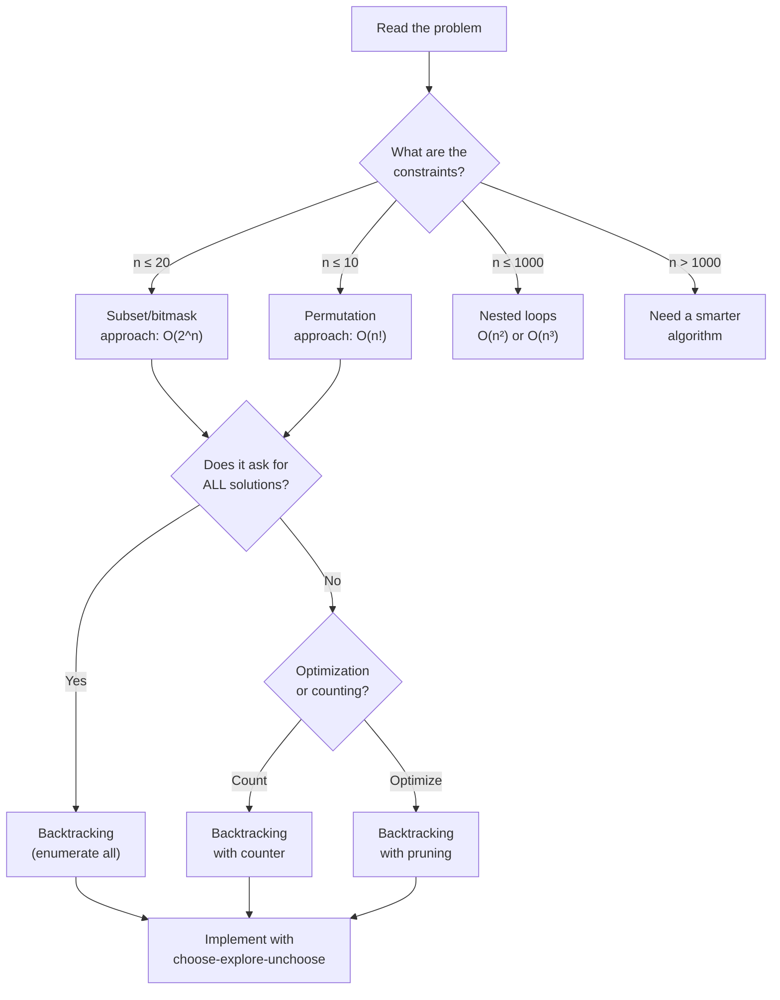
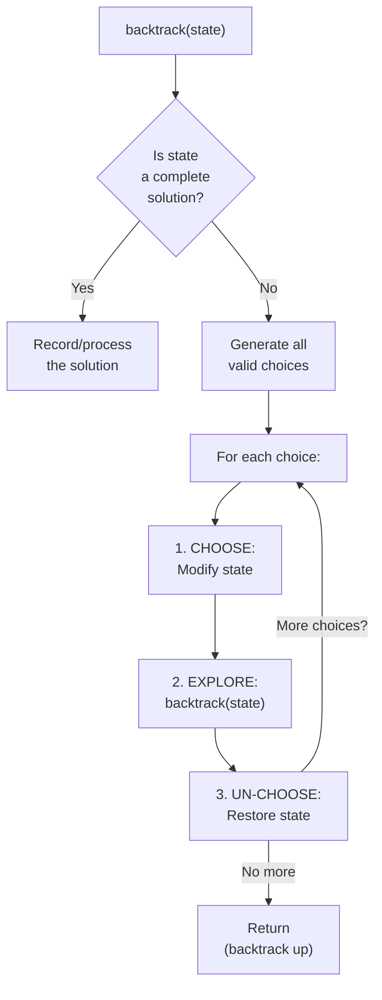

# Bronze Battle Plan — Complete Search & Simulation

## Chapter Goals

By the end of this chapter, you will:

- Understand complete search (brute force) and know WHEN it is the right strategy based on constraints
- Solve simulation problems by carefully following step-by-step rules
- Tackle ad hoc problems that require careful logic rather than a standard algorithm
- Generate all subsets using both recursion and bitmasks (connecting Ch 10 and Ch 12!)
- Master backtracking with a reusable template: choose, explore, un-choose
- Apply pruning techniques to make brute force dramatically faster
- Solve classic backtracking problems: N-Queens, Sudoku, Word Search, Rat in a Maze
- Feel confident and ready to attempt a real USACO Bronze contest

---

## The Story: "The Chess Engine"

Imagine you are building the world's first chess computer. The year is 1950, and you have a machine that can calculate 1,000 moves per second. Your job: given a chess position, find the best move.

Your first idea: **try every possible move**. For each of your ~30 legal moves, consider all ~30 opponent responses, then all ~30 of your responses to those... That is 30 x 30 x 30 = 27,000 positions just looking 3 moves deep. At 1,000 moves per second, that takes 27 seconds. Not bad!

But looking 6 moves deep? 30^6 = 729,000,000 positions. That would take over 8 days. You need a better approach.

So you add **pruning**: if a move loses your queen immediately, don't bother exploring the millions of positions that follow it. By cutting off obviously bad branches, you can search much deeper in the same time. This is the core idea behind every chess engine from the 1950s to today's Stockfish.

The strategy of "try everything, but be smart about what you skip" is called **complete search with pruning**. It is the single most important technique for USACO Bronze, and it is what this chapter is about.

Here is the good news: USACO Bronze problems are designed so that brute force WORKS if you read the constraints carefully. The input sizes are small enough (n <= 20, or n <= 100) that trying every possibility finishes well within the time limit. The skill is recognizing this, implementing it cleanly, and not overthinking it.

Today you learn to think like a chess engine.

---

[Johari Window: Before](johari.md)

---

## Discovery

Before we dive into the theory, try these puzzles:

### Puzzle 1: "The Locker Problem"

There are 5 lockers in a row, all closed. You walk past them 5 times:
- Pass 1: Toggle every locker (open all)
- Pass 2: Toggle every 2nd locker (2, 4)
- Pass 3: Toggle every 3rd locker (3)
- Pass 4: Toggle every 4th locker (4)
- Pass 5: Toggle every 5th locker (5)

Which lockers are open at the end? Can you figure out the answer WITHOUT simulating? What about for 100 lockers?


The answer is lockers 1 and 4 are open. For 100 lockers, the open ones are 1, 4, 9, 16, 25, 36, 49, 64, 81, 100 -- the perfect squares! A locker gets toggled once for each of its divisors. Most numbers have an even number of divisors (they come in pairs). Perfect squares have an ODD number (because the square root pairs with itself). This is a **simulation** problem with a **mathematical insight**.


### Puzzle 2: "The Password Cracker"

A lock has a 3-digit code where each digit is 0-9. You have no hints. How many codes must you try in the worst case? How long would it take if you can try one code per second?


There are 10 x 10 x 10 = 1,000 possible codes. At one per second, 1,000 seconds = about 17 minutes. This is **complete search** -- trying every possibility. When the search space is small enough, brute force is the best strategy!


### Puzzle 3: "The Dinner Party"

You have 4 friends and are choosing a group to invite to dinner. You can invite any subset (including nobody or everybody). How many possible groups are there? List them all.


There are 2^4 = 16 subsets. For friends {A, B, C, D}: {}, {A}, {B}, {C}, {D}, {A,B}, {A,C}, {A,D}, {B,C}, {B,D}, {C,D}, {A,B,C}, {A,B,D}, {A,C,D}, {B,C,D}, {A,B,C,D}. This is **subset generation** -- a key building block of complete search. You will learn two ways to do it: recursion (Ch 10) and bitmasks (Ch 12).


---

## 13.1 Complete Search — When n Is Small, Try Everything

**Complete search** (also called **brute force** or **exhaustive search**) means systematically trying every possible candidate solution and checking which ones work.

It sounds unsophisticated, but it is the RIGHT approach when:
- The search space is small enough to explore completely
- You need a guaranteed correct answer (no clever shortcut exists)
- You are in a USACO Bronze contest (most problems are designed for it!)

### The Constraint Table

The key skill is reading the constraints and knowing what you can afford:

| Max n | What you can try | Common technique |
|-------|-----------------|------------------|
| n <= 8 | All permutations (n! = 40,320) | `next_permutation` or recursive |
| n <= 10 | All permutations (n! = 3,628,800) | Recursive with pruning |
| n <= 15-20 | All subsets (2^n = 32,768 to 1,048,576) | Bitmask or recursive |
| n <= 25 | Meet in the middle (2^(n/2) each half) | Advanced technique |
| n <= 100 | O(n^3) or O(n^2 log n) | Nested loops |
| n <= 1,000 | O(n^2) | Two nested loops |
| n <= 100,000 | O(n log n) | Sorting + binary search |
| n <= 1,000,000 | O(n) | Single pass / hashing |


**USACO Bronze golden rule**: If n <= 20, think subsets/permutations. If n <= 8, you can try ALL permutations. If n <= 1000, O(n^2) brute force is fine. READ THE CONSTRAINTS FIRST!


### The Complete Search Template



```python
def complete_search(input_data):
    """Template for complete search."""
    best = None
    for candidate in generate_all_candidates(input_data):
        if is_valid(candidate):
            if best is None or is_better(candidate, best):
                best = candidate
    return best
```


```java
static Result completeSearch(InputData data) {
    Result best = null;
    for (Candidate c : generateAllCandidates(data)) {
        if (isValid(c)) {
            if (best == null || isBetter(c, best)) {
                best = c;
            }
        }
    }
    return best;
}
```


```cpp
Result completeSearch(InputData& data) {
    Result best;
    for (auto& candidate : generateAllCandidates(data)) {
        if (isValid(candidate)) {
            if (isBetter(candidate, best)) {
                best = candidate;
            }
        }
    }
    return best;
}
```



The three pieces you fill in:
1. **Generate candidates**: How do you enumerate all possibilities?
2. **Validate**: Does this candidate satisfy the constraints?
3. **Evaluate**: Is this candidate better than the current best?

---

## 13.2 Simulation Problems

A **simulation** problem gives you a set of rules and asks: "What happens if you follow these rules exactly?"

There is no clever algorithm. You just... do what it says. Step by step.

### Example: Robot on a Grid

A robot starts at position (0, 0) on an infinite grid. Given a string of commands ('U', 'D', 'L', 'R'), simulate the robot's movement and return its final position.



```python
def simulate_robot(commands):
    x, y = 0, 0
    for cmd in commands:
        if cmd == 'U':
            y += 1
        elif cmd == 'D':
            y -= 1
        elif cmd == 'L':
            x -= 1
        elif cmd == 'R':
            x += 1
    return [x, y]
```


```java
static int[] simulateRobot(String commands) {
    int x = 0, y = 0;
    for (char cmd : commands.toCharArray()) {
        if (cmd == 'U') y++;
        else if (cmd == 'D') y--;
        else if (cmd == 'L') x--;
        else if (cmd == 'R') x++;
    }
    return new int[]{x, y};
}
```


```cpp
vector<int> simulateRobot(string commands) {
    int x = 0, y = 0;
    for (char cmd : commands) {
        if (cmd == 'U') y++;
        else if (cmd == 'D') y--;
        else if (cmd == 'L') x--;
        else if (cmd == 'R') x++;
    }
    return {x, y};
}
```



### Tips for Simulation Problems

1. **Read the problem statement VERY carefully** -- every word matters
2. **Don't optimize** -- just follow the rules exactly as stated
3. **Watch for edge cases**: What happens at boundaries? What if the input is empty?
4. **Use simple data structures**: Arrays, grids, counters -- keep it straightforward
5. **Test with the examples** before submitting

---

## 13.3 Ad Hoc Problems

An **ad hoc** problem has no standard algorithm that solves it. You need to understand the specific problem, think carefully, and write custom logic.

### Example: Tic-Tac-Toe Status

Given a 3x3 board with 'X', 'O', and '.', determine the game status: 'X' wins, 'O' wins, 'Draw', or 'Ongoing'.



```python
def check_winner(board):
    """Check all winning lines for tic-tac-toe."""
    # Check rows, columns, and diagonals
    lines = []
    for i in range(3):
        lines.append([board[i][0], board[i][1], board[i][2]])  # rows
        lines.append([board[0][i], board[1][i], board[2][i]])  # cols
    lines.append([board[0][0], board[1][1], board[2][2]])      # main diagonal
    lines.append([board[0][2], board[1][1], board[2][0]])      # anti-diagonal

    for line in lines:
        if line[0] == line[1] == line[2] and line[0] != '.':
            return line[0]  # 'X' or 'O'

    # Check if any empty cells remain
    for row in board:
        if '.' in row:
            return 'Ongoing'
    return 'Draw'
```


```java
static String checkWinner(char[][] board) {
    // Check rows, columns, diagonals
    for (int i = 0; i < 3; i++) {
        if (board[i][0] == board[i][1] && board[i][1] == board[i][2] && board[i][0] != '.')
            return String.valueOf(board[i][0]);
        if (board[0][i] == board[1][i] && board[1][i] == board[2][i] && board[0][i] != '.')
            return String.valueOf(board[0][i]);
    }
    if (board[0][0] == board[1][1] && board[1][1] == board[2][2] && board[0][0] != '.')
        return String.valueOf(board[0][0]);
    if (board[0][2] == board[1][1] && board[1][1] == board[2][0] && board[0][2] != '.')
        return String.valueOf(board[0][2]);
    for (char[] row : board)
        for (char c : row)
            if (c == '.') return "Ongoing";
    return "Draw";
}
```


```cpp
string checkWinner(vector<vector<char>>& board) {
    for (int i = 0; i < 3; i++) {
        if (board[i][0] == board[i][1] && board[i][1] == board[i][2] && board[i][0] != '.')
            return string(1, board[i][0]);
        if (board[0][i] == board[1][i] && board[1][i] == board[2][i] && board[0][i] != '.')
            return string(1, board[0][i]);
    }
    if (board[0][0] == board[1][1] && board[1][1] == board[2][2] && board[0][0] != '.')
        return string(1, board[0][0]);
    if (board[0][2] == board[1][1] && board[1][1] == board[2][0] && board[0][2] != '.')
        return string(1, board[0][2]);
    for (auto& row : board)
        for (char c : row)
            if (c == '.') return "Ongoing";
    return "Draw";
}
```



---

## 13.4 Generating Subsets with Bitmasks

In Ch 10 (Recursion), you learned to generate subsets recursively -- each element is either included or excluded. In Ch 12 (Bit Manipulation), you learned that individual bits can represent "yes/no" decisions.

Now we combine these ideas: **each integer from 0 to 2^n - 1 represents a subset**. The i-th bit being 1 means "include element i."

```
Elements: [A, B, C]    n = 3, so 2^3 = 8 subsets

Mask  Binary  Subset
0     000     {}
1     001     {A}
2     010     {B}
3     011     {A, B}
4     100     {C}
5     101     {A, C}
6     110     {B, C}
7     111     {A, B, C}
```

### Bitmask Subset Generation



```python
def subsets_bitmask(nums):
    """Generate all subsets using bitmasks."""
    n = len(nums)
    result = []
    for mask in range(1 << n):       # 0 to 2^n - 1
        subset = []
        for i in range(n):
            if mask & (1 << i):       # Check if bit i is set
                subset.append(nums[i])
        result.append(subset)
    return result

# Example: subsets_bitmask([1, 2, 3])
# [[], [1], [2], [1,2], [3], [1,3], [2,3], [1,2,3]]
```


```java
static List<List<Integer>> subsetsBitmask(int[] nums) {
    int n = nums.length;
    List<List<Integer>> result = new ArrayList<>();
    for (int mask = 0; mask < (1 << n); mask++) {
        List<Integer> subset = new ArrayList<>();
        for (int i = 0; i < n; i++) {
            if ((mask & (1 << i)) != 0) {
                subset.add(nums[i]);
            }
        }
        result.add(subset);
    }
    return result;
}
```


```cpp
vector<vector<int>> subsetsBitmask(vector<int>& nums) {
    int n = nums.size();
    vector<vector<int>> result;
    for (int mask = 0; mask < (1 << n); mask++) {
        vector<int> subset;
        for (int i = 0; i < n; i++) {
            if (mask & (1 << i)) {
                subset.push_back(nums[i]);
            }
        }
        result.push_back(subset);
    }
    return result;
}
```




**Connection to Ch 12**: Remember `mask & (1 << i)` checks if bit i is set? That is exactly the "is element i in the subset?" question. Bitmask subsets are bit manipulation applied to combinatorics. This is one of the most powerful connections in competitive programming.


> **Language Spotlight: Bitmask Subsets**
> | | Python | Java | C++ |
> |---|--------|------|-----|
> | Total subsets | `1 << n` | `1 << n` | `1 << n` |
> | Check bit i | `mask & (1 << i)` | `(mask & (1 << i)) != 0` | `mask & (1 << i)` |
> | Set bit i | `mask \| (1 << i)` | `mask \| (1 << i)` | `mask \| (1 << i)` |

---

## 13.5 Backtracking Deep Dive

**Backtracking** is a systematic way to search through all possible solutions by building them one choice at a time, and undoing ("backtracking") choices that lead to dead ends.

### The Backtracking Template

Every backtracking solution follows the same three-step pattern:

```
1. CHOOSE:    Make a decision (pick an element, place a queen, fill a cell)
2. EXPLORE:   Recurse to make the next decision
3. UN-CHOOSE: Undo the decision (restore state) before trying the next option
```



```python
def backtrack(state, choices):
    """Generic backtracking template."""
    if is_solution(state):
        process_solution(state)  # Found a valid solution!
        return

    for choice in choices:
        if is_valid(state, choice):
            make_choice(state, choice)      # 1. CHOOSE
            backtrack(state, next_choices)   # 2. EXPLORE
            undo_choice(state, choice)       # 3. UN-CHOOSE
```


```java
static void backtrack(State state, List<Choice> choices) {
    if (isSolution(state)) {
        processSolution(state);
        return;
    }
    for (Choice choice : choices) {
        if (isValid(state, choice)) {
            makeChoice(state, choice);     // 1. CHOOSE
            backtrack(state, nextChoices); // 2. EXPLORE
            undoChoice(state, choice);     // 3. UN-CHOOSE
        }
    }
}
```


```cpp
void backtrack(State& state, vector<Choice>& choices) {
    if (isSolution(state)) {
        processSolution(state);
        return;
    }
    for (auto& choice : choices) {
        if (isValid(state, choice)) {
            makeChoice(state, choice);     // 1. CHOOSE
            backtrack(state, nextChoices); // 2. EXPLORE
            undoChoice(state, choice);     // 3. UN-CHOOSE
        }
    }
}
```




**Connection to Ch 10**: Backtracking IS recursion with a purpose. Every backtracking function is a recursive function. The base case is "we found a solution" or "we ran out of choices." The recursive case is "try each option and recurse."


### Walkthrough: N-Queens

Place N queens on an NxN chessboard so no two attack each other (same row, column, or diagonal).

Let us trace N=4:

```
Step 1: Place queen in row 0, col 0
  Q . . .
  . . . .
  . . . .
  . . . .

Step 2: Row 1 -- col 0 (same column, SKIP), col 1 (same diagonal, SKIP),
  col 2 (safe!), place it:
  Q . . .
  . . Q .
  . . . .
  . . . .

Step 3: Row 2 -- col 0? diagonal conflict with row 1,col 2.
  col 1? Safe!
  Q . . .
  . . Q .
  . Q . .
  . . . .

  Wait -- no valid column in row 3. BACKTRACK!

  Remove queen from row 2, col 1.
  Try row 2, col 3:
  Q . . .
  . . Q .
  . . . Q   <-- but col 3 conflicts with diagonal? Let's check...

  Actually, let's be more careful. For row 2:
  - col 0: same diagonal as (0,0). Skip.
  - col 1: checked -- leads to dead end for row 3.
  - col 2: same column as (1,2). Skip.
  - col 3: diagonal conflict with (1,2)? |2-1| = 1, |3-2| = 1. Yes! Skip.

  All options exhausted for row 2. BACKTRACK to row 1.
  Remove queen from row 1, col 2.

  Row 1, col 3:
  Q . . .
  . . . Q
  . . . .
  . . . .

  Row 2: col 0 -- diagonal? No conflict. col 1? Safe!
  Q . . .
  . . . Q
  . Q . .
  . . . .

  Row 3: col 0? diagonal (2,1). col 1? same column (2,1). col 2? Safe!
  Q . . .
  . . . Q
  . Q . .
  . . Q .

  SOLUTION FOUND!
```

The decision tree looks like a tree where each node is "place queen in row r, column c" and branches that violate constraints are pruned away.

### N-Queens Implementation



```python
def solve_n_queens_count(n):
    """Count the number of valid N-Queens placements."""
    count = 0
    cols = set()        # Columns with queens
    diag1 = set()       # row - col diagonals
    diag2 = set()       # row + col diagonals

    def backtrack(row):
        nonlocal count
        if row == n:
            count += 1
            return
        for col in range(n):
            if col in cols or (row - col) in diag1 or (row + col) in diag2:
                continue  # PRUNING: this placement conflicts
            cols.add(col)
            diag1.add(row - col)
            diag2.add(row + col)
            backtrack(row + 1)
            cols.remove(col)
            diag1.remove(row - col)
            diag2.remove(row + col)

    backtrack(0)
    return count
```


```java
static int solveNQueensCount(int n) {
    int[] count = {0};
    Set<Integer> cols = new HashSet<>();
    Set<Integer> diag1 = new HashSet<>();
    Set<Integer> diag2 = new HashSet<>();

    backtrack(0, n, cols, diag1, diag2, count);
    return count[0];
}

static void backtrack(int row, int n, Set<Integer> cols,
                      Set<Integer> diag1, Set<Integer> diag2, int[] count) {
    if (row == n) { count[0]++; return; }
    for (int col = 0; col < n; col++) {
        if (cols.contains(col) || diag1.contains(row - col) || diag2.contains(row + col))
            continue;
        cols.add(col);
        diag1.add(row - col);
        diag2.add(row + col);
        backtrack(row + 1, n, cols, diag1, diag2, count);
        cols.remove(col);
        diag1.remove(row - col);
        diag2.remove(row + col);
    }
}
```


```cpp
int solveNQueensCount(int n) {
    int count = 0;
    unordered_set<int> cols, diag1, diag2;

    function<void(int)> backtrack = [&](int row) {
        if (row == n) { count++; return; }
        for (int col = 0; col < n; col++) {
            if (cols.count(col) || diag1.count(row - col) || diag2.count(row + col))
                continue;
            cols.insert(col);
            diag1.insert(row - col);
            diag2.insert(row + col);
            backtrack(row + 1);
            cols.erase(col);
            diag1.erase(row - col);
            diag2.erase(row + col);
        }
    };

    backtrack(0);
    return count;
}
```



### Walkthrough: Sudoku Solver

Sudoku is the ultimate backtracking problem. Fill a 9x9 grid so each row, column, and 3x3 box contains digits 1-9.

Strategy:
1. Find the first empty cell
2. Try digits 1-9
3. For each digit, check if it is valid (not in same row, column, or box)
4. If valid, place it and recurse
5. If recursion fails, un-place it and try the next digit
6. If no digit works, return false (triggers backtracking)



```python
def solve_sudoku(board):
    """Solve a 9x9 Sudoku. board uses 0 for empty cells."""

    def is_valid(row, col, num):
        # Check row
        if num in board[row]:
            return False
        # Check column
        for r in range(9):
            if board[r][col] == num:
                return False
        # Check 3x3 box
        box_r, box_c = 3 * (row // 3), 3 * (col // 3)
        for r in range(box_r, box_r + 3):
            for c in range(box_c, box_c + 3):
                if board[r][c] == num:
                    return False
        return True

    def backtrack():
        for row in range(9):
            for col in range(9):
                if board[row][col] == 0:
                    for num in range(1, 10):
                        if is_valid(row, col, num):
                            board[row][col] = num    # CHOOSE
                            if backtrack():          # EXPLORE
                                return True
                            board[row][col] = 0      # UN-CHOOSE
                    return False  # No valid digit -- backtrack!
        return True  # All cells filled

    backtrack()
    return [row[:] for row in board]
```


```java
static int[][] solveSudoku(int[][] board) {
    backtrackSudoku(board);
    return board;
}

static boolean backtrackSudoku(int[][] board) {
    for (int row = 0; row < 9; row++) {
        for (int col = 0; col < 9; col++) {
            if (board[row][col] == 0) {
                for (int num = 1; num <= 9; num++) {
                    if (isValidSudoku(board, row, col, num)) {
                        board[row][col] = num;
                        if (backtrackSudoku(board)) return true;
                        board[row][col] = 0;
                    }
                }
                return false;
            }
        }
    }
    return true;
}

static boolean isValidSudoku(int[][] board, int row, int col, int num) {
    for (int i = 0; i < 9; i++) {
        if (board[row][i] == num) return false;
        if (board[i][col] == num) return false;
    }
    int boxR = 3 * (row / 3), boxC = 3 * (col / 3);
    for (int r = boxR; r < boxR + 3; r++)
        for (int c = boxC; c < boxC + 3; c++)
            if (board[r][c] == num) return false;
    return true;
}
```


```cpp
bool isValidSudoku(vector<vector<int>>& board, int row, int col, int num) {
    for (int i = 0; i < 9; i++) {
        if (board[row][i] == num) return false;
        if (board[i][col] == num) return false;
    }
    int boxR = 3 * (row / 3), boxC = 3 * (col / 3);
    for (int r = boxR; r < boxR + 3; r++)
        for (int c = boxC; c < boxC + 3; c++)
            if (board[r][c] == num) return false;
    return true;
}

bool backtrackSudoku(vector<vector<int>>& board) {
    for (int row = 0; row < 9; row++) {
        for (int col = 0; col < 9; col++) {
            if (board[row][col] == 0) {
                for (int num = 1; num <= 9; num++) {
                    if (isValidSudoku(board, row, col, num)) {
                        board[row][col] = num;
                        if (backtrackSudoku(board)) return true;
                        board[row][col] = 0;
                    }
                }
                return false;
            }
        }
    }
    return true;
}
```



---

## 13.6 Pruning — Making Brute Force Faster

**Pruning** means cutting off branches of the search tree that cannot lead to valid solutions. Instead of exploring everything blindly, you check early: "Is this branch worth exploring?"

### Types of Pruning

1. **Feasibility pruning**: If a partial solution already violates a constraint, stop exploring it. (N-Queens: skip columns that conflict.)

2. **Optimality pruning (branch & bound)**: If the current partial solution cannot possibly be better than the best solution found so far, stop. (Knapsack: if remaining items cannot exceed current best value, prune.)

3. **Symmetry pruning**: If two branches will produce equivalent results, only explore one. (N-Queens: solutions have rotational symmetry -- only explore half.)

### Pruning in Action: Subset Sum

Find all subsets of `[3, 7, 1, 8, 4]` that sum to 11.

Without pruning, you check all 2^5 = 32 subsets. With pruning:

```
Start with sum = 0, target = 11, sorted array = [1, 3, 4, 7, 8]

If current sum already exceeds 11 → PRUNE (stop adding more)
If current sum + remaining elements < 11 → PRUNE (can't reach target)
```



```python
def subset_sum_with_pruning(nums, target):
    """Find all subsets that sum to target, with pruning."""
    nums.sort()
    results = []

    def backtrack(index, current_sum, current_subset):
        if current_sum == target:
            results.append(current_subset[:])
            return
        if current_sum > target:     # FEASIBILITY PRUNING
            return
        for i in range(index, len(nums)):
            if current_sum + nums[i] > target:  # PRUNING: sorted, so all future too big
                break
            current_subset.append(nums[i])
            backtrack(i + 1, current_sum + nums[i], current_subset)
            current_subset.pop()

    backtrack(0, 0, [])
    return results
```


```java
static List<List<Integer>> subsetSumWithPruning(int[] nums, int target) {
    Arrays.sort(nums);
    List<List<Integer>> results = new ArrayList<>();
    backtrackSum(nums, target, 0, 0, new ArrayList<>(), results);
    return results;
}

static void backtrackSum(int[] nums, int target, int index, int sum,
                         List<Integer> current, List<List<Integer>> results) {
    if (sum == target) { results.add(new ArrayList<>(current)); return; }
    if (sum > target) return;
    for (int i = index; i < nums.length; i++) {
        if (sum + nums[i] > target) break;  // Pruning
        current.add(nums[i]);
        backtrackSum(nums, target, i + 1, sum + nums[i], current, results);
        current.remove(current.size() - 1);
    }
}
```


```cpp
void backtrackSum(vector<int>& nums, int target, int index, int sum,
                  vector<int>& current, vector<vector<int>>& results) {
    if (sum == target) { results.push_back(current); return; }
    if (sum > target) return;
    for (int i = index; i < (int)nums.size(); i++) {
        if (sum + nums[i] > target) break;
        current.push_back(nums[i]);
        backtrackSum(nums, target, i + 1, sum + nums[i], current, results);
        current.pop_back();
    }
}
```




**Sorting before backtracking** is a powerful pruning enabler. Once you hit an element that is too big, you know ALL remaining elements are too big (because they are sorted). This turns exponential worst-case into something much faster in practice.


---

## Think Like a Pro


**Errichto** (Kamil Debowski): "For USACO Bronze, the most common mistake is overthinking. Students try to find a clever O(n) algorithm when the constraints say n <= 20. With n <= 20, you have at most 2^20 = ~1 million subsets. That's nothing for a modern computer. Read the constraints first, and if brute force fits, USE brute force. The fastest way to fail Bronze is to attempt a Silver-level solution and get it wrong."

*Why this works*: Bronze problems are DESIGNED for complete search. The constraints are intentionally small. Trust them.



**Tourist** (Gennady Korotkevich): "Before I write a single line of code, I spend time understanding the problem. I draw examples on paper, trace through small cases, and make sure I understand what the problem is REALLY asking. Only then do I think about implementation. Rushing to code without understanding is the number one source of bugs."

*Why this works*: Understanding the problem is 70% of solving it. The remaining 30% is clean implementation.


---

## Thinking Flowchart: "Is This a Complete Search Problem?"



## Implementation Flowchart: "Backtracking Template"



---

## AOPS Showcase: "Fence Painting" (USACO Bronze Style)

### Problem Statement

Farmer John has N fence segments (N <= 10). Each segment is described by a start and end position on a number line: `[start, end]`. Some segments overlap. What is the total length of fence that is painted (counting overlapping regions only once)?

### Approach 1: Brute Force with Coordinate Set -- O(N * max_coord)

Mark every integer point that is covered, then count them.



```python
def solve_v1(fences):
    """Mark every painted point."""
    painted = set()
    for start, end in fences:
        for x in range(start, end):
            painted.add(x)
    return len(painted)
```


```java
static int solveV1(int[][] fences) {
    Set<Integer> painted = new HashSet<>();
    for (int[] f : fences) {
        for (int x = f[0]; x < f[1]; x++) painted.add(x);
    }
    return painted.size();
}
```


```cpp
int solveV1(vector<vector<int>>& fences) {
    unordered_set<int> painted;
    for (auto& f : fences) {
        for (int x = f[0]; x < f[1]; x++) painted.insert(x);
    }
    return (int)painted.size();
}
```



### Approach 2: Sort and Merge Intervals -- O(N log N)

Sort segments by start, then merge overlapping ones.



```python
def solve_v2(fences):
    """Sort and merge intervals."""
    if not fences:
        return 0
    fences.sort()
    total = 0
    cur_start, cur_end = fences[0]
    for start, end in fences[1:]:
        if start <= cur_end:
            cur_end = max(cur_end, end)
        else:
            total += cur_end - cur_start
            cur_start, cur_end = start, end
    total += cur_end - cur_start
    return total
```


```java
static int solveV2(int[][] fences) {
    if (fences.length == 0) return 0;
    Arrays.sort(fences, (a, b) -> Integer.compare(a[0], b[0]));
    int total = 0, curS = fences[0][0], curE = fences[0][1];
    for (int i = 1; i < fences.length; i++) {
        if (fences[i][0] <= curE) {
            curE = Math.max(curE, fences[i][1]);
        } else {
            total += curE - curS;
            curS = fences[i][0];
            curE = fences[i][1];
        }
    }
    total += curE - curS;
    return total;
}
```


```cpp
int solveV2(vector<vector<int>>& fences) {
    if (fences.empty()) return 0;
    sort(fences.begin(), fences.end());
    int total = 0, curS = fences[0][0], curE = fences[0][1];
    for (int i = 1; i < (int)fences.size(); i++) {
        if (fences[i][0] <= curE) {
            curE = max(curE, fences[i][1]);
        } else {
            total += curE - curS;
            curS = fences[i][0];
            curE = fences[i][1];
        }
    }
    total += curE - curS;
    return total;
}
```



### Approach 3: Coordinate Compression + Sweep -- O(N log N)

Collect all endpoints, sort them, then sweep through checking coverage.



```python
def solve_v3(fences):
    """Coordinate compression with event sweep."""
    if not fences:
        return 0
    events = []
    for start, end in fences:
        events.append((start, 1))   # fence starts
        events.append((end, -1))    # fence ends
    events.sort()
    total = 0
    active = 0
    prev_x = events[0][0]
    for x, delta in events:
        if active > 0:
            total += x - prev_x
        active += delta
        prev_x = x
    return total
```


```java
static int solveV3(int[][] fences) {
    if (fences.length == 0) return 0;
    List<int[]> events = new ArrayList<>();
    for (int[] f : fences) {
        events.add(new int[]{f[0], 1});
        events.add(new int[]{f[1], -1});
    }
    events.sort((a, b) -> a[0] != b[0] ? Integer.compare(a[0], b[0]) : Integer.compare(a[1], b[1]));
    int total = 0, active = 0, prev = events.get(0)[0];
    for (int[] e : events) {
        if (active > 0) total += e[0] - prev;
        active += e[1];
        prev = e[0];
    }
    return total;
}
```


```cpp
int solveV3(vector<vector<int>>& fences) {
    if (fences.empty()) return 0;
    vector<pair<int,int>> events;
    for (auto& f : fences) {
        events.push_back({f[0], 1});
        events.push_back({f[1], -1});
    }
    sort(events.begin(), events.end());
    int total = 0, active = 0, prev = events[0].first;
    for (auto& [x, d] : events) {
        if (active > 0) total += x - prev;
        active += d;
        prev = x;
    }
    return total;
}
```



### Comparison Table

| Approach | Time | Space | Idea |
|----------|------|-------|------|
| Coordinate set | O(N * max_coord) | O(max_coord) | Mark every point |
| Sort & merge | O(N log N) | O(1) | Merge overlapping intervals |
| Event sweep | O(N log N) | O(N) | Count active fences at each point |


**For USACO Bronze**, Approach 1 (brute force) often works because the coordinates are small (typically <= 100). For Silver and beyond, you need Approach 2 or 3. Recognizing WHICH approach fits the constraints is the key Bronze skill.


---

## Legend's Corner


**Neal Wu** -- He started competing in programming contests at age 13, around the same age as you. He went on to become a multiple-time USACO Finalist and IOI gold medalist. Here is his advice for USACO Bronze:

"My biggest tip for Bronze is: don't panic, and don't overthink. Almost every Bronze problem can be solved with a simple complete search or simulation. Read the problem carefully, implement exactly what it says, and test with the sample cases. The problems are designed to be solvable without fancy algorithms. If you find yourself thinking 'this needs dynamic programming' or 'I need a segment tree,' you are almost certainly overcomplicating it."

**What you can learn**: Bronze is about fundamentals -- reading comprehension, careful implementation, and basic brute force. Master these, and Silver will feel like a natural next step.


---

## Gotchas


**Gotcha 1: Not reading constraints!**

If n <= 20, brute force is the INTENDED solution. If n <= 8, you can generate all permutations. Don't waste time looking for a clever O(n log n) algorithm when the problem expects O(2^n).



**Gotcha 2: Forgetting to un-choose in backtracking!**

The most common backtracking bug: you modify state in the CHOOSE step but forget to undo it in the UN-CHOOSE step. This corrupts your search.
```python
# WRONG — forgot to undo!
path.append(node)
backtrack(next_node)
# Missing: path.pop()

# RIGHT
path.append(node)
backtrack(next_node)
path.pop()
```



**Gotcha 3: Off-by-one in bitmask iteration!**

The number of subsets of n elements is `1 << n` (which is 2^n). The loop should be `for mask in range(1 << n)`, NOT `range(1 << n - 1)` (that is `1 << (n-1)`, only half the subsets!). Always use parentheses: `range(1 << n)`.



**Gotcha 4: Modifying the board/grid without restoring it!**

In grid-based backtracking (Sudoku, Word Search), always restore the cell after recursion:
```python
# WRONG
board[r][c] = num
if backtrack(): return True
# Missing: board[r][c] = 0

# RIGHT
board[r][c] = num
if backtrack(): return True
board[r][c] = 0
```



**Gotcha 5: Generating duplicate subsets or permutations!**

If the input has duplicates (e.g., [1, 1, 2]), naive recursion generates duplicate subsets. Sort the input first and skip consecutive equal elements:
```python
if i > index and nums[i] == nums[i-1]:
    continue  # Skip duplicate
```



**Gotcha 6: Overthinking USACO Bronze!**

You see a problem and think "this looks like it needs DP" or "maybe segment trees." Stop. Read the constraints. If n <= 1000, try O(n^2). If n <= 20, try 2^n. Bronze is about implementation, not algorithms. The simplest correct solution wins.


---

## Practice Problems

| # | Name | Difficulty | Key Concept |
|---|------|-----------|-------------|
| W1 | Generate All Permutations | ⭐ | Backtracking permutation generation |
| W2 | Generate All Subsets | ⭐ | Recursive subset generation |
| W3 | Simulate Robot Moves | ⭐ | Grid simulation (UDLR commands) |
| W4 | Count Binary Strings | ⭐ | Count n-length binary strings, no consecutive 1s |
| W5 | Check Tic-Tac-Toe Winner | ⭐ | Simple simulation / ad hoc |
| P1 | Subsets Using Bitmasks | ⭐⭐ | Generate subsets with bit manipulation |
| P2 | N-Queens Count | ⭐⭐ | Backtracking with column/diagonal tracking |
| P3 | Rat in a Maze | ⭐⭐ | Backtracking on grid, find all paths |
| P4 | Letter Combinations of Phone | ⭐⭐ | Backtracking with mapping |
| P5 | Combination Sum | ⭐⭐ | Backtracking with reuse allowed |
| C1 | Sudoku Solver | ⭐⭐⭐ | Backtracking with constraint checking |
| C2 | Word Search | ⭐⭐⭐ | Backtracking on grid with visited tracking |
| C3 | N-Queens All Solutions | ⭐⭐⭐ | Full N-Queens with solution enumeration |
| C4 | Fence Painting (USACO Style) | ⭐⭐⭐ | Complete search / simulation on small input |

---

## Language Idioms



```python
# ── Generating permutations (built-in) ──
from itertools import permutations, combinations
# NOTE: Implement manually in practice problems!
# list(permutations([1,2,3]))  # all 3! = 6 permutations
# list(combinations([1,2,3], 2))  # all C(3,2) = 3 combinations

# ── Backtracking with list as stack ──
path = []
path.append(choice)     # CHOOSE
backtrack(...)
path.pop()              # UN-CHOOSE

# ── Set for O(1) conflict checking ──
used = set()
if val not in used:
    used.add(val)        # CHOOSE
    backtrack(...)
    used.remove(val)     # UN-CHOOSE

# ── Copy a 2D list (for board problems) ──
board_copy = [row[:] for row in board]

# ── Check bounds in grid problems ──
def in_bounds(r, c, rows, cols):
    return 0 <= r < rows and 0 <= c < cols
```


```java
// ── Backtracking with ArrayList ──
List<Integer> path = new ArrayList<>();
path.add(choice);           // CHOOSE
backtrack(...);
path.remove(path.size()-1); // UN-CHOOSE

// ── Set for conflict checking ──
Set<Integer> used = new HashSet<>();
used.add(val);               // CHOOSE
backtrack(...);
used.remove(val);            // UN-CHOOSE

// ── Deep copy a 2D array ──
int[][] copy = new int[board.length][];
for (int i = 0; i < board.length; i++)
    copy[i] = board[i].clone();

// ── Grid directions (up, down, left, right) ──
int[][] dirs = {{-1,0},{1,0},{0,-1},{0,1}};
for (int[] d : dirs) {
    int nr = r + d[0], nc = c + d[1];
    if (nr >= 0 && nr < rows && nc >= 0 && nc < cols) {
        // valid neighbor
    }
}

// ── Swapping elements for permutation generation ──
int temp = arr[i]; arr[i] = arr[j]; arr[j] = temp;
```


```cpp
// ── next_permutation (built-in) ──
vector<int> nums = {1, 2, 3};
sort(nums.begin(), nums.end());
do {
    // process this permutation
} while (next_permutation(nums.begin(), nums.end()));

// ── Backtracking with vector ──
vector<int> path;
path.push_back(choice);     // CHOOSE
backtrack(...);
path.pop_back();             // UN-CHOOSE

// ── Lambda for recursive backtracking ──
function<void(int)> backtrack = [&](int idx) {
    // use captured variables by reference
};
backtrack(0);

// ── Grid directions ──
int dr[] = {-1, 1, 0, 0};
int dc[] = {0, 0, -1, 1};
for (int d = 0; d < 4; d++) {
    int nr = r + dr[d], nc = c + dc[d];
    if (nr >= 0 && nr < rows && nc >= 0 && nc < cols) {
        // valid neighbor
    }
}

// ── Bitmask subset enumeration ──
for (int mask = 0; mask < (1 << n); mask++) {
    for (int i = 0; i < n; i++) {
        if (mask & (1 << i)) { /* element i is in subset */ }
    }
}
```



---

## Breadcrumbs

### Looking Back
- **Ch 10** (Recursion): Backtracking IS recursion with purpose. Every backtracking function is a recursive function with a base case (found solution) and recursive case (try each choice).
- **Ch 12** (Bit Manipulation): Bitmask subsets use the bit-checking techniques you learned -- `mask & (1 << i)` to test if element i is in a subset.
- **Ch 11** (Hashing): Hash sets provide O(1) conflict checking in N-Queens (column set, diagonal sets) and Word Search (visited tracking).
- **Ch 8** (Sorting): Sorting before backtracking enables pruning -- once an element exceeds the target, all remaining elements do too.

### Looking Forward
- **Ch 14** (Prefix Sums): Prefix sums solve range query problems that brute force handles with nested loops.
- **Ch 23** (Dynamic Programming I): DP = backtracking + memoization! When backtracking has overlapping subproblems, caching results transforms exponential into polynomial.
- **Ch 25** (DP III — Knapsack): The subset sum problem from this chapter becomes the 0/1 Knapsack problem -- solved with DP instead of backtracking.
- **Ch 31** (Advanced DP — Bitmask DP): Bitmask subsets from section 13.4 combine with DP for powerful optimization over subsets.

### Cross-Chapter Threads
- **"Brute force as strategy"**: In Ch 6 you learned to analyze complexity. Now you use that skill to DECIDE when brute force is good enough. This thread runs through every chapter -- always ask "can I afford brute force?" before reaching for a fancy algorithm.
- **"Reduce to known"**: Many backtracking problems reduce to tree traversal (the decision tree). The "reduce" thread grows.
- **"Space for time"**: Hash sets for O(1) conflict checking trade memory for speed, making backtracking's inner loop fast.

---

[Johari Window: After](johari.md)

---

## Open Questions Beyond

1. **"We used backtracking to solve Sudoku by trying all possibilities. But the best Sudoku solvers use constraint propagation -- when you place a digit, you immediately eliminate it from all peers (same row, column, box). Can this alone solve most puzzles without any guessing?"** Hint: Look up "Algorithm X" and "Dancing Links" by Donald Knuth. It solves Sudoku as an exact cover problem.

2. **"N-Queens has a known formula for the number of solutions. But what about the N-Rooks problem (rooks can't share a row or column, but diagonals are fine)? How many solutions does it have?"** Hint: It is exactly n! -- placing rooks is the same as counting permutations. This connects combinatorics to backtracking.

3. **"We pruned branches that violate constraints. But what if we could LEARN from failed branches? If placing queen at (2,3) always leads to failure, could we remember that and skip it in future searches?"** This is called **nogood learning** and is used in SAT solvers -- the engines behind modern constraint satisfaction. It connects to Ch 23 (DP/memoization).

---

## What's Next

Congratulations -- you have completed Part II: The Bronze Forge! You now have a solid foundation in:
- Basic programming in three languages
- Arrays, strings, sorting, searching
- Recursion and backtracking
- Hashing and bit manipulation
- Complete search and simulation

### USACO Bronze Milestone

You are ready to attempt your first USACO Bronze contest. Here are some tips:

1. **Register at usaco.org** and take a practice contest first
2. **Read ALL THREE problems** before starting to code
3. **Start with the easiest problem** -- usually the simulation/ad hoc one
4. **Read constraints carefully** -- they tell you the intended approach
5. **Test with sample cases** before submitting
6. **Partial credit counts** -- even 5/10 test cases is better than 0
7. **You have 4 hours** -- don't rush! Think before coding


**You've got this!** Every USACO Platinum competitor started at Bronze. Neal Wu started competing at 13. Benq qualified for Platinum at 14. The journey of a thousand miles begins with a single step -- and you have already taken that step.


In Part III: **The Silver Arena**, you will learn the techniques that separate Bronze from Silver:
- **Ch 14: Prefix Sums** -- answer range queries in O(1)
- **Ch 15: Two Pointers & Sliding Window** -- the caterpillar method
- **Ch 16: Binary Search Beyond Arrays** -- searching on answers
- And much more!

The adventure continues. See you in the Silver Arena!
