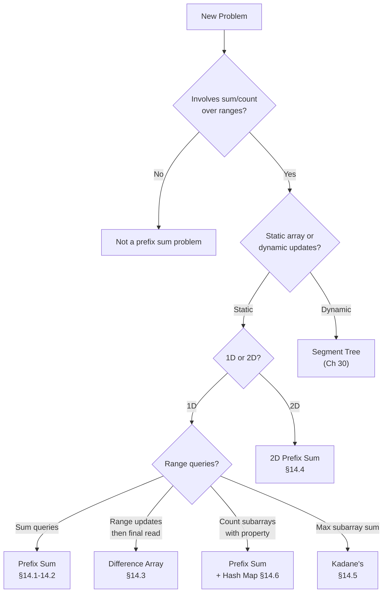
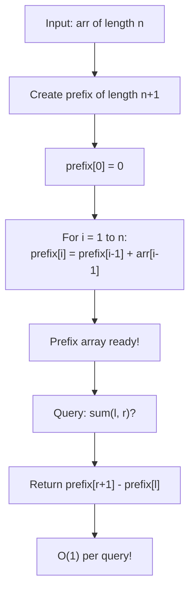

# Prefix Sums — The Running Total Trick


**Welcome to Part III: The Silver Arena!** You've forged your Bronze-level skills — loops, functions, sorting, searching, recursion, hashing, bit tricks, and complete search. Now we level up. Silver problems demand *cleverness*: preprocessing data so that queries become instant, shrinking search spaces, and exploiting structure. Prefix sums are your first Silver weapon — a simple idea that unlocks an entire category of problems. Let's go!


## Chapter Goals

By the end of this chapter, you will:

- Build a 1D prefix sum array and understand why `prefix[i]` stores the sum of `arr[0..i-1]`
- Answer any range sum query `sum(l, r)` in O(1) using the formula `prefix[r+1] - prefix[l]`
- Use difference arrays to apply range updates in O(1) each, then reconstruct the final array in O(n)
- Extend prefix sums to 2D grids and compute rectangle sums using inclusion-exclusion
- Implement Kadane's algorithm for maximum subarray sum, including all-negative arrays
- Combine prefix sums with hash maps to count subarrays with a given sum in O(n)
- Recognize the "trade space for time" pattern: O(n) preprocessing buys O(1) queries
- Avoid the #1 gotcha: off-by-one errors with 0-indexed vs 1-indexed prefix arrays

---

## The Story: "The Accountant"

You're the accountant for a small business. The owner keeps a ledger with daily profits and losses — one number per day. Every morning, they burst into your office with questions:

*"What was our total revenue from day 12 to day 47?"*
*"How much did we make between day 100 and day 200?"*
*"What about days 5 through 5,000?"*

At first, you add up numbers by hand every time. For a range of `k` days, that's `k` additions. When the ledger has 100,000 days and the owner asks 10,000 questions, you're doing up to a BILLION additions. Your coffee goes cold. Your eyes glaze over.

Then you have a flash of insight: **what if you precompute a running total?**

You create a second ledger — the *prefix sum ledger* — where entry `i` stores the total from day 1 through day `i`. Now when the boss asks "total from day 12 to day 47?", you just look up two numbers and subtract:

```
total(12, 47) = prefix[47] - prefix[11]
```

One subtraction. O(1). No matter how big the range.

You precompute the prefix ledger once (O(n)), and every question after that is instant. The boss thinks you're a genius. Your coffee stays warm.

That's the prefix sum trick: **precompute once, query forever**.

---

## Johari Window: Before

Before diving in, take 5 minutes to fill out the **"Before"** section of your [Johari Window worksheet](johari.md).


Be honest with yourself! Knowing what you *don't* know is the first step to learning it. There are no wrong answers — only honest ones.


---

## Discovery

Before we explain prefix sums formally, try these puzzles:

### Puzzle 1: "The Fast Cashier"

A cashier has a list of item prices: `[3, 1, 4, 1, 5, 9, 2, 6]`. A customer asks: "How much do items 2 through 5 cost in total?" (0-indexed, inclusive)

The slow way: add `1 + 4 + 1 + 5 = 11`. That's 3 additions.

But what if you had already precomputed a "running total" array? Could you answer in just ONE operation?


Yes! If you have `prefix = [0, 3, 4, 8, 9, 14, 23, 25, 31]`, then `sum(2,5) = prefix[6] - prefix[2] = 23 - 4 = 19`. Wait — that doesn't match! The actual sum of indices 2..5 is `4 + 1 + 5 + 9 = 19`. It DOES match. The key: `prefix[r+1] - prefix[l]`. You'll see exactly why in section 14.1.


### Puzzle 2: "The Salary Raise"

Your company decides: "Everyone from employee 10 to employee 50 gets a $500 raise." Then: "Everyone from employee 20 to employee 40 gets ANOTHER $200 raise."

The slow way: loop through each employee in each range and add the raise. Two ranges of ~30 employees each = ~60 operations.

Is there a way to record each range update in just TWO operations, then compute all final salaries in one pass?


Yes! That's a **difference array**. Mark `+500` at position 10 and `-500` at position 51. Mark `+200` at position 20 and `-200` at position 41. Then compute a prefix sum of the difference array to get all final raises. Just 4 operations for the updates + one pass to reconstruct. You'll learn this in section 14.3.


### Puzzle 3: "The Maximum Streak"

A stock's daily change is: `[-2, 1, -3, 4, -1, 2, 1, -5, 4]`. What's the best consecutive streak of days you could have held the stock? (Maximum subarray sum.)

You could check all possible subarrays — that's O(n^2) or even O(n^3). Can you do it in ONE pass through the array?


Yes! **Kadane's algorithm** does it in O(n). The idea: keep a running sum, and reset it to 0 whenever it goes negative (because a negative prefix can only hurt you). The maximum running sum you see is the answer. Section 14.5 has the full explanation.


---

## 14.1 1D Prefix Sums — Building the Running Total

### The Idea

Given an array `arr` of length `n`, the **prefix sum array** `prefix` has length `n + 1`, where:

```
prefix[0] = 0
prefix[i] = arr[0] + arr[1] + ... + arr[i-1]    (for i = 1, 2, ..., n)
```

In other words, `prefix[i]` is the sum of the first `i` elements of `arr`.

### Visual Step-by-Step

```
Index:     0    1    2    3    4    5
arr:     [ 3,   1,   4,   1,   5,   9 ]

prefix[0] = 0                                        = 0
prefix[1] = 0 + 3                                    = 3
prefix[2] = 0 + 3 + 1                                = 4
prefix[3] = 0 + 3 + 1 + 4                            = 8
prefix[4] = 0 + 3 + 1 + 4 + 1                        = 9
prefix[5] = 0 + 3 + 1 + 4 + 1 + 5                    = 14
prefix[6] = 0 + 3 + 1 + 4 + 1 + 5 + 9               = 23

Index:     0    1    2    3    4    5    6
prefix:  [ 0,   3,   4,   8,   9,  14,  23 ]
```

Notice the recurrence: `prefix[i] = prefix[i-1] + arr[i-1]`.

### Code



```python
def build_prefix(arr):
    """Build prefix sum array. prefix[i] = sum of arr[0..i-1]."""
    n = len(arr)
    prefix = [0] * (n + 1)
    for i in range(1, n + 1):
        prefix[i] = prefix[i - 1] + arr[i - 1]
    return prefix

# Example
arr = [3, 1, 4, 1, 5, 9]
prefix = build_prefix(arr)
print(prefix)  # [0, 3, 4, 8, 9, 14, 23]
```


```java
static long[] buildPrefix(int[] arr) {
    int n = arr.length;
    long[] prefix = new long[n + 1];  // long to avoid overflow
    for (int i = 1; i <= n; i++) {
        prefix[i] = prefix[i - 1] + arr[i - 1];
    }
    return prefix;
}

// Example
int[] arr = {3, 1, 4, 1, 5, 9};
long[] prefix = buildPrefix(arr);
// prefix = [0, 3, 4, 8, 9, 14, 23]
```


```cpp
vector<long long> buildPrefix(vector<int>& arr) {
    int n = arr.size();
    vector<long long> prefix(n + 1, 0);  // long long to avoid overflow
    for (int i = 1; i <= n; i++) {
        prefix[i] = prefix[i - 1] + arr[i - 1];
    }
    return prefix;
}

// Example
vector<int> arr = {3, 1, 4, 1, 5, 9};
auto prefix = buildPrefix(arr);
// prefix = [0, 3, 4, 8, 9, 14, 23]
```



> **Language Spotlight: Prefix Sum Construction**
> | | Python | Java | C++ |
> |---|--------|------|-----|
> | Prefix type | `list[int]` | `long[]` | `vector<long long>` |
> | Why long? | Python ints are arbitrary precision | `int` overflows at ~2 billion | `int` overflows at ~2 billion |
> | Build time | O(n) | O(n) | O(n) |
> | Extra space | O(n) | O(n) | O(n) |


**Why length `n + 1`?** We need `prefix[0] = 0` as a sentinel so that the range sum formula works for ranges starting at index 0. Without it, you'd need a special case. The extra element is worth it!


---

## 14.2 Range Sum Queries in O(1)

### The Formula

Once you have the prefix array, the sum of elements from index `l` to `r` (inclusive, 0-indexed) is:

```
sum(l, r) = prefix[r + 1] - prefix[l]
```

### Why This Works

`prefix[r + 1]` = sum of `arr[0]` through `arr[r]`
`prefix[l]` = sum of `arr[0]` through `arr[l - 1]`

Subtracting removes everything before index `l`, leaving exactly `arr[l] + arr[l+1] + ... + arr[r]`.

### Visual Proof

```
arr:     [ 3,   1,   4,   1,   5,   9 ]
prefix:  [ 0,   3,   4,   8,   9,  14,  23 ]

Query: sum(2, 4) — "sum of arr[2] through arr[4]"

prefix[5] = 3 + 1 + 4 + 1 + 5 = 14   (sum of arr[0..4])
prefix[2] = 3 + 1             = 4     (sum of arr[0..1])
                                 ──
answer    = 14 - 4             = 10    (= 4 + 1 + 5)  ✓

          [ 3,   1, | 4,   1,   5, | 9 ]
                      ↑─────────↑
                      sum = 10
```

### Multiple Queries



```python
def range_sum(prefix, l, r):
    """Sum of arr[l..r] inclusive using prefix array."""
    return prefix[r + 1] - prefix[l]

# Build once
arr = [3, 1, 4, 1, 5, 9]
prefix = build_prefix(arr)

# Answer many queries in O(1) each
print(range_sum(prefix, 0, 5))  # 23 (entire array)
print(range_sum(prefix, 2, 4))  # 10 (4 + 1 + 5)
print(range_sum(prefix, 3, 3))  # 1  (single element)
```


```java
static long rangeSum(long[] prefix, int l, int r) {
    return prefix[r + 1] - prefix[l];
}

// Build once
int[] arr = {3, 1, 4, 1, 5, 9};
long[] prefix = buildPrefix(arr);

// Answer many queries
System.out.println(rangeSum(prefix, 0, 5));  // 23
System.out.println(rangeSum(prefix, 2, 4));  // 10
System.out.println(rangeSum(prefix, 3, 3));  // 1
```


```cpp
long long rangeSum(vector<long long>& prefix, int l, int r) {
    return prefix[r + 1] - prefix[l];
}

// Build once
vector<int> arr = {3, 1, 4, 1, 5, 9};
auto prefix = buildPrefix(arr);

// Answer many queries
cout << rangeSum(prefix, 0, 5) << endl;  // 23
cout << rangeSum(prefix, 2, 4) << endl;  // 10
cout << rangeSum(prefix, 3, 3) << endl;  // 1
```



### Complexity Comparison

| Approach | Preprocess | Per Query | 10,000 queries on n=100,000 |
|----------|-----------|-----------|----------------------------|
| Brute force (sum each time) | O(1) | O(n) | 10^9 operations |
| **Prefix sum** | **O(n)** | **O(1)** | **10^5 + 10^4 = ~10^5** |

That's the **"trade space for time"** pattern: spend O(n) space and O(n) preprocessing to get O(1) per query.

---

## 14.3 Difference Arrays — Range Updates in O(1)

### The Problem

You have an array of `n` zeros. You receive `q` updates, each saying "add `val` to every element from index `l` to `r`." After all updates, what's the final array?

**Brute force**: For each update, loop from `l` to `r` and add `val`. Total: O(q * n).

**Difference array**: Do each update in O(1), then reconstruct in O(n). Total: O(q + n).

### The Idea

Instead of modifying every element in the range, mark the START and END of each update:

```
diff[l]     += val    (the increase starts here)
diff[r + 1] -= val    (the increase stops after r)
```

Then compute the prefix sum of `diff` to get the final array.

### Visual Trace

```
n = 6, initial: [0, 0, 0, 0, 0, 0]
Update 1: add 5 to range [1, 3]
Update 2: add 3 to range [2, 4]

diff = [0, 0, 0, 0, 0, 0, 0]   (length n+1 for safety)

Update 1: diff[1] += 5, diff[4] -= 5
diff = [0, 5, 0, 0, -5, 0, 0]

Update 2: diff[2] += 3, diff[5] -= 3
diff = [0, 5, 3, 0, -5, -3, 0]

Now take prefix sum of diff:
result[0] = 0
result[1] = 0 + 5           = 5
result[2] = 0 + 5 + 3       = 8
result[3] = 0 + 5 + 3 + 0   = 8
result[4] = 0 + 5 + 3 + 0 - 5 = 3
result[5] = 0 + 5 + 3 + 0 - 5 - 3 = 0

Final: [0, 5, 8, 8, 3, 0]  ✓
```

Verify: after update 1, indices 1-3 have +5. After update 2, indices 2-4 have +3 more.
Index 0: 0, Index 1: 5, Index 2: 5+3=8, Index 3: 5+3=8, Index 4: 3, Index 5: 0. Correct!

### Code



```python
def apply_updates(n, updates):
    """Apply range updates using a difference array.
    Each update is [l, r, val] — add val to arr[l..r] inclusive.
    """
    diff = [0] * (n + 1)
    for l, r, val in updates:
        diff[l] += val
        if r + 1 <= n:
            diff[r + 1] -= val

    # Reconstruct with prefix sum
    result = [0] * n
    running = 0
    for i in range(n):
        running += diff[i]
        result[i] = running
    return result
```


```java
static long[] applyUpdates(int n, int[][] updates) {
    long[] diff = new long[n + 1];
    for (int[] u : updates) {
        int l = u[0], r = u[1], val = u[2];
        diff[l] += val;
        if (r + 1 <= n) diff[r + 1] -= val;
    }
    long[] result = new long[n];
    long running = 0;
    for (int i = 0; i < n; i++) {
        running += diff[i];
        result[i] = running;
    }
    return result;
}
```


```cpp
vector<long long> applyUpdates(int n, vector<vector<int>>& updates) {
    vector<long long> diff(n + 1, 0);
    for (auto& u : updates) {
        int l = u[0], r = u[1], val = u[2];
        diff[l] += val;
        if (r + 1 <= n) diff[r + 1] -= val;
    }
    vector<long long> result(n);
    long long running = 0;
    for (int i = 0; i < n; i++) {
        running += diff[i];
        result[i] = running;
    }
    return result;
}
```




**Prefix sums and difference arrays are inverses!** Building a prefix sum integrates (accumulates). Building a difference array differentiates (records changes). They undo each other, just like addition and subtraction.


---

## 14.4 2D Prefix Sums — Rectangle Queries

### The Idea

For a 2D grid (matrix), we can precompute a 2D prefix sum so that any **rectangle sum** can be answered in O(1).

`prefix[i][j]` = sum of all elements in the rectangle from `(0,0)` to `(i-1, j-1)`.

### Building the 2D Prefix Sum

```
prefix[i][j] = prefix[i-1][j] + prefix[i][j-1] - prefix[i-1][j-1] + matrix[i-1][j-1]
```

This uses the **inclusion-exclusion principle**:

```
     +---+---+
     | A | B |
     +---+---+
     | C | X |
     +---+---+

prefix[i][j] = (A+B) + (A+C) - A + X
             = prefix[i-1][j] + prefix[i][j-1] - prefix[i-1][j-1] + matrix[i-1][j-1]
```

### Querying a Rectangle

To find the sum of the rectangle from `(r1, c1)` to `(r2, c2)` (0-indexed, inclusive):

```
sum = prefix[r2+1][c2+1] - prefix[r1][c2+1] - prefix[r2+1][c1] + prefix[r1][c1]
```

### Visual Example

```
Matrix (3x3):
    col: 0  1  2
row 0: [ 1, 2, 3 ]
row 1: [ 4, 5, 6 ]
row 2: [ 7, 8, 9 ]

2D Prefix Sum (4x4):
         col: 0   1   2   3
  row 0: [  0,  0,  0,  0 ]
  row 1: [  0,  1,  3,  6 ]
  row 2: [  0,  5, 12, 21 ]
  row 3: [  0, 12, 27, 45 ]

Query: sum of rectangle (1,1) to (2,2)?
= prefix[3][3] - prefix[1][3] - prefix[3][1] + prefix[1][1]
= 45 - 6 - 12 + 1
= 28

Check: 5 + 6 + 8 + 9 = 28  ✓
```

### Code



```python
def build_2d_prefix(matrix):
    """Build 2D prefix sum. prefix[i][j] = sum of rectangle (0,0) to (i-1,j-1)."""
    if not matrix or not matrix[0]:
        return [[0]]
    rows, cols = len(matrix), len(matrix[0])
    prefix = [[0] * (cols + 1) for _ in range(rows + 1)]
    for i in range(1, rows + 1):
        for j in range(1, cols + 1):
            prefix[i][j] = (prefix[i-1][j] + prefix[i][j-1]
                           - prefix[i-1][j-1] + matrix[i-1][j-1])
    return prefix

def rect_sum(prefix, r1, c1, r2, c2):
    """Sum of rectangle from (r1,c1) to (r2,c2) inclusive, 0-indexed."""
    return (prefix[r2+1][c2+1] - prefix[r1][c2+1]
            - prefix[r2+1][c1] + prefix[r1][c1])
```


```java
static long[][] build2DPrefix(int[][] matrix) {
    int rows = matrix.length, cols = matrix[0].length;
    long[][] prefix = new long[rows + 1][cols + 1];
    for (int i = 1; i <= rows; i++) {
        for (int j = 1; j <= cols; j++) {
            prefix[i][j] = prefix[i-1][j] + prefix[i][j-1]
                         - prefix[i-1][j-1] + matrix[i-1][j-1];
        }
    }
    return prefix;
}

static long rectSum(long[][] prefix, int r1, int c1, int r2, int c2) {
    return prefix[r2+1][c2+1] - prefix[r1][c2+1]
         - prefix[r2+1][c1] + prefix[r1][c1];
}
```


```cpp
vector<vector<long long>> build2DPrefix(vector<vector<int>>& matrix) {
    int rows = matrix.size(), cols = matrix[0].size();
    vector<vector<long long>> prefix(rows + 1, vector<long long>(cols + 1, 0));
    for (int i = 1; i <= rows; i++) {
        for (int j = 1; j <= cols; j++) {
            prefix[i][j] = prefix[i-1][j] + prefix[i][j-1]
                         - prefix[i-1][j-1] + matrix[i-1][j-1];
        }
    }
    return prefix;
}

long long rectSum(vector<vector<long long>>& prefix, int r1, int c1, int r2, int c2) {
    return prefix[r2+1][c2+1] - prefix[r1][c2+1]
         - prefix[r2+1][c1] + prefix[r1][c1];
}
```



---

## 14.5 Kadane's Algorithm — Maximum Subarray Sum

### The Problem

Given an integer array (may contain negatives), find the **contiguous subarray** with the largest sum.

Example: `[-2, 1, -3, 4, -1, 2, 1, -5, 4]` --> maximum subarray is `[4, -1, 2, 1]` with sum `6`.

### The Key Insight

As you scan left to right, keep a **running sum** (`current_sum`). At each position, you have two choices:

1. **Extend** the previous subarray by adding the current element
2. **Start fresh** from the current element

If the running sum ever goes negative, starting fresh is always better (a negative prefix only hurts you). So: `current_sum = max(current_sum + arr[i], arr[i])`, which simplifies to: if `current_sum < 0`, reset it to `arr[i]`.

### Step-by-Step Trace

```
arr = [-2, 1, -3, 4, -1, 2, 1, -5, 4]

i=0: current_sum = max(-2, -2) = -2     max_sum = -2
i=1: current_sum = max(-2+1, 1) = 1     max_sum = 1
i=2: current_sum = max(1-3, -3) = -2    max_sum = 1
i=3: current_sum = max(-2+4, 4) = 4     max_sum = 4
i=4: current_sum = max(4-1, -1) = 3     max_sum = 4
i=5: current_sum = max(3+2, 2) = 5      max_sum = 5
i=6: current_sum = max(5+1, 1) = 6      max_sum = 6   ← ANSWER!
i=7: current_sum = max(6-5, -5) = 1     max_sum = 6
i=8: current_sum = max(1+4, 4) = 5      max_sum = 6

Answer: 6 (subarray [4, -1, 2, 1])
```

### All-Negative Case

What if the array is `[-5, -3, -1, -4]`? The maximum subarray is `[-1]` with sum `-1`. Kadane's handles this correctly because `max(current_sum + arr[i], arr[i])` always considers starting fresh with just `arr[i]`.

### Code



```python
def kadane(arr):
    """Return maximum subarray sum. Handles all-negative arrays."""
    if not arr:
        return 0
    current_sum = arr[0]
    max_sum = arr[0]
    for i in range(1, len(arr)):
        current_sum = max(current_sum + arr[i], arr[i])
        max_sum = max(max_sum, current_sum)
    return max_sum
```


```java
static long kadane(int[] arr) {
    if (arr.length == 0) return 0;
    long currentSum = arr[0];
    long maxSum = arr[0];
    for (int i = 1; i < arr.length; i++) {
        currentSum = Math.max(currentSum + arr[i], arr[i]);
        maxSum = Math.max(maxSum, currentSum);
    }
    return maxSum;
}
```


```cpp
long long kadane(vector<int>& arr) {
    if (arr.empty()) return 0;
    long long currentSum = arr[0];
    long long maxSum = arr[0];
    for (int i = 1; i < (int)arr.size(); i++) {
        currentSum = max(currentSum + arr[i], (long long)arr[i]);
        maxSum = max(maxSum, currentSum);
    }
    return maxSum;
}
```



**Complexity**: O(n) time, O(1) space. That's optimal — you can't even read the input faster than O(n)!

---

## Think Like a Pro


**Tourist** (Gennady Korotkevich): "Prefix sums are the simplest form of preprocessing. Whenever I see repeated range queries on a static array, I immediately build a prefix sum. It's so natural that I don't even think of it as a 'technique' anymore — it's just the standard way to handle range sums. The 2D version with inclusion-exclusion is the same idea but with more bookkeeping."

*Why this matters*: Preprocessing is a MINDSET. Before answering queries, ask: "Can I precompute something that makes each query trivial?"



**Errichto**: "Kadane's algorithm is the gold standard for 'maximum subarray' problems. But the real power comes when you combine it with other ideas — like using Kadane's in each row to solve 2D maximum subarray, or modifying it for minimum subarray to handle problems that ask for the subarray closest to a target. Once you understand the core idea ('should I extend or restart?'), you can adapt it to many variations."

*Why this matters*: Kadane's is not just one algorithm — it's a TEMPLATE. "Extend or restart?" appears in many problems beyond max subarray.


---

## Flowcharts

### Thinking Flowchart: "Is This a Prefix Sum Problem?"



### Implementation Flowchart: "Prefix Sum Construction + Query"



---

## AOPS Showcase: "Maximum Subarray Sum — Three Ways"

Given an array of integers, find the maximum subarray sum. We'll solve it three ways, each faster than the last.

### Approach 1: Brute Force — O(n^3)

Check every possible subarray by trying all (l, r) pairs and computing each sum from scratch.



```python
def solve_brute(arr):
    """O(n^3): Try every subarray, sum each one."""
    if not arr:
        return 0
    n = len(arr)
    max_sum = arr[0]
    for l in range(n):
        for r in range(l, n):
            total = 0
            for k in range(l, r + 1):
                total += arr[k]
            max_sum = max(max_sum, total)
    return max_sum
```


```java
static long solveBrute(int[] arr) {
    if (arr.length == 0) return 0;
    long maxSum = arr[0];
    int n = arr.length;
    for (int l = 0; l < n; l++) {
        for (int r = l; r < n; r++) {
            long total = 0;
            for (int k = l; k <= r; k++) {
                total += arr[k];
            }
            maxSum = Math.max(maxSum, total);
        }
    }
    return maxSum;
}
```


```cpp
long long solveBrute(vector<int>& arr) {
    if (arr.empty()) return 0;
    long long maxSum = arr[0];
    int n = arr.size();
    for (int l = 0; l < n; l++) {
        for (int r = l; r < n; r++) {
            long long total = 0;
            for (int k = l; k <= r; k++) {
                total += arr[k];
            }
            maxSum = max(maxSum, total);
        }
    }
    return maxSum;
}
```



### Approach 2: Prefix Sum — O(n^2)

Precompute the prefix sum, then try all (l, r) pairs with O(1) range sum.



```python
def solve_prefix(arr):
    """O(n^2): Prefix sum + all pairs."""
    if not arr:
        return 0
    n = len(arr)
    prefix = [0] * (n + 1)
    for i in range(n):
        prefix[i + 1] = prefix[i] + arr[i]

    max_sum = arr[0]
    for l in range(n):
        for r in range(l, n):
            total = prefix[r + 1] - prefix[l]
            max_sum = max(max_sum, total)
    return max_sum
```


```java
static long solvePrefix(int[] arr) {
    if (arr.length == 0) return 0;
    int n = arr.length;
    long[] prefix = new long[n + 1];
    for (int i = 0; i < n; i++) {
        prefix[i + 1] = prefix[i] + arr[i];
    }
    long maxSum = arr[0];
    for (int l = 0; l < n; l++) {
        for (int r = l; r < n; r++) {
            long total = prefix[r + 1] - prefix[l];
            maxSum = Math.max(maxSum, total);
        }
    }
    return maxSum;
}
```


```cpp
long long solvePrefix(vector<int>& arr) {
    if (arr.empty()) return 0;
    int n = arr.size();
    vector<long long> prefix(n + 1, 0);
    for (int i = 0; i < n; i++) {
        prefix[i + 1] = prefix[i] + arr[i];
    }
    long long maxSum = arr[0];
    for (int l = 0; l < n; l++) {
        for (int r = l; r < n; r++) {
            long long total = prefix[r + 1] - prefix[l];
            maxSum = max(maxSum, total);
        }
    }
    return maxSum;
}
```



### Approach 3: Kadane's Algorithm — O(n)

One pass. Extend or restart at each position.



```python
def solve_kadane(arr):
    """O(n): Kadane's algorithm."""
    if not arr:
        return 0
    current_sum = arr[0]
    max_sum = arr[0]
    for i in range(1, len(arr)):
        current_sum = max(current_sum + arr[i], arr[i])
        max_sum = max(max_sum, current_sum)
    return max_sum
```


```java
static long solveKadane(int[] arr) {
    if (arr.length == 0) return 0;
    long currentSum = arr[0];
    long maxSum = arr[0];
    for (int i = 1; i < arr.length; i++) {
        currentSum = Math.max(currentSum + arr[i], arr[i]);
        maxSum = Math.max(maxSum, currentSum);
    }
    return maxSum;
}
```


```cpp
long long solveKadane(vector<int>& arr) {
    if (arr.empty()) return 0;
    long long currentSum = arr[0];
    long long maxSum = arr[0];
    for (int i = 1; i < (int)arr.size(); i++) {
        currentSum = max(currentSum + arr[i], (long long)arr[i]);
        maxSum = max(maxSum, currentSum);
    }
    return maxSum;
}
```



### Comparison Table

| Approach | Time | Space | Idea |
|----------|------|-------|------|
| Brute Force | O(n^3) | O(1) | Try every subarray, sum each |
| Prefix Sum | O(n^2) | O(n) | Precompute prefix, O(1) range sum |
| **Kadane's** | **O(n)** | **O(1)** | Extend-or-restart in one pass |


**The AOPS lesson**: Three solutions to the same problem, each building on the previous insight. Brute force tries everything. Prefix sum eliminates redundant summation. Kadane's goes further — it realizes you don't even need to try all pairs, because a negative running sum can always be discarded.


---

## Legend's Corner


**Petr** (Petr Mitrichev) — one of the most decorated competitive programmers ever. "Preprocessing is the single most important idea in competitive programming. Prefix sums, sparse tables, segment trees — they're all the same concept at different levels: precompute something ONCE so you can answer queries FAST. If I had to teach one concept to a beginner, it would be prefix sums. Everything else builds on that foundation."

**What you can learn**: Prefix sums aren't just a technique — they're a way of thinking. "Can I precompute this?" is a question you should ask about EVERY problem. Chapter 30 (Segment Trees) is the generalization for when the data changes between queries.


---

## Gotchas


**Gotcha 1: Off-by-one with prefix indexing!**

The #1 source of bugs. Remember: `prefix` has length `n + 1`, and `prefix[i]` stores the sum of `arr[0..i-1]` (NOT `arr[0..i]`). The range sum formula is `prefix[r+1] - prefix[l]`, NOT `prefix[r] - prefix[l-1]` (which would require special-casing `l = 0`).

```python
# WRONG: prefix[r] - prefix[l-1]  (breaks when l = 0!)
# RIGHT: prefix[r+1] - prefix[l]  (always works because prefix[0] = 0)
```



**Gotcha 2: 0-indexed vs 1-indexed confusion!**

Some resources use 1-indexed prefix sums where `prefix[i]` = sum of `arr[1..i]`. This book uses 0-indexed arrays with `prefix[0] = 0`. If you're reading external solutions, check which convention they use!

```
0-indexed: sum(l, r) = prefix[r+1] - prefix[l]
1-indexed: sum(l, r) = prefix[r] - prefix[l-1]
```



**Gotcha 3: Integer overflow with large sums!**

If `arr` has 10^5 elements each up to 10^9, the total sum can reach 10^14 — way beyond `int` range (~2 * 10^9). Use `long` in Java or `long long` in C++. Python handles this automatically (arbitrary precision integers).

```java
// WRONG: int[] prefix = new int[n + 1];
// RIGHT: long[] prefix = new long[n + 1];
```



**Gotcha 4: Empty ranges!**

`sum(l, l)` should give `arr[l]` — a single element. Check: `prefix[l+1] - prefix[l] = arr[l]`. Correct!

But what about `sum(3, 2)` (where `r < l`)? That's an empty range with sum 0. Some problems need this edge case handled. `prefix[3] - prefix[3] = 0`. Also correct!



**Gotcha 5: Difference array boundary!**

When doing `diff[r + 1] -= val`, make sure `r + 1` is within bounds! That's why we allocate `diff` with size `n + 1`.

```python
# WRONG: diff = [0] * n        (diff[r+1] may be out of bounds!)
# RIGHT: diff = [0] * (n + 1)  (safe for r up to n-1)
```



**Gotcha 6: 2D prefix sum boundaries!**

The 2D inclusion-exclusion formula `prefix[r2+1][c2+1] - prefix[r1][c2+1] - prefix[r2+1][c1] + prefix[r1][c1]` adds back the top-left corner that was subtracted twice. Forgetting `+ prefix[r1][c1]` is a common mistake that gives wrong answers for all non-edge rectangles.

```
sum = prefix[r2+1][c2+1]          ← whole rectangle
    - prefix[r1][c2+1]            ← subtract top
    - prefix[r2+1][c1]            ← subtract left
    + prefix[r1][c1]              ← add back double-subtracted corner!
```



**Gotcha 7: Kadane's with empty array!**

If the array is empty, what should the maximum subarray sum be? 0? Undefined? This varies by problem. Our implementation returns 0 for empty arrays but handles all-negative arrays correctly by initializing `current_sum` and `max_sum` to `arr[0]` (not 0).

```python
# WRONG: current_sum = 0, max_sum = 0  (gives 0 for all-negative arrays)
# RIGHT: current_sum = arr[0], max_sum = arr[0]  (gives -1 for [-3, -1, -4])
```


---

## Practice Problems

| # | Name | Difficulty | Key Concept |
|---|------|-----------|-------------|
| W1 | Build Prefix Sum Array | ⭐ | Construct prefix[i] = sum of arr[0..i-1] |
| W2 | Range Sum Query | ⭐ | prefix[r+1] - prefix[l] for range [l, r] |
| W3 | Running Sum of Array | ⭐ | running_sum[i] = sum(arr[0..i]) |
| W4 | Is Array Prefix of Another | ⭐ | Simple prefix check |
| P1 | Equilibrium Index | ⭐⭐ | Find index where left sum == right sum |
| P2 | Subarray Sum Equals K (Count) | ⭐⭐ | Prefix sum + hash map |
| P3 | Product of Array Except Self | ⭐⭐ | Prefix and suffix products |
| P4 | Range Update with Difference Array | ⭐⭐ | Difference array for range +val operations |
| P5 | Maximum Subarray Sum (Kadane's) | ⭐⭐ | Kadane's algorithm |
| C1 | 2D Prefix Sum and Range Query | ⭐⭐⭐ | Build 2D prefix, answer rectangle queries |
| C2 | Maximum Subarray Sum Three Ways (AOPS) | ⭐⭐⭐ | Brute force, prefix sum, Kadane's |
| C3 | Subarray Sum Divisible by K | ⭐⭐⭐ | Prefix sum mod + counting |
| C4 | Minimum Operations to Make Equal | ⭐⭐⭐ | Difference array application |

---

## Language Idioms



```python
# ── Prefix sum with itertools.accumulate ──
from itertools import accumulate
arr = [3, 1, 4, 1, 5]
prefix = [0] + list(accumulate(arr))
# [0, 3, 4, 8, 9, 14]
# NOTE: Implement manually in practice problems!

# ── List comprehension for prefix ──
prefix = [0]
for x in arr:
    prefix.append(prefix[-1] + x)

# ── Sum of slice (convenient but O(k) — avoid for repeated queries!) ──
# sum(arr[l:r+1])  # O(r - l + 1), NOT O(1)!
# Use prefix sums instead for repeated queries.

# ── Kadane's one-liner (clever but less readable) ──
# from functools import reduce
# max_sum = reduce(lambda acc, x: (max(acc[0]+x, x), max(acc[1], max(acc[0]+x, x))),
#                  arr, (0, float('-inf')))[1]
# Don't do this in contests — use the explicit loop!
```


```java
// ── Use long[] for prefix sums to avoid overflow ──
long[] prefix = new long[n + 1];
for (int i = 0; i < n; i++) {
    prefix[i + 1] = prefix[i] + arr[i];
}

// ── Arrays.parallelPrefix for large arrays (Java 8+) ──
// long[] arr = {3, 1, 4, 1, 5};
// Arrays.parallelPrefix(arr, Long::sum);
// Mutates arr in place — usually manual prefix is clearer.

// ── Stream-based sum (for quick checks, not contests) ──
// long total = Arrays.stream(arr).asLongStream().sum();

// ── 2D array initialization ──
long[][] prefix = new long[rows + 1][cols + 1];
// All values default to 0 in Java — no memset needed!
```


```cpp
// ── Use long long for prefix sums ──
vector<long long> prefix(n + 1, 0);
for (int i = 0; i < n; i++) {
    prefix[i + 1] = prefix[i] + arr[i];
}

// ── std::partial_sum (alternative) ──
#include <numeric>
vector<long long> prefix(n + 1, 0);
partial_sum(arr.begin(), arr.end(), prefix.begin() + 1);
// NOTE: partial_sum doesn't prepend the 0 — you handle that manually.

// ── Kadane's with LLONG_MIN ──
#include <climits>
long long maxSum = LLONG_MIN;  // For edge cases

// ── 2D vector initialization ──
vector<vector<long long>> prefix(rows + 1, vector<long long>(cols + 1, 0));
```



---

## Breadcrumbs

### Looking Back
- **Ch 6** (How Fast Is Your Code): You learned that O(1) beats O(n) — prefix sums make that real. Instead of O(n) per range query, you get O(1)
- **Ch 11** (Hashing): Section 11.6 introduced prefix sum + hash map for subarray sum problems. Now you understand prefix sums deeply and can combine them with hash maps confidently (P2 is exactly this!)
- **Ch 8** (Sorting): Sorting preprocesses data for binary search. Prefix sums preprocess data for range queries. Same idea: precompute now, query fast later

### Looking Forward
- **Ch 15** (Two Pointers & Sliding Window): Sliding window is another way to answer range queries — but for "variable-length ranges with constraints" rather than "fixed range sums"
- **Ch 16** (Binary Search Beyond): Binary search on prefix sums! "Find the smallest range with sum >= K" = binary search on prefix array
- **Ch 23** (DP I): Kadane's algorithm is secretly dynamic programming — `current_sum[i] = max(current_sum[i-1] + arr[i], arr[i])` is a DP recurrence!
- **Ch 30** (Segment Trees): When the array CHANGES between queries, prefix sums break (you'd have to rebuild). Segment trees generalize prefix sums for dynamic data with O(log n) per query and update

### Cross-Chapter Threads
- **"Trade space for time"**: Prefix sums are the PUREST example. O(n) extra space buys O(1) queries. This thread started in Ch 6 (concept), appeared in Ch 10 (memoization) and Ch 11 (hash maps), and is now a CORE technique you'll use forever.
- **"Reduce to known"**: Subarray sum = difference of two prefix sums. You REDUCED a range problem to a point-lookup problem. This reduction technique appears again in Ch 15, Ch 23, and Ch 30.
- **"Brute force first, then optimize"**: The AOPS showcase shows three solutions: O(n^3) brute force, O(n^2) with prefix sums, O(n) with Kadane's. Always start with brute force to understand the problem, then optimize.

---

## Johari Window: After

Now fill out the **"After"** section of your [Johari Window worksheet](johari.md). Compare your "Before" and "After" answers — what surprised you? What do you still want to explore?

---

## Open Questions Beyond

1. **"Prefix sums give O(1) range sum queries on STATIC arrays. But what if the array changes between queries? Can we update a single element AND query a range, both in O(log n)?"** That's a **segment tree** — the topic of Ch 30. It generalizes prefix sums for dynamic data.

2. **"Kadane's algorithm finds the maximum subarray sum. Can we modify it to find the maximum CIRCULAR subarray sum (where the subarray can wrap around the end of the array)?"** Hint: the maximum circular subarray sum is either the regular max subarray OR `total_sum - min_subarray_sum`. Think about why!

3. **"We did 2D prefix sums on a grid. Can we extend this to 3D? What would the inclusion-exclusion formula look like?"** In 3D, a cube sum involves 8 terms (alternating + and -). The pattern generalizes to any dimension, but gets complex fast.

---

## What's Next

You've learned to precompute running totals for instant range queries — your first Silver technique. Prefix sums are everywhere: range sums, difference arrays for batch updates, 2D rectangle queries, Kadane's algorithm, and the powerful prefix sum + hash map combo.

In Ch 15 (**Two Pointers & Sliding Window — The Caterpillar Method**), you'll learn another way to handle ranges. Instead of precomputing all possible ranges, you'll use two pointers that slide across the array like a caterpillar — expanding to include more elements, shrinking to exclude them. Combined with prefix sums, this gives you two of the most powerful Silver-level tools in your toolkit.

The caterpillar is stretching. Get ready to crawl!
