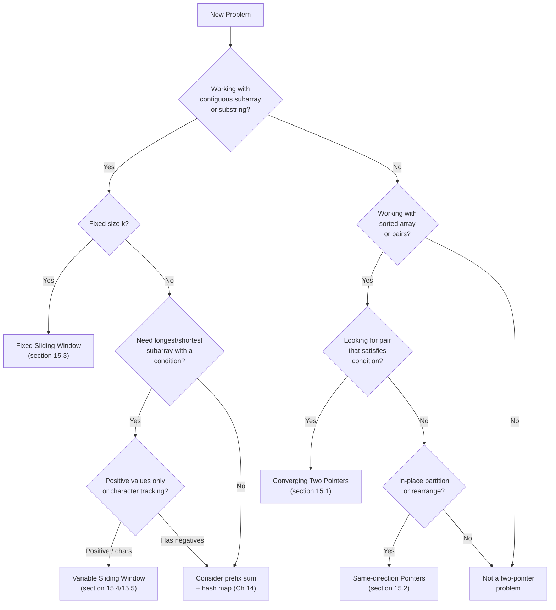
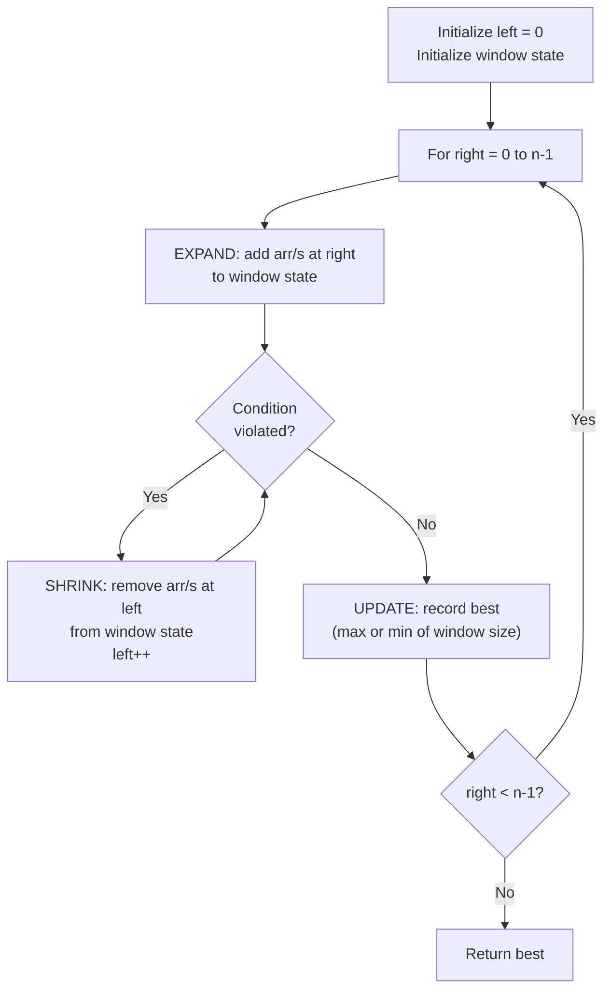

# Two Pointers & Sliding Window — The Caterpillar Method

## Chapter Goals

By the end of this chapter, you will:

- Understand the two-pointer technique and when to apply it to sorted and unsorted arrays
- Use converging pointers (from both ends) to find pairs, maximize areas, and trap water
- Use same-direction pointers (fast/slow) to partition arrays and remove elements in-place
- Master fixed-size sliding windows for computing sums, maxima, and averages over a window of size k
- Master variable-size sliding windows that expand and shrink to find optimal substrings and subarrays
- Combine sliding windows with hash maps for character frequency tracking (longest substring, minimum window)
- Solve classic problems: Container With Most Water, Trapping Rain Water, Three Sum, and Longest Substring Without Repeating Characters
- Recognize when a problem is a two-pointer or sliding window problem using the thinking flowchart

---

## The Story: "The Caterpillar"

Imagine a caterpillar sitting on a branch. The branch has numbers written on it — one number per leaf, stretching from left to right.

The caterpillar has a head and a tail. When it wants to explore more leaves, it **stretches its head forward** one leaf at a time. When it has seen enough, it **pulls its tail forward** to shrink. The caterpillar's body always covers a **contiguous segment** of leaves.

```
Branch:  [3] [1] [4] [1] [5] [9] [2] [6]

Step 1:  [3]                               tail=0, head=0
          ^
       caterpillar

Step 2:  [3] [1]                            tail=0, head=1
          ^^^^
       stretch head

Step 3:  [3] [1] [4]                        tail=0, head=2
          ^^^^^^^^^
       stretch head

Step 4:      [1] [4]                        tail=1, head=2
              ^^^^
       pull tail forward (shrink!)
```

The caterpillar is searching for the **perfect fit** — a segment of leaves that satisfies some condition. Maybe it wants the longest segment where the sum is at most 10. Or the shortest segment that contains all the vowels. Or a segment of exactly 3 leaves with the maximum sum.

This is the **sliding window** technique. The head pointer (right) stretches forward to explore. The tail pointer (left) catches up to maintain the constraint. Together, they scan the entire branch in one pass — O(n) instead of checking every possible segment (which would be O(n^2)).

But the caterpillar isn't the only creature on the branch. Sometimes, two butterflies sit at **opposite ends** of the branch and fly toward each other, meeting somewhere in the middle. That's the **converging two-pointer** technique — used when the data is sorted and you're searching for a pair that satisfies a condition.

Today, you'll master both the caterpillar (sliding window) and the butterflies (converging pointers).

---

## Johari Window: Before

Before diving in, take 5 minutes to fill out the **"Before"** section of your [Johari Window worksheet](johari.md).


Be honest with yourself! Knowing what you *don't* know is the first step to learning it. There are no wrong answers — only honest ones.


---

## Discovery

Before we explain the techniques formally, try these puzzles:

### Puzzle 1: "The Sorted Pair"

Given a **sorted** array `[1, 3, 5, 8, 12, 15]` and a target sum of 13, find two numbers that add up to 13.

You COULD check every pair — that's O(n^2). But the array is sorted. What if you start with two pointers — one at the beginning (`1`) and one at the end (`15`)?

- `1 + 15 = 16` — too big. What should you do?
- `1 + 12 = 13` — found it!


Because the array is sorted, if the sum is too big, moving the right pointer left makes the sum smaller. If the sum is too small, moving the left pointer right makes it bigger. This is the **converging two-pointer** technique, and it solves the problem in O(n). You'll learn it in section 15.1.


### Puzzle 2: "The Substring Challenge"

Find the length of the longest substring of `"abcabcbb"` that has no repeating characters.

Brute force: check every possible substring — O(n^3). But watch what happens with a sliding window:

```
"abcabcbb"
 ^^^       window = "abc", length = 3
  ^^^^     try to add 'a' — but 'a' is already in window!
   ^^^     shrink from left until no repeat, then expand again
```


The window expands right until a repeat is found, then shrinks from the left until the repeat is resolved. Every character is added and removed at most once, giving O(n) total. This is the **variable sliding window** technique from section 15.4.


### Puzzle 3: "The Fixed Window"

Given `[2, 1, 5, 1, 3, 2]` and k = 3, find the maximum sum of any 3 consecutive elements.

Brute force: for each starting position, sum the next 3 elements — O(nk). But what if you're already looking at `[2, 1, 5]` with sum 8? To slide to `[1, 5, 1]`, you just subtract the element that left (2) and add the element that entered (1): `8 - 2 + 1 = 7`. One subtraction and one addition instead of re-summing!


This is the **fixed-size sliding window** pattern from section 15.3. By maintaining a running computation, you do O(1) work per slide instead of O(k), giving O(n) total.


---

## 15.1 Two Pointers on Sorted Arrays — Converging Pointers

The simplest two-pointer pattern: place one pointer at the **start** and one at the **end** of a sorted array, then move them toward each other.

### The Core Idea

```
sorted:  [1, 3, 5, 8, 12, 15]     target = 13
          L                  R

sum = 1 + 15 = 16 > 13  →  move R left
          L             R

sum = 1 + 12 = 13 == target  →  FOUND! return [1, 12]
```

**Why it works**: If the sum is too large, moving R left reduces it (because the array is sorted, the next value to the left is smaller). If the sum is too small, moving L right increases it.

**Why it's O(n)**: Each step moves at least one pointer, and both pointers together travel at most n steps total.

### Template: Converging Two Pointers



```python
def two_pointer_sorted(arr, target):
    left, right = 0, len(arr) - 1
    while left < right:
        current = arr[left] + arr[right]
        if current == target:
            return [arr[left], arr[right]]  # found!
        elif current < target:
            left += 1    # need bigger sum
        else:
            right -= 1   # need smaller sum
    return [-1, -1]  # no pair found
```


```java
static int[] twoPointerSorted(int[] arr, int target) {
    int left = 0, right = arr.length - 1;
    while (left < right) {
        int current = arr[left] + arr[right];
        if (current == target) {
            return new int[]{arr[left], arr[right]};
        } else if (current < target) {
            left++;
        } else {
            right--;
        }
    }
    return new int[]{-1, -1};
}
```


```cpp
vector<int> twoPointerSorted(vector<int>& arr, int target) {
    int left = 0, right = (int)arr.size() - 1;
    while (left < right) {
        int current = arr[left] + arr[right];
        if (current == target) {
            return {arr[left], arr[right]};
        } else if (current < target) {
            left++;
        } else {
            right--;
        }
    }
    return {-1, -1};
}
```



> **Language Spotlight: Two-Pointer Basics**
> | | Python | Java | C++ |
> |---|--------|------|-----|
> | Init pointers | `left, right = 0, len(arr)-1` | `int left = 0, right = arr.length-1;` | `int left = 0, right = (int)arr.size()-1;` |
> | Return pair | `return [a, b]` | `return new int[]{a, b}` | `return {a, b}` |
> | Size cast needed? | No | No | Yes — `(int)arr.size()` |

---

## 15.2 Two Pointers for Partitioning

A second two-pointer pattern uses **same-direction** pointers: both start at the left, but one moves faster than the other.

### Pattern: Remove Element / Move Zeros

The "slow" pointer marks where the next valid element should go. The "fast" pointer scans through the array.

```
Move zeros to end of [0, 1, 0, 3, 12]:

fast -->
[0, 1, 0, 3, 12]
 s  f              arr[f]=1 != 0, swap arr[s] and arr[f], s++
[1, 0, 0, 3, 12]
    s     f        arr[f]=3 != 0, swap arr[s] and arr[f], s++
[1, 3, 0, 0, 12]
       s        f  arr[f]=12 != 0, swap arr[s] and arr[f], s++
[1, 3, 12, 0, 0]
           s        Done! All zeros are at the end.
```



```python
def move_zeros(arr):
    slow = 0
    for fast in range(len(arr)):
        if arr[fast] != 0:
            arr[slow], arr[fast] = arr[fast], arr[slow]
            slow += 1
    return arr
```


```java
static int[] moveZeros(int[] arr) {
    int slow = 0;
    for (int fast = 0; fast < arr.length; fast++) {
        if (arr[fast] != 0) {
            int temp = arr[slow];
            arr[slow] = arr[fast];
            arr[fast] = temp;
            slow++;
        }
    }
    return arr;
}
```


```cpp
vector<int> moveZeros(vector<int>& arr) {
    int slow = 0;
    for (int fast = 0; fast < (int)arr.size(); fast++) {
        if (arr[fast] != 0) {
            swap(arr[slow], arr[fast]);
            slow++;
        }
    }
    return arr;
}
```



### Pattern: Dutch National Flag (Three-Way Partition)

An array contains only 0s, 1s, and 2s. Sort it in one pass using THREE pointers:

```
[2, 0, 1, 2, 0, 1, 0]

low=0, mid=0, high=6

mid points to current element:
- If arr[mid] == 0: swap with arr[low], low++, mid++
- If arr[mid] == 1: just mid++
- If arr[mid] == 2: swap with arr[high], high-- (don't advance mid!)

Step by step:
[2,0,1,2,0,1,0]  mid=0, arr[mid]=2, swap with high → [0,0,1,2,0,1,2] high=5
[0,0,1,2,0,1,2]  mid=0, arr[mid]=0, swap with low  → [0,0,1,2,0,1,2] low=1,mid=1
[0,0,1,2,0,1,2]  mid=1, arr[mid]=0, swap with low  → [0,0,1,2,0,1,2] low=2,mid=2
[0,0,1,2,0,1,2]  mid=2, arr[mid]=1, just mid++     → mid=3
[0,0,1,2,0,1,2]  mid=3, arr[mid]=2, swap with high → [0,0,1,1,0,2,2] high=4
[0,0,1,1,0,2,2]  mid=3, arr[mid]=1, just mid++     → mid=4
[0,0,1,1,0,2,2]  mid=4, arr[mid]=0, swap with low  → [0,0,0,1,1,2,2] low=3,mid=5
mid > high → DONE!

Result: [0, 0, 0, 1, 1, 2, 2]
```



```python
def dutch_flag(arr):
    low, mid, high = 0, 0, len(arr) - 1
    while mid <= high:
        if arr[mid] == 0:
            arr[low], arr[mid] = arr[mid], arr[low]
            low += 1
            mid += 1
        elif arr[mid] == 1:
            mid += 1
        else:  # arr[mid] == 2
            arr[mid], arr[high] = arr[high], arr[mid]
            high -= 1
    return arr
```


```java
static int[] dutchFlag(int[] arr) {
    int low = 0, mid = 0, high = arr.length - 1;
    while (mid <= high) {
        if (arr[mid] == 0) {
            int temp = arr[low]; arr[low] = arr[mid]; arr[mid] = temp;
            low++; mid++;
        } else if (arr[mid] == 1) {
            mid++;
        } else {
            int temp = arr[mid]; arr[mid] = arr[high]; arr[high] = temp;
            high--;
        }
    }
    return arr;
}
```


```cpp
vector<int> dutchFlag(vector<int>& arr) {
    int low = 0, mid = 0, high = (int)arr.size() - 1;
    while (mid <= high) {
        if (arr[mid] == 0) {
            swap(arr[low], arr[mid]);
            low++; mid++;
        } else if (arr[mid] == 1) {
            mid++;
        } else {
            swap(arr[mid], arr[high]);
            high--;
        }
    }
    return arr;
}
```




**Why don't we advance `mid` when swapping with `high`?** Because the element that was at `high` hasn't been inspected yet — it might be a 0 that needs to go to the front. We must check it again before moving on.


---

## 15.3 Fixed-Size Sliding Window

When a problem asks about **all contiguous subarrays of size k**, the fixed-size sliding window is your tool.

### The Core Idea

Instead of recomputing the sum (or max, or count) for each window from scratch, **slide** the window by removing the element that leaves and adding the element that enters.

```
arr = [2, 1, 5, 1, 3, 2]    k = 3

Window 1: [2, 1, 5]        sum = 8
Window 2:    [1, 5, 1]     sum = 8 - 2 + 1 = 7
Window 3:       [5, 1, 3]  sum = 7 - 1 + 3 = 9   ← maximum!
Window 4:          [1, 3, 2] sum = 9 - 5 + 2 = 6
```

### Template: Fixed Window



```python
def max_sum_fixed_window(arr, k):
    if len(arr) < k:
        return 0

    # Build the first window
    window_sum = sum(arr[:k])
    best = window_sum

    # Slide: remove left element, add right element
    for i in range(k, len(arr)):
        window_sum += arr[i] - arr[i - k]
        best = max(best, window_sum)

    return best
```


```java
static int maxSumFixedWindow(int[] arr, int k) {
    if (arr.length < k) return 0;

    // Build the first window
    int windowSum = 0;
    for (int i = 0; i < k; i++) windowSum += arr[i];
    int best = windowSum;

    // Slide
    for (int i = k; i < arr.length; i++) {
        windowSum += arr[i] - arr[i - k];
        best = Math.max(best, windowSum);
    }
    return best;
}
```


```cpp
int maxSumFixedWindow(vector<int>& arr, int k) {
    if ((int)arr.size() < k) return 0;

    // Build the first window
    int windowSum = 0;
    for (int i = 0; i < k; i++) windowSum += arr[i];
    int best = windowSum;

    // Slide
    for (int i = k; i < (int)arr.size(); i++) {
        windowSum += arr[i] - arr[i - k];
        best = max(best, windowSum);
    }
    return best;
}
```



**Time**: O(n) — each element is added and removed exactly once.

**Space**: O(1) — just a few variables.

---

## 15.4 Variable-Size Sliding Window

When the problem says "find the longest/shortest subarray satisfying condition X", the window size isn't fixed — it grows and shrinks dynamically. This is the **caterpillar** in action.

### The Core Idea

```
Expand right pointer → include more elements → check condition
If condition breaks → shrink left pointer until condition holds again

              left       right
               |           |
        [ ... [xxxxxxxxxxx] ... ]
               <-- window -->
```

### Template: Variable Window (Longest Subarray)



```python
def longest_subarray_with_condition(arr):
    left = 0
    best = 0
    # state variables (e.g., current_sum, char_count, etc.)

    for right in range(len(arr)):
        # EXPAND: add arr[right] to window state

        # SHRINK: while condition is violated
        while condition_violated():
            # remove arr[left] from window state
            left += 1

        # UPDATE: window [left..right] is valid
        best = max(best, right - left + 1)

    return best
```


```java
static int longestSubarrayWithCondition(int[] arr) {
    int left = 0, best = 0;
    // state variables

    for (int right = 0; right < arr.length; right++) {
        // EXPAND: add arr[right] to window state

        // SHRINK: while condition is violated
        while (conditionViolated()) {
            // remove arr[left] from window state
            left++;
        }

        // UPDATE: window [left..right] is valid
        best = Math.max(best, right - left + 1);
    }
    return best;
}
```


```cpp
int longestSubarrayWithCondition(vector<int>& arr) {
    int left = 0, best = 0;
    // state variables

    for (int right = 0; right < (int)arr.size(); right++) {
        // EXPAND: add arr[right] to window state

        // SHRINK: while condition is violated
        while (conditionViolated()) {
            // remove arr[left] from window state
            left++;
        }

        // UPDATE: window [left..right] is valid
        best = max(best, right - left + 1);
    }
    return best;
}
```



### Example: Subarray Sum at Most K (positive integers only)



```python
def count_subarrays_sum_at_most_k(arr, k):
    """Count subarrays with sum <= k. All elements must be positive."""
    left = 0
    current_sum = 0
    count = 0

    for right in range(len(arr)):
        current_sum += arr[right]              # EXPAND

        while current_sum > k:                  # SHRINK
            current_sum -= arr[left]
            left += 1

        count += right - left + 1              # UPDATE
        # Every subarray ending at 'right' with start in [left..right] is valid

    return count
```


```java
static int countSubarraysSumAtMostK(int[] arr, int k) {
    int left = 0, currentSum = 0, count = 0;
    for (int right = 0; right < arr.length; right++) {
        currentSum += arr[right];
        while (currentSum > k) {
            currentSum -= arr[left];
            left++;
        }
        count += right - left + 1;
    }
    return count;
}
```


```cpp
int countSubarraysSumAtMostK(vector<int>& arr, int k) {
    int left = 0, currentSum = 0, count = 0;
    for (int right = 0; right < (int)arr.size(); right++) {
        currentSum += arr[right];
        while (currentSum > k) {
            currentSum -= arr[left];
            left++;
        }
        count += right - left + 1;
    }
    return count;
}
```




**The sliding window for sums only works with POSITIVE integers!** With negative numbers, shrinking the window might INCREASE the sum (removing a negative element), so the monotonicity property breaks. For arrays with negative numbers, use prefix sum + hash map (Ch 14) instead.


---

## 15.5 Sliding Window with Hash Map

Many string problems combine sliding windows with a hash map to track character frequencies inside the window.

### Longest Substring Without Repeating Characters



```python
def longest_unique_substring(s):
    char_index = {}  # char -> most recent index
    left = 0
    best = 0

    for right in range(len(s)):
        ch = s[right]
        if ch in char_index and char_index[ch] >= left:
            left = char_index[ch] + 1  # jump past the duplicate
        char_index[ch] = right
        best = max(best, right - left + 1)

    return best

# "abcabcbb"
# right=0: 'a', map={a:0}, window=[0,0], best=1
# right=1: 'b', map={a:0,b:1}, window=[0,1], best=2
# right=2: 'c', map={a:0,b:1,c:2}, window=[0,2], best=3
# right=3: 'a', 'a' at 0 >= left 0, left=1, map={a:3,b:1,c:2}, best=3
# right=4: 'b', 'b' at 1 >= left 1, left=2, best=3
# ...
# Answer: 3
```


```java
static int longestUniqueSubstring(String s) {
    Map<Character, Integer> charIndex = new HashMap<>();
    int left = 0, best = 0;

    for (int right = 0; right < s.length(); right++) {
        char ch = s.charAt(right);
        if (charIndex.containsKey(ch) && charIndex.get(ch) >= left) {
            left = charIndex.get(ch) + 1;
        }
        charIndex.put(ch, right);
        best = Math.max(best, right - left + 1);
    }
    return best;
}
```


```cpp
int longestUniqueSubstring(string s) {
    unordered_map<char, int> charIndex;
    int left = 0, best = 0;

    for (int right = 0; right < (int)s.size(); right++) {
        char ch = s[right];
        if (charIndex.count(ch) && charIndex[ch] >= left) {
            left = charIndex[ch] + 1;
        }
        charIndex[ch] = right;
        best = max(best, right - left + 1);
    }
    return best;
}
```



### Minimum Window Substring

Given strings `s` and `t`, find the shortest substring of `s` that contains all characters of `t`.

This is the hardest sliding window problem in this chapter. The strategy:

1. Build a frequency map of `t` (what we NEED).
2. Expand right to include characters. When a character's count in the window reaches its required count, increment a "formed" counter.
3. When all characters are formed, try shrinking from the left to minimize the window.



```python
def min_window(s, t):
    if not t or not s:
        return ""

    need = {}
    for c in t:
        need[c] = need.get(c, 0) + 1

    required = len(need)   # number of unique chars we need
    formed = 0             # number of unique chars at required count
    window = {}
    left = 0
    best_len = float('inf')
    best_start = 0

    for right in range(len(s)):
        ch = s[right]
        window[ch] = window.get(ch, 0) + 1

        if ch in need and window[ch] == need[ch]:
            formed += 1

        while formed == required:
            # Update best
            if right - left + 1 < best_len:
                best_len = right - left + 1
                best_start = left

            # Shrink from left
            out = s[left]
            window[out] -= 1
            if out in need and window[out] < need[out]:
                formed -= 1
            left += 1

    return "" if best_len == float('inf') else s[best_start:best_start + best_len]
```


```java
static String minWindow(String s, String t) {
    if (s.isEmpty() || t.isEmpty()) return "";

    Map<Character, Integer> need = new HashMap<>();
    for (char c : t.toCharArray())
        need.put(c, need.getOrDefault(c, 0) + 1);

    int required = need.size();
    int formed = 0;
    Map<Character, Integer> window = new HashMap<>();
    int left = 0, bestLen = Integer.MAX_VALUE, bestStart = 0;

    for (int right = 0; right < s.length(); right++) {
        char ch = s.charAt(right);
        window.put(ch, window.getOrDefault(ch, 0) + 1);

        if (need.containsKey(ch) && window.get(ch).intValue() == need.get(ch).intValue())
            formed++;

        while (formed == required) {
            if (right - left + 1 < bestLen) {
                bestLen = right - left + 1;
                bestStart = left;
            }
            char out = s.charAt(left);
            window.put(out, window.get(out) - 1);
            if (need.containsKey(out) && window.get(out) < need.get(out))
                formed--;
            left++;
        }
    }
    return bestLen == Integer.MAX_VALUE ? "" : s.substring(bestStart, bestStart + bestLen);
}
```


```cpp
string minWindow(string s, string t) {
    if (s.empty() || t.empty()) return "";

    unordered_map<char, int> need;
    for (char c : t) need[c]++;

    int required = need.size();
    int formed = 0;
    unordered_map<char, int> window;
    int left = 0, bestLen = INT_MAX, bestStart = 0;

    for (int right = 0; right < (int)s.size(); right++) {
        char ch = s[right];
        window[ch]++;

        if (need.count(ch) && window[ch] == need[ch])
            formed++;

        while (formed == required) {
            if (right - left + 1 < bestLen) {
                bestLen = right - left + 1;
                bestStart = left;
            }
            char out = s[left];
            window[out]--;
            if (need.count(out) && window[out] < need[out])
                formed--;
            left++;
        }
    }
    return bestLen == INT_MAX ? "" : s.substr(bestStart, bestLen);
}
```



---

## 15.6 The Container and the Rain — Classic Two-Pointer Problems

Two of the most famous interview/contest problems use converging two pointers with clever reasoning.

### Container With Most Water

Given an array of heights, find two vertical lines that, together with the x-axis, form a container holding the most water.

```
heights = [1, 8, 6, 2, 5, 4, 8, 3, 7]

     8  |        |           |
     7  |        |           |     |
     6  |  |     |           |     |
     5  |  |     |     |     |     |
     4  |  |     |     |  |  |     |
     3  |  |     |     |  |  |  |  |
     2  |  |  |  |     |  |  |  |  |
     1  |  |  |  |  |  |  |  |  |  |
        1  8  6  2  5  4  8  3  7

Area = width * min(left_height, right_height)
     = (right - left) * min(heights[left], heights[right])
```

**Key insight**: Start with the widest container (left=0, right=n-1). The only way to potentially get a BIGGER area is to find a TALLER minimum height. So move the pointer that has the shorter height — that's the only way to potentially increase the minimum.



```python
def container_most_water(heights):
    left, right = 0, len(heights) - 1
    best = 0

    while left < right:
        width = right - left
        h = min(heights[left], heights[right])
        best = max(best, width * h)

        if heights[left] < heights[right]:
            left += 1
        else:
            right -= 1

    return best
```


```java
static int containerMostWater(int[] heights) {
    int left = 0, right = heights.length - 1;
    int best = 0;
    while (left < right) {
        int width = right - left;
        int h = Math.min(heights[left], heights[right]);
        best = Math.max(best, width * h);
        if (heights[left] < heights[right]) left++;
        else right--;
    }
    return best;
}
```


```cpp
int containerMostWater(vector<int>& heights) {
    int left = 0, right = (int)heights.size() - 1;
    int best = 0;
    while (left < right) {
        int width = right - left;
        int h = min(heights[left], heights[right]);
        best = max(best, width * h);
        if (heights[left] < heights[right]) left++;
        else right--;
    }
    return best;
}
```



### Trapping Rain Water

Given bars of different heights, how much water can be trapped between them after rain?

```
heights = [0, 1, 0, 2, 1, 0, 1, 3, 2, 1, 2, 1]

          3       |
          2    |XX|X|  |
          1  |X||X||||X||
          0 ______________
             0 1 0 2 1 0 1 3 2 1 2 1

Water at each position = min(max_left, max_right) - height[i]
                         (if positive)
```

**Two-pointer approach**: Track `left_max` and `right_max`. Water at each position depends on the MINIMUM of the two maxima. Process whichever side has the smaller max.



```python
def trap_water(heights):
    if len(heights) < 3:
        return 0

    left, right = 0, len(heights) - 1
    left_max, right_max = heights[left], heights[right]
    water = 0

    while left < right:
        if left_max <= right_max:
            left += 1
            left_max = max(left_max, heights[left])
            water += left_max - heights[left]
        else:
            right -= 1
            right_max = max(right_max, heights[right])
            water += right_max - heights[right]

    return water
```


```java
static int trapWater(int[] heights) {
    if (heights.length < 3) return 0;
    int left = 0, right = heights.length - 1;
    int leftMax = heights[left], rightMax = heights[right];
    int water = 0;

    while (left < right) {
        if (leftMax <= rightMax) {
            left++;
            leftMax = Math.max(leftMax, heights[left]);
            water += leftMax - heights[left];
        } else {
            right--;
            rightMax = Math.max(rightMax, heights[right]);
            water += rightMax - heights[right];
        }
    }
    return water;
}
```


```cpp
int trapWater(vector<int>& heights) {
    if ((int)heights.size() < 3) return 0;
    int left = 0, right = (int)heights.size() - 1;
    int leftMax = heights[left], rightMax = heights[right];
    int water = 0;

    while (left < right) {
        if (leftMax <= rightMax) {
            left++;
            leftMax = max(leftMax, heights[left]);
            water += leftMax - heights[left];
        } else {
            right--;
            rightMax = max(rightMax, heights[right]);
            water += rightMax - heights[right];
        }
    }
    return water;
}
```



**Why the two-pointer approach works**: At any point, the water level at the current position is determined by the smaller of `left_max` and `right_max`. By processing the side with the smaller max, we KNOW the water level at that position — the other side is guaranteed to be at least as high.

---

## Think Like a Pro


**Errichto** (Kamil Debowski): "When I see 'find a pair in a sorted array' or 'optimal subarray/substring,' I immediately think two pointers or sliding window. The key is recognizing the MONOTONICITY — when one pointer moves, does the answer always move in one direction? If yes, two pointers will work. If expanding the window can only make the condition 'more satisfied' (or 'more violated'), that monotonicity means you never need to backtrack."

*Why this works*: Two pointers and sliding windows exploit the fact that the search space can be reduced from O(n^2) pairs/substrings to O(n) because of a monotonic relationship between pointer movement and the objective.



**Tourist** (Gennady Korotkevich): "The sliding window technique is really about maintaining an INVARIANT efficiently. As the right pointer moves, you update the window state in O(1). As the left pointer moves, you undo in O(1). The invariant is 'the window satisfies the condition.' If you can maintain the invariant with O(1) updates, you get an O(n) algorithm for free."

*Why this works*: The total work is bounded: each element enters the window once (O(n) total expand operations) and leaves once (O(n) total shrink operations), giving O(n) overall regardless of how the window bounces.


---

## Thinking Flowchart: "Is This a Two-Pointer / Sliding Window Problem?"



## Implementation Flowchart: "Sliding Window Template"



---

## AOPS Showcase: "Three Sum — From O(n^3) to O(n^2)"

Given an array of integers, find ALL unique triplets that sum to zero.

Example: `nums = [-1, 0, 1, 2, -1, -4]` -> `[[-1, -1, 2], [-1, 0, 1]]`

### Approach 1: Brute Force — O(n^3)

Check every triple (i, j, k). For each, check if `nums[i] + nums[j] + nums[k] == 0`.



```python
def three_sum_brute(nums):
    n = len(nums)
    result = set()
    for i in range(n):
        for j in range(i + 1, n):
            for k in range(j + 1, n):
                if nums[i] + nums[j] + nums[k] == 0:
                    triplet = tuple(sorted([nums[i], nums[j], nums[k]]))
                    result.add(triplet)
    return [list(t) for t in sorted(result)]
```


```java
static List<List<Integer>> threeSumBrute(int[] nums) {
    Set<List<Integer>> result = new TreeSet<>((a, b) -> {
        for (int i = 0; i < 3; i++) {
            if (!a.get(i).equals(b.get(i))) return a.get(i) - b.get(i);
        }
        return 0;
    });
    int n = nums.length;
    for (int i = 0; i < n; i++)
        for (int j = i + 1; j < n; j++)
            for (int k = j + 1; k < n; k++) {
                if (nums[i] + nums[j] + nums[k] == 0) {
                    List<Integer> t = Arrays.asList(nums[i], nums[j], nums[k]);
                    Collections.sort(t);
                    result.add(t);
                }
            }
    return new ArrayList<>(result);
}
```


```cpp
vector<vector<int>> threeSumBrute(vector<int>& nums) {
    set<vector<int>> result;
    int n = nums.size();
    for (int i = 0; i < n; i++)
        for (int j = i + 1; j < n; j++)
            for (int k = j + 1; k < n; k++) {
                if (nums[i] + nums[j] + nums[k] == 0) {
                    vector<int> t = {nums[i], nums[j], nums[k]};
                    sort(t.begin(), t.end());
                    result.insert(t);
                }
            }
    return vector<vector<int>>(result.begin(), result.end());
}
```



### Approach 2: Sort + Two Pointers — O(n^2)

1. **Sort** the array.
2. For each element `nums[i]`, use **two pointers** on the remaining elements to find pairs that sum to `-nums[i]`.
3. **Skip duplicates** to avoid duplicate triplets.

```
sorted: [-4, -1, -1, 0, 1, 2]

i=0: nums[i]=-4, target=4
     L=1, R=5: -1+2=1 < 4 → L++
     L=2, R=5: -1+2=1 < 4 → L++
     L=3, R=5: 0+2=2 < 4  → L++
     L=4, R=5: 1+2=3 < 4  → L++
     L=5 >= R → done

i=1: nums[i]=-1, target=1
     L=2, R=5: -1+2=1 == target → FOUND [-1,-1,2]!
       skip duplicate -1 at L, skip duplicate 2 at R
     L=3, R=4: 0+1=1 == target → FOUND [-1,0,1]!
     L=4 >= R → done

i=2: nums[i]=-1 == nums[1], SKIP (duplicate)

i=3: nums[i]=0, target=0
     L=4, R=5: 1+2=3 > 0 → R--
     L=4 >= R → done

Result: [[-1,-1,2], [-1,0,1]]
```



```python
def three_sum(nums):
    nums.sort()
    result = []
    n = len(nums)

    for i in range(n - 2):
        # Skip duplicate values of nums[i]
        if i > 0 and nums[i] == nums[i - 1]:
            continue

        # Early termination: if smallest possible sum > 0, stop
        if nums[i] > 0:
            break

        target = -nums[i]
        left, right = i + 1, n - 1

        while left < right:
            two_sum = nums[left] + nums[right]
            if two_sum == target:
                result.append([nums[i], nums[left], nums[right]])
                # Skip duplicates for left
                while left < right and nums[left] == nums[left + 1]:
                    left += 1
                # Skip duplicates for right
                while left < right and nums[right] == nums[right - 1]:
                    right -= 1
                left += 1
                right -= 1
            elif two_sum < target:
                left += 1
            else:
                right -= 1

    return result
```


```java
static List<List<Integer>> threeSum(int[] nums) {
    Arrays.sort(nums);
    List<List<Integer>> result = new ArrayList<>();
    int n = nums.length;

    for (int i = 0; i < n - 2; i++) {
        if (i > 0 && nums[i] == nums[i - 1]) continue;
        if (nums[i] > 0) break;

        int target = -nums[i];
        int left = i + 1, right = n - 1;

        while (left < right) {
            int twoSum = nums[left] + nums[right];
            if (twoSum == target) {
                result.add(Arrays.asList(nums[i], nums[left], nums[right]));
                while (left < right && nums[left] == nums[left + 1]) left++;
                while (left < right && nums[right] == nums[right - 1]) right--;
                left++; right--;
            } else if (twoSum < target) {
                left++;
            } else {
                right--;
            }
        }
    }
    return result;
}
```


```cpp
vector<vector<int>> threeSum(vector<int>& nums) {
    sort(nums.begin(), nums.end());
    vector<vector<int>> result;
    int n = nums.size();

    for (int i = 0; i < n - 2; i++) {
        if (i > 0 && nums[i] == nums[i - 1]) continue;
        if (nums[i] > 0) break;

        int target = -nums[i];
        int left = i + 1, right = n - 1;

        while (left < right) {
            int twoSum = nums[left] + nums[right];
            if (twoSum == target) {
                result.push_back({nums[i], nums[left], nums[right]});
                while (left < right && nums[left] == nums[left + 1]) left++;
                while (left < right && nums[right] == nums[right - 1]) right--;
                left++; right--;
            } else if (twoSum < target) {
                left++;
            } else {
                right--;
            }
        }
    }
    return result;
}
```



### Comparison Table

| Approach | Time | Space | Key Technique |
|----------|------|-------|---------------|
| Brute Force | O(n^3) | O(n) for dedup set | Three nested loops |
| Sort + Two Pointers | O(n^2) | O(1) extra* | Fix one, two-pointer the rest |

*O(1) extra beyond sorting and the result list.


**The duplicate-skipping logic is the trickiest part.** There are THREE places to skip duplicates: (1) skip `nums[i]` if it equals `nums[i-1]`, (2) after finding a triplet, skip `left` past duplicates, (3) after finding a triplet, skip `right` past duplicates. Missing any one of these will produce duplicate triplets in the output.


---

## Legend's Corner


**Petr Mitrichev** — one of the all-time greats of competitive programming, Google Code Jam champion, TopCoder legend. "Two pointers and sliding window are the bread and butter of USACO Silver problems. I'd estimate that at least 30% of Silver problems can be solved with some variation of these techniques. The key is to practice until the pattern becomes automatic — you shouldn't be thinking about the mechanics of the window; you should be thinking about the INVARIANT the window maintains."

**What you can learn**: Petr's advice is to internalize the templates until they're reflex. When you see a problem involving contiguous segments or sorted pairs, the two-pointer/sliding window idea should surface immediately. The hard part is figuring out WHAT the window tracks — the mechanics of expanding and shrinking should be automatic.


---

## Gotchas


**Gotcha 1: Sliding window only works for positive arrays when tracking sums!**

If the array contains negative numbers, shrinking the window might INCREASE the sum. The monotonicity property breaks, and the window might need to backtrack. Use prefix sum + hash map (Ch 14) for arrays with negative numbers.

```python
# WRONG for negatives: sliding window for "subarray sum equals k"
arr = [1, -1, 5, -2, 3]  # removing -1 would INCREASE the sum!

# RIGHT for negatives: prefix sum + hash map
```



**Gotcha 2: Off-by-one in window boundaries!**

A window from index `left` to `right` has length `right - left + 1`, not `right - left`. This is the most common two-pointer bug.

```python
# WRONG: length = right - left
# RIGHT: length = right - left + 1
```



**Gotcha 3: Forgetting to sort first for converging two pointers!**

Converging two pointers ONLY work on sorted arrays. If the array isn't sorted, the "move the smaller pointer" logic doesn't hold.

```python
# WRONG: applying converging pointers to unsorted array
arr = [5, 1, 3, 8]  # moving left++ doesn't guarantee bigger sums!

# RIGHT: sort first, then use two pointers
arr.sort()  # [1, 3, 5, 8]
```



**Gotcha 4: Window never shrinks (infinite loop)!**

If your shrink condition never triggers, the left pointer stays at 0 forever. Always check that your shrink condition will eventually be met.

```python
# DANGEROUS: if arr has all zeros and k > 0
# while current_sum > k never triggers → left never moves
# But this is fine — it just means the whole window is valid
```



**Gotcha 5: Duplicate handling in Three Sum!**

You must skip duplicates at THREE points: (1) for the outer loop variable, (2) for the left pointer after finding a match, (3) for the right pointer after finding a match. Missing any one produces duplicate triplets.

```python
# All three skip-duplicate lines are REQUIRED:
if i > 0 and nums[i] == nums[i-1]: continue          # (1)
while left < right and nums[left] == nums[left+1]: left += 1    # (2)
while left < right and nums[right] == nums[right-1]: right -= 1 # (3)
```



**Gotcha 6: Empty or single-element edge cases!**

Two-pointer and window algorithms often assume the array has at least 2 elements. Always handle edge cases:

```python
if len(arr) < 2:
    return default_value  # handle before starting pointers
```


---

## Practice Problems

| # | Name | Difficulty | Key Concept |
|---|------|-----------|-------------|
| W1 | Pair Sum in Sorted Array | ⭐ | Converging two pointers |
| W2 | Remove Duplicates from Sorted | ⭐ | Same-direction two pointers |
| W3 | Max Sum of Fixed Window | ⭐ | Fixed sliding window |
| W4 | Move Zeros to End | ⭐ | Same-direction partitioning |
| P1 | Container With Most Water | ⭐⭐ | Converging pointers, move shorter |
| P2 | Longest Substring Without Repeating | ⭐⭐ | Variable window + hash map |
| P3 | Minimum Window Substring | ⭐⭐ | Variable window + frequency map |
| P4 | Subarray Sum Equals K | ⭐⭐ | Sliding window for positive arrays |
| P5 | Dutch National Flag | ⭐⭐ | Three-way partition |
| C1 | Three Sum | ⭐⭐⭐ | Sort + two pointers, skip duplicates |
| C2 | Trapping Rain Water | ⭐⭐⭐ | Two-pointer with left/right max |
| C3 | Longest Repeating Character Replacement | ⭐⭐⭐ | Sliding window + max frequency |
| C4 | Fruit Into Baskets | ⭐⭐⭐ | Sliding window, at most 2 distinct |

---

## Language Idioms



```python
# ── Two-pointer initialization ──
left, right = 0, len(arr) - 1  # converging
slow = fast = 0                  # same-direction

# ── Swapping elements ──
arr[i], arr[j] = arr[j], arr[i]  # Pythonic swap (no temp needed)

# ── Slicing for window sum (only for small k) ──
window_sum = sum(arr[i:i+k])  # O(k) — use running sum for O(1)

# ── defaultdict for character counting ──
from collections import defaultdict
freq = defaultdict(int)
for c in s:
    freq[c] += 1

# ── Counter for quick frequency maps ──
from collections import Counter
need = Counter(t)  # frequency map of target string
```


```java
// ── Two-pointer initialization ──
int left = 0, right = arr.length - 1;  // converging
int slow = 0;                           // same-direction (fast is loop var)

// ── Swapping elements ──
int temp = arr[i]; arr[i] = arr[j]; arr[j] = temp;
// No built-in swap for array elements

// ── Character frequency array (faster than HashMap for ASCII) ──
int[] freq = new int[128];  // covers all ASCII
for (char c : s.toCharArray()) freq[c]++;

// ── HashMap for frequency ──
Map<Character, Integer> map = new HashMap<>();
map.put(c, map.getOrDefault(c, 0) + 1);

// ── Comparing Integer objects ──
// WRONG: window.get(ch) == need.get(ch)  // reference comparison!
// RIGHT: window.get(ch).intValue() == need.get(ch).intValue()
```


```cpp
// ── Two-pointer initialization ──
int left = 0, right = (int)arr.size() - 1;  // converging
int slow = 0;                                 // same-direction

// ── Swapping elements ──
swap(arr[i], arr[j]);  // built-in swap

// ── Character frequency array (faster than unordered_map) ──
int freq[128] = {};  // zero-initialized, covers ASCII
for (char c : s) freq[c]++;

// ── unordered_map for frequency ──
unordered_map<char, int> window;
window[c]++;  // auto-creates with 0 if missing

// ── Size as int (avoid signed/unsigned comparison warning) ──
for (int i = 0; i < (int)arr.size(); i++) { ... }
```



---

## Breadcrumbs

### Looking Back
- **Ch 8** (Sorting): The merge step in merge sort uses two pointers — one in each sorted half. That was your first encounter with this technique!
- **Ch 9** (Binary Search): Binary search is an alternative to two pointers for finding elements in sorted arrays, but two pointers are more flexible for finding PAIRS
- **Ch 11** (Hashing): Sliding window + hash map combines the O(1) lookups from Ch 11 with the window technique from this chapter
- **Ch 14** (Prefix Sums): Prefix sums solve some of the same problems as sliding windows, but work even with negative numbers. The trade-off: prefix sums use O(n) space, sliding windows use O(1)

### Looking Forward
- **Ch 17** (Heaps): Heaps can optimize certain window operations — finding the max in a sliding window in O(log n) per step
- **Ch 21** (Linked Lists): The slow/fast pointer technique returns as the "tortoise and hare" for cycle detection in linked lists
- **Ch 29** (Union-Find & MST): Merge operations in Kruskal's algorithm use a two-pointer-like scan through sorted edges

### Cross-Chapter Threads
- **"Two pointers everywhere"**: This thread started with merge sort's merge step (Ch 8), appeared as an alternative to binary search (Ch 9), and is now the CORE topic. It will return as slow/fast pointers in linked lists (Ch 21) and merge operations in advanced algorithms (Ch 29).
- **"Trade space for time"**: Sliding window is the OPPOSITE trade — it uses O(1) space by maintaining a running computation instead of storing everything. Compare with prefix sums (O(n) space) and hash maps (O(n) space).
- **"Sort first, think later"**: Three Sum requires sorting first. Container With Most Water doesn't. Knowing when sorting enables two pointers is a key skill.

---

## Johari Window: After

Now fill out the **"After"** section of your [Johari Window worksheet](johari.md). Compare your "Before" and "After" answers — what surprised you? What do you still want to explore?

---

## Open Questions Beyond

1. **"We used a sliding window to find the max sum of k consecutive elements. What if we want the max ELEMENT in the window, not the sum? Can we do it in O(1) per slide?"** Hint: there's a data structure called a **monotonic deque** that maintains the maximum in a sliding window in amortized O(1). You'll see it in Ch 22 (Stacks & Queues).

2. **"The two-pointer technique works because of MONOTONICITY. Are there problems that LOOK like two-pointer problems but aren't, because monotonicity doesn't hold?"** Yes! Any problem where expanding the window can both improve AND worsen the answer (like sum with negatives) breaks the technique. Recognizing this boundary is a key skill.

3. **"We fixed one element in Three Sum and used two pointers for the remaining pair. Could we fix TWO elements and use something for the third? What about Four Sum?"** Yes! Four Sum fixes one element, then reduces to Three Sum. The pattern generalizes to k-Sum with O(n^(k-1)) time. But for k >= 3, there are also approaches using hash maps that are sometimes faster in practice.

---

## What's Next

You've mastered the caterpillar's stretch-and-shrink strategy and the butterflies' converging flight. Two pointers and sliding windows are among the most frequently tested techniques in USACO Silver — you'll use them again and again.

But what if the search space isn't an array at all? What if you need to search on the ANSWER itself? "Is it possible to ship all packages in 5 days? How about 4? How about 3?" This is **binary search on answers** — and it's the subject of Ch 16 (**Binary Search Beyond Arrays — Searching on Answers**). You already know binary search finds elements in sorted arrays. Now you'll learn to binary search on the ANSWER SPACE, turning optimization problems into yes/no decisions.

The Goldilocks method awaits!
