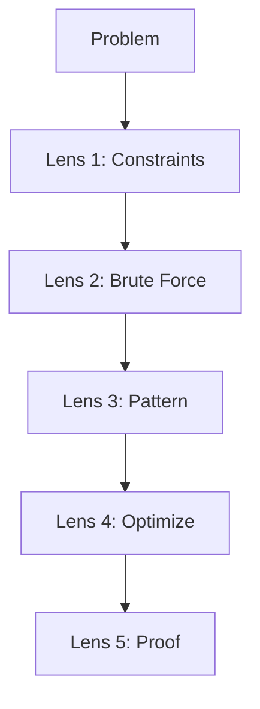
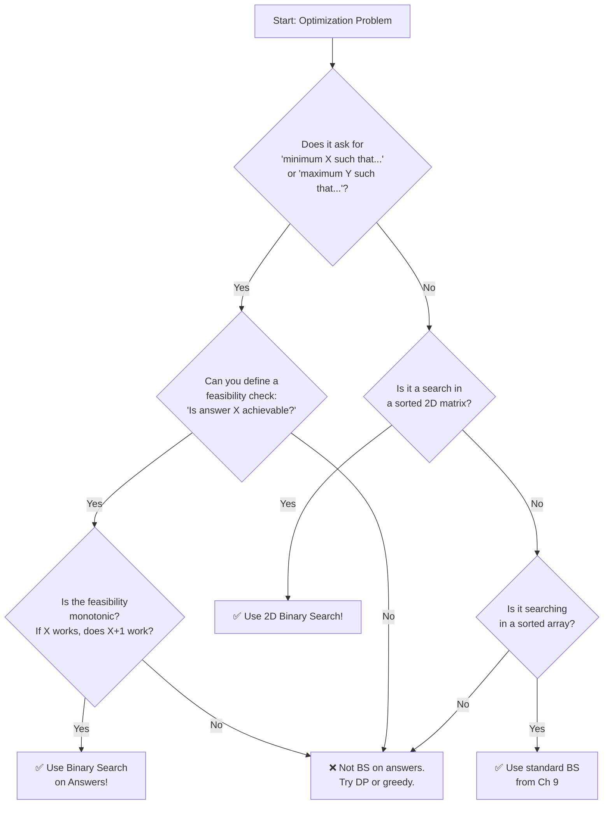

# Binary Search Beyond Arrays — Searching on Answers

## Chapter Goals

By the end of this chapter, you will:

- Understand the paradigm shift from "binary search on arrays" to "binary search on the answer space"
- Transform optimization problems ("find the minimum X") into decision problems ("is X achievable?")
- Apply binary search on answers to classic problems: square root, Koko eating bananas, shipping packages, painter's partition
- Write a `feasible(mid)` predicate function and binary search over the answer range
- Search in 2D sorted matrices by treating them as virtual 1D arrays or by binary searching each row
- Solve the Aggressive Cows problem by binary searching on the minimum distance between cows
- Find the median and kth element of two sorted arrays using binary search on partitions
- Recognize the monotonicity property that makes binary search on answers work
- Prove that a predicate is monotonic (all TRUEs come before all FALSEs, or vice versa)
- Use the decision flowchart to identify when binary search on answers applies

---

## The Story: "The Goldilocks Method"

Once upon a time, Goldilocks wandered into a house with a long hallway of numbered doors. Behind each door was a bowl of porridge. The bowls were arranged in order: Door 1 had the coldest porridge, and Door 100 had the hottest.

Goldilocks wanted the porridge that was **just right** — not too cold, not too hot. She could have tasted every single bowl from Door 1 to Door 100. That would take 100 tastings. But Goldilocks was clever.

She went to Door 50 first. "Too cold." So she knew Doors 1-50 were all too cold.

She went to Door 75. "Too hot." So Doors 75-100 were all too hot.

Door 62. "Too cold." Door 68. "Too hot." Door 65. "Just right!"

In just 7 tastings, Goldilocks found her perfect porridge out of 100 doors. She used **binary search** — but not on an array. She searched on the **answer space** (door numbers 1 to 100).

```
Door:  1 ................. 50 .......... 62 ... 65 ... 68 .......... 75 ................. 100
       [--- too cold ----][-- cold --][cold][JUST RIGHT][hot][-- hot --][---- too hot ----]

       Binary search narrows the range:
       Step 1: Try 50  → too cold  → search [51, 100]
       Step 2: Try 75  → too hot   → search [51, 74]
       Step 3: Try 62  → too cold  → search [63, 74]
       Step 4: Try 68  → too hot   → search [63, 67]
       Step 5: Try 65  → just right!
```

This is the **Goldilocks method**: instead of searching for an element IN a sorted array, you search for the best ANSWER in a range of possible answers. For each candidate answer, you ask a yes/no question: "Is this feasible?" The feasibility answers are monotonic — all the "yes" answers are on one side, all the "no" answers are on the other — so binary search works perfectly.

This technique is so powerful that it appears in almost every USACO Silver contest. Today, you'll learn to wield it.

---

## Johari Window: Before

Before diving in, take 5 minutes to fill out the **"Before"** section of your [Johari Window worksheet](johari.md).


Be honest with yourself! Knowing what you *don't* know is the first step to learning it. There are no wrong answers — only honest ones.


---

## Discovery

Before we explain the technique formally, try these puzzles:

### Puzzle 1: "The Lazy Square Root"

You need to compute the **integer square root** of 49 — the largest integer whose square is at most 49. You don't have a sqrt function. But you can check: is `mid * mid <= 49`?

- Try mid = 25: 25*25 = 625 > 49. Too big.
- Try mid = 12: 12*12 = 144 > 49. Still too big.
- Try mid = 6: 6*6 = 36 <= 49. Works! But is there something bigger?
- Try mid = 9: 9*9 = 81 > 49. Too big.
- Try mid = 7: 7*7 = 49 <= 49. Works!
- Try mid = 8: 8*8 = 64 > 49. Too big.

Answer: 7. We binary searched on the answer space [0, 49] instead of searching in an array.


Notice the key insight: for any number x, either `x*x <= n` (feasible) or `x*x > n` (not feasible). All feasible answers are on the LEFT side (small numbers), and all infeasible answers are on the RIGHT side (big numbers). This monotonicity is what makes binary search work!


### Puzzle 2: "The Hungry Monkey"

A monkey has piles of bananas: `[3, 6, 7, 11]`. It eats at a speed of `k` bananas per hour (it finishes one pile before starting the next, and each pile takes `ceil(pile/k)` hours). The zookeeper returns in `H = 8` hours. What is the **minimum** eating speed `k` so the monkey finishes all bananas in time?

- k = 11: hours = 1+1+1+1 = 4 <= 8. Works, but can we go slower?
- k = 6: hours = 1+1+2+2 = 6 <= 8. Still works!
- k = 3: hours = 1+2+3+4 = 10 > 8. Too slow!
- k = 4: hours = 1+2+2+3 = 8 <= 8. Works!

The answer is k = 4. Again, we searched on the answer space [1, 11].


The answer space is the range of possible eating speeds: from 1 (slowest) to max(piles) (fastest needed). For each candidate speed `k`, we ask: "Can the monkey finish in H hours?" This is a YES/NO question, and the answers are monotonic: if speed k works, then speed k+1 also works. Binary search finds the minimum k that works.


### Puzzle 3: "The Matrix Hunt"

Given a 4x4 matrix where each row is sorted and the first element of each row is greater than the last element of the previous row:

```
[  1,  3,  5,  7 ]
[ 10, 11, 16, 20 ]
[ 23, 30, 34, 60 ]
[ 61, 62, 67, 70 ]
```

Can you find the number 30 without checking every cell?

Think of the matrix as a single sorted array of 16 elements: `[1, 3, 5, 7, 10, 11, 16, 20, 23, 30, 34, 60, 61, 62, 67, 70]`. Position 9 (0-indexed) maps to row `9 // 4 = 2`, col `9 % 4 = 1`. That's `matrix[2][1] = 30`. Found it with standard binary search!


A fully sorted matrix is just a sorted array in disguise. The mapping is: `row = index // cols, col = index % cols`. This lets you apply standard binary search in O(log(rows * cols)) time. You'll learn this in section 16.4.


---

## 16.1 Binary Search on Answers — The Paradigm Shift

In Ch 9, you learned binary search as a way to find elements in a sorted array. But the real power of binary search is much bigger. Binary search works whenever you have a **monotonic predicate** — a yes/no question where the answers look like:

```
Answer:    1   2   3   4   5   6   7   8   9  10
Feasible?  N   N   N   Y   Y   Y   Y   Y   Y   Y
```

All the NOs are on the left, all the YESes are on the right (or vice versa). Binary search finds the boundary — the first YES (or the last YES, depending on the problem).

### The Template

Every "binary search on answers" problem follows this template:

1. **Define the search space**: What are the minimum and maximum possible answers?
2. **Write a feasibility check**: Given a candidate answer `mid`, can we achieve this?
3. **Binary search**: Narrow the range until you find the optimal answer.



```python
def binary_search_on_answer(lo, hi):
    """Find the minimum feasible answer in [lo, hi]."""
    while lo < hi:
        mid = lo + (hi - lo) // 2
        if feasible(mid):
            hi = mid          # mid works — try smaller
        else:
            lo = mid + 1      # mid doesn't work — need bigger
    return lo

def feasible(candidate):
    """Return True if 'candidate' is a valid answer."""
    # Problem-specific logic here
    pass
```


```java
static int binarySearchOnAnswer(int lo, int hi) {
    while (lo < hi) {
        int mid = lo + (hi - lo) / 2;
        if (feasible(mid)) {
            hi = mid;
        } else {
            lo = mid + 1;
        }
    }
    return lo;
}

static boolean feasible(int candidate) {
    // Problem-specific logic here
    return false;
}
```


```cpp
int binarySearchOnAnswer(int lo, int hi) {
    while (lo < hi) {
        int mid = lo + (hi - lo) / 2;
        if (feasible(mid)) {
            hi = mid;
        } else {
            lo = mid + 1;
        }
    }
    return lo;
}

bool feasible(int candidate) {
    // Problem-specific logic here
    return false;
}
```



### Two Variants

| Goal | Loop condition | When feasible | When not feasible |
|------|---------------|---------------|-------------------|
| Find **minimum** feasible | `lo < hi` | `hi = mid` | `lo = mid + 1` |
| Find **maximum** feasible | `lo < hi` | `lo = mid` | `hi = mid - 1` |


**Watch out for infinite loops with "find maximum"!** When using `lo = mid`, you must compute `mid = lo + (hi - lo + 1) / 2` (round UP instead of down). Otherwise when `lo + 1 == hi`, mid equals lo, and the loop never terminates. This is the #1 binary search bug.


### Why It Works: Monotonicity

Binary search on answers works because of the **monotonicity property**:

> If candidate `x` is feasible, then all values "beyond" x (larger or smaller, depending on the problem) are also feasible.

For "find minimum feasible": if x works, then x+1, x+2, ... all work too.
For "find maximum feasible": if x works, then x-1, x-2, ... all work too.

This creates the NNNNYYYY (or YYYYNNNN) pattern that binary search requires.

---

## 16.2 Koko Eating Bananas — Your First BS-on-Answers Problem

**Problem**: Koko loves bananas. There are `n` piles with `piles[i]` bananas. A guard returns in `h` hours. Each hour, Koko picks a pile and eats `k` bananas from it. If the pile has fewer than `k` bananas, she eats all of them and waits. Find the minimum `k` such that Koko finishes all bananas in `h` hours.

### Step-by-Step Thinking

1. **What is the answer?** The eating speed `k`.
2. **What is the search space?** From `k=1` (slowest) to `k=max(piles)` (fastest needed).
3. **What is the feasibility check?** For speed `k`, compute total hours = sum of `ceil(pile/k)` for each pile. Feasible if total <= h.
4. **Is it monotonic?** YES! If speed `k` finishes in time, speed `k+1` also finishes in time (eating faster can only help).

### Walkthrough

```
piles = [3, 6, 7, 11], h = 8

Search space: [1, 11]

mid = 6:  hours = ceil(3/6) + ceil(6/6) + ceil(7/6) + ceil(11/6)
               = 1 + 1 + 2 + 2 = 6 <= 8  ✓  → try smaller (hi = 6)

mid = 3:  hours = ceil(3/3) + ceil(6/3) + ceil(7/3) + ceil(11/3)
               = 1 + 2 + 3 + 4 = 10 > 8  ✗  → need bigger (lo = 4)

mid = 5:  hours = 1 + 2 + 2 + 3 = 8 <= 8  ✓  → try smaller (hi = 5)

mid = 4:  hours = 1 + 2 + 2 + 3 = 8 <= 8  ✓  → try smaller (hi = 4)

lo == hi == 4  → answer is 4
```



```python
import math

def solve(piles: list[int], h: int) -> int:
    def feasible(k):
        hours = sum(math.ceil(p / k) for p in piles)
        return hours <= h

    lo, hi = 1, max(piles)
    while lo < hi:
        mid = lo + (hi - lo) // 2
        if feasible(mid):
            hi = mid
        else:
            lo = mid + 1
    return lo
```


```java
public static int solve(int[] piles, int h) {
    int lo = 1, hi = 0;
    for (int p : piles) hi = Math.max(hi, p);

    while (lo < hi) {
        int mid = lo + (hi - lo) / 2;
        if (feasible(piles, mid, h)) {
            hi = mid;
        } else {
            lo = mid + 1;
        }
    }
    return lo;
}

static boolean feasible(int[] piles, int k, int h) {
    int hours = 0;
    for (int p : piles) hours += (p + k - 1) / k;  // ceil division
    return hours <= h;
}
```


```cpp
bool feasible(vector<int>& piles, int k, int h) {
    int hours = 0;
    for (int p : piles) hours += (p + k - 1) / k;
    return hours <= h;
}

int solve(vector<int>& piles, int h) {
    int lo = 1, hi = *max_element(piles.begin(), piles.end());
    while (lo < hi) {
        int mid = lo + (hi - lo) / 2;
        if (feasible(piles, mid, h)) hi = mid;
        else lo = mid + 1;
    }
    return lo;
}
```



### Comparison Table

| Approach | Time | Space | Notes |
|----------|------|-------|-------|
| Linear scan k=1..max | O(max * n) | O(1) | Check every speed |
| Binary search on k | O(n * log(max)) | O(1) | Check O(log max) speeds, each in O(n) |


**The ceiling division trick**: `ceil(a/b)` equals `(a + b - 1) / b` using integer math. This avoids floating-point issues. In Python you can also use `math.ceil(a / b)` or `-(-a // b)`.


---

## 16.3 Ship Packages Within D Days

**Problem**: Packages on a conveyor belt have weights `weights[i]`. You must ship them IN ORDER within `d` days. Each day, you load packages sequentially until the next package would exceed the ship's capacity. Find the **minimum** ship capacity.

### Thinking Through It

1. **Answer**: Ship capacity `cap`.
2. **Search space**: From `max(weights)` (must carry the heaviest package) to `sum(weights)` (carry everything in one day).
3. **Feasibility**: Given capacity `cap`, greedily load packages day by day. Count days needed. Feasible if days <= d.
4. **Monotonic?** YES! More capacity means fewer days needed.



```python
def solve(weights: list[int], d: int) -> int:
    def feasible(cap):
        days, current_load = 1, 0
        for w in weights:
            if current_load + w > cap:
                days += 1
                current_load = 0
            current_load += w
        return days <= d

    lo, hi = max(weights), sum(weights)
    while lo < hi:
        mid = lo + (hi - lo) // 2
        if feasible(mid):
            hi = mid
        else:
            lo = mid + 1
    return lo
```


```java
public static int solve(int[] weights, int d) {
    int lo = 0, hi = 0;
    for (int w : weights) { lo = Math.max(lo, w); hi += w; }
    while (lo < hi) {
        int mid = lo + (hi - lo) / 2;
        if (feasible(weights, mid, d)) hi = mid;
        else lo = mid + 1;
    }
    return lo;
}

static boolean feasible(int[] weights, int cap, int d) {
    int days = 1, load = 0;
    for (int w : weights) {
        if (load + w > cap) { days++; load = 0; }
        load += w;
    }
    return days <= d;
}
```


```cpp
bool feasible(vector<int>& weights, int cap, int d) {
    int days = 1, load = 0;
    for (int w : weights) {
        if (load + w > cap) { days++; load = 0; }
        load += w;
    }
    return days <= d;
}

int solve(vector<int>& weights, int d) {
    int lo = *max_element(weights.begin(), weights.end());
    int hi = 0;
    for (int w : weights) hi += w;
    while (lo < hi) {
        int mid = lo + (hi - lo) / 2;
        if (feasible(weights, mid, d)) hi = mid;
        else lo = mid + 1;
    }
    return lo;
}
```



### Comparison Table

| Approach | Time | Space | Notes |
|----------|------|-------|-------|
| Try every capacity | O(sum * n) | O(1) | Brute force |
| Binary search on capacity | O(n * log(sum)) | O(1) | Optimal |

---

## 16.4 2D Binary Search — Searching in Matrices

### Search in a Sorted Matrix

When a matrix has the property that rows are sorted AND the first element of each row is greater than the last element of the previous row, the entire matrix is one long sorted array.

**Key insight**: Map between 1D index and 2D coordinates:
- `row = index // cols`
- `col = index % cols`



```python
def solve(matrix: list[list[int]], target: int) -> list[int]:
    if not matrix or not matrix[0]:
        return [-1, -1]
    rows, cols = len(matrix), len(matrix[0])
    lo, hi = 0, rows * cols - 1
    while lo <= hi:
        mid = lo + (hi - lo) // 2
        val = matrix[mid // cols][mid % cols]
        if val == target:
            return [mid // cols, mid % cols]
        elif val < target:
            lo = mid + 1
        else:
            hi = mid - 1
    return [-1, -1]
```


```java
public static int[] solve(int[][] matrix, int target) {
    if (matrix.length == 0 || matrix[0].length == 0) return new int[]{-1, -1};
    int rows = matrix.length, cols = matrix[0].length;
    int lo = 0, hi = rows * cols - 1;
    while (lo <= hi) {
        int mid = lo + (hi - lo) / 2;
        int val = matrix[mid / cols][mid % cols];
        if (val == target) return new int[]{mid / cols, mid % cols};
        else if (val < target) lo = mid + 1;
        else hi = mid - 1;
    }
    return new int[]{-1, -1};
}
```


```cpp
vector<int> solve(vector<vector<int>>& matrix, int target) {
    if (matrix.empty() || matrix[0].empty()) return {-1, -1};
    int rows = matrix.size(), cols = matrix[0].size();
    int lo = 0, hi = rows * cols - 1;
    while (lo <= hi) {
        int mid = lo + (hi - lo) / 2;
        int val = matrix[mid / cols][mid % cols];
        if (val == target) return {mid / cols, mid % cols};
        else if (val < target) lo = mid + 1;
        else hi = mid - 1;
    }
    return {-1, -1};
}
```



### Row with Maximum 1s

Given a binary matrix where each row is sorted (all 0s come before all 1s), find the row with the maximum number of 1s.

**Approach**: For each row, binary search for the first 1. The row where the first 1 appears earliest has the most 1s.



```python
def solve(matrix: list[list[int]]) -> int:
    if not matrix or not matrix[0]:
        return -1
    best_row, best_count = -1, 0
    cols = len(matrix[0])
    for i, row in enumerate(matrix):
        # Binary search for first 1
        lo, hi = 0, cols
        while lo < hi:
            mid = lo + (hi - lo) // 2
            if row[mid] == 1:
                hi = mid
            else:
                lo = mid + 1
        count = cols - lo
        if count > best_count:
            best_count = count
            best_row = i
    return best_row
```


```java
public static int solve(int[][] matrix) {
    if (matrix.length == 0 || matrix[0].length == 0) return -1;
    int bestRow = -1, bestCount = 0;
    int cols = matrix[0].length;
    for (int i = 0; i < matrix.length; i++) {
        int lo = 0, hi = cols;
        while (lo < hi) {
            int mid = lo + (hi - lo) / 2;
            if (matrix[i][mid] == 1) hi = mid;
            else lo = mid + 1;
        }
        int count = cols - lo;
        if (count > bestCount) { bestCount = count; bestRow = i; }
    }
    return bestRow;
}
```


```cpp
int solve(vector<vector<int>>& matrix) {
    if (matrix.empty() || matrix[0].empty()) return -1;
    int bestRow = -1, bestCount = 0;
    int cols = matrix[0].size();
    for (int i = 0; i < (int)matrix.size(); i++) {
        int lo = 0, hi = cols;
        while (lo < hi) {
            int mid = lo + (hi - lo) / 2;
            if (matrix[i][mid] == 1) hi = mid;
            else lo = mid + 1;
        }
        int count = cols - lo;
        if (count > bestCount) { bestCount = count; bestRow = i; }
    }
    return bestRow;
}
```



---

## 16.5 Advanced BS on Answers — Aggressive Cows and Painter's Partition

### Aggressive Cows

**Problem**: Place `c` cows in `n` stalls (at given positions) so that the **minimum distance** between any two cows is **maximized**.

This is a classic USACO-style problem. The key insight: instead of asking "where should I place the cows?", ask "can I place all cows such that every pair is at least `d` apart?"

1. **Answer**: The minimum distance `d` between cows.
2. **Search space**: From `0` to `max(positions) - min(positions)`.
3. **Feasibility**: Sort stalls. Greedily place cows: place the first cow at the first stall, then place each subsequent cow at the first stall that is at least `d` away from the previous cow. Feasible if you can place all `c` cows.
4. **Monotonic?** YES! If you can place cows with minimum gap `d`, you can certainly place them with minimum gap `d-1` (less restrictive).



```python
def solve(stalls: list[int], cows: int) -> int:
    stalls.sort()

    def feasible(min_dist):
        count, last = 1, stalls[0]
        for i in range(1, len(stalls)):
            if stalls[i] - last >= min_dist:
                count += 1
                last = stalls[i]
                if count >= cows:
                    return True
        return False

    lo, hi = 1, stalls[-1] - stalls[0]
    while lo < hi:
        mid = lo + (hi - lo + 1) // 2  # round UP for "find maximum"
        if feasible(mid):
            lo = mid
        else:
            hi = mid - 1
    return lo
```


```java
public static int solve(int[] stalls, int cows) {
    Arrays.sort(stalls);
    int lo = 1, hi = stalls[stalls.length - 1] - stalls[0];
    while (lo < hi) {
        int mid = lo + (hi - lo + 1) / 2;
        if (feasible(stalls, cows, mid)) lo = mid;
        else hi = mid - 1;
    }
    return lo;
}

static boolean feasible(int[] stalls, int cows, int minDist) {
    int count = 1, last = stalls[0];
    for (int i = 1; i < stalls.length; i++) {
        if (stalls[i] - last >= minDist) {
            count++;
            last = stalls[i];
            if (count >= cows) return true;
        }
    }
    return false;
}
```


```cpp
bool feasible(vector<int>& stalls, int cows, int minDist) {
    int count = 1, last = stalls[0];
    for (int i = 1; i < (int)stalls.size(); i++) {
        if (stalls[i] - last >= minDist) {
            count++;
            last = stalls[i];
            if (count >= cows) return true;
        }
    }
    return false;
}

int solve(vector<int> stalls, int cows) {
    sort(stalls.begin(), stalls.end());
    int lo = 1, hi = stalls.back() - stalls[0];
    while (lo < hi) {
        int mid = lo + (hi - lo + 1) / 2;
        if (feasible(stalls, cows, mid)) lo = mid;
        else hi = mid - 1;
    }
    return lo;
}
```



### Painter's Partition

**Problem**: There are `n` boards of given lengths. `k` painters each paint a contiguous section of boards. Each painter takes 1 unit of time per unit of length. They paint simultaneously. Find the **minimum** time to paint all boards (i.e., minimize the maximum section any painter handles).

This is structurally identical to "Ship Packages Within D Days"! The answer is the maximum section length, and you binary search on it.



```python
def solve(boards: list[int], k: int) -> int:
    def feasible(max_len):
        painters, current = 1, 0
        for b in boards:
            if current + b > max_len:
                painters += 1
                current = 0
            current += b
        return painters <= k

    lo, hi = max(boards), sum(boards)
    while lo < hi:
        mid = lo + (hi - lo) // 2
        if feasible(mid):
            hi = mid
        else:
            lo = mid + 1
    return lo
```


```java
public static int solve(int[] boards, int k) {
    int lo = 0, hi = 0;
    for (int b : boards) { lo = Math.max(lo, b); hi += b; }
    while (lo < hi) {
        int mid = lo + (hi - lo) / 2;
        if (feasible(boards, k, mid)) hi = mid;
        else lo = mid + 1;
    }
    return lo;
}

static boolean feasible(int[] boards, int k, int maxLen) {
    int painters = 1, current = 0;
    for (int b : boards) {
        if (current + b > maxLen) { painters++; current = 0; }
        current += b;
    }
    return painters <= k;
}
```


```cpp
bool feasible(vector<int>& boards, int k, int maxLen) {
    int painters = 1, current = 0;
    for (int b : boards) {
        if (current + b > maxLen) { painters++; current = 0; }
        current += b;
    }
    return painters <= k;
}

int solve(vector<int>& boards, int k) {
    int lo = *max_element(boards.begin(), boards.end());
    int hi = 0;
    for (int b : boards) hi += b;
    while (lo < hi) {
        int mid = lo + (hi - lo) / 2;
        if (feasible(boards, k, mid)) hi = mid;
        else lo = mid + 1;
    }
    return lo;
}
```



---

## Think Like a Pro


**Errichto** (Kamil Debowski) — Competitive programming legend, Codeforces "Legendary Grandmaster," beloved YouTube educator. "Binary search on the answer is one of the most elegant techniques in competitive programming. The trick is to convert an optimization problem into a decision problem. Instead of asking 'What is the minimum speed to eat all bananas?', ask 'Can I eat all bananas at speed k?' If you can answer the decision version efficiently, binary search gives you the optimization answer for free — in just O(log n) calls to your decision function."

"My advice for beginners: whenever you see 'find the minimum X such that ...' or 'find the maximum Y such that ...', your first thought should be: can I binary search on the answer? Check if the predicate is monotonic. If yes, you're done. This one trick solves maybe 20% of USACO Silver problems."

**What you can learn**: Errichto's insight is that binary search on answers converts HARD optimization problems into EASY decision problems. The hard part isn't the binary search itself — it's recognizing that the problem has a monotonic predicate and writing the feasibility function correctly.


---

## Five-Lens Framework: Koko Eating Bananas

Let us apply the Five-Lens Framework to the Koko Eating Bananas problem. There are n piles of bananas, and Koko eats at speed k bananas per hour (one pile at a time). A guard returns in h hours. Find the minimum eating speed k so Koko finishes everything in time.

### Lens 1: Constraints

The number of piles can be up to 10,000, and pile sizes can be up to 1 billion. The answer k is somewhere between 1 and the size of the largest pile. That is a huge search space -- up to a billion possible speeds to check.

### Lens 2: Brute Force

Try every speed from 1 to max(piles). For each speed, compute the total hours needed (sum of ceiling(pile/k) for each pile). Return the first speed that finishes within h hours. This takes O(max_pile * n) time, which can be 10^13 operations. Way too slow.

### Lens 3: Pattern

This is a "binary search on the answer" problem. The key insight: if speed k works (finishes in time), then speed k+1 also works (eating faster can only help). This monotonicity means the feasibility answers look like NNNNYYYY -- all the "no" answers on the left, all the "yes" answers on the right. Binary search finds the boundary.

### Lens 4: Optimization

Binary search over the answer space [1, max(piles)]. For each candidate speed mid, check feasibility in O(n) by summing the hours needed. Binary search takes O(log(max_pile)) iterations. Total: O(n * log(max_pile)), which is about 10,000 * 30 = 300,000 operations. Lightning fast.

### Lens 5: Proof

Here is why binary search gives the correct minimum. The feasibility function is monotonic: if we can finish at speed k, we can certainly finish at speed k+1 (eating faster never hurts). This means there is a clean boundary -- some minimum speed k* where all speeds below it fail and all speeds at or above it succeed. Binary search finds exactly this boundary by halving the search range each step, and it cannot miss k* because it never skips over the boundary.



---

## Decision Flowchart

When should you use binary search on answers? Follow this flowchart:



---

## AOPS Showcase: Aggressive Cows — Three Approaches

The Aggressive Cows problem is a perfect showcase for the "discovery to mastery" approach. Let's see three solutions of increasing sophistication.

### Approach 1: Brute Force — Try Every Distance

Check every possible minimum distance from the maximum down to 1. For each distance, try to place all cows greedily.



```python
def solve_brute(stalls, cows):
    stalls.sort()
    for d in range(stalls[-1] - stalls[0], 0, -1):
        count, last = 1, stalls[0]
        for s in stalls[1:]:
            if s - last >= d:
                count += 1
                last = s
        if count >= cows:
            return d
    return 0
```


```java
static int solveBrute(int[] stalls, int cows) {
    Arrays.sort(stalls);
    for (int d = stalls[stalls.length-1] - stalls[0]; d >= 1; d--) {
        int count = 1, last = stalls[0];
        for (int i = 1; i < stalls.length; i++) {
            if (stalls[i] - last >= d) { count++; last = stalls[i]; }
        }
        if (count >= cows) return d;
    }
    return 0;
}
```


```cpp
int solveBrute(vector<int> stalls, int cows) {
    sort(stalls.begin(), stalls.end());
    for (int d = stalls.back() - stalls[0]; d >= 1; d--) {
        int count = 1, last = stalls[0];
        for (int i = 1; i < (int)stalls.size(); i++) {
            if (stalls[i] - last >= d) { count++; last = stalls[i]; }
        }
        if (count >= cows) return d;
    }
    return 0;
}
```



**Time**: O(range * n) where range = max-min. WAY too slow for large inputs.

### Approach 2: Binary Search on Answer

The feasibility predicate is monotonic: if we can place cows with minimum gap `d`, we can also place them with gap `d-1`. So binary search finds the maximum `d`.



```python
def solve_bs(stalls, cows):
    stalls.sort()

    def can_place(min_dist):
        count, last = 1, stalls[0]
        for s in stalls[1:]:
            if s - last >= min_dist:
                count += 1
                last = s
                if count >= cows:
                    return True
        return False

    lo, hi = 1, stalls[-1] - stalls[0]
    while lo < hi:
        mid = lo + (hi - lo + 1) // 2
        if can_place(mid):
            lo = mid
        else:
            hi = mid - 1
    return lo
```


```java
static int solveBs(int[] stalls, int cows) {
    Arrays.sort(stalls);
    int lo = 1, hi = stalls[stalls.length-1] - stalls[0];
    while (lo < hi) {
        int mid = lo + (hi - lo + 1) / 2;
        if (canPlace(stalls, cows, mid)) lo = mid;
        else hi = mid - 1;
    }
    return lo;
}
```


```cpp
int solveBs(vector<int> stalls, int cows) {
    sort(stalls.begin(), stalls.end());
    int lo = 1, hi = stalls.back() - stalls[0];
    while (lo < hi) {
        int mid = lo + (hi - lo + 1) / 2;
        if (canPlace(stalls, cows, mid)) lo = mid;
        else hi = mid - 1;
    }
    return lo;
}
```



**Time**: O(n log(range)). Much better!

### Approach 3: Prove Monotonicity

Why does binary search work here? We need to prove that if `can_place(d)` returns true, then `can_place(d-1)` also returns true.

**Proof (by direct argument)**: Suppose we successfully placed all `c` cows with every pair at least `d` apart. Then every pair is also at least `d-1` apart (since `d > d-1`). So the same placement works for distance `d-1`. Therefore `can_place(d-1)` is true.

This is a **direct proof** — one of the five proof techniques you'll master in this book. It says: "Any witness for the harder claim is also a witness for the easier claim."

| Approach | Time | Space | Key Insight |
|----------|------|-------|-------------|
| Brute force | O(range * n) | O(1) | Try every distance |
| Binary search | O(n * log(range)) | O(1) | Monotonic predicate |

---

## Legend's Corner


**Neal Wu** — USACO Platinum competitor since 8th grade (about your age!), IOI gold medalist, Google software engineer. "Binary search on the answer was one of the first 'aha!' moments in my CP journey. I remember being stuck on a USACO problem that asked for 'the maximum minimum distance between cows.' I kept trying to compute the answer directly — placing cows optimally with some clever greedy. Then a friend said: 'What if you just binary search on the distance?' It blew my mind. Instead of figuring out WHERE to place cows, I just asked 'can I place them with gap at least X?' and let binary search find the best X."

"If I could give one tip to young CP competitors: when you see 'maximize the minimum' or 'minimize the maximum,' immediately think binary search on the answer. It's almost always the right approach."

**What you can learn**: Neal started competing at your age and discovered that the key to BS on answers is flipping the question. Don't solve the optimization problem directly — turn it into a decision problem and let binary search do the heavy lifting.


---

## Gotchas


**Gotcha 1: Infinite loop with "find maximum" binary search!**

When searching for the maximum feasible value and using `lo = mid`, you MUST round mid UP:

```python
# WRONG: infinite loop when lo + 1 == hi
mid = lo + (hi - lo) // 2      # rounds DOWN — mid == lo forever!

# RIGHT: round UP
mid = lo + (hi - lo + 1) // 2  # rounds UP — makes progress
```

This only applies to "find maximum." For "find minimum" (where you use `hi = mid`), rounding down is fine.



**Gotcha 2: Wrong search space bounds!**

The search space must cover ALL possible answers. Getting the bounds wrong means missing the correct answer.

```python
# Ship packages: minimum capacity
lo = max(weights)     # MUST be at least the heaviest package!
hi = sum(weights)     # worst case: ship everything in one day

# WRONG: lo = 1 — can't ship a package heavier than capacity!
# WRONG: hi = max(weights) — might need more capacity for multiple packages
```



**Gotcha 3: Off-by-one in feasibility check!**

When counting days/painters/groups, remember to start at 1, not 0:

```python
# WRONG: days starts at 0
days, load = 0, 0
for w in weights:
    if load + w > cap:
        days += 1
        load = 0
    load += w
# Forgets to count the last day!

# RIGHT: days starts at 1
days, load = 1, 0
for w in weights:
    if load + w > cap:
        days += 1
        load = 0
    load += w
```



**Gotcha 4: Integer overflow in matrix index computation!**

When treating a matrix as a 1D array, `mid / cols` and `mid % cols` can overflow if rows*cols exceeds INT_MAX. Use `long` in Java or `long long` in C++ for large matrices.

```java
// WRONG for huge matrices:
int total = rows * cols;  // may overflow!

// RIGHT:
long total = (long) rows * cols;
```



**Gotcha 5: Forgetting to sort in Aggressive Cows!**

The greedy placement only works if stalls are sorted. If you forget to sort, the greedy "place at first stall far enough away" logic breaks.

```python
# WRONG: stalls not sorted
stalls = [8, 2, 4, 1, 7]
# Greedy would place cow at 8, then skip 2,4,1 (too close??) — nonsense!

# RIGHT: sort first
stalls.sort()  # [1, 2, 4, 7, 8]
# Now greedy placement makes sense: 1, then 4 (gap=3), then 7 (gap=3)
```



**Gotcha 6: Confusing "minimize the maximum" vs "maximize the minimum"!**

These use DIFFERENT binary search templates:

```python
# Minimize the maximum (e.g., painter's partition, ship packages):
# Find minimum feasible → hi = mid when feasible
while lo < hi:
    mid = lo + (hi - lo) // 2
    if feasible(mid): hi = mid
    else: lo = mid + 1

# Maximize the minimum (e.g., aggressive cows):
# Find maximum feasible → lo = mid when feasible, round UP
while lo < hi:
    mid = lo + (hi - lo + 1) // 2  # round UP!
    if feasible(mid): lo = mid
    else: hi = mid - 1
```


---

## Practice Problems

| # | Name | Difficulty | Key Concept |
|---|------|-----------|-------------|
| W1 | Square Root (Integer) | ⭐ | BS on answer: find max x where x*x <= n |
| W2 | First and Last Position | ⭐ | Two binary searches: leftmost and rightmost |
| W3 | Search in Rotated Sorted Array | ⭐ | Modified BS: identify sorted half |
| W4 | Peak Element in Array | ⭐ | BS for peak: compare mid with neighbors |
| P1 | Koko Eating Bananas | ⭐⭐ | BS on answer: min speed to finish in H hours |
| P2 | Ship Packages Within D Days | ⭐⭐ | BS on answer: min capacity |
| P3 | Search in 2D Matrix | ⭐⭐ | Treat matrix as virtual 1D sorted array |
| P4 | Row with Maximum 1s | ⭐⭐ | BS on each row of binary matrix |
| P5 | Minimum Pages Allocation | ⭐⭐ | BS on answer: min max pages per student |
| C1 | Aggressive Cows | ⭐⭐⭐ | BS on answer: maximize min distance |
| C2 | Painter's Partition | ⭐⭐⭐ | BS on answer: minimize max section length |
| C3 | Median of Two Sorted Arrays | ⭐⭐⭐ | BS on partition point |
| C4 | Kth Element of Two Sorted Arrays | ⭐⭐⭐ | BS on partition point |

---

## Language Idioms



```python
# ── Ceiling division without floating point ──
ceil_div = -(-a // b)                  # Python trick: negate, floor, negate
ceil_div = (a + b - 1) // b            # classic formula

# ── math.ceil for readability ──
import math
hours = math.ceil(pile / speed)

# ── Binary search with bisect module ──
import bisect
pos = bisect.bisect_left(arr, target)  # first index where arr[i] >= target
pos = bisect.bisect_right(arr, target) # first index where arr[i] > target

# ── Max of list ──
hi = max(piles)
lo = max(weights)

# ── Sum of list ──
hi = sum(weights)
```


```java
// ── Ceiling division without floating point ──
int ceilDiv = (a + b - 1) / b;

// ── Arrays utility ──
Arrays.sort(arr);
int maxVal = Arrays.stream(arr).max().getAsInt();
int sum = Arrays.stream(arr).sum();

// ── Manual max/sum (faster for competitive programming) ──
int maxVal = 0, sum = 0;
for (int x : arr) { maxVal = Math.max(maxVal, x); sum += x; }

// ── Binary search with Arrays.binarySearch ──
int pos = Arrays.binarySearch(arr, target);  // exact match or -(insertion point)-1
```


```cpp
// ── Ceiling division without floating point ──
int ceilDiv = (a + b - 1) / b;

// ── Algorithm utilities ──
sort(arr.begin(), arr.end());
int maxVal = *max_element(arr.begin(), arr.end());
int sum = accumulate(arr.begin(), arr.end(), 0);  // #include <numeric>

// ── Binary search with lower_bound / upper_bound ──
auto it = lower_bound(arr.begin(), arr.end(), target);  // first >= target
auto it = upper_bound(arr.begin(), arr.end(), target);  // first > target

// ── Size as int (avoid signed/unsigned warnings) ──
for (int i = 0; i < (int)arr.size(); i++) { ... }
```



---

## Breadcrumbs

### Looking Back

- **Ch 9** (Finding Needles): You learned binary search to find elements in sorted arrays. Now you're applying the same principle to search on ANSWER SPACES. The mechanics are identical — only the "array" has changed.
- **Ch 15** (Two Pointers): Two pointers and binary search are both ways to avoid brute-force enumeration. Two pointers work on pairs in sorted data; binary search on answers works when the answer has a monotonic feasibility predicate.
- **Ch 7** (Number Wizardry): The integer square root problem uses BS on answers. The ceiling division trick (`(a+b-1)/b`) is a math tool from Chapter 7.

### Looking Forward

- **Ch 17** (Heaps): Heaps and BS on answers share the "search for the optimal" mindset. Some problems can be solved with either technique.
- **Ch 25** (DP — Subsequences): The Longest Increasing Subsequence (LIS) problem uses binary search internally to achieve O(n log n) time.
- **Ch 27** (Shortest Paths): Dijkstra's algorithm shares the "greedy + optimal substructure" property with BS on answers — both narrow down to the optimal by making local decisions.

### Cross-Chapter Threads

- **"Reduce to a known problem"**: Binary search on answers is the ultimate reduction technique. It reduces optimization problems ("find the best X") to decision problems ("is X achievable?"). This pattern will appear again in DP (reduce to subproblems) and graph algorithms (reduce to shortest path).
- **"The right question"**: Instead of "What is the minimum eating speed?", ask "Can Koko eat everything at speed k?" Asking the right question is often more important than finding the right algorithm.

---

## Johari Window: After

Now fill out the **"After"** section of your [Johari Window worksheet](johari.md). Compare your "Before" and "After" answers — what surprised you? What do you still want to explore?

---

## Open Questions Beyond

1. **"We binary searched on integer answers. What if the answer is a real number (like the actual square root, not the integer square root)? How do you know when to stop?"** Hint: Instead of `lo < hi`, use `while hi - lo > epsilon` where epsilon is your desired precision (like 1e-9). You can also run a fixed number of iterations (100 iterations gives precision of `range / 2^100`, which is plenty). This is called **binary search on real numbers** and appears in geometry problems.

2. **"Aggressive Cows finds the maximum minimum distance. What if there were obstacles between stalls that make some placements impossible? Would binary search still work?"** Think about whether the monotonicity property still holds. If obstacles only block certain stalls, the greedy placement changes but monotonicity might still hold. If obstacles change depending on the distance, things get more complex.

3. **"We used binary search to find the median of two sorted arrays in O(log(min(m,n))) time. Is there a way to find the median of THREE sorted arrays efficiently?"** This is an open research question! The two-array case has a clean binary search solution, but three arrays don't have the same nice partition property. Think about what makes two arrays special.

---

## What's Next

You've mastered the Goldilocks method — searching for the "just right" answer by asking yes/no questions. Binary search on answers is one of the most powerful techniques in competitive programming, and you'll use it throughout the rest of this book.

But sometimes the answer isn't a single number — it's a priority. "Which task should I do next?" "Which element is the most urgent?" For that, you need a data structure that always knows the current best: a **heap** (also called a priority queue). In Ch 17 (**Heaps & Priority Queues — The VIP Line**), you'll learn how heaps let you efficiently track the minimum or maximum element as data changes, enabling algorithms like Dijkstra's shortest path and efficient event-driven simulations.

Get ready for the VIP line!
