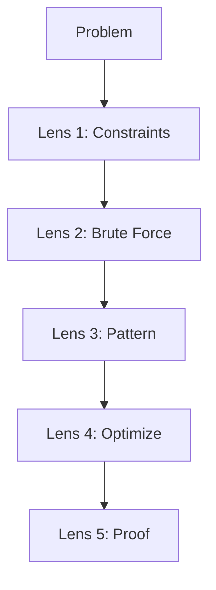
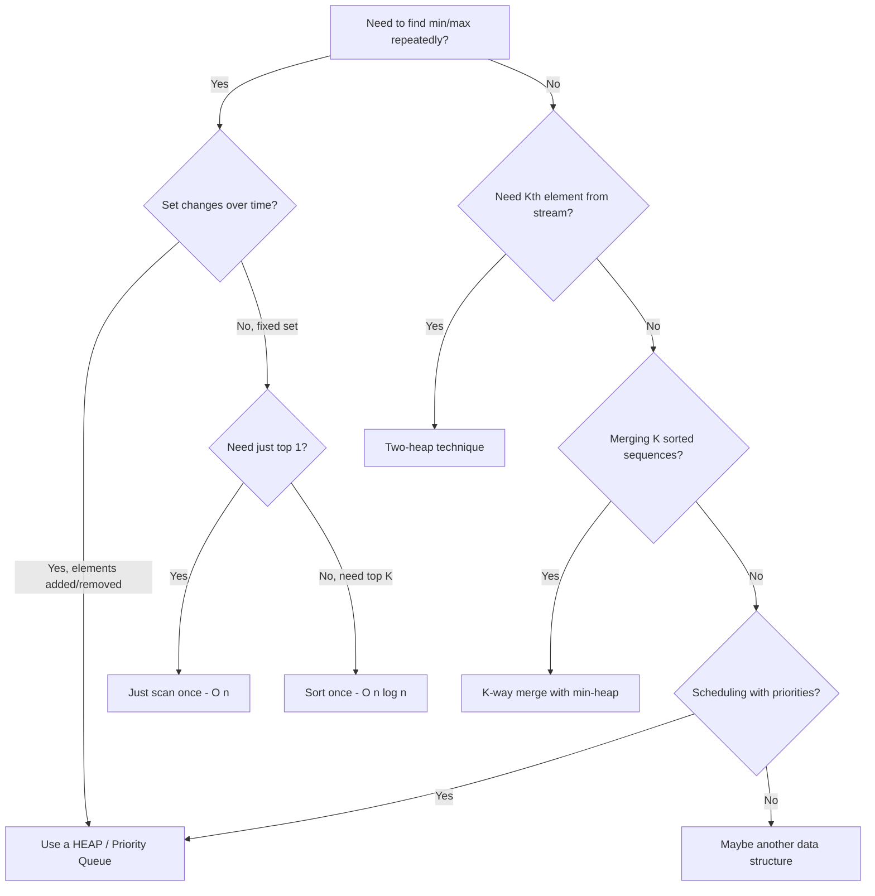

# Heaps & Priority Queues — The VIP Line

## Chapter Goals

By the end of this chapter, you will:

- Understand what a heap is: a complete binary tree stored in an array with the heap property
- Know the difference between a min-heap and a max-heap and when to use each
- Implement heap operations from scratch: insert (bubble up) and extract (bubble down)
- Build a heap from an unsorted array in O(n) using heapify
- Use priority queues in all three languages: Python's `heapq`, Java's `PriorityQueue`, C++'s `priority_queue`
- Solve "Kth largest/smallest" problems using a heap of size k
- Merge K sorted arrays efficiently using a multi-way merge with a min-heap
- Find top-K frequent elements using a frequency map plus a heap
- Understand the two-heap technique for finding a running median
- Recognize when a heap is the right tool vs. sorting, binary search, or balanced BSTs

---

## The Story: "The Emergency Room"

It's Friday night at Riverside Hospital, and the emergency room is packed. Patients arrive one after another — a kid with a scraped knee, a woman with chest pain, a teenager with a broken ankle, a man having a severe allergic reaction.

If this were a regular line at a coffee shop, everyone would be served in the order they arrived — **first in, first out**. That's a queue (you'll meet queues formally in Ch 22). But in an ER, that would be *dangerous*. The person with chest pain can't wait behind fifteen people with minor cuts.

So the ER uses a system called **triage**. Every patient gets a **priority score** when they arrive. The sickest patients get the highest priority. When a doctor becomes available, they always see the highest-priority patient — even if that patient arrived last.

Here's the tricky part: new patients keep arriving, and each one needs to be slotted into the right position. If you kept a sorted list, every new arrival would require shifting everyone around — O(n) per insertion. With 200 patients, that's a LOT of shuffling.

What if there were a magical clipboard that could:
1. **Add a new patient** in O(log n) time?
2. **Find the most urgent patient** in O(1) time?
3. **Remove the most urgent patient** (they're being seen) in O(log n) time?

That magical clipboard is a **heap** — and the system it powers is called a **priority queue**. Today, you'll build one from scratch.

---

## Johari Window: Before

Before diving in, take 5 minutes to fill out the **"Before"** section of your [Johari Window worksheet](johari.md).


Be honest with yourself! Knowing what you *don't* know is the first step to learning it. There are no wrong answers — only honest ones.


---

## Discovery

Before we explain heaps formally, try these puzzles:

### Puzzle 1: "The Hot 100"

Spotify has 100 million songs. They want to display the top 100 most-played songs right now.

**Option A**: Sort all 100 million songs by play count. Take the first 100. Cost: O(n log n) where n = 100,000,000.

**Option B**: Keep a special collection of size 100. For each song, if it has more plays than the least-played song in our collection, swap it in. Cost: ???

Which is faster? What data structure would make Option B efficient?


Option B is much faster! You need a **min-heap of size 100**. For each of the n songs, comparing against the minimum takes O(1), and replacing it (if needed) takes O(log 100) = O(log k). Total: O(n log k), which is dramatically faster than O(n log n) when k is small.


### Puzzle 2: "The Merger"

You have 4 sorted lists:
- `[1, 5, 9]`
- `[2, 6, 10]`
- `[3, 7, 11]`
- `[4, 8, 12]`

You want to merge them into one sorted list: `[1, 2, 3, 4, 5, 6, 7, 8, 9, 10, 11, 12]`.

**Option A**: Concatenate all lists, then sort. Cost: O(N log N) where N = total elements.

**Option B**: Use some clever data structure that always tells you which list currently has the smallest front element. Pop that element, advance that list's pointer, repeat. Cost: ???

What data structure would make Option B work?


A **min-heap of size K** (where K = number of lists). You store the front element of each list in the heap. Each extraction + insertion is O(log K). With N total elements, that's O(N log K). When K is small, this crushes O(N log N).


### Puzzle 3: "The Running Median"

Numbers arrive one at a time: `5, 15, 1, 3, 8, 7, 9, ...`

After each number arrives, you need to report the current median.

After `5`: median = 5
After `5, 15`: median = 10 (average of 5 and 15)
After `5, 15, 1`: median = 5
After `5, 15, 1, 3`: median = 4 (average of 3 and 5)

Sorting after every insertion would be O(n^2) total. Can you do better?


Use **two heaps**: a max-heap for the lower half and a min-heap for the upper half. The median is always at the top of one (or both) heaps. Each insertion is O(log n). You'll implement this in Practice Problem 4!


---

## 17.1 What Is a Heap?

A **heap** is a special kind of binary tree with two properties:

1. **Complete Binary Tree**: Every level is fully filled except possibly the last, which is filled left to right. No gaps.

2. **Heap Property**: Every parent node is "better" than its children:
   - **Min-heap**: every parent <= its children (smallest at the root)
   - **Max-heap**: every parent >= its children (largest at the root)

### Visualizing a Min-Heap

```
            1              Level 0  (root — the minimum!)
          /   \
        3       2          Level 1
       / \     / \
      7   6   5   4        Level 2
     /
    8                      Level 3  (partially filled, left to right)
```

Every parent is smaller than its children. The root (1) is the overall minimum.

### Visualizing a Max-Heap

```
            9              Level 0  (root — the maximum!)
          /   \
        7       8          Level 1
       / \     / \
      4   6   5   3        Level 2
     /
    1                      Level 3
```

Every parent is larger than its children. The root (9) is the overall maximum.

### The Array Trick

Here's the brilliant insight: because a heap is a **complete** binary tree, we can store it in a plain array with NO pointers at all!

```
Min-heap tree:       1
                   /   \
                  3     2
                 / \   / \
                7   6 5   4
               /
              8

Array index:    0  1  2  3  4  5  6  7
Array value:   [1, 3, 2, 7, 6, 5, 4, 8]
```

The formulas that make this work (using 0-based indexing):

| Relationship | Formula |
|-------------|---------|
| Parent of node `i` | `(i - 1) / 2` (integer division) |
| Left child of `i` | `2 * i + 1` |
| Right child of `i` | `2 * i + 2` |

**Example**: Node at index 1 (value 3):
- Parent: (1-1)/2 = 0 (value 1) — correct, 1 is parent of 3
- Left child: 2*1+1 = 3 (value 7) — correct
- Right child: 2*1+2 = 4 (value 6) — correct


**Why does this work?** Because the tree is *complete* — there are no gaps. If we numbered the nodes level by level, left to right, the numbering perfectly matches array indices. A tree with "holes" wouldn't have this nice property.


---

## 17.2 Min-Heap and Max-Heap

The only difference between a min-heap and a max-heap is which direction the heap property goes:

| Property | Min-Heap | Max-Heap |
|----------|----------|----------|
| Root contains | Smallest element | Largest element |
| Parent vs child | `parent <= child` | `parent >= child` |
| Best for | "Find minimum" | "Find maximum" |
| Get min/max | O(1) — just peek at root | O(1) — just peek at root |

### Language Default Gotcha

This is one of the most common sources of bugs in competitive programming:

| Language | Default Heap Type | To get the other |
|----------|------------------|-----------------|
| Python `heapq` | **Min-heap** | Negate values: push `-x`, pop and negate |
| Java `PriorityQueue` | **Min-heap** | `new PriorityQueue<>(Collections.reverseOrder())` |
| C++ `priority_queue` | **Max-heap** | `priority_queue<int, vector<int>, greater<int>>` |


**C++ is the odd one out!** Python and Java default to min-heap, but C++ defaults to max-heap. This catches people ALL the time in contests.


---

## 17.3 Heap Operations

The two core operations are **insert** and **extract** (remove the root).

### Insert (Bubble Up / Sift Up)

**Algorithm**:
1. Add the new element at the END of the array (maintains completeness)
2. Compare it with its parent. If it violates the heap property, SWAP with parent.
3. Repeat step 2 until the element reaches its correct position (or becomes the root).

**Example: Insert 0 into a min-heap**

```
Before:        1              Step 1: Add 0 at end
             /   \
            3     2                  1
           / \   / \               /   \
          7   6 5   4             3     2
         /                       / \   / \
        8                       7   6 5   4
                               / \
                              8   0   <-- new element

Step 2: Compare 0 with parent 6    Step 3: Compare 0 with parent 3
  0 < 6? YES → swap                  0 < 3? YES → swap

         1                                 1
       /   \                             /   \
      3     2                           0     2
     / \   / \                         / \   / \
    7   0 5   4                       7   3 5   4
   / \                               / \
  8   6                              8   6

Step 4: Compare 0 with parent 1
  0 < 1? YES → swap

         0
       /   \
      1     2
     / \   / \
    7   3 5   4
   / \
  8   6
```

**Time**: O(log n) — at most we travel from the bottom to the top of the tree, which is the tree's height = log₂(n).

### Extract Min/Max (Bubble Down / Sift Down)

**Algorithm**:
1. Save the root value (this is what we're returning)
2. Move the LAST element in the array to the root position
3. Compare the new root with its children. Swap with the SMALLER child (for min-heap) or LARGER child (for max-heap) if it violates the heap property.
4. Repeat step 3 until the element reaches its correct position (or becomes a leaf).

**Example: Extract min from the min-heap**

```
Before:        1              Step 1: Save 1 as result
             /   \            Step 2: Move last element (8) to root
            3     2
           / \   / \                   8
          7   6 5   4                /   \
         /                          3     2
        8                          / \   / \
                                  7   6 5   4

Step 3: Compare 8 with children 3, 2    Step 4: Compare 8 with children 5, 4
  Smaller child = 2. 8 > 2? YES → swap    Smaller child = 4. 8 > 4? YES → swap

         2                                  2
       /   \                              /   \
      3     8                            3     4
     / \   / \                          / \   / \
    7   6 5   4                        7   6 5   8

8 is now a leaf. Done!
Return 1 (the extracted minimum).
```

**Time**: O(log n) — at most we travel from the root to the bottom.

### Summary of Operations

| Operation | Time | Description |
|-----------|------|-------------|
| `peek()` / `top()` | O(1) | Look at root without removing |
| `insert()` / `push()` | O(log n) | Add element, bubble up |
| `extract()` / `pop()` | O(log n) | Remove root, bubble down |
| `size()` | O(1) | Number of elements |
| `is_empty()` | O(1) | Check if heap is empty |

---

## 17.4 Building a Heap in O(n)

**The naive way**: Insert elements one at a time. Each insert is O(log n), so n inserts = O(n log n). Fine, but we can do better.

**The clever way (heapify)**: Start from the LAST non-leaf node and bubble down each node.

Why does this work? Leaf nodes are already valid heaps (a single element trivially satisfies the heap property). So we only need to fix the internal nodes — and we fix them bottom-up.

```
Array: [4, 10, 3, 5, 1]

As a tree:        4           Last non-leaf = index (5/2 - 1) = 1
                /   \
              10     3
             /  \
            5    1

Step 1: Fix node at index 1 (value 10)
  Children: 5, 1. Smallest = 1. 10 > 1 → swap

              4
            /   \
           1     3
          / \
         5  10

Step 2: Fix node at index 0 (value 4)
  Children: 1, 3. Smallest = 1. 4 > 1 → swap

              1
            /   \
           4     3
          / \
         5  10

  Now check 4: children 5, 10. 4 < 5 → stop.

Final min-heap: [1, 4, 3, 5, 10]
```

### Why O(n) and Not O(n log n)?

This is a beautiful math result. The key insight: **most nodes are near the bottom** of the tree, and nodes near the bottom barely need to move.

- n/2 leaf nodes: bubble down 0 levels
- n/4 nodes at height 1: bubble down at most 1 level
- n/8 nodes at height 2: bubble down at most 2 levels
- ... and so on

Total work = n/4 * 1 + n/8 * 2 + n/16 * 3 + ... = n * sum(k/2^(k+1)) for k=1 to log(n)

This sum converges to approximately n. So building a heap is O(n).


**Think of it this way**: the expensive work (bubbling down many levels) only happens for a FEW nodes near the top. The MANY nodes near the bottom barely move at all. The math works out to O(n) total.


---

## 17.5 Priority Queues in Three Languages

A **priority queue** is an abstract data type that provides:
- Insert an element with a priority
- Extract the highest-priority element

A heap is the most common *implementation* of a priority queue.



```python
import heapq

# Python heapq operates on a regular list — it's a MIN-heap
nums = [5, 3, 8, 1, 2]
heapq.heapify(nums)         # O(n) — converts list in-place
print(nums)                  # [1, 2, 8, 5, 3] (heap order, not sorted!)

heapq.heappush(nums, 0)     # O(log n) — insert
print(heapq.heappop(nums))  # 0 — extracts the minimum

# Peek without removing:
print(nums[0])               # The current minimum

# For MAX-heap, negate all values:
max_heap = []
for x in [5, 3, 8, 1, 2]:
    heapq.heappush(max_heap, -x)   # Push negated

largest = -heapq.heappop(max_heap) # Pop and negate back
print(largest)                      # 8

# Useful combo: push + pop in one operation
# heapq.heappushpop(heap, val) — push val, then pop (more efficient)
# heapq.heapreplace(heap, val) — pop first, then push val

# nlargest / nsmallest (efficient for small k)
data = [5, 3, 8, 1, 2, 9, 4]
print(heapq.nlargest(3, data))    # [9, 8, 5]
print(heapq.nsmallest(3, data))   # [1, 2, 3]
```



```java
import java.util.*;

public class PQDemo {
    public static void main(String[] args) {
        // Java PriorityQueue is a MIN-heap by default
        PriorityQueue<Integer> minPQ = new PriorityQueue<>();
        minPQ.add(5);            // O(log n)
        minPQ.add(3);
        minPQ.add(8);
        minPQ.add(1);
        minPQ.add(2);

        System.out.println(minPQ.peek());  // 1 — the minimum
        System.out.println(minPQ.poll());  // 1 — extract min

        // For MAX-heap:
        PriorityQueue<Integer> maxPQ = new PriorityQueue<>(
            Collections.reverseOrder()
        );
        maxPQ.add(5);
        maxPQ.add(3);
        maxPQ.add(8);
        System.out.println(maxPQ.poll());  // 8 — extract max

        // Build from collection (still O(n log n) in Java — no heapify)
        List<Integer> data = Arrays.asList(5, 3, 8, 1, 2, 9, 4);
        PriorityQueue<Integer> pq = new PriorityQueue<>(data);
        while (!pq.isEmpty()) {
            System.out.print(pq.poll() + " ");  // 1 2 3 4 5 8 9
        }
    }
}
```



```cpp
#include <iostream>
#include <queue>
#include <vector>
#include <functional>  // for greater<>
using namespace std;

int main() {
    // C++ priority_queue is a MAX-heap by default!
    priority_queue<int> maxPQ;
    maxPQ.push(5);      // O(log n)
    maxPQ.push(3);
    maxPQ.push(8);
    maxPQ.push(1);
    maxPQ.push(2);

    cout << maxPQ.top() << endl;  // 8 — the maximum
    maxPQ.pop();                   // removes 8

    // For MIN-heap:
    priority_queue<int, vector<int>, greater<int>> minPQ;
    minPQ.push(5);
    minPQ.push(3);
    minPQ.push(8);
    cout << minPQ.top() << endl;  // 3 — the minimum

    // Build from vector
    vector<int> data = {5, 3, 8, 1, 2, 9, 4};
    priority_queue<int, vector<int>, greater<int>> pq(
        data.begin(), data.end()
    );
    while (!pq.empty()) {
        cout << pq.top() << " ";  // 1 2 3 4 5 8 9
        pq.pop();
    }

    return 0;
}
```



### Language Spotlight: Priority Queue Comparison

| Feature | Python `heapq` | Java `PriorityQueue` | C++ `priority_queue` |
|---------|----------------|---------------------|---------------------|
| Default type | Min-heap | Min-heap | **Max-heap** |
| Backed by | Regular list | Array-based heap | `vector` by default |
| Get max/min for free? | `heap[0]` | `.peek()` | `.top()` |
| O(n) heapify? | Yes (`heapq.heapify`) | No (constructor is O(n log n)) | Yes (range constructor) |
| Custom comparator | Use tuples or `__lt__` | `Comparator` in constructor | Third template parameter |
| Decrease key? | No (re-insert or lazy delete) | `remove()` + `add()` O(n) | No (use lazy deletion) |

---

## 17.6 Kth Largest / Smallest Element

**Problem**: Given an array of n numbers, find the Kth largest element.

This is the classic heap problem. There are three progressively better approaches:

### Approach 1: Sort — O(n log n)



```python
def kth_largest_sort(nums, k):
    nums.sort(reverse=True)
    return nums[k - 1]
```



```java
public static int kthLargestSort(int[] nums, int k) {
    Arrays.sort(nums);
    return nums[nums.length - k];
}
```



```cpp
int kthLargestSort(vector<int> nums, int k) {
    sort(nums.begin(), nums.end(), greater<int>());
    return nums[k - 1];
}
```



Simple, but O(n log n). Can we do better?

### Approach 2: Min-Heap of Size K — O(n log k)

**Key insight**: Maintain a min-heap of size k. The SMALLEST element in the heap is the Kth largest overall.

1. Push the first k elements into the heap
2. For each remaining element: if it's bigger than the heap's minimum, replace the minimum
3. At the end, the heap's minimum is the answer



```python
import heapq

def kth_largest_heap(nums, k):
    heap = nums[:k]
    heapq.heapify(heap)
    for num in nums[k:]:
        if num > heap[0]:
            heapq.heapreplace(heap, num)  # pop min, push num
    return heap[0]
```



```java
public static int kthLargestHeap(int[] nums, int k) {
    PriorityQueue<Integer> minHeap = new PriorityQueue<>();
    for (int num : nums) {
        minHeap.add(num);
        if (minHeap.size() > k) {
            minHeap.poll();
        }
    }
    return minHeap.peek();
}
```



```cpp
int kthLargestHeap(vector<int>& nums, int k) {
    // Min-heap of size k
    priority_queue<int, vector<int>, greater<int>> minPQ;
    for (int num : nums) {
        minPQ.push(num);
        if ((int)minPQ.size() > k) {
            minPQ.pop();
        }
    }
    return minPQ.top();
}
```



### Approach 3: Quickselect — O(n) Average

This is a partition-based approach adapted from quicksort. We only recurse into ONE half (not both), giving O(n) average time.



```python
import random

def kth_largest_quickselect(nums, k):
    target = len(nums) - k  # Convert to "kth smallest" (0-indexed)

    def quickselect(left, right):
        pivot_idx = random.randint(left, right)
        nums[pivot_idx], nums[right] = nums[right], nums[pivot_idx]
        pivot = nums[right]

        store = left
        for i in range(left, right):
            if nums[i] < pivot:
                nums[i], nums[store] = nums[store], nums[i]
                store += 1
        nums[store], nums[right] = nums[right], nums[store]

        if store == target:
            return nums[store]
        elif store < target:
            return quickselect(store + 1, right)
        else:
            return quickselect(left, store - 1)

    return quickselect(0, len(nums) - 1)
```



```java
public static int kthLargestQuickselect(int[] nums, int k) {
    int target = nums.length - k;
    return quickselect(nums, 0, nums.length - 1, target);
}

private static int quickselect(int[] nums, int left, int right, int target) {
    Random rand = new Random();
    int pivotIdx = left + rand.nextInt(right - left + 1);
    int pivot = nums[pivotIdx];
    // Move pivot to end
    int tmp = nums[pivotIdx]; nums[pivotIdx] = nums[right]; nums[right] = tmp;

    int store = left;
    for (int i = left; i < right; i++) {
        if (nums[i] < pivot) {
            tmp = nums[i]; nums[i] = nums[store]; nums[store] = tmp;
            store++;
        }
    }
    tmp = nums[store]; nums[store] = nums[right]; nums[right] = tmp;

    if (store == target) return nums[store];
    else if (store < target) return quickselect(nums, store + 1, right, target);
    else return quickselect(nums, left, store - 1, target);
}
```



```cpp
int kthLargestQuickselect(vector<int>& nums, int k) {
    int target = nums.size() - k;
    int left = 0, right = nums.size() - 1;
    while (left <= right) {
        int pivotIdx = left + rand() % (right - left + 1);
        swap(nums[pivotIdx], nums[right]);
        int pivot = nums[right];
        int store = left;
        for (int i = left; i < right; i++) {
            if (nums[i] < pivot) {
                swap(nums[i], nums[store]);
                store++;
            }
        }
        swap(nums[store], nums[right]);
        if (store == target) return nums[store];
        else if (store < target) left = store + 1;
        else right = store - 1;
    }
    return -1; // should never reach here
}
```



---

## 17.7 Merge K Sorted Arrays

**Problem**: Given K sorted arrays, merge them into one sorted array.

**Idea**: Use a min-heap of size K. Store one element from each array (along with which array it came from and the index within that array). Repeatedly extract the minimum, add it to the result, and push the next element from the same array.



```python
import heapq

def merge_k_sorted(arrays):
    heap = []
    for i, arr in enumerate(arrays):
        if arr:
            heapq.heappush(heap, (arr[0], i, 0))

    result = []
    while heap:
        val, arr_idx, elem_idx = heapq.heappop(heap)
        result.append(val)
        if elem_idx + 1 < len(arrays[arr_idx]):
            next_val = arrays[arr_idx][elem_idx + 1]
            heapq.heappush(heap, (next_val, arr_idx, elem_idx + 1))
    return result
```



```java
public static List<Integer> mergeKSorted(int[][] arrays) {
    PriorityQueue<int[]> pq = new PriorityQueue<>(
        (a, b) -> Integer.compare(a[0], b[0])
    );
    for (int i = 0; i < arrays.length; i++) {
        if (arrays[i].length > 0) {
            pq.add(new int[]{arrays[i][0], i, 0});
        }
    }
    List<Integer> result = new ArrayList<>();
    while (!pq.isEmpty()) {
        int[] top = pq.poll();
        result.add(top[0]);
        int arrIdx = top[1], elemIdx = top[2];
        if (elemIdx + 1 < arrays[arrIdx].length) {
            pq.add(new int[]{arrays[arrIdx][elemIdx + 1], arrIdx, elemIdx + 1});
        }
    }
    return result;
}
```



```cpp
vector<int> mergeKSorted(vector<vector<int>>& arrays) {
    // Min-heap: (value, array_index, element_index)
    auto cmp = [](tuple<int,int,int>& a, tuple<int,int,int>& b) {
        return get<0>(a) > get<0>(b);  // greater = min-heap
    };
    priority_queue<tuple<int,int,int>, vector<tuple<int,int,int>>,
                   decltype(cmp)> pq(cmp);

    for (int i = 0; i < (int)arrays.size(); i++) {
        if (!arrays[i].empty()) {
            pq.push({arrays[i][0], i, 0});
        }
    }
    vector<int> result;
    while (!pq.empty()) {
        auto [val, arrIdx, elemIdx] = pq.top();
        pq.pop();
        result.push_back(val);
        if (elemIdx + 1 < (int)arrays[arrIdx].size()) {
            pq.push({arrays[arrIdx][elemIdx + 1], arrIdx, elemIdx + 1});
        }
    }
    return result;
}
```



**Time**: O(N log K) where N = total elements across all arrays, K = number of arrays.

---

## 17.8 Top K Frequent Elements

**Problem**: Given an array, return the K most frequent elements.

**Idea**: First build a frequency map. Then use a min-heap of size K to track the top K most frequent elements.



```python
import heapq
from collections import Counter

def top_k_frequent(nums, k):
    freq = Counter(nums)
    # heapq.nlargest uses a heap internally
    return heapq.nlargest(k, freq.keys(), key=freq.get)
```



```java
public static List<Integer> topKFrequent(int[] nums, int k) {
    Map<Integer, Integer> freq = new HashMap<>();
    for (int n : nums) freq.put(n, freq.getOrDefault(n, 0) + 1);

    PriorityQueue<Integer> minHeap = new PriorityQueue<>(
        (a, b) -> freq.get(a) - freq.get(b)
    );
    for (int key : freq.keySet()) {
        minHeap.add(key);
        if (minHeap.size() > k) minHeap.poll();
    }

    List<Integer> result = new ArrayList<>(minHeap);
    Collections.sort(result);
    return result;
}
```



```cpp
vector<int> topKFrequent(vector<int>& nums, int k) {
    unordered_map<int, int> freq;
    for (int n : nums) freq[n]++;

    // Min-heap by frequency
    auto cmp = [&freq](int a, int b) {
        return freq[a] > freq[b];  // greater = min-heap
    };
    priority_queue<int, vector<int>, decltype(cmp)> pq(cmp);

    for (auto& [val, cnt] : freq) {
        pq.push(val);
        if ((int)pq.size() > k) pq.pop();
    }

    vector<int> result;
    while (!pq.empty()) {
        result.push_back(pq.top());
        pq.pop();
    }
    sort(result.begin(), result.end());
    return result;
}
```



**Time**: O(n + m log k) where n = array length, m = number of unique elements, k = target count.

---

## Think Like a Pro


**Benq (Benjamin Qi, 4x USACO Finalist, IOI Gold)** on heaps:

*"Priority queues appear constantly in competitive programming. Dijkstra's algorithm, Prim's MST, Huffman coding, event-driven simulation — they all need a PQ. The key pattern is: whenever you need 'the best element so far' and the set keeps changing, think heap. Don't reach for a sorted container unless you need ordered iteration."*

**The takeaway**: If you need to repeatedly extract the minimum (or maximum) from a changing collection, a heap is almost always the right choice. It's one of the most useful data structures in all of CP.


---

## Five-Lens Framework: Kth Largest Element

Let us apply the Five-Lens Framework to the Kth Largest Element problem. Given an unsorted array of n numbers and an integer k, find the kth largest element.

### Lens 1: Constraints

The array can have up to 100,000 elements, and k is between 1 and n. We need to find one specific element by rank, not sort the entire array. Any solution faster than full sorting would be a win.

### Lens 2: Brute Force

The simplest approach: sort the entire array in descending order and return the element at index k-1. This takes O(n log n) time. It works, but we are doing more work than necessary -- we sort ALL elements when we only need one.

### Lens 3: Pattern

This fits the "partial order" pattern. We do not need the full sorted order -- we just need to know which element is kth largest. A min-heap of size k acts like a "VIP list" that only keeps the top k elements. The smallest element in this VIP list is exactly the kth largest overall.

### Lens 4: Optimization

Maintain a min-heap of size k. Push each element onto the heap, and whenever the heap exceeds size k, pop the smallest. After processing all elements, the heap's minimum is the answer. Time: O(n log k). When k is much smaller than n, this is significantly faster than O(n log n). Space: O(k).

### Lens 5: Proof

Here is why the heap approach is correct. After processing all n elements, the heap contains exactly the k largest elements (because every time an element smaller than the current kth largest entered, it was immediately removed). The minimum of these k elements is, by definition, the kth largest. We never lose a "top k" element because we only pop when a bigger element pushes it out.



---

## Decision Flowchart: When to Use a Heap



---

## AOPS Showcase: "Kth Largest Element" — Three Approaches

This is the classic "one problem, multiple solutions" that shows how algorithmic thinking evolves.

### The Problem

Given an unsorted array of `n` integers and an integer `k`, find the kth largest element.

Example: `nums = [3, 2, 1, 5, 6, 4], k = 2` → Answer: `5`

### Solution 1: Sort — O(n log n)

**Thinking**: "I need the kth largest. If I sort, I can just index."



```python
def kth_largest_v1(nums, k):
    return sorted(nums, reverse=True)[k - 1]
```



```java
public static int kthLargestV1(int[] nums, int k) {
    Arrays.sort(nums);
    return nums[nums.length - k];
}
```



```cpp
int kthLargestV1(vector<int> nums, int k) {
    sort(nums.rbegin(), nums.rend());
    return nums[k - 1];
}
```



**Verdict**: Works, but we sort the ENTIRE array when we only need ONE element. Overkill.

### Solution 2: Min-Heap of Size K — O(n log k)

**Thinking**: "I don't need to sort everything. I just need to track the top k elements. A min-heap of size k lets the smallest of my top-k float to the top, so I can compare it against new candidates."



```python
import heapq

def kth_largest_v2(nums, k):
    heap = []
    for num in nums:
        heapq.heappush(heap, num)
        if len(heap) > k:
            heapq.heappop(heap)
    return heap[0]
```



```java
public static int kthLargestV2(int[] nums, int k) {
    PriorityQueue<Integer> pq = new PriorityQueue<>();
    for (int num : nums) {
        pq.add(num);
        if (pq.size() > k) pq.poll();
    }
    return pq.peek();
}
```



```cpp
int kthLargestV2(vector<int>& nums, int k) {
    priority_queue<int, vector<int>, greater<int>> pq; // min-heap
    for (int num : nums) {
        pq.push(num);
        if ((int)pq.size() > k) pq.pop();
    }
    return pq.top();
}
```



**Verdict**: Better! When k << n, this is significantly faster. But can we do even better?

### Solution 3: Quickselect — O(n) Average

**Thinking**: "I don't even need to maintain a sorted order. I just need to partition the array so that the kth largest is in its correct position."



```python
import random

def kth_largest_v3(nums, k):
    target = len(nums) - k

    def partition(left, right):
        pivot_idx = random.randint(left, right)
        nums[pivot_idx], nums[right] = nums[right], nums[pivot_idx]
        pivot = nums[right]
        store = left
        for i in range(left, right):
            if nums[i] < pivot:
                nums[i], nums[store] = nums[store], nums[i]
                store += 1
        nums[store], nums[right] = nums[right], nums[store]
        return store

    left, right = 0, len(nums) - 1
    while left <= right:
        pos = partition(left, right)
        if pos == target:
            return nums[pos]
        elif pos < target:
            left = pos + 1
        else:
            right = pos - 1

    return -1
```



```java
public static int kthLargestV3(int[] nums, int k) {
    int target = nums.length - k;
    int left = 0, right = nums.length - 1;
    Random rand = new Random();
    while (left <= right) {
        int pivotIdx = left + rand.nextInt(right - left + 1);
        int tmp = nums[pivotIdx]; nums[pivotIdx] = nums[right]; nums[right] = tmp;
        int pivot = nums[right], store = left;
        for (int i = left; i < right; i++) {
            if (nums[i] < pivot) {
                tmp = nums[i]; nums[i] = nums[store]; nums[store] = tmp;
                store++;
            }
        }
        tmp = nums[store]; nums[store] = nums[right]; nums[right] = tmp;
        if (store == target) return nums[store];
        else if (store < target) left = store + 1;
        else right = store - 1;
    }
    return -1;
}
```



```cpp
int kthLargestV3(vector<int>& nums, int k) {
    int target = nums.size() - k;
    int left = 0, right = nums.size() - 1;
    while (left <= right) {
        int pivotIdx = left + rand() % (right - left + 1);
        swap(nums[pivotIdx], nums[right]);
        int pivot = nums[right], store = left;
        for (int i = left; i < right; i++) {
            if (nums[i] < pivot) swap(nums[i], nums[store++]);
        }
        swap(nums[store], nums[right]);
        if (store == target) return nums[store];
        else if (store < target) left = store + 1;
        else right = store - 1;
    }
    return -1;
}
```



### Comparison Table

| Approach | Time (Average) | Time (Worst) | Space | When to Use |
|----------|---------------|--------------|-------|-------------|
| Sort | O(n log n) | O(n log n) | O(1)-O(n) | Simple, guaranteed |
| Min-heap size k | O(n log k) | O(n log k) | O(k) | k << n, streaming data |
| Quickselect | O(n) | O(n²) | O(1) | One-shot query, expected O(n) |

**The AOPS lesson**: The same problem has solutions spanning three different algorithmic paradigms (sorting, data structures, divide-and-conquer). Recognizing which to use depends on the constraints.

---

## Legend's Corner


**tourist (Gennady Korotkevich)** — the highest-rated competitive programmer of all time — has said that heaps and priority queues are among the most practical data structures for contest problems. In one Codeforces contest, he solved a scheduling problem in under 5 minutes by recognizing it as a greedy problem powered by a max-heap. While other contestants spent 20+ minutes trying complex DP approaches, tourist's heap solution was clean, correct, and fast.

The lesson? When you see "pick the best remaining option at each step," think **greedy + heap**. This combo appears over and over in USACO Silver and Gold problems. Master it early, and you'll have a huge advantage.


---

## Gotchas


**Gotcha 1: Min-Heap vs Max-Heap Confusion**

C++ `priority_queue` is MAX-heap by default. Python and Java are MIN-heap. Mixing these up is the #1 heap bug.

```python
# Python: this is a MIN-heap!
import heapq
h = []
heapq.heappush(h, 5)
heapq.heappush(h, 1)
print(heapq.heappop(h))  # 1, NOT 5!
```

```cpp
// C++: this is a MAX-heap!
priority_queue<int> pq;
pq.push(5);
pq.push(1);
cout << pq.top();  // 5, NOT 1!
```



**Gotcha 2: Python Max-Heap Trap**

Python has NO built-in max-heap. You must negate values. But don't forget to negate back when you extract!

```python
import heapq
max_heap = []
heapq.heappush(max_heap, -5)
heapq.heappush(max_heap, -1)
result = -heapq.heappop(max_heap)  # Don't forget the negation!
print(result)  # 5
```



**Gotcha 3: Heap != Sorted Array**

A heap is NOT fully sorted. Only the root is guaranteed to be min (or max). The rest is in "heap order" which is NOT sorted order.

```python
import heapq
h = [1, 3, 2, 7, 6, 5, 4]
heapq.heapify(h)
print(h)  # [1, 3, 2, 7, 6, 5, 4] — NOT [1, 2, 3, 4, 5, 6, 7]!
```



**Gotcha 4: Java PQ Iterator Is NOT Sorted**

Iterating over a Java PriorityQueue does NOT give elements in order. You must `poll()` to get sorted output.

```java
PriorityQueue<Integer> pq = new PriorityQueue<>();
pq.add(5); pq.add(1); pq.add(3);

// WRONG — this prints in arbitrary order:
for (int x : pq) System.out.print(x + " ");

// RIGHT — this prints in order:
while (!pq.isEmpty()) System.out.print(pq.poll() + " ");  // 1 3 5
```



**Gotcha 5: Heap Size After Operations**

When using a heap to find the Kth element, make sure to check size AFTER push, not before. A common bug is forgetting to pop when the heap exceeds size k.

```python
# WRONG: heap grows unbounded
for num in nums:
    heapq.heappush(heap, num)  # oops, never pop!

# RIGHT: maintain size k
for num in nums:
    heapq.heappush(heap, num)
    if len(heap) > k:
        heapq.heappop(heap)
```



**Gotcha 6: C++ priority_queue Has No `.clear()`... Actually It Does (Since C++11)**

But there's still no `.reserve()` or indexed access. If you need to iterate over elements, a heap may not be the right choice — consider a `multiset` instead.


---

## Practice Problems

| # | Problem | Difficulty | Key Technique |
|---|---------|-----------|--------------|
| W1 | Kth Largest Element | ⭐ | Min-heap of size k |
| W2 | Sort Using Heap (Heapsort) | ⭐ | Insert all, extract all |
| W3 | Last Stone Weight | ⭐ | Simulate with max-heap |
| W4 | Check if Array is a Heap | ⭐ | Validate heap property |
| P1 | Top K Frequent Elements | ⭐⭐ | Frequency map + min-heap |
| P2 | Merge K Sorted Arrays | ⭐⭐ | Multi-way merge with heap |
| P3 | Kth Smallest in Sorted Matrix | ⭐⭐ | Min-heap BFS approach |
| P4 | Find Median from Data Stream | ⭐⭐ | Two heaps (max + min) |
| P5 | K Closest Points to Origin | ⭐⭐ | Max-heap of size k |
| C1 | Reorganize String | ⭐⭐⭐ | Greedy + max-heap |
| C2 | Task Scheduler | ⭐⭐⭐ | Greedy + max-heap + cooldown |
| C3 | Sliding Window Maximum | ⭐⭐⭐ | Deque or heap + lazy deletion |

---

## Language Idioms



```python
import heapq

# ── Min-heap (default) ──
h = []
heapq.heappush(h, 3)
heapq.heappush(h, 1)
heapq.heappush(h, 2)
print(heapq.heappop(h))  # 1

# ── Max-heap (negate trick) ──
max_h = []
heapq.heappush(max_h, -3)
heapq.heappush(max_h, -1)
heapq.heappush(max_h, -2)
print(-heapq.heappop(max_h))  # 3

# ── Heapify a list in O(n) ──
data = [5, 3, 8, 1, 2]
heapq.heapify(data)  # Modifies in-place

# ── Top K ──
heapq.nlargest(3, [5,1,8,2,9])   # [9, 8, 5]
heapq.nsmallest(3, [5,1,8,2,9])  # [1, 2, 5]

# ── Push-and-pop (more efficient than push then pop) ──
heapq.heappushpop(h, 4)   # Push 4, then pop min
heapq.heapreplace(h, 4)   # Pop min, then push 4

# ── Heap with tuples for custom priority ──
tasks = [(3, "low"), (1, "high"), (2, "medium")]
heapq.heapify(tasks)
print(heapq.heappop(tasks))  # (1, "high")
```



```java
import java.util.*;

// ── Min-heap (default) ──
PriorityQueue<Integer> minPQ = new PriorityQueue<>();
minPQ.add(3);
minPQ.add(1);
minPQ.add(2);
System.out.println(minPQ.poll());  // 1

// ── Max-heap ──
PriorityQueue<Integer> maxPQ = new PriorityQueue<>(
    Collections.reverseOrder()
);
maxPQ.add(3);
maxPQ.add(1);
maxPQ.add(2);
System.out.println(maxPQ.poll());  // 3

// ── Custom comparator ──
PriorityQueue<int[]> pq = new PriorityQueue<>(
    (a, b) -> Integer.compare(a[0], b[0])
);
pq.add(new int[]{3, 0});
pq.add(new int[]{1, 1});
System.out.println(pq.poll()[0]);  // 1

// ── Common methods ──
// pq.peek()    — see top without removing
// pq.poll()    — remove and return top
// pq.add(x)    — insert x
// pq.size()    — number of elements
// pq.isEmpty() — check if empty
```



```cpp
#include <queue>
#include <vector>
#include <functional>

// ── Max-heap (default) ──
priority_queue<int> maxPQ;
maxPQ.push(3);
maxPQ.push(1);
maxPQ.push(2);
cout << maxPQ.top() << endl;  // 3
maxPQ.pop();

// ── Min-heap ──
priority_queue<int, vector<int>, greater<int>> minPQ;
minPQ.push(3);
minPQ.push(1);
minPQ.push(2);
cout << minPQ.top() << endl;  // 1

// ── Custom comparator with lambda ──
auto cmp = [](pair<int,int>& a, pair<int,int>& b) {
    return a.first > b.first;  // min by first element
};
priority_queue<pair<int,int>, vector<pair<int,int>>,
               decltype(cmp)> pq(cmp);
pq.push({3, 0});
pq.push({1, 1});
cout << pq.top().first << endl;  // 1

// ── Common methods ──
// pq.top()    — see top without removing
// pq.pop()    — remove top (returns void!)
// pq.push(x)  — insert x
// pq.size()   — number of elements
// pq.empty()  — check if empty

// ⚠️ C++ pop() returns VOID, not the element!
// Always call top() BEFORE pop().
```



---

## Breadcrumbs

### Looking Back
- **Ch 8 (Art of Sorting)**: Heapsort is one of the O(n log n) sorting algorithms. Now you understand the heap that powers it!
- **Ch 5 (Collections)**: You learned about lists, sets, and maps. Priority queues are another fundamental collection type.
- **Ch 15 (Two Pointers)**: The two-heap median technique echoes the two-pointer philosophy — maintain two "sides" and balance between them.

### Looking Forward
- **Ch 18 (Greedy Algorithms)**: Many greedy problems use heaps — "always pick the best option" is exactly what `extractMax/extractMin` does.
- **Ch 22 (Stacks & Queues)**: Heaps are priority queues; stacks and queues are simpler cousins. You'll compare all three.
- **Ch 27 (Shortest Paths)**: Dijkstra's algorithm is a BFS powered by a priority queue. Without heaps, Dijkstra would be O(V²) instead of O(E log V).

### Thread: "Trade Space for Time"
A heap uses O(n) space to maintain partial order, giving O(log n) insert/extract instead of O(n). This is the same space-for-time trade we saw with hash tables (Ch 11), prefix sums (Ch 14), and will see with segment trees (Ch 30).

### Thread: "Two Pointers Everywhere"
The two-heap median technique (Practice P4) splits the data into two halves — just like two pointers split an array. The "balancing" step keeps the halves even, echoing how two pointers converge.

---

## Johari Window: After

Now fill out the **"After"** section of your [Johari Window worksheet](johari.md). Compare your "Before" and "After" answers — what surprised you? What do you still want to explore?

---

## Open Questions Beyond

1. **Can we do better than O(log n) per operation?** Fibonacci heaps achieve O(1) amortized insert and O(log n) amortized extract. When would this matter? (Hint: Dijkstra's algorithm with dense graphs.)

2. **What about decrease-key?** Our heap can insert and extract, but what if we want to change the priority of an existing element? This operation is crucial for Dijkstra but tricky with standard heaps. How do real implementations handle it?

3. **Are there heaps optimized for specific access patterns?** A min-max heap supports both extractMin AND extractMax in O(log n). When would you want this instead of two separate heaps?

---

## What's Next

In **Chapter 18: Greedy Algorithms — The Smart Shortcut**, you'll learn a powerful algorithmic strategy: at each step, make the locally optimal choice. Greedy algorithms often use heaps as their workhorse — "pick the best remaining option" maps directly to `extractMax/extractMin`. You'll see how the combination of greedy thinking and priority queues solves problems like activity selection, Huffman coding, and minimum cost scheduling.
