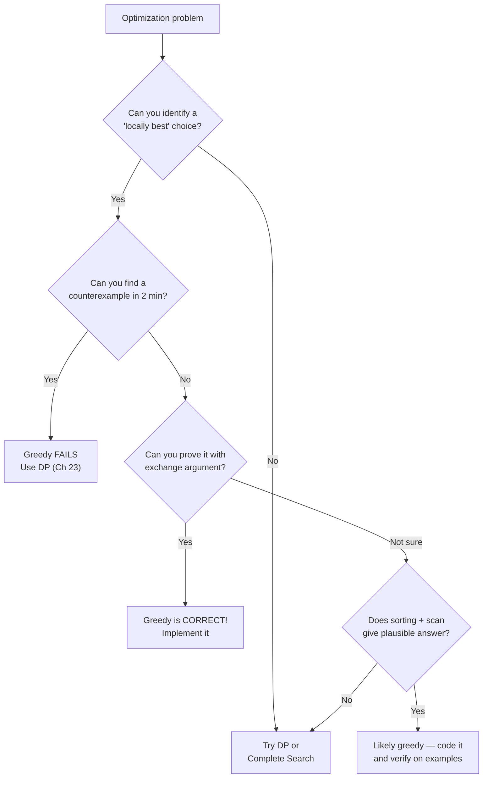

# Greedy Algorithms — The Smart Shortcut


**Silver Arena continues!** You've built prefix sums, mastered two pointers, searched on answers, and wielded heaps. Now we tackle a fundamentally different strategy: **greedy algorithms**. Instead of exploring every possibility, a greedy algorithm makes the locally best choice at every step — and sometimes, miraculously, that's enough to get the globally best answer. But beware: greedy works only when you can PROVE it does. This chapter teaches you when to trust greedy, when to distrust it, and how to prove it correct.


## Chapter Goals

By the end of this chapter, you will:

- Understand the **greedy choice property**: making the locally optimal choice leads to a globally optimal solution
- Know the difference between **optimal substructure** (both greedy and DP need it) and the **greedy choice property** (only greedy has it)
- Recognize when greedy works and when it FAILS — with concrete counterexamples
- Solve the **activity selection** problem by sorting by end time
- Understand why **fractional knapsack** is greedy but **0/1 knapsack** requires DP
- Use greedy to solve **jump games**, **cookie assignment**, and **interval merging**
- Apply the **exchange argument** proof technique to prove greedy algorithms correct
- Identify the "sort first, then greedy" pattern that appears in most greedy problems
- Avoid the top greedy pitfalls: assuming greedy without proof, wrong sort criteria, tiebreaking bugs

---

## The Story: "The Treasure Hunter"

You're a treasure hunter exploring an ancient ruin. The hallway branches into chambers, each containing a pile of gold coins at various distances. Your torch is burning low — you only have enough light for a limited number of trips.

Your instinct says: **"Always grab the closest gold first."**

At first, this works brilliantly. The nearest chamber has 50 coins, the next-nearest has 30, then 20. You collect 100 coins before your torch dims.

But then your friend tries a different ruin where the closest chamber has 1 coin, the second-closest has 2 coins, and the far chamber has 1,000 coins. By always grabbing the closest gold, your friend collects only 3 coins while the far chamber's fortune goes untouched.

**The lesson**: grabbing the "locally best" option works SOMETIMES — but not always. The key question is: **when can you trust your greedy instinct?**

That's what this chapter is about. We'll learn to identify problems where greedy gives the optimal answer, prove WHY it works using the **exchange argument**, and recognize the warning signs when greedy will fail you (and you need DP instead, which we'll learn in Ch 23).

---

[Johari Window: Before](johari.md)

---

## Discovery

Before we explain greedy algorithms formally, try these puzzles:

### Puzzle 1: "The Party Planner"

You're organizing a conference room that can only hold one event at a time. Five teams want to use it:

```
Team A: 9:00 - 10:30
Team B: 9:30 - 10:00
Team C: 10:00 - 11:00
Team D: 10:30 - 12:00
Team E: 11:00 - 11:30
```

How many teams can use the room? Which ones do you pick to maximize the count?


Think about it... If you pick Team A (9:00-10:30), you can then only pick Team E (11:00-11:30) — that's 2 events. But if you pick Team B (9:30-10:00), then Team C (10:00-11:00), then Team E (11:00-11:30) — that's 3 events! The trick is to **sort by end time** and always pick the event that finishes earliest. You'll learn why in section 18.3.


### Puzzle 2: "The Coin Problem"

You need to make change for 41 cents using US coins (25, 10, 5, 1). The greedy approach says: always use the largest coin that fits.

25 + 10 + 5 + 1 = 41 cents using 4 coins.

Is this optimal? Now try the SAME greedy approach with coins {1, 3, 4} and target 6:

- Greedy: 4 + 1 + 1 = 6 using 3 coins
- But: 3 + 3 = 6 using only 2 coins!


Greedy works for US coins but FAILS for arbitrary coin systems! The difference? US coins have a special structure that guarantees greedy optimality. Arbitrary coins need **dynamic programming** (Ch 23). This is the core lesson: greedy needs PROOF.


### Puzzle 3: "The Cookie Monster"

You have cookies of sizes [1, 3, 5, 7] and children with greed factors [2, 4, 6]. Each child is satisfied only if they get a cookie at least as large as their greed factor. Each cookie can go to at most one child. Maximize the number of satisfied children.


Sort both lists! Children: [2, 4, 6], Cookies: [1, 3, 5, 7]. Child with greed 2 gets cookie of size 3. Child with greed 4 gets cookie of size 5. Child with greed 6 gets cookie of size 7. Three children satisfied! The key insight: give each child the SMALLEST cookie that satisfies them — don't waste big cookies on easy-to-please children. Section 18.5 explains the full algorithm.


---

## 18.1 What Makes a Problem Greedy?

A greedy algorithm builds a solution step by step, always making the choice that looks best RIGHT NOW, without looking ahead. For this to produce an optimal solution, the problem needs two properties:

### Greedy Choice Property

The locally optimal choice is part of some globally optimal solution. In other words, you never need to reconsider a greedy choice — once you make it, it stays.

**Example**: In activity selection, picking the activity that ends earliest is always safe — there's always an optimal solution that includes this choice.

### Optimal Substructure

After making a greedy choice, the remaining problem is a smaller instance of the same type of problem.

**Example**: After picking the earliest-ending activity, the remaining problem is "select maximum activities from those that start after the picked one ends" — the same problem on a smaller input.


**Optimal substructure alone is NOT enough!** Dynamic programming problems also have optimal substructure. The difference is the **greedy choice property** — DP considers ALL choices, while greedy commits to ONE choice without looking back. When the greedy choice property holds, you can skip the "consider all options" step and go straight to the best local choice.


### The Greedy Template

Almost every greedy algorithm follows this pattern:

```
1. SORT the input by some criterion
2. ITERATE through the sorted input
3. At each step, make the LOCALLY BEST choice
4. Never go back — once chosen, it stays
```

The hard part is step 1: **finding the right sorting criterion**. Sort by end time? By value/weight ratio? By deadline? The wrong sort order makes greedy produce wrong answers.

---

## 18.2 When Greedy Works vs. When It Fails

### When Greedy Works: US Coin Change

With US coins {25, 10, 5, 1}, the greedy approach (always use the largest coin that fits) always gives the minimum number of coins.

```
Target: 63 cents
Greedy: 25 + 25 + 10 + 1 + 1 + 1 = 6 coins
This IS optimal!
```

### When Greedy FAILS: Arbitrary Coin Change

With coins {1, 3, 4} and target 6:

```
Greedy: 4 + 1 + 1 = 3 coins
Optimal: 3 + 3 = 2 coins
Greedy is WRONG!
```

### When Greedy FAILS: 0/1 Knapsack

Knapsack: capacity 10, items with (weight, value):
- Item A: weight 6, value 8 (ratio 1.33)
- Item B: weight 5, value 5 (ratio 1.00)
- Item C: weight 5, value 5 (ratio 1.00)

Greedy by value/weight ratio picks A first (ratio 1.33), filling 6 of 10. Then neither B nor C fits alone... wait, B fits (6+5 > 10? No! 6+5 = 11 > 10). So greedy picks only A for value 8.

But the optimal solution picks B + C: weight 5+5 = 10, value 5+5 = 10. That's better!


**The 0/1 knapsack problem does NOT have the greedy choice property.** Picking the item with the best ratio can block you from using a better combination. This problem requires DP (Ch 25). However, the FRACTIONAL knapsack (where you can take fractions of items) IS greedy — see section 18.4.


### Red Flags: When to Suspect Greedy Won't Work

| Red Flag | Why | Alternative |
|----------|-----|-------------|
| "Maximize/minimize with subset selection" | Choosing one item affects which others you can take | DP (Ch 23-25) |
| No natural sorting criterion is obvious | Greedy needs a clear "best first" ordering | Try brute force first |
| Counterexample is easy to find | Spend 2 minutes looking for one! | If you find one, greedy is wrong |
| Items interact with each other | One choice constrains future choices in complex ways | DP or backtracking |

---

## 18.3 Activity Selection — The Classic Greedy Problem

### The Problem

Given `n` activities with start and end times, select the maximum number of activities that don't overlap (a room can only hold one activity at a time).

### The Greedy Insight

**Sort activities by end time.** Then greedily pick each activity whose start time is >= the end time of the last picked activity.

Why end time? Because an activity that finishes early leaves the most room for future activities. Starting early doesn't help if the activity runs long!

### Visual Walkthrough

```
Activities (sorted by end time):
  B: |==|            (9:30-10:00)
  A: |=======|       (9:00-10:30)
  C:      |=====|    (10:00-11:00)
  E:           |==|  (11:00-11:30)
  D:      |========| (10:30-12:00)

Step 1: Pick B (ends at 10:00) — it ends earliest
Step 2: Skip A (starts 9:00 < 10:00 — overlaps with B)
Step 3: Pick C (starts 10:00 >= 10:00 — no overlap!)
Step 4: Pick E (starts 11:00 >= 11:00 — no overlap!)
Step 5: Skip D (starts 10:30 < 11:30 — overlaps with E)

Result: B, C, E — 3 activities (maximum possible!)
```

### Code



```python
def activity_selection(activities):
    """Select max non-overlapping activities.
    activities: list of (start, end) tuples
    Returns: count of selected activities
    """
    # Sort by end time
    activities.sort(key=lambda x: x[1])

    count = 0
    last_end = 0  # End time of last selected activity

    for start, end in activities:
        if start >= last_end:
            count += 1
            last_end = end

    return count

# Example
acts = [(9.0, 10.5), (9.5, 10.0), (10.0, 11.0), (10.5, 12.0), (11.0, 11.5)]
print(activity_selection(acts))  # 3
```


```java
static int activitySelection(int[][] activities) {
    // Sort by end time
    Arrays.sort(activities, (a, b) -> a[1] - b[1]);

    int count = 0;
    int lastEnd = 0;

    for (int[] act : activities) {
        if (act[0] >= lastEnd) {
            count++;
            lastEnd = act[1];
        }
    }
    return count;
}
```


```cpp
int activitySelection(vector<vector<int>>& activities) {
    sort(activities.begin(), activities.end(),
         [](auto& a, auto& b) { return a[1] < b[1]; });

    int count = 0, lastEnd = 0;
    for (auto& act : activities) {
        if (act[0] >= lastEnd) {
            count++;
            lastEnd = act[1];
        }
    }
    return count;
}
```



> **Language Spotlight: Custom Sorting**
> | | Python | Java | C++ |
> |---|--------|------|-----|
> | Sort by key | `sort(key=lambda x: x[1])` | `Arrays.sort(arr, (a,b) -> a[1]-b[1])` | `sort(v.begin(), v.end(), [](auto& a, auto& b) { return a[1] < b[1]; })` |
> | Multi-key sort | `sort(key=lambda x: (x[1], x[0]))` | `Comparator.comparingInt(...).thenComparingInt(...)` | `return a[1] != b[1] ? a[1] < b[1] : a[0] < b[0];` |
> | Stable sort | `sorted()` is stable; `sort()` is stable | `Arrays.sort` on objects is stable | `stable_sort()` for stability |

**Complexity**: O(n log n) for sorting + O(n) for the greedy scan = **O(n log n)** total.

---

## 18.4 Fractional Knapsack vs. 0/1 Knapsack

### Fractional Knapsack (Greedy Works!)

You can take **fractions** of items. A thief can cut a gold bar in half and take only what fits.

**Strategy**: Sort items by value/weight ratio (descending). Take items greedily — if an item doesn't fit entirely, take what fraction you can.



```python
def fractional_knapsack(capacity, items):
    """Items: list of (weight, value) tuples.
    Returns: maximum total value (can take fractions).
    """
    # Sort by value/weight ratio, descending
    items.sort(key=lambda x: x[1] / x[0], reverse=True)

    total_value = 0.0
    remaining = capacity

    for weight, value in items:
        if remaining <= 0:
            break
        take = min(weight, remaining)
        total_value += take * (value / weight)
        remaining -= take

    return total_value

# Example: capacity=50, items=(weight, value)
items = [(10, 60), (20, 100), (30, 120)]
print(fractional_knapsack(50, items))  # 240.0
# Take all of item 1 (ratio 6.0), all of item 2 (ratio 5.0),
# then 20/30 of item 3 (ratio 4.0): 60 + 100 + 80 = 240
```


```java
static double fractionalKnapsack(int capacity, int[][] items) {
    // Sort by value/weight ratio descending
    Arrays.sort(items, (a, b) -> Double.compare(
        (double) b[1] / b[0], (double) a[1] / a[0]));

    double totalValue = 0.0;
    int remaining = capacity;

    for (int[] item : items) {
        if (remaining <= 0) break;
        int take = Math.min(item[0], remaining);
        totalValue += take * ((double) item[1] / item[0]);
        remaining -= take;
    }
    return totalValue;
}
```


```cpp
double fractionalKnapsack(int capacity, vector<pair<int,int>>& items) {
    sort(items.begin(), items.end(), [](auto& a, auto& b) {
        return (double)a.second / a.first > (double)b.second / b.first;
    });

    double totalValue = 0.0;
    int remaining = capacity;

    for (auto& [weight, value] : items) {
        if (remaining <= 0) break;
        int take = min(weight, remaining);
        totalValue += take * ((double)value / weight);
        remaining -= take;
    }
    return totalValue;
}
```



### Why 0/1 Knapsack Breaks Greedy

In 0/1 knapsack, you must take an item entirely or not at all. The greedy choice (best ratio first) can waste capacity:

```
Capacity: 10
Item A: weight=6, value=8 (ratio 1.33)
Item B: weight=5, value=5 (ratio 1.00)
Item C: weight=5, value=5 (ratio 1.00)

Greedy (by ratio): takes A (weight 6, value 8). Remaining capacity: 4.
Neither B nor C fits. Total: 8.

Optimal: takes B + C (weight 10, value 10). Total: 10.
```

**The takeaway**: fractional knapsack has the greedy choice property (you can always improve by taking more of the best-ratio item). 0/1 knapsack does NOT — taking the "best" item can block better combinations. That's why 0/1 knapsack needs DP (Ch 25).

---

## 18.5 Jump Game

### Jump Game I: Can You Reach the End?

Given an array where `arr[i]` is the maximum jump length from position `i`, determine if you can reach the last index.

**Greedy insight**: Track the farthest index you can reach. Scan left to right — if you ever reach a position beyond your max reach, you're stuck.



```python
def can_jump(nums):
    """Return True if you can reach the last index."""
    max_reach = 0
    for i in range(len(nums)):
        if i > max_reach:
            return False
        max_reach = max(max_reach, i + nums[i])
    return True

print(can_jump([2, 3, 1, 1, 4]))  # True
print(can_jump([3, 2, 1, 0, 4]))  # False (stuck at index 3)
```


```java
static boolean canJump(int[] nums) {
    int maxReach = 0;
    for (int i = 0; i < nums.length; i++) {
        if (i > maxReach) return false;
        maxReach = Math.max(maxReach, i + nums[i]);
    }
    return true;
}
```


```cpp
bool canJump(vector<int>& nums) {
    int maxReach = 0;
    for (int i = 0; i < (int)nums.size(); i++) {
        if (i > maxReach) return false;
        maxReach = max(maxReach, i + nums[i]);
    }
    return true;
}
```



### Jump Game II: Minimum Jumps

Find the minimum number of jumps to reach the last index (guaranteed reachable).

**Greedy insight**: Use a BFS-like approach. Track the current "level" end and the farthest you can reach. When you pass the current level end, you must jump.



```python
def min_jumps(nums):
    """Return minimum jumps to reach the last index."""
    if len(nums) <= 1:
        return 0
    jumps = 0
    current_end = 0
    farthest = 0
    for i in range(len(nums) - 1):
        farthest = max(farthest, i + nums[i])
        if i == current_end:
            jumps += 1
            current_end = farthest
            if current_end >= len(nums) - 1:
                break
    return jumps
```


```java
static int minJumps(int[] nums) {
    if (nums.length <= 1) return 0;
    int jumps = 0, currentEnd = 0, farthest = 0;
    for (int i = 0; i < nums.length - 1; i++) {
        farthest = Math.max(farthest, i + nums[i]);
        if (i == currentEnd) {
            jumps++;
            currentEnd = farthest;
            if (currentEnd >= nums.length - 1) break;
        }
    }
    return jumps;
}
```


```cpp
int minJumps(vector<int>& nums) {
    if (nums.size() <= 1) return 0;
    int jumps = 0, currentEnd = 0, farthest = 0;
    for (int i = 0; i < (int)nums.size() - 1; i++) {
        farthest = max(farthest, i + nums[i]);
        if (i == currentEnd) {
            jumps++;
            currentEnd = farthest;
            if (currentEnd >= (int)nums.size() - 1) break;
        }
    }
    return jumps;
}
```



---

## 18.6 Interval Problems

Interval problems are a greedy goldmine. They almost always start with sorting.

### Merge Intervals

Given a list of intervals, merge all overlapping intervals.

**Strategy**: Sort by start time. Then scan — if the current interval overlaps with the previous, merge them.



```python
def merge_intervals(intervals):
    """Merge overlapping intervals. Returns list of merged intervals."""
    if not intervals:
        return []
    intervals.sort(key=lambda x: x[0])
    merged = [intervals[0]]
    for start, end in intervals[1:]:
        if start <= merged[-1][1]:
            merged[-1][1] = max(merged[-1][1], end)
        else:
            merged.append([start, end])
    return merged

# Example
print(merge_intervals([[1,3],[2,6],[8,10],[15,18]]))
# [[1, 6], [8, 10], [15, 18]]
```


```java
static int[][] mergeIntervals(int[][] intervals) {
    Arrays.sort(intervals, (a, b) -> a[0] - b[0]);
    List<int[]> merged = new ArrayList<>();
    merged.add(intervals[0]);
    for (int i = 1; i < intervals.length; i++) {
        int[] last = merged.get(merged.size() - 1);
        if (intervals[i][0] <= last[1]) {
            last[1] = Math.max(last[1], intervals[i][1]);
        } else {
            merged.add(intervals[i]);
        }
    }
    return merged.toArray(new int[0][]);
}
```


```cpp
vector<vector<int>> mergeIntervals(vector<vector<int>>& intervals) {
    sort(intervals.begin(), intervals.end());
    vector<vector<int>> merged = {intervals[0]};
    for (int i = 1; i < (int)intervals.size(); i++) {
        if (intervals[i][0] <= merged.back()[1]) {
            merged.back()[1] = max(merged.back()[1], intervals[i][1]);
        } else {
            merged.push_back(intervals[i]);
        }
    }
    return merged;
}
```



### Non-Overlapping Intervals (Minimum Removals)

Given intervals, find the minimum number of intervals to remove so that the rest don't overlap. This is equivalent to: **find the maximum number of non-overlapping intervals** (activity selection!), then subtract from total.



```python
def erase_overlap(intervals):
    """Return minimum removals to make intervals non-overlapping."""
    intervals.sort(key=lambda x: x[1])  # Sort by END time
    count = 0
    last_end = float('-inf')
    for start, end in intervals:
        if start >= last_end:
            count += 1      # Keep this interval
            last_end = end
    return len(intervals) - count  # Remove the rest
```


```java
static int eraseOverlap(int[][] intervals) {
    Arrays.sort(intervals, (a, b) -> a[1] - b[1]);
    int keep = 0;
    int lastEnd = Integer.MIN_VALUE;
    for (int[] iv : intervals) {
        if (iv[0] >= lastEnd) {
            keep++;
            lastEnd = iv[1];
        }
    }
    return intervals.length - keep;
}
```


```cpp
int eraseOverlap(vector<vector<int>>& intervals) {
    sort(intervals.begin(), intervals.end(),
         [](auto& a, auto& b) { return a[1] < b[1]; });
    int keep = 0, lastEnd = INT_MIN;
    for (auto& iv : intervals) {
        if (iv[0] >= lastEnd) {
            keep++;
            lastEnd = iv[1];
        }
    }
    return (int)intervals.size() - keep;
}
```



---

## 18.7 Job Sequencing with Deadlines

### The Problem

You have `n` jobs, each with a deadline and a profit. Each job takes 1 unit of time. You can do at most one job per time slot. Maximize total profit.

**Greedy insight**: Sort by profit (descending). For each job, schedule it in the latest available slot before its deadline.



```python
def job_sequencing(jobs):
    """jobs: list of (job_id, deadline, profit)
    Returns: (count of jobs done, total profit)
    """
    # Sort by profit descending
    jobs.sort(key=lambda x: x[2], reverse=True)

    max_deadline = max(d for _, d, _ in jobs) if jobs else 0
    slots = [False] * (max_deadline + 1)  # 1-indexed

    count, total_profit = 0, 0
    for job_id, deadline, profit in jobs:
        # Find the latest available slot <= deadline
        for t in range(deadline, 0, -1):
            if not slots[t]:
                slots[t] = True
                count += 1
                total_profit += profit
                break

    return count, total_profit
```


```java
static int[] jobSequencing(int[][] jobs) {
    Arrays.sort(jobs, (a, b) -> b[2] - a[2]);  // Sort by profit desc
    int maxDeadline = 0;
    for (int[] j : jobs) maxDeadline = Math.max(maxDeadline, j[1]);

    boolean[] slots = new boolean[maxDeadline + 1];
    int count = 0, totalProfit = 0;

    for (int[] job : jobs) {
        for (int t = job[1]; t >= 1; t--) {
            if (!slots[t]) {
                slots[t] = true;
                count++;
                totalProfit += job[2];
                break;
            }
        }
    }
    return new int[]{count, totalProfit};
}
```


```cpp
pair<int,int> jobSequencing(vector<vector<int>>& jobs) {
    sort(jobs.begin(), jobs.end(),
         [](auto& a, auto& b) { return a[2] > b[2]; });

    int maxDeadline = 0;
    for (auto& j : jobs) maxDeadline = max(maxDeadline, j[1]);

    vector<bool> slots(maxDeadline + 1, false);
    int count = 0, totalProfit = 0;

    for (auto& job : jobs) {
        for (int t = job[1]; t >= 1; t--) {
            if (!slots[t]) {
                slots[t] = true;
                count++;
                totalProfit += job[2];
                break;
            }
        }
    }
    return {count, totalProfit};
}
```



**Complexity**: O(n log n) for sorting + O(n * d) for scheduling where d is the max deadline. With a Union-Find optimization, the scheduling step can be improved to nearly O(n), but the simple version is fine for most contests.

---

## Think Like a Pro


**Errichto** (Kamil Debowski): "Every time I think a greedy approach might work, I spend 2 minutes trying to find a counterexample. If I can't break it, I try to prove it with an exchange argument. The proof usually takes less time than you'd think — just assume your greedy solution differs from the optimal, and show that swapping one element doesn't make things worse. If you can do that, your greedy is correct."

*Why this matters*: Competitive programmers don't just guess that greedy works — they VERIFY it. The 2-minute counterexample search saves you from wrong answers, and the exchange argument gives you confidence.



**Tourist** (Gennady Korotkevich): "Most greedy problems I see in contests follow the same pattern: sort by some criterion, then scan linearly. The tricky part is choosing the right sort order. I often ask myself: 'If I were scheduling these events, what would a rational person do?' The answer is usually 'deal with the most constrained thing first' — earliest deadline, smallest capacity, etc."

*Why this matters*: Greedy is about constraints. The most-constrained-first heuristic guides you to the right sorting criterion in most problems.


---

## Decision Flowchart: When Does Greedy Work?



---

## AOPS Showcase: "Activity Selection — Three Ways"

Given `n` activities with start and end times, select the maximum number of non-overlapping activities. We'll solve it three ways: brute force, then greedy, then PROVE greedy is correct.

### Approach 1: Brute Force — O(2^n)

Try all subsets of activities. For each subset, check if all activities are compatible (no overlaps). Track the largest valid subset.



```python
def solve_brute(activities):
    """O(2^n): Try all subsets, keep the largest non-overlapping one."""
    n = len(activities)
    max_count = 0

    for mask in range(1 << n):
        subset = []
        for i in range(n):
            if mask & (1 << i):
                subset.append(activities[i])

        # Check if this subset has no overlaps
        subset.sort(key=lambda x: x[0])
        valid = True
        for i in range(1, len(subset)):
            if subset[i][0] < subset[i-1][1]:
                valid = False
                break

        if valid:
            max_count = max(max_count, len(subset))

    return max_count
```


```java
static int solveBrute(int[][] activities) {
    int n = activities.length;
    int maxCount = 0;
    for (int mask = 0; mask < (1 << n); mask++) {
        List<int[]> subset = new ArrayList<>();
        for (int i = 0; i < n; i++) {
            if ((mask & (1 << i)) != 0) subset.add(activities[i]);
        }
        subset.sort((a, b) -> a[0] - b[0]);
        boolean valid = true;
        for (int i = 1; i < subset.size(); i++) {
            if (subset.get(i)[0] < subset.get(i - 1)[1]) {
                valid = false; break;
            }
        }
        if (valid) maxCount = Math.max(maxCount, subset.size());
    }
    return maxCount;
}
```


```cpp
int solveBrute(vector<vector<int>>& activities) {
    int n = activities.size(), maxCount = 0;
    for (int mask = 0; mask < (1 << n); mask++) {
        vector<vector<int>> subset;
        for (int i = 0; i < n; i++)
            if (mask & (1 << i)) subset.push_back(activities[i]);
        sort(subset.begin(), subset.end());
        bool valid = true;
        for (int i = 1; i < (int)subset.size(); i++)
            if (subset[i][0] < subset[i-1][1]) { valid = false; break; }
        if (valid) maxCount = max(maxCount, (int)subset.size());
    }
    return maxCount;
}
```



### Approach 2: Greedy — O(n log n)

Sort by end time, always pick the activity that finishes earliest and doesn't overlap with the last picked.



```python
def solve_greedy(activities):
    """O(n log n): Sort by end time, pick greedily."""
    activities.sort(key=lambda x: x[1])
    count = 0
    last_end = 0
    for start, end in activities:
        if start >= last_end:
            count += 1
            last_end = end
    return count
```


```java
static int solveGreedy(int[][] activities) {
    Arrays.sort(activities, (a, b) -> a[1] - b[1]);
    int count = 0, lastEnd = 0;
    for (int[] act : activities) {
        if (act[0] >= lastEnd) { count++; lastEnd = act[1]; }
    }
    return count;
}
```


```cpp
int solveGreedy(vector<vector<int>>& activities) {
    sort(activities.begin(), activities.end(),
         [](auto& a, auto& b) { return a[1] < b[1]; });
    int count = 0, lastEnd = 0;
    for (auto& act : activities) {
        if (act[0] >= lastEnd) { count++; lastEnd = act[1]; }
    }
    return count;
}
```



### Approach 3: The Proof — Exchange Argument

Here's the key pedagogical moment of this chapter. We PROVE greedy gives the optimal answer.

**Theorem**: The greedy algorithm (sort by end time, pick earliest-finishing non-overlapping activity) selects the maximum number of activities.

**Proof by exchange argument:**

1. Let **G** = the greedy solution with activities g1, g2, ..., gk (sorted by end time).
2. Let **O** = any optimal solution with activities o1, o2, ..., om (sorted by end time), where m >= k.
3. We'll show m = k (greedy is also optimal).

**Step 1**: Find the first place where G and O differ. Suppose g1 = o1, g2 = o2, ..., g(i-1) = o(i-1), but gi != oi.

**Step 2**: Since greedy picks the earliest-ending activity available, gi ends no later than oi: `end(gi) <= end(oi)`.

**Step 3**: **Exchange**: Replace oi with gi in solution O. This is safe because:
- gi starts after g(i-1) ends (greedy ensured this)
- Since g(i-1) = o(i-1), gi doesn't conflict with the first i-1 activities in O
- Since end(gi) <= end(oi), gi doesn't create new conflicts with o(i+1) either

**Step 4**: After the swap, O is still valid and still has m activities. But now it agrees with G on the first i activities.

**Step 5**: Repeat this exchange until O = G. Since O always stays valid with m activities, m = k. Done!


**The exchange argument in plain English**: "Suppose someone claims they have a better solution than greedy. We show that we can swap their choices for greedy's choices, one at a time, without making the solution worse. After all swaps, their solution equals greedy's solution — so greedy was optimal all along!"


### Comparison Table

| Approach | Time | Space | Idea |
|----------|------|-------|------|
| Brute Force | O(2^n * n) | O(n) | Try all subsets |
| **Greedy** | **O(n log n)** | **O(1)** | Sort by end time, pick greedily |


**The AOPS lesson**: The brute force confirms greedy gives the right answer on small inputs. The exchange argument proves it works on ALL inputs. This three-step process — brute force, greedy, proof — is how competitive programmers validate greedy algorithms.


---

## Legend's Corner


**Errichto** (Kamil Debowski) — world-class competitive programmer and YouTube educator. "I always tell students: greedy algorithms are the most deceptive topic in competitive programming. They LOOK simple — just sort and scan. But the difference between 'sort by start time' and 'sort by end time' in activity selection is the difference between a wrong answer and a correct one. And the only way to know which is right is to either find a counterexample for the wrong approach, or prove the right one with an exchange argument."

"Exchange arguments scared me when I first learned them, but they're actually very mechanical: (1) assume your greedy differs from optimal, (2) find the first difference, (3) show swapping doesn't make things worse. I've used this pattern hundreds of times — it's the same proof structure for activity selection, Huffman coding, and even some scheduling problems."

**What you can learn**: Don't fear proofs! The exchange argument is a template you can learn once and apply everywhere. And spending 2 minutes looking for a counterexample before coding saves 20 minutes of debugging a wrong greedy solution.


---

## Gotchas


**Gotcha 1: Assuming greedy works without proof!**

This is the #1 mistake. Greedy FEELS right because "take the best available" sounds logical. But without the greedy choice property, it produces wrong answers. Always spend 2 minutes looking for a counterexample before committing to greedy.

```python
# 0/1 Knapsack — greedy by ratio is WRONG!
# Capacity=10, items: (weight=6, value=8), (weight=5, value=5), (weight=5, value=5)
# Greedy takes item 1 (ratio 1.33) → value 8
# Optimal takes items 2+3 → value 10
```



**Gotcha 2: Wrong sorting criterion!**

In activity selection, sorting by START time gives the wrong answer. Sorting by DURATION gives the wrong answer. Only sorting by END time is correct.

```python
# WRONG: Sort by start time
activities = [(1, 100), (2, 3), (4, 5)]
# Greedy picks (1, 100) first — only 1 activity!
# Optimal: (2, 3) and (4, 5) — 2 activities!

# WRONG: Sort by duration
activities = [(1, 4), (3, 5), (0, 6), (5, 7), (3, 8)]
# Duration of (1,4)=3, (3,5)=2, (0,6)=6, (5,7)=2, (3,8)=5
# Sort by duration: (3,5),(5,7),(1,4),(3,8),(0,6)
# Greedy picks (3,5),(5,7) — 2 activities
# But (1,4),(5,7) is also 2, and so is (3,5),(5,7)... in this case ok,
# but duration-sort fails on other inputs!
```



**Gotcha 3: Tiebreaking issues!**

When two activities end at the same time, which do you pick? When two items have the same ratio, which goes first? Incorrect tiebreaking can cause wrong answers or TLE.

```python
# If activities (1, 5) and (3, 5) both end at 5,
# picking (1, 5) blocks (3, 5) and vice versa.
# For activity selection COUNT, it doesn't matter.
# But for other problems, tiebreaking can change the answer!
```



**Gotcha 4: Integer overflow in comparators!**

In Java, `(a, b) -> a[1] - b[1]` can overflow if values are near Integer.MAX_VALUE or MIN_VALUE. Use `Integer.compare(a[1], b[1])` instead.

```java
// WRONG: Can overflow!
Arrays.sort(arr, (a, b) -> a[0] - b[0]);

// RIGHT: Safe comparison
Arrays.sort(arr, (a, b) -> Integer.compare(a[0], b[0]));
```



**Gotcha 5: Off-by-one with interval boundaries!**

Is `[1, 5]` and `[5, 10]` overlapping? It depends on the problem! Some problems use **closed intervals** (yes, they overlap at 5), others use **half-open intervals** (no overlap). Read the problem statement carefully.

```python
# Closed intervals: start >= last_end means NO overlap (endpoints can touch)
# If start > last_end needed, change the comparison:
if start >= last_end:   # Touching endpoints are OK (most common)
if start > last_end:    # Touching endpoints count as overlap
```



**Gotcha 6: Forgetting to sort!**

Greedy algorithms almost always need sorted input. If you forget the sort step, the greedy scan produces garbage.

```python
# WRONG: No sort!
def activity_selection_broken(activities):
    count = 0
    last_end = 0
    for start, end in activities:  # Unsorted — picks arbitrarily!
        if start >= last_end:
            count += 1
            last_end = end
    return count

# RIGHT: Sort first!
activities.sort(key=lambda x: x[1])
```


---

## Practice Problems

| # | Name | Difficulty | Key Concept |
|---|------|-----------|-------------|
| W1 | Assign Cookies | ⭐ | Sort both lists, greedy match with two pointers |
| W2 | Jump Game I | ⭐ | Track max reachable index |
| W3 | Best Time to Buy and Sell Stock | ⭐ | Single pass, track min price |
| W4 | Lemonade Change | ⭐ | Simulate making change greedily |
| P1 | Activity Selection | ⭐⭐ | Sort by end time, pick non-overlapping |
| P2 | Fractional Knapsack | ⭐⭐ | Sort by value/weight ratio |
| P3 | Merge Intervals | ⭐⭐ | Sort by start, merge overlapping |
| P4 | Non-overlapping Intervals | ⭐⭐ | Minimum removals = n - max non-overlapping |
| P5 | Jump Game II | ⭐⭐ | BFS-like minimum jumps |
| C1 | Job Sequencing with Deadlines | ⭐⭐⭐ | Sort by profit, schedule in latest available slot |
| C2 | Gas Station | ⭐⭐⭐ | Circular route, find valid start |
| C3 | Minimum Platforms | ⭐⭐⭐ | Overlapping intervals, count max simultaneous |
| C4 | Candy Distribution | ⭐⭐⭐ | Two-pass: left-to-right, right-to-left |

---

## Language Idioms



```python
# ── Lambda sorting (the bread and butter of greedy) ──
intervals.sort(key=lambda x: x[1])          # Sort by end time
intervals.sort(key=lambda x: (x[1], x[0]))  # Sort by end, then start

# ── Sorting with reverse ──
items.sort(key=lambda x: x[2], reverse=True)  # Sort by profit descending

# ── Using float('-inf') and float('inf') for sentinels ──
last_end = float('-inf')  # Negative infinity — everything is after this
max_reach = 0

# ── zip for parallel iteration ──
for child, cookie in zip(sorted(children), sorted(cookies)):
    ...

# ── Tuple unpacking in for loops ──
for start, end in intervals:  # Clean!
    ...
```


```java
// ── Comparator with lambda (safest for greedy sorting) ──
Arrays.sort(arr, (a, b) -> Integer.compare(a[1], b[1]));  // By end time
Arrays.sort(arr, (a, b) -> Integer.compare(b[2], a[2]));  // By profit desc

// ── Comparator chaining ──
Arrays.sort(arr, Comparator.comparingInt((int[] a) -> a[1])
                            .thenComparingInt(a -> a[0]));

// ── ArrayList for dynamic result building ──
List<int[]> merged = new ArrayList<>();
merged.add(intervals[0]);
// ...
return merged.toArray(new int[0][]);

// ── Sorting with Collections ──
Collections.sort(list, (a, b) -> Integer.compare(a.profit, b.profit));
```


```cpp
// ── Lambda comparator ──
sort(v.begin(), v.end(), [](auto& a, auto& b) {
    return a[1] < b[1];  // Sort by end time
});

// ── Sort by multiple keys ──
sort(v.begin(), v.end(), [](auto& a, auto& b) {
    if (a[1] != b[1]) return a[1] < b[1];
    return a[0] < b[0];
});

// ── Structured bindings with pairs ──
for (auto& [start, end] : intervals) { ... }

// ── Using INT_MIN / INT_MAX as sentinels ──
#include <climits>
int lastEnd = INT_MIN;

// ── pair and vector<pair<int,int>> for intervals ──
vector<pair<int,int>> events;
sort(events.begin(), events.end());  // Sorts by first, then second
```



---

## Breadcrumbs

### Looking Back
- **Ch 8** (The Art of Sorting): Most greedy algorithms start with sorting — the "sort first, think later" pattern. Choosing the right sort criterion is the hardest part of greedy algorithm design
- **Ch 13** (Bronze Battle Plan — Complete Search): Complete search tries ALL possibilities — greedy skips to the locally best. When you can PROVE greedy works, you jump from O(2^n) to O(n log n)
- **Ch 16** (Binary Search Beyond): Binary search on the answer is another optimization strategy. Sometimes problems can be solved either with greedy or with binary search — they're complementary tools

### Looking Forward
- **Ch 23** (DP I — The Foundation): When greedy FAILS, DP is the answer. DP considers ALL choices at each step (greedy commits to ONE). The 0/1 knapsack problem, where greedy fails, is a classic DP problem
- **Ch 27** (Shortest Paths): Dijkstra's algorithm is a greedy algorithm! It always extends the shortest known path — the greedy choice property holds because edge weights are non-negative
- **Ch 29** (Union-Find & MST): Kruskal's and Prim's algorithms for Minimum Spanning Trees are both greedy — Kruskal sorts edges by weight and greedily adds the cheapest safe edge

### Cross-Chapter Threads
- **"Sort first, think later"**: This thread started in Ch 8 and is now a CORE strategy. Activity selection sorts by end time. Fractional knapsack sorts by ratio. Job sequencing sorts by profit. The theme: most greedy algorithms are "sort, then scan"
- **"Brute force first, then optimize"**: The AOPS showcase shows: brute force O(2^n) -> greedy O(n log n). Starting with brute force helps you understand the problem before optimizing
- **"Proof matters"**: The exchange argument proof technique introduced here will appear again in Ch 25 (DP subsequences — proving greedy for certain scheduling) and Ch 29 (proving Kruskal's MST algorithm correct)

---

[Johari Window: After](johari.md)

---

## Open Questions Beyond

1. **"We proved activity selection is greedy. But what about WEIGHTED activity selection, where each activity has a value and you want to maximize total value (not count)?"** It turns out weighted activity selection is NOT greedy — you need DP! The weights break the greedy choice property. You'll see this in Ch 23.

2. **"Greedy algorithms are fast but only work for certain problems. Are there problems where greedy gives a GOOD (but not optimal) answer?"** Yes! In the field of **approximation algorithms**, greedy often gives solutions that are within a guaranteed factor of optimal. For example, the greedy set cover algorithm achieves a ln(n) approximation ratio.

3. **"Dijkstra's algorithm is greedy. What happens if edge weights can be negative?"** Dijkstra breaks! The greedy choice property ("the shortest unvisited vertex has its final distance") fails with negative edges. You'd need Bellman-Ford instead (Ch 27).

---

## What's Next

You've learned the greedy strategy: sort, scan, and commit to the locally best choice. You know when to trust it (activity selection, fractional knapsack, interval merging) and when to distrust it (0/1 knapsack, arbitrary coin change). Most importantly, you can PROVE greedy correct using the exchange argument.

In Ch 19 (**Graphs I — Exploring Networks**), you'll enter a whole new world. Graphs model relationships between objects — social networks, road maps, computer networks. You'll learn BFS and DFS, two fundamental traversal algorithms that unlock an enormous class of problems. And guess what? Some graph algorithms (like Dijkstra's shortest path) are greedy at their core — your greedy instincts will serve you well!

The network awaits. Let's explore!
