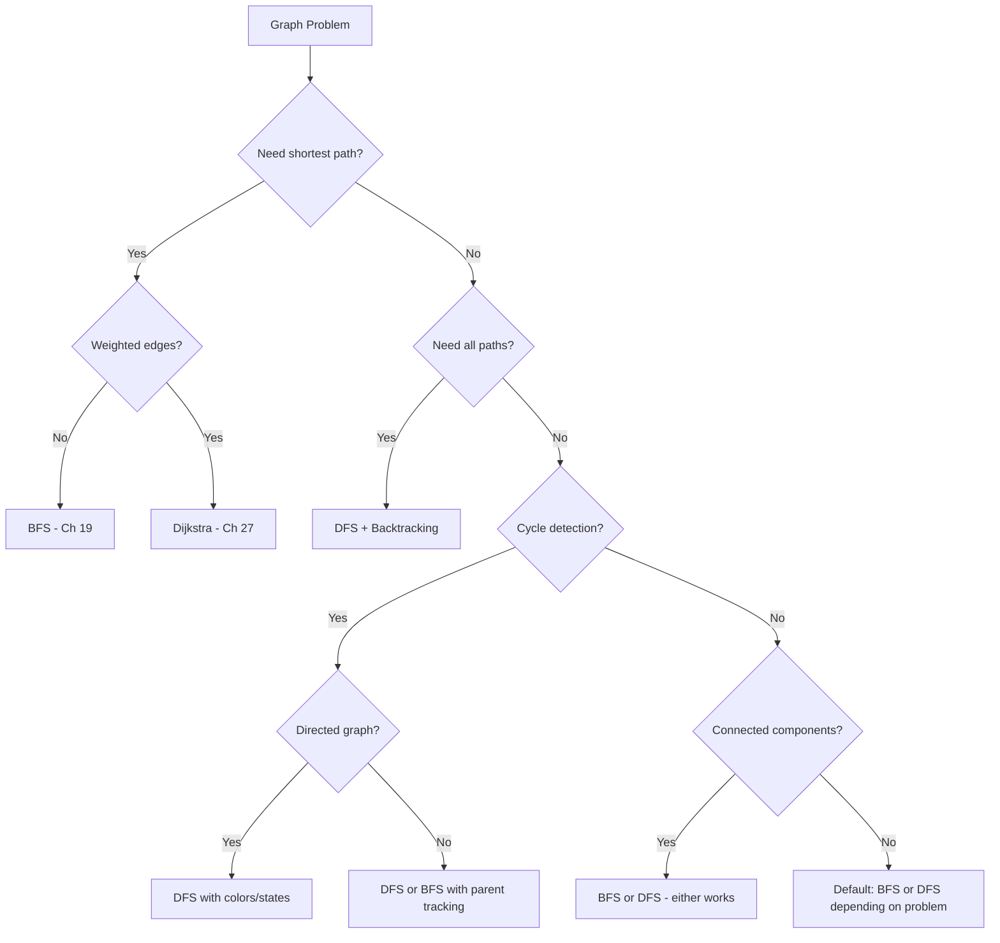

# Graphs I — Exploring Networks


**Welcome to the world of graphs!** Everything you've learned so far — arrays, sorting, searching, recursion, hashing — has been about working with *sequences* of data. Now we take a GIANT leap: data that has *connections*. Friendships, roads, web links, dependencies — these are all graphs. Graph algorithms solve some of the most famous problems in computer science, and BFS/DFS are the two fundamental tools you'll use in almost every graph problem. Let's explore!


## Chapter Goals

By the end of this chapter, you will:

- Define what a graph is: vertices (nodes) and edges (connections)
- Distinguish directed vs undirected and weighted vs unweighted graphs
- Build three graph representations: adjacency list, adjacency matrix, and edge list
- Implement Breadth-First Search (BFS) using a queue — level by level, like ripples in a pond
- Implement Depth-First Search (DFS) using recursion or a stack — diving deep before backtracking
- Find all connected components in an undirected graph
- Use BFS to find shortest paths in unweighted graphs (and understand why DFS gets this WRONG)
- Detect cycles in undirected and directed graphs
- Check if a graph is bipartite (2-colorable)
- Recognize the "reduce to graph" pattern — many problems are secretly graph problems in disguise

---

## The Story: "The Social Network"

Imagine you just joined a new school. On your first day, you notice something: friendships form a web. Alice is friends with Bob. Bob is friends with Charlie. Charlie is friends with Diana. Even though Alice has never met Diana, there's a *path* connecting them through Bob and Charlie.

Now someone asks: **"What's the smallest number of introductions needed to connect Alice to Diana?"**

You could try every possible chain of friendships (brute force), but that's slow. You could dive deep along one chain — Alice to Bob to Charlie to Diana — and hope it's the shortest. But what if there's a shortcut you missed?

Here's the key insight: if you spread out from Alice **one step at a time** — first meeting all of Alice's direct friends, then all of THEIR friends, then all of THEIRS — the moment you first reach Diana, you've found the **shortest** chain. No backtracking needed.

This is **Breadth-First Search (BFS)** — and it works because checking connections level-by-level guarantees you find the shortest path first.

But what if the question isn't about shortest paths? What if you want to know: "Is there ANY chain of friendships connecting Alice to Diana?" For that, you could dive deep along one chain until you either reach Diana or hit a dead end — then backtrack and try another chain. This is **Depth-First Search (DFS)**.

BFS and DFS are the two fundamental ways to explore a graph. Together, they solve an incredible variety of problems. In fact, there's a famous idea called **"six degrees of separation"** — the claim that any two people on Earth are connected through at most six friendships. That's a graph problem! And BFS is exactly how you'd verify it.

Welcome to the world of graphs. Everything is connected.

---

[Johari Window: Before](johari.md)

---

## Discovery

Before we teach you graph theory, try these puzzles using just your intuition:

### Puzzle 1: "The Friend Chain"

Here's a friendship network among 6 people (numbered 0-5):

```
    0 --- 1
    |     |
    2 --- 3
          |
          4 --- 5
```

**Question**: What's the shortest chain of friendships from person 0 to person 5?


One answer: 0 -> 1 -> 3 -> 4 -> 5 (length 4). Another: 0 -> 2 -> 3 -> 4 -> 5 (also length 4). Both require 4 steps — there's no shorter path. How would you *systematically* find this? You'll learn BFS in section 19.3.


### Puzzle 2: "The Isolated Groups"

Here are 7 people with these friendships:

```
    0 --- 1     3 --- 4
    |           |
    2           5     6
```

**Question**: How many separate friend groups exist?


Three groups: {0, 1, 2}, {3, 4, 5}, and {6} (all alone). These are called **connected components**. You'll learn to find them automatically in section 19.5.


### Puzzle 3: "The Impossible Teams"

Your teacher wants to split these students into two teams (Team A and Team B) such that no two students on the same team are friends:

```
    0 --- 1
    |     |
    3 --- 2
```

Can you do it? Now try this one:

```
    0 --- 1
    |   / |
    2 --- 3
```

Wait — 0-1-2 forms a triangle (0 is friends with 1, 1 with 2, and 0 with 2). Can you still split them into two teams?


First graph: YES! Team A = {0, 2}, Team B = {1, 3}. No two friends are on the same team. Second graph: NO! The triangle 0-1-2 makes it impossible. If 0 is on Team A, then 1 must be on Team B, and 2 must be on Team A (because 2 is friends with 1). But 0 and 2 are ALSO friends, and they're both on Team A. Contradiction! This is called a **bipartite check** — you'll learn it in Practice Problem P3.


---

## 19.1 What Is a Graph?

A **graph** is a collection of **vertices** (also called **nodes**) connected by **edges**. That's it! Formally:

```
G = (V, E)
```

where V is a set of vertices and E is a set of edges. Each edge connects two vertices.

### Vocabulary

| Term | Meaning | Example |
|------|---------|---------|
| **Vertex (node)** | A point in the graph | A person in a social network |
| **Edge** | A connection between two vertices | A friendship |
| **Directed** | Edges have a direction (u -> v) | Twitter follows (you follow someone, they don't follow back) |
| **Undirected** | Edges go both ways (u <-> v) | Facebook friendships (mutual) |
| **Weighted** | Edges have a cost/distance | Roads with distances |
| **Unweighted** | All edges are equal | Simple friendships |
| **Degree** | Number of edges connected to a vertex | Number of friends |
| **Path** | A sequence of edges connecting two vertices | A chain of friendships |
| **Cycle** | A path that starts and ends at the same vertex | A -> B -> C -> A |
| **Connected** | There's a path between every pair of vertices | Everyone can reach everyone |

### Types of Graphs

```
UNDIRECTED              DIRECTED              WEIGHTED
  0 --- 1               0 --> 1               0 --5-- 1
  |     |               |     ^               |       |
  2 --- 3               v     |               3       2
                         2 --> 3               |       |
                                               2 --7-- 3
```

**Undirected**: edge (0,1) means 0 connects to 1 AND 1 connects to 0.

**Directed**: edge (0,1) means 0 connects to 1 but NOT necessarily 1 to 0.

**Weighted**: edge (0,1) with weight 5 means the "cost" of going from 0 to 1 is 5.


In this chapter, we focus on **unweighted** graphs. Weighted graphs and shortest-path algorithms like Dijkstra come in Ch 27.


---

## 19.2 Graph Representations

There are three common ways to store a graph in code. Let's use this example:

```
    0 --- 1
    |     |
    2 --- 3
```

4 vertices, 4 edges: (0,1), (0,2), (1,3), (2,3)

### 1. Adjacency List

For each vertex, store a list of its neighbors.

```
0: [1, 2]
1: [0, 3]
2: [0, 3]
3: [1, 2]
```

**Pros**: Space-efficient for sparse graphs (O(V + E)), fast neighbor iteration.
**Cons**: Checking "is there an edge between u and v?" takes O(degree(u)).

This is the **most commonly used** representation in competitive programming.

### 2. Adjacency Matrix

A 2D grid where `matrix[u][v] = 1` means there's an edge from u to v.

```
    0  1  2  3
0 [ 0  1  1  0 ]
1 [ 1  0  0  1 ]
2 [ 1  0  0  1 ]
3 [ 0  1  1  0 ]
```

**Pros**: O(1) edge lookup, simple to implement.
**Cons**: O(V^2) space — terrible for large sparse graphs (10,000 nodes = 100 million entries!).

### 3. Edge List

Just store a list of all edges.

```
[(0,1), (0,2), (1,3), (2,3)]
```

**Pros**: Simple, compact for sparse graphs.
**Cons**: Finding all neighbors of a vertex requires scanning all edges.

### When to Use What?

| Representation | Space | Edge lookup | Iterate neighbors | Best for |
|---------------|-------|------------|-------------------|----------|
| Adjacency List | O(V+E) | O(degree) | O(degree) | Most problems (default!) |
| Adjacency Matrix | O(V^2) | O(1) | O(V) | Dense graphs, V < 1000 |
| Edge List | O(E) | O(E) | O(E) | Kruskal's MST, edge-centric algorithms |


**Rule of thumb**: Always use an adjacency list unless you have a specific reason not to. It's the default in competitive programming.


### Code: Building an Adjacency List



```python
def build_adj_list(n, edges):
    """Build adjacency list for undirected graph."""
    adj = [[] for _ in range(n)]
    for u, v in edges:
        adj[u].append(v)
        adj[v].append(u)
    return adj

# Example
edges = [[0, 1], [0, 2], [1, 3], [2, 3]]
adj = build_adj_list(4, edges)
for i in range(4):
    print(f"{i}: {adj[i]}")
# 0: [1, 2]
# 1: [0, 3]
# 2: [0, 3]
# 3: [1, 2]
```


```java
import java.util.*;

List<List<Integer>> buildAdjList(int n, int[][] edges) {
    List<List<Integer>> adj = new ArrayList<>();
    for (int i = 0; i < n; i++) adj.add(new ArrayList<>());
    for (int[] e : edges) {
        adj.get(e[0]).add(e[1]);
        adj.get(e[1]).add(e[0]);
    }
    return adj;
}
```


```cpp
#include <vector>
using namespace std;

vector<vector<int>> buildAdjList(int n, vector<vector<int>>& edges) {
    vector<vector<int>> adj(n);
    for (auto& e : edges) {
        adj[e[0]].push_back(e[1]);
        adj[e[1]].push_back(e[0]);
    }
    return adj;
}
```



**Language Spotlight**:

| Feature | Python | Java | C++ |
|---------|--------|------|-----|
| Adjacency list type | `list[list[int]]` | `List<List<Integer>>` | `vector<vector<int>>` |
| Initialize n empty lists | `[[] for _ in range(n)]` | Loop + `new ArrayList<>()` | `vector<vector<int>>(n)` |
| Add neighbor | `adj[u].append(v)` | `adj.get(u).add(v)` | `adj[u].push_back(v)` |

---

## 19.3 Breadth-First Search (BFS)

BFS explores a graph **level by level**, like ripples spreading from a stone dropped in a pond. It uses a **queue** (FIFO: first in, first out).

### The Algorithm

```
1. Start at source node. Mark it visited. Add it to the queue.
2. While the queue is not empty:
   a. Dequeue the front node.
   b. Process it (add to result, check condition, etc.)
   c. For each unvisited neighbor:
      - Mark it visited
      - Enqueue it
```

### Visual Walkthrough

Graph:
```
    0 --- 1
    |     |
    2 --- 3
          |
          4
```

BFS from node 0:

```
Step 1: Queue = [0]        Visited = {0}         Result = []
Step 2: Dequeue 0          Visited = {0,1,2}     Result = [0]
        Enqueue neighbors 1, 2
        Queue = [1, 2]
Step 3: Dequeue 1          Visited = {0,1,2,3}   Result = [0, 1]
        Enqueue neighbor 3 (0 already visited)
        Queue = [2, 3]
Step 4: Dequeue 2          Visited = {0,1,2,3}   Result = [0, 1, 2]
        Neighbor 0 visited, neighbor 3 visited
        Queue = [3]
Step 5: Dequeue 3          Visited = {0,1,2,3,4} Result = [0, 1, 2, 3]
        Enqueue neighbor 4
        Queue = [4]
Step 6: Dequeue 4          Visited = {0,1,2,3,4} Result = [0, 1, 2, 3, 4]
        Queue = []  -> DONE!
```

**BFS order: 0, 1, 2, 3, 4**

Notice: BFS visits nodes in order of their distance from the source. Level 0 = {0}, Level 1 = {1, 2}, Level 2 = {3}, Level 3 = {4}.

### Code: BFS



```python
from collections import deque

def bfs(adj, source):
    """Return BFS traversal order starting from source."""
    n = len(adj)
    visited = [False] * n
    visited[source] = True
    queue = deque([source])
    order = []

    while queue:
        node = queue.popleft()
        order.append(node)
        for neighbor in sorted(adj[node]):  # sorted for deterministic order
            if not visited[neighbor]:
                visited[neighbor] = True
                queue.append(neighbor)

    return order
```


```java
import java.util.*;

List<Integer> bfs(List<List<Integer>> adj, int source) {
    int n = adj.size();
    boolean[] visited = new boolean[n];
    visited[source] = true;
    Queue<Integer> queue = new LinkedList<>();
    queue.add(source);
    List<Integer> order = new ArrayList<>();

    while (!queue.isEmpty()) {
        int node = queue.poll();
        order.add(node);
        List<Integer> neighbors = new ArrayList<>(adj.get(node));
        Collections.sort(neighbors);
        for (int neighbor : neighbors) {
            if (!visited[neighbor]) {
                visited[neighbor] = true;
                queue.add(neighbor);
            }
        }
    }
    return order;
}
```


```cpp
#include <algorithm>
#include <queue>
#include <vector>
using namespace std;

vector<int> bfs(vector<vector<int>>& adj, int source) {
    int n = adj.size();
    vector<bool> visited(n, false);
    visited[source] = true;
    queue<int> q;
    q.push(source);
    vector<int> order;

    while (!q.empty()) {
        int node = q.front(); q.pop();
        order.push_back(node);
        vector<int> neighbors = adj[node];
        sort(neighbors.begin(), neighbors.end());
        for (int neighbor : neighbors) {
            if (!visited[neighbor]) {
                visited[neighbor] = true;
                q.push(neighbor);
            }
        }
    }
    return order;
}
```



**Time Complexity**: O(V + E) — visit every vertex once, check every edge once.
**Space Complexity**: O(V) — for the visited array and queue.


**Critical**: Mark nodes as visited WHEN YOU ADD THEM TO THE QUEUE, not when you dequeue them. If you wait until dequeue, the same node can be added to the queue multiple times by different neighbors, wasting time and memory. This is the #1 BFS bug!


---

## 19.4 Depth-First Search (DFS)

DFS explores a graph by going **as deep as possible** before backtracking. It's like exploring a maze: pick a path, follow it until you hit a dead end, then backtrack and try another path.

### The Algorithm (Recursive)

```
DFS(node):
    Mark node as visited
    Process node
    For each unvisited neighbor of node:
        DFS(neighbor)
```

### The Algorithm (Iterative with Stack)

```
1. Push source onto stack. Mark it visited.
2. While stack is not empty:
   a. Pop the top node.
   b. Process it.
   c. For each unvisited neighbor:
      - Mark it visited
      - Push it onto stack
```

### Visual Walkthrough

Same graph:
```
    0 --- 1
    |     |
    2 --- 3
          |
          4
```

DFS from node 0 (visiting smallest neighbor first):

```
Step 1: Visit 0        Stack/Call: [0]          Result = [0]
Step 2: Visit 1 (neighbor of 0)                 Result = [0, 1]
Step 3: Visit 3 (neighbor of 1, 0 visited)      Result = [0, 1, 3]
Step 4: Visit 2 (neighbor of 3, 1 visited)      Result = [0, 1, 3, 2]
        Neighbor 0 visited -> backtrack
Step 5: Visit 4 (neighbor of 3)                 Result = [0, 1, 3, 2, 4]
        All neighbors of 4 visited -> backtrack all the way
```

**DFS order: 0, 1, 3, 2, 4**

Notice how DFS "dives deep" — it goes 0 -> 1 -> 3 -> 2 before backtracking, unlike BFS which would visit 0 -> 1, 2 -> 3 -> 4 level by level.

### Code: DFS (Recursive)



```python
def dfs(adj, source):
    """Return DFS traversal order starting from source."""
    n = len(adj)
    visited = [False] * n
    order = []

    def _dfs(node):
        visited[node] = True
        order.append(node)
        for neighbor in sorted(adj[node]):
            if not visited[neighbor]:
                _dfs(neighbor)

    _dfs(source)
    return order
```


```java
import java.util.*;

List<Integer> dfs(List<List<Integer>> adj, int source) {
    int n = adj.size();
    boolean[] visited = new boolean[n];
    List<Integer> order = new ArrayList<>();
    dfsHelper(adj, source, visited, order);
    return order;
}

void dfsHelper(List<List<Integer>> adj, int node,
               boolean[] visited, List<Integer> order) {
    visited[node] = true;
    order.add(node);
    List<Integer> neighbors = new ArrayList<>(adj.get(node));
    Collections.sort(neighbors);
    for (int neighbor : neighbors) {
        if (!visited[neighbor]) {
            dfsHelper(adj, neighbor, visited, order);
        }
    }
}
```


```cpp
#include <algorithm>
#include <vector>
using namespace std;

void dfsHelper(vector<vector<int>>& adj, int node,
               vector<bool>& visited, vector<int>& order) {
    visited[node] = true;
    order.push_back(node);
    vector<int> neighbors = adj[node];
    sort(neighbors.begin(), neighbors.end());
    for (int neighbor : neighbors) {
        if (!visited[neighbor]) {
            dfsHelper(adj, neighbor, visited, order);
        }
    }
}

vector<int> dfs(vector<vector<int>>& adj, int source) {
    int n = adj.size();
    vector<bool> visited(n, false);
    vector<int> order;
    dfsHelper(adj, source, visited, order);
    return order;
}
```



**Time Complexity**: O(V + E) — same as BFS.
**Space Complexity**: O(V) — for visited array + recursion stack (up to O(V) deep).


**Stack overflow danger**: Recursive DFS can overflow the call stack for very deep graphs (V > ~10,000 in Python, ~100,000 in Java/C++). For such cases, use iterative DFS with an explicit stack.


---

## 19.5 Connected Components

A **connected component** is a maximal set of vertices such that there's a path between every pair. Think of it as an "island" in the graph.

```
    0 --- 1     3 --- 4
    |           |
    2           5     6

Component 1: {0, 1, 2}
Component 2: {3, 4, 5}
Component 3: {6}
```

### Algorithm

```
count = 0
For each vertex v from 0 to n-1:
    If v is not visited:
        BFS or DFS from v (marks all reachable vertices as visited)
        count += 1
Return count
```

Every time we start a new BFS/DFS, we've found a new component.



```python
from collections import deque

def count_components(n, adj):
    """Count connected components using BFS."""
    visited = [False] * n
    count = 0
    for v in range(n):
        if not visited[v]:
            # BFS from v
            queue = deque([v])
            visited[v] = True
            while queue:
                node = queue.popleft()
                for neighbor in adj[node]:
                    if not visited[neighbor]:
                        visited[neighbor] = True
                        queue.append(neighbor)
            count += 1
    return count
```


```java
int countComponents(int n, List<List<Integer>> adj) {
    boolean[] visited = new boolean[n];
    int count = 0;
    for (int v = 0; v < n; v++) {
        if (!visited[v]) {
            Queue<Integer> queue = new LinkedList<>();
            queue.add(v);
            visited[v] = true;
            while (!queue.isEmpty()) {
                int node = queue.poll();
                for (int neighbor : adj.get(node)) {
                    if (!visited[neighbor]) {
                        visited[neighbor] = true;
                        queue.add(neighbor);
                    }
                }
            }
            count++;
        }
    }
    return count;
}
```


```cpp
int countComponents(int n, vector<vector<int>>& adj) {
    vector<bool> visited(n, false);
    int count = 0;
    for (int v = 0; v < n; v++) {
        if (!visited[v]) {
            queue<int> q;
            q.push(v);
            visited[v] = true;
            while (!q.empty()) {
                int node = q.front(); q.pop();
                for (int neighbor : adj[node]) {
                    if (!visited[neighbor]) {
                        visited[neighbor] = true;
                        q.push(neighbor);
                    }
                }
            }
            count++;
        }
    }
    return count;
}
```



---

## 19.6 BFS vs DFS Comparison

Both BFS and DFS visit all reachable vertices in O(V + E). So when should you use which?

| Feature | BFS | DFS |
|---------|-----|-----|
| **Data structure** | Queue (FIFO) | Stack / Recursion (LIFO) |
| **Exploration order** | Level by level (breadth) | Deep then backtrack (depth) |
| **Shortest path (unweighted)** | YES | NO |
| **Space usage** | O(width of graph) | O(depth of graph) |
| **Cycle detection** | Works | Works |
| **Topological sort** | Works (Kahn's) | Works (finish-time order) |
| **Best for** | Shortest paths, level-order | Cycle detection, backtracking, path enumeration |


**When in doubt, use BFS** for shortest path problems and **DFS** for "find all paths" or "does a path exist" problems. For connected components, either works equally well.


---

## Think Like a Pro


**Tourist (Gennady Korotkevich)** — the greatest competitive programmer of all time — approaches graph problems with this mental model:

> "Every graph problem starts with two questions: What are the vertices? What are the edges? Sometimes the graph is explicit — you're given nodes and edges. But often the graph is *implicit*: states are vertices and transitions are edges. A maze? Cells are vertices, adjacent cells are edges. A word puzzle? Words are vertices, one-letter changes are edges. The hardest part isn't coding BFS or DFS — it's *seeing* the graph in the first place."

This is the "reduce to a known problem" thread in action. Once you see the graph, BFS and DFS are straightforward. The skill is in the *modeling*.


---

## Decision Flowchart

When facing a graph problem, use this guide:



---

## AOPS Showcase: Shortest Path in an Unweighted Graph

**Problem**: Given an unweighted graph with n vertices and m edges, find the shortest distance from a source vertex to all other vertices.

This is a classic problem that beautifully illustrates WHY BFS is correct and DFS is not.

### Attempt 1: DFS (WRONG!)

A natural first thought: "DFS explores the whole graph, so it should find shortest paths, right?" WRONG!

```
Graph:
    0 --- 1
    |     |
    2 --- 3

DFS from 0 (visiting smallest neighbor first):
    0 -> 1 -> 3 -> 2

DFS records distances:
    dist[0] = 0, dist[1] = 1, dist[3] = 2, dist[2] = 3

But the ACTUAL shortest distances are:
    dist[0] = 0, dist[1] = 1, dist[2] = 1, dist[3] = 2
```

DFS found dist[2] = 3, but the actual shortest path from 0 to 2 is just 1 (direct edge 0-2). DFS went the long way around!

**Why DFS fails**: DFS dives deep along one path before exploring alternatives. It might find a long path to a vertex before discovering a shorter one. There's no guarantee the first path DFS finds is the shortest.

### Attempt 2: BFS (CORRECT!)

```
BFS from 0:
    Level 0: {0}           dist[0] = 0
    Level 1: {1, 2}        dist[1] = 1, dist[2] = 1
    Level 2: {3}           dist[3] = 2

BFS distances: dist = [0, 1, 1, 2]  ← CORRECT!
```

**Why BFS works**: BFS explores vertices in order of their distance from the source. Level 0 is distance 0, level 1 is distance 1, etc. The first time BFS reaches a vertex, it's via the shortest path (because all shorter paths have already been explored).

### The Correct Solution: BFS Shortest Path



```python
from collections import deque

def shortest_paths(n, adj, source):
    """BFS shortest distances from source. -1 if unreachable."""
    dist = [-1] * n
    dist[source] = 0
    queue = deque([source])

    while queue:
        node = queue.popleft()
        for neighbor in adj[node]:
            if dist[neighbor] == -1:
                dist[neighbor] = dist[node] + 1
                queue.append(neighbor)

    return dist
```


```java
int[] shortestPaths(int n, List<List<Integer>> adj, int source) {
    int[] dist = new int[n];
    Arrays.fill(dist, -1);
    dist[source] = 0;
    Queue<Integer> queue = new LinkedList<>();
    queue.add(source);

    while (!queue.isEmpty()) {
        int node = queue.poll();
        for (int neighbor : adj.get(node)) {
            if (dist[neighbor] == -1) {
                dist[neighbor] = dist[node] + 1;
                queue.add(neighbor);
            }
        }
    }
    return dist;
}
```


```cpp
vector<int> shortestPaths(int n, vector<vector<int>>& adj, int source) {
    vector<int> dist(n, -1);
    dist[source] = 0;
    queue<int> q;
    q.push(source);

    while (!q.empty()) {
        int node = q.front(); q.pop();
        for (int neighbor : adj[node]) {
            if (dist[neighbor] == -1) {
                dist[neighbor] = dist[node] + 1;
                q.push(neighbor);
            }
        }
    }
    return dist;
}
```



### Key Insight

| Approach | Shortest path? | Time | Why? |
|----------|---------------|------|------|
| DFS | NO | O(V+E) | Explores depth-first; may find long path before short one |
| BFS | YES | O(V+E) | Explores level-by-level; first visit = shortest path |


**NEVER use DFS for shortest paths in unweighted graphs.** This is one of the most common mistakes in competitive programming. BFS is the correct tool because it guarantees level-by-level exploration.


---

## Legend's Corner


**Petr Mitrichev** — one of the all-time greatest competitive programmers — once shared a story about his early days:

> "One of my first contest mistakes was using DFS to find shortest paths. The code looked right, it worked on small examples, but it was fundamentally wrong. That's when I learned: understanding WHY an algorithm works matters more than memorizing the code. BFS guarantees shortest paths because it explores level by level — once you truly understand that, you'll never make the mistake again."

The lesson: don't just memorize "use BFS for shortest paths." Understand WHY — level-by-level exploration means the first time you reach a node is via the shortest path. That understanding transfers to hundreds of problems.


---

## Gotchas


### 1. Forgetting to mark visited BEFORE enqueueing (BFS)
```python
# WRONG — same node gets enqueued multiple times!
while queue:
    node = queue.popleft()
    visited[node] = True  # TOO LATE!
    for neighbor in adj[node]:
        if not visited[neighbor]:
            queue.append(neighbor)

# CORRECT — mark visited when enqueuing
while queue:
    node = queue.popleft()
    for neighbor in adj[node]:
        if not visited[neighbor]:
            visited[neighbor] = True  # Mark BEFORE enqueue
            queue.append(neighbor)
```

### 2. Using DFS for shortest paths
DFS does NOT find shortest paths in unweighted graphs. Always use BFS.

### 3. Forgetting to handle disconnected graphs
If the graph isn't connected, a single BFS/DFS from one source won't visit all nodes. Loop through all nodes and start a new search for each unvisited node.

### 4. Off-by-one with 0-indexed vs 1-indexed nodes
Contest problems sometimes use 1-indexed nodes. If you use 0-indexed arrays, either convert (subtract 1 on input) or allocate arrays of size n+1.

### 5. Not sorting neighbors for deterministic traversal
If a problem asks for a specific traversal order (e.g., "visit smaller-numbered nodes first"), sort the adjacency list.

### 6. Stack overflow with recursive DFS
Python's default recursion limit is 1000. For large graphs, increase it with `sys.setrecursionlimit(N)` or use iterative DFS. Java and C++ have larger stack limits but can still overflow on graphs with 100,000+ nodes.


---

## Practice Problems

| # | Problem | Difficulty | Key Technique |
|---|---------|-----------|---------------|
| W1 | Build Adjacency List | ⭐ | Graph representation |
| W2 | BFS Traversal | ⭐ | Queue-based BFS |
| W3 | DFS Traversal | ⭐ | Recursive DFS |
| W4 | Count Connected Components | ⭐ | BFS/DFS + loop |
| W5 | Is Path Exists | ⭐ | BFS/DFS reachability |
| P1 | Shortest Path (Unweighted) | ⭐⭐ | BFS distances |
| P2 | Detect Cycle (Undirected) | ⭐⭐ | DFS with parent tracking |
| P3 | Bipartite Check | ⭐⭐ | BFS/DFS 2-coloring |
| P4 | Clone Graph | ⭐⭐ | BFS/DFS + hash map |
| P5 | All Paths Source to Target | ⭐⭐ | DFS backtracking |
| C1 | Number of Provinces | ⭐⭐⭐ | Connected components on adjacency matrix |
| C2 | Course Schedule | ⭐⭐⭐ | Cycle detection in directed graph |
| C3 | Word Ladder | ⭐⭐⭐ | BFS on implicit graph |

---

## Language Idioms



```python
# ── Queue for BFS ──
from collections import deque
queue = deque([start])
queue.append(node)       # enqueue
node = queue.popleft()   # dequeue (O(1))
# NEVER use list as queue: list.pop(0) is O(n)!

# ── Set for visited (alternative to boolean array) ──
visited = set()
visited.add(node)
if node not in visited: ...

# ── Default dict for adjacency list ──
from collections import defaultdict
adj = defaultdict(list)
adj[u].append(v)

# ── Recursion limit for DFS ──
import sys
sys.setrecursionlimit(200_000)
```


```java
// ── Queue for BFS ──
Queue<Integer> queue = new LinkedList<>();
queue.add(node);        // enqueue
int node = queue.poll(); // dequeue

// ── ArrayDeque (faster than LinkedList for queue) ──
Deque<Integer> queue = new ArrayDeque<>();
queue.add(node);
int node = queue.poll();

// ── Adjacency list ──
List<List<Integer>> adj = new ArrayList<>();
for (int i = 0; i < n; i++) adj.add(new ArrayList<>());

// ── HashMap for node cloning ──
Map<Integer, Node> map = new HashMap<>();
```


```cpp
// ── Queue for BFS ──
#include <queue>
queue<int> q;
q.push(node);          // enqueue
int node = q.front(); q.pop();  // dequeue

// ── Stack for iterative DFS ──
#include <stack>
stack<int> st;
st.push(node);
int node = st.top(); st.pop();

// ── Adjacency list ──
vector<vector<int>> adj(n);
adj[u].push_back(v);

// ── Unordered map for node cloning ──
#include <unordered_map>
unordered_map<int, Node*> cloned;
```



---

## Breadcrumbs

### Looking Back
- **Ch 10** (Recursion): DFS IS recursion — each recursive call explores one branch, just like DFS explores one path before backtracking. The call stack IS the DFS stack!
- **Ch 11** (Hashing): Hash maps/sets give O(1) lookups — crucial for tracking visited nodes and for problems like Word Ladder (C3) where we need fast string lookups
- **Ch 5** (Collections): Queues and stacks from Ch 5 are the data structures that power BFS and DFS

### Looking Forward
- **Ch 20** (Graphs II): Grid graphs (flood fill), multi-source BFS, 0-1 BFS — real competition problems
- **Ch 27** (Shortest Paths): When edges have WEIGHTS, BFS doesn't work anymore. Dijkstra's algorithm handles weighted graphs
- **Ch 28** (Topological Sort): For directed acyclic graphs (DAGs), topological sort orders vertices by dependencies — used in course scheduling, build systems, and many USACO problems
- **Ch 29** (Union-Find): Another way to track connected components that supports efficient MERGING of components

### Cross-Chapter Threads
- **"Reduce to a known problem"**: MANY problems are secretly graph problems. A maze? Grid graph. Course prerequisites? Directed graph. Word transformations? Implicit graph. The skill is seeing the graph!
- **"Brute force is a strategy"**: BFS and DFS explore ALL reachable nodes — they ARE brute force on graphs. The art is combining them with smart pruning or preprocessing.
- **"Space for time"**: The visited array trades O(V) space to avoid revisiting nodes, turning potentially exponential exploration into O(V + E).

---

[Johari Window: After](johari.md)

---

## Open Questions Beyond

1. **"BFS finds shortest paths when all edges have weight 1. What if edges have different weights? Can we modify BFS to handle that?"** Not directly — BFS assumes equal-weight edges. For weighted graphs, you need **Dijkstra's algorithm** (Ch 27), which uses a priority queue instead of a regular queue. For negative weights, you need **Bellman-Ford**.

2. **"We found connected components by running BFS/DFS from each unvisited node. But what if edges are being ADDED over time and we need to track components dynamically?"** That's the **Union-Find** (Disjoint Set Union) data structure — Ch 29. It supports near-O(1) merging and querying of components.

3. **"In the Word Ladder problem, we built an implicit graph where words are nodes and one-letter changes are edges. Could we pre-process ALL possible word pairs to speed up multiple queries?"** Yes! This is the idea behind **graph preprocessing**. For word ladders specifically, you can group words by patterns (e.g., "h*t" matches "hot", "hat", "hit") and build an intermediate graph — a technique used in many BFS problems.

---

## What's Next

You've learned the two fundamental graph traversal algorithms — BFS and DFS — and used them to explore graphs, find shortest paths, detect cycles, check bipartiteness, and count components. These are the building blocks for EVERY graph algorithm you'll learn from here on.

In Ch 20 (**Graphs II — Real Problems**), you'll apply these tools to real competition problems: flood fill on grids, multi-source BFS (fire spreading!), rotten oranges, and the 0-1 BFS trick. You'll see how BFS and DFS become powerful weapons when combined with the right problem modeling.

The network is vast. Keep exploring!
