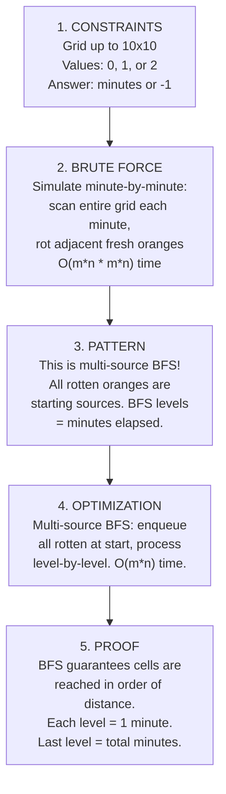

# Graphs II --- Real Problems


**Welcome to the real graph battlefield!** In Chapter 19, you learned BFS and DFS on abstract graphs --- nodes connected by edges. Now it's time to use those tools on the kind of problems that actually show up in USACO and coding interviews: grids, flood fill, rotten oranges, and more. Most of these problems are really just BFS/DFS in disguise, but the disguise is clever. By the end of this chapter, when someone gives you a 2D grid, you'll instantly see the graph hiding inside it.


## Chapter Goals

By the end of this chapter, you will:

- Model a 2D grid as a graph where each cell is a node with up to 4 (or 8) neighbors
- Implement **flood fill** using both DFS and BFS to color connected regions
- Count **connected components** on a grid (the "Number of Islands" problem)
- Use **multi-source BFS** to solve problems where multiple starting points spread simultaneously (rotten oranges, distance to nearest 0)
- Apply the **border-first trick** to solve "surrounded regions" problems
- Understand and implement **0-1 BFS** using a deque for graphs with edge weights 0 or 1
- Recognize when a grid problem is secretly a graph problem and choose the right BFS/DFS variant
- Find the shortest path in a binary matrix with 8-directional movement
- Calculate the size of the largest connected component (max area of island)
- Solve USACO Silver-level grid problems with confidence

---

## The Story: "The Island Explorer"

You're a cartographer hired to map a vast, uncharted archipelago. Your satellite gives you a bird's-eye photo --- a massive grid of pixels where `1` means land and `0` means water.

Your boss asks: **"How many separate islands are there?"**

You squint at the map. Some land pixels cluster together in big blobs. Others are tiny specks. Two land pixels are "on the same island" if you can walk between them by stepping north, south, east, or west (no diagonal swimming!). Your job: count the distinct blobs.

You start at the top-left corner and scan the grid. When you find a land pixel, you "flood" outward --- checking all neighbors, then THEIR neighbors, marking everything you've touched. By the time the flood stops, you've mapped one complete island. Then you keep scanning for the next unvisited land pixel. Each new flood is a new island.

This is **flood fill** --- and it's just BFS or DFS on a grid graph. The same technique your computer uses for the paint bucket tool in drawing apps, for finding enclosed regions in a Go board, and for solving maze problems in competitions.

But then your boss adds a twist: **"A disease is spreading across the islands. It starts at several locations simultaneously and spreads to adjacent land cells each day. How many days until every cell is infected?"**

Now you need BFS that starts from MULTIPLE sources at once --- all the infected cells go into the queue at the beginning, and the BFS ripples outward from all of them simultaneously. This is **multi-source BFS**, and it's one of the most common patterns in competitive programming.

Welcome to the real problems. The islands are waiting.

---

[Johari Window: Before](johari.md)

---

## Discovery

Before we dive into the techniques, try these puzzles using what you already know from Chapter 19:

### Puzzle 1: "The Paint Bucket"

Here's a 3x3 image where each cell has a color (a number):

```
1  1  1
1  1  0
1  0  1
```

You click the paint bucket on cell (1,1) --- row 1, column 1 --- and choose color `2`. The paint bucket should change that cell AND all connected cells of the same original color to the new color. What does the image look like after?


**Answer:** Cell (1,1) has color 1. All cells connected to it (via up/down/left/right) with color 1 get changed to 2:
```
2  2  2
2  2  0
2  0  1
```
The bottom-right `1` stays unchanged --- it's separated from the main blob by `0`'s. This is **flood fill**, which you'll learn in Section 20.2.


### Puzzle 2: "The Rotten Oranges"

Here's a 3x3 grid of oranges. `0` = empty, `1` = fresh orange, `2` = rotten orange:

```
2  1  1
1  1  0
0  1  1
```

Each minute, any fresh orange adjacent (up/down/left/right) to a rotten orange becomes rotten. How many minutes until all oranges are rotten? Can you trace the spread minute by minute?


**Minute-by-minute:**
- Start: rotten at (0,0)
- Minute 1: (0,0) rots (0,1) and (1,0) --- 2 new rotten
- Minute 2: (0,1) rots (0,2); (1,0) rots (1,1) --- 2 new rotten
- Minute 3: (1,1) rots (2,1); (0,2) has no fresh neighbors --- 1 new rotten
- Minute 4: (2,1) rots (2,2) --- 1 new rotten

Answer: **4 minutes**. This is **multi-source BFS** --- you'll learn it in Section 20.4.


### Puzzle 3: "The Deque Trick"

Imagine a grid where moving to a white cell costs 0 and moving to a gray cell costs 1. You want the cheapest path from top-left to bottom-right.

```
W  G  W
W  W  G
G  W  W
```

Regular BFS treats all moves equally. Can you think of a way to use BFS but still find the cheapest path when some moves are "free" (cost 0) and others cost 1?


**Hint:** What if, when a move costs 0, you add it to the FRONT of the queue instead of the back? That way, free moves get explored first (like they're "closer"), and costly moves wait. This is called **0-1 BFS** and uses a **deque** (double-ended queue). You'll learn it in Section 20.6.


---

## 20.1 Grid Graphs

The key insight of this entire chapter: **a 2D grid IS a graph**.

Every cell `(r, c)` is a vertex. Every cell has up to 4 neighbors: up `(r-1, c)`, down `(r+1, c)`, left `(r, c-1)`, right `(r, c+1)`. An edge exists between two adjacent cells if some condition is met (both are land, both are the same color, etc.).

```
Grid:                    Graph:
+---+---+---+           (0,0) --- (0,1) --- (0,2)
| 1 | 1 | 0 |             |         |
+---+---+---+           (1,0) --- (1,1)    (1,2)
| 1 | 1 | 0 |             |         |
+---+---+---+           (2,0)    (2,1)    (2,2)
| 0 | 1 | 0 |
+---+---+---+
```

In this grid, `1` is land and `0` is water. Edges only connect adjacent land cells. Notice that `(1,2)` and `(2,2)` are isolated --- they're water, so they have no edges.

### The Direction Array Pattern

Instead of writing four separate if-statements for each neighbor, use a **direction array**:



```python
# 4-directional neighbors
dr = [-1, 1, 0, 0]
dc = [0, 0, -1, 1]

# For each neighbor of (r, c):
for d in range(4):
    nr, nc = r + dr[d], c + dc[d]
    if 0 <= nr < rows and 0 <= nc < cols:
        # (nr, nc) is a valid neighbor
        pass

# 8-directional (includes diagonals):
dr8 = [-1, -1, -1, 0, 0, 1, 1, 1]
dc8 = [-1, 0, 1, -1, 1, -1, 0, 1]
```


```java
// 4-directional neighbors
int[] dr = {-1, 1, 0, 0};
int[] dc = {0, 0, -1, 1};

// For each neighbor of (r, c):
for (int d = 0; d < 4; d++) {
    int nr = r + dr[d], nc = c + dc[d];
    if (nr >= 0 && nr < rows && nc >= 0 && nc < cols) {
        // (nr, nc) is a valid neighbor
    }
}

// 8-directional (includes diagonals):
int[] dr8 = {-1, -1, -1, 0, 0, 1, 1, 1};
int[] dc8 = {-1, 0, 1, -1, 1, -1, 0, 1};
```


```cpp
// 4-directional neighbors
int dr[] = {-1, 1, 0, 0};
int dc[] = {0, 0, -1, 1};

// For each neighbor of (r, c):
for (int d = 0; d < 4; d++) {
    int nr = r + dr[d], nc = c + dc[d];
    if (nr >= 0 && nr < rows && nc >= 0 && nc < cols) {
        // (nr, nc) is a valid neighbor
    }
}

// 8-directional (includes diagonals):
int dr8[] = {-1, -1, -1, 0, 0, 1, 1, 1};
int dc8[] = {-1, 0, 1, -1, 1, -1, 0, 1};
```



**Why direction arrays?** They eliminate four copy-pasted if-blocks. When you switch from 4-directional to 8-directional, you just change the arrays --- no logic changes needed.

### Language Spotlight: Grid Graphs

| Feature | Python | Java | C++ |
|---------|--------|------|-----|
| Bounds check | `0 <= nr < rows` | `nr >= 0 && nr < rows` | Same as Java |
| Grid creation | `[[0]*cols for _ in range(rows)]` | `new int[rows][cols]` | `vector<vector<int>>(rows, vector<int>(cols, 0))` |
| Encode (r,c) as int | `r * cols + c` | `r * cols + c` | `r * cols + c` |

---

## 20.2 Flood Fill

**Flood fill** colors all cells connected to a starting cell that share the same original color. It's the algorithm behind every paint bucket tool.

The approach:
1. Record the original color at `(sr, sc)`.
2. If the original color equals the new color, do nothing (avoids infinite loops!).
3. BFS or DFS from `(sr, sc)`: for each visited cell, change its color to the new color, and add its same-colored neighbors to the queue/stack.



```python
from collections import deque

def flood_fill(image, sr, sc, color):
    rows, cols = len(image), len(image[0])
    original = image[sr][sc]
    if original == color:
        return image  # Nothing to change

    queue = deque([(sr, sc)])
    image[sr][sc] = color
    dr = [-1, 1, 0, 0]
    dc = [0, 0, -1, 1]

    while queue:
        r, c = queue.popleft()
        for d in range(4):
            nr, nc = r + dr[d], c + dc[d]
            if 0 <= nr < rows and 0 <= nc < cols and image[nr][nc] == original:
                image[nr][nc] = color
                queue.append((nr, nc))

    return image
```


```java
public int[][] floodFill(int[][] image, int sr, int sc, int color) {
    int rows = image.length, cols = image[0].length;
    int original = image[sr][sc];
    if (original == color) return image;

    int[] dr = {-1, 1, 0, 0};
    int[] dc = {0, 0, -1, 1};
    Queue<int[]> queue = new LinkedList<>();
    queue.add(new int[]{sr, sc});
    image[sr][sc] = color;

    while (!queue.isEmpty()) {
        int[] cell = queue.poll();
        for (int d = 0; d < 4; d++) {
            int nr = cell[0] + dr[d], nc = cell[1] + dc[d];
            if (nr >= 0 && nr < rows && nc >= 0 && nc < cols
                    && image[nr][nc] == original) {
                image[nr][nc] = color;
                queue.add(new int[]{nr, nc});
            }
        }
    }
    return image;
}
```


```cpp
#include <vector>
#include <queue>
using namespace std;

vector<vector<int>> floodFill(vector<vector<int>>& image,
                              int sr, int sc, int color) {
    int rows = image.size(), cols = image[0].size();
    int original = image[sr][sc];
    if (original == color) return image;

    int dr[] = {-1, 1, 0, 0};
    int dc[] = {0, 0, -1, 1};
    queue<pair<int,int>> q;
    q.push({sr, sc});
    image[sr][sc] = color;

    while (!q.empty()) {
        auto [r, c] = q.front(); q.pop();
        for (int d = 0; d < 4; d++) {
            int nr = r + dr[d], nc = c + dc[d];
            if (nr >= 0 && nr < rows && nc >= 0 && nc < cols
                && image[nr][nc] == original) {
                image[nr][nc] = color;
                q.push({nr, nc});
            }
        }
    }
    return image;
}
```




**Critical:** Check `if original == color` at the start! Without this, if you start on a cell whose color already matches the target, you'll endlessly re-visit neighbors (since "original" and "new" are the same). This is the #1 flood fill bug.


**Time Complexity:** O(m * n) --- each cell is visited at most once.

**Space Complexity:** O(m * n) --- worst case, the entire grid is one color, so the queue/stack holds all cells.

---

## 20.3 Number of Islands

The classic: given a 2D grid of `'1'` (land) and `'0'` (water), count the number of islands. An island is a group of `'1'`s connected 4-directionally.

**Approach:** Scan every cell. When you find an unvisited `'1'`, increment the island counter and flood fill (BFS/DFS) to mark all connected `'1'`s as visited. Each flood fill discovers one complete island.



```python
from collections import deque

def num_islands(grid):
    if not grid:
        return 0
    rows, cols = len(grid), len(grid[0])
    count = 0

    for r in range(rows):
        for c in range(cols):
            if grid[r][c] == 1:
                count += 1
                # BFS flood fill to mark entire island
                queue = deque([(r, c)])
                grid[r][c] = 0  # Mark visited
                while queue:
                    cr, cc = queue.popleft()
                    for dr, dc in [(-1,0),(1,0),(0,-1),(0,1)]:
                        nr, nc = cr + dr, cc + dc
                        if 0 <= nr < rows and 0 <= nc < cols and grid[nr][nc] == 1:
                            grid[nr][nc] = 0
                            queue.append((nr, nc))
    return count
```


```java
public int numIslands(int[][] grid) {
    int rows = grid.length, cols = grid[0].length;
    int count = 0;
    int[] dr = {-1, 1, 0, 0}, dc = {0, 0, -1, 1};

    for (int r = 0; r < rows; r++) {
        for (int c = 0; c < cols; c++) {
            if (grid[r][c] == 1) {
                count++;
                Queue<int[]> queue = new LinkedList<>();
                queue.add(new int[]{r, c});
                grid[r][c] = 0;
                while (!queue.isEmpty()) {
                    int[] cell = queue.poll();
                    for (int d = 0; d < 4; d++) {
                        int nr = cell[0] + dr[d], nc = cell[1] + dc[d];
                        if (nr >= 0 && nr < rows && nc >= 0 && nc < cols
                                && grid[nr][nc] == 1) {
                            grid[nr][nc] = 0;
                            queue.add(new int[]{nr, nc});
                        }
                    }
                }
            }
        }
    }
    return count;
}
```


```cpp
int numIslands(vector<vector<int>>& grid) {
    int rows = grid.size(), cols = grid[0].size();
    int count = 0;
    int dr[] = {-1, 1, 0, 0}, dc[] = {0, 0, -1, 1};

    for (int r = 0; r < rows; r++) {
        for (int c = 0; c < cols; c++) {
            if (grid[r][c] == 1) {
                count++;
                queue<pair<int,int>> q;
                q.push({r, c});
                grid[r][c] = 0;
                while (!q.empty()) {
                    auto [cr, cc] = q.front(); q.pop();
                    for (int d = 0; d < 4; d++) {
                        int nr = cr + dr[d], nc = cc + dc[d];
                        if (nr >= 0 && nr < rows && nc >= 0 && nc < cols
                            && grid[nr][nc] == 1) {
                            grid[nr][nc] = 0;
                            q.push({nr, nc});
                        }
                    }
                }
            }
        }
    }
    return count;
}
```



**Key Insight:** We mark cells visited by changing `1` to `0` (or using a `visited` array). This avoids revisiting and keeps the logic simple.

---

## 20.4 Multi-Source BFS

Regular BFS starts from ONE source and radiates outward. **Multi-source BFS** starts from MULTIPLE sources simultaneously. It's like dropping multiple pebbles into a pond at once --- the ripples spread out from all of them at the same time.

The trick: **enqueue ALL sources at the start** before beginning the BFS loop. Then BFS naturally processes them level-by-level, as if all sources started spreading at the same time.

### Rotten Oranges

Given a grid: `0` = empty, `1` = fresh orange, `2` = rotten orange. Each minute, rotten oranges rot their fresh 4-directional neighbors. Return the minimum minutes to rot all oranges, or `-1` if impossible.



```python
from collections import deque

def oranges_rotting(grid):
    rows, cols = len(grid), len(grid[0])
    queue = deque()
    fresh = 0

    # Step 1: Enqueue ALL rotten oranges (multi-source)
    for r in range(rows):
        for c in range(cols):
            if grid[r][c] == 2:
                queue.append((r, c))
            elif grid[r][c] == 1:
                fresh += 1

    if fresh == 0:
        return 0  # Nothing to rot

    minutes = 0
    dr = [-1, 1, 0, 0]
    dc = [0, 0, -1, 1]

    # Step 2: BFS level by level
    while queue and fresh > 0:
        minutes += 1
        for _ in range(len(queue)):  # Process one "minute"
            r, c = queue.popleft()
            for d in range(4):
                nr, nc = r + dr[d], c + dc[d]
                if 0 <= nr < rows and 0 <= nc < cols and grid[nr][nc] == 1:
                    grid[nr][nc] = 2
                    fresh -= 1
                    queue.append((nr, nc))

    return minutes if fresh == 0 else -1
```


```java
public int orangesRotting(int[][] grid) {
    int rows = grid.length, cols = grid[0].length;
    Queue<int[]> queue = new LinkedList<>();
    int fresh = 0;

    for (int r = 0; r < rows; r++)
        for (int c = 0; c < cols; c++) {
            if (grid[r][c] == 2) queue.add(new int[]{r, c});
            else if (grid[r][c] == 1) fresh++;
        }

    if (fresh == 0) return 0;

    int minutes = 0;
    int[] dr = {-1, 1, 0, 0}, dc = {0, 0, -1, 1};

    while (!queue.isEmpty() && fresh > 0) {
        minutes++;
        int size = queue.size();
        for (int i = 0; i < size; i++) {
            int[] cell = queue.poll();
            for (int d = 0; d < 4; d++) {
                int nr = cell[0] + dr[d], nc = cell[1] + dc[d];
                if (nr >= 0 && nr < rows && nc >= 0 && nc < cols
                        && grid[nr][nc] == 1) {
                    grid[nr][nc] = 2;
                    fresh--;
                    queue.add(new int[]{nr, nc});
                }
            }
        }
    }
    return fresh == 0 ? minutes : -1;
}
```


```cpp
int orangesRotting(vector<vector<int>>& grid) {
    int rows = grid.size(), cols = grid[0].size();
    queue<pair<int,int>> q;
    int fresh = 0;

    for (int r = 0; r < rows; r++)
        for (int c = 0; c < cols; c++) {
            if (grid[r][c] == 2) q.push({r, c});
            else if (grid[r][c] == 1) fresh++;
        }

    if (fresh == 0) return 0;

    int minutes = 0;
    int dr[] = {-1, 1, 0, 0}, dc[] = {0, 0, -1, 1};

    while (!q.empty() && fresh > 0) {
        minutes++;
        int sz = q.size();
        for (int i = 0; i < sz; i++) {
            auto [r, c] = q.front(); q.pop();
            for (int d = 0; d < 4; d++) {
                int nr = r + dr[d], nc = c + dc[d];
                if (nr >= 0 && nr < rows && nc >= 0 && nc < cols
                    && grid[nr][nc] == 1) {
                    grid[nr][nc] = 2;
                    fresh--;
                    q.push({nr, nc});
                }
            }
        }
    }
    return fresh == 0 ? minutes : -1;
}
```



### 01 Matrix (Distance to Nearest Zero)

Given a binary matrix, find the distance of each cell to its nearest `0`. This is multi-source BFS starting from ALL zeros simultaneously.



```python
from collections import deque

def update_matrix(mat):
    rows, cols = len(mat), len(mat[0])
    dist = [[float('inf')] * cols for _ in range(rows)]
    queue = deque()

    # Enqueue all 0-cells
    for r in range(rows):
        for c in range(cols):
            if mat[r][c] == 0:
                dist[r][c] = 0
                queue.append((r, c))

    dr = [-1, 1, 0, 0]
    dc = [0, 0, -1, 1]
    while queue:
        r, c = queue.popleft()
        for d in range(4):
            nr, nc = r + dr[d], c + dc[d]
            if 0 <= nr < rows and 0 <= nc < cols and dist[nr][nc] > dist[r][c] + 1:
                dist[nr][nc] = dist[r][c] + 1
                queue.append((nr, nc))

    return dist
```


```java
public int[][] updateMatrix(int[][] mat) {
    int rows = mat.length, cols = mat[0].length;
    int[][] dist = new int[rows][cols];
    Queue<int[]> queue = new LinkedList<>();

    for (int[] row : dist) Arrays.fill(row, Integer.MAX_VALUE);

    for (int r = 0; r < rows; r++)
        for (int c = 0; c < cols; c++)
            if (mat[r][c] == 0) {
                dist[r][c] = 0;
                queue.add(new int[]{r, c});
            }

    int[] dr = {-1, 1, 0, 0}, dc = {0, 0, -1, 1};
    while (!queue.isEmpty()) {
        int[] cell = queue.poll();
        int r = cell[0], c = cell[1];
        for (int d = 0; d < 4; d++) {
            int nr = r + dr[d], nc = c + dc[d];
            if (nr >= 0 && nr < rows && nc >= 0 && nc < cols
                    && dist[nr][nc] > dist[r][c] + 1) {
                dist[nr][nc] = dist[r][c] + 1;
                queue.add(new int[]{nr, nc});
            }
        }
    }
    return dist;
}
```


```cpp
vector<vector<int>> updateMatrix(vector<vector<int>>& mat) {
    int rows = mat.size(), cols = mat[0].size();
    vector<vector<int>> dist(rows, vector<int>(cols, INT_MAX));
    queue<pair<int,int>> q;

    for (int r = 0; r < rows; r++)
        for (int c = 0; c < cols; c++)
            if (mat[r][c] == 0) {
                dist[r][c] = 0;
                q.push({r, c});
            }

    int dr[] = {-1, 1, 0, 0}, dc[] = {0, 0, -1, 1};
    while (!q.empty()) {
        auto [r, c] = q.front(); q.pop();
        for (int d = 0; d < 4; d++) {
            int nr = r + dr[d], nc = c + dc[d];
            if (nr >= 0 && nr < rows && nc >= 0 && nc < cols
                && dist[nr][nc] > dist[r][c] + 1) {
                dist[nr][nc] = dist[r][c] + 1;
                q.push({nr, nc});
            }
        }
    }
    return dist;
}
```




**Pattern Recognition:** Multi-source BFS problems always follow the same template: (1) find all sources, (2) enqueue them all at the start, (3) run standard BFS. The "level" in BFS corresponds to distance/time from the nearest source.


---

## 20.5 Surrounded Regions

**Problem:** Given an `m x n` board with `'X'` and `'O'`, capture all `'O'` regions that are completely surrounded by `'X'`. An `'O'` on the border (or connected to a border `'O'`) cannot be captured.

**The Border-First Trick:**

Instead of checking every `'O'` region to see if it's surrounded (hard!), flip the approach:
1. Start from all `'O'`s on the border.
2. BFS/DFS to mark all `'O'`s connected to the border as "safe" (change to a temporary marker like `'S'`).
3. Any remaining `'O'` is surrounded --- flip it to `'X'`.
4. Change all `'S'`s back to `'O'`.



```python
from collections import deque

def solve_surrounded(board):
    if not board:
        return
    rows, cols = len(board), len(board[0])
    queue = deque()

    # Step 1: Find all border O's
    for r in range(rows):
        for c in range(cols):
            if (r == 0 or r == rows-1 or c == 0 or c == cols-1) and board[r][c] == 'O':
                queue.append((r, c))
                board[r][c] = 'S'  # Safe

    # Step 2: BFS to mark all O's connected to border
    dr = [-1, 1, 0, 0]
    dc = [0, 0, -1, 1]
    while queue:
        r, c = queue.popleft()
        for d in range(4):
            nr, nc = r + dr[d], c + dc[d]
            if 0 <= nr < rows and 0 <= nc < cols and board[nr][nc] == 'O':
                board[nr][nc] = 'S'
                queue.append((nr, nc))

    # Step 3: Flip remaining O's to X, S's back to O
    for r in range(rows):
        for c in range(cols):
            if board[r][c] == 'O':
                board[r][c] = 'X'
            elif board[r][c] == 'S':
                board[r][c] = 'O'
```


```java
public void solveSurrounded(char[][] board) {
    int rows = board.length, cols = board[0].length;
    Queue<int[]> queue = new LinkedList<>();
    int[] dr = {-1, 1, 0, 0}, dc = {0, 0, -1, 1};

    for (int r = 0; r < rows; r++)
        for (int c = 0; c < cols; c++)
            if ((r == 0 || r == rows-1 || c == 0 || c == cols-1)
                    && board[r][c] == 'O') {
                queue.add(new int[]{r, c});
                board[r][c] = 'S';
            }

    while (!queue.isEmpty()) {
        int[] cell = queue.poll();
        for (int d = 0; d < 4; d++) {
            int nr = cell[0] + dr[d], nc = cell[1] + dc[d];
            if (nr >= 0 && nr < rows && nc >= 0 && nc < cols
                    && board[nr][nc] == 'O') {
                board[nr][nc] = 'S';
                queue.add(new int[]{nr, nc});
            }
        }
    }

    for (int r = 0; r < rows; r++)
        for (int c = 0; c < cols; c++) {
            if (board[r][c] == 'O') board[r][c] = 'X';
            else if (board[r][c] == 'S') board[r][c] = 'O';
        }
}
```


```cpp
void solveSurrounded(vector<vector<char>>& board) {
    int rows = board.size(), cols = board[0].size();
    queue<pair<int,int>> q;
    int dr[] = {-1, 1, 0, 0}, dc[] = {0, 0, -1, 1};

    for (int r = 0; r < rows; r++)
        for (int c = 0; c < cols; c++)
            if ((r == 0 || r == rows-1 || c == 0 || c == cols-1)
                && board[r][c] == 'O') {
                q.push({r, c});
                board[r][c] = 'S';
            }

    while (!q.empty()) {
        auto [r, c] = q.front(); q.pop();
        for (int d = 0; d < 4; d++) {
            int nr = r + dr[d], nc = c + dc[d];
            if (nr >= 0 && nr < rows && nc >= 0 && nc < cols
                && board[nr][nc] == 'O') {
                board[nr][nc] = 'S';
                q.push({nr, nc});
            }
        }
    }

    for (int r = 0; r < rows; r++)
        for (int c = 0; c < cols; c++) {
            if (board[r][c] == 'O') board[r][c] = 'X';
            else if (board[r][c] == 'S') board[r][c] = 'O';
        }
}
```




**The Border-First Trick** is a powerful pattern: instead of checking "is this region surrounded?" (which is complicated), ask "is this region connected to the border?" (which is easy --- just BFS from the border). Any region NOT connected to the border must be surrounded. This same idea solves "Number of Enclaves" (P5) and similar problems.


---

## 20.6 0-1 BFS

Regular BFS finds shortest paths when all edges have the same weight. But what if some edges have weight 0 and others have weight 1?

**Dijkstra's algorithm** (Ch 27) works for any non-negative weights, but it uses a priority queue with O(E log V) time. For the special case of only 0 and 1 weights, we can do better with a **deque**:

- When moving to a neighbor costs **0**: add to the **front** of the deque.
- When moving to a neighbor costs **1**: add to the **back** of the deque.

This way, 0-cost moves are explored first (like they're "free"), maintaining the BFS property that we always process the closest nodes first.



```python
from collections import deque

def zero_one_bfs(grid, src, dst):
    """Shortest path in a grid where white=0 cost, gray=1 cost."""
    rows, cols = len(grid), len(grid[0])
    dist = [[float('inf')] * cols for _ in range(rows)]
    dist[src[0]][src[1]] = 0
    dq = deque([(src[0], src[1])])
    dr = [-1, 1, 0, 0]
    dc = [0, 0, -1, 1]

    while dq:
        r, c = dq.popleft()
        for d in range(4):
            nr, nc = r + dr[d], c + dc[d]
            if 0 <= nr < rows and 0 <= nc < cols:
                w = grid[nr][nc]  # 0 or 1
                if dist[r][c] + w < dist[nr][nc]:
                    dist[nr][nc] = dist[r][c] + w
                    if w == 0:
                        dq.appendleft((nr, nc))  # Front
                    else:
                        dq.append((nr, nc))       # Back

    return dist[dst[0]][dst[1]]
```


```java
public int zeroOneBfs(int[][] grid, int[] src, int[] dst) {
    int rows = grid.length, cols = grid[0].length;
    int[][] dist = new int[rows][cols];
    for (int[] row : dist) Arrays.fill(row, Integer.MAX_VALUE);
    dist[src[0]][src[1]] = 0;

    Deque<int[]> dq = new ArrayDeque<>();
    dq.addFirst(new int[]{src[0], src[1]});
    int[] dr = {-1, 1, 0, 0}, dc = {0, 0, -1, 1};

    while (!dq.isEmpty()) {
        int[] cell = dq.pollFirst();
        int r = cell[0], c = cell[1];
        for (int d = 0; d < 4; d++) {
            int nr = r + dr[d], nc = c + dc[d];
            if (nr >= 0 && nr < rows && nc >= 0 && nc < cols) {
                int w = grid[nr][nc];
                if (dist[r][c] + w < dist[nr][nc]) {
                    dist[nr][nc] = dist[r][c] + w;
                    if (w == 0) dq.addFirst(new int[]{nr, nc});
                    else dq.addLast(new int[]{nr, nc});
                }
            }
        }
    }
    return dist[dst[0]][dst[1]];
}
```


```cpp
#include <deque>
#include <climits>
int zeroOneBfs(vector<vector<int>>& grid, pair<int,int> src, pair<int,int> dst) {
    int rows = grid.size(), cols = grid[0].size();
    vector<vector<int>> dist(rows, vector<int>(cols, INT_MAX));
    dist[src.first][src.second] = 0;

    deque<pair<int,int>> dq;
    dq.push_front(src);
    int dr[] = {-1, 1, 0, 0}, dc[] = {0, 0, -1, 1};

    while (!dq.empty()) {
        auto [r, c] = dq.front(); dq.pop_front();
        for (int d = 0; d < 4; d++) {
            int nr = r + dr[d], nc = c + dc[d];
            if (nr >= 0 && nr < rows && nc >= 0 && nc < cols) {
                int w = grid[nr][nc];
                if (dist[r][c] + w < dist[nr][nc]) {
                    dist[nr][nc] = dist[r][c] + w;
                    if (w == 0) dq.push_front({nr, nc});
                    else dq.push_back({nr, nc});
                }
            }
        }
    }
    return dist[dst.first][dst.second];
}
```



**When to use 0-1 BFS:** Any time you have a graph where edge weights are only 0 or 1. This is O(V + E), faster than Dijkstra's O(E log V).

---

## Think Like a Pro


**Errichto's approach to grid problems:**

"When I see a grid problem in a contest, my first thought is always: *what's the graph?* Each cell is a node. Edges connect neighbors. Then the question becomes: is this a flood fill (connected components)? Is it a shortest path (BFS)? Is it multi-source? Once you identify the graph structure, the solution usually falls out.

For multi-source BFS problems, I like to think of it as 'BFS from a super-source that connects to all the real sources with 0-cost edges.' That's literally what we're doing when we enqueue all sources at the start --- we're simulating a hidden node that connects to all of them."

**Benq's competition tip:**

"In USACO Silver, grid problems are extremely common. The #1 mistake I see is people not marking cells as visited BEFORE adding them to the queue. If you mark after popping, the same cell can end up in the queue multiple times. This wastes time and can cause wrong answers in problems that count visits."


---

## Five-Lens Framework

Let's apply the Five-Lens Framework to the "Rotten Oranges" problem:



| Lens | Insight |
|------|---------|
| **Constraints** | Grid is small (10x10 for the basic problem, but pattern works for 1000x1000) |
| **Brute Force** | Simulate each minute by scanning the whole grid --- O((m*n)^2) |
| **Pattern** | Multiple sources spreading simultaneously = multi-source BFS |
| **Optimization** | Enqueue all sources, BFS processes each cell at most once --- O(m*n) |
| **Proof** | BFS level k = cells at distance k from nearest source = cells rotting at minute k |

---

## AOPS Showcase: Number of Islands

Let's solve the same problem --- counting islands in a 0/1 grid --- three different ways, each revealing a deeper idea.

### Approach 1: DFS Flood Fill

When you find a `1`, recursively visit all connected `1`s, marking them as `0` (visited). Each new starting point is a new island.



```python
def num_islands_dfs(grid):
    if not grid:
        return 0
    rows, cols = len(grid), len(grid[0])

    def dfs(r, c):
        if r < 0 or r >= rows or c < 0 or c >= cols or grid[r][c] == 0:
            return
        grid[r][c] = 0  # Mark visited
        dfs(r-1, c)
        dfs(r+1, c)
        dfs(r, c-1)
        dfs(r, c+1)

    count = 0
    for r in range(rows):
        for c in range(cols):
            if grid[r][c] == 1:
                count += 1
                dfs(r, c)
    return count
```


```java
int numIslandsDfs(int[][] grid) {
    int rows = grid.length, cols = grid[0].length, count = 0;
    for (int r = 0; r < rows; r++)
        for (int c = 0; c < cols; c++)
            if (grid[r][c] == 1) {
                count++;
                dfsFill(grid, r, c, rows, cols);
            }
    return count;
}

void dfsFill(int[][] grid, int r, int c, int rows, int cols) {
    if (r < 0 || r >= rows || c < 0 || c >= cols || grid[r][c] == 0) return;
    grid[r][c] = 0;
    dfsFill(grid, r-1, c, rows, cols);
    dfsFill(grid, r+1, c, rows, cols);
    dfsFill(grid, r, c-1, rows, cols);
    dfsFill(grid, r, c+1, rows, cols);
}
```


```cpp
void dfsFill(vector<vector<int>>& grid, int r, int c) {
    int rows = grid.size(), cols = grid[0].size();
    if (r < 0 || r >= rows || c < 0 || c >= cols || grid[r][c] == 0) return;
    grid[r][c] = 0;
    dfsFill(grid, r-1, c);
    dfsFill(grid, r+1, c);
    dfsFill(grid, r, c-1);
    dfsFill(grid, r, c+1);
}

int numIslandsDfs(vector<vector<int>>& grid) {
    int rows = grid.size(), cols = grid[0].size(), count = 0;
    for (int r = 0; r < rows; r++)
        for (int c = 0; c < cols; c++)
            if (grid[r][c] == 1) { count++; dfsFill(grid, r, c); }
    return count;
}
```



### Approach 2: BFS Flood Fill

Same idea, but use a queue instead of recursion. Better for very large grids (no stack overflow risk).



```python
from collections import deque

def num_islands_bfs(grid):
    if not grid:
        return 0
    rows, cols = len(grid), len(grid[0])
    count = 0

    for r in range(rows):
        for c in range(cols):
            if grid[r][c] == 1:
                count += 1
                queue = deque([(r, c)])
                grid[r][c] = 0
                while queue:
                    cr, cc = queue.popleft()
                    for dr, dc in [(-1,0),(1,0),(0,-1),(0,1)]:
                        nr, nc = cr + dr, cc + dc
                        if 0 <= nr < rows and 0 <= nc < cols and grid[nr][nc] == 1:
                            grid[nr][nc] = 0
                            queue.append((nr, nc))
    return count
```


```java
int numIslandsBfs(int[][] grid) {
    int rows = grid.length, cols = grid[0].length, count = 0;
    int[] dr = {-1, 1, 0, 0}, dc = {0, 0, -1, 1};
    for (int r = 0; r < rows; r++)
        for (int c = 0; c < cols; c++)
            if (grid[r][c] == 1) {
                count++;
                Queue<int[]> q = new LinkedList<>();
                q.add(new int[]{r, c});
                grid[r][c] = 0;
                while (!q.isEmpty()) {
                    int[] cell = q.poll();
                    for (int d = 0; d < 4; d++) {
                        int nr = cell[0] + dr[d], nc = cell[1] + dc[d];
                        if (nr >= 0 && nr < rows && nc >= 0 && nc < cols
                                && grid[nr][nc] == 1) {
                            grid[nr][nc] = 0;
                            q.add(new int[]{nr, nc});
                        }
                    }
                }
            }
    return count;
}
```


```cpp
int numIslandsBfs(vector<vector<int>>& grid) {
    int rows = grid.size(), cols = grid[0].size(), count = 0;
    int dr[] = {-1, 1, 0, 0}, dc[] = {0, 0, -1, 1};
    for (int r = 0; r < rows; r++)
        for (int c = 0; c < cols; c++)
            if (grid[r][c] == 1) {
                count++;
                queue<pair<int,int>> q;
                q.push({r, c});
                grid[r][c] = 0;
                while (!q.empty()) {
                    auto [cr, cc] = q.front(); q.pop();
                    for (int d = 0; d < 4; d++) {
                        int nr = cr + dr[d], nc = cc + dc[d];
                        if (nr >= 0 && nr < rows && nc >= 0 && nc < cols
                            && grid[nr][nc] == 1) {
                            grid[nr][nc] = 0;
                            q.push({nr, nc});
                        }
                    }
                }
            }
    return count;
}
```



### Approach 3: Union-Find (Preview)

Instead of BFS/DFS, use a **Union-Find** (Disjoint Set Union) data structure. For each land cell, union it with its land neighbors. The number of islands = number of distinct sets at the end. This is a preview of Ch 29!



```python
def num_islands_uf(grid):
    if not grid:
        return 0
    rows, cols = len(grid), len(grid[0])

    parent = list(range(rows * cols))
    rank = [0] * (rows * cols)

    def find(x):
        while parent[x] != x:
            parent[x] = parent[parent[x]]  # Path compression
            x = parent[x]
        return x

    def union(a, b):
        ra, rb = find(a), find(b)
        if ra == rb:
            return False
        if rank[ra] < rank[rb]:
            ra, rb = rb, ra
        parent[rb] = ra
        if rank[ra] == rank[rb]:
            rank[ra] += 1
        return True

    count = 0
    for r in range(rows):
        for c in range(cols):
            if grid[r][c] == 1:
                count += 1
                idx = r * cols + c
                # Try to union with left and up neighbors
                if c > 0 and grid[r][c-1] == 1:
                    if union(idx, r * cols + (c-1)):
                        count -= 1
                if r > 0 and grid[r-1][c] == 1:
                    if union(idx, (r-1) * cols + c):
                        count -= 1
    return count
```


```java
int numIslandsUF(int[][] grid) {
    int rows = grid.length, cols = grid[0].length;
    int[] parent = new int[rows * cols];
    int[] rank = new int[rows * cols];
    for (int i = 0; i < parent.length; i++) parent[i] = i;

    int count = 0;
    for (int r = 0; r < rows; r++)
        for (int c = 0; c < cols; c++)
            if (grid[r][c] == 1) {
                count++;
                int idx = r * cols + c;
                if (c > 0 && grid[r][c-1] == 1)
                    if (union(parent, rank, idx, r * cols + c - 1)) count--;
                if (r > 0 && grid[r-1][c] == 1)
                    if (union(parent, rank, idx, (r-1) * cols + c)) count--;
            }
    return count;
}
// find() and union() helpers omitted for brevity
```


```cpp
// Union-Find with path compression and union by rank
int parent[90001], rnk[90001];
int find(int x) { return parent[x] == x ? x : parent[x] = find(parent[x]); }
bool unite(int a, int b) {
    a = find(a); b = find(b);
    if (a == b) return false;
    if (rnk[a] < rnk[b]) swap(a, b);
    parent[b] = a;
    if (rnk[a] == rnk[b]) rnk[a]++;
    return true;
}

int numIslandsUF(vector<vector<int>>& grid) {
    int rows = grid.size(), cols = grid[0].size(), count = 0;
    for (int i = 0; i < rows * cols; i++) { parent[i] = i; rnk[i] = 0; }
    for (int r = 0; r < rows; r++)
        for (int c = 0; c < cols; c++)
            if (grid[r][c] == 1) {
                count++;
                int idx = r * cols + c;
                if (c > 0 && grid[r][c-1] == 1 && unite(idx, idx-1)) count--;
                if (r > 0 && grid[r-1][c] == 1 && unite(idx, idx-cols)) count--;
            }
    return count;
}
```



### Comparison Table

| Approach | Time | Space | Stack Safe? | Best For |
|----------|------|-------|-------------|----------|
| DFS Flood Fill | O(m*n) | O(m*n) recursion stack | No (large grids) | Simple, clean code |
| BFS Flood Fill | O(m*n) | O(min(m,n)) queue | Yes | Large grids, contests |
| Union-Find | O(m*n * alpha(m*n)) ~= O(m*n) | O(m*n) parent array | Yes | Dynamic connectivity (edges added over time) |

**Which to use in a contest?** BFS flood fill is the safest default --- no recursion limit worries, easy to reason about, and the same code works for shortest-path variants.

---

## Legend's Corner


**Tourist (Gennady Korotkevich)** once said in a Codeforces comment that grid BFS problems are some of the most "pure" competitive programming problems --- they test your ability to model a situation as a graph and then apply the right traversal. In USACO Silver, he noted, at least one problem per contest involves grids.

**Neal Wu**, who started competing in 8th grade (your age!), has written that his #1 tip for grid problems is: "Write a clean BFS template once, test it thoroughly, and reuse it forever. Don't rewrite BFS from scratch each time --- copy your template and modify it." That's exactly why we drill the direction-array pattern in this chapter.

The best competitors don't memorize solutions --- they memorize *patterns* and adapt them to new problems.


---


## Gotchas

### 1. Forgetting the "same color" check in flood fill
If the starting cell's color already equals the target color, flood fill enters an infinite loop (or visits the entire grid). Always check `if original == color: return` at the start.

### 2. Marking visited AFTER popping instead of BEFORE enqueueing
This is the BFS cardinal sin from Ch 19, and it's even more common on grids. If you mark visited when you pop a cell, the same cell can be added to the queue multiple times by different neighbors. Mark visited WHEN you add to the queue.

### 3. Off-by-one with grid boundaries
Always check `0 <= nr < rows` and `0 <= nc < cols` before accessing `grid[nr][nc]`. Accessing out-of-bounds indices causes crashes in C++/Java and wrong answers everywhere.

### 4. Forgetting to count fresh oranges in rotten oranges
If you don't track fresh oranges, you won't know if it's impossible (should return -1). Count fresh oranges at the start and decrement as they rot. If fresh > 0 at the end, return -1.

### 5. Multi-source BFS: not enqueuing ALL sources before starting
If you only enqueue the first source you find, you're doing single-source BFS from one starting point. You MUST enqueue ALL sources in the initial scan before starting the BFS loop.

### 6. 0-1 BFS: adding cost-0 neighbors to the BACK of the deque
The whole point of 0-1 BFS is that cost-0 moves go to the FRONT (so they're explored immediately) and cost-1 moves go to the BACK. If you put everything at the back, it's just regular BFS (which doesn't handle different weights).

### 7. Modifying the grid when you need the original values
Some problems need you to read the original grid while also marking visited cells. If you overwrite the grid, you lose information. Use a separate `visited` array, or save the original value before overwriting.

### 8. Not handling empty grid or single-cell edge cases
Always check `if not grid or not grid[0]` (Python) before accessing `grid[0].length`. A 0x0 or 1x1 grid is a valid input.


---

## Practice Problems

| # | Problem | Difficulty | Key Technique |
|---|---------|-----------|---------------|
| W1 | Flood Fill | :star: | BFS/DFS flood fill from a starting cell |
| W2 | Number of Islands | :star: | Count connected components on grid |
| W3 | Max Area of Island | :star: | Flood fill + count cells in component |
| W4 | Surrounded Regions | :star: | Border-first BFS trick |
| P1 | Rotten Oranges | :star::star: | Multi-source BFS + time tracking |
| P2 | 01 Matrix | :star::star: | Multi-source BFS from all 0s |
| P3 | Pacific Atlantic Water Flow | :star::star: | BFS from both ocean borders, intersect |
| P4 | Shortest Path in Binary Matrix | :star::star: | BFS with 8-directional movement |
| P5 | Number of Enclaves | :star::star: | Border-first BFS + counting |
| C1 | Walls and Gates | :star::star::star: | Multi-source BFS from all gates |
| C2 | Shortest Bridge | :star::star::star: | Find island with DFS, then multi-source BFS |
| C3 | Making a Large Island | :star::star::star: | Component labeling + boundary inspection |
| C4 | Swim in Rising Water | :star::star::star: | Binary search + BFS, or modified Dijkstra |

---

## Language Idioms



```python
# ── Grid BFS Template ──
from collections import deque

def grid_bfs(grid, start_r, start_c):
    rows, cols = len(grid), len(grid[0])
    visited = [[False] * cols for _ in range(rows)]
    queue = deque([(start_r, start_c)])
    visited[start_r][start_c] = True

    while queue:
        r, c = queue.popleft()
        for dr, dc in [(-1,0), (1,0), (0,-1), (0,1)]:
            nr, nc = r + dr, c + dc
            if 0 <= nr < rows and 0 <= nc < cols and not visited[nr][nc]:
                visited[nr][nc] = True
                queue.append((nr, nc))

# ── Deep copy a grid (when you need to preserve original) ──
import copy
grid_copy = copy.deepcopy(grid)

# ── Deque for 0-1 BFS ──
dq = deque()
dq.appendleft((r, c))  # Add to front (cost 0)
dq.append((r, c))       # Add to back (cost 1)

# ── Recursion limit for DFS on large grids ──
import sys
sys.setrecursionlimit(300_000)
```


```java
// ── Grid BFS Template ──
Queue<int[]> queue = new LinkedList<>();
boolean[][] visited = new boolean[rows][cols];
queue.add(new int[]{startR, startC});
visited[startR][startC] = true;

while (!queue.isEmpty()) {
    int[] cell = queue.poll();
    int r = cell[0], c = cell[1];
    for (int d = 0; d < 4; d++) {
        int nr = r + dr[d], nc = c + dc[d];
        if (nr >= 0 && nr < rows && nc >= 0 && nc < cols
                && !visited[nr][nc]) {
            visited[nr][nc] = true;
            queue.add(new int[]{nr, nc});
        }
    }
}

// ── Deque for 0-1 BFS ──
Deque<int[]> dq = new ArrayDeque<>();
dq.addFirst(new int[]{r, c});  // Front (cost 0)
dq.addLast(new int[]{r, c});   // Back (cost 1)

// ── Deep copy a 2D array ──
int[][] copy = new int[rows][cols];
for (int i = 0; i < rows; i++)
    copy[i] = Arrays.copyOf(grid[i], cols);
```


```cpp
// ── Grid BFS Template ──
#include <queue>
queue<pair<int,int>> q;
vector<vector<bool>> visited(rows, vector<bool>(cols, false));
q.push({startR, startC});
visited[startR][startC] = true;

int dr[] = {-1, 1, 0, 0}, dc[] = {0, 0, -1, 1};
while (!q.empty()) {
    auto [r, c] = q.front(); q.pop();
    for (int d = 0; d < 4; d++) {
        int nr = r + dr[d], nc = c + dc[d];
        if (nr >= 0 && nr < rows && nc >= 0 && nc < cols
            && !visited[nr][nc]) {
            visited[nr][nc] = true;
            q.push({nr, nc});
        }
    }
}

// ── Deque for 0-1 BFS ──
#include <deque>
deque<pair<int,int>> dq;
dq.push_front({r, c});  // Front (cost 0)
dq.push_back({r, c});   // Back (cost 1)

// ── Encode (r,c) as single int ──
int id = r * cols + c;
int r = id / cols, c = id % cols;
```



---

## Breadcrumbs

### Looking Back

- **Ch 19** (Graphs I): BFS and DFS on abstract graphs. Now we apply them to 2D grids --- same algorithms, new disguise!
- **Ch 11** (Hashing): Hash sets for O(1) visited checks. In grid problems we often use a 2D boolean array instead, but the principle is the same.
- **Ch 10** (Recursion): DFS flood fill IS recursion. Each recursive call explores one direction, and the call stack manages backtracking automatically.

### Looking Forward

- **Ch 27** (Shortest Paths): When edge weights aren't 0 or 1, you need Dijkstra's algorithm. 0-1 BFS is the special case; Dijkstra is the general case.
- **Ch 28** (Topological Sort): When the graph is directed and acyclic, topological sort orders the vertices. Useful for dependency problems that grids sometimes encode.
- **Ch 29** (Union-Find): The third approach in our AOPS Showcase. Union-Find tracks connected components and supports dynamic merging --- essential for "Making a Large Island" (C3) and many USACO problems.

### Cross-Chapter Threads

- **"Reduce to a known problem"**: Every grid problem in this chapter is really a graph problem. The grid is just a visual representation --- the algorithm is always BFS or DFS.
- **"Brute force is a strategy"**: BFS and DFS explore ALL reachable cells. Multi-source BFS is brute-force exploration from multiple starting points simultaneously.
- **"Space for time"**: The visited array (O(m*n) space) prevents re-exploration, keeping total work to O(m*n) instead of exponential.

---

[Johari Window: After](johari.md)

---

## Open Questions Beyond

1. **"Multi-source BFS finds the distance from each cell to the NEAREST source. What if you wanted the distance to the FARTHEST source?"** This is much harder --- BFS only guarantees shortest distances. For farthest distances, you might need to run BFS from each source separately (O(k * m * n)) or find a clever reduction. Think about why "nearest" is easy but "farthest" is hard.

2. **"We solved 'Making a Large Island' by labeling components and checking boundaries. What if you could flip TWO zeros instead of one? Or k zeros?"** For k=2, the problem becomes much harder. For general k, this is related to the **network flow** and **augmenting paths** concepts in advanced graph theory. Sometimes a binary-search approach works: "Can we achieve an island of size X by flipping at most k zeros?"

3. **"0-1 BFS uses a deque because edge weights are 0 or 1. What if edge weights are 0, 1, or 2? Does the deque trick still work?"** Not directly --- you'd need something more general. But for weights 0 to W (small W), you can use a technique called **dial's algorithm** with W+1 buckets. 0-1 BFS is the special case with W=1.

---

## What's Next

You've now mastered the real-world applications of BFS and DFS on grids: flood fill, multi-source BFS, the border-first trick, and 0-1 BFS. These are the bread and butter of USACO Silver graph problems.

In **Ch 21 (Linked Lists --- Pointers and Connections)**, we shift gears to a fundamental data structure that underpins much of what you've already been using. Queues, stacks, and even graphs can all be built on linked lists. You'll learn pointer manipulation, the fast/slow runner technique, and why linked lists are everywhere in systems programming.

Keep mapping those islands!
