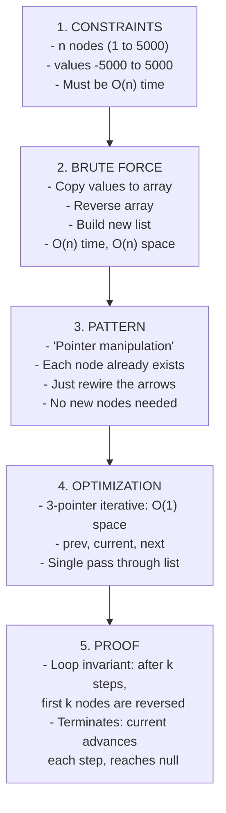

# Linked Lists — Pointers and Connections


**Welcome to Chapter 21!** You've been working with arrays since Chapter 5 — accessing elements by index, slicing, and resizing. Arrays are great, but they have a hidden cost: inserting or deleting an element in the middle means shifting everything after it. Today you'll discover a data structure where insertion and deletion are instant — no shifting required. The catch? You give up random access. Welcome to the world of linked lists.


## Chapter Goals

By the end of this chapter, you will:

- Understand what a linked list is and how it differs from an array
- Build a singly linked list from scratch with insert, delete, traverse, and search
- Build a doubly linked list with forward and backward pointers
- Use Floyd's cycle detection (the tortoise and hare algorithm) to find loops
- Find the middle node of a linked list using the slow/fast pointer technique
- Reverse a linked list both iteratively (3 pointers) and recursively
- Merge two sorted linked lists into one sorted list
- Detect the intersection point of two linked lists
- Recognize when linked lists are the right tool (and when arrays are better)
- Write clean pointer-manipulation code without null pointer crashes

---

## The Story: "The Treasure Map Chain"

Imagine you've found a treasure map — but it's not a single map. It's a CHAIN of clues. The first clue says "Go to the old oak tree" and has a slip of paper taped to the bottom that says "Next clue: under the park bench." You go to the park bench, find another clue that says "Dig 3 feet north" with a note: "Next clue: inside the hollow log." Each clue points to the next one, and you can ONLY follow the chain — there's no master list of all clue locations.

This is exactly how a linked list works. Each **node** (clue) holds a **value** (the instructions) and a **pointer** (the "next clue" note) to the next node. To find the 5th clue, you can't jump directly to it — you have to start at clue 1 and follow the chain.

Now here's the fun part. What if you want to ADD a new clue between clue 3 and clue 4? With an array (imagine a numbered list on a single sheet of paper), you'd have to renumber everything. With a linked list, you just tape a new "next clue" note on clue 3 pointing to your new clue, and tape a "next clue" note on your new clue pointing to what used to be clue 4. Done! No renumbering.

But what if someone creates a prank — they make clue 7 point BACK to clue 3? You'd walk in circles forever! Detecting this kind of loop is one of the most famous problems in computer science, and you'll learn an elegant solution called the **tortoise and hare algorithm**.

Let's follow the chain.

---

## Johari Window: Before

Before diving in, take 5 minutes to fill out the **"Before"** section of your [Johari Window worksheet](johari.md).


Be honest with yourself! Knowing what you *don't* know is the first step to learning it. There are no wrong answers — only honest ones.


---

## Discovery

Before we explain linked lists formally, try these puzzles with pen and paper:

### Puzzle 1: "Reverse the Chain"

You have a chain of clues: `A -> B -> C -> D -> E -> null`

Each clue points to the next one. Your mission: reverse the chain so it becomes `E -> D -> C -> B -> A -> null`.

The rules: you can only look at ONE clue at a time. You can change where a clue's "next" arrow points. You need to end up with the chain reversed.

**Try it**: Draw the 5 nodes on paper. How many "current position" markers do you need to reverse the chain without losing any nodes?


You'll need **three** markers: one for the current node, one for the previous node (to redirect the arrow), and one to save the next node before you change the current arrow. This is the classic **3-pointer reversal** you'll learn in section 21.6.


### Puzzle 2: "Detect the Loop"

Your chain of clues looks normal: `A -> B -> C -> D -> E -> F`... but someone has made node F point back to node C! If you just follow the chain, you'll go `A -> B -> C -> D -> E -> F -> C -> D -> E -> F -> C...` forever.

**Try it**: You have two friends. One walks slowly (one clue at a time), the other walks fast (two clues at a time). They both start at clue A. Will they ever meet? If so, where?


Yes! The slow walker and fast walker WILL meet inside the loop. The fast walker "laps" the slow one. This is **Floyd's Cycle Detection** — the tortoise and hare algorithm (section 21.4).


### Puzzle 3: "Find the Middle Without Counting"

You have a chain of unknown length. You're not allowed to count the nodes first and then go to the middle. Can you find the middle node in a single pass?

**Hint**: What if one friend walks twice as fast as the other?


When the fast walker reaches the end, the slow walker is at the middle! This is the **slow/fast pointer** technique (section 21.5). Simple but brilliant.


---

## 21.1 What Is a Linked List?

A **linked list** is a sequence of nodes where each node contains:
1. A **value** (the data)
2. A **pointer** (a reference to the next node)

The last node's pointer is `null` (or `None`/`nullptr`), meaning "end of the chain."

```
Head -> [10 | *] -> [20 | *] -> [30 | *] -> null
```

### Linked List vs. Array

| Operation | Array | Linked List |
|-----------|-------|-------------|
| Access by index | O(1) | O(n) |
| Insert at beginning | O(n) | **O(1)** |
| Insert at end | O(1) amortized | O(1) with tail pointer |
| Insert in middle | O(n) | **O(1)** if you have the node |
| Delete from beginning | O(n) | **O(1)** |
| Delete from middle | O(n) | **O(1)** if you have the node |
| Search | O(n) or O(log n) sorted | O(n) |
| Memory | Contiguous block | Scattered nodes + pointer overhead |

**When to use a linked list**: When you need frequent insertions/deletions at arbitrary positions and don't need random access.

**When to use an array**: When you need fast access by index, or when memory locality matters (arrays are cache-friendly).

### The Node Class



```python
class ListNode:
    def __init__(self, val=0, next=None):
        self.val = val
        self.next = next

# Build a simple list: 1 -> 2 -> 3
node3 = ListNode(3)
node2 = ListNode(2, node3)
node1 = ListNode(1, node2)
head = node1  # head points to the first node
```


```java
class ListNode {
    int val;
    ListNode next;
    ListNode(int val) {
        this.val = val;
        this.next = null;
    }
}

// Build a simple list: 1 -> 2 -> 3
ListNode node3 = new ListNode(3);
ListNode node2 = new ListNode(2);
node2.next = node3;
ListNode node1 = new ListNode(1);
node1.next = node2;
ListNode head = node1;
```


```cpp
struct ListNode {
    int val;
    ListNode* next;
    ListNode(int v) : val(v), next(nullptr) {}
};

// Build a simple list: 1 -> 2 -> 3
ListNode* node3 = new ListNode(3);
ListNode* node2 = new ListNode(2);
node2->next = node3;
ListNode* node1 = new ListNode(1);
node1->next = node2;
ListNode* head = node1;
```



> **Language Spotlight: Node Definition**
> | | Python | Java | C++ |
> |---|--------|------|-----|
> | Class keyword | `class ListNode:` | `class ListNode` | `struct ListNode` |
> | Null value | `None` | `null` | `nullptr` |
> | Access next | `node.next` | `node.next` | `node->next` |
> | Create node | `ListNode(5)` | `new ListNode(5)` | `new ListNode(5)` |
> | Memory | Garbage collected | Garbage collected | Manual (`new`/`delete`) |

---

## 21.2 Singly Linked List Operations

### Traversal

Walk through every node from head to the end:



```python
def traverse(head):
    """Return all values in the linked list."""
    result = []
    current = head
    while current:
        result.append(current.val)
        current = current.next
    return result
```


```java
static List<Integer> traverse(ListNode head) {
    List<Integer> result = new ArrayList<>();
    ListNode current = head;
    while (current != null) {
        result.add(current.val);
        current = current.next;
    }
    return result;
}
```


```cpp
vector<int> traverse(ListNode* head) {
    vector<int> result;
    ListNode* current = head;
    while (current != nullptr) {
        result.push_back(current->val);
        current = current->next;
    }
    return result;
}
```



### Insert at Head — O(1)

```
Before: Head -> [20 | *] -> [30 | *] -> null
Insert 10:
  Step 1: Create new node [10 | *]
  Step 2: Point new node's next to old head
  Step 3: Update head to new node
After:  Head -> [10 | *] -> [20 | *] -> [30 | *] -> null
```



```python
def insert_at_head(head, val):
    new_node = ListNode(val)
    new_node.next = head
    return new_node  # new_node is the new head
```


```java
static ListNode insertAtHead(ListNode head, int val) {
    ListNode newNode = new ListNode(val);
    newNode.next = head;
    return newNode;
}
```


```cpp
ListNode* insertAtHead(ListNode* head, int val) {
    ListNode* newNode = new ListNode(val);
    newNode->next = head;
    return newNode;
}
```



### Insert at Position — O(n)

To insert at position `k` (0-indexed), walk to position `k-1`, then rewire:



```python
def insert_at_position(head, val, pos):
    new_node = ListNode(val)
    if pos == 0:
        new_node.next = head
        return new_node
    current = head
    for _ in range(pos - 1):
        if current is None:
            return head  # position out of bounds
        current = current.next
    if current is None:
        return head
    new_node.next = current.next
    current.next = new_node
    return head
```


```java
static ListNode insertAtPosition(ListNode head, int val, int pos) {
    ListNode newNode = new ListNode(val);
    if (pos == 0) {
        newNode.next = head;
        return newNode;
    }
    ListNode current = head;
    for (int i = 0; i < pos - 1 && current != null; i++) {
        current = current.next;
    }
    if (current == null) return head;
    newNode.next = current.next;
    current.next = newNode;
    return head;
}
```


```cpp
ListNode* insertAtPosition(ListNode* head, int val, int pos) {
    ListNode* newNode = new ListNode(val);
    if (pos == 0) {
        newNode->next = head;
        return newNode;
    }
    ListNode* current = head;
    for (int i = 0; i < pos - 1 && current != nullptr; i++) {
        current = current->next;
    }
    if (current == nullptr) return head;
    newNode->next = current->next;
    current->next = newNode;
    return head;
}
```



### Delete at Position — O(n)



```python
def delete_at_position(head, pos):
    if head is None:
        return None
    if pos == 0:
        return head.next
    current = head
    for _ in range(pos - 1):
        if current.next is None:
            return head
        current = current.next
    if current.next is not None:
        current.next = current.next.next
    return head
```


```java
static ListNode deleteAtPosition(ListNode head, int pos) {
    if (head == null) return null;
    if (pos == 0) return head.next;
    ListNode current = head;
    for (int i = 0; i < pos - 1 && current.next != null; i++) {
        current = current.next;
    }
    if (current.next != null) {
        current.next = current.next.next;
    }
    return head;
}
```


```cpp
ListNode* deleteAtPosition(ListNode* head, int pos) {
    if (head == nullptr) return nullptr;
    if (pos == 0) {
        ListNode* newHead = head->next;
        delete head;
        return newHead;
    }
    ListNode* current = head;
    for (int i = 0; i < pos - 1 && current->next != nullptr; i++) {
        current = current->next;
    }
    if (current->next != nullptr) {
        ListNode* toDelete = current->next;
        current->next = toDelete->next;
        delete toDelete;
    }
    return head;
}
```



### Search — O(n)



```python
def search(head, target):
    current = head
    while current:
        if current.val == target:
            return True
        current = current.next
    return False
```


```java
static boolean search(ListNode head, int target) {
    ListNode current = head;
    while (current != null) {
        if (current.val == target) return true;
        current = current.next;
    }
    return false;
}
```


```cpp
bool search(ListNode* head, int target) {
    ListNode* current = head;
    while (current != nullptr) {
        if (current->val == target) return true;
        current = current->next;
    }
    return false;
}
```



---

## 21.3 Doubly Linked List

A **doubly linked list** has two pointers per node: `next` AND `prev`. You can walk both forwards and backwards.

```
null <-> [10 | *] <-> [20 | *] <-> [30 | *] <-> null
```



```python
class DListNode:
    def __init__(self, val=0, prev=None, next=None):
        self.val = val
        self.prev = prev
        self.next = next

def insert_after(node, val):
    """Insert a new node after the given node."""
    new_node = DListNode(val)
    new_node.next = node.next
    new_node.prev = node
    if node.next:
        node.next.prev = new_node
    node.next = new_node
    return new_node

def delete_node(node):
    """Delete the given node (assumes it's not the only node)."""
    if node.prev:
        node.prev.next = node.next
    if node.next:
        node.next.prev = node.prev
```


```java
class DListNode {
    int val;
    DListNode prev, next;
    DListNode(int val) {
        this.val = val;
    }
}

static DListNode insertAfter(DListNode node, int val) {
    DListNode newNode = new DListNode(val);
    newNode.next = node.next;
    newNode.prev = node;
    if (node.next != null) {
        node.next.prev = newNode;
    }
    node.next = newNode;
    return newNode;
}

static void deleteNode(DListNode node) {
    if (node.prev != null) node.prev.next = node.next;
    if (node.next != null) node.next.prev = node.prev;
}
```


```cpp
struct DListNode {
    int val;
    DListNode* prev;
    DListNode* next;
    DListNode(int v) : val(v), prev(nullptr), next(nullptr) {}
};

DListNode* insertAfter(DListNode* node, int val) {
    DListNode* newNode = new DListNode(val);
    newNode->next = node->next;
    newNode->prev = node;
    if (node->next != nullptr) {
        node->next->prev = newNode;
    }
    node->next = newNode;
    return newNode;
}

void deleteNode(DListNode* node) {
    if (node->prev) node->prev->next = node->next;
    if (node->next) node->next->prev = node->prev;
    delete node;
}
```




**DLL vs. SLL**: A doubly linked list uses more memory (extra pointer per node) but lets you delete a node in O(1) if you have a reference to it — no need to find the previous node first. This is critical for data structures like the **LRU Cache** (Ch 22).


---

## 21.4 Floyd's Cycle Detection

How do you detect if a linked list has a cycle (loop)? You can't just check for `null` — if there's a cycle, you'll loop forever.

**The Tortoise and Hare Algorithm**:
1. Two pointers start at the head: `slow` (moves 1 step) and `fast` (moves 2 steps)
2. If there's no cycle, `fast` will reach `null`
3. If there's a cycle, `fast` will eventually "lap" `slow` — they'll meet inside the cycle

**Why does this work?** Once both pointers are inside the cycle, the fast pointer closes the gap by 1 position per step. It's like two runners on a circular track — the faster one always catches the slower one.



```python
def has_cycle(head):
    slow = head
    fast = head
    while fast and fast.next:
        slow = slow.next
        fast = fast.next.next
        if slow == fast:
            return True
    return False
```


```java
static boolean hasCycle(ListNode head) {
    ListNode slow = head, fast = head;
    while (fast != null && fast.next != null) {
        slow = slow.next;
        fast = fast.next.next;
        if (slow == fast) return true;
    }
    return false;
}
```


```cpp
bool hasCycle(ListNode* head) {
    ListNode* slow = head;
    ListNode* fast = head;
    while (fast != nullptr && fast->next != nullptr) {
        slow = slow->next;
        fast = fast->next->next;
        if (slow == fast) return true;
    }
    return false;
}
```



**Time**: O(n) — slow pointer traverses at most n nodes before fast catches it.
**Space**: O(1) — just two pointers, no extra data structure.

---

## 21.5 Finding the Middle Node

Use the same slow/fast pointer trick: when `fast` reaches the end, `slow` is at the middle.

For even-length lists, this gives the **second** middle node (e.g., for `1->2->3->4`, it returns `3`).



```python
def find_middle(head):
    slow = head
    fast = head
    while fast and fast.next:
        slow = slow.next
        fast = fast.next.next
    return slow.val  # slow is now at the middle
```


```java
static int findMiddle(ListNode head) {
    ListNode slow = head, fast = head;
    while (fast != null && fast.next != null) {
        slow = slow.next;
        fast = fast.next.next;
    }
    return slow.val;
}
```


```cpp
int findMiddle(ListNode* head) {
    ListNode* slow = head;
    ListNode* fast = head;
    while (fast != nullptr && fast->next != nullptr) {
        slow = slow->next;
        fast = fast->next->next;
    }
    return slow->val;
}
```




**Same pattern, different problems**: Notice how Floyd's cycle detection (21.4) and finding the middle (21.5) use the EXACT same slow/fast pointer setup. The only difference is what you check: meeting inside a loop vs. reaching the end. This pattern appears everywhere in linked list problems.


---

## 21.6 Reversing a Linked List

This is one of the most asked interview questions of all time. Two approaches:

### Iterative (3 Pointers)

Walk through the list. At each step, reverse the `next` pointer of the current node.

```
Before: 1 -> 2 -> 3 -> null
Step 1: null <- 1    2 -> 3 -> null   (prev=null, curr=1, next=2)
Step 2: null <- 1 <- 2    3 -> null   (prev=1, curr=2, next=3)
Step 3: null <- 1 <- 2 <- 3           (prev=2, curr=3, next=null)
Result: 3 -> 2 -> 1 -> null
```



```python
def reverse_iterative(head):
    prev = None
    current = head
    while current:
        next_node = current.next  # save next
        current.next = prev       # reverse the arrow
        prev = current            # advance prev
        current = next_node       # advance current
    return prev  # prev is the new head
```


```java
static ListNode reverseIterative(ListNode head) {
    ListNode prev = null, current = head;
    while (current != null) {
        ListNode nextNode = current.next;
        current.next = prev;
        prev = current;
        current = nextNode;
    }
    return prev;
}
```


```cpp
ListNode* reverseIterative(ListNode* head) {
    ListNode* prev = nullptr;
    ListNode* current = head;
    while (current != nullptr) {
        ListNode* nextNode = current->next;
        current->next = prev;
        prev = current;
        current = nextNode;
    }
    return prev;
}
```



### Recursive

The idea: reverse the rest of the list first, then fix the current node.



```python
def reverse_recursive(head):
    if head is None or head.next is None:
        return head
    new_head = reverse_recursive(head.next)
    head.next.next = head  # make the next node point back to us
    head.next = None       # remove our forward pointer
    return new_head
```


```java
static ListNode reverseRecursive(ListNode head) {
    if (head == null || head.next == null) return head;
    ListNode newHead = reverseRecursive(head.next);
    head.next.next = head;
    head.next = null;
    return newHead;
}
```


```cpp
ListNode* reverseRecursive(ListNode* head) {
    if (head == nullptr || head->next == nullptr) return head;
    ListNode* newHead = reverseRecursive(head->next);
    head->next->next = head;
    head->next = nullptr;
    return newHead;
}
```



| Approach | Time | Space | Notes |
|----------|------|-------|-------|
| Iterative | O(n) | O(1) | 3 pointers, constant space |
| Recursive | O(n) | O(n) | Call stack uses O(n) space |

---

## 21.7 Merging Two Sorted Lists

Given two sorted linked lists, merge them into one sorted list.

**Idea**: Compare the heads of both lists. The smaller one goes into the merged list. Advance that list's pointer. Repeat.



```python
def merge_sorted(head1, head2):
    dummy = ListNode(0)  # dummy head to simplify edge cases
    current = dummy
    while head1 and head2:
        if head1.val <= head2.val:
            current.next = head1
            head1 = head1.next
        else:
            current.next = head2
            head2 = head2.next
        current = current.next
    # Attach remaining nodes
    current.next = head1 if head1 else head2
    return dummy.next
```


```java
static ListNode mergeSorted(ListNode head1, ListNode head2) {
    ListNode dummy = new ListNode(0);
    ListNode current = dummy;
    while (head1 != null && head2 != null) {
        if (head1.val <= head2.val) {
            current.next = head1;
            head1 = head1.next;
        } else {
            current.next = head2;
            head2 = head2.next;
        }
        current = current.next;
    }
    current.next = (head1 != null) ? head1 : head2;
    return dummy.next;
}
```


```cpp
ListNode* mergeSorted(ListNode* head1, ListNode* head2) {
    ListNode dummy(0);
    ListNode* current = &dummy;
    while (head1 != nullptr && head2 != nullptr) {
        if (head1->val <= head2->val) {
            current->next = head1;
            head1 = head1->next;
        } else {
            current->next = head2;
            head2 = head2->next;
        }
        current = current->next;
    }
    current->next = (head1 != nullptr) ? head1 : head2;
    return dummy.next;
}
```




**The Dummy Node Trick**: Notice the `dummy = ListNode(0)` at the start. This avoids special-casing which list provides the first node. The real result starts at `dummy.next`. You'll see this trick in many linked list problems.


**Time**: O(n + m) where n and m are the lengths of the two lists.
**Space**: O(1) — we reuse existing nodes.

---

## 21.8 Detecting Intersection Point

Two linked lists might share a common suffix (they "merge" at some point and share the remaining nodes). How do you find where they merge?

**Technique: Two-pointer dance**
1. Walk pointer A through list A, then through list B
2. Walk pointer B through list B, then through list A
3. They'll meet at the intersection node (or both reach `null` if no intersection)

**Why?** Both pointers travel the same total distance: `len(A) + len(B)`. The length difference is canceled out by switching lists.



```python
def find_intersection(headA, headB):
    a, b = headA, headB
    while a != b:
        a = a.next if a else headB
        b = b.next if b else headA
    return a  # either the intersection node, or None
```


```java
static ListNode findIntersection(ListNode headA, ListNode headB) {
    ListNode a = headA, b = headB;
    while (a != b) {
        a = (a != null) ? a.next : headB;
        b = (b != null) ? b.next : headA;
    }
    return a;
}
```


```cpp
ListNode* findIntersection(ListNode* headA, ListNode* headB) {
    ListNode* a = headA;
    ListNode* b = headB;
    while (a != b) {
        a = (a != nullptr) ? a->next : headB;
        b = (b != nullptr) ? b->next : headA;
    }
    return a;
}
```



**Time**: O(n + m). **Space**: O(1).

---

## Think Like a Pro


**Tourist** (Gennady Korotkevich): "For linked list problems, I always start by asking: 'Do I need a dummy node?' If the head might change (insertion, deletion, reversal), a dummy node eliminates edge cases. Half the bugs in linked list code come from special-casing the head."

*Why this works*: The dummy node pattern means you always have a valid `prev` pointer, even when inserting before the head. It's a small trick that prevents a large class of bugs.



**Neal Wu** — started competing in 8th grade (just like you!): "When I see a linked list problem, my first instinct is slow/fast pointers. Middle node? Cycle detection? Finding the start of a cycle? It's all the same two-pointer setup with small tweaks."

*Why this works*: The slow/fast pointer pattern is universal in linked list problems. Learn it once, apply it everywhere.


---

## Five-Lens Framework: "Reverse a Linked List"

Let's apply the five lenses to the classic reversal problem:



**Lens 1 — Constraints**: n up to 5000, so even O(n^2) might work. But O(n) is clean.

**Lens 2 — Brute Force**: Extract values to array, reverse, build new list. Works but wastes O(n) space.

**Lens 3 — Pattern**: This is a "pointer manipulation" problem. We don't need new data — just rewire existing pointers.

**Lens 4 — Optimization**: The 3-pointer technique uses O(1) extra space. One pass, three variables. Hard to beat.

**Lens 5 — Proof**: After processing k nodes, the first k form a reversed sublist. The remaining n-k are untouched. Each step processes one more node. After n steps, all nodes reversed.

---

## AOPS Showcase: "Reverse a Linked List" — Three Ways

This is THE most commonly asked linked list question in interviews. Here are three approaches:

### Approach 1: Array Copy — O(n) time, O(n) space



```python
def reverse_via_array(head):
    # Collect values
    values = []
    current = head
    while current:
        values.append(current.val)
        current = current.next
    # Build reversed list
    values.reverse()
    dummy = ListNode(0)
    current = dummy
    for v in values:
        current.next = ListNode(v)
        current = current.next
    return dummy.next
```


```java
static ListNode reverseViaArray(ListNode head) {
    List<Integer> values = new ArrayList<>();
    ListNode current = head;
    while (current != null) {
        values.add(current.val);
        current = current.next;
    }
    Collections.reverse(values);
    ListNode dummy = new ListNode(0);
    current = dummy;
    for (int v : values) {
        current.next = new ListNode(v);
        current = current.next;
    }
    return dummy.next;
}
```


```cpp
ListNode* reverseViaArray(ListNode* head) {
    vector<int> values;
    ListNode* current = head;
    while (current) {
        values.push_back(current->val);
        current = current->next;
    }
    reverse(values.begin(), values.end());
    ListNode dummy(0);
    current = &dummy;
    for (int v : values) {
        current->next = new ListNode(v);
        current = current->next;
    }
    return dummy.next;
}
```



### Approach 2: Iterative 3-Pointer — O(n) time, O(1) space

This is the one interviewers want to see:



```python
def reverse_iterative(head):
    prev = None
    current = head
    while current:
        next_node = current.next
        current.next = prev
        prev = current
        current = next_node
    return prev
```


```java
static ListNode reverseIterative(ListNode head) {
    ListNode prev = null, curr = head;
    while (curr != null) {
        ListNode next = curr.next;
        curr.next = prev;
        prev = curr;
        curr = next;
    }
    return prev;
}
```


```cpp
ListNode* reverseIterative(ListNode* head) {
    ListNode* prev = nullptr;
    ListNode* curr = head;
    while (curr) {
        ListNode* next = curr->next;
        curr->next = prev;
        prev = curr;
        curr = next;
    }
    return prev;
}
```



### Approach 3: Recursive — O(n) time, O(n) space



```python
def reverse_recursive(head):
    if not head or not head.next:
        return head
    new_head = reverse_recursive(head.next)
    head.next.next = head
    head.next = None
    return new_head
```


```java
static ListNode reverseRecursive(ListNode head) {
    if (head == null || head.next == null) return head;
    ListNode newHead = reverseRecursive(head.next);
    head.next.next = head;
    head.next = null;
    return newHead;
}
```


```cpp
ListNode* reverseRecursive(ListNode* head) {
    if (!head || !head->next) return head;
    ListNode* newHead = reverseRecursive(head->next);
    head->next->next = head;
    head->next = nullptr;
    return newHead;
}
```



### Comparison Table

| Approach | Time | Space | Pros | Cons |
|----------|------|-------|------|------|
| Array copy | O(n) | O(n) | Easy to understand | Extra memory, creates new nodes |
| Iterative 3-pointer | O(n) | O(1) | Optimal, no extra space | Pointer juggling can be tricky |
| Recursive | O(n) | O(n) | Elegant, concise | Stack overflow on large lists |


**Why do interviewers love this?** The iterative reversal tests whether you can manipulate pointers without losing track of nodes. It's deceptively simple — only 4 lines of logic — but getting those 4 lines right under pressure shows real understanding.


---

## Legend's Corner


**Benq** (Benjamin Qi) — youngest USACO Platinum qualifier and multiple IOI gold medalist: "In competitive programming, we almost never implement linked lists from scratch — we use arrays and index-based 'pointers.' The CONCEPTS from linked lists (pointer manipulation, cycle detection, slow/fast pointers) show up everywhere though. Floyd's algorithm, for instance, appears in number theory problems where you need to find cycles in sequences."

**What you can learn**: Don't memorize linked list code for competitions. Instead, deeply understand the PATTERNS: dummy nodes, slow/fast pointers, pointer reversal. These patterns transfer to problems that don't even involve linked lists.


---

## Gotchas


**Gotcha 1: Null Pointer Dereference**

The #1 linked list bug. Always check that a pointer isn't null before accessing `.next`:
```python
# WRONG — crashes if current is None
current.next

# RIGHT — check first
if current and current.next:
    current = current.next
```



**Gotcha 2: Losing the Head Reference**

If you modify `head` directly during traversal, you lose access to the list:
```python
# WRONG — head is now at the end of the list
while head:
    head = head.next
# head is None now! The list is lost.

# RIGHT — use a separate variable
current = head
while current:
    current = current.next
# head still points to the first node
```



**Gotcha 3: Off-by-One in Traversal**

When walking to position `k`, make sure you stop at the right node:
```python
# To insert AFTER position k, walk k steps
# To insert BEFORE position k, walk k-1 steps
```
Draw it on paper if you're unsure!



**Gotcha 4: Memory Leaks in C++**

Unlike Python and Java, C++ doesn't have a garbage collector. When you remove a node, you must `delete` it:
```cpp
// WRONG — memory leak
current->next = current->next->next;

// RIGHT — delete the removed node
ListNode* toDelete = current->next;
current->next = toDelete->next;
delete toDelete;
```



**Gotcha 5: Forgetting to Update `prev` in a Doubly Linked List**

When inserting or deleting in a DLL, you must update BOTH `next` AND `prev` pointers:
```python
# WRONG — only updates next, breaks backward traversal
new_node.next = current.next
current.next = new_node

# RIGHT — update both directions
new_node.next = current.next
new_node.prev = current
if current.next:
    current.next.prev = new_node
current.next = new_node
```



**Gotcha 6: Infinite Loop with Cycles**

If the list has a cycle and you use a simple `while current:` loop, you'll loop forever. Always use Floyd's algorithm (slow/fast pointers) when cycles are possible.



**Gotcha 7: Forgetting the Dummy Node**

When the head might change (e.g., deleting the first node, merging lists), use a dummy node to avoid special cases:
```python
dummy = ListNode(0)
dummy.next = head
# ... do your work ...
return dummy.next  # the real head
```


---

## Practice Problems

| # | Name | Difficulty | Key Concept |
|---|------|-----------|-------------|
| W1 | Traverse Linked List | ★ | Build from array, traverse |
| W2 | Insert at Position | ★ | Pointer rewiring |
| W3 | Delete Node at Position | ★ | Pointer rewiring + edge cases |
| W4 | Search in Linked List | ★ | Linear traversal |
| W5 | Reverse a Linked List | ★ | 3-pointer reversal |
| P1 | Find Middle Node | ★★ | Slow/fast pointers |
| P2 | Detect Cycle | ★★ | Floyd's algorithm |
| P3 | Merge Two Sorted Lists | ★★ | Dummy node + comparison |
| P4 | Remove Nth From End | ★★ | Two-pointer gap technique |
| P5 | Palindrome Linked List | ★★ | Reverse + compare |
| C1 | Find Cycle Start | ★★★ | Floyd's + math |
| C2 | Intersection of Two Lists | ★★★ | Two-pointer dance |
| C3 | Add Two Numbers | ★★★ | Carry propagation |
| C4 | Flatten Multilevel List | ★★★ | Recursion + pointer rewiring |

---

## Language Idioms



```python
# ── Building a linked list from a Python list ──
def build_list(arr):
    dummy = ListNode(0)
    current = dummy
    for val in arr:
        current.next = ListNode(val)
        current = current.next
    return dummy.next

# ── Converting back to a Python list ──
def to_list(head):
    result = []
    while head:
        result.append(head.val)
        head = head.next
    return result

# ── Python has no explicit null check syntax ──
# Use truthiness: `if node:` instead of `if node is not None:`
# Both work, but `if node:` is more Pythonic

# ── For testing, always work with arrays ──
# Build list from array, run algorithm, convert back to array
```


```java
// ── Building a linked list from an array ──
static ListNode buildList(int[] arr) {
    ListNode dummy = new ListNode(0);
    ListNode current = dummy;
    for (int val : arr) {
        current.next = new ListNode(val);
        current = current.next;
    }
    return dummy.next;
}

// ── Converting back to an array ──
static int[] toArray(ListNode head) {
    List<Integer> list = new ArrayList<>();
    while (head != null) {
        list.add(head.val);
        head = head.next;
    }
    return list.stream().mapToInt(i -> i).toArray();
}

// ── Java's == checks reference equality for objects ──
// Use == for ListNode comparison (checking if same object)
// This is correct for linked list problems!
```


```cpp
// ── Building a linked list from a vector ──
ListNode* buildList(vector<int>& arr) {
    ListNode dummy(0);
    ListNode* current = &dummy;
    for (int val : arr) {
        current->next = new ListNode(val);
        current = current->next;
    }
    return dummy.next;
}

// ── Converting back to a vector ──
vector<int> toVector(ListNode* head) {
    vector<int> result;
    while (head != nullptr) {
        result.push_back(head->val);
        head = head->next;
    }
    return result;
}

// ── C++ uses -> for pointer member access ──
// node->next  (not node.next)
// This is shorthand for (*node).next

// ── Memory management ──
// In competitive programming, we often skip delete
// In production code, always delete or use smart pointers
```



---

## Breadcrumbs

### Looking Back
- **Ch 5** (Collections): You learned arrays — contiguous memory, O(1) access by index. Linked lists trade that for O(1) insertion/deletion.
- **Ch 10** (Recursion): The recursive reversal uses the same "solve smaller, then fix current" pattern from recursion chapter.
- **Ch 11** (Hashing): Hash map collision resolution uses **chaining** — which is just a linked list in each bucket!

### Looking Forward
- **Ch 22** (Stacks & Queues): Stacks and queues can be implemented with linked lists. The LRU Cache combines a hash map with a doubly linked list.
- **Ch 26** (Trees): A tree is a linked list that branches — each node has multiple "next" pointers (children).
- **Ch 29** (Union-Find): Union-Find uses parent pointers — conceptually similar to linked list `next` pointers.

### Cross-Chapter Threads
- **"Space for time"**: Linked lists use extra space (pointers) to gain fast insertion/deletion. This is the same trade-off as hash tables (Ch 11).
- **"Two pointers everywhere"**: The slow/fast pointer technique from this chapter is a variant of the two-pointer technique (Ch 15). Same idea, different data structure.
- **"Reduce to known"**: Many linked list problems reduce to array problems (extract values, solve, rebuild). But the pointer-based solutions are more elegant and space-efficient.

---

## Johari Window: After

Now fill out the **"After"** section of your [Johari Window worksheet](johari.md). Compare your "Before" and "After" answers — what surprised you? What do you still want to explore?

---

## Open Questions Beyond

1. **"We built singly and doubly linked lists. What about a circular linked list where the tail connects back to the head? When would that be useful?"** Hint: think about a round-robin scheduler, or a music playlist on "repeat." Circular lists appear in operating system scheduling (Ch 22 touches on this with queues).

2. **"We detected cycles using Floyd's algorithm. But can we FIND exactly where the cycle starts? How many steps does it take after the tortoise and hare meet?"** Hint: after they meet, move one pointer back to the head and advance both one step at a time. They'll meet at the cycle start! (Challenge problem C1 asks you to implement this.)

3. **"Arrays use contiguous memory, which means the CPU cache can predict and prefetch the next element. Linked list nodes are scattered in memory. How big is this performance difference in practice?"** This is called **cache locality**, and it's why arrays are often faster than linked lists even when Big-O says they should be the same. Real-world performance isn't just about Big-O!

---

## What's Next

You've mastered the art of pointer manipulation — building chains, rewiring connections, and detecting cycles. Linked lists are the foundation for more powerful data structures that control the ORDER in which you process data.

In Ch 22 (**Stacks & Queues — Order Matters**), you'll discover two simple but incredibly powerful data structures: the **stack** (last-in, first-out) and the **queue** (first-in, first-out). Both can be built on top of linked lists! You'll use stacks to match parentheses, evaluate expressions, and implement the "undo" button. Queues will help you with breadth-first search and the famous LRU Cache — which is secretly a hash map + doubly linked list working together.

The pointer skills you built today will be your secret weapon.
