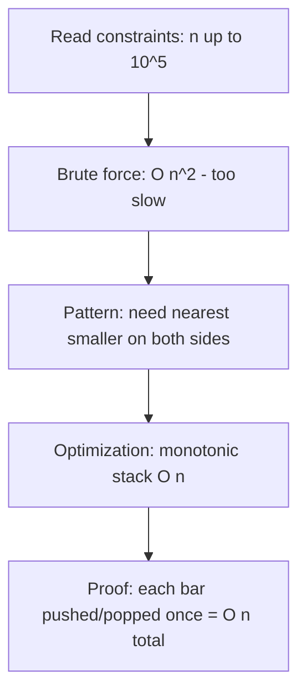

# Stacks & Queues — Order Matters


**Silver Milestone Chapter!** This is the final chapter of Part III — The Silver Arena. When you finish this chapter, you will have completed every major topic needed for USACO Silver. That is a massive accomplishment. Take a moment to be proud of how far you have come.


## Chapter Goals

By the end of this chapter, you will:

- Understand the **stack** (LIFO) and **queue** (FIFO) abstract data types and when to use each
- Implement stacks and queues from scratch using arrays
- Solve the classic **balanced parentheses** problem with a stack
- Understand **monotonic stacks** and use them to solve next-greater-element and histogram problems
- Use a **deque** (double-ended queue) for the sliding window maximum problem
- Evaluate **postfix (Reverse Polish Notation)** expressions using a stack
- Build a **Min Stack** that supports O(1) getMin
- Implement a **queue using two stacks** (and vice versa)
- Design an **LRU Cache** using a hash map and doubly linked list
- Recognize which problems call for stacks vs. queues vs. deques in competitive programming

---

## The Story: "The Restaurant"

Imagine you work at a busy restaurant called **The Silver Spoon**.

In the kitchen, there is a spring-loaded plate dispenser — the kind where you push plates down onto a spring, and the top plate is always the one you grab. When a clean plate comes out of the dishwasher, the kitchen staff pushes it onto the top. When a server needs a plate, they grab the one on top. The plate that went in **last** comes out **first**. That is a **stack** — Last In, First Out (LIFO).

Out in the dining room, there is a line of customers waiting to be seated. The first person who arrives is the first person seated. New arrivals join the back of the line. The person who has been waiting the **longest** gets served **first**. That is a **queue** — First In, First Out (FIFO).

Now imagine the restaurant gets really busy. The manager needs a special system: some VIP customers can cut to the front, and sometimes the last person in line changes their mind and leaves from the back. That is a **deque** — a double-ended queue where you can add or remove from both ends.

One more thing: the kitchen has a smart thermometer that tracks every temperature reading and can instantly tell you the **minimum** temperature recorded — without scanning through all readings. That is a **Min Stack**.

These data structures are everywhere in computer science. Undo/redo in your text editor? Stack. Print jobs waiting for a printer? Queue. The browser's back and forward buttons? Two stacks working together. And some of the most elegant competitive programming solutions use **monotonic stacks** to solve problems that look impossibly hard at first glance.

Let's learn them all.

---

## Johari Window: Before

Before diving in, take 5 minutes to fill out the **"Before"** section of your [Johari Window worksheet](johari.md).


Be honest with yourself! Knowing what you *don't* know is the first step to learning it. There are no wrong answers — only honest ones.


---

## Discovery

Before we dive into the theory, try these three puzzles:

### Puzzle 1: "The Bracket Checker"

You are writing a code validator. Given a string of brackets like `"([{}])"`, you need to determine whether every opening bracket has a matching closing bracket in the correct order.

- `"()"` -- valid
- `"([)]"` -- invalid (the brackets interleave)
- `"{[]}"` -- valid
- `"((("` -- invalid (never closed)

How would you check this? Hint: what if you read left to right and "remember" each opening bracket... then when you see a closing bracket, you check if it matches the **most recent** unmatched opening bracket?


You need a data structure where you always access the most recently added item. That is a **stack**. Push opening brackets, pop when you see a closing bracket, and check for a match. Section 22.1 teaches this.


### Puzzle 2: "The Weather Forecast"

You have a list of daily temperatures: `[73, 74, 75, 71, 69, 72, 76, 73]`. For each day, you want to know: **how many days until a warmer temperature?**

- Day 0 (73): next warmer is Day 1 (74), so answer = 1
- Day 1 (74): next warmer is Day 2 (75), so answer = 1
- Day 2 (75): next warmer is Day 6 (76), so answer = 4
- Day 3 (71): next warmer is Day 5 (72)... wait, 72 > 71 but is that the first warmer day?

You could check every future day for each day, but that is O(n^2). Can you do better? What if you maintained a list of "days still waiting for a warmer day" and processed them as you go?


This is the **monotonic stack** pattern. You maintain a stack of indices whose temperatures have not yet found a warmer day. Each new temperature "resolves" all stack entries that are cooler. Section 22.4 covers this.


### Puzzle 3: "The Calculator"

Evaluate this expression written in a strange notation: `3 4 + 2 *`

The rules: read left to right. When you see a number, remember it. When you see an operator, apply it to the two most recent numbers.

- Read 3: remember it
- Read 4: remember it
- Read +: apply + to 4 and 3 -> 7, remember 7
- Read 2: remember 2
- Read *: apply * to 2 and 7 -> 14

The answer is 14. This is **Reverse Polish Notation** (postfix). Notice how you never need parentheses? This notation was used in early HP calculators and is still used in many compilers internally.


The "remember" operation is a **push** onto a stack. The "apply to two most recent" is two **pops** followed by a **push** of the result. Section 22.6 explains this.


---

## 22.1 Stacks (LIFO)

A **stack** is a collection where you can only add (push) and remove (pop) from the **top**. Think of it as a stack of plates: Last In, First Out.

### Core Operations

| Operation   | Description                    | Time |
|-------------|--------------------------------|------|
| `push(x)`   | Add element x to the top       | O(1) |
| `pop()`     | Remove and return the top      | O(1) |
| `peek()`/`top()` | Look at the top without removing | O(1) |
| `isEmpty()`  | Check if the stack is empty    | O(1) |

### Implementation with an Array



```python
class Stack:
    def __init__(self):
        self._data = []

    def push(self, x):
        self._data.append(x)

    def pop(self):
        if self.is_empty():
            raise IndexError("pop from empty stack")
        return self._data.pop()

    def peek(self):
        if self.is_empty():
            raise IndexError("peek from empty stack")
        return self._data[-1]

    def is_empty(self):
        return len(self._data) == 0

    def size(self):
        return len(self._data)
```


```java
import java.util.ArrayList;

public class Stack<T> {
    private ArrayList<T> data = new ArrayList<>();

    public void push(T x) { data.add(x); }

    public T pop() {
        if (isEmpty()) throw new RuntimeException("pop from empty stack");
        return data.remove(data.size() - 1);
    }

    public T peek() {
        if (isEmpty()) throw new RuntimeException("peek from empty stack");
        return data.get(data.size() - 1);
    }

    public boolean isEmpty() { return data.isEmpty(); }

    public int size() { return data.size(); }
}
```


```cpp
#include <vector>
#include <stdexcept>

template <typename T>
class Stack {
    std::vector<T> data;
public:
    void push(T x) { data.push_back(x); }

    T pop() {
        if (empty()) throw std::runtime_error("pop from empty stack");
        T val = data.back();
        data.pop_back();
        return val;
    }

    T top() const {
        if (empty()) throw std::runtime_error("top on empty stack");
        return data.back();
    }

    bool empty() const { return data.empty(); }

    int size() const { return data.size(); }
};
```



### Language Spotlight: Built-in Stacks

| Feature | Python | Java | C++ |
|---------|--------|------|-----|
| Use as stack | `list` (append/pop) | `Deque<E> stack = new ArrayDeque<>()` | `std::stack<T>` |
| Push | `lst.append(x)` | `stack.push(x)` | `stk.push(x)` |
| Pop | `lst.pop()` | `stack.pop()` | `stk.pop()` (void! read `top()` first) |
| Peek | `lst[-1]` | `stack.peek()` | `stk.top()` |


**C++ Gotcha**: `std::stack::pop()` returns `void` — it does NOT return the removed element. You must call `top()` first to read the value, then `pop()` to remove it. This catches many beginners off guard.


### Classic Problem: Balanced Parentheses

Given a string containing `()[]{}`, determine if it is valid:

1. Every opening bracket must have a corresponding closing bracket of the same type.
2. Brackets must close in the correct order.

**Algorithm:**
1. Create an empty stack.
2. For each character in the string:
   - If it is an opening bracket (`(`, `[`, `{`), push it.
   - If it is a closing bracket, check if the stack is empty (invalid!) or if the top does not match (invalid!). Otherwise, pop.
3. At the end, the stack must be empty (all brackets matched).



```python
def is_valid(s: str) -> bool:
    stack = []
    match = {')': '(', ']': '[', '}': '{'}
    for ch in s:
        if ch in '([{':
            stack.append(ch)
        elif ch in ')]}':
            if not stack or stack[-1] != match[ch]:
                return False
            stack.pop()
    return len(stack) == 0
```


```java
public static boolean isValid(String s) {
    Deque<Character> stack = new ArrayDeque<>();
    for (char ch : s.toCharArray()) {
        if (ch == '(' || ch == '[' || ch == '{') {
            stack.push(ch);
        } else {
            if (stack.isEmpty()) return false;
            char top = stack.pop();
            if ((ch == ')' && top != '(') ||
                (ch == ']' && top != '[') ||
                (ch == '}' && top != '{')) return false;
        }
    }
    return stack.isEmpty();
}
```


```cpp
bool isValid(string s) {
    stack<char> stk;
    for (char ch : s) {
        if (ch == '(' || ch == '[' || ch == '{') {
            stk.push(ch);
        } else {
            if (stk.empty()) return false;
            char top = stk.top(); stk.pop();
            if ((ch == ')' && top != '(') ||
                (ch == ']' && top != '[') ||
                (ch == '}' && top != '{')) return false;
        }
    }
    return stk.empty();
}
```



---

## 22.2 Queues (FIFO)

A **queue** is a collection where you add to the **back** and remove from the **front**. Think of a line of customers: First In, First Out.

### Core Operations

| Operation     | Description                     | Time |
|---------------|---------------------------------|------|
| `enqueue(x)`  | Add element x to the back       | O(1) |
| `dequeue()`   | Remove and return the front     | O(1) |
| `peek()`/`front()` | Look at the front without removing | O(1) |
| `isEmpty()`    | Check if the queue is empty     | O(1) |

### Implementation with an Array (Circular Queue)

A naive array-based queue wastes space because dequeue shifts elements. A **circular queue** uses modular arithmetic to wrap around:



```python
# In Python, just use collections.deque for a production queue.
# Here is a simple list-based version for learning:
from collections import deque

q = deque()
q.append(10)       # enqueue
q.append(20)
q.append(30)
front = q.popleft() # dequeue -> 10
print(q[0])         # peek -> 20
```


```java
import java.util.ArrayDeque;
import java.util.Queue;

Queue<Integer> q = new ArrayDeque<>();
q.offer(10);          // enqueue
q.offer(20);
q.offer(30);
int front = q.poll(); // dequeue -> 10
System.out.println(q.peek()); // peek -> 20
```


```cpp
#include <queue>

queue<int> q;
q.push(10);         // enqueue
q.push(20);
q.push(30);
int front = q.front(); // peek -> 10
q.pop();             // dequeue (void!)
cout << q.front();   // 20
```



### BFS Connection (Callback to Chapter 19!)

Remember BFS from Chapter 19 (Graphs I)? BFS uses a **queue** to explore nodes level by level. Every time we visit a node, we enqueue its unvisited neighbors. The queue ensures we process nodes in the order they were discovered — exactly FIFO.

```
BFS(start):
    queue = [start]
    visited = {start}
    while queue is not empty:
        node = queue.dequeue()
        for neighbor in node.neighbors:
            if neighbor not in visited:
                visited.add(neighbor)
                queue.enqueue(neighbor)
```

This is why queues are fundamental in graph algorithms. If you swap the queue for a stack, you get **DFS** instead!

---

## 22.3 Stack Using Queues & Vice Versa

This is a classic interview problem: implement one data structure using the other.

### Implement Stack Using Two Queues

**Idea**: Keep one "main" queue. On push, add to a temporary queue, then move all elements from main to temp, then swap. This makes the newest element always at the front.



```python
from collections import deque

class StackUsingQueues:
    def __init__(self):
        self.q = deque()

    def push(self, x):
        self.q.append(x)
        # Rotate all previous elements behind the new one
        for _ in range(len(self.q) - 1):
            self.q.append(self.q.popleft())

    def pop(self):
        return self.q.popleft()

    def top(self):
        return self.q[0]

    def empty(self):
        return len(self.q) == 0
```


```java
import java.util.ArrayDeque;
import java.util.Queue;

class StackUsingQueues {
    Queue<Integer> q = new ArrayDeque<>();

    public void push(int x) {
        q.offer(x);
        for (int i = 0; i < q.size() - 1; i++) {
            q.offer(q.poll());
        }
    }

    public int pop()  { return q.poll(); }
    public int top()  { return q.peek(); }
    public boolean empty() { return q.isEmpty(); }
}
```


```cpp
#include <queue>

class StackUsingQueues {
    queue<int> q;
public:
    void push(int x) {
        q.push(x);
        for (int i = 0; i < (int)q.size() - 1; i++) {
            q.push(q.front());
            q.pop();
        }
    }
    int pop()  { int v = q.front(); q.pop(); return v; }
    int top()  { return q.front(); }
    bool empty() { return q.empty(); }
};
```



### Implement Queue Using Two Stacks

**Idea**: Use an "in" stack and an "out" stack. Push goes to "in". Pop checks "out" — if empty, transfer all from "in" to "out" (reversing the order). **Amortized O(1)** per operation.



```python
class QueueUsingStacks:
    def __init__(self):
        self.stack_in = []
        self.stack_out = []

    def enqueue(self, x):
        self.stack_in.append(x)

    def dequeue(self):
        if not self.stack_out:
            while self.stack_in:
                self.stack_out.append(self.stack_in.pop())
        return self.stack_out.pop()

    def peek(self):
        if not self.stack_out:
            while self.stack_in:
                self.stack_out.append(self.stack_in.pop())
        return self.stack_out[-1]

    def empty(self):
        return not self.stack_in and not self.stack_out
```


```java
import java.util.ArrayDeque;
import java.util.Deque;

class QueueUsingStacks {
    Deque<Integer> stackIn  = new ArrayDeque<>();
    Deque<Integer> stackOut = new ArrayDeque<>();

    public void enqueue(int x) { stackIn.push(x); }

    public int dequeue() {
        if (stackOut.isEmpty()) {
            while (!stackIn.isEmpty()) stackOut.push(stackIn.pop());
        }
        return stackOut.pop();
    }

    public int peek() {
        if (stackOut.isEmpty()) {
            while (!stackIn.isEmpty()) stackOut.push(stackIn.pop());
        }
        return stackOut.peek();
    }

    public boolean empty() {
        return stackIn.isEmpty() && stackOut.isEmpty();
    }
}
```


```cpp
#include <stack>

class QueueUsingStacks {
    stack<int> in, out;
    void transfer() {
        while (!in.empty()) { out.push(in.top()); in.pop(); }
    }
public:
    void enqueue(int x) { in.push(x); }

    int dequeue() {
        if (out.empty()) transfer();
        int v = out.top(); out.pop();
        return v;
    }

    int peek() {
        if (out.empty()) transfer();
        return out.top();
    }

    bool empty() { return in.empty() && out.empty(); }
};
```



---

## 22.4 Monotonic Stack

A **monotonic stack** is a stack that maintains its elements in sorted order (either always increasing or always decreasing from bottom to top). When you push a new element, you first pop everything that violates the monotonic property.

This is one of the most powerful techniques for competitive programming. It solves an entire family of problems in O(n) that would otherwise require O(n^2).

### The "Next Greater Element" Pattern

**Problem**: For each element in an array, find the **next greater element** to its right. If none exists, return -1.

**Example**: `[2, 1, 2, 4, 3]` -> `[4, 2, 4, -1, -1]`

**Brute force**: For each element, scan right until you find something bigger. O(n^2).

**Monotonic stack**: Process from right to left. Maintain a stack of "candidates" in decreasing order.



```python
def next_greater(arr):
    n = len(arr)
    result = [-1] * n
    stack = []  # stores indices

    for i in range(n - 1, -1, -1):
        # Pop elements that are <= arr[i] (not greater)
        while stack and arr[stack[-1]] <= arr[i]:
            stack.pop()
        if stack:
            result[i] = arr[stack[-1]]
        stack.append(i)
    return result
```


```java
public static int[] nextGreater(int[] arr) {
    int n = arr.length;
    int[] result = new int[n];
    Arrays.fill(result, -1);
    Deque<Integer> stack = new ArrayDeque<>();

    for (int i = n - 1; i >= 0; i--) {
        while (!stack.isEmpty() && arr[stack.peek()] <= arr[i]) {
            stack.pop();
        }
        if (!stack.isEmpty()) result[i] = arr[stack.peek()];
        stack.push(i);
    }
    return result;
}
```


```cpp
vector<int> nextGreater(vector<int>& arr) {
    int n = arr.size();
    vector<int> result(n, -1);
    stack<int> stk; // stores indices

    for (int i = n - 1; i >= 0; i--) {
        while (!stk.empty() && arr[stk.top()] <= arr[i]) {
            stk.pop();
        }
        if (!stk.empty()) result[i] = arr[stk.top()];
        stk.push(i);
    }
    return result;
}
```



**Why O(n)?** Each element is pushed onto the stack exactly once and popped at most once. So the total number of operations across all iterations is at most 2n = O(n).

### Daily Temperatures (Variation)

Instead of finding the next greater value, find the **number of days** until a warmer temperature:

`[73, 74, 75, 71, 69, 72, 76, 73]` -> `[1, 1, 4, 2, 1, 1, 0, 0]`

Same idea: use a monotonic stack of indices, process left to right, and when you pop an index from the stack, the current index minus the popped index gives the answer.

---

## 22.5 Deque (Double-Ended Queue)

A **deque** (pronounced "deck") lets you add and remove from both the front and the back in O(1).

| Operation | Description | Time |
|-----------|-------------|------|
| `push_front(x)` | Add to front | O(1) |
| `push_back(x)` | Add to back | O(1) |
| `pop_front()` | Remove from front | O(1) |
| `pop_back()` | Remove from back | O(1) |



```python
from collections import deque
d = deque()
d.append(1)      # push_back
d.appendleft(2)  # push_front
d.pop()          # pop_back -> 1
d.popleft()      # pop_front -> 2
```


```java
Deque<Integer> d = new ArrayDeque<>();
d.offerLast(1);   // push_back
d.offerFirst(2);  // push_front
d.pollLast();     // pop_back -> 1
d.pollFirst();    // pop_front -> 2
```


```cpp
#include <deque>
deque<int> d;
d.push_back(1);   // push_back
d.push_front(2);  // push_front
d.pop_back();     // pop_back
d.pop_front();    // pop_front
```



### Sliding Window Maximum

**Problem**: Given an array and a window size k, find the maximum in each window as it slides from left to right.

**Example**: `arr = [1,3,-1,-3,5,3,6,7]`, `k = 3`
- Window `[1,3,-1]` -> max = 3
- Window `[3,-1,-3]` -> max = 3
- Window `[-1,-3,5]` -> max = 5
- Window `[-3,5,3]` -> max = 5
- Window `[5,3,6]` -> max = 6
- Window `[3,6,7]` -> max = 7
- Result: `[3, 3, 5, 5, 6, 7]`

**Brute force**: For each window, scan all k elements to find the max. O(nk).

**Deque approach**: Maintain a deque of indices. The front of the deque is always the index of the maximum in the current window. As the window slides:
1. Remove indices from the front that are outside the window.
2. Remove indices from the back whose values are smaller than the new element (they can never be the max).
3. Add the new index to the back.



```python
from collections import deque

def max_sliding_window(nums, k):
    dq = deque()  # stores indices
    result = []

    for i in range(len(nums)):
        # Remove indices outside the window
        while dq and dq[0] < i - k + 1:
            dq.popleft()
        # Remove smaller elements from the back
        while dq and nums[dq[-1]] <= nums[i]:
            dq.pop()
        dq.append(i)
        # Window is fully formed starting at index k-1
        if i >= k - 1:
            result.append(nums[dq[0]])
    return result
```


```java
public static int[] maxSlidingWindow(int[] nums, int k) {
    Deque<Integer> dq = new ArrayDeque<>();
    int[] result = new int[nums.length - k + 1];
    int ri = 0;

    for (int i = 0; i < nums.length; i++) {
        while (!dq.isEmpty() && dq.peekFirst() < i - k + 1)
            dq.pollFirst();
        while (!dq.isEmpty() && nums[dq.peekLast()] <= nums[i])
            dq.pollLast();
        dq.offerLast(i);
        if (i >= k - 1)
            result[ri++] = nums[dq.peekFirst()];
    }
    return result;
}
```


```cpp
vector<int> maxSlidingWindow(vector<int>& nums, int k) {
    deque<int> dq; // stores indices
    vector<int> result;

    for (int i = 0; i < (int)nums.size(); i++) {
        while (!dq.empty() && dq.front() < i - k + 1)
            dq.pop_front();
        while (!dq.empty() && nums[dq.back()] <= nums[i])
            dq.pop_back();
        dq.push_back(i);
        if (i >= k - 1)
            result.push_back(nums[dq.front()]);
    }
    return result;
}
```



**Time**: O(n) — each element is added and removed from the deque at most once.

---

## 22.6 Expression Conversion (Postfix Evaluation)

In **infix** notation, operators go between operands: `3 + 4 * 2`. This requires parentheses and precedence rules.

In **postfix** (Reverse Polish Notation), operators come after their operands: `3 4 2 * +`. No parentheses needed! A stack-based evaluator processes this naturally.

### Evaluating Postfix Expressions



```python
def eval_rpn(tokens):
    stack = []
    ops = {'+', '-', '*', '/'}
    for token in tokens:
        if token in ops:
            b = stack.pop()
            a = stack.pop()
            if token == '+': stack.append(a + b)
            elif token == '-': stack.append(a - b)
            elif token == '*': stack.append(a * b)
            elif token == '/': stack.append(int(a / b))  # truncate toward zero
        else:
            stack.append(int(token))
    return stack[0]

# Example: "3 4 + 2 *" = (3+4)*2 = 14
print(eval_rpn(["3", "4", "+", "2", "*"]))  # 14
```


```java
public static int evalRPN(String[] tokens) {
    Deque<Integer> stack = new ArrayDeque<>();
    for (String t : tokens) {
        switch (t) {
            case "+": { int b = stack.pop(), a = stack.pop(); stack.push(a + b); break; }
            case "-": { int b = stack.pop(), a = stack.pop(); stack.push(a - b); break; }
            case "*": { int b = stack.pop(), a = stack.pop(); stack.push(a * b); break; }
            case "/": { int b = stack.pop(), a = stack.pop(); stack.push(a / b); break; }
            default: stack.push(Integer.parseInt(t));
        }
    }
    return stack.pop();
}
```


```cpp
int evalRPN(vector<string>& tokens) {
    stack<int> stk;
    for (const string& t : tokens) {
        if (t == "+" || t == "-" || t == "*" || t == "/") {
            int b = stk.top(); stk.pop();
            int a = stk.top(); stk.pop();
            if (t == "+") stk.push(a + b);
            else if (t == "-") stk.push(a - b);
            else if (t == "*") stk.push(a * b);
            else stk.push(a / b);
        } else {
            stk.push(stoi(t));
        }
    }
    return stk.top();
}
```



---

## 22.7 Min Stack

**Problem**: Design a stack that supports push, pop, top, and retrieving the minimum element — all in O(1) time.

**Trick**: Maintain two stacks — the main stack and an auxiliary "min stack." Every time you push, also push the current minimum onto the min stack. When you pop, pop from both.



```python
class MinStack:
    def __init__(self):
        self.stack = []
        self.min_stack = []

    def push(self, x):
        self.stack.append(x)
        if not self.min_stack or x <= self.min_stack[-1]:
            self.min_stack.append(x)
        else:
            self.min_stack.append(self.min_stack[-1])

    def pop(self):
        self.stack.pop()
        self.min_stack.pop()

    def top(self):
        return self.stack[-1]

    def get_min(self):
        return self.min_stack[-1]
```


```java
class MinStack {
    Deque<Integer> stack = new ArrayDeque<>();
    Deque<Integer> minStack = new ArrayDeque<>();

    public void push(int x) {
        stack.push(x);
        if (minStack.isEmpty() || x <= minStack.peek()) {
            minStack.push(x);
        } else {
            minStack.push(minStack.peek());
        }
    }

    public void pop() { stack.pop(); minStack.pop(); }
    public int top() { return stack.peek(); }
    public int getMin() { return minStack.peek(); }
}
```


```cpp
class MinStack {
    stack<int> stk;
    stack<int> minStk;
public:
    void push(int x) {
        stk.push(x);
        if (minStk.empty() || x <= minStk.top())
            minStk.push(x);
        else
            minStk.push(minStk.top());
    }

    void pop() { stk.pop(); minStk.pop(); }
    int top() { return stk.top(); }
    int getMin() { return minStk.top(); }
};
```



Each push/pop/top/getMin is O(1). Space is O(n) for the auxiliary stack.

---

## Think Like a Pro


**Tourist's Insight**: "Stacks and queues are not just data structures — they are *processing orders*. A stack processes the most recent unfinished task first (like exploring a maze depth-first). A queue processes the oldest task first (like exploring level-by-level). The monotonic stack is powerful because it lets you maintain a *sorted view* of pending elements, answering range queries in linear time."

**Errichto's Tip**: "When I see a problem that asks about 'the next element satisfying some property,' my first thought is always a monotonic stack. The key insight: each element enters and leaves the stack at most once, giving us O(n) total. This is the same amortized argument as two pointers."

**Benq's Approach**: "For sliding window problems, I immediately think deque. The deque maintains a decreasing sequence of *candidates* for the window maximum. When the window slides, candidates that can never win are eliminated from the back, and expired candidates fall off the front."


---

## Five-Lens Framework: Largest Rectangle in Histogram

Let's apply the Five-Lens Framework to the chapter's showcase problem.

**Problem**: Given an array of bar heights representing a histogram, find the area of the largest rectangle that fits within the histogram.

**Example**: `heights = [2,1,5,6,2,3]` -> answer is 10 (a rectangle of height 5 and width 2 spanning bars at index 2-3).

### Lens 1: Constraints

- 1 <= heights.length <= 10^5
- 0 <= heights[i] <= 10^4
- Need O(n) or O(n log n) — brute force O(n^2) might TLE

### Lens 2: Brute Force

For each bar i, find how far it can extend left and right while maintaining at least height[i]. The width times height[i] gives the rectangle area for bar i. Take the maximum.

Finding the left and right boundaries for each bar takes O(n) per bar -> O(n^2) total.

### Lens 3: Pattern

For each bar, we need the "nearest smaller bar to the left" and "nearest smaller bar to the right." This is exactly the **monotonic stack** pattern! We have seen it with "next greater element" — this is "next smaller element" on both sides.

### Lens 4: Optimization

Use a monotonic stack (increasing from bottom to top). When we encounter a bar shorter than the stack top, the stack top's "right boundary" is found. Its "left boundary" is the element below it in the stack.

```
Process heights left to right:
- If current height > stack top: push (extending the rectangle)
- If current height <= stack top: pop and calculate area
  - The popped bar's rectangle extends from (new stack top + 1) to (current index - 1)
```

### Lens 5: Proof of Correctness

When we pop a bar `h` at index `j`:
- **Right boundary**: current index `i` is the first bar to the right that is shorter than `h`.
- **Left boundary**: the new stack top `k` is the first bar to the left that is shorter than `h`.
- **Width**: `i - k - 1`.
- **Area**: `h * (i - k - 1)`.

Since every bar is pushed once and popped once, the algorithm is O(n).



---

## AOPS Showcase: Largest Rectangle in Histogram

### Solution 1: Brute Force O(n^2)

For each bar, expand left and right while neighboring bars are at least as tall.



```python
def largest_rectangle_brute(heights):
    n = len(heights)
    max_area = 0
    for i in range(n):
        # Expand left
        left = i
        while left > 0 and heights[left - 1] >= heights[i]:
            left -= 1
        # Expand right
        right = i
        while right < n - 1 and heights[right + 1] >= heights[i]:
            right += 1
        area = heights[i] * (right - left + 1)
        max_area = max(max_area, area)
    return max_area
```


```java
public static int largestRectangleBrute(int[] heights) {
    int n = heights.length, maxArea = 0;
    for (int i = 0; i < n; i++) {
        int left = i, right = i;
        while (left > 0 && heights[left - 1] >= heights[i]) left--;
        while (right < n - 1 && heights[right + 1] >= heights[i]) right++;
        maxArea = Math.max(maxArea, heights[i] * (right - left + 1));
    }
    return maxArea;
}
```


```cpp
int largestRectangleBrute(vector<int>& heights) {
    int n = heights.size(), maxArea = 0;
    for (int i = 0; i < n; i++) {
        int left = i, right = i;
        while (left > 0 && heights[left - 1] >= heights[i]) left--;
        while (right < n - 1 && heights[right + 1] >= heights[i]) right++;
        maxArea = max(maxArea, heights[i] * (right - left + 1));
    }
    return maxArea;
}
```



### Solution 2: Monotonic Stack O(n)



```python
def largest_rectangle(heights):
    stack = []  # indices of bars in increasing height order
    max_area = 0
    heights.append(0)  # sentinel to flush remaining bars

    for i in range(len(heights)):
        while stack and heights[stack[-1]] > heights[i]:
            h = heights[stack.pop()]
            w = i if not stack else i - stack[-1] - 1
            max_area = max(max_area, h * w)
        stack.append(i)

    heights.pop()  # restore original array
    return max_area
```


```java
public static int largestRectangle(int[] heights) {
    Deque<Integer> stack = new ArrayDeque<>();
    int maxArea = 0;
    int n = heights.length;

    for (int i = 0; i <= n; i++) {
        int curr = (i == n) ? 0 : heights[i]; // sentinel
        while (!stack.isEmpty() && heights[stack.peek()] > curr) {
            int h = heights[stack.pop()];
            int w = stack.isEmpty() ? i : i - stack.peek() - 1;
            maxArea = Math.max(maxArea, h * w);
        }
        stack.push(i);
    }
    return maxArea;
}
```


```cpp
int largestRectangle(vector<int>& heights) {
    stack<int> stk;
    int maxArea = 0;
    int n = heights.size();

    for (int i = 0; i <= n; i++) {
        int curr = (i == n) ? 0 : heights[i]; // sentinel
        while (!stk.empty() && heights[stk.top()] > curr) {
            int h = heights[stk.top()]; stk.pop();
            int w = stk.empty() ? i : i - stk.top() - 1;
            maxArea = max(maxArea, h * w);
        }
        stk.push(i);
    }
    return maxArea;
}
```



**Comparison**:

| Approach | Time | Space | Key Idea |
|----------|------|-------|----------|
| Brute force | O(n^2) | O(1) | For each bar, expand left/right |
| Monotonic stack | O(n) | O(n) | Pop when a shorter bar arrives; compute area using stack boundaries |

The monotonic stack solution is a thing of beauty: 10 lines of code, O(n) time, and it handles all edge cases with the sentinel trick.

---

## Legend's Corner


**Neal Wu** started competitive programming in 8th grade, around your age. One of his favorite techniques was the monotonic stack. He once explained: "The monotonic stack is like having a bouncer at a club. When a new person arrives, the bouncer kicks out everyone in line who is weaker. Only the strong survive. And that is exactly why it works — by the time you ask 'who is the next stronger person?', the answer is right there on top of the stack."

Neal went on to become a USACO Finalist and one of the top competitive programmers in the US. The patterns in this chapter — stacks, queues, monotonic stacks, deques — are tools he used in nearly every contest.


---

## Gotchas


1. **Stack underflow**: Always check `isEmpty()` before `pop()` or `top()`. Popping from an empty stack is a runtime error in all three languages.

2. **C++ `pop()` returns void**: Unlike Python and Java, `std::stack::pop()` and `std::queue::pop()` do NOT return the removed element. You must read `top()` / `front()` first, then call `pop()`.

3. **Integer division truncation**: In postfix evaluation, `6 / -4` should truncate toward zero, giving `-1`. Python's `//` operator floors toward negative infinity, so `6 // -4 = -2`. Use `int(6 / -4)` in Python for correct truncation.

4. **Forgetting the sentinel in histogram**: The monotonic stack histogram solution needs to process remaining bars in the stack after the loop. Using a sentinel value of 0 at the end avoids a separate cleanup loop.

5. **Deque vs Queue confusion**: In Java, `ArrayDeque` implements both `Deque` and `Queue`. If you only need FIFO, use `Queue<Integer> q = new ArrayDeque<>()` to make your intent clear.

6. **Off-by-one in sliding window**: The window is fully formed at index `k-1`, not at index `k`. The result array has `n - k + 1` elements, not `n - k`.

7. **Min Stack: push the min every time**: A common mistake is only pushing to the min stack when a new minimum is found. This breaks when you pop — you need to know the minimum at every stack level.

8. **LRU Cache: double-check removal**: When updating an existing key in an LRU Cache, you must move the node to the front AND update its value. Forgetting either causes subtle bugs.


---

## Practice Problems

| # | Name | Difficulty | Key Technique | Time Target |
|---|------|-----------|---------------|-------------|
| W1 | Valid Parentheses | Warm-up | Stack push/pop matching | O(n) |
| W2 | Implement Stack Using Array | Warm-up | Array-based stack | O(1) per op |
| W3 | Implement Queue Using Array | Warm-up | Array-based queue | O(1) per op |
| W4 | Next Greater Element | Warm-up | Monotonic stack | O(n) |
| W5 | Min Stack | Warm-up | Auxiliary stack | O(1) per op |
| P1 | Daily Temperatures | Practice | Monotonic stack | O(n) |
| P2 | Evaluate Reverse Polish Notation | Practice | Stack evaluation | O(n) |
| P3 | Sliding Window Maximum | Practice | Deque | O(n) |
| P4 | Queue Using Two Stacks | Practice | Two-stack trick | O(1) amortized |
| P5 | Remove Adjacent Duplicates | Practice | Stack-based string | O(n) |
| C1 | Largest Rectangle in Histogram | Challenge | Monotonic stack | O(n) |
| C2 | Trapping Rain Water | Challenge | Stack or two-pointer | O(n) |
| C3 | Online Stock Span | Challenge | Monotonic stack | O(1) amortized |
| C4 | LRU Cache | Challenge | Hash map + DLL | O(1) per op |

---

## Language Idioms



```python
# Use list as stack
stack = []
stack.append(42)         # push
top = stack[-1]          # peek
stack.pop()              # pop

# Use collections.deque as queue
from collections import deque
q = deque()
q.append(1)              # enqueue (right)
q.popleft()              # dequeue (left)

# Deque as double-ended queue
d = deque()
d.appendleft(1)          # push_front
d.append(2)              # push_back

# OrderedDict as LRU (Python 3.7+ dict is ordered, but OrderedDict has move_to_end)
from collections import OrderedDict
cache = OrderedDict()
cache['key'] = 'value'
cache.move_to_end('key')           # mark as recently used
cache.popitem(last=False)          # evict least recently used
```


```java
// Stack (prefer ArrayDeque over Stack class)
Deque<Integer> stack = new ArrayDeque<>();
stack.push(42);          // push
int top = stack.peek();  // peek
stack.pop();             // pop (returns value)

// Queue
Queue<Integer> queue = new ArrayDeque<>();
queue.offer(1);          // enqueue
queue.poll();            // dequeue (returns value or null)
queue.peek();            // front (returns value or null)

// Deque
Deque<Integer> dq = new ArrayDeque<>();
dq.offerFirst(1);       // push_front
dq.offerLast(2);        // push_back
dq.pollFirst();         // pop_front
dq.pollLast();          // pop_back

// LinkedHashMap for LRU (override removeEldestEntry)
LinkedHashMap<Integer, Integer> cache =
    new LinkedHashMap<>(capacity, 0.75f, true) {
        protected boolean removeEldestEntry(Map.Entry e) {
            return size() > capacity;
        }
    };
```


```cpp
#include <stack>
#include <queue>
#include <deque>
#include <list>
#include <unordered_map>

// Stack
stack<int> stk;
stk.push(42);
int top = stk.top();  // peek (MUST call before pop!)
stk.pop();             // void! does not return

// Queue
queue<int> q;
q.push(1);
int front = q.front(); // peek
q.pop();                // void!

// Deque
deque<int> dq;
dq.push_front(1);
dq.push_back(2);
dq.pop_front();
dq.pop_back();
// Also supports random access: dq[i]

// LRU Cache: list + unordered_map
list<pair<int,int>> items;                  // {key, value}
unordered_map<int, list<pair<int,int>>::iterator> cache;
// On access: splice to front
// On evict: remove from back
```



---


## Silver Milestone Reached!

Congratulations! You have completed Part III — The Silver Arena. Look at everything you now know:

- **Prefix sums** for range queries in O(1) (Ch 14)
- **Two pointers and sliding windows** for efficient scans (Ch 15)
- **Binary search on answers** for optimization problems (Ch 16)
- **Heaps and priority queues** for efficient min/max operations (Ch 17)
- **Greedy algorithms** for making locally optimal choices (Ch 18)
- **Graphs**: BFS, DFS, connected components, flood fill (Ch 19-20)
- **Linked lists** for pointer-based data structures (Ch 21)
- **Stacks, queues, monotonic stacks, and deques** for order-based processing (Ch 22)

You are now equipped to attempt **USACO Silver** contest problems. The Silver division tests exactly these skills: efficient data structures, graph traversal, greedy reasoning, and the ability to reduce a problem to a known pattern.

**What to do next**: Try 3-5 recent USACO Silver problems on [usaco.org](http://usaco.org). Give yourself 4 hours per contest. Do not worry if you cannot solve all three problems — even solving one is a strong start.

The **Gold Crucible** awaits. Dynamic programming, trees, shortest paths, and more advanced techniques will take your problem-solving to the next level. But first, celebrate this milestone. You have earned it.


---

## Breadcrumbs

**Looking Back**:
- **Ch 5 (Collections)**: You first met lists, sets, and maps. Now you see specialized collections (stacks, queues, deques) with restricted access patterns.
- **Ch 19 (Graphs I)**: BFS uses a queue, DFS uses a stack (or recursion, which IS a stack). Now you understand exactly why.
- **Ch 15 (Two Pointers)**: The amortized O(n) argument for two pointers is the same argument that makes monotonic stacks O(n).
- **Ch 21 (Linked Lists)**: The LRU Cache combines a doubly linked list with a hash map — linking this chapter to the previous one.

**Looking Forward**:
- **Ch 23 (DP I)**: Dynamic programming can use stacks for optimization (stack-based DP for histogram-style problems).
- **Ch 26 (Trees)**: Tree traversals (preorder, inorder, postorder) can be done iteratively using an explicit stack instead of recursion.
- **Ch 30 (Segment Trees)**: Segment trees generalize the "range query" idea that sliding window maximum introduces here.

---

## Johari Window: After

Now fill out the **"After"** section of your [Johari Window worksheet](johari.md). Compare your "Before" and "After" answers — what surprised you? What do you still want to explore?

---

## Open Questions Beyond

1. **Can you combine a monotonic stack with DP?** Some Gold/Platinum problems ask for things like "largest rectangle in a 2D grid of 0s and 1s." Hint: treat each row as a histogram, then run the largest-rectangle algorithm on each row.

2. **What is a monotonic queue?** We used a deque for sliding window maximum, maintaining a decreasing sequence. This is sometimes called a "monotonic deque" or "monotonic queue." Can you use this idea to optimize certain DP transitions from O(nk) to O(n)?

3. **How does your browser's back/forward work?** It uses two stacks: one for "back" history and one for "forward" history. When you navigate to a new page, the forward stack is cleared. Can you design this system?

---

## What's Next

You have conquered the Silver Arena. Next up is **Part IV: The Gold Crucible**, starting with **Chapter 23: Dynamic Programming I — The Foundation**. DP is often called the single most important topic in competitive programming. It builds on recursion (Ch 10) and will transform how you think about optimization problems. Get ready — the Gold journey begins now.
