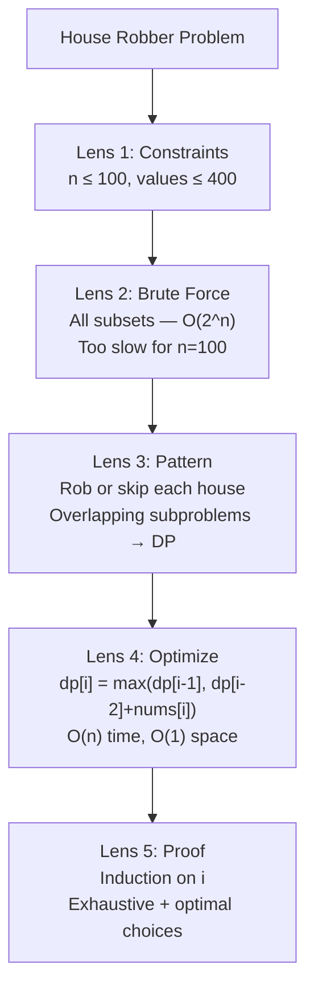

# Dynamic Programming I — The Foundation


**Welcome to Part IV: The Gold Crucible!** You have made it past Bronze and Silver. From here on, the problems get harder — and the techniques get more powerful. Dynamic Programming (DP) is THE most important topic for USACO Gold and beyond. Master it, and an enormous category of problems that once seemed impossible will click into place. This chapter is your gateway.


## Chapter Goals

By the end of this chapter, you will:

- Understand what Dynamic Programming is and why it works (overlapping subproblems + optimal substructure)
- Know the difference between top-down (memoization) and bottom-up (tabulation) DP
- Follow the DP Recipe: identify state, write recurrence, set base cases, choose iteration order, optimize space
- Solve the classic Climbing Stairs problem using all four stages: recursion, memoization, tabulation, space-optimized
- Solve the Frog Jump problem (min cost to reach the end)
- Solve the House Robber problem (max value without adjacent selections)
- Derive Kadane's algorithm for Maximum Subarray as a DP formulation
- Model stock buy/sell problems as state-machine DP (single transaction, unlimited, at most 2, cooldown, fees)
- Recognize when a problem is a DP problem vs. greedy or brute-force search
- Trace a recursion tree and identify repeated subproblems
- Convert any top-down solution to bottom-up, and vice versa
- Apply space optimization when the recurrence only looks back a fixed number of steps

---

## The Story: "The Wise Merchant"

Long ago, in a kingdom of winding mountain roads, there lived a merchant named Dara. Every week she traveled from her village at the foot of the mountains to the great market at the summit. The path split at every crossroads, and at each fork she had to pay a toll.

Dara was clever. On her first journey, she carefully calculated the cheapest path by trying every possible route — every combination of left and right turns. With 20 crossroads, that meant over a million possible routes. It took her all day just to plan.

But Dara noticed something. At the tenth crossroads, whether she had come from the north trail or the east trail, the cheapest remaining path to the summit was EXACTLY THE SAME. The past didn't matter — only her current position did.

So Dara pulled out her notebook and started writing things down. "Cheapest path from crossroads 10 to summit: 47 coins." Next trip, when she reached crossroads 10, she didn't recalculate. She just flipped open her notebook. "47 coins. Done."

She did the same for crossroads 9, 8, 7 — all the way back to her village. By writing down the answer to each subproblem ONCE and looking it up whenever she needed it again, Dara reduced her planning from a million calculations to just 20.

The other merchants were amazed. "How do you plan your route so fast?"

Dara smiled. "I don't solve the same problem twice. I REMEMBER."

That is Dynamic Programming. And today, you learn to think like Dara.

---

[Johari Window: Before](johari.md)

---

## Discovery

Before we explain DP formally, try these puzzles by hand:

### Puzzle 1: "The Staircase"

You are climbing a staircase with 5 steps. Each time you can climb 1 or 2 steps. How many DISTINCT ways can you reach the top?

Try listing them:
- 1+1+1+1+1
- 1+1+1+2
- 1+1+2+1
- 1+2+1+1
- 2+1+1+1
- 1+2+2
- 2+1+2
- 2+2+1

That's 8 ways. Now try 6 steps. Can you see a pattern forming? What if I told you the answer for 4 steps is 5, and for 3 steps is 3? Notice that 5 + 3 = 8. Coincidence?


The number of ways to reach step `n` equals the number of ways to reach step `n-1` PLUS the number of ways to reach step `n-2`. That is because your last move is either 1 step (from n-1) or 2 steps (from n-2). This is the Fibonacci pattern — and it is your first DP recurrence!


### Puzzle 2: "The Toll Road"

You are on a number line at position 0. You want to reach position 4. You can jump 1 or 2 positions forward. Each position has a cost:

```
Position:  0    1    2    3    4
Cost:     [0]  [3]  [2]  [6]  [1]
```

What is the cheapest way to get from position 0 to position 4?

- Path 0->1->2->3->4: cost = 0+3+2+6+1 = 12
- Path 0->1->2->4: cost = 0+3+2+1 = 6
- Path 0->2->3->4: cost = 0+2+6+1 = 9
- Path 0->1->3->4: cost = 0+3+6+1 = 10
- Path 0->2->4: cost = 0+2+1 = 3

The cheapest is 3 (path 0->2->4). But how do we find this WITHOUT trying all paths?


At each position, the cheapest way to get there is: `min(cheapest to (pos-1), cheapest to (pos-2)) + cost[pos]`. This is DP thinking — the optimal answer at each step depends only on the optimal answers to smaller subproblems.


### Puzzle 3: "Why Recursion Is Slow"

Consider computing Fibonacci(5) with plain recursion:

```
fib(5)
├── fib(4)
│   ├── fib(3)
│   │   ├── fib(2) ← computed here
│   │   └── fib(1)
│   └── fib(2)     ← and AGAIN here!
└── fib(3)         ← fib(3) computed AGAIN!
    ├── fib(2)     ← and fib(2) a THIRD time!
    └── fib(1)
```

`fib(3)` is computed 2 times. `fib(2)` is computed 3 times. For `fib(50)`, there are over 40 BILLION redundant calls. That is the problem DP solves: it remembers answers so you never recompute them.

---

## 23.1 What Is Dynamic Programming?

**Dynamic Programming** (DP) is an optimization technique that solves complex problems by breaking them into overlapping subproblems, solving each subproblem only once, and storing the results.

Two conditions must hold for DP to apply:

### Condition 1: Overlapping Subproblems

The same subproblem appears multiple times in the recursion tree. In the Fibonacci example, `fib(3)` is needed by both `fib(5)` and `fib(4)`. Without DP, we recompute it. With DP, we compute it once and look it up.

### Condition 2: Optimal Substructure

The optimal solution to the overall problem can be constructed from optimal solutions to its subproblems. In the toll road puzzle, the cheapest path to position 4 uses the cheapest path to position 2 or 3 — you never need a "suboptimal" sub-path to build the global optimum.


**DP vs. Greedy**: Greedy algorithms (Ch 18) also have optimal substructure, but they make ONE locally optimal choice and never reconsider. DP considers ALL subproblems and combines them. Greedy is faster when it works, but DP handles problems where greedy fails — like when today's best choice leads to a worse overall outcome.



**The name "Dynamic Programming"** was invented by Richard Bellman in the 1950s. He chose "dynamic" to sound impressive to politicians funding his research — it has nothing to do with "dynamic" in the programming sense. The name stuck, even though "remembering past answers" would be a better description.


---

## 23.2 The Two Approaches: Top-Down vs. Bottom-Up

There are two ways to implement DP:

### Top-Down (Memoization)

Start with the big problem. Recurse into subproblems. Before computing, check if the answer is already in a cache (memo table). If yes, return it. If no, compute it, store it, and return.

```
Think of it as: "I need fib(5). Do I already know it? No. I need fib(4) and fib(3)..."
```

**Pros**: Natural to write (just add caching to recursion). Only computes subproblems that are actually needed.

**Cons**: Recursion overhead. Risk of stack overflow for deep recursion.

### Bottom-Up (Tabulation)

Start with the smallest subproblems (base cases). Build up answers in a table, filling in larger and larger subproblems until you reach the answer.

```
Think of it as: "I know fib(0)=0 and fib(1)=1. So fib(2)=1, fib(3)=2, fib(4)=3, fib(5)=5."
```

**Pros**: No recursion overhead. Often faster in practice. Easier to optimize space.

**Cons**: Must figure out the correct fill order. Might compute subproblems you don't actually need.

### Which to Use?

| | Top-Down (Memo) | Bottom-Up (Tabulation) |
|---|---|---|
| **Style** | Recursive + cache | Iterative + array |
| **Easiest when** | Recurrence is obvious | Fill order is obvious |
| **Stack overflow?** | Possible for large n | Never |
| **Speed** | Slightly slower (call overhead) | Slightly faster |
| **Space optimization** | Harder | Easier |


**Pro tip**: Start with top-down (it is more intuitive), then convert to bottom-up for production or competition. Both give the same time complexity.


---

## 23.3 The DP Recipe

Every DP problem follows the same five steps:

### Step 1: Define the State

What information do you need to uniquely describe a subproblem? This becomes your DP table index.

- Climbing Stairs: `dp[i]` = number of ways to reach step `i`
- Frog Jump: `dp[i]` = minimum cost to reach stone `i`
- House Robber: `dp[i]` = maximum money robbing from houses `0..i`

### Step 2: Write the Recurrence

How does the answer to the current subproblem relate to smaller subproblems?

- Climbing Stairs: `dp[i] = dp[i-1] + dp[i-2]`
- Frog Jump: `dp[i] = min(dp[i-1], dp[i-2]) + cost[i]`
- House Robber: `dp[i] = max(dp[i-1], dp[i-2] + nums[i])`

### Step 3: Identify Base Cases

What are the smallest subproblems you can solve directly?

- Climbing Stairs: `dp[0] = 1, dp[1] = 1`
- Frog Jump: `dp[0] = cost[0]`
- House Robber: `dp[0] = nums[0]`

### Step 4: Determine Fill Order

For bottom-up: which direction do you fill the table? Usually left to right (small to large index).

### Step 5: Optimize Space

If `dp[i]` only depends on `dp[i-1]` and `dp[i-2]`, you don't need the whole array — just two variables!

---

## 23.4 Climbing Stairs — The Classic DP Problem

**Problem**: You are climbing a staircase with `n` steps. Each time you can climb 1 or 2 steps. How many distinct ways can you reach the top?

### The Recurrence

To reach step `n`, your last move was either:
- 1 step from step `n-1` (there are `dp[n-1]` ways to get to step `n-1`), OR
- 2 steps from step `n-2` (there are `dp[n-2]` ways to get to step `n-2`)

So: **`dp[n] = dp[n-1] + dp[n-2]`**

Base cases: `dp[1] = 1` (one way: take 1 step), `dp[2] = 2` (two ways: 1+1 or 2).

### Why Is This Correct? (Inductive Argument)

**Claim**: `dp[n]` counts all distinct ways to climb `n` stairs.

**Base**: `dp[1] = 1` (only "1"). `dp[2] = 2` ("1+1" or "2"). Both correct.

**Inductive step**: Assume `dp[k]` is correct for all `k < n`. Every path to step `n` ends with either a 1-step from `n-1` or a 2-step from `n-2`. These two sets of paths are disjoint (they end differently). By our assumption, there are `dp[n-1]` paths of the first type and `dp[n-2]` of the second type. So `dp[n] = dp[n-1] + dp[n-2]` counts all paths. QED.

We will see all four implementation stages in the AOPS Showcase below.

---

## 23.5 Frog Jump — Minimum Cost Path

**Problem**: A frog is on stone 0. There are `n` stones with heights `h[0], h[1], ..., h[n-1]`. The frog can jump to stone `i+1` or stone `i+2`. The cost of jumping from stone `i` to stone `j` is `|h[i] - h[j]|`. Find the minimum cost to reach stone `n-1`.

### State and Recurrence

- State: `dp[i]` = minimum cost to reach stone `i`
- Recurrence: `dp[i] = min(dp[i-1] + |h[i]-h[i-1]|, dp[i-2] + |h[i]-h[i-2]|)` for `i >= 2`
- Base: `dp[0] = 0` (start here, no cost), `dp[1] = |h[1]-h[0]|`



```python
def frog_jump(heights):
    n = len(heights)
    if n <= 1:
        return 0
    # dp[i] = min cost to reach stone i
    dp = [0] * n
    dp[1] = abs(heights[1] - heights[0])
    for i in range(2, n):
        dp[i] = min(
            dp[i - 1] + abs(heights[i] - heights[i - 1]),
            dp[i - 2] + abs(heights[i] - heights[i - 2])
        )
    return dp[n - 1]
```


```java
static int frogJump(int[] heights) {
    int n = heights.length;
    if (n <= 1) return 0;
    int[] dp = new int[n];
    dp[1] = Math.abs(heights[1] - heights[0]);
    for (int i = 2; i < n; i++) {
        dp[i] = Math.min(
            dp[i - 1] + Math.abs(heights[i] - heights[i - 1]),
            dp[i - 2] + Math.abs(heights[i] - heights[i - 2])
        );
    }
    return dp[n - 1];
}
```


```cpp
int frogJump(vector<int>& heights) {
    int n = heights.size();
    if (n <= 1) return 0;
    vector<int> dp(n, 0);
    dp[1] = abs(heights[1] - heights[0]);
    for (int i = 2; i < n; i++) {
        dp[i] = min(
            dp[i - 1] + abs(heights[i] - heights[i - 1]),
            dp[i - 2] + abs(heights[i] - heights[i - 2])
        );
    }
    return dp[n - 1];
}
```



> **Language Spotlight: Frog Jump**
> | | Python | Java | C++ |
> |---|--------|------|-----|
> | Absolute value | `abs(x)` | `Math.abs(x)` | `abs(x)` (or `#include <cstdlib>`) |
> | Array init | `[0] * n` | `new int[n]` (auto 0) | `vector<int>(n, 0)` |
> | Min of two | `min(a, b)` | `Math.min(a, b)` | `min(a, b)` |

**Space optimization**: Since `dp[i]` only depends on `dp[i-1]` and `dp[i-2]`, we can use two variables instead of an array — reducing space from O(n) to O(1).

---

## 23.6 House Robber — Non-Adjacent Selection

**Problem**: You are a robber planning to rob houses along a street. Each house has a certain amount of money. You cannot rob two adjacent houses (alarms are connected). What is the maximum money you can rob?

### State and Recurrence

- State: `dp[i]` = maximum money robbing from houses `0..i`
- Choice at house `i`: rob it (get `nums[i] + dp[i-2]`) or skip it (get `dp[i-1]`)
- Recurrence: `dp[i] = max(dp[i-1], dp[i-2] + nums[i])`
- Base: `dp[0] = nums[0]`, `dp[1] = max(nums[0], nums[1])`



```python
def house_robber(nums):
    n = len(nums)
    if n == 0:
        return 0
    if n == 1:
        return nums[0]
    dp = [0] * n
    dp[0] = nums[0]
    dp[1] = max(nums[0], nums[1])
    for i in range(2, n):
        dp[i] = max(dp[i - 1], dp[i - 2] + nums[i])
    return dp[n - 1]
```


```java
static int houseRobber(int[] nums) {
    int n = nums.length;
    if (n == 0) return 0;
    if (n == 1) return nums[0];
    int[] dp = new int[n];
    dp[0] = nums[0];
    dp[1] = Math.max(nums[0], nums[1]);
    for (int i = 2; i < n; i++) {
        dp[i] = Math.max(dp[i - 1], dp[i - 2] + nums[i]);
    }
    return dp[n - 1];
}
```


```cpp
int houseRobber(vector<int>& nums) {
    int n = nums.size();
    if (n == 0) return 0;
    if (n == 1) return nums[0];
    vector<int> dp(n);
    dp[0] = nums[0];
    dp[1] = max(nums[0], nums[1]);
    for (int i = 2; i < n; i++) {
        dp[i] = max(dp[i - 1], dp[i - 2] + nums[i]);
    }
    return dp[n - 1];
}
```



> **Language Spotlight: House Robber**
> | | Python | Java | C++ |
> |---|--------|------|-----|
> | Max of two | `max(a, b)` | `Math.max(a, b)` | `max(a, b)` |
> | Array length | `len(nums)` | `nums.length` | `nums.size()` |

**Key insight**: The recurrence `dp[i] = max(skip, rob)` captures the binary choice at each house. This "take-or-skip" pattern appears in many DP problems (knapsack, subsequences, etc.).

---

## 23.7 Maximum Subarray — Kadane's Algorithm

**Problem**: Given an integer array, find the contiguous subarray with the largest sum and return that sum.

Example: `[-2, 1, -3, 4, -1, 2, 1, -5, 4]` → answer is `6` (subarray `[4, -1, 2, 1]`).

### DP Formulation

- State: `dp[i]` = maximum subarray sum ENDING at index `i`
- Choice: extend the previous subarray or start fresh at `i`
- Recurrence: `dp[i] = max(dp[i-1] + nums[i], nums[i])`
- Answer: `max(dp[0], dp[1], ..., dp[n-1])`
- Base: `dp[0] = nums[0]`



```python
def max_subarray(nums):
    if not nums:
        return 0
    current = nums[0]
    best = nums[0]
    for i in range(1, len(nums)):
        current = max(current + nums[i], nums[i])
        best = max(best, current)
    return best
```


```java
static int maxSubarray(int[] nums) {
    if (nums.length == 0) return 0;
    int current = nums[0], best = nums[0];
    for (int i = 1; i < nums.length; i++) {
        current = Math.max(current + nums[i], nums[i]);
        best = Math.max(best, current);
    }
    return best;
}
```


```cpp
int maxSubarray(vector<int>& nums) {
    if (nums.empty()) return 0;
    int current = nums[0], best = nums[0];
    for (int i = 1; i < (int)nums.size(); i++) {
        current = max(current + nums[i], nums[i]);
        best = max(best, current);
    }
    return best;
}
```



This is **Kadane's algorithm** — a beautiful example of DP with O(1) space. The key insight: if the running sum becomes negative, it is better to start fresh than to carry a negative prefix.


**Cross-chapter thread: "Brute force is a strategy."** The brute-force approach checks all O(n^2) subarrays in O(n^2) or O(n^3) time. Kadane's DP reduces this to O(n) by recognizing that we only need to track the best subarray ENDING at each position.


---

## 23.8 DP on Stocks — State Machine DP

Stock problems are a classic DP family. They all follow a pattern: on each day, you can buy, sell, or do nothing. The variants differ in what constraints apply.

### Stock I: One Transaction

**Problem**: Given daily prices, find max profit from one buy and one sell (buy before sell).

- State: Track the minimum price seen so far
- At each day: `profit = price - min_price_so_far`



```python
def stock_one(prices):
    if not prices:
        return 0
    min_price = prices[0]
    max_profit = 0
    for price in prices[1:]:
        max_profit = max(max_profit, price - min_price)
        min_price = min(min_price, price)
    return max_profit
```


```java
static int stockOne(int[] prices) {
    if (prices.length == 0) return 0;
    int minPrice = prices[0], maxProfit = 0;
    for (int i = 1; i < prices.length; i++) {
        maxProfit = Math.max(maxProfit, prices[i] - minPrice);
        minPrice = Math.min(minPrice, prices[i]);
    }
    return maxProfit;
}
```


```cpp
int stockOne(vector<int>& prices) {
    if (prices.empty()) return 0;
    int minPrice = prices[0], maxProfit = 0;
    for (int i = 1; i < (int)prices.size(); i++) {
        maxProfit = max(maxProfit, prices[i] - minPrice);
        minPrice = min(minPrice, prices[i]);
    }
    return maxProfit;
}
```



### Stock II: Unlimited Transactions

**Problem**: You can make as many transactions as you want (but must sell before buying again).

**Insight**: Collect every upward price movement. If tomorrow's price is higher, buy today and sell tomorrow.



```python
def stock_unlimited(prices):
    profit = 0
    for i in range(1, len(prices)):
        if prices[i] > prices[i - 1]:
            profit += prices[i] - prices[i - 1]
    return profit
```


```java
static int stockUnlimited(int[] prices) {
    int profit = 0;
    for (int i = 1; i < prices.length; i++) {
        if (prices[i] > prices[i - 1])
            profit += prices[i] - prices[i - 1];
    }
    return profit;
}
```


```cpp
int stockUnlimited(vector<int>& prices) {
    int profit = 0;
    for (int i = 1; i < (int)prices.size(); i++) {
        if (prices[i] > prices[i - 1])
            profit += prices[i] - prices[i - 1];
    }
    return profit;
}
```



### Stock III: At Most 2 Transactions

**Problem**: At most 2 buy-sell transactions. This is where state-machine DP shines.

We track 4 states:
- `buy1`: best profit after first buy
- `sell1`: best profit after first sell
- `buy2`: best profit after second buy
- `sell2`: best profit after second sell



```python
def stock_two_txn(prices):
    if not prices:
        return 0
    buy1 = -prices[0]
    sell1 = 0
    buy2 = -prices[0]
    sell2 = 0
    for price in prices[1:]:
        buy1 = max(buy1, -price)
        sell1 = max(sell1, buy1 + price)
        buy2 = max(buy2, sell1 - price)
        sell2 = max(sell2, buy2 + price)
    return sell2
```


```java
static int stockTwoTxn(int[] prices) {
    if (prices.length == 0) return 0;
    int buy1 = -prices[0], sell1 = 0;
    int buy2 = -prices[0], sell2 = 0;
    for (int i = 1; i < prices.length; i++) {
        buy1 = Math.max(buy1, -prices[i]);
        sell1 = Math.max(sell1, buy1 + prices[i]);
        buy2 = Math.max(buy2, sell1 - prices[i]);
        sell2 = Math.max(sell2, buy2 + prices[i]);
    }
    return sell2;
}
```


```cpp
int stockTwoTxn(vector<int>& prices) {
    if (prices.empty()) return 0;
    int buy1 = -prices[0], sell1 = 0;
    int buy2 = -prices[0], sell2 = 0;
    for (int i = 1; i < (int)prices.size(); i++) {
        buy1 = max(buy1, -prices[i]);
        sell1 = max(sell1, buy1 + prices[i]);
        buy2 = max(buy2, sell1 - prices[i]);
        sell2 = max(sell2, buy2 + prices[i]);
    }
    return sell2;
}
```



### Stock with Cooldown

**Problem**: After you sell, you cannot buy the next day (1-day cooldown).

Track three states: `held` (holding stock), `sold` (just sold today), `rest` (cooldown or idle).



```python
def stock_cooldown(prices):
    if not prices:
        return 0
    held = -prices[0]  # holding a stock
    sold = 0           # just sold today
    rest = 0           # idle / cooldown
    for price in prices[1:]:
        prev_held = held
        held = max(held, rest - price)    # keep holding or buy after rest
        rest = max(rest, sold)            # keep resting or rest after sold
        sold = prev_held + price          # sell what we held
    return max(sold, rest)
```


```java
static int stockCooldown(int[] prices) {
    if (prices.length == 0) return 0;
    int held = -prices[0], sold = 0, rest = 0;
    for (int i = 1; i < prices.length; i++) {
        int prevHeld = held;
        held = Math.max(held, rest - prices[i]);
        rest = Math.max(rest, sold);
        sold = prevHeld + prices[i];
    }
    return Math.max(sold, rest);
}
```


```cpp
int stockCooldown(vector<int>& prices) {
    if (prices.empty()) return 0;
    int held = -prices[0], sold = 0, rest = 0;
    for (int i = 1; i < (int)prices.size(); i++) {
        int prevHeld = held;
        held = max(held, rest - prices[i]);
        rest = max(rest, sold);
        sold = prevHeld + prices[i];
    }
    return max(sold, rest);
}
```



### Stock with Transaction Fee

**Problem**: Unlimited transactions, but each transaction costs a fee.



```python
def stock_fee(prices, fee):
    if not prices:
        return 0
    cash = 0              # max profit without holding stock
    hold = -prices[0]     # max profit while holding stock
    for price in prices[1:]:
        cash = max(cash, hold + price - fee)
        hold = max(hold, cash - price)
    return cash
```


```java
static int stockFee(int[] prices, int fee) {
    if (prices.length == 0) return 0;
    int cash = 0, hold = -prices[0];
    for (int i = 1; i < prices.length; i++) {
        cash = Math.max(cash, hold + prices[i] - fee);
        hold = Math.max(hold, cash - prices[i]);
    }
    return cash;
}
```


```cpp
int stockFee(vector<int>& prices, int fee) {
    if (prices.empty()) return 0;
    int cash = 0, hold = -prices[0];
    for (int i = 1; i < (int)prices.size(); i++) {
        cash = max(cash, hold + prices[i] - fee);
        hold = max(hold, cash - prices[i]);
    }
    return cash;
}
```



> **Language Spotlight: Stock DP**
> | | Python | Java | C++ |
> |---|--------|------|-----|
> | Negative init | `hold = -prices[0]` | `int hold = -prices[0]` | `int hold = -prices[0]` |
> | Iteration | `for price in prices[1:]` | `for (int i=1; i<n; i++)` | `for (int i=1; i<n; i++)` |
> | Max of two | `max(a, b)` | `Math.max(a, b)` | `max(a, b)` |


**State machine visualization for stock problems**: Think of the states as circles and the transitions (buy/sell/hold/cooldown) as arrows. Each day, you pick the best transition. This "state machine DP" pattern generalizes to many other problems beyond stocks.


---

## Think Like a Pro


**Tourist** (Gennady Korotkevich): "When I see a problem, I ask: can I break it into subproblems that overlap? If yes, it is DP. The hardest part is defining the state correctly — once you have the right state, the recurrence usually writes itself."

*What you can learn*: The state definition is everything. Spend most of your thinking time on WHAT information you need to carry forward, not on the implementation details.



**Errichto**: "My process for DP problems: (1) solve small cases by hand, (2) spot the pattern, (3) write the recurrence on paper, (4) code it. Step 1 is the most important — if you can't solve n=3 by hand, you won't find the recurrence."

*What you can learn*: Always start with tiny inputs. Draw the recursion tree. The pattern will emerge.


---

## Five-Lens Framework: House Robber

Let us apply the Five-Lens Framework to the House Robber problem.

### Lens 1: Constraints

- `1 <= nums.length <= 100`
- `0 <= nums[i] <= 400`
- Array fits in memory, n up to 100 means O(n^2) or O(n) solutions both work

### Lens 2: Brute Force

Try all subsets of non-adjacent houses. For n houses, there are roughly 2^n subsets. Filter to those with no two adjacent, sum each, take the max. Time: O(2^n). Way too slow for n=100.

### Lens 3: Pattern

For each house, there are only two choices: rob it or skip it. If we rob house `i`, the best we can do for houses `0..i` is `nums[i]` + best for `0..i-2`. If we skip it, the best for `0..i` is the best for `0..i-1`. This is optimal substructure with overlapping subproblems — it is DP.

### Lens 4: Optimization

- Top-down memo: O(n) time, O(n) space
- Bottom-up array: O(n) time, O(n) space
- Space-optimized: O(n) time, O(1) space (only need two previous values)

### Lens 5: Proof

By induction: assume `dp[k]` is correct for all `k < i`. At house `i`, the two choices (rob or skip) are exhaustive and mutually exclusive. Picking the max of the two gives the optimal answer. QED.



---

## AOPS Showcase: "Climbing Stairs" — Four Progressive Solutions

The Climbing Stairs problem is perfect for demonstrating the DP development process. We will solve it four ways, each building on the previous.

### Approach 1: Pure Recursion — O(2^n) time



```python
def climb_recursive(n):
    if n <= 1:
        return 1
    return climb_recursive(n - 1) + climb_recursive(n - 2)
```


```java
static int climbRecursive(int n) {
    if (n <= 1) return 1;
    return climbRecursive(n - 1) + climbRecursive(n - 2);
}
```


```cpp
int climbRecursive(int n) {
    if (n <= 1) return 1;
    return climbRecursive(n - 1) + climbRecursive(n - 2);
}
```



**Time**: O(2^n) — every call branches into two. **Space**: O(n) — recursion depth.

This is fine for n=20, but for n=45 it takes seconds, and for n=100 it would take longer than the age of the universe.

### Approach 2: Memoization (Top-Down) — O(n) time



```python
def climb_memo(n, memo=None):
    if memo is None:
        memo = {}
    if n <= 1:
        return 1
    if n in memo:
        return memo[n]
    memo[n] = climb_memo(n - 1, memo) + climb_memo(n - 2, memo)
    return memo[n]
```


```java
static int climbMemo(int n, HashMap<Integer, Integer> memo) {
    if (n <= 1) return 1;
    if (memo.containsKey(n)) return memo.get(n);
    int result = climbMemo(n - 1, memo) + climbMemo(n - 2, memo);
    memo.put(n, result);
    return result;
}
```


```cpp
int climbMemo(int n, unordered_map<int, int>& memo) {
    if (n <= 1) return 1;
    if (memo.count(n)) return memo[n];
    memo[n] = climbMemo(n - 1, memo) + climbMemo(n - 2, memo);
    return memo[n];
}
```



**Time**: O(n) — each subproblem solved once. **Space**: O(n) — memo table + recursion stack.

### Approach 3: Tabulation (Bottom-Up) — O(n) time



```python
def climb_tabulation(n):
    if n <= 1:
        return 1
    dp = [0] * (n + 1)
    dp[0] = 1
    dp[1] = 1
    for i in range(2, n + 1):
        dp[i] = dp[i - 1] + dp[i - 2]
    return dp[n]
```


```java
static int climbTabulation(int n) {
    if (n <= 1) return 1;
    int[] dp = new int[n + 1];
    dp[0] = 1;
    dp[1] = 1;
    for (int i = 2; i <= n; i++) {
        dp[i] = dp[i - 1] + dp[i - 2];
    }
    return dp[n];
}
```


```cpp
int climbTabulation(int n) {
    if (n <= 1) return 1;
    vector<int> dp(n + 1);
    dp[0] = 1;
    dp[1] = 1;
    for (int i = 2; i <= n; i++) {
        dp[i] = dp[i - 1] + dp[i - 2];
    }
    return dp[n];
}
```



**Time**: O(n). **Space**: O(n) — the dp array. No recursion overhead.

### Approach 4: Space-Optimized — O(n) time, O(1) space



```python
def climb_optimized(n):
    if n <= 1:
        return 1
    prev2 = 1  # dp[i-2]
    prev1 = 1  # dp[i-1]
    for i in range(2, n + 1):
        current = prev1 + prev2
        prev2 = prev1
        prev1 = current
    return prev1
```


```java
static int climbOptimized(int n) {
    if (n <= 1) return 1;
    int prev2 = 1, prev1 = 1;
    for (int i = 2; i <= n; i++) {
        int current = prev1 + prev2;
        prev2 = prev1;
        prev1 = current;
    }
    return prev1;
}
```


```cpp
int climbOptimized(int n) {
    if (n <= 1) return 1;
    int prev2 = 1, prev1 = 1;
    for (int i = 2; i <= n; i++) {
        int current = prev1 + prev2;
        prev2 = prev1;
        prev1 = current;
    }
    return prev1;
}
```



**Time**: O(n). **Space**: O(1) — just two variables!

### Comparison Table

| Approach | Time | Space | Idea |
|----------|------|-------|------|
| Pure Recursion | O(2^n) | O(n) | Every call branches; massive redundancy |
| Memoization | O(n) | O(n) | Cache results; each subproblem solved once |
| Tabulation | O(n) | O(n) | Fill array bottom-up; no recursion overhead |
| Space-Optimized | O(n) | O(1) | Only keep last two values |


**This four-stage progression is THE core DP skill.** For almost every 1D DP problem, you can follow this exact path: (1) write recursive solution, (2) add memoization, (3) convert to tabulation, (4) optimize space. Practice this progression until it becomes automatic.


---

## Legend's Corner


**Benq** (Benjamin Qi) — USACO Platinum legend, IOI gold medalist: "DP was the topic that took me from Silver to Gold. The moment it clicked, I realized that MOST Gold problems are DP in disguise. My advice: solve 50 easy DP problems before touching hard ones. The patterns repeat — climbing stairs, house robber, knapsack, LIS. Once you've seen each pattern 5 times, you'll recognize them instantly."

**What you can learn**: Don't rush to hard DP problems. Build your pattern library on easy ones first. Recognition is everything.


---

## Gotchas


**Gotcha 1: Off-by-one in DP arrays**

If your problem has `n` items indexed `0..n-1`, and your DP state is `dp[i]` for the first `i` items, you need `dp[n]` — so allocate `n+1` elements. The most common DP bug is an array that's one element too small.



**Gotcha 2: Forgetting the base case**

Every DP needs base cases. If you forget `dp[0]` or `dp[1]`, your recurrence builds on garbage values. Always write out and verify base cases FIRST.



**Gotcha 3: Wrong recurrence direction**

In bottom-up DP, you must fill `dp[i]` AFTER `dp[i-1]` and `dp[i-2]` are ready. If you accidentally iterate backwards (from large to small), you'll read uninitialized values. Always trace the data dependencies.



**Gotcha 4: Not recognizing DP**

DP problems don't always say "use DP." Signs to look for: "count the number of ways," "find the minimum/maximum," "can you reach...?" combined with choices at each step. If brute force involves trying all combinations, it is probably DP.



**Gotcha 5: Confusing top-down and bottom-up**

Top-down: start from the answer, recurse into subproblems, memoize. Bottom-up: start from base cases, iterate up. Both give the same result. Don't mix them — pick one approach and be consistent.



**Gotcha 6: Recursion depth limit in Python**

Python's default recursion limit is 1000. For DP with n=10000, top-down will crash with `RecursionError`. Use `sys.setrecursionlimit(n + 100)` or switch to bottom-up.
```python
import sys
sys.setrecursionlimit(10100)  # for n up to 10000
```



**Gotcha 7: Space optimization gone wrong**

When optimizing from an array to two variables, make sure you update them in the RIGHT ORDER. If you overwrite `prev2` before using it, you lose information. Use a temporary variable:
```python
# WRONG:
prev2 = prev1        # oops, lost old prev2!
prev1 = prev1 + prev2

# RIGHT:
current = prev1 + prev2
prev2 = prev1
prev1 = current
```



**Gotcha 8: DP vs. Greedy confusion**

Not all optimization problems are DP! Greedy works when the locally optimal choice IS the globally optimal choice (like Stock II — collect every upward move). But for House Robber, greedy fails: always robbing the richest available house doesn't give the global optimum. If you cannot prove the greedy property, use DP.



**Gotcha 9: Integer overflow in stock/sum problems**

When prices or values can be large and you accumulate sums, watch for overflow. In C++ and Java, `int` overflows silently. Use `long` if the sum can exceed 2^31 - 1.


---

## Practice Problems

| # | Name | Difficulty | Key Concept |
|---|------|-----------|-------------|
| W1 | Climbing Stairs | ★ | Classic recurrence: dp[n] = dp[n-1] + dp[n-2] |
| W2 | Fibonacci Number | ★ | Same recurrence, different framing |
| W3 | Min Cost Climbing Stairs | ★ | DP with costs: min(dp[i-1]+cost[i-1], dp[i-2]+cost[i-2]) |
| W4 | House Robber | ★ | Take-or-skip pattern |
| W5 | Maximum Subarray | ★ | Kadane's algorithm: extend or restart |
| P1 | Frog Jump with K Steps | ★★ | Generalized to K options per step |
| P2 | House Robber II (Circular) | ★★ | Run House Robber twice, exclude first or last |
| P3 | Decode Ways | ★★ | 1 or 2 digit grouping, conditional transitions |
| P4 | Best Time to Buy/Sell Stock I | ★★ | Track min price, compute max profit |
| P5 | Best Time to Buy/Sell Stock II | ★★ | Unlimited transactions — collect every gain |
| P6 | Tribonacci Number | ★★ | 3-term recurrence, O(1) space |
| C1 | Best Time to Buy/Sell Stock III | ★★★ | State machine with 4 states, at most 2 txns |
| C2 | Stock with Cooldown | ★★★ | 3-state DP: held, sold, rest |
| C3 | Stock with Transaction Fee | ★★★ | 2-state DP with fee on sell |
| C4 | House Robber III (Tree) | ★★★ | DP on tree: rob-or-skip per node |
| C5 | Longest Increasing Subsequence | ★★★ | O(n^2) DP, O(n log n) teaser |

---

## Language Idioms



```python
# ── Memoization with @lru_cache (easiest approach) ──
from functools import lru_cache

@lru_cache(maxsize=None)
def fib(n):
    if n <= 1:
        return n
    return fib(n - 1) + fib(n - 2)

# ── Manual memo with dict ──
def solve_memo(n):
    memo = {}
    def dp(i):
        if i in memo:
            return memo[i]
        if i <= 1:
            return i
        memo[i] = dp(i - 1) + dp(i - 2)
        return memo[i]
    return dp(n)

# ── Bottom-up with list comprehension ──
# (not recommended for DP — a for-loop is clearer)

# ── Recursion limit for top-down ──
import sys
sys.setrecursionlimit(100_100)  # set before calling recursive DP

# ── Space-optimized DP pattern ──
prev2, prev1 = base_case_0, base_case_1
for i in range(2, n + 1):
    current = f(prev1, prev2)
    prev2, prev1 = prev1, current
# Answer is prev1
```


```java
// ── Memoization with HashMap ──
static HashMap<Integer, Integer> memo = new HashMap<>();
static int dpMemo(int n) {
    if (n <= 1) return n;
    if (memo.containsKey(n)) return memo.get(n);
    int result = dpMemo(n - 1) + dpMemo(n - 2);
    memo.put(n, result);
    return result;
}

// ── Memoization with array (faster) ──
static int[] memo2;
static int dpMemoArr(int n) {
    if (n <= 1) return n;
    if (memo2[n] != -1) return memo2[n];
    memo2[n] = dpMemoArr(n - 1) + dpMemoArr(n - 2);
    return memo2[n];
}
// Initialize: memo2 = new int[n+1]; Arrays.fill(memo2, -1);

// ── Bottom-up pattern ──
int[] dp = new int[n + 1];
dp[0] = baseCaseA;
dp[1] = baseCaseB;
for (int i = 2; i <= n; i++) {
    dp[i] = f(dp[i - 1], dp[i - 2]);
}
// Answer is dp[n]

// ── Space-optimized pattern ──
int prev2 = baseCaseA, prev1 = baseCaseB;
for (int i = 2; i <= n; i++) {
    int current = f(prev1, prev2);
    prev2 = prev1;
    prev1 = current;
}
// Answer is prev1
```


```cpp
// ── Memoization with unordered_map ──
unordered_map<int, int> memo;
int dpMemo(int n) {
    if (n <= 1) return n;
    if (memo.count(n)) return memo[n];
    return memo[n] = dpMemo(n - 1) + dpMemo(n - 2);
}

// ── Memoization with vector (faster) ──
vector<int> memo2;
int dpMemoVec(int n) {
    if (n <= 1) return n;
    if (memo2[n] != -1) return memo2[n];
    return memo2[n] = dpMemoVec(n - 1) + dpMemoVec(n - 2);
}
// Initialize: memo2.assign(n + 1, -1);

// ── Bottom-up pattern ──
vector<int> dp(n + 1);
dp[0] = baseCaseA;
dp[1] = baseCaseB;
for (int i = 2; i <= n; i++) {
    dp[i] = f(dp[i - 1], dp[i - 2]);
}
// Answer is dp[n]

// ── Space-optimized pattern ──
int prev2 = baseCaseA, prev1 = baseCaseB;
for (int i = 2; i <= n; i++) {
    int current = f(prev1, prev2);
    prev2 = prev1;
    prev1 = current;
}
// Answer is prev1
```



---

## Breadcrumbs

### Looking Back
- **Ch 6** (How Fast Is Your Code?) taught you to analyze time complexity — now you see why O(2^n) recursion is terrible and O(n) DP is a game-changer
- **Ch 10** (Recursion) gave you the recursive thinking needed for top-down DP — memoization is just recursion + a cache
- **Ch 18** (Greedy Algorithms) showed when locally optimal choices work — DP handles the cases where greedy fails

### Looking Forward
- **Ch 24** (DP II — Grids and Paths): DP on 2D grids — unique paths, min path sum, filling a table row by row
- **Ch 25** (DP III — Subsequences & Knapsack): LCS, 0-1 Knapsack, subset sum — the next level of state design
- **Ch 31** (Advanced DP): Bitmask DP, interval DP, DP on trees — the full DP arsenal

### Cross-Chapter Threads
- **"Trade space for time"**: DP is THE ultimate example of this thread. The memoization table uses O(n) space to eliminate O(2^n) redundant computation. This idea started in Ch 6 (concept), appeared in Ch 10 (memo caches), Ch 11 (hash maps), and now becomes the CORE technique.
- **"Brute force is a strategy"**: Every DP solution starts with brute-force recursion. You write the naive solution FIRST, then optimize. Brute force is not wrong — it is step 1 of the DP development process.
- **"Reduce to known"**: Stock problems REDUCE TO state machine transitions. House Robber REDUCES TO a two-variable recurrence. Recognizing which known pattern a new problem reduces to is the key skill.

---

[Johari Window: After](johari.md)

---

## Open Questions Beyond

1. **"We optimized 1D DP to O(1) space because dp[i] only depends on dp[i-1] and dp[i-2]. But what if dp[i] depends on ALL previous values dp[0..i-1]? Can we still optimize space?"** Hint: for the Longest Increasing Subsequence, dp[i] depends on all dp[j] where j < i and nums[j] < nums[i]. The O(n^2) table seems unavoidable — but there IS an O(n log n) algorithm using binary search. You will see it in Ch 25.

2. **"We solved DP on a 1D array. What if the problem lives on a 2D grid? How do you define the state, and how do you fill the table?"** That is exactly what Ch 24 covers — DP on grids, where dp[i][j] depends on neighbors in 2D.

3. **"The stock problems used 'state machine DP' with a small number of states. What if the number of states is HUGE — like representing which items you have selected from a set of 20 elements? Can DP handle 2^20 = 1,048,576 states?"** Yes — that is **Bitmask DP**, where you encode a subset as a binary number. Coming in Ch 31.

---

## What's Next

You have just unlocked one of the most powerful techniques in all of competitive programming. You know the DP Recipe, the four-stage development process, and the core patterns: linear DP, take-or-skip, and state-machine DP.

But so far, all our DP problems lived on a 1D array — a row of stairs, a row of houses, a sequence of stock prices. What happens when the problem lives on a 2D grid?

In Ch 24 (**Dynamic Programming II — Grids and Paths**), you will learn to fill 2D DP tables for problems like: "How many unique paths exist from top-left to bottom-right?" and "What is the minimum cost path through a grid?" The same DP Recipe applies — but now your state has TWO dimensions.

Get ready to think in grids!
